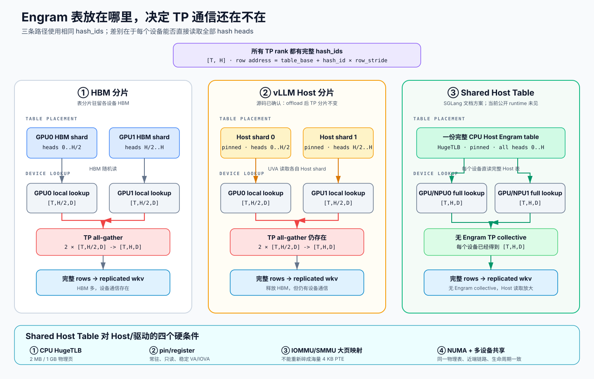

# DeepSeek-V4.1 Engram 适配分析报告

> 基于本地三仓库当前主线源码快照整理，日期：2026-09-11。本文只做代码分析，不修改 vLLM、vLLM-Ascend 或 SGLang 源码。

> **关于文中的引用。** 文中 `路径:行号` 指向工作区里对应仓库的本地检出，`xxx.md:行号` 指向工作区的本地报告；站上没有这些文件、点不开，已按纯文本保留，已上线的姊妹报告则保留为可点击链接。

## 1. 结论摘要

| 项目 | 当前源码状态 | 判断 |
|---|---|---|
| vLLM | `vllm/models/deepseek_v4_1/common/engram.py` 有完整实现，NVIDIA/AMD 模型均接入 | DSV4.1 Engram 已进入 runtime |
| SGLang | Cookbook 已描述 DSV4.1 Engram；公开 `deepseek_v4.py` 未发现 Engram module/config/forward 路径 | 文档/preview 先行，主线 runtime 尚未对齐 |
| vLLM-Ascend | 部署文档提供 `enable_engram`、`engram_storage`，插件 `AscendConfig` 未声明这两个字段，也没有 Engram 模块 | 更像专用镜像或未同步分支能力，当前插件源码无法独立审计 |

三个仓库均为干净工作树，当前提交分别为：

- vLLM：`84030bbe`
- vLLM-Ascend：`7a5b2473`
- SGLang：`9df72e8f`

## 2. Engram 在 DSV4.1 中做什么

Engram 是条件式 additive n-gram memory：

```text
token ids
  -> tokenizer 归一化/压缩
  -> 多阶 n-gram hash
  -> 多个 hash head 查表
  -> wkv 生成 key/value
  -> hidden stream 与 key 做归一化点积
  -> signed-sqrt + sigmoid gate
  -> 注入 mHC residual stream
```

它与 KV cache 不同：表是模型权重/外部存储，hash 结果是运行时按 token 流生成的；输出在指定 decoder layer 注入 residual，再由后续 mHC 子层继续处理。

## 3. vLLM：完整 Engram runtime

### 3.1 Token normalization 和 hash 输入

源码：`vllm/models/deepseek_v4_1/common/engram.py:96`

核心归一化逻辑如下：

```python
normalizer = normalizers.Sequence(
    [
        normalizers.NFKC(),
        normalizers.NFD(),
        normalizers.StripAccents(),
        normalizers.Lowercase(),
        normalizers.Replace(Regex(r"[ \t\r\n]+"), " "),
        normalizers.Replace(Regex(r"^ $"), sentinel),
        normalizers.Strip(),
        normalizers.Replace(sentinel, " "),
    ]
)
```

随后逐 token 解码并构造压缩映射：

```python
for token_id in range(len(tokenizer)):
    text = backend.decode([token_id], skip_special_tokens=False)
    if "\ufffd" in text:
        key = backend.id_to_token(token_id)
    else:
        normalized = normalizer.normalize_str(text)
        key = normalized if normalized else text

    new_id = key_to_new.get(key)
    if new_id is None:
        new_id = len(key_to_new)
        key_to_new[key] = new_id
    lookup[token_id] = new_id
```

因此 `" The"`、`"the"`、`"THE"` 会落到同一 compressed token id。压缩词表大小还参与 hash multiplier 的边界计算，不能只把它当作 bounds-checking 信息。

### 3.2 表布局和 hash state

源码：`vllm/models/deepseek_v4_1/common/engram.py:169`、`vllm/models/deepseek_v4_1/common/engram.py:383`

`EngramLayout` 按以下维度建立不重叠 bucket：

- Engram layer
- n-gram size（2-gram 到 `max_ngram_size`）
- hash head
- 每个 head 独立 prime bucket range

`NgramHashState` 在模型初始化时构建并保存：

- tokenizer token -> compressed id 的 `token_map`
- 每个 Engram layer/lookback 的 hash multiplier
- `primes` 和 `offsets`
- lookback depth
- V1 runner 使用的 slot-keyed rolling cache

源码中的状态初始化：

```python
self.lookback_depth = layout.max_ngram_size - 1
self.use_slot_cache = not vllm_config.use_v2_model_runner

token_map, vocab_size = build_compressed_token_map(tokenizer)
self.register_buffer("token_map", torch.tensor(token_map, dtype=torch.int32),
                     persistent=False)
self.register_buffer("primes", torch.tensor(layout.primes), persistent=False)
self.register_buffer("offsets", layout.offsets, persistent=False)
self.register_buffer("multipliers", multipliers, persistent=False)
```

### 3.3 FP8 表、per-32 scale、TP 和 UVA

源码：`vllm/models/deepseek_v4_1/common/engram.py:622`

`ParallelEngramEmbedding` 的实际存储类型：

```python
kwargs = {"device": "cpu", "pin_memory": True} if cpu_offload else {}
self.weight = nn.Parameter(
    torch.empty(
        self.part_num_embeddings,
        dim,
        dtype=torch.float8_e4m3fn,
        **kwargs,
    ),
    requires_grad=False,
)
self.weight_scale_inv = nn.Parameter(
    torch.empty(
        self.part_num_embeddings,
        dim // block_size,
        dtype=torch.uint8,
        **kwargs,
    ),
    requires_grad=False,
)
```

关键行为：

1. 按完整 hash head 在 TP rank 间分片，而不是把一个 head 的 bucket 随意切开。
2. embedding row 使用 FP8，默认 block size 为 32，scale 使用 `uint8`/`ue8m0`。
3. lookup 结果转为 BF16，供后续 `wkv` 使用。
4. `cpu_offload=True` 时，表驻留 pinned host memory，通过 UVA 建立 device view；TP 分片方式不改变。
5. sequence parallel 开启时，先做 token/head 维度上的相应 gather，再继续 Engram 计算。

### 3.4 注入 mHC 的位置和 gate

源码：`vllm/models/deepseek_v4_1/nvidia/model.py:338`、`vllm/models/deepseek_v4_1/common/engram.py:879`

调用顺序是：

```python
residual = mhc_post_tilelang(x, residual, post_mix, res_mix)
if self.engram is not None and engram_hashes is not None:
    residual = self.engram(
        residual,
        engram_hashes[:, self.engram.layer_hash_index],
        engram_mask,
    )
post_mix, res_mix, x, attn_pre = mhc_pre_delayed_tilelang(
    residual,
    self.hc_attn_fn,
    self.hc_attn_scale,
    self.hc_attn_base,
    self.rms_norm_eps,
    self.hc_eps,
    self.hc_eps,
    self.hc_post_alpha,
    self.hc_sinkhorn_iters,
    pre_mix=pre_mix,
    norm_weight=self.attn_norm.weight,
    norm_eps=self.attn_norm.variance_epsilon,
)
```

也就是说 Engram 位于“上一子层 `mhc_post` 之后、当前子层 `mhc_pre` 之前”，注入的是完整 hc stream。`Engram.forward` 先查表并执行 `wkv`，再用 hidden/key 的归一化点积计算 gate，经过 signed square-root 和 sigmoid 后生成受控 residual 增量。

### 3.5 一次 hash、统一预取、image dead mask

源码：`vllm/models/deepseek_v4_1/nvidia/model.py:553`

```python
engram_hashes = None
engram_mask = None
if (
    self.engram_hash is not None
    and input_ids is not None
    and is_forward_context_available()
):
    ...
    image_mask = image_sentinel_mask(input_ids)
    engram_mask = ~image_mask
    engram_hashes = self.engram_hash(...)

    for layer in self.layers:
        engram = getattr(layer, "engram", None)
        if engram is not None:
            engram.prepare_embeddings(
                engram_hashes[:, engram.layer_hash_index]
            )
```

实现含义：

- 整个 flattened batch 只计算一次 hash。
- 在进入 decoder layers 之前预取所有 Engram rows，减少 decoder 内部的随机查表开销。
- image sentinel token 被视为 dead token：它会切断 n-gram，且对应位置 gate 为零。
- Engram 只在配置的 layer 实例化；代码注释明确当前模型路径使用 layer 1 和 14。

### 3.6 V1/V2 runner 和 graph 约束

源码：`vllm/models/deepseek_v4_1/nvidia/model_state.py:44`

V2 runner 从 device 上保存的完整 token history 中 gather 当前请求 chunk 起点之前的 lookback window：

```python
all_token_ids = req_states.all_token_ids.gpu
depth = window.shape[1]
_gather_lookback_kernel[(window.shape[0],)](
    window,
    input_batch.idx_mapping,
    req_states.num_computed_tokens.gpu,
    all_token_ids,
    all_token_ids.stride(0),
    input_batch.idx_mapping.shape[0],
    DEPTH=depth,
    BLOCK_DEPTH=triton.next_power_of_2(depth),
)
model_inputs["lookback_token_ids"] = window
```

V1 runner 则使用和 SWA KV cache 绑定的 slot cache 兜底。为适配 CUDA graph，`lookback_token_ids` 是持久化 buffer，capture 时建立，replay 时原地填充；profile 阶段 KV cache 尚未绑定时跳过 Engram hash。

## 4. SGLang：文档描述存在，主线模型代码未接入

### 4.1 文档中的目标设计

源码/文档：`docs/cookbook/autoregressive/DeepSeek/DeepSeek-V4_1.mdx:93`

文档声称 DSV4.1 Engram 具备：

- 两层 additive n-gram hash memory
- hash 前 token normalization
- 两张 FP8 表
- 默认 TP row-shard
- `SGLANG_ENABLE_DSV41_ENGRAM_HOST_TABLE=1` 切换到 shared host table
- host table 以牺牲 host RAM、加载时间和 huge-page 要求换取 HBM 释放及减少 all-reduce

### 4.2 当前公开 runtime 的实际情况

当前 `python/sglang/srt/configs/deepseek_v4.py:48` 的 `DeepSeekV4Config` 没有 Engram 字段；当前 `python/sglang/srt/models/deepseek_v4.py` 中也未发现 Engram module、hash state、table lookup 或 forward 注入路径。

SGLang 里能看到完整 n-gram/PLE 风格 runtime 的位置是 `python/sglang/srt/models/qwen4_exp.py:93`。例如它有专门的 batch layout：

```python
class _PLEBatch(msgspec.Struct, frozen=True):
    mode: ForwardMode
    use_decode_fast_path: bool
    physical_tokens: int
    processed_tokens: int
    lengths: torch.Tensor
    row_width: int
    req_indices: torch.Tensor
    token_offsets: torch.Tensor
    valid_tokens: torch.Tensor
    state_indices: torch.Tensor
    ngram_context: Optional[torch.Tensor]
    ngram_eos_token_id: Optional[int]
```

并且明确限制：

```python
if forward_batch.tbo_parent_token_range is not None:
    raise NotImplementedError("Qwen4 PLE is not compatible with two-batch overlap")
if spec_algorithm is not None and spec_algorithm.is_ngram():
    raise NotImplementedError("Qwen4 PLE does not support NGRAM speculation")
```

这说明 SGLang 已经有可复用的 PLE/UVA/预取基础设施，但不能把 Qwen4-Exp PLE 实现直接当成 DSV4.1 Engram。基于当前 checkout，更准确的结论是：

> SGLang 的 DSV4.1 Engram 处于 cookbook/preview 描述阶段，公开主线 `deepseek_v4.py` 还没有与 vLLM 同等的 Engram runtime。

## 5. vLLM-Ascend：部署文档与插件 schema 不一致

### 5.1 文档使用的配置

文档：`docs/source/tutorials/models/DeepSeek-V4.1-Flash.md:237`

示例命令传入：

```bash
--additional-config '{
  "enable_engram": true,
  "engram_storage": "int8",
  "enable_cpu_binding": true,
  "ascend_compilation_config": {
    "enable_npugraph_ex": false,
    "enable_static_kernel": false
  }
}'
```

文档还写明该部署验证过 W8A8 权重、INT8 Engram storage、TP8/DP4/EP32、DSpark 以及 `FULL_DECODE_ONLY` ACL Graph。

### 5.2 当前插件源码的约束

源码：`vllm_ascend/ascend_config.py:383`、`vllm_ascend/ascend_config.py:1479`

`AscendConfig` 使用 `extra="forbid"`，字段表中没有 `enable_engram` 或 `engram_storage`；工厂函数还会计算未知 key。因此仅凭当前插件仓库，无法确认上述文档命令能够由该 checkout 独立解析并执行。

当前能从插件源码确认的 DSV4 适配主要是：

- DSA-CP 和多流 overlap
- compressor/indexer 相关 NPU 路径
- DSV4 cache layout/transposition
- DSpark/ACL graph 配套
- MXFP8/MXFP4、MC2/MegaMoe 通信融合
- A2/A3 多节点部署

所以 vLLM-Ascend 的合理判定是：Engram 能力来自专用镜像、配套的 vLLM 版本或尚未同步的内部实现；当前公开插件源码不是完整实现载体。

### 5.3 Shared Host Table 的数据路径

这里的大页指 **CPU Host DRAM 使用的 HugeTLB 大页**，不是 NPU/GPU HBM 大页。设备不会搜索整张 Engram 表，而是先根据 hash id 算出目标 row 地址，再直接读取该地址：



这张图最重要的分界不是“表在 HBM 还是 Host”，而是**一个设备能否直接读取全部 hash heads**。左、中两列都只能生成 `[T,H/TP,D]` 的 local rows，所以表即使移到 Host，TP all-gather 仍然存在；右列让每个设备从同一份完整 Host 表生成 `[T,H,D]`，才消除了 Engram 专属 collective。代价也从图中下移到了 Host/驱动层：完整表直读要求 HugeTLB、稳定 pin/register、设备侧大页 IOVA/SMMU 映射以及正确的 NUMA/多设备共享。

```text
token ids
  -> NPU/GPU 计算 n-gram hash id
  -> 计算 host_table_base + row_id * row_stride
  -> 设备 MMU + IOMMU/SMMU 完成 Host 虚拟地址映射
  -> 通过 PCIe、C2C 或平台互联读取 CPU DRAM
  -> 解量化 FP8/INT8 row 和 scale
  -> 生成完整 Engram rows/output
```

如果 Host table 是每个 TP rank 各自持有的 shard，则设备只能得到 local rows，后面仍然需要 TP all-gather 或局部投影后的 all-reduce。当前 vLLM 的 CPU offload 就是这种方案，源码注释明确写着 `the TP sharding is unchanged either way`。

如果一份完整 Host table 被所有 TP rank 映射并且每个设备都能读取全部 hash heads，则每个 rank 可以独立生成完整 Engram rows：

```text
                       CPU shared full table
                      /                     \
        UVA/SVM host gather             UVA/SVM host gather
                    /                         \
             NPU/GPU 0                    NPU/GPU 1
           full rows [T,H,D]            full rows [T,H,D]
                    |                         |
                   wkv                       wkv
```

此时可以消除 Engram 专属的 TP all-gather；如果原实现是在 `wkv` 后合并局部贡献，也可以消除对应的 TP all-reduce。Attention、MoE、mHC 等其他模型 collective 不会因此消失。

共享完整表是在用 Host 访问换 GPU/NPU 间通信：每个设备从原来读取约 `H/TP` 个 heads，变成读取全部 `H` 个 heads。它减少 HBM 和 collective，但增加 Host DRAM、PCIe/C2C、IOMMU/SMMU 和多设备重复读取压力。

### 5.4 对 Host 操作系统、驱动和 runtime 的诉求

要让 shared Host table 真正可用，不能只调用普通 CPU 内存分配。Host 侧至少需要下面几层配合。

#### 5.4.1 Huge-page-backed 分配

- 为 Engram 表预留 2 MB 或 1 GB HugeTLB pages，并通过 `hugetlbfs`、`memfd` 或等价大页分配接口建立共享映射。
- 保证基地址、长度和 row stride 满足大页、DMA 及设备访问的对齐要求。
- 透明大页 THP 可以作为辅助，但不应作为强保证；内存 pin/register 后是否仍保持大页映射要由内核和驱动实际验证。
- 容器部署时需要透传 hugepage limit/mount，Host 还要提供足够的锁页额度，例如相应的 `RLIMIT_MEMLOCK`。

大页优化的是地址翻译，不是 Engram 算法本身：

```text
4 KB pages  -> 页表项多、TLB 覆盖小、随机访问更容易 page walk
2 MB pages  -> 单个 TLB entry 覆盖范围扩大 512 倍
1 GB pages  -> 单个 TLB entry 覆盖范围进一步扩大
```

#### 5.4.2 Host memory pin/register

- 驱动需要提供把用户态共享大页注册为设备可 DMA/直接访问内存的接口。
- 注册后页面必须常驻，不能 swap、迁移或在模型运行期间改变物理 backing。
- 驱动要返回设备可用的稳定地址：GPU 通常体现为 UVA/device alias；NPU 需要 CANN/设备驱动提供等价的 Host registration、SVM/UVA 或零拷贝映射能力。
- 注册最好支持批量大范围内存，避免把巨大表拆成海量小注册区间，否则初始化时间、驱动元数据和 IOMMU 映射成本都会很高。

普通的 `malloc`、匿名 4 KB 页或仅仅 `pin_memory=True` 不必然满足“共享大页 + 多设备稳定映射”的全部要求。

#### 5.4.3 IOMMU/SMMU 地址翻译能力

- Host IOMMU 或 NPU 侧 SMMU 必须能够建立并长期保持大范围 Host memory 映射。
- 最好支持大页 IOVA 映射，避免 CPU 使用 2 MB/1 GB 大页，但驱动最终仍把设备页表拆成大量 4 KB PTE。
- 如果平台支持 ATS/PASID/SVA，驱动需要正确管理设备 TLB、进程地址空间标识和失效通知；不支持时则需要稳定的 IOVA 映射。
- 驱动应避免频繁 map/unmap 和 TLB shootdown，Engram 表应在模型生命周期内一次注册、长期复用。

这里的性能链路是：

```text
NPU/GPU TLB
  -> 设备页表或 ATS 请求
  -> Host IOMMU/SMMU
  -> CPU physical huge page
  -> Host DRAM
```

因此即使 CPU 端已经申请大页，也需要确认设备侧最终看到的映射粒度；只优化 CPU page table，而设备 IOVA 仍被拆成 4 KB，收益会明显打折。

#### 5.4.4 多进程、多设备共享一份物理表

- TP worker 通常是多个进程，驱动/runtime 需要允许各进程导入同一块共享 Host allocation，而不是分别复制一份表。
- 多个 NPU/GPU 应映射到同一组 CPU 物理页；每个进程可以有不同虚拟地址，但设备 kernel 使用的 base pointer 必须对应正确映射。
- 需要引用计数和生命周期管理：最后一个 worker 退出前不能解除注册，异常退出后也要能够回收锁页和设备映射。
- CUDA/NPU graph capture 场景需要指针稳定，模型运行过程中不能重新分配或替换 table backing。

#### 5.4.5 NUMA 和设备拓扑感知

Host table 应优先放在距离目标设备最近的 NUMA node：

```text
推荐：NPU0 -> local PCIe root/C2C -> NUMA0 HugePage
退化：NPU0 -> NUMA0 -> socket interconnect -> NUMA1 HugePage
```

如果一份表要被跨 socket 的多个设备共享，需要在“单份物理表”和“每 socket 一份副本”之间权衡：前者节省 Host RAM，后者通常能减少跨 NUMA 流量。驱动/runtime 最好暴露设备到 NUMA node、PCIe root complex 和链路带宽信息，供部署层决定 placement。

#### 5.4.6 一致性、可观测性和降级

- Engram 权重加载完成后应作为只读表使用；驱动/runtime 要保证 CPU 写入完成后设备可见，并提供必要的同步或 cache flush 语义。
- 应能查询是否支持 Host 直访、大页映射粒度、最大注册容量、注册对齐、可用 aperture/IOVA 空间和并发设备数。
- 应提供 Host page fault、IOMMU/SMMU fault、TLB miss、PCIe/C2C read bandwidth 和 NUMA remote access 等指标，否则很难判断瓶颈是在表查找、地址翻译还是互联带宽。
- 当大页不足、Host registration 失败、设备不支持直访或拓扑不合适时，需要安全降级到 HBM shard、Host shard + collective，或显式启动失败，不能静默退化为不可控的 4 KB pageable memory 路径。

#### 5.4.7 对 NPU/Ascend 的具体判断边界

对 Ascend/NPU，所需能力可以概括为：

```text
HugeTLB shared allocation
  + Host page pin/register
  + NPU 可访问的稳定 VA/IOVA
  + SMMU 大页映射与长期驻留
  + 多进程/多 NPU 导入同一物理 allocation
  + 异步 kernel 直读及 graph 指针稳定
  + NUMA/topology placement 和性能计数器
```

但当前 vLLM-Ascend 公开插件源码没有展示 DSV4.1 Engram host-table runtime，因此不能仅凭部署文档确认 CANN/驱动已经提供上述全部接口，也不能确认实际路径是 NPU 对 Host row 的细粒度直读，还是 Host gather 后批量搬运到 HBM。需要结合专用镜像中的实现、CANN API 调用和性能计数器进一步确认。

## 6. 三套方案对比

| 维度 | vLLM | SGLang | vLLM-Ascend |
|---|---|---|---|
| Hash 输入 | tokenizer 归一化后的 compressed id | 文档称归一化 id；runtime 未见 | 文档称支持；源码未见 |
| Hash state | token map、multiplier、prime、offset、lookback、V1 slot cache | DSV4 runtime 未见 | 未见 |
| 表布局 | layer × n-gram × head 的独立 prime bucket | 文档称两张 FP8 表 | 文档称 INT8 storage |
| TP 分片 | 完整 hash head 分片，必要时 gather | 文档称 row-shard | 文档称 TP8，schema 未声明 Engram |
| Host offload | pinned CPU + UVA | `SGLANG_ENABLE_DSV41_ENGRAM_HOST_TABLE` 文档开关 | `enable_cpu_binding` 不是 Engram 实现证明 |
| 查表精度 | FP8 + per-32 `ue8m0` scale，输出 BF16 | 文档称 FP8 | 文档称 INT8 |
| 注入位置 | `mhc_post` 后、`mhc_pre` 前 | 未发现 | 未发现 |
| Prefetch | 全 batch hash 一次，decoder 前预取 | 未发现 DSV4 对应路径 | 未发现 |
| Image token | dead mask 切断 n-gram，gate 置零 | 未发现 | 未发现 |
| Spec/graph | V2 lookback buffer；V1 slot cache；graph 需持久 buffer | Qwen PLE 有 TBO/NGRAM/topk 限制，但非 DSV4 Engram | 文档使用 V1 + ACL graph |

## 7. 其他重大变动

### 7.1 vLLM：完整 DSV4.1 模型栈落地

DeepSeek V4.1 合入 commit `9b959b86`，统计为 `47 files changed, 12902 insertions(+), 196 deletions(-)`。新增独立 `vllm/models/deepseek_v4_1/`，不只是 Engram 文件，覆盖：

- NVIDIA/AMD 两套模型实现
- DSA sparse attention、sparse MLA、candidate blocks
- compressor、indexer、cache utilities
- DSpark speculative decoding
- mHC/Sinkhorn/mixing kernels
- FP8/MXFP8/MXFP4 quantization
- vision、多模态输入和 tokenizer/reasoning/tool parser
- MoE router、KV/cache backend 及 attention registry 调整

因此 Engram 只是完整模型落地中的一个子系统，性能和显存表现还受到 sparse attention、压缩 KV、mHC、DSpark 及量化 kernel 的共同影响。

### 7.2 SGLang：重点是 compressed pool、metadata 和执行融合

近期 DSV4 相关改动重点包括：

- compressed KV pool 管理重构（`41da06ad`）
- V4.1 metadata 命名和 disaggregation wire 调整（`dc5f59c3`）
- DSA/indexer backend
- SWA bounded replay
- mHC 单遍执行
- DSpark
- Qwen4-Exp 的 PLE、UVA、prefetch、fusion 基础设施

这些改动会影响 cache 生命周期、attention backend 和调度，但不能反向证明 DSV4.1 Engram 已经在公开 `deepseek_v4.py` 中接入。

### 7.3 vLLM-Ascend：硬件适配和部署工程为主

当前插件的大改动集中在 Ascend 执行路径：

- DSA-CP、compressor/indexer NPU kernel
- MXFP8/MXFP4 和 W8A8
- DSpark、ACL graph
- KV cache layout/transposition
- MC2/MegaMoe 通信与 shared-expert 融合
- A2/A3 多节点部署

Engram 在文档里作为部署特性出现，但尚未在插件源码形成独立、可追踪的实现模块。

## 8. 版本和配置风险

### 8.1 vLLM 内部存在两套 Engram 配置演进

通用配置 `vllm/config/engram.py:30` 当前校验仍面向 CUDA Qwen4-Exp：

```python
supported_architectures = {
    "Qwen4ExpForCausalLM",
    "Qwen4ExpForConditionalGeneration",
}
...
and getattr(model_config.hf_text_config, "ple_layer_ids", None)
```

而 DSV4.1 使用模型配置中的 `engram_layer_ids`、`engram_num_embeddings`、`engram_max_ngram_size`、`engram_n_heads`，由 `EngramLayout.from_config()` 直接读取。`Engram` 在没有显式 `engram_config` 时还会默认 `cpu_offload=True`。

这表示当前代码存在两套命名/配置路径：

- Qwen4-Exp：`PLE` + 通用 `EngramConfig`
- DeepSeek V4.1：模型字段 `engram_*` + 模型内置 `EngramLayout`

### 8.2 不能用文档开关推断 runtime 已同步

三仓库当前最容易踩的坑是：

1. SGLang 文档中的 host-table 环境变量不等于 `deepseek_v4.py` 已有实现。
2. vLLM-Ascend 文档中的 `enable_engram`/`engram_storage` 不等于当前 `AscendConfig` 可接受这些字段。
3. vLLM 主线的 Engram 实现依赖 DSV4.1 模型配置和专用 runner 状态，不能只 cherry-pick 一个 embedding 文件。

## 9. 最终判断

- 如果要审计“源码已经怎么做”：以 vLLM 的 `deepseek_v4_1/common/engram.py`、`nvidia/model.py`、`nvidia/model_state.py` 为主，它已经覆盖 hash、表存储、TP/UVA、gate、prefetch、image mask 和 graph lookback。
- 如果要判断“某个发行版是否真的可跑”：必须同时核对模型代码、配置 schema、runner/graph、权重命名和启动镜像，不能只看 cookbook 或部署文档。
- 当前三仓库的成熟度排序是：**vLLM runtime 完整 > SGLang 文档/preview > vLLM-Ascend 文档配套但插件源码缺口明显**。
