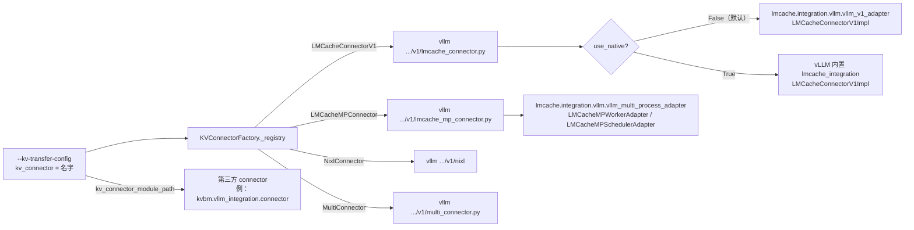
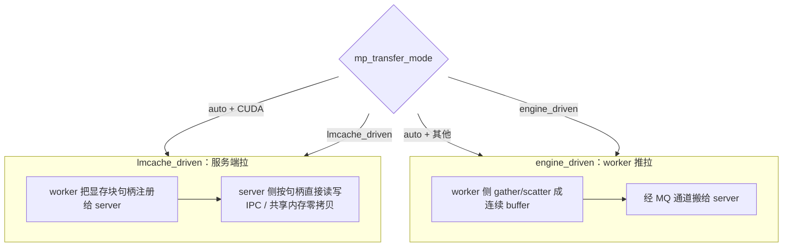
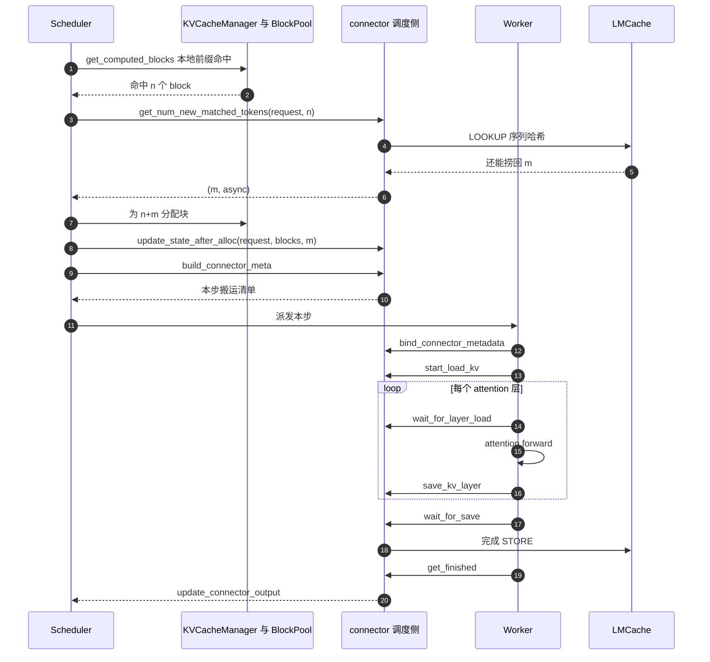
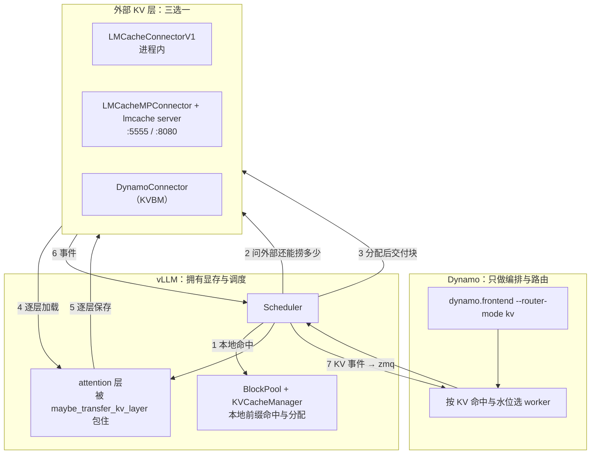

# Dynamo + vLLM + LMCache：三者怎么搭、接口在哪、一次请求怎么走

> 本文基于本地源码静态分析，版本如下：
>
> - Dynamo：`daf44c6bf1`
> - vLLM：`568afb3a`（`git describe` = `v0.26.0`）
> - LMCache：`b5d109ea`
>
> 没有 GPU 环境，因此文中所有时序都是**代码上的调用顺序**，不是实测时间线。指标端口、进程关系
> 这类需要真跑才能确认的部分，我会明确标成「代码所示」还是「实测未见」。
>
> 有一处版本错位需要先说清楚：**dynamo 自己钉的是 `vllm==0.25.1`**（`code/scheduling/dynamo/pyproject.toml:62`），
> 而本站的 vLLM 分析基线是 `v0.26.0`。本文凡是引用 vLLM 内部实现的锚点，都是对着 `568afb3a` 核过的，
> 在 0.25.1 上可能有出入；凡是只依赖 connector 公共契约的结论，两个版本都成立。

## 目录

- [0. 先把三方的边界钉死](#0-先把三方的边界钉死)
- [1. 三种搭法：拓扑、进程与端口](#1-三种搭法拓扑进程与端口)
- [2. 接口之一：配置面](#2-接口之一配置面)
- [3. 接口之二：调用面，KVConnectorBase_V1 的契约](#3-接口之二调用面kvconnectorbase_v1-的契约)
- [4. 接口之三：MP 的进程间协议面](#4-接口之三mp-的进程间协议面)
- [5. 一次请求的完整调用链](#5-一次请求的完整调用链)
- [6. 分离模式下三方怎么组合](#6-分离模式下三方怎么组合)
- [7. 约束、失效模式与坑](#7-约束失效模式与坑)
- [8. 选型对照：不只有 LMCache](#8-选型对照不只有-lmcache)
- [9. 一张图总结](#9-一张图总结)
- [附录 A：文档与代码不一致的地方](#附录-a文档与代码不一致的地方)
- [附录 B：未确认](#附录-b未确认)

---

## 0. 先把三方的边界钉死

三者不是三个平级的 KV 缓存实现，而是三层职责完全不同的东西。混在一起的第一个后果就是：
看到 `LMCacheConnectorV1` 会以为 LMCache 接管了 vLLM 的 block manager；看到 dynamo 的
`PdConnector` 会以为它是 vLLM 自带的东西。都不是。

| | Dynamo | vLLM | LMCache |
|---|---|---|---|
| 在链路里的位置 | 编排层，进程外 | 推理引擎，拥有显存里的 KV | 外部 KV 层，拥有显存外的 KV |
| 它拥有的 KV | 不拥有。只维护「哪个 worker 上有什么」的路由视图 | 显存块：分配、序列哈希、引用计数、淘汰 | 显存外的 chunk：CPU 内存（L1）、盘/对象存储（L2） |
| 对 KV 的权限 | 只读（看事件、看水位） | 读写，且是权威 | 通过 connector 接口搬运，不改 vLLM 的分配 |
| 与另外两方的关系 | 拉起 worker，把请求路由过去 | 提供 `KVConnectorBase_V1` 这个缝 | 实现这个缝，并提供 `lmcache server` |
| 版本 | `daf44c6bf1` | `568afb3a` | `b5d109ea` |

三条需要先记住的结论：

1. **LMCache 不是 vLLM block manager 的替代品。** vLLM 的 `BlockPool` 与前缀缓存照常运行，
   LMCache 只在 vLLM 说「本地已经命中到这里」之后，接着问「host/disk 里还能再捞回多少」。
   connector 的契约原文就是 *"the number of tokens that can be loaded from the external KV cache
   **beyond the num_computed_tokens**"*（`vllm/distributed/kv_transfer/kv_connector/v1/base.py:461`，
   LMCache 的壳里同一句话在 `vllm/distributed/kv_transfer/kv_connector/v1/lmcache_connector.py:266`）。
2. **connector 的类住在 vLLM 仓库里，不只是在 LMCache 里。** `LMCacheConnectorV1` 与
   `LMCacheMPConnector` 这两个名字注册在 vLLM 的工厂
   （`vllm/distributed/kv_transfer/kv_connector/factory.py:164-167` 与 `:170-173`），
   指向 `vllm/distributed/kv_transfer/kv_connector/v1/lmcache_connector.py` 与
   `vllm/distributed/kv_transfer/kv_connector/v1/lmcache_mp_connector.py`。
   LMCache 提供的是这些类背后真正干活的 adapter 与 engine。
3. **dynamo 自己也有 KV 卸载栈（KVBM），和 LMCache 是同一位置的竞品，不是叠加关系。**
   两者都是「vLLM 的外部 KV 层」，同一次部署里选一个（或通过 `PdConnector` 并列，但那时
   各自扮演不同角色，见 [第 6 节](#6-分离模式下三方怎么组合)）。

### 0.1 三个名字的撞车

读这套代码最先被绊住的是重名。先把它们分开：

| 名字 | 在哪 | 是什么 |
|---|---|---|
| 「block manager」 | dynamo `lib/llm/src/block_manager`、`lib/kvbm-*` | Dynamo 的 KVBM，另一套外部 KV 层 |
| 「sidecar」 | dynamo `lib/sidecar/vllm` | 把 Dynamo worker 接到 vLLM 原生 gRPC 服务的 Rust 进程（`lib/sidecar/README.md:1`） |
| 「MP sidecar」 | 本文语境 | `lmcache server`，LMCache 的多进程缓存引擎 |
| `LMCacheConnectorV1` | vLLM 与 LMCache 各有一份实现 | vLLM 里是薄壳，LMCache 里是 `LMCacheConnectorV1Impl` |

dynamo 的 sidecar 和 LMCache 的 MP sidecar 毫无关系，只是都叫 sidecar。

---

## 1. 三种搭法：拓扑、进程与端口

dynamo 仓库里有四个 LMCache 启动脚本，正好对应三种搭法。**搭法由一行 `--kv-transfer-config` 决定**，
其余都是进程怎么摆的问题。

### 1.1 搭法一：聚合 + 进程内 LMCache

脚本：`examples/backends/vllm/launch/agg_lmcache.sh`

```text
python -m dynamo.frontend &
python -m dynamo.vllm --model ... \
  --kv-transfer-config '{"kv_connector":"LMCacheConnectorV1","kv_role":"kv_both"}'
```

两个进程。缓存引擎就在 vLLM worker 进程里：`LMCacheEngine` 申请一块本进程的 CPU 内存当 L1，
大小由 `max_local_cpu_size` 决定（`lmcache/v1/cache_engine.py:2058-2080` 里按 GB 换算成字节交给
`MixedMemoryAllocator`）。
没有额外端口，也没有独立的 sidecar 生命周期。启动脚本除了 `unset PROMETHEUS_MULTIPROC_DIR`
（让 dynamo 自己接管多进程指标目录，`agg_lmcache.sh:8`）之外没有别的特殊处理。

变体：`agg_lmcache_multiproc.sh` 反过来**显式设置** `PROMETHEUS_MULTIPROC_DIR` 到一个每次运行
唯一的目录，并在退出时删掉（`agg_lmcache_multiproc.sh:8-18`）。同一份 connector 配置，区别只在
指标文件的归属方式。

### 1.2 搭法二：聚合 + MP sidecar（当前推荐）

脚本：`examples/backends/vllm/launch/agg_lmcache_mp.sh`

进程与端口的对应关系（都是脚本里可改的默认值）：

| 进程 | 端口 | 脚本行 |
|---|---|---|
| `lmcache server` | MQ `5555`（`LMCACHE_PORT`）、HTTP admin `8080`（`LMCACHE_HTTP_PORT`） | `agg_lmcache_mp.sh:26`、`:27`、`:32-34` |
| `dynamo.frontend` | HTTP `8000`（`DYN_HTTP_PORT`） | `agg_lmcache_mp.sh:46` |
| `dynamo.vllm` worker | metrics/健康 `8081`（`DYN_SYSTEM_PORT`） | `agg_lmcache_mp.sh:48-54` |

启动顺序是**先缓存、后 worker**，而且中间有一次真的健康检查，不是 `sleep`：

```text
lmcache server --l1-size-gb 16 --eviction-policy LRU --port 5555 --http-port 8080 &
until curl -sf http://localhost:8080/healthcheck; do sleep 1; done   # 最多等 60 秒
python -m dynamo.frontend &
python -m dynamo.vllm ... --kv-transfer-config '{... "lmcache.mp.port":5555}'
```

回收靠脚本开头的 `trap 'echo Cleaning up...; kill 0' EXIT`（`agg_lmcache_mp.sh:6`），
worker 先死则整个进程组被 `kill 0` 拆掉。

这一形态的 worker 额外带 `--disable-hybrid-kv-cache-manager`（`agg_lmcache_mp.sh:53`）。
它是不是**必需**取决于当时装载的是哪一份 `LMCacheMPConnector`，见
[第 7.1 节](#71-hma-与-supportshma)。

### 1.3 搭法三：分离（PD 分离）+ PdConnector

脚本：`examples/backends/vllm/launch/disagg_lmcache.sh`。三个进程：

| 角色 | GPU | connector 配置 | 脚本行 |
|---|---|---|---|
| frontend（KV 路由模式） | 无 | — | `disagg_lmcache.sh:17` |
| decode worker | 0 | **不给 `--kv-transfer-config`** | `disagg_lmcache.sh:20` |
| prefill worker | 1 | `PdConnector` 包住 LMCache + NIXL | `disagg_lmcache.sh:26-32` |

prefill 侧那行配置是本文的关键样本，逐字抄下来：

```text
--kv-transfer-config '{"kv_connector":"PdConnector","kv_role":"kv_both",
  "kv_connector_extra_config":{"connectors":[
     {"kv_connector":"LMCacheConnectorV1","kv_role":"kv_both"},
     {"kv_connector":"NixlConnector","kv_role":"kv_both"}]},
  "kv_connector_module_path":"kvbm.vllm_integration.connector"}'
```

三个细节值得单独指出：

- **`PdConnector` 是 dynamo 的实现，不是 vLLM 的。** 名字来自 `kv_connector_module_path`
  指向的 `kvbm.vllm_integration.connector`（`disagg_lmcache.sh:31`）。它继承 vLLM 的
  `MultiConnector`，配置形状一样（`components/src/dynamo/vllm/kv_connector_protocols.py:117-118`）。
- **decode 侧反而不配 LMCache。** 脚本只写 `python3 -m dynamo.vllm --model`，没有任何 KV 参数
  （`disagg_lmcache.sh:20`）；而 dynamo 的文档说 decode 用 `LMCacheConnectorV1`。这是文档过时，
  见 [附录 A](#附录-a文档与代码不一致的地方)。
- **prefill 侧还开了 KV 事件**：`--kv-events-config '{"publisher":"zmq","topic":"kv-events","endpoint":"tcp://*:20081","enable_kv_cache_events":true}'`
  （`disagg_lmcache.sh:32`），frontend 用 `--router-mode kv`（`disagg_lmcache.sh:17`）消费它。
  这是 LMCache 的缓存状态**唯一**回到 dynamo 路由打分的通路，见 [第 6.3 节](#63-缓存状态怎么回到路由)。

### 1.4 三种搭法对照

| | 进程内 | MP sidecar | 分离 + PdConnector |
|---|---|---|---|
| connector | `LMCacheConnectorV1` | `LMCacheMPConnector` | `PdConnector`（内含两者） |
| 缓存引擎位置 | worker 进程内 | 独立 `lmcache server` | prefill 进程内 |
| KV 复用的范围 | 本 worker | 所有连到同一个 server 的 worker | prefill worker 之间 |
| 跨实例的 KV 搬运 | 不做 | 不做（server 是共享缓存，不是传输层） | NIXL 做 P→D 传输 |
| 额外端口 | 无 | 5555 + 8080 | NIXL side channel `20097`、事件 `20081` |
| 启动脚本 | `agg_lmcache.sh` | `agg_lmcache_mp.sh` | `disagg_lmcache.sh` |
| 卸载与复用是否可以分散在不同实例 | 否 | 是（多 worker 共用一个 server） | 是 |

### 1.5 dynamo 在配置这一步做了什么

很多人以为 dynamo 会自动替你配好 connector。**这个行为已经去掉了。** 现在的规则是显式的：

- `--connector` 这个旧参数被硬拒（`components/src/dynamo/vllm/args.py:516`，报错文案在 `:536`），
  错误信息直接给迁移目标；`--connector none` 也报错，因为默认本来就没有 connector。
- 分离模式的 **prefill** worker 必须显式给 `--kv-transfer-config`，否则直接抛错
  （`components/src/dynamo/vllm/args.py:217`，文案在 `:226-231`）：

```text
"--connector is deprecated and the default is no longer nixl. "
"When using --disaggregation-mode prefill, you must explicitly "
"provide --kv-transfer-config. Example: ... NixlConnector ..."
```

dynamo 真正自动做的只有两件小事：把 `enable_prefix_caching` 默认成 `True`
（`components/src/dynamo/vllm/args.py:283`），以及准备 `kv_events_config`
（`components/src/dynamo/vllm/args.py:409`）。后者只在用户自己给了 `--kv-events-config` 时才返回非空
——`create_kv_events_config` 在「用户没给」这一支上是 `return None`（`components/src/dynamo/vllm/args.py:428`），
也就是说**事件默认不开**，要开得自己写（脚本里就是这么写的）。

---

## 2. 接口之一：配置面

配置面有两层：vLLM 的 `KVTransferConfig` 决定装哪个 connector，connector 自己的
`kv_connector_extra_config` 决定这个 connector 怎么工作。

### 2.1 名字到类的解析



注册表是懒加载的：`register_connector(name, module_path, class_name)` 只记一个 loader
（`vllm/distributed/kv_transfer/kv_connector/factory.py:32-40`），真正 `importlib.import_module`
发生在用的时候。所以 `LMCacheMPConnector` 这个模块一旦被导入就会 `import lmcache.*`
（`vllm/distributed/kv_transfer/kv_connector/v1/lmcache_mp_connector.py:11-12`），
**没装 LMCache 而写了这个名字，报错发生在初始化阶段而不是启动参数校验阶段。**

`use_native` 是个值得知道的开关：`LMCacheConnectorV1` 的 `__init__` 会读
`kv_connector_extra_config["use_native"]`，`True` 就用 vLLM 仓库里内置的那份实现，
否则（默认）用 LMCache 包自己那份（`vllm/distributed/kv_transfer/kv_connector/v1/lmcache_connector.py:93-113`）。
两条路的差别是「谁的代码更新」，排查问题时先确认这一位。

### 2.2 `kv_connector_extra_config` 的两套前缀

LMCache 的两条路用两套完全不同的 key 前缀，这是最容易配错的地方。

**进程内（`lmcache.*`）** 走的是 LMCache 的 engine 配置。生产样本在
`recipes/kimi-k2.6/vllm/agg-h200-chat/deploy.yaml:31-42`：

| key | 样本值 | 说明 | 代码默认值 |
|---|---|---|---|
| `lmcache.enable_kv_events` | `false` | 是否把 store 事件报给 vLLM 的事件管道 | `lmcache/v1/config.py:574` |
| `lmcache.local_cpu` | `true` | 开 L1 | 默认 `True`，`lmcache/v1/config.py:91-95` |
| `lmcache.max_local_cpu_size` | `500` | L1 大小，单位 GB | 默认 `5.0`，`lmcache/v1/config.py:96` |
| `lmcache.pre_caching_hash_algorithm` | `sha256_cbor` | chunk 哈希算法 | 默认 `builtin`，`lmcache/v1/config.py:131-135` |
| `lmcache.extra_config.save_only_first_rank` | `true` | MLA 下只让一个 rank 存 | 默认等于 `use_mla`，`lmcache/v1/cache_engine.py:116-120` |

**MP（`lmcache.mp.*`）** 走的是 adapter 的配置。键名与默认值集中在一个枚举里
（`lmcache/integration/vllm/vllm_multi_process_adapter.py:52`，前缀常量 `lmcache.mp.` 在同文件 `:104`）：

| key（省掉 `lmcache.mp.` 前缀） | 默认值 | 说明 | 行号 |
|---|---|---|---|
| `host` | `localhost` | server 地址 | 见同文件 `:268` 的报错提示 |
| `port` | `5555` | server 的 MQ 端口 | 同上 |
| `mq_timeout` | `300.0` 秒 | 阻塞式 MQ 请求（注册、查 chunk size 等）的超时 | `:75` |
| `heartbeat_interval` | `10.0` 秒 | 心跳间隔 | `:78` |
| `mp_transfer_mode` | `auto` | 搬运方式，见 [4.3](#43-两种搬运方式) | `:86` |
| `isolated_ipc` | `False` | 容器间无共享 IPC 命名空间时必须与服务端一致 | `:91` |
| `use_vmm_api` | `False` | 引擎用 CUDA VMM 分配 KV（vLLM 的 `--enable-cumem-allocator`）时改走 VMM IPC | `:96` |

在聚合 MP 脚本里只传了 `lmcache.mp.port`（`agg_lmcache_mp.sh:54`），其余吃默认值。

### 2.3 一份能对照的「谁决定了什么」

| 决定 | 谁决定 | 怎么决定 |
|---|---|---|
| 用不用外部 KV 层 | 用户 | 有没有给 `--kv-transfer-config` |
| 用哪个外部 KV 层 | 用户 | `kv_connector` 名字 |
| 能不能同时挂多个 | 用户 + vLLM | `PdConnector` / `MultiConnector` 的 `connectors` 列表 |
| 显存块怎么分 | vLLM | `BlockPool`，与 connector 无关 |
| 本地前缀命中多少 | vLLM | `KVCacheManager.get_computed_blocks` |
| 外部还能命中多少 | LMCache | connector 的 `get_num_new_matched_tokens` |
| 用不用 hybrid KV cache manager | vLLM，但受 connector 能力位影响 | `SupportsHMA`，见 7.1 |
| 缓存状态要不要报给路由 | 用户 | `--kv-events-config` + `lmcache.enable_kv_events` |

---

## 3. 接口之二：调用面，KVConnectorBase_V1 的契约

配置面只是「装哪个」，真正决定行为的是 vLLM 什么时候调 connector 的哪个方法。这套契约集中
定义在 `vllm/distributed/kv_transfer/kv_connector/v1/base.py`，文件头部的 docstring（`:1-41`）
就是官方的生命周期说明。它把方法分成两组，**分属两个进程**：

- **Scheduler-side**：与调度器同进程，只能用 `Scheduler` 里的东西；
- **Worker-side**：与模型执行同进程，可以用 `ForwardContext`、可以碰显存。

一个 connector 类会被实例化两次，靠构造参数 `KVConnectorRole` 区分
（`vllm/distributed/kv_transfer/kv_connector/factory.py:43`，枚举定义在 `vllm/distributed/kv_transfer/kv_connector/v1/base.py:124`）。
LMCache 的两条路都遵守这个约定：`DynamoConnector` 也是按 role 分成 leader/worker 两个对象。

### 3.1 方法清单

| 方法 | 定义位置 | role | 被调用的时机 | 语义要点 |
|---|---|---|---|---|
| `get_num_new_matched_tokens` | `vllm/distributed/kv_transfer/kv_connector/v1/base.py:454` | scheduler | 每一步调度一个新请求、vLLM 算完本地命中之后 | 返回 `(token 数, 是否异步)`；**只考虑最大的可用前缀**；返回 `None` 表示「还没查完，稍后再问」，此时第二项必须为 `True` |
| `update_state_after_alloc` | `vllm/distributed/kv_transfer/kv_connector/v1/base.py:489` | scheduler | vLLM 已经为这些外部 token 分配好显存块之后 | 告诉 connector「块给你了，往里装」 |
| `build_connector_meta` | `vllm/distributed/kv_transfer/kv_connector/v1/base.py:515` | scheduler | 每步调度结束时 | 产出的 metadata 会随 `SchedulerOutput` 发给 worker |
| `update_connector_output` | `vllm/distributed/kv_transfer/kv_connector/v1/base.py:537` | scheduler | worker 的结果回流到调度器时 | 回收 worker 侧状态，事件也走这里 |
| `request_finished` | `vllm/distributed/kv_transfer/kv_connector/v1/base.py:547` | scheduler | 请求结束、块被释放之前 | 返回 `(是否异步持有块, kv_transfer_params)`；返回 `True` 表示「别释放，我还在写」 |
| `take_events` | `vllm/distributed/kv_transfer/kv_connector/v1/base.py:568` | scheduler | 每步取一次事件 | 喂给 vLLM 的 KV 事件发布器 |
| `bind_connector_metadata` | `vllm/distributed/kv_transfer/kv_connector/v1/base.py:211` | worker | forward 开始前 | 绑定本步的搬运清单 |
| `clear_connector_metadata` | `vllm/distributed/kv_transfer/kv_connector/v1/base.py:223` | worker | forward 结束后 | 清掉绑定 |
| `has_connector_metadata` | `vllm/distributed/kv_transfer/kv_connector/v1/base.py:243` | worker | 每个 attention 层进入时 | 为假就直接跳过整条搬运路径 |
| `register_kv_caches` | `vllm/distributed/kv_transfer/kv_connector/v1/base.py:251` | worker | 引擎初始化、显存块建好之后 | 把 vLLM 的 `dict[layer -> tensor]` 交给 connector |
| `handle_preemptions` | `vllm/distributed/kv_transfer/kv_connector/v1/base.py:285` | worker | 请求被抢占或块被驱逐、即将被覆盖之前 | 给 connector 抢救数据的机会 |
| `start_load_kv` | `vllm/distributed/kv_transfer/kv_connector/v1/base.py:293` | worker | forward 之前 | 发起加载（可以异步） |
| `wait_for_layer_load` | `vllm/distributed/kv_transfer/kv_connector/v1/base.py:311` | worker | **每个 attention 层进入时** | 阻塞到这一层加载完 |
| `save_kv_layer` | `vllm/distributed/kv_transfer/kv_connector/v1/base.py:325` | worker | **每个 attention 层退出时** | 发起这一层的保存（可以异步） |
| `wait_for_save` | `vllm/distributed/kv_transfer/kv_connector/v1/base.py:347` | worker | forward 上下文退出时 | 等所有保存完成，防止块被覆盖 |
| `get_finished` | `vllm/distributed/kv_transfer/kv_connector/v1/base.py:357` | worker | 每步 | 返回「已经搬完的请求 id」，vLLM 据此才敢释放块 |
| `build_connector_worker_meta` | `vllm/distributed/kv_transfer/kv_connector/v1/base.py:429` | worker | 每步 | 反向 metadata |
| `shutdown` | `vllm/distributed/kv_transfer/kv_connector/v1/base.py:395` | worker | 引擎退出 | — |

### 3.2 逐层那对钩子是怎么挂上去的

`wait_for_layer_load` / `save_kv_layer` 是最容易被忽略的一对，因为它们不是 worker 主循环直接调的，
而是**装饰器**挂上去的：`vllm/model_executor/layers/attention/kv_transfer_utils.py:15` 的
`maybe_transfer_kv_layer`，在函数进入时 `wait_for_layer_load`（`:51`），退出时 `save_kv_layer`（`:57`）。
它被加到注意力层上：`vllm/model_executor/layers/attention/attention.py:817`、
`vllm/model_executor/layers/attention/mla_attention.py:1166`。

这个设计的直接后果：**KV 的搬运天然与层执行重叠**。第 0 层在算的时候，加载线程可以去拉第 1 层；
第 0 层算完立刻把结果交出去，不等整个 forward 结束。LMCache 的 layerwise 模式就是吃这个机制的，
所以它在 vLLM 侧必须声明 `requires_piecewise_for_cudagraph`
（`vllm/distributed/kv_transfer/kv_connector/v1/lmcache_connector.py:73-80`）——CUDA Graph 一旦整图
捕获，层间这对同步点就没了。

### 3.3 为什么 LMCache 与 KVBM 都能挂上来

因为缝的位置选得好：vLLM 只要求 connector 回答「比我本地多命中多少」以及「按我给的块搬数据」，
不要求它知道 vLLM 内部怎么管理块。LMCache 与 Dynamo KVBM 是同一位置的两个实现，所以它们**可以**
被 `MultiConnector` 并列，但**不能**同时负责同一段 KV 的加载——vLLM 明确要求只有一个 connector
产出 `kv_transfer_params`，dynamo 那边把这个约束写成了显式报错
（`components/src/dynamo/vllm/kv_connector_protocols.py:216-223`）。

### 3.4 一个容易看错的地方：异步的含义两条路不一样

| | `LMCacheConnectorV1`（进程内） | `LMCacheMPConnector`（MP） |
|---|---|---|
| 匹配 | 直接返回 `(n, False)`，同步算完 | 先提交 lookup，未完成时返回 `(None, True)`，下一步再问 |
| 加载 | 在 `start_load_kv` 里做 | 通过 MQ 让 server 做 |
| 代码 | `vllm/distributed/kv_transfer/kv_connector/v1/lmcache_connector.py:288-300` | `vllm/distributed/kv_transfer/kv_connector/v1/lmcache_mp_connector.py:765-801` |

MP 那条路的「异步」是**查询本身的异步**，不是数据搬运的异步；第二项为 `True` 时那份 KV 还没有主，
调度器只是先把请求挂着。这段差异解释了一个常见现象：MP 模式下新请求的第一步可能什么都不算，
只为了让 lookup 落地。

---

## 4. 接口之三：MP 的进程间协议面

进程内那条路没有协议，函数调用而已。MP 那条路才有真正需要讲清楚的线协议。

### 4.1 请求类型

消息类型是一个静态枚举（`lmcache/v1/multiprocess/protocols/base.py:26`），按用途分五组。
这张表就是 connector 与 `lmcache server` 之间的全部词汇：

| 组 | 操作 | 行号 | 用途 |
|---|---|---|---|
| engine | `REGISTER_KV_CACHE` / `UNREGISTER_KV_CACHE` | `:45-46` | 把 worker 的显存块注册给 server |
| engine | `STORE` / `RETRIEVE` | `:50-51` | 写 / 读 KV |
| engine | `LOOKUP` | `:52` | 只问在不在，不搬数据 |
| engine | `PREPARE_STORE` / `COMMIT_STORE` | `:60-61` | 两阶段写 |
| engine | `PREPARE_RETRIEVE` / `COMMIT_RETRIEVE` | `:62-63` | 两阶段读 |
| controller | `CLEAR` / `GET_CHUNK_SIZE` / `PING` | `:66-68` | 清缓存、协商 chunk 大小、心跳 |
| observability | `REPORT_BLOCK_ALLOCATION` | `:71` | 把块分配报出去 |
| debug | `NOOP` | `:74` | 连通性测试 |
| blend | `CB_REGISTER_ROPE` / `CB_RETRIEVE_PRE_COMPUTED` / `CB_UNIFIED_LOOKUP` | `:79-82` | CacheBlend 用的另一套语义 |
| p2p | `P2P_LOOKUP_AND_LOCK` 等 | `:85-86` | worker 之间的点对点 |

有两件事值得注意。第一，**`GET_CHUNK_SIZE` 是一次真正的协商**：worker 侧 chunk 大小必须与 server 对齐，
否则哈希对不上，两边会各存一份互不可见的缓存。第二，**blend 与 p2p 是独立协议面**，
默认的 connector 路径不会用到它们（`enable_blending` 默认 `False`，`lmcache/v1/config.py:137-141`），
所以「任意 chunk 复用」这类能力在本文这条链路上并不生效，见 [7.4](#74-一个容易宣传过头的点复用其实是前缀语义)。

### 4.2 传输

传输方式**由 URL 的 scheme 选**，不是由开关选（`lmcache/v1/multiprocess/transport/factory.py:44-60`）：

| scheme | 传输 | 备注 |
|---|---|---|
| `tcp://`、`ipc://`、`inproc://` | ZMQ | 默认。裸 `host:port` 会补成 `tcp://`（`lmcache/v1/multiprocess/transport/factory.py:9-13`） |
| `grpc://`、`grpc+unix://` | gRPC | 有实现目录，但启动脚本里没有用到 |

所以 `lmcache.mp.port=5555` 得到的是一条 ZMQ TCP 连接。vLLM 的 MP connector 文件里
`import zmq`（`vllm/distributed/kv_transfer/kv_connector/v1/lmcache_mp_connector.py:10`）也是这条路径的痕迹。

### 4.3 两种搬运方式

KV 从显存到 server 有两条完全不同的物理路径，由 `lmcache.mp.mp_transfer_mode` 选
（默认 `auto`，`lmcache/integration/vllm/vllm_multi_process_adapter.py:86`；环境变量
`LMCACHE_MP_TRANSFER_MODE` 是同一件事，extra_config 优先）：



两条路的差别是「谁发起显存访问」：`lmcache_driven` 让 server 直接按句柄读显存（少一次拷贝，但要求
IPC 可用），`engine_driven` 由 worker 自己 gather 成连续 buffer 再送走（通用，代价是多一次拷贝）。
如果引擎用的是 CUDA VMM 分配（vLLM `--enable-cumem-allocator`），要额外打开 `use_vmm_api`
（`lmcache/integration/vllm/vllm_multi_process_adapter.py:93-96`），否则注册走的是老的 CUDA IPC 句柄，
对不上。容器间没有共享 IPC 命名空间时，两边都要开 `isolated_ipc`（同文件 `:89-91`）。

---

## 5. 一次请求的完整调用链

以聚合 + MP 为例。下面每一步都给出**谁调的、在哪一行**。调度侧全在
`vllm/v1/core/sched/scheduler.py`，worker 侧全在
`vllm/v1/worker/kv_connector_model_runner_mixin.py`（另有一套并行的
`vllm/v1/worker/gpu/kv_connector.py`，是新的 GPU runner 变体，调用顺序一致）。



### 5.1 调度侧

1. **本地命中**：vLLM 的 `KVCacheManager` 先在显存里找最大前缀命中，得到 `num_computed_tokens`。
   这一步与 connector 无关，LMCache 缺席时也一样跑。调用点是
   `self.kv_cache_manager.get_computed_blocks(request)`（`vllm/v1/core/sched/scheduler.py:762`）。
2. **问外部**：`self.connector.get_num_new_matched_tokens(request, num_new_local_computed_tokens)`
   （`vllm/v1/core/sched/scheduler.py:767`）。注意传给 connector 的是**上一步刚算出来的本地命中长度**，不是
   `request.num_computed_tokens`——两者名字很像但含义不同。
   这一段有一条重要门控：整个「取已缓存 token」的块只在 `request.num_computed_tokens == 0` 时才进入
   （`vllm/v1/core/sched/scheduler.py:715`），也就是**一个新请求第一次被调度时**才问 connector；已经跑起来的请求
   （running 队列的 `allocate_slots`，`vllm/v1/core/sched/scheduler.py:564`）不会再问。
   MP 的实现在 `vllm/distributed/kv_transfer/kv_connector/v1/lmcache_mp_connector.py:765-801`：先 `maybe_submit_lookup_request`，再
   `check_lookup_result`；没查完就返回 `(None, True)`，请求进等待态、下一轮再问。
   查到了则 `need_to_load = max(0, ret - num_computed_tokens)`（同文件 `:797`）——**这一行就是
   「外部再捞多少」的字面实现**。
3. **分配**：vLLM 按「本地命中 + 外部命中」一起分配块
   （`vllm/v1/core/sched/scheduler.py:935` 的 `allocate_slots(..., num_external_computed_tokens=...)`）。
   注意 LMCache 不参与分配，它只是告诉 vLLM「你得准备这么多块」。
4. **交付块**：`self.connector.update_state_after_alloc(request, get_blocks(request_id), num_external_computed_tokens)`
   （`vllm/v1/core/sched/scheduler.py:963`）。从这一刻起 connector 知道数据该往哪些块里装。
5. **造 metadata**：`connector.build_connector_meta(scheduler_output)`（`vllm/v1/core/sched/scheduler.py:1196`，
   外层包装在 `:1174`）。LMCache 把它编码成 `LMCacheConnectorMetadata`，随 `SchedulerOutput` 发给 worker。
6. **结束处理**：请求完成时 `self.connector.request_finished(request, block_ids[0])`
   （`vllm/v1/core/sched/scheduler.py:2518`；多 KV cache group 时走 `request_finished_all_groups`，`:2520`）。
   返回 `True` 表示块还不能释放，vLLM 会等 worker 侧 `get_finished` 报回来。
7. **事件与回流**：`connector.take_events()`（`vllm/v1/core/sched/scheduler.py:1912`）与
   `self.connector.update_connector_output(kv_connector_output)`（`vllm/v1/core/sched/scheduler.py:2634`）。

### 5.2 worker 侧

8. **注册显存**：引擎初始化后，`kv_transfer_group.register_kv_caches(kv_caches)`
   （`vllm/v1/worker/gpu_model_runner.py:7618`）。这一步把 vLLM 已经分配好的
   `dict[layer_name -> tensor]` 交出去，LMCache 因此能按块 id 直接定位显存——
   这是它能零拷贝搬运的前提。
9. **绑定与预加载**：`kv_connector.bind_connector_metadata(scheduler_output.kv_connector_metadata)`
   （`vllm/v1/worker/kv_connector_model_runner_mixin.py:89`），紧接着
   `kv_connector.start_load_kv(get_forward_context())`（同文件 `:95`）。
10. **逐层穿插**：每个 attention 层进入时 `wait_for_layer_load`、退出时 `save_kv_layer`，
    由前面说的装饰器驱动（`vllm/model_executor/layers/attention/kv_transfer_utils.py:51`、`:57`）。进入装饰器前还有一道门控：
    `has_connector_metadata()` 为假就整段跳过（同文件 `:47`），所以没有搬运需求时这条路径零开销。
11. **收口**：forward 之后是一串固定的收尾动作
    （`vllm/v1/worker/kv_connector_model_runner_mixin.py:100-112`）：
    `wait_for_save` → `get_finished` → `get_block_ids_with_load_errors` →
    `get_kv_connector_stats` → `get_kv_connector_kv_cache_events` →
    `build_connector_worker_meta` → `clear_connector_metadata`。
    有一个 `wait_for_save=False` 的快速路径（同文件 `:43`），用于不需要等保存的场景。
12. **抢占抢救**：请求被抢占、块即将被覆盖之前，`get_kv_transfer_group().handle_preemptions(...)`
    （`vllm/v1/worker/gpu_model_runner.py:4145`）给 connector 一次把数据抢救出去的机会。

另外要提醒：本版本的 vLLM 里有**两套 worker 装配**。上面说的是 MRV1
（`vllm/v1/worker/gpu_model_runner.py` + `kv_connector_model_runner_mixin.py`），
另一套 MRV2（`vllm/v1/worker/gpu/model_runner.py` + `vllm/v1/worker/gpu/kv_connector.py`）
调用顺序一致，但目前不支持 cross-layer KV cache（`vllm/v1/worker/gpu/kv_connector.py:53-55`）。
排查「为什么我的 connector 没被调用」时，先确认是哪一套 runner 在跑。

### 5.3 落到 LMCache 里是什么

进程内路径最终落到 `LMCacheConnectorV1Impl`（`lmcache/integration/vllm/vllm_v1_adapter.py:446`）：

- `start_load_kv` 在 `:756`，`save_kv_layer` 在 `:992`，`wait_for_save` 在 `:1096`；
- 真正读写 LMCache 的是 `LMCacheEngine`（`lmcache/v1/cache_engine.py`）的 `store`（`:388`）、
  `retrieve`（`:780`）、`lookup`（`:1130`）；
- 显存与 L1 之间的那次拷贝由 GPU connector 负责，vLLM 分页内存对应
  `VLLMPagedMemGPUConnectorV2` / `V3`（`lmcache/v1/gpu_connector/gpu_connectors.py:148`、`:432`），
  layerwise 时换成 `VLLMPagedMemLayerwiseGPUConnector`（同文件 `:1082`）；
- 键的粒度由 `chunk_size` 决定，默认 256（`lmcache/v1/config.py:90`）。

MP 路径则在 `LMCacheMPWorkerAdapter`（`lmcache/integration/vllm/vllm_multi_process_adapter.py:1158`）
这一层把上述动作翻译成 [4.1](#41-请求类型) 里的请求类型，发给 `lmcache server`。

---

## 6. 分离模式下三方怎么组合

分离（PD 分离）下三方的关系从「一个引擎加一个缓存」变成「两个角色加两类传输」：
**KV 的复用**由 LMCache 负责（prefill 侧），**KV 的搬运**由 NIXL 负责（prefill → decode）。
这是 LMCache 与 NIXL 必须并列的唯一场景，也是 `PdConnector` 存在的理由。

### 6.1 为什么需要 `PdConnector`

先纠正一个容易搞反的事实：**`PdConnector` 不在 vLLM 里。** 本站的 vLLM 基线（`568afb3a`）全仓
grep `PdConnector` 零命中；P/D 组合能力是 vLLM 用 `MultiConnector` + `NixlConnector` 之类提供的。
`PdConnector` 是 dynamo 在 `kvbm.vllm_integration.connector` 里自己写的，继承 `MultiConnector`
（`lib/bindings/kvbm/python/kvbm/vllm_integration/connector/pd_connector.py:68`）。

它存在的理由有两个，一个是结构性的，一个是协议性的。

**结构性**：它把「哪两个 connector 可以并列」写成了硬校验。必须**恰好两个**（`:86`），
第一个槽位三选一——`DynamoConnector`、`LMCacheConnectorV1`、`FlexKVConnectorV1`
（`:92-104`，后两个是可选 import，装不装决定它们在不在这张白名单里，`:32-49`），
第二个**必须是 `NixlConnector`**（`:108-111`）。所以「一个卸载后端 + NIXL 传输」这个组合是被
显式允许的，其它组合直接被拒。

**协议性**：vLLM 的 `MultiConnector` 对「谁产出 `kv_transfer_params`」有限制——同一请求只能有一个。
它的仲裁规则写在 docstring 里（`vllm/distributed/kv_transfer/kv_connector/v1/multi_connector.py:132-135`）：

```text
The current logic is:
- Load KV from the first connector that advertises available tokens from
  get_num_new_matched_tokens(), based on the order in the config.
- Save to all connectors.
```

具体实现是：

| 环节 | 规则 | 行号 |
|---|---|---|
| 子 connector 从哪来 | `kv_connector_extra_config["connectors"]`，每个子项各自造一个 `KVTransferConfig`，`engine_id` 缺省继承父配置 | `:212-227` |
| load 选谁 | 按配置顺序遍历，**第一个**给出 `toks > 0` 的胜出并锁定（条件是 `to_return[0] == 0`，所以后面更大的命中不会覆盖它） | `:387-399` |
| 没命中的子 connector | 仍然收到**真实 blocks**，但 `num_external_tokens` 传 0 | `:405-412` |
| 任一子 connector 还没查完 | 整体立即返回 `(None, False)`，让调度器稍后再问 | `:391-394` |
| save | 广播给**所有**子 connector | `:289-309` |
| 参数冲突 | 多个子 connector 都产同名 `kv_transfer_params` → 直接 `RuntimeError` | `:492-502` |
| 异步计数 | 同一请求有多个异步 save 时，用 `_extra_async_saves` 扣减，全部完成才上报 `finished_sending` | `:325-334` |

而 dynamo 的 prefill handler 还需要知道**用哪种 wire 格式**去跟对端协调，所以它在客户端侧又实现了
一遍协议选择：

- `NixlConnector` 是**拉模式**：decode 侧从 prefill 的响应里拿块位置信息
  （`components/src/dynamo/vllm/kv_connector_protocols.py:42-55`）；
- `MooncakeConnector` 是**推模式**：prefill 先分配好 `transfer_id` 再推过去（同文件 `:61-107`）。

两者都支持时协议选择是歧义的，所以 dynamo 直接报错而不是猜：
`_resolve_multi_connector_protocol` 在「没有 PD-capable 子 connector」和「有多个」两种情况下都抛
`ValueError`（`components/src/dynamo/vllm/kv_connector_protocols.py:200-223`）。

### 6.2 LMCache 在这一切里扮演什么

它是那个**不产 `kv_transfer_params` 的子 connector**，只做 save。dynamo 的注释写得很直白：

```text
Non-PD sub-connectors (e.g. MooncakeStore in ``load_async`` mode, or KVBM's
DynamoConnector) ride along as save-only side effects inside vLLM.
```

（`components/src/dynamo/vllm/kv_connector_protocols.py:154-155`）

于是 prefill 侧的实际分工是：**NIXL 负责把 KV 送给 decode，LMCache 负责把 KV 在本地多留一份**。
decode 侧不需要 LMCache，因为它自己不产生可复用的 KV（它只续写），脚本里也确实没给它配
（`disagg_lmcache.sh:20`）。

这里有一条硬边界值得单独说：**dynamo 不支持让 LMCache 单独当 PD 的主 connector。**
dynamo 的协议表里只有 Nixl 与 Mooncake 两项（`components/src/dynamo/vllm/kv_connector_protocols.py:110-113`），
顶层写 `LMCacheConnectorV1` 会走到 `raise ValueError`（同文件 `:165`）。
换句话说，**在 dynamo 的分离部署里，LMCache 只能以「搭车」的形式存在，不能替代 NIXL 的角色。**

### 6.3 缓存状态怎么回到路由

dynamo 的路由要靠「这台 worker 上到底有没有这段 KV」来打分。**这条通路完全走 vLLM 的事件管道，
LMCache 没有自己的旁路。** 链路是这样接的：

```mermaid
flowchart LR
    L["LMCacheEngine<br/>CacheStoreEvent"] -->|"get_kv_events"| S["connector 的<br/>get_kv_connector_kv_cache_events"]
    S -->|"放进 KVConnectorOutput.kv_cache_events"| A["KVOutputAggregator<br/>合并多 worker"]
    A -->|"update_connector_output"| T["connector.take_events"]
    T --> P["vLLM 的 KV 事件发布器<br/>zmq"]
    P -->|"订阅"| DP["dynamo kv-router<br/>zmq_wire"]
    DP --> SC["路由打分"]
```



三个开关缺一不可：

1. frontend 用 `--router-mode kv`（`disagg_lmcache.sh:17`）；
2. worker 给 `--kv-events-config` 并且 `enable_kv_cache_events` 为真（`disagg_lmcache.sh:32`）；
3. LMCache 侧把事件交出来：`LMCacheConnectorV1.get_kv_connector_kv_cache_events`
   （`vllm/distributed/kv_transfer/kv_connector/v1/lmcache_connector.py:230`）把
   `LMCacheEngine` 的 `CacheStoreEvent` 转成 vLLM 的 `BlockStored`，再由 `take_events` 流出。
   进程内模式下这受 `lmcache.enable_kv_events` 控制。

**这里有一个必须知道的坑**：聚合 MP 的启动脚本 `agg_lmcache_mp.sh` **根本没有传 `--kv-events-config`**
（对比 `disagg_lmcache.sh:32` 传了）。于是 dynamo 的 `create_kv_events_config` 在「用户没给」这一支
返回 `None`（`components/src/dynamo/vllm/args.py:428`），后续逻辑直接退出
（`components/src/dynamo/vllm/main.py:369` 的 `return None`）。
**结论是：在那个脚本搭出来的部署里，dynamo 完全不发 KV 事件，KV 感知路由无从生效。**
它照样能跑、缓存照样命中，但路由不会因此变聪明——这类「配了 LMCache 却没看到路由收益」的问题，
第一检查点就是这里。

即使事件开了，dynamo 侧还会再筛一遍：`lib/kv-router` 的事件归一化只把
`FullAttention` / `MlaAttention` / `SinkFullAttention` 当作主注意力
（`lib/kv-router/src/zmq_wire/filter.rs:75-80`），其余 KV group 的事件会被丢掉。
这也解释了生产配方里为什么会出现「不支持全部 LMCache KV events」这类注释。

这里还埋着一个与 PD 有关的隐患。事件有两条通路：scheduler 侧的 `take_events`，与 worker 侧的
`get_kv_connector_kv_cache_events`。LMCache 的进程内实现走后一条（它在 worker 侧产出
`LMCacheKVEvents`，由 `output.kv_cache_events` 带回来，见
`vllm/v1/worker/kv_connector_model_runner_mixin.py:108`）。
而 `MultiConnector` 的 scheduler 侧 `take_events` 只是把子 connector 串起来、本身没问题
（`vllm/distributed/kv_transfer/kv_connector/v1/multi_connector.py:539-541`），**worker 侧那个采集方法却还是 TODO**
（`vllm/distributed/kv_transfer/kv_connector/v1/multi_connector.py:372-376`）。所以把 LMCache 挂在 `PdConnector` 下面时，
它的事件**很可能根本到不了路由**。这条我按「代码所示、未实测」处理，
列在 [附录 B](#附录-b未确认)。

还有一条更干脆的：**MP 模式下的 LMCache 根本不产生 connector 事件。**
两份 MP 实现的 `take_events` 都是直接 `return ()`：LMCache 自己那份在
`lmcache/integration/vllm/lmcache_mp_connector.py:1310-1317`，
vLLM 自带的那份在 `vllm/distributed/kv_transfer/kv_connector/v1/lmcache_mp_connector.py:960-967`。
也就是说走 MP 时，路由能看到的只有 vLLM 自己的显存块事件，LMCache 里那层缓存对路由是隐形的。
**要路由感知 LMCache 的缓存，只能用进程内的 `LMCacheConnectorV1` + `lmcache.enable_kv_events`。**
这条与「MP 更适合多实例共享缓存」是相互拉扯的：共享范围越大，路由越看不见。

---

## 7. 约束、失效模式与坑

### 7.1 HMA 与 SupportsHMA

HMA 是 vLLM 对混合层模型（滑动窗口、Mamba/SSM 之类）的 KV cache group 管理器。一个 connector 能不能
在 HMA 开着的情况下工作，由它是否继承 `SupportsHMA` 决定（判定函数 `supports_hma` 在
`vllm/distributed/kv_transfer/kv_connector/v1/base.py:117-123`）。

- vLLM 会在启动时自动检查：不支持就**自动关掉 HMA**，并打一条解释性警告
  （`vllm/config/vllm.py:1600-1618`）。
- 到了真正构造 connector 那一刻还有一道硬检查：HMA 开着而 connector 不支持，直接
  `ValueError`，错误信息就叫你去加 `--disable-hybrid-kv-cache-manager`
  （`vllm/distributed/kv_transfer/kv_connector/factory.py:55-60`）。这是运行期强约束，不是警告。
- vLLM 还提供 `MultiConnector.all_children_support_hma`——所有子 connector 都支持才算支持
  （`vllm/distributed/kv_transfer/kv_connector/v1/multi_connector.py:154`）。
- dynamo 在 PD 场景下主动调了一次这个判定并关闭 HMA
  （`components/src/dynamo/vllm/kv_connector_protocols.py:135-136`，调用点在
  `components/src/dynamo/vllm/main.py:562`）。注意它**只对 `PdConnector` 生效**（同函数 `:126-127`
  一进来就判断不是 `PdConnector` 就返回），单 connector 的部署要靠命令行自己加。

真正麻烦的地方在于：**两个仓库各有一个叫 `LMCacheMPConnector` 的类，能力位还不一样。**

- LMCache 自己那份**声明支持 HMA**：`class LMCacheMPConnector(KVConnectorBase_V1, SupportsHMA)`
  （`lmcache/integration/vllm/lmcache_mp_connector.py:448`）。
- vLLM 仓库里那份叫 `LMCacheMPConnectorUpstream`（`vllm/distributed/kv_transfer/kv_connector/v1/lmcache_mp_connector.py:464`），
  它**不继承 `SupportsHMA`**，而且拿到多个 KV cache group 时直接报错，报错文案就是让你加
  `--disable-hybrid-kv-cache-manager`（同文件 `:77-81`）。

关键在于**注册表里那个名字最后绑到哪一个，是模块加载时动态决定的**
（`vllm/distributed/kv_transfer/kv_connector/v1/lmcache_mp_connector.py:1200-1226`）：
默认优先 `from lmcache.integration.vllm.lmcache_mp_connector import LMCacheMPConnector`（`:1207-1216`），
只有导入失败才回落到 vLLM 自带的 `LMCacheMPConnectorUpstream`（`:1217-1223`）；
环境变量 `LMCACHE_USE_UPSTREAM_MP` 可以强制用自带那份（`:1201-1205`）。
文件末尾 `LMCacheMPConnector = _resolve_lmcache_mp_connector()`（`:1226`）就是这个绑定动作。

于是结论是**取决于环境**：装了 LMCache 且没设 `LMCACHE_USE_UPSTREAM_MP` 时，
HMA 是支持的、flag 不是必需的；一旦回落到自带实现，flag 就变成硬要求。
`agg_lmcache_mp.sh:53` 显式加上它，等于把这层不确定性直接按掉。
排查 HMA 相关问题时，日志里会有一行 `Using external LMCacheMPConnector from ...`
或 `falling back to builtin implementation in vLLM`，照着它判断当前跑的是哪一份。

### 7.2 一个真实的生产取舍：H200 上别用 LMCache 的进程内 connector

dynamo 的 gpt-oss 生产配方里有一条明确的结论，值得原文照录：
`LMCacheConnectorV1` 在 H200 上会崩（`request_finished` → `EngineDeadError`），且不支持 HMA；
于是那个配方改用 vLLM 原生的 `SimpleCPUOffloadConnector`，并特意注明 `PYTHONHASHSEED=42`
是为了让 LMCache 的前缀哈希一致（`recipes/gpt-oss-120b/vllm/agg-h200-agentic/deploy.yaml:16-19`、
`:95`）。同一仓库的 kimi 配方却在用 `LMCacheConnectorV1`（MLA 模型）。这说明**同一份集成不是
全场景可用的**，选型必须按模型与硬件分别验证。

### 7.3 哈希一致性

LMCache 的 chunk 哈希默认用 Python 内置 `hash`（`pre_caching_hash_algorithm` 默认 `builtin`，
`lmcache/v1/config.py:131-135`），因此**跨进程共享缓存必须固定 `PYTHONHASHSEED`**，
代码里对此有显式告警（`lmcache/v1/token_database.py:168-174`，跨实例共享的注释在 `:91-92`）。
kimi 配方改成 `sha256_cbor` 就是为了绕开这件事
（`recipes/kimi-k2.6/vllm/agg-h200-chat/deploy.yaml:37`），gpt-oss 配方则用固定 seed 解决。
两条路都对，怕的是没意识到——多个 worker 共用一个 `lmcache server` 时，哈希不一致会表现为
「缓存命中率远低于预期」而不是报错。

### 7.4 一个容易宣传过头的点：复用其实是前缀语义

LMCache 的对外说法里有「reuse of KV caches for any reused text (not necessarily prefix)」
（dynamo 的集成文档 `docs/integrations/lmcache-vllm-stack.md` 之外的
`docs/integrations/lmcache-integration.md:10` 也照抄了这句）。但这条链路上**实际发生的是前缀复用**：

- vLLM 的契约原文就要求 connector 只考虑最大的可用前缀
  （`vllm/distributed/kv_transfer/kv_connector/v1/lmcache_mp_connector.py:758-763`）；
- `LMCacheEngine.lookup` 的返回值注释是「how many **prefix** tokens exist inside LMCache」
  （`lmcache/v1/cache_engine.py:1163`）；
- token 处理时 mask 的约定是「False 只允许出现在前缀」（`lmcache/v1/token_database.py:216-219`）；
- 非前缀复用要靠 blend 那套独立协议面，而它默认是关的
  （`lmcache/v1/config.py:137-141`；MP server 侧要显式 `--engine-type blend`
  （`lmcache/v1/multiprocess/config.py:49-51`），其结果字段才叫 `non_prefix_hit_tokens`
  （`lmcache/v1/multiprocess/modules/blend/lookup.py:678`））。

所以正确的说法是：**LMCache 支持跨实例、跨请求复用，但复用的判据是前缀命中，粒度是 chunk。**
「任意 chunk 复用」属于另一条产品线，别混进这篇链路。

### 7.5 指标分布在三个地方（其中一处存疑）

| 指标 | 在哪 | 依据 |
|---|---|---|
| vLLM 与 dynamo 的指标 | worker 的 `:8081/metrics` | `agg_lmcache_mp.sh:48` |
| LMCache MP server 的指标 | **文档说是** `:8080/metrics`，前缀 `lmcache_mp_` | dynamo 文档 `docs/backends/vllm/vllm-observability.md:94-96` |
| 进程内的 LMCache 指标 | 混进 worker 的 multiproc registry，被 dynamo 按 `lmcache:` 前缀扒出来 | `components/src/dynamo/vllm/main.py:245` |

也就是说**同一份 LMCache，在两种部署形态下指标的地址和前缀都不一样**。看 `:8081` 找不到
`lmcache_mp_` 是正常的。反过来，`PROMETHEUS_MULTIPROC_DIR` 的处理在两种形态下
也相反：进程内脚本 `unset`（`agg_lmcache.sh:8`），multiproc 脚本显式 `export` 到唯一目录并清理
（`agg_lmcache_multiproc.sh:8-18`）。

**但第二行需要打个问号。** 我在 LMCache 这一版里没找到 `lmcache server` 的 `:8080/metrics` 路由：

- `lmcache server` 走的是 `run_http_server`（`lmcache/cli/commands/server.py:93` 导入、`:103` 调用），
  它启动缓存引擎时**显式关掉了独立的 Prometheus HTTP server**
  （`lmcache/v1/multiprocess/http_server.py:89` 传 `start_prometheus_http_server=False`）；
- 那个 admin HTTP 服务注册的路由只有 `/`、`/healthcheck`、`/status`、`/config`、`/config/adapters`、
  `/cache/*`、`/quota/*`、`/reconfigure/*`（各文件见 `lmcache/v1/multiprocess/http_apis/`），
  **没有 `/metrics`**；
- 指标名本身是存在的（PromQL 示例里就有 `lmcache_mp_lookup_hit_tokens_total`，
  `lmcache/v1/mp_observability/subscribers/metrics/lookup.py:10-11`），
  独立 Prometheus 端点的默认端口是 `9090`（`lmcache/v1/mp_observability/config.py:55`）。
- 全仓带 `/metrics` 路由的是另外三个服务：MP 协调器、internal API server、以及前端。

所以 dynamo 文档里那条 `curl -s localhost:8080/metrics | grep '^lmcache_mp_'` 在当前版本上大概率
拿不到东西；指标更可能要从 `9090`（若被打开）或协调器那边取。这一条我没有跑起来验证，
按「代码所示、未实测」列进 [附录 B](#附录-b未确认)。

### 7.6 版本兼容性

dynamo 的集成文档指出 `LMCacheMPConnector` 需要 LMCache#3282 那个修复，否则在 vLLM ≥ 0.20.0
上会报 `RuntimeError: Unsupported GPUKVFormat: 7`
（`docs/integrations/lmcache-integration.md:26`）。

这个错误的机制值得说清楚，因为它决定了你该怎么判断自己踩没踩到：报错来自 LMCache 的原生侧，
按 KV 排布做模板特化分派。MP 搬运内核的分派在 `csrc/cuda/mp_mem_kernels.cu:32-67`，
真正抛错的是同文件 `:369` 的 `TORCH_CHECK(false, "Unsupported EngineKVFormat: ")`。
进程内那条路也有一组同样的分派与抛错点（`csrc/cuda/mem_kernels.cu` 里多处）。

两点补充：

1. **报错文案已经改名**：现在是 `Unsupported EngineKVFormat` 而不是 `GPUKVFormat`。
   照旧文案去 grep 日志会找不到。
2. **本条基线里 6/7 两种排布已经实现**（枚举 `NL_X_TWO_NB_NH_BS_HS` / `NL_X_NB_TWO_NH_BS_HS`
   在 `lmcache/lmcache_native.pyi:20-21`，来源是 vLLM 的 HND layout，`lmcache/v1/gpu_connector/kv_format/detectors/vllm.py:92` 与 `:96`），
   所以「需要 #3282」这个前提在 `b5d109ea` 上**已经不再适用**。它是文档针对更老的 LMCache 写的。

准确的含义始终是：**「vLLM 换了一个 KV 排布，LMCache 的搬运内核还没有这个分支」**，
而不是配置写错了。

---

## 8. 选型对照：不只有 LMCache

Dynamo 的 vLLM 后端现在把「外部 KV 层」当成一个可插拔点，同一位置有好几个候选。
这张表按 vLLM 仓库里实际注册的名字列（`vllm/distributed/kv_transfer/kv_connector/factory.py:152-243`）：

| connector | 归属 | 缓存层级 | 跨实例复用 | HMA | 什么时候选它 |
|---|---|---|---|---|---|
| `LMCacheConnectorV1` | LMCache 进程内 | CPU（+ L2 后端） | 否 | 不支持 | 单实例、要简单，且要路由能看见缓存 |
| `LMCacheMPConnector` | LMCache 多进程 | CPU + L2 adapter | 是（共享 server） | 看装载到哪一份，见 [7.1](#71-hma-与-supportshma) | 多 worker 共享缓存、要独立扩缩缓存 |
| `DynamoConnector` | Dynamo KVBM | GPU/Host/Disk/远端 NIXL | 是 | 不支持 | 要 GPU 层级联 + dynamo 原生事件 |
| `NixlConnector` / `NixlPullConnector` / `NixlPushConnector` | vLLM + NIXL | 无（纯传输） | 不适用 | 未核对 | 分离式 P→D 传输 |
| `SimpleCPUOffloadConnector` | vLLM 原生 | CPU | 否 | 支持 | 混合层模型的简单 CPU 卸载 |
| `MooncakeConnector` / `MooncakeStoreConnector` | Mooncake | 分布式 store | 是 | 未核对 | 已有 Mooncake 集群 |

「HMA 支持」一列的依据分别是：`LMCacheConnectorV1` 与 `DynamoConnector` 的类声明都只继承
`KVConnectorBase_V1`（`vllm/distributed/kv_transfer/kv_connector/v1/lmcache_connector.py:72`、
`lib/bindings/kvbm/python/kvbm/vllm_integration/connector/dynamo_connector.py:44`），
`SimpleCPUOffloadConnector` 显式继承 `SupportsHMA`
（`vllm/distributed/kv_transfer/kv_connector/v1/simple_cpu_offload_connector.py:45`）。
标「未核对」的两行我没有逐个去看它们的类声明。

三条实用结论：

1. **要跨实例复用，进程内那条路不够。** 必须走 MP server（共享缓存）或 KVBM / Mooncake 这类
   自带分布式层的方案。
2. **混合层模型（HMA）优先看能力位，不看名字。** `SimpleCPUOffloadConnector` 支持 HMA 而
   LMCache 的 vLLM 侧实现不支持，这在滑动窗口或 Mamba 模型上是硬约束。
3. **卸载与传输是两件事。** LMCache 做复用不做 P→D 传输，NIXL 做传输不做复用；分离部署里
   两者靠 `PdConnector` 并列，且只有一个能产 `kv_transfer_params`。

---

## 9. 一张图总结



把这张图和 [第 5 节](#5-一次请求的完整调用链) 的时序对上，三者的关系就闭环了：
**dynamo 决定去哪算，vLLM 决定显存里放什么，LMCache 决定显存外还能捞回什么。**

---

## 附录 A：文档与代码不一致的地方

写这篇时对照了 dynamo 自带的集成文档（`docs/integrations/lmcache-integration.md`）与
可观测性文档，发现五处已经过时。列在这里，避免有人照着文档配不出来：

| 文档说 | 代码实际 | 依据 |
|---|---|---|
| 「系统会自动根据部署模式和 worker 类型配置 KV transfer」（`lmcache-integration.md:114`） | 不再自动。`--connector` 被硬拒，prefill 模式必须显式给 `--kv-transfer-config` | `components/src/dynamo/vllm/args.py:516`、`:226-231` |
| prefill worker 用 `MultiConnector`（`lmcache-integration.md:107`） | 脚本用的是 dynamo 自己的 `PdConnector` | `disagg_lmcache.sh:31` |
| 分离模式下 decode worker 用 `LMCacheConnectorV1`（`lmcache-integration.md:144-148`） | 启动脚本里 decode worker 根本没有任何 KV 参数 | `disagg_lmcache.sh:20` |
| 「reuse of KV caches for any reused text (not necessarily prefix)」（`lmcache-integration.md:10`） | 这条链路是前缀复用 | `vllm/distributed/kv_transfer/kv_connector/v1/lmcache_mp_connector.py:758-763`、`lmcache/v1/cache_engine.py:1163`、`lmcache/v1/config.py:137-141` |
| dynamo 钉的 vLLM 是 `0.21.0`（`lmcache-integration.md:26`） | `pyproject.toml:62` 是 `vllm[...]==0.25.1` | `code/scheduling/dynamo/pyproject.toml:62` |
| `:8081/metrics` 只过滤 `vllm:*` 和 `dynamo_*`（`vllm-observability.md:126`） | 代码里过滤的是 `["vllm:", "lmcache:"]` | `components/src/dynamo/vllm/main.py:245` |
| `lmcache server` 在 `:8080/metrics` 暴露 `lmcache_mp_` 指标（`vllm-observability.md:96`、`lmcache-integration.md:190`） | 本版把独立 Prometheus HTTP server 关掉了，admin 服务的路由里也没有 `/metrics` | `lmcache/v1/multiprocess/http_server.py:89`、`lmcache/cli/commands/server.py:103` |

第 4 条不是文档写错，而是把 LMCache 的整体能力写成了这条链路的保证，容易被误读成
「任意位置的 KV 都能复用」。

另外有一处**测试资产已经失效**：`tests/lmcache/deploy-lmcache_enabled-dynamo-disag.sh`
的 prefill worker 只给了 `--model` 和 `--disaggregation-mode prefill`（`:41-43`），
按现在的 args 校验会直接 `ValueError`（`components/src/dynamo/vllm/args.py:226-231`）。
也就是说这个脚本在当前 revision 下跑不起来，不能拿它当参考。

---

## 附录 B：未确认

以下几条我查了但没有定论，写清楚边界，别当成结论用：

1. **LMCache 的事件能不能穿过 `PdConnector` 到路由**。worker 侧采集方法在 `MultiConnector` 里还是
   TODO（`vllm/distributed/kv_transfer/kv_connector/v1/multi_connector.py:372-376`），
   而 LMCache 的进程内实现走的正是 worker 侧那条路
   （`vllm/v1/worker/kv_connector_model_runner_mixin.py:108`）。**代码所示：不通**；但我没有实测，
   也可能有别的路径把它带出来。
2. **`lmcache server` 的指标到底从哪取**。本版代码里 `:8080` 的 admin 服务没有 `/metrics`，
   独立 Prometheus 端点被显式关掉、其默认端口是 `9090`（`lmcache/v1/mp_observability/config.py:55`），
   带 `/metrics` 路由的只有 MP 协调器、internal API server 和前端三个服务。
   实际部署里指标是走 OTLP 推、还是协调器拉，我没有跑起来验证。
2. **gRPC 传输是否可用**。`lmcache/v1/multiprocess/transport/grpc_impl/` 存在，工厂也认
   `grpc://` scheme（`lmcache/v1/multiprocess/transport/factory.py:11`），但我在启动脚本、dynamo 侧代码、LMCache 的
   vLLM adapter 里都没找到切换它的地方，也没有实测。**代码所见**：默认走 ZMQ。
3. **MP 模式下 `lmcache server` 的 L2 adapter 与 L1 的具体交互**（写入顺序、淘汰触发点）。
   我只确认了参数入口（`--l1-size-gb`、`--l2-adapter`）与配置解析位置
   （`lmcache/v1/distributed/config.py:428`、`:519`），没有逐条读 L1/2 的实现。
4. **`save_only_first_rank` 在非 MLA 模型上的行为**。代码里它被 `and metadata.use_mla` 约束
   （`lmcache/v1/cache_engine.py:116-120`），所以显式开在非 MLA 上是无效的；但「无效」是静默忽略
   还是另有告警，我没有找到。
5. **KV 事件的端到端时延与丢失语义**。我只确认了发布路径（frontend `--router-mode kv` +
   worker `--kv-events-config` + LMCache `get_kv_connector_kv_cache_events`），没有验证事件
   到达路由的延迟、乱序或丢弃行为。
6. **分离模式下 decode 侧不配 LMCache 是否会有额外行为差异**。脚本事实如此
   （`disagg_lmcache.sh:20`），但我没有确认 dynamo 是否在别处为 decode 注入了默认 connector。
   代码所见：`--connector` 路径已废弃，decode 走 vLLM 默认（无外部 KV 层）。
7. **H200 上 `LMCacheConnectorV1` 崩溃的根因**。配方里只写了现象与结论
   （`recipes/gpt-oss-120b/vllm/agg-h200-agentic/deploy.yaml:16-19`），没有 issue 链接，我也没有
   复现环境，因此**只知道它被记录过，不知道确切原因**。
8. **`vllm==0.25.1` 上的行为是否与本文一致**。本文引用的 vLLM 内部锚点核自 `v0.26.0`
   （`568afb3a`），而 dynamo 钉的是 `0.25.1`。公共契约（`KVConnectorBase_V1`）应当一致，
   但 `MultiConnector` 的仲裁、事件采集这些内部实现可能不同，我没有第二份检出可比对。
9. **`agg_lmcache_mp.sh` 那条链路在 0.25.1 上是否真能跑通**。dynamo 仓库里没有针对它的版本门禁，
   也没有 xfail 标记——「没被标记为已知失败」不等于「验证过」。


