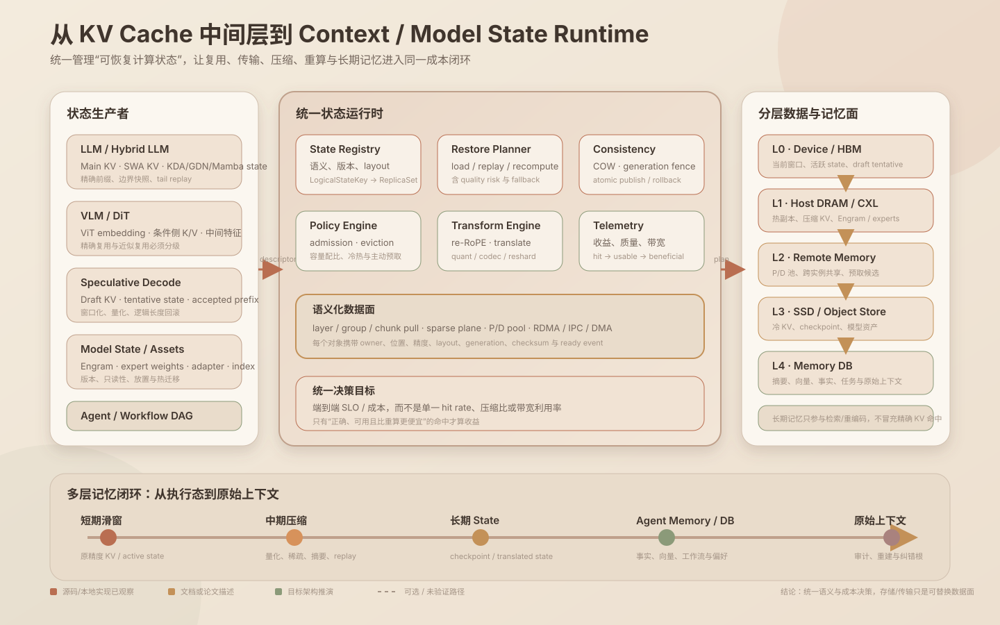

# KV 后续技术全景：从缓存中间层到 Context / Model State Runtime

> 日期：2026-09-20
>
> 目标：把本目录中分散的 KV、state、复用、压缩、P/D、投机、多模态与 Engram 材料，收敛为一套可用于技术规划和汇报的统一路线。
> 核心愿景：**KV 缓存中间层不再只是“把 K/V 搬出去再搬回来”，而是成为 Context State 与 Model State 的协同管理 Runtime，并与 Agent Memory、数据库和原始上下文形成多时间尺度记忆系统。**

> **关于文中的引用。** 原文的引用分两类，上线时做了区分处理：指向本站已上线联动分析的（`position-independent-kv-cache-report`、`kv-cache-formula-driven-optimization-methodology`、`lmcache-engram-offload-design`）保留为可点击链接；其余 `xxx.md:行号` 与 `vllm-review/...`、`lmcache-review/...`、`sglang-review/...:行号` 形式的是工作区本地文件与本地检出的位置，已按纯文本保留，站上点不开。

## 0. 范围、版本与证据边界

### 0.1 本文覆盖

- 异构 KV / state：Main KV、SWA、MLA、KDA/GDN/Mamba recurrent state、index/scale 等辅助 plane。
- 极致复用：exact prefix、位置可迁移 cache、跨模型 translation、跨实例与跨工作流复用。
- 量化压缩：CacheGen、TurboQuant、HyQuant（已记录、原始来源待核验），以及压缩后的直接计算问题。
- 成本管理：state 检索、冷热分层、主动预取、容量配比、拉取 / replay / 重算决策。
- 多模态与 DiT：VLM 的 embedding/KV 复用，以及 DiT 条件侧状态和去噪中间态的复用边界。
- P/D 协同池化：layerwise、sparse、group-aware 的发布、拉取、ready 与 backpressure。
- 语义扩展：从 KV 扩展到 Engram、专家权重、adapter、索引等模型状态。
- 投机解码：draft KV 的窗口、量化、临时写入、接受提交和回滚。
- 与 Agent Memory / DB 的协同：短期滑窗、中期压缩、长期 state、原始上下文。

### 0.2 不在本文中做出的承诺

- 不把论文或设计文档中的性能数字直接当作目标硬件上的实测结果。
- 不声称位置迁移、跨模型 translation、DiT 中间态复用天然无损。
- 不把“支持序列化/存储”表述成“attention 可直接消费压缩格式”。
- 不把 Engram、expert weights 等模型资产与请求级 KV 使用同一正确性语义。
- 不把公众号对 HyQuant 的转述当作原始论文、代码或目标硬件实测；来源、repo、commit、license 和复现基准仍需补齐。

### 0.3 本地工程基线

当前目录本身不是 Git 仓库；涉及源码判断时固定到以下 checkout：

| 工程 | 版本 / commit | 本文用途 |
|---|---|---|
| LMCache latest | `v0.5.5rc7` / `05a013b29da7` | prefix、hybrid group、多模态 key、通用缓存数据面 |
| LMCache review | `b5d109ea99a8` | TurboQuant serde、最新设计材料 |
| LMCache-Ascend | `e05a7570962a` | CacheGen Ascend、NPU 传输与压缩 |
| vLLM | `v0.26.0` / `568afb3a1380` | KV manager、TurboQuant、Engram、spec decode |
| vLLM-Ascend | `4c5ee33208b6` | SWA/DSV4、layerwise/sparse、DSpark、NPU KV 路径 |
| SGLang | `v0.5.19` / `0bcd822377da` | Radix/HiCache、多模态 cache、DiT sparse attention |
| Mooncake | `e389a85093cb` | 分布式对象、P/D 传输、Engram store、多模态全局 cache |

### 0.4 证据标签

- **已观察**：本地源码或同 checkout 的设计文档可定位。
- **已记录**：论文、项目文档或现有专题报告明确描述，但不等于目标环境实测。
- **架构推演**：为统一路线提出的设计，需要原型和 benchmark 验证。
- **未知**：当前目录与受限公开检索都不足以确认。

## 1. 执行结论

### 1.1 未来的核心对象不是 KV，而是“可恢复计算状态”

Main KV、SWA KV、recurrent state、draft KV、ViT embedding、DiT 条件侧 K/V、Engram 表和 expert weights 的共同点，是它们都能避免一部分重复计算；但它们在以下维度完全不同：

- 是否请求私有或模型共享；
- 是否可按 token 拼接；
- 是否可原地更新；
- 是否允许有损压缩；
- 是否能跨位置、跨模型、跨请求复用；
- 是否需要 generation fencing、版本固定或原子提交；
- miss 后应拉取、重放、重算还是重新编码。

因此，合理的核心抽象应从 `KVBlock` 上移为 `StateObject + RestorePlan`。已有材料也指向同一结论：KDA/GDN 会把 KVC 从 token-KV block manager 推向异构推理状态平台，命中结果从布尔值变成恢复计划（kda-gdn-kvc-evolution-impact-report.md:8、kda-gdn-kvc-evolution-impact-report.md:89）。

### 1.2 八条技术主线不是八个孤立功能

| 主线 | 核心问题 | Runtime 必须提供的能力 | 优先级 |
|---|---|---|---|
| KV 异构状态 | Main/SWA/state/index 如何共同恢复 | 语义化对象、group/plane、partial hit、原子 state snapshot | P0 |
| KV 极致复用 | 如何越过同前缀、同位置、同模型限制 | reuse level、re-RoPE/repair、translator registry、质量 profile | P1/P2 |
| KV 量化压缩 | 省容量还是省传输，何时反而变慢 | codec contract、异步流水、直接消费能力、质量门限 | P1 |
| KV 成本管理 | 拉取、重放、重算、预取、淘汰如何统一 | cost planner、热度预测、容量预算、benefit telemetry | P0/P1 |
| KV 多模态 / DiT | 哪些状态稳定、哪些随图像/时间步变化 | modality-aware key、exact/approx 分级、quality fallback | P1/P2 |
| KV 的 P/D 池化 | 如何按层/组消费，不等全量到齐 | publish/ready、layer chunk、sparse plane、backpressure | P1 |
| KV 语义扩展 | Engram / experts 是否复用同一基础设施 | asset/state 分域、版本、放置、只读共享、热迁移 | P2 |
| 草稿 KV 管理 | tentative token 如何低成本写入和回滚 | draft-only window、quant、logical rollback、accepted commit | P0/P1 |

### 1.3 最终产品形态

目标不是一个更大的缓存，而是三个层次：

1. **State Runtime**：定义对象语义、兼容性、一致性、恢复计划和成本决策。
2. **State Data Plane**：完成查找、传输、压缩、重排、预取、P/D 发布与持久化。
3. **Memory Federation**：将短期执行态、中期压缩态、长期 state、Agent Memory / DB 和原始上下文连接起来。

关键边界是：**精确状态恢复与语义记忆检索可以协同，但不能互相冒充。** 相似记忆可以用于预取、候选生成和重新编码，不能直接作为 KDA state 或 token KV 的正确性命中。

## 2. 一页总览



图的关键分界不是“数据放 HBM、DRAM 还是 SSD”，而是**由谁定义状态语义和恢复条件**。左侧状态生产者各自拥有模型语义；中间 Runtime 把它们变成可检索、可计划、可验证的状态对象；右侧存储只是副本和带宽的实现。最下层的记忆闭环进一步说明：短期精确状态、中期压缩状态、长期持久化 state、Agent Memory 和原始上下文应该形成可回退链，而不是全部塞进一个 cache key 空间。

## 3. 统一对象模型：先把“状态是什么”说清楚

### 3.1 状态分类

| `semantic_role` | 典型对象 | 正确性主键 | 更新方式 | 典型复用域 |
|---|---|---|---|---|
| `TOKEN_KV` | Main KV、SWA KV、MLA latent KV | 精确 token/context + model/layout | page/block append | 同模型、同语义前缀 |
| `RECURRENT_STATE` | KDA/GDN/Mamba、conv state | 精确 prefix + boundary + complete bundle | 设备原地更新、边界 snapshot | 同模型、同 state spec |
| `DRAFT_STATE` | draft KV、tentative recurrent state | draft model + base position + proposal epoch | 临时 append、接受后提交 | 单请求 / proposer 实例 |
| `ENCODER_STATE` | ViT/audio embedding、VLM projector output | 媒体内容 + processor/model revision | immutable | 跨请求、跨实例 |
| `DIFFUSION_STATE` | text condition K/V、control embedding、中间特征 | condition + model + schedule/timestep 等 | 大多 immutable 或 step-local | 同条件精确复用 / 近似复用 |
| `MODEL_ASSET` | Engram、expert weight、adapter | model revision + asset shard/version | 只读或受控热更新 | 跨请求、跨实例 |
| `AUX_METADATA` | indexer、scale、position、layout、routing | 绑定父对象 generation | 与父对象原子发布 | 跟随父对象 |
| `SEMANTIC_MEMORY` | 摘要、事实、向量、任务状态 | 业务 ID / embedding / time | DB 事务 | 跨会话、跨任务 |

### 3.2 建议的核心描述符

```text
StateDescriptor {
  logical_key
  semantic_role
  cache_family / model_asset_kind
  model_revision / adapter_identity / processor_revision
  modality
  layer_or_group / plane
  token_range | state_position | diffusion_step_scope
  source_layout / compatible_target_layouts
  dtype / quantization / codec
  consistency: IMMUTABLE | COW_SNAPSHOT | TENTATIVE
  generation / owner_epoch / checksum
  quality_profile / translator_id
  status: WRITING | COMPLETE | INVALID | EVICTED
}
```

这个对象模型沿用已有 `CacheObject` / manifest-payload 分离思路，但扩展了 modality、model asset、draft 与 quality profile（kda-gdn-kvc-evolution-impact-report.md:646、lmcache-kvc-papers-and-feasibility-report.md:614）。

### 3.3 检索结果不是 hit/miss，而是 `RestorePlan`

```text
RestorePlan {
  exact_objects[]
  transformed_objects[]
  required_replay_ranges[]
  recompute_ranges[]
  transfer_and_ready_dependencies[]
  estimated_latency / bytes / device_workspace
  expected_quality_risk
  fallback_plan
}
```

一个混合模型请求可能同时出现：Main KV 命中、SWA 只保留最近窗口、KDA state 在更早 boundary 命中、indexer 正在传输、某些层决定重算。只有恢复计划能表达这种 partial hit。

## 4. 八条技术主线

### 4.1 KV 异构状态：Main、SWA 与 recurrent state

#### 核心判断

Main KV、SWA 和 recurrent state 不能只靠 `cache_role` 字段区分后继续共用同一套 block 语义：

- Main KV 可以按 token block 追加和拼接。
- SWA 只需要窗口内历史，但绝对位置和 bounded replay 边界仍需保留。
- KDA/GDN/Mamba state 是某个序列边界的完整摘要，不能任意拼接；缺少 conv/recurrent 任一 plane 都不能视作命中。
- indexer、scale、position 等辅助 plane 必须跟随父对象 generation 原子可见。

本地材料已明确 recurrent state 需要精确边界、完整 snapshot、COW 或 generation fencing；state miss 时应从较早 snapshot replay 或重新 prefill（kda-gdn-kvc-evolution-impact-report.md:38）。

#### 建议实现

- 以 `cache_group × semantic_role × plane` 建立独立生命周期和内存池。
- `LogicalStateKey → ReplicaSet` 只查询有限个合法 boundary，不遍历集群。
- manifest 先行，payload 后取；完整性和 compatibility 先于传输。
- `probe → bounded install → commit`，防止大 state 恢复挤爆 HBM。
- partial hit 必须显式输出 replay/recompute 计划，不允许“有一部分就跳过整段 prefill”。

### 4.2 KV 极致复用：从前缀命中到跨模型状态资产

复用应按正确性强弱分成四级，而不是用一个 hit rate 混合统计：

| 级别 | 机制 | 正确性 | 典型场景 | 需要的补偿 |
|---|---|---|---|---|
| R0 精确前缀 | hash-chain prefix cache | 精确 | system prompt、共享会话前缀 | 无 |
| R1 受约束模块 | schema/module cache | 条件精确 | 模板、固定文档模块 | 位置与 mask 约束 |
| R2 位置可迁移 | chunk fingerprint + re-RoPE | 通常不充分 | RAG 文档换位、重排 | 上下文修复、选择性重算 |
| R3 跨模型 | learned translator / latent bridge | 有损 | 大模型理解 → 小模型生成、模型路由 | translator、质量 profile、fallback |

位置无关 cache 的关键不是 re-RoPE 本身：re-RoPE 只能修正显式位置，不能修复 hidden state 已吸收的旧前序上下文（[position-independent-kv-cache-report.md:9](#/f/position-independent-kv-cache-report)、[position-independent-kv-cache-report.md:71](#/f/position-independent-kv-cache-report)）。推荐组合仍是 exact-prefix 快路径，加上 chunk 指纹、位置修正、选择性重算和 full-prefill 回退。

跨模型复用则必须把 `source_model`、`target_model`、`translator_id`、训练版本和质量 profile 放进对象元数据。其价值条件是：

```text
translation + transfer + assembly + quality_penalty < target prefill
```

本地论文整理已把 cross-model KV 定位为“可翻译计算状态”，并要求检索、协议与质量元数据共同变化（arxiv-2608-30963-cross-model-kv-sharing-report.md:175）。

### 4.3 KV 量化压缩：CacheGen、TurboQuant 与 HyQuant

#### 不应只比较压缩比

统一比较维度应包括：压缩率、encode/decode 延迟、device workspace、可否异步、可否直接被 attention 消费、质量损失、网络/存储节省，以及 miss 路径写放大。

| 方案 | 当前本地证据 | 更适合解决 | 关键代价 / 边界 | 建议定位 |
|---|---|---|---|---|
| CacheGen | **已记录**：LMCache-Ascend 文档描述 chunkwise quant + arithmetic-like coding | 远端流式传输和昂贵存储容量 | encode 非异步、`RepeatInterleave` 瓶颈、decode scalar-bound、headroom OOM 风险 | 冷/温层 codec，先异步化再扩面 |
| TurboQuant serde | **已观察/已记录**：LMCache L2 storage transform，支持 K8V4、4/3-bit 等 preset | L2 容量和传输字节 | 当前需恢复为普通 KV；Triton/CUDA staging；首尾敏感层默认不量化 | 通用低比特 serde；与 native attention 分开评估 |
| Native TurboQuant | **已记录**：vLLM attention backend 路线 | HBM 容量与直接低比特 attention | 与 storage serde 的 layout/metadata 尚需统一 | 长期目标是“存储格式 = 计算格式” |
| HyQuant | **已记录**：公众号文章转述 HyQuant（原始论文/repo/commit 尚待核验） | 长上下文 Attention 的重要性分层与混合精度 KV | 关键 Token 识别有额外开销；高精度保留会增加容量；当前公开数字主要来自 H100 | 作为混合精度候选进入统一 benchmark，不作为近期落地承诺 |

公众号文章对 HyQuant 的描述是：将少量反复被关注的 `vertical-line tokens` 与最近 `local window` 保持 FP16/BF16，其余 KV 采用 K4V4 等低比特格式；prefill 使用混合精度融合 kernel，decode 将反量化直接融合到 Attention，避免先恢复一整份高精度 KV。文章转述的结果包括：H100 上 Decode Attention Kernel 相对 FlashAttention-2 最高约 `3.58×`，32K 上下文端到端 Decode 约 `1.17×`，重要 Token 识别约有 `3%–5%` 运行时开销。以上属于**已记录/未审计**，不能替代原始论文、代码和目标 NPU 的复现结果；尤其要单独测量识别、scatter、workspace 和 batch 变化带来的成本。

CacheGen 的本地文档给出一个很有价值的反例：远端命中时压缩方案可比重算快，但 naive serde 仍约快 20%，只是占用约 3.5 倍空间；miss 时 encode 成本还会拖慢完成时间（lmcache-ascend-review/docs/cachegen/Cachegen.md:14）。这说明 codec 选择必须由成本模型驱动，而不是全局固定。

TurboQuant 文档明确区分：LMCache 集成点是 L2 serde，load 后恢复普通 KV；vLLM native 路线才是 attention backend（lmcache-review/docs/design/v1/distributed/serde/turboquant.md:5、lmcache-review/docs/design/v1/distributed/serde/turboquant.md:209）。这里的“native”不能简单理解为“上层把所有数据都压成低比特”：它是把**驻留 KV 的物理布局、写入量化、读取解码和 Attention kernel**一起改掉；当前 query、投影产生的 K/V 和部分 prefill 路径仍可能是 FP16/BF16，低比特主要发生在 cache 写入和历史 KV 消费路径。

#### 两条数据路径的边界

| 路线 | cache 写入 | connector / L2 传输 | Attention 消费 | 主要代价 |
|---|---|---|---|---|
| vLLM native TurboQuant | `do_kv_cache_update` 调 fused store kernel，把 K/V 写成 TQ slot layout | 只有 connector 明确支持该 layout 时，才能把压缩 slot 作为 opaque bytes 传递；不能假设通用 connector 自动兼容 | decode kernel 直接读取压缩 KV，在 kernel 内解包/反量化并参与 score、softmax、value accumulation；不是先恢复整份 BF16 KV | 需要专用 cache spec、slot size、scale/centroid metadata、attention backend 和 transfer protocol |
| LMCache TurboQuant serde | 从标准 LMCache KV tensor 读取，save 前编码为压缩 bytes | L2 payload 可以是压缩 bytes，便于容量和带宽节省 | load/prefetch 时 decode 回标准 `[2, layers, tokens, hidden]` KV，再交给原有 Attention；serde 本身不实现 Attention backend | save/load encode/decode、staging、workspace 和一次 layout 恢复 |

vLLM checkout 中，`TQFullAttentionSpec.tq_slot_size` 会改变 page size（vllm-review/vllm/v1/kv_cache_interface.py:354）；native backend 在 cache update 前调用 fused store（vllm-review/vllm/v1/attention/backends/turboquant_attn.py:403、vllm-review/vllm/v1/attention/backends/turboquant_attn.py:582），decode 则读取压缩 cache 并在 kernel 内完成解码（vllm-review/vllm/v1/attention/backends/turboquant_attn.py:474）。因此 native 路线可以做到“压缩格式直接参与计算”，但前提是目标 worker、block table、connector 和 attention backend 对同一物理格式达成协议。

LMCache serde 的实际边界更窄：`MemoryObj(KV tensor) → serializer → uint8 compressed bytes → L2`，取回时再 `compressed bytes → deserializer → restored KV tensor`（lmcache-review/docs/design/v1/distributed/serde/turboquant.md:28、lmcache-review/docs/design/v1/distributed/serde/turboquant.md:38）。所以你的理解是对的：**LMCache 这条路径通常在 save 时量化、load 时反量化；压缩 payload 可以节省 L2/网络字节，但安装到 Attention 使用的 cache 往往已经恢复为普通 KV。**

#### `QuantizedStateLayout` 应该描述三种格式

后续不应只记录一个 `dtype=int4`，而要显式区分：

```text
QuantizedStateLayout {
  logical_layout       # 语义形状，例如 [K/V, layers, tokens, hidden]
  resident_layout      # HBM 中的标准 KV 或 native packed slot
  transport_layout     # L2/RDMA/对象存储中的 bytes、header、metadata
  quant_scheme         # bits、per-token/head/block、K/V 独立策略
  scale_zero_layout
  centroid_or_codebook
  boundary_layer_policy
  consumption_mode     # DECODE_IN_KERNEL | DECODE_ON_INSTALL | RAW
}
```

这样可以明确判断是否允许端到端传递压缩数据：只有 `resident_layout` 和 `transport_layout` 兼容、目标 Attention 声明 `DECODE_IN_KERNEL`，且 scale、block、TP/layout、版本全部匹配时，才走 native opaque transfer；否则统一走 `DECODE_ON_INSTALL`，恢复成 canonical KV。HyQuant 也应放进同一个描述符，但它还需要额外记录 `importance_selector`、`high_precision_positions` 和 `local_window`，不能仅用一个 bit-width 表示。

### 4.4 KV 成本管理：从 hit rate 到“命中收益率”

#### 统一成本函数

对每个候选恢复方案估计：

```text
T_restore = T_meta + T_queue + T_fetch + T_decode
          + T_reshard + T_install + T_replay

C_total = SLO_penalty(T_restore)
        + device_workspace_cost
        + network/storage_cost
        + quality_risk
        + opportunity_cost
```

这些项是恢复路径的成本分解，不代表每一次都严格串行，也不代表每一项都非零：

| 时间项 | 含义 | 典型操作 | 常见误区 |
|---|---|---|---|
| `T_meta` | 找到并确认“能不能用哪个对象” | prefix/hash 查询、manifest 读取、generation/模型/版本/layout/权限校验、ReplicaSet 选择 | 只测 payload 传输而漏掉远端目录、批量查询和兼容性判断 |
| `T_queue` | 等待资源和执行时机 | scheduler 排队、HBM/DRAM workspace 准入、锁、网络连接、DMA/codec worker 队列、P/D ready 等待 | 把排队时间算进网络带宽，无法解释 p99 尾延迟 |
| `T_fetch` | 把对象字节搬到目标节点或设备 | 远端 HBM/DRAM/SSD/RDMA 读取、P→D 传输、磁盘读、DMA/H2D | 把“已经在本机 HBM”的命中也按远端拉取计算 |
| `T_decode` | 把传输/存储格式变成可安装的数据 | CacheGen/TurboQuant 解码、反量化、解压、校验、header 解析 | 与 `T_replay` 混淆；它是数据格式转换，不是模型前向重算 |
| `T_reshard` | 把数据变成目标并行和布局 | TP/PP/DCP shard 重分片、layer-first/page-first 转换、transpose、block remap | 同 layout、同 TP 时仍重复做全量 transpose |
| `T_install` | 写入运行时可消费的位置并发布 ready | scatter 到 paged KV slots、更新 block table、绑定 state plane、写 ready event、同步 stream | 只统计 memcpy，不统计 page-table、event 和可见性协议 |
| `T_replay` | 从较早 checkpoint 补算到目标边界 | replay token、重建 recurrent state、选择性重算 stale KV、缺失 suffix prefill | 把 replay 当作 decode；它消耗模型算力并可能改变 batching |

例如，标准 LMCache serde 路径通常是：

```text
T_meta → T_queue → T_fetch(压缩 bytes) → T_decode(恢复 KV)
       → T_reshard → T_install
```

如果只命中较早的 recurrent snapshot，还要追加 `T_replay`；如果是 vLLM native TurboQuant 且目标 Attention 能直接消费相同 packed slot，则 `T_decode` 可以从“恢复 canonical KV”变成 kernel 内的按需解码，`T_reshard` 也可能为零。

工程上还要区分**串行账本**和**端到端关键路径**。`T_fetch`、`T_decode`、`T_reshard` 可以流水化，`T_replay` 也可能和下一组数据预取重叠，因此实际请求延迟更接近：

```text
T_restore_e2e
  ≈ T_meta + T_queue
  + max(
      T_fetch + T_decode + T_reshard + T_install,
      T_replay,
      dependency_wait
    )
```

具体取 `sum` 还是 `max`，取决于执行协议：同一 stream 上的强依赖倾向于相加；独立的 fetch、decode、replay、compute 可以取关键路径。telemetry 应同时记录每项 wall time、overlap time 和 exposed time，最终用 exposed time 解释 TTFT/JCT，而不是只看各项平均值。

只有满足 `C_restore < C_recompute` 且正确性/质量门限通过时，命中才应被采用。已有 state 方案也采用 `metadata + queue + load + reshard + replay` 的选择模型（lmcache-kvc-papers-and-feasibility-report.md:653）。

#### state 检索效率

- 先由精确 prefix 和 replay budget 生成最近 `K` 个 boundary key。
- 对 key 做批量 `MULTIGET`，返回每个逻辑对象的少量 `ReplicaSet`。
- 只在副本集合内比较 tier、layout、queue 和 freshness。
- 向量相似度、租户热点只用于预取和复制，不参与 state 正确性命中。

#### 基于冷热的主动预取

预取信号按可靠度分层，同时标出信号来源和当前实现状态：

| 层级 | 信号 | 主要来源 | 是否可直接作为正确性依据 |
|---|---|---|---|
| 1 | 已知工作流 DAG 的下一节点、明确模型路由、P/D handoff | Agent/orchestrator 提供下一节点与 deadline；serving control plane 提供实际 P→D 目标、shard 和 ready 依赖 | 只能作为高置信预取线索；最终 state 仍需 Runtime 校验 |
| 2 | 正在增长的共享前缀、同 session 下一轮、即将进入的 layer group | vLLM/SGLang scheduler、prefix/radix cache、model runner 的 group/layer 事件 | 需要与推理引擎联合设计；不是 State Runtime 单独能够推断的信号 |
| 3 | 租户/模板/媒体热点与历史访问序列 | State Runtime 的 telemetry、template/media registry、租户级统计和历史事件 | 仅用于热度预测、复制和预取，不用于 exact state 命中 |
| 4 | 语义相似请求 | embedding/ANN 候选、semantic judge 或业务规则 | 只能 best effort；不能直接当作 KV/state 正确性命中 |

这里的 **P/D handoff** 指 Prefill 节点把已经生成的 prompt KV/state，按约定的 `engine_group/layer/chunk/generation` 发布给 Decode 节点；Decode 不必等整包到齐即可按 layer/group 预取和安装，但必须遵守 ready、TP contributor 和 slot lease。它主要来自 serving control plane / connector，而不是 Agent 自己计算 KV。

第 3 类目前属于 State Runtime 的目标能力：Runtime 通过访问事件、模板注册、媒体内容 hash、租户隔离和 TTL 累积热度，形成可解释的热点分数；如果这些 registry 和 telemetry 尚未接入，就不能声称已经具备该预取信号。

第 4 类也不是“相似文本就复用 KV”。例如“今天天气如何”和“今天天气怎么样”可以成为 ANN 候选，但天气是时间敏感事实，还依赖城市、用户权限和数据源 freshness；应先判断是否是同一 tool/query 语义，再检查参数、TTL 和权限。即使 semantic judge 判定答案可能等价，也最多预取天气工具结果或相关模块，不能直接把一个请求的 Transformer KV 当成另一个请求的 exact KV。

预取必须带 `confidence × lateness budget × cancellation cost`，并有独立带宽预算，避免挤压当前请求。

#### DDR / SSD 动态容量配比

这里的“动态配比”不是在 KV 和 state 之间切 `80% / 20%`，而是动态调整**单个推理实例在 DDR 与 SSD 两级的逻辑预算、驻留对象和带宽配额**。DDR/SSD 的物理容量不会被改变：可调的是实例能占用多少 DDR、多少 SSD，以及哪些对象应该驻留在哪一层。

可按每字节边际收益分配：

```text
value_per_byte(object_class)
  = expected_reuse × recompute_saved × SLO_weight
  - fetch_writeback_cost
  - quality_or_staleness_risk
```

HBM 侧优先保留当前活跃 state、近期窗口和高复用前缀；DDR 侧容纳近期可恢复 KV、checkpoint 和 P/D pool；SSD 侧承载冷对象、压缩 KV 和低频 checkpoint。容量控制器以周期性 soft rebalance 为主，避免频繁 DDR↔SSD 抖动。

这件事在工程上是现实的，但应理解为**分层缓存预算控制**，不是实时改变硬件内存大小：

- **可动态调整**：实例 DDR soft limit、SSD logical quota、DDR/SSD watermark、预取预算、SSD IOPS/带宽预算、对象 admission 和 eviction 优先级。
- **不能直接调整**：物理 DDR 总容量、SSD 总容量、SSD 固定分区；当宿主机没有可回收 DDR 或 SSD 配额已满时，只能拒绝 admission、降级到远端或重算。
- **调整周期**：请求级只做 admission/eviction；秒级根据 watermark 和队列做小幅迁移；分钟级根据工作集和成本模型做 quota rebalance。不能每个请求都搬一批对象来追逐瞬时命中率。
- **实现边界**：DDR 需要进程/cgroup、NUMA、pinned memory 和 cache lease 管理；SSD 需要目录/对象配额、IOPS/带宽 QoS、并发读写队列和 wear-aware 策略。

推荐控制器输入和输出：

```text
inputs:
  ddr_used / ddr_free / ddr_reclaimable
  ssd_used / ssd_free / ssd_iops / ssd_queue
  object_hotness / reuse_interval / fetch_cost / recompute_cost
  p95_restore / p99_JCT / prefetch_waste

outputs:
  ddr_budget_bytes / ssd_budget_bytes
  ddr_high_watermark / ddr_low_watermark
  ssd_high_watermark / ssd_low_watermark
  migration_plan / admission_policy / bandwidth_budget
```

容量控制的目标不是最大化 DDR 命中率，而是最小化端到端代价：

```text
minimize  JCT_penalty
        + fetch_cost
        + eviction_recompute_cost
        + SSD_IO_cost
        + wear_or_contention_cost
```

因此，DDR↔SSD 动态配比应先在单机、单实例做 quota + watermark + soft rebalance 原型，再扩展到多实例共享宿主机；评估指标包括 DDR 命中收益、SSD 读写放大、迁移字节、队列等待、p95/p99 restore 和整体 JCT，而不是只看两层容量比例。

### 4.5 KV 多模态与 DiT：先区分“条件不变”与“去噪态变化”

#### VLM / 多模态自回归模型

已有两个可直接继承的基础：

- LMCache latest 已实现 multimodal-aware keying，避免相同 placeholder token 导致不同图片错误共享 KV；其目标态是显式 `extra_keys` channel（lmcache-latest-review/docs/design/integration/vllm/multimodal_cache_keying.md:1）。
- SGLang 文档描述了 Mooncake-backed 全局多模态 embedding cache，使重复图片可跨实例复用 ViT embedding（sglang-review/docs/docs/advanced_features/epd_disaggregation.mdx:47）。

建议对象链：

```text
media bytes
  → processor output
  → encoder / ViT embedding
  → projector output
  → LLM token KV
```

每一层分别 keying 和 versioning，避免 processor/model revision 改变后静默复用旧结果。

#### DiT / 视频生成

DiT 不是自回归 token 前缀模型。去噪 step 的 self-attention K/V 通常随 noisy latent 与 timestep 改变，不能直接照搬 LLM prefix cache。建议分成三类：

| DiT 状态 | 精确复用潜力 | 典型 key | 结论 |
|---|---|---|---|
| 文本/图像/音频 encoder embedding | 高 | content hash + encoder revision | 跨请求、跨实例 exact cache |
| Cross-attention 的静态 condition K/V | 高 | prompt/condition + DiT revision + layer | 同条件多 step 可复用，需核对实现是否每步重算 |
| Self-attention K/V、hidden feature、router plan | 低到中 | latent + timestep + schedule + control + layer | 默认 step-local；跨 step/请求复用属于近似算法，必须带质量 profile |

这里的 `condition` 不是单一的文本 prompt，而是去噪网络在多个 step 中保持不变、用于约束生成结果的一组输入。常见对象包括：

- 正向文本与 negative prompt 的 CLIP/T5 embedding；CFG 场景应分别缓存 conditional / unconditional 两个分支。
- 参考图、首尾帧、风格、人物身份等经 ViT / image encoder 得到的 embedding。
- 音频、语音、节奏等经 audio encoder 得到的 embedding。
- 相机轨迹、姿态、深度、边缘、分割图、mask 等控制输入的静态 encoder 输出。
- 固定 condition 经各层 projection 生成的 cross-attention K/V；只有当 projection 仅依赖 condition 和固定模型权重时，才可跨 denoise step exact reuse。

应把“原始控制条件不变”和“由控制条件产生的全部中间张量不变”区分开。ControlNet / adapter 的输入图或 encoder feature 可以是静态的，但其 residual 若同时读取 `noisy_latent_t` 或 `timestep_t`，仍然只能在当前 step 使用。可用下面的依赖关系做第一道判断：

```text
f(condition, model_weights)                              → exact-cache candidate
f(condition, noisy_latent_t, timestep_t, scheduler_state) → step-local state
```

即使满足第一式，cache key 仍需包含 condition digest、encoder/DiT revision、layer/projection、CFG branch、dtype/layout 和 processor revision；随机预处理或动态 mask 也必须进入 key 或直接禁用复用。

SGLang 当前 MiniMax-H3 DiT 材料证明的是 training-free block sparse attention，并明确早期 denoise step 对质量更敏感；它不是通用 KV cache 复用证据（sglang-review/python/sglang/multimodal_gen/runtime/layers/attention/backends/subblock_sparse/README.md:1、sglang-review/python/sglang/multimodal_gen/runtime/layers/attention/backends/subblock_sparse/README.md:107）。因此近期应先做 encoder/condition exact cache；中间态复用放入研究轨，并以 CLIP/VBench/人评和 seed 稳定性做回归。

### 4.6 KV 的 P/D 协同池化：Layerwise + Sparse + Group-aware

目标形态不是“P 端写完全部 KV，D 端一次性拉完”，而是一个带 ready 语义的共享状态池：

```text
P: compute group g / layer chunk c
   → publish immutable object + manifest
   → ready(g,c,planes,generation)

D: probe restore plan
   → prefetch next group
   → wait only on current dependency
   → install dense/main plane
   → on demand pull sparse/indexer plane
   → execute and release/pin
```

关键机制：

- **层/组级发布**：对象边界对齐执行依赖，而不是机械地每 N 层切块。
- **分 plane ready**：main KV、indexer、scale、state bundle 的完整性规则不同。
- **传输与计算重叠**：D 执行当前 group 时预取下一 group；ready event 进入 scheduler dependency。
- **稀疏 delay-pull**：host/remote 保留权威全量对象，device 只拉当前 top-k 或所需 plane。
- **背压与准入**：pool watermark、P/D 速率差和 network queue 反馈给 admission。
- **失败回退**：对象 generation 不完整、超时或布局不兼容时，重拉、replay 或重算。

现有 layerwise/sparse 分析建议把 delay-pull 下沉为 layer/chunk transport primitive，并强调不能误解为“收到第一层就能无条件开始 decode”（vllm-ascend-layerwise-sparse-delay-pull-analysis.md:72、vllm-ascend-layerwise-sparse-delay-pull-analysis.md:161）。

### 4.7 KV 的语义扩展：Engram、专家权重与其他 Model State

#### 共用什么，不共用什么

Engram 与 expert weights 可以共用：分层存储、内存注册、replica directory、传输、预取、checksum、版本发布、容量与热度管理。

但不能共用请求 KV 的命中语义：

- Engram 是模型级条件记忆表，通常只读、随机 row lookup、生命周期接近模型 revision。
- Expert weights 是可分片模型资产，受 EP placement、EPLB 和热更新版本约束。
- Adapter/LoRA 是模型变体资产，会改变所有后续 KV 的 identity。
- 请求 KV/state 绑定具体上下文和序列边界。

因此目标对象模型需要两个 namespace：`CONTEXT_STATE` 与 `MODEL_ASSET`，共用基础设施但分开 compatibility 和一致性协议。

#### Engram 的具体启示

现有 vLLM 路径已覆盖 hash、FP8 表、UVA、gate、统一预取、image mask 与 graph lookback；SGLang/vLLM-Ascend 的公开材料存在“文档先于 runtime”风险（deepseek-v41-engram-adaptation-report.md:180、deepseek-v41-engram-adaptation-report.md:450）。Runtime 应把 Engram 视作：

- 版本化只读表；
- node-local materialization + distributed backing；
- row/page 热度驱动预取；
- Host direct view、bulk DMA 或 HBM shard 的可选数据路径；
- 与 KV transfer 共享 Host/NPU 带宽预算。

#### Expert weights 的机会

- 统一 expert shard manifest、replica 和热度统计。
- 将 EPLB 的迁移计划与 KV/P-D 流量联合排程，防止互相抢占带宽。
- 热 expert 放 HBM，温 expert 放 Host/CXL，冷 expert 可从远端或 SSD 恢复。
- 更新使用 model epoch + atomic publish；旧请求可继续使用旧 epoch，避免半切换。

### 4.8 投机的草稿 KV 管理

草稿 KV 的首要目标不是永久复用，而是低成本支持 tentative execution：

1. **draft-only sliding window**：目标模型保留完整上下文，draft 只看最近 512/1024/2048 token。
2. **draft-only quantization**：优先 INT8，再评估更低 bit；目标 KV 精度不受影响。
3. **逻辑长度回滚**：拒绝后缀不清零、不 memcpy restore，下一轮覆盖；只回退逻辑长度和 metadata。
4. **accepted-prefix commit**：只有 verifier 接受的 token 才能推进 recurrent state 或持久化边界。
5. **固定最大 K → bucket 化 K**：先控制 graph/kernel shape，再按 request 动态减少 tentative allocation。

本地源码分析指出，拒绝后缀可通过逻辑长度回滚而无需 KV 拷贝恢复；长上下文下缩短历史 draft window 往往比减少单轮 5–7 个临时 token 更有价值（speculative-decoding-no-retrain-report.md:355、speculative-decoding-no-retrain-report.md:399）。

#### `K`、`A`、`R` 与实际提交长度

在线性 speculative decoding 中，可先用三个量描述一轮提议：

```text
K = drafter 本轮实际送交 verifier 的预测长度
A = verifier 从候选开头连续接受的 draft token 数
R = K - A = 本轮未被接受、需要逻辑失效的候选后缀长度

0 ≤ A ≤ K
```

`K` 的上限由 `max_draft_tokens` 或 K bucket 决定；遇到 EOS、资源限制等情况时，实际送验长度可以更短。`A` 不在生成 draft 时确定，而是在 target/verifier 验证后才能知道。因此预分配与 graph shape 通常按 K bucket 准备，收益却由接受率 `A / K` 决定。还要区分 **accepted draft tokens** 和 **本轮最终提交 tokens**：发生拒绝时，target 通常会在第一个拒绝位置产生一个纠正 token，因此常见实现本轮提交 `A + 1` 个 token；若 `K` 个 draft token 全部接受，支持 bonus token 的算法可提交 `K + 1`，不生成 bonus token 的实现则只提交 `K`。Runtime 不应把 `committed_tokens` 固定写成 `A` 或无条件写成 `A + 1`，而应读取 verifier 的实际输出协议。

在线性方案里，`K` 可以等同于 `max_draft_tokens`；在 tree/branch speculation 中则不能只用一个 `K` 描述显存和回滚成本，需要至少拆成：

```text
max_draft_tokens       # 单路径最大预测长度
max_tree_depth         # 树的最大深度
max_candidate_nodes    # 本轮所有候选节点上限
max_branches_per_level # 每层最大分支数
```

此时 `A` 表示最终被 verifier 接受的那条路径长度，而不是树中“通过验证的节点总数”；无效显存取决于候选节点数、前缀共享方式和 block 映射，不能再用 `K - A` 直接估算。

#### Draft KV 的实际回滚

投机解码通常不保存一份旧 KV 再做 memcpy restore，而是维护两个边界：

```text
committed_length   # target 已接受的前缀
tentative_length   # draft 本轮已经写到的位置
```

例如已提交长度为 100，draft 提议 `[a,b,c,d]`，target 只接受 `[a,b]`，并在拒绝点采样出 `x`：

```text
验证前：committed=100, tentative≈104
验证后：输出提交 [a,b,x]
下一轮有效边界回到 accepted prefix，随后用 x 重新同步 drafter
物理槽位中 c/d 对应的旧字节不清零，后续写入覆盖
```

需要区分两侧：

- **Target KV**：验证时可能已经为整批 draft token 写入 KV。scheduler 先乐观增加 `num_computed_tokens`，收到验收结果后按 `num_rejected` 减回去；被拒后缀不进入 finalized prefix cache，下一轮从修正后的逻辑位置继续写。vLLM 在调度后先推进计数，并明确说明 rejection 后会在 `update_from_output` 修正（vllm-review/vllm/v1/core/sched/scheduler.py:1236）；验收后执行 `request.num_computed_tokens -= num_rejected`（vllm-review/vllm/v1/core/sched/scheduler.py:1675）。
- **Draft KV**：drafter 上一轮已经沿提议分支向前写。下一轮根据 rejected token 数修正 `seq_lens`/position/slot mapping，再用 target 真正提交的 token 作为新输入继续生成；旧后缀槽位被覆盖，而不是反向计算恢复。vLLM proposer 会用 `num_rejected_tokens_gpu` 下调 drafter 的 `seq_lens`（vllm-review/vllm/v1/spec_decode/llm_base_proposer.py:670）。

物理页是否马上释放是独立问题：部分 block 内的被拒槽位通常保留并覆盖；完全落在有效边界之后的尾部 block 可以延迟回收或留作下一轮 lookahead，取决于 allocator 和异步执行栅栏。正确性依赖的是 block table、有效长度和 slot mapping 不再暴露旧后缀，不依赖把显存清零。为防止 tentative KV 被共享，vLLM 只把 finalized token 纳入可提交的 prefix cache（vllm-review/vllm/v1/core/kv_cache_manager.py:493）。

因此，最小回滚状态是：

```text
DraftRollbackState {
  committed_length
  tentative_length
  accepted_count
  proposal_epoch
  block_table / tail_block_offset
  pending_target_token
}
```

普通 Attention KV 是按位置追加的，逻辑回退即可；KDA/GDN/Mamba recurrent state 会把整段历史折叠进一个可变状态，不能通过缩短长度恢复，必须使用 accepted/tentative 双 buffer、checkpoint + replay 或增量 undo log。

对 KDA/GDN/Mamba，不能只回退 attention KV 长度：tentative recurrent state 需要 shadow buffer、增量日志或仅对 accepted token 重新推进，必须由模型 state builder 定义。

### 4.9 Agent ↔ State Runtime：先打通控制链，再谈检索加速

Agent 与 KV 组件之间目前隔着 workflow planner、上下文组装、tokenizer、模型 runtime、State Runtime 和 Data Plane。Agent 可以提供高价值先验，但不能直接把 `position_id` 当作正确性证明：位置、tokenization、RoPE、attention mask、layer/group 和 generation 仍必须由模型侧和 Runtime 校验。

#### Agent 应提供什么

建议把 Agent 输入定义为 `WorkflowStateHint`，把“位置 ID”降级为可验证的 placement hint：

```text
WorkflowStateHint {
  workflow_id / session_id
  context_version
  expected_next_model / adapter
  module_or_state_refs
  placement_anchor / allowed_offset
  expected_input_digest
  deadline / priority / privacy_class
  prefetch_budget / quality_budget
}
```

其中 `module_or_state_refs`、`context_version` 和 `expected_input_digest` 是主要检索线索；`placement_anchor` 只表示 Agent 预期的放置位置，最终位置必须由 tokenizer 和 model runtime 重新确认。Agent 不应直接构造 KV block table，也不应绕过 State Runtime 的 compatibility gate。

#### 打通的最小链路

```text
Agent planner
  → context assembler / tokenizer
  → StateHint adapter（校验 context_version、digest、anchor）
  → State Runtime probe + cost plan
  → Data Plane prefetch / install
  → model runtime execute
  → state + workflow telemetry
  → Agent 后续节点和下一轮 hint
```

控制面优先异步化：Agent 提前给出下一节点和 deadline，Runtime 进行 best-effort probe/prefetch；当前请求的同步路径只等待真正位于 critical path 的 manifest、install 和 repair。这样可以避免 Agent 每次调用都同步等待一次完整检索。

#### 检索提速如何计入整体链路

检索收益不能用 `lookup latency` 或单请求 hit rate 代表。对 Agent 工作流，应按请求或 DAG 的端到端完成时间（`JCT`，Job Completion Time）评估：

```text
JCT = queue
    + agent_plan
    + context_assemble / tokenize
    + state_lookup / plan
    + fetch / decode / install / repair
    + model_prefill / decode
    + tool_wait / downstream_nodes
```

只有当省下的 prefill/replay 时间真正位于 DAG critical path，且没有被 lookup、传输、排队或共享带宽争用抵消时，检索才产生端到端收益：

```text
net_JCT_saving
  = recompute_or_prefill_avoided
  - lookup - planning - fetch - install - repair
  - queue_impact - contention
```

建议同时报告三层指标：

| 层次 | 必测指标 | 要回答的问题 |
|---|---|---|
| 检索微基准 | `lookup p50/p95/p99`、QPS、候选数、manifest bytes | 索引和目录本身是否变快 |
| 单请求 | `TTFT`、`JCT`、`state_lookup`、`restore`、`recompute_saved`、`beneficial_hit_rate` | 命中是否转化成真实请求收益 |
| Agent/DAG | workflow `JCT`、critical-path overlap、tool wait、hint precision/coverage/staleness、总成本 | Agent 先验是否改善整个工作流 |

最小对照实验应至少包含：无缓存、exact-prefix、Agent hint 但不预取、hint + prefetch、完整 restore/repair；并在 cold/warm、不同并发、网络带宽、命中率、Agent hint 错误率和下游节点阻塞条件下比较。尤其要记录 `hint_to_benefit_conversion`：Agent 给出了 hint 不等于状态最终可用。

## 5. 目标架构

### 5.1 组件边界

```text
Serving / Model Runtime
  vLLM · SGLang · vLLM-Ascend · DiT runtime
  - state producer / consumer
  - model-specific replay, repair, verification

Context / Model State Runtime
  - State Registry & Compatibility
  - Restore Planner & Cost Model
  - Consistency / Generation / Ownership
  - Admission / Eviction / Prefetch / Capacity
  - Translator / Codec / Reshard Registry
  - Telemetry & Quality Guardrail

State Data Plane
  - lookup / replica / transfer / P-D pool
  - layerwise / sparse / bounded install
  - HBM / DRAM / CXL / remote memory / SSD / object store

Memory Federation
  - session state / agent memory / vector & relational DB
  - summary / fact / task state / original context
```

Model Runtime 负责“如何计算”；State Runtime 负责“哪些已有状态合法、值得恢复”；Data Plane 负责“如何把对象变成目标布局并按时送达”。跨模型 translator、位置修复、DiT 近似复用等算法可以注册进 Runtime，但不应硬编码进存储核心。

### 5.2 控制面 API 草案

```text
register_spec(StateSpec) -> spec_id
probe(QueryContext, CandidateBudget) -> CandidateSet
plan(CandidateSet, RuntimeSignals) -> RestorePlan
prefetch(RestorePlan, deadline, priority) -> PrefetchHandle
install(RestorePlan, workspace_budget) -> ReadyEvents
commit(StateManifest, payload_refs) -> generation
invalidate(logical_key, generation, reason)
report(ObservedCost, QualityOutcome)
```

### 5.3 数据面原语

- `get_manifest` / `multiget_manifest`
- `fetch_range` / `fetch_planes`
- `transfer_into` / `lookup_into`
- `decode_into` / `reshard_into`
- `publish_chunk` / `mark_ready`
- `pin` / `unpin` / `lease`
- `copy_on_write_snapshot` / `atomic_publish`

## 6. 与 Agent Memory 和数据库形成多层记忆

### 6.1 五层记忆

| 层 | 时间尺度 | 内容 | 默认介质 | 失败回退 |
|---|---|---|---|---|
| M0 执行窗口 | token / step | 活跃 KV、draft、当前 recurrent state | HBM | 当前请求重算 |
| M1 会话热态 | 秒—分钟 | Main/SWA KV、checkpoint、ViT/condition cache | Host/remote memory | replay / prefill |
| M2 持久状态 | 小时—天 | 压缩 KV、长期 checkpoint、translated state | SSD/object store | 原始上下文重建 |
| M3 Agent Memory | 天—长期 | 摘要、事实、偏好、任务图、工具结果 | KV/关系/向量 DB | 检索后重新编码 |
| M4 原始上下文 | 长期审计 | 对话、文档、媒体、事件日志 | 对象存储/数据湖 | 最终事实源 |

### 6.2 协同原则

- **精确优先**：先查 exact state，再查可修复 state，最后才查 semantic memory。
- **可逆压缩**：中期状态能回到更早 checkpoint 或原始上下文，不把有损摘要作为唯一事实源。
- **同一身份链**：`conversation/workflow ID → context version → state generation → memory record` 可追踪。
- **双向反馈**：state 热度影响 memory 预取；Agent workflow DAG 反过来给 state prefetch 提供高置信信号。
- **不同一致性域**：KV/state 用 generation/COW；DB memory 用事务和业务版本；两者通过引用关联，不共用提交协议。

## 7. 路线图

### Phase 0：状态语义与正确性底座（0–3 个月）

**目标**：先从“byte cache”升级为“可审计的 state cache”。

- 定义 `StateDescriptor`、manifest、generation、owner epoch、checksum。
- Main/SWA/recurrent/draft/AUX 分 role 和 plane 管理。
- 实现 `probe → bounded install → commit` 与 partial-hit `RestorePlan`。
- 建立统一 telemetry：hit、usable、beneficial、fallback、quality。
- 草稿 KV 完成 logical rollback、accepted commit、draft window 基线。
- 建立 load / replay / recompute 的离线成本模型。

**出口指标**：任何 partial/failed restore 不暴露错误状态；混合模型可解释每个 group 的恢复来源。

### Phase 1：分层效率与 P/D 协同（3–6 个月）

**目标**：让正确状态在分层系统中真正产生收益。

- Codec registry：naive、FP8、CacheGen、TurboQuant；异步 encode/decode。
- HBM/DRAM/remote/SSD 动态容量预算与成本感知淘汰。
- workflow / session / layer-aware 主动预取。
- layer/group/chunk P/D pool，main/index/state plane ready。
- transfer 与 compute/replay overlap；backpressure 进入 scheduler。
- VLM multimodal key 与跨实例 encoder embedding cache。

**出口指标**：`beneficial_hit_rate`、P/D stall、prefetch waste、restore workspace 有稳定改善。

### Phase 2：复用边界扩展（6–12 个月）

**目标**：把复用从同模型精确前缀扩展到位置、模型与模态。

- position-relocatable cache：chunk identity、re-RoPE、repair、fallback。
- translator registry 与 translated-state 二级缓存。
- DiT condition K/V exact cache；中间态近似复用研究原型。
- 跨 TP/layout reshard，量化格式与计算格式进一步统一。
- Engram node-local materialization + distributed backing。

**出口指标**：位置/跨模型/DiT 方案都有明确质量预算，且端到端收益覆盖转换成本。

### Phase 3：Context / Model State Runtime（12–18 个月）

**目标**：统一上下文状态、模型资产与 Agent Memory 的资源治理。

- Engram、expert、adapter 纳入 `MODEL_ASSET` namespace。
- KV/P-D 与 expert migration 共享带宽 QoS 和拓扑感知。
- Agent workflow DAG、memory DB 与 state prefetch 联动。
- 基于在线反馈校准 cost model；策略学习仅用于候选和资源决策，不放松正确性 key。
- 对外提供 runtime API，而不是暴露后端特定存储细节。

**出口指标**：跨模型/跨模态工作流按整体 JCT 和成本优化，state 与长期 memory 可追溯、可回退。

## 8. 指标与验证矩阵

### 8.1 顶层指标

- `TTFT / TPOT / request p95,p99 JCT`
- Agent workflow `JCT`、DAG critical-path overlap、tool wait 和 downstream stall
- `cost_per_committed_token`
- `beneficial_hit_rate = beneficial_hits / lookups`
- `hit_to_benefit_conversion = beneficial_hits / raw_hits`
- `bytes_avoided / bytes_transferred / bytes_recomputed`
- `restore_workspace_peak`
- `quality_delta` 与 fallback 率

### 8.2 状态类指标

- `token_kv_hit_rate`、`recurrent_state_hit_rate`、`encoder_state_hit_rate`
- `replay_tokens`、`recompute_tokens`、`translated_tokens`
- `state_restore_latency`、`reshard_latency`、`codec_latency`
- `generation_conflict`、`partial_restore_rollback`、`checksum_failure`
- `draft_kv_bytes_per_committed_token`、`accepted_tokens_per_draft_MB`

### 8.3 资源与策略指标

- 各 tier 的容量、命中、写放大、带宽和队列等待。
- `prefetch_precision`、`prefetch_coverage`、`prefetch_waste_bytes`。
- `hint_precision`、`hint_coverage`、`hint_staleness`、`hint_to_benefit_conversion`。
- `lookup_to_benefit_conversion`、`critical_path_overlap`、`net_JCT_saving`。
- P/D `ready_to_consume_gap`、layer/group stall、pool watermark。
- 每类对象的 `value_per_byte` 和被驱逐后的实际重算代价。

### 8.4 最小实验集

1. **异构恢复**：Main KV hit / state miss、state hit / KV miss、plane 缺失、generation 冲突。
2. **成本交叉点**：不同 prefix、网络带宽、queue、codec 下 load vs replay vs recompute。
3. **压缩**：hit 与 miss 两条路径；同步/异步；CPU/NPU/GPU workspace；端到端质量。
4. **P/D**：全量、layerwise、group-aware、sparse delay-pull；不同 P:D 配比与跨 TP。
5. **多模态**：跨图隔离、同图跨实例命中、processor revision 失效、视频长序列。
6. **DiT**：condition exact cache 与 step-local baseline；近似复用按早/中/晚 step 分层评测。
7. **投机**：draft window、bit-width、K bucket、接受率、回滚正确性、graph shape 数量。
8. **Agent workflow**：单请求最优与 DAG 整体 JCT 最优的差异。

## 9. 关键风险与待确认项

| 风险 / 未知 | 影响 | 建议动作 |
|---|---|---|
| HyQuant 缺少可固定主来源 | 无法比较算法和落地成本 | 补论文/repo/commit，再进入 codec benchmark |
| Agent hint 与 tokenizer/model state 脱节 | 位置或模块命中错误，或检索收益无法进入关键路径 | 定义 `WorkflowStateHint`，由 tokenizer/model runtime 二次校验，并记录 hint precision/staleness |
| 压缩 serde 与 native attention 格式割裂 | 多一次解压与 layout 转换 | 定义统一 quantized layout descriptor |
| 位置迁移只修 RoPE、不修上下文 | 静默质量下降 | selective recompute + full-prefill guardrail |
| translator 版本和质量漂移 | 跨模型 state 不可控 | translator registry、离线认证、在线 canary |
| DiT 中间态随 timestep/latent 改变 | 错误复用或画质退化 | exact/approx namespace 分离，强制 quality profile |
| P/D layerwise 细粒度过高 | metadata、event、网络包开销反噬 | 以 reuse group 和性能模型选 chunk |
| Engram / expert 抢占 Host/NPU 带宽 | KV restore 与模型资产互相拖慢 | 统一 QoS、deadline 和 bandwidth admission |
| state snapshot 写放大 | 小 I/O、同步与容量压力 | boundary/迁移时 snapshot，异步 COW |
| 预取污染 | 浪费容量与带宽 | 独立预算、置信度、取消和负收益学习 |
| DB 语义记忆被误当精确 state | 正确性事故 | API 与 namespace 强隔离 |

## 10. 架构决策（ADR 摘要）

### ADR-001：统一语义对象，而不是统一 byte blob

- **状态**：Proposed
- **决定**：使用 `StateDescriptor + Manifest + Payload`，不同 role 保留不同命中和一致性语义。
- **正面后果**：可支持 hybrid、partial hit、跨布局与质量 profile。
- **负面后果**：元数据和兼容性矩阵更复杂。
- **替代方案**：在原 key 后追加若干字段；无法表达完整 bundle、model asset 和近似复用质量。

### ADR-002：Runtime 负责计划，Serving Runtime 负责模型特定执行

- **状态**：Proposed
- **决定**：缓存层输出 `RestorePlan`；replay、repair、verification 仍由 vLLM/SGLang/DiT runtime 执行。
- **正面后果**：避免把模型算法塞入存储核心。
- **负面后果**：需要稳定的跨层 API 和 ready event。

### ADR-003：以端到端收益而不是 raw hit rate 优化

- **状态**：Proposed
- **决定**：统一比较 fetch、codec、reshard、replay、recompute、workspace 与质量风险。
- **正面后果**：压缩、预取和远端命中不会因局部指标好看而误启用。
- **负面后果**：需要在线校准与保守 fallback。

### ADR-004：Context State 与 Model Asset 共基础设施、分一致性域

- **状态**：Proposed
- **决定**：两类对象共享 tier/replica/transfer/telemetry，但 key、version、ownership 与 commit 协议独立。
- **正面后果**：可扩展 Engram/expert 又不污染请求 state 语义。
- **负面后果**：capacity/QoS 策略需要跨 namespace 协调。

### ADR-005：Agent Memory 与精确 State 分层协同

- **状态**：Proposed
- **决定**：semantic memory 只提供检索候选和重新编码输入；不直接满足 KV/state exact hit。
- **正面后果**：长期记忆与低延迟恢复可以结合且保持正确性。
- **负面后果**：需要维护 context version 与 memory record 的引用链。

## 11. 建议的近期立项拆分

### 项目 A：State Contract & Restore Planner（P0）

- 统一 descriptor、manifest、generation、partial hit。
- 输出 load/replay/recompute plan 和原因码。
- 是后续所有方向的公共依赖。

### 项目 B：Tier & Cost Controller（P0/P1）

- 统一 telemetry、容量预算、冷热、主动预取和淘汰。
- 先用可解释公式，后续再做在线学习校准。

### 项目 C：Codec & Quantized Layout（P1）

- CacheGen/TurboQuant/FP8 的相同 benchmark harness。
- 统一 storage/transport/attention layout descriptor。
- HyQuant 在来源补齐后进入同一框架。

### 项目 D：Layerwise P/D State Pool（P1）

- group-aware publish/ready/prefetch/install。
- main/index/state planes 与 sparse delay-pull。
- backpressure、故障回退和跨 TP/layout。

### 项目 E：Multimodal / DiT Reuse（P1/P2）

- 先做 encoder/condition exact cache。
- 再做 DiT 中间态近似复用研究，不与生产 exact cache 混用。

### 项目 F：Model Asset Runtime（P2）

- Engram distributed backing + node materialization。
- expert/adapter version、放置、热迁移与 QoS。

## 12. 最终判断

这套路线的主线不是“把所有东西都叫 KV”，而是建立一个**状态语义层**：它知道一个对象是什么、何时正确、怎样恢复、代价多少、失败如何回退。KV、recurrent state、draft state、multimodal embedding、DiT condition、Engram 和 expert weight 由此可以共用数据基础设施，又不牺牲各自的正确性边界。

最终形成的系统可以概括为：

```text
短期：HBM 精确滑窗与活跃 state
  ↓ 压缩 / 稀疏 / replay
中期：Host / remote 的可恢复计算状态
  ↓ checkpoint / translation / materialization
长期：持久 state + Agent Memory / DB
  ↓ 审计与重建
原始上下文：对话、文档、媒体与事件日志
```

因此，建议把后续方向统一命名为 **Context / Model State Runtime**：以 KV 为第一类对象起步，但目标是管理整个推理与 Agent 工作流中的可复用计算状态。

## 13. 本地材料索引

- 异构 state 与统一对象：kda-gdn-kvc-evolution-impact-report.md
- 状态保存、replay/load 平衡：kda-gdn-kvc-update-and-memory-analysis.md
- 位置可迁移 KV：[position-independent-kv-cache-report.md](#/f/position-independent-kv-cache-report)
- 跨模型 KV：arxiv-2608-30963-cross-model-kv-sharing-report.md
- 全生命周期成本方法：[kv-cache-formula-driven-optimization-methodology.md](#/f/kv-cache-formula-driven-optimization-methodology)
- 论文与 LMCache 路线：lmcache-kvc-papers-and-feasibility-report.md
- Layerwise / sparse / delay-pull：vllm-ascend-layerwise-sparse-delay-pull-analysis.md
- 投机与 draft KV：speculative-decoding-no-retrain-report.md
- Engram：deepseek-v41-engram-adaptation-report.md
- Engram offload：[lmcache-engram-offload-design.md](#/f/lmcache-engram-offload-design)
- CacheGen：lmcache-ascend-review/docs/cachegen/Cachegen.md
- TurboQuant：lmcache-review/docs/design/v1/distributed/serde/turboquant.md
- 多模态 key：lmcache-latest-review/docs/design/integration/vllm/multimodal_cache_keying.md
- DiT sparse 现状：sglang-review/python/sglang/multimodal_gen/runtime/layers/attention/backends/subblock_sparse/README.md
