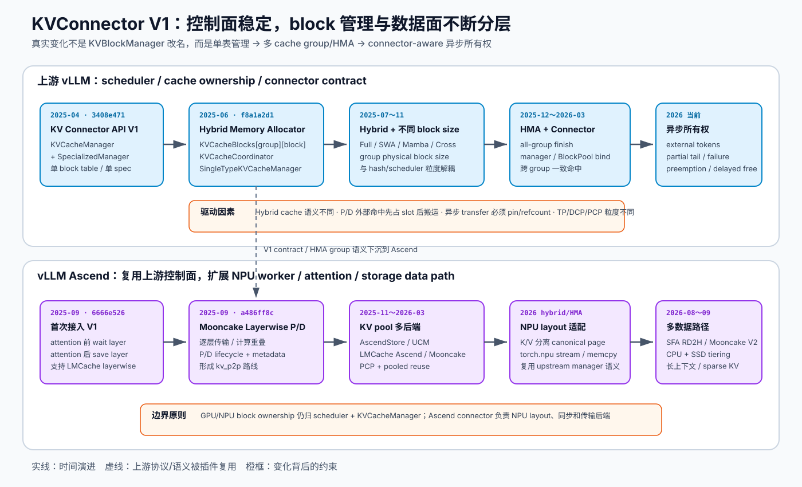

# vLLM / vLLM Ascend：KVConnector V1 与 KV Cache Manager 演进路线

> 分析日期：2026-09-17
>
> vLLM：`435c96f9dbdd29258cb8e0f433c5b54a00cf6b16`
>
> vLLM Ascend：`26f1363f7180dfcbeac1230679976cede6010fc8`
>
> 历史基线：vLLM `3408e471`（KV Connector API V1 首次合入，2025-04-17）；vLLM Ascend `6666e526`（首次接入 V1，2025-09-08）

范围：V1 scheduler、`KVConnectorBase_V1`、`KVCacheManager`、HMA / hybrid cache group，以及 vLLM Ascend 在 NPU 上的 connector 与 KV pool 适配。本文不逐个分析 LMCache、Mooncake、UCM、MemFabric 的内部传输协议，也不讨论 V0 connector。

> **关于文中的引用。** 文中 `路径:行号` 指向工作区里对应仓库的本地检出，`xxx.md:行号` 指向工作区的本地报告；站上没有这些文件、点不开，已按纯文本保留，已上线的姊妹报告则保留为可点击链接。

## 先给结论

1. **KVConnector V1 的本质不是一个“传输类”，而是一套 scheduler / worker 双侧协议。** scheduler 侧负责发现外部命中、为外部 KV 预留 GPU block、生成 metadata、延迟释放；worker 侧负责真正的 load/save、逐层等待和异步完成通知。当前接口仍直接把这两部分写在同一个 `KVConnectorBase_V1` 中。
2. **vLLM V1 的核心类叫 `KVCacheManager`，不是 `KVBlockManager`。** 在本文覆盖的 V1 首次提交和当前主线中，都没有一个承担该职责的 `KVBlockManager` 类。若把“KVBlockManager”理解为“管理 KV block 的组件”，它经历的真实变化是：
   `KVCacheManager + SpecializedManager（单 block table）`
   → `KVCacheManager + KVCacheCoordinator + SingleTypeKVCacheManager（多 cache group）`
   → `不同 block size / hybrid HMA / connector-aware allocation / partial-tail 与异步生命周期`。
3. **这不是简单重命名，而是职责拆分。** `KVCacheManager` 逐渐变成 scheduler 面向的 facade；`KVCacheCoordinator` 负责跨 group 协调；`SingleTypeKVCacheManager` 子类负责 Full Attention、SWA、Chunked Local、Mamba、Cross Attention 等不同保留/回收语义；`BlockPool` 仍拥有物理 block。
4. **vLLM Ascend 的路线不是复制一套 manager。** 它复用上游 scheduler、manager 和 V1 contract，把 NPU 差异压在注册、KV layout、torch.npu stream、Ascend memcpy、attention layer fence，以及 Mooncake/UCM/AscendStore/MemFabric 后端中。当前注册代码明确说明：scheduler-side managers 继续使用上游实现，只替换 worker-side NPU transfer。
5. **变化的直接驱动力有四个：** hybrid 模型的多种 cache 语义；P/D 与外部缓存带来的异步所有权；不同 cache group / TP-DCP-PCP 的不同粒度；为了隐藏传输延迟而做的逐层 load/save overlap。

图的横轴是时间，纵向分成上游 vLLM 的控制面与 vLLM Ascend 的 NPU 数据面。关键点是：Ascend 没有另起一套 block manager；它跟随上游 manager 的 group/HMA 演进，同时在 connector worker 和 attention 边界加 NPU 特化。

## 1. 名称澄清：`KVBlockManager` 到底指什么

在 2025-04-17 首次合入 KV Connector V1 的 vLLM commit `3408e471` 中，核心类已经叫 `KVCacheManager`，并组合一个 `SpecializedManager`；当时只有单一 `KVCacheSpec`、单一 `req_to_blocks` 和单一 block size。

到 vLLM Ascend 首次支持 V1 时，它明确钉在 vLLM `50fede6634a997f4e971ecb4eb4cce337340e394`。该版本中已经是：

- `KVCacheManager`：scheduler 入口；
- `KVCacheBlocks`：按 `kv_cache_group` 返回 block；
- `KVCacheCoordinator`：跨 group 协调；
- `SingleTypeKVCacheManager`：每一种 cache 语义一个 manager。

当前代码仍沿用这套命名。`KVCacheBlocks` 的注释明确说它是 scheduler 与 `KVCacheManager` 之间的隐藏内部结构接口，并把数据组织成 `blocks[group][block]`；当前实现见 `vllm/v1/core/kv_cache_manager.py:34`。`SingleTypeKVCacheManager` 的定义也明确限定为“一种 attention layer cache 类型”的管理逻辑，见 `vllm/v1/core/single_type_kv_cache_manager.py:51`。

因此，本文后续把用户所说的“KVBlockManager”解释为 **KV block 管理子系统**，而不是一个真实类名。

## 2. 上游 vLLM：KVConnector V1 的演进

### 阶段 A：V1 API 把控制面与数据面分开（2025-04）

关键提交：`3408e471`，`[P/D][V1] KV Connector API V1 (#15960)`。

最初版本已经具备今天仍能识别的骨架：

- scheduler 侧查询外部命中：`get_num_new_matched_tokens()`；
- scheduler 分配 block 后通知 connector：`update_state_after_alloc()`；
- scheduler 把 metadata 送到 worker：`build_connector_meta()`；
- worker 启动异步 load：`start_load_kv()`；
- attention 到某一层时等待：`wait_for_layer_load()`；
- attention 计算后逐层保存：`save_kv_layer()`；
- 请求结束时允许 connector 延迟释放 block：`request_finished()`。

这个接口的设计意图是把“**block 放在哪里、何时可复用**”留给 scheduler/cache manager，把“**数据怎么搬**”交给 connector。当前接口的同名方法仍在 `vllm/distributed/kv_transfer/kv_connector/v1/base.py:312`、`:330`、`:344`、`:488`、`:523`、`:549`、`:582`。

为什么这么切：P/D disaggregation 和外部 KV cache 都需要在 scheduler 做 admission 与 block reservation，但真正传输发生在 worker/device。若 connector 直接拥有 scheduler 的 block allocator，第三方后端会侵入调度核心；若 scheduler 自己做传输，又无法适配 NIXL、Mooncake、LMCache、NPU 等不同数据面。

### 阶段 B：从单 block table 到 HMA 多 cache group（2025-06）

关键提交：`f8a1a2d1`，`[v1] Hybrid Memory Allocator (#17996)`。

这是 manager 体系最大的结构变化：

| 之前 | 之后 |
|---|---|
| `KVCacheManager` 自己持有单一 `req_to_blocks` | `KVCacheManager` 作为 facade，把实际策略下放给 coordinator / per-type manager |
| `SpecializedManager` 只处理单个 spec 的差异 | `SingleTypeKVCacheManager` 每个 cache group 一个实例 |
| 返回 `list[KVCacheBlock]` | 返回 `KVCacheBlocks(tuple[group][block])` |
| 一个 block size 同时承担调度、hash、物理分配粒度 | 后续逐步分出 scheduler / hash / group physical block size |
| connector 默认只看一组 block ids | HMA connector 要处理 `tuple[list[int], ...]` 的所有 group |

当前 `KVCacheManager` 构造 `KVCacheCoordinator`，并从 coordinator 暴露 `block_pool`，见 `vllm/v1/core/kv_cache_manager.py:170`。`HybridKVCacheCoordinator` 明确服务于“multiple KV cache types / multiple kv cache groups”，见 `vllm/v1/core/kv_cache_coordinator.py:615`。

为什么要变：Full Attention 的 block 要一直保留；SWA / local attention 会回收窗口外 block；Mamba 保存的是 recurrent state，生命周期与 token KV 不同。一个 request 只有一张 block table 时，无法同时正确表达这些语义，也无法给各类 cache 独立计算容量和命中。

### 阶段 C：hybrid 模型与不同 block size 成为一等公民（2025-07 ～ 2025-11）

关键提交：

- `2f35a022`：`Enable V1 for Hybrid SSM/Attention Models (#20016)`；
- `48ddb02b`：`Support KV cache groups with different block_size (#29143)`。

这一阶段从“多个 group，但结构近似”推进到“每个 group 可以有不同物理跨度”。当前 `KVCacheBlocks` 的注释直接解释了为何外层必须是 group：若未来不同 group 采用不同 block size，以 token block 作为外层维度会失效，见 `vllm/v1/core/kv_cache_manager.py:42`。

当前 `SingleTypeKVCacheManager` 同时记录：

- `scheduler_block_size`：调度共同粒度；
- `block_size`：本 manager 的实际分配粒度；
- `cache_hit_alignment_tokens`：prefix hit 对齐粒度；
- DCP/PCP 缩放；
- `req_to_blocks`：该 group 的 request → block table。

证据见 `vllm/v1/core/single_type_kv_cache_manager.py:72` 到 `:135`。

为什么要变：hybrid 模型的 Mamba state block、Full Attention KV block、SWA block 不一定有相同 token span；DCP 还会扩大一个 rank 看到的有效 block span。强制相同 block size 会浪费容量、错误计算命中边界，或导致 connector 搬错长度。

### 阶段 D：HMA 与 connector 真正融合（2025-12 ～ 2026-03）

关键提交：

- `52bf0665`：`Support hybrid allocator + kv cache connector (#30166)`；
- `5b3ba94a`：`Support HMA+NixlConnector (#35758)`。

接口从单 group 的 `request_finished(request, list[int])` 扩展出 `SupportsHMA.request_finished_all_groups(request, tuple[list[int], ...])`。当前 scheduler 对不支持 HMA 的 connector 只允许一个 group；支持 HMA 时才把所有 group 的 block ids 交出去，见 `vllm/v1/core/sched/scheduler.py:2902`。

为什么要变：外部 KV 如果只保存 Full Attention，而漏掉 Mamba boundary state，命中的 token 前缀并不代表模型状态完整；反过来只命中 recurrent state 也不能跳过 attention KV。connector 必须知道并一致处理所有 cache group。

### 阶段 E：外部命中成为显式的分配状态（2026）

早期 `allocate_slots()` 的 `num_new_tokens` 同时包含外部 token，语义容易混淆。当前 scheduler 明确拆出：

- `num_new_local_computed_tokens`；
- `num_external_computed_tokens`；
- `load_kv_async`；
- `delay_cache_blocks`。

当前调用链见 `vllm/v1/core/sched/scheduler.py:913`、`:928`、`:1160`。`KVCacheManager.allocate_slots()` 的布局图也把 `comp / new_comp / ext_comp / new / lookahead` 分开，见 `vllm/v1/core/kv_cache_manager.py:319`。

为什么要变：外部命中不是“已经在 GPU 上算完的 token”。scheduler 必须先给它分配目标 slot，然后 connector 才能异步填充；在填充完成前这些 block 不能进入普通 prefix cache，也不能被抢占覆盖。

### 阶段 F：异步生命周期、partial tail 与可靠交付（2026-06 以后）

关键提交包括：

- `7c370966`：把 `scheduler_block_size` 显式传入 manager/coordinator；
- `d467a2a7`：async scheduler + PD consumer 下延迟 block free；
- `d7428566`：可靠处理 sub-block prompt 的 partial-tail offload；
- `229e01e9` / `58d3918e`：hybrid group prefix-hit divergence；
- `2aac565c`：在没有同步 load 时，把独立异步 load 推迟到 forward launch 之后，以增加重叠。

当前 connector 还能声明 `requires_kv_delivery`。如果请求在 hand-off 未完成时被 preempt，可靠交付 connector 不能继续使用已经释放的 block，见 `vllm/distributed/kv_transfer/kv_connector/v1/base.py:200`。请求结束前 scheduler 会先处理 partial tail、裁掉窗口外 block，再让 connector 决定是否延迟释放，见 `vllm/v1/core/sched/scheduler.py:2873`。

为什么要变：最初的“full block、同步边界、单一完成事件”假设不再成立。chunked prefill 会产生不满一块的尾部；spec decode 会产生 lookahead；async scheduler 允许下一 step 与上一 step in-flight；connector save 又可能比 request finish 更晚完成。所有权必须被显式建模，否则就是 use-after-free 或静默传输脏数据。

## 3. vLLM Ascend：从“能调用 V1”到 NPU KV 数据平面

### 阶段 1：补齐 attention layer hook（2025-09）

关键提交：`6666e526`，`Added support for KV connector v1 (#2039)`。

该提交没有复制 scheduler 或 manager，而是在 Ascend attention 前后插入：

- attention 前：`wait_for_kv_layer_from_connector(layer_name)`；
- attention 后：`maybe_save_kv_layer_to_connector(layer_name, kv_cache)`。

提交说明明确写明：需要像 vanilla vLLM 一样支持 V1 connector，并支持 LMCache 所需的 layerwise KV 管理。当前这些 hook 已集中到 `vllm_ascend/attention/utils.py:503` 和 `:517`，并增加 `has_connector_metadata()` 防止空 metadata 时误等待。

为什么要这样接：只在 model runner 的 forward 前后做整模型 load/save，传输与计算不能重叠。逐层 hook 允许“第 N 层计算时搬第 N+1 层”或“第 N 层算完立即保存”，降低 TTFT 与额外 HBM 峰值。

### 阶段 2：独立的 layerwise P/D connector（2025-09）

关键提交：`a486ff8c`，`KVCache Transfer via Layer-wise Strategy in Disaggregation (#2602)`。

Ascend 新增 Mooncake layerwise connector，并同时增加负载均衡代理、parallel state 与大量生命周期测试。这里开始形成两条产品路线：

- `kv_p2p`：Prefill / Decode 实例之间直接传输；
- `kv_pool`：把外部存储当作可查询、可复用的 KV 池。

两者共享 `KVConnectorBase_V1` contract，但命中发现、key 设计、目标内存和完成语义不同。

### 阶段 3：KV pool 后端扩展（2025-11 ～ 2026-03）

代表提交：

- `4dbe4fd1`：pooling + PCP；
- `195eac66`：UCMConnector，支持 DRAM / NFS / local disk；
- `2ef4d197`：修复 P/D 场景下 KV Pool；
- `6852a2e2`：注册 LMCacheAscendConnector；
- `675387f1`：Mooncake Layerwise Connector 接入 KV pool。

路线从“一个 Mooncake P/D connector”变成“统一 V1 生命周期 + 多个外部池实现”。这也是为什么 connector 自身越来越薄：当前 `AscendStoreConnector` 在 scheduler 侧把命中、分配后状态、metadata 和完成事件委托给 `KVPoolScheduler`，worker 侧委托给 `KVPoolWorker`，见 `vllm_ascend/distributed/kv_transfer/kv_pool/ascend_store/ascend_store_connector.py:129`、`:156`、`:240`。

### 阶段 4：适配 hybrid/HMA 与 Ascend 特有 cache layout（2026）

Ascend 不能假设上游 CUDA connector 看到的是一个 packed tensor。当前注册代码明确说：上游 native offloading worker 假设 attention KV 被打包成一个 tensor，而 Ascend 保持 K/V 分离，因此只替换 worker-side canonicalization，继续复用上游 scheduler、manager、metrics 和 transfer lifecycle，见 `vllm_ascend/distributed/kv_transfer/__init__.py:91`。

对应实现会把分离的 K/V、scale 或 recurrent state 统一成 canonical page view，并验证 stride、覆盖范围和 page bytes，见 `vllm_ascend/distributed/kv_transfer/kv_pool/kv_offload/native/offloading_connector.py:39` 与 `:91`。

同时，AscendStore 自己也复用上游 `SingleTypeKVCacheManager` 的 manager class 来重建外部池的可达性规则；它按 effective spec 分组并支持不同 group block size，见 `vllm_ascend/distributed/kv_transfer/kv_pool/ascend_store/coordinator.py:70`、`:106`、`:376`。

为什么要这样做：外部池必须与 GPU manager 对“哪些 block 仍代表有效 prefix”达成一致。复制一套简化规则会在 SWA、Mamba align、EAGLE、DCP 等场景产生“外部认为命中、GPU 侧状态却不可恢复”的假命中。

### 阶段 5：模块收敛、长上下文与多级 offload（2026-08 ～ 2026-09）

代表提交：

- `11e95c10`：把 AscendStore metadata、backend、connector、attention fence 收拢到 `ascend_store` package；
- `7a25ef83`：SFA P/D RD2H connector，Prefill 暴露地址，Decode 主动 pull 到 pinned CPU pool / rank-local device memory；
- `9d8cc214`：native 与 simple offload 收敛到 `kv_offload`；
- `9ccc290b`：加入 DRAM + SSD 多级 offloading framework；
- `c5a4d32b`：MooncakeConnectorV2。

当前 factory 同时注册 Mooncake V1/V2/Pull/Hybrid/Layerwise、AscendStore、UCM、Offloading、Simple CPU、Recompute CPU、SFA RD2H 等实现，见 `vllm_ascend/distributed/kv_transfer/__init__.py:38` 到 `:129`。

这一步的动因已经超出“P/D 传一次 KV”：目标变为长上下文容量扩展、跨请求池化复用、分层存储、异构 TP/DP/PP，以及 layerwise overlap。V1 contract 继续作为公共控制面，不同 connector 只负责不同数据路径。

## 4. 当前一次外部 KV 命中的完整链路

1. **本地命中。** scheduler 先让 `KVCacheManager` 查询本地 prefix；hybrid 场景还会处理 group 间命中深度不一致。
2. **外部命中。** scheduler 调用 `connector.get_num_new_matched_tokens()`；返回 `None` 表示查询尚未完成，请求暂不调度，见 `vllm/v1/core/sched/scheduler.py:928`。
3. **预留目标 block。** `allocate_slots()` 同时接收 local hit、external hit、lookahead 和 async flag，见 `vllm/v1/core/sched/scheduler.py:1160`。
4. **把逻辑命中绑定到物理 block。** scheduler 调用 `update_state_after_alloc()`，connector 此时才知道应该把远端 KV 写入哪些 GPU block，见 `vllm/v1/core/sched/scheduler.py:1183`。
5. **生成并下发 metadata。** `build_connector_meta()` 结果进入 `SchedulerOutput.kv_connector_metadata`，见 `vllm/v1/core/sched/scheduler.py:1435`。
6. **worker 发起 load。** model runner 在 forward context 中调用 `start_load_kv()`；允许异步启动。
7. **逐层消费。** attention 到某层时调用 `wait_for_layer_load(layer_name)`；计算写完后调用 `save_kv_layer()` 或 `on_kv_cache_written()`。Ascend hook 见 `vllm_ascend/attention/utils.py:503`、`:517`、`:534`。
8. **完成与释放。** worker 上报 send/recv completion；请求结束时 connector 可接管 block 的延迟释放。HMA connector 接收所有 group，见 `vllm/v1/core/sched/scheduler.py:2902`。

## 5. “从什么变成什么，为啥”压缩表

| 维度 | 从 | 变到 | 原因 |
|---|---|---|---|
| manager 结构 | 单 `KVCacheManager` + `SpecializedManager` | facade + coordinator + per-type managers + shared `BlockPool` | hybrid 模型不同 cache 的生命周期不同 |
| block table | 单 `list[KVCacheBlock]` | `KVCacheBlocks(tuple[group][block])` | 一个 request 同时拥有多类 cache |
| block 粒度 | 单一 block size | scheduler / hash / group physical block size 分离 | 不同 group、DCP、Mamba/SWA 粒度不同 |
| 外部命中 | 混在 `num_new_tokens` | 独立 `num_external_computed_tokens` + async 状态 | 外部命中要先分配目标 slot，后搬数据 |
| connector 完成 | 请求级 send/recv | layerwise、partial tail、failure、preemption、delayed free | 计算/传输 overlap 与异步生命周期 |
| connector 对 manager 的关系 | 只接收分配结果 | 可绑定 `KVCacheManager` / `BlockPool`，HMA 处理全 group | offload 要 pin/refcount/扫描 cache residency |
| Ascend 适配 | 在 attention 加 wait/save hook | factory 覆盖 + NPU canonical layout + torch.npu stream + 多后端 | 复用上游控制面，同时适配 NPU 内存布局和传输栈 |
| 外部能力 | 单次 P/D KV transfer | P2P + KV pool + CPU/SSD tiering + sparse/long-context offload | 从解耦 prefill/decode 扩展到容量与跨请求复用 |

## 6. 设计判断与边界

### 观察到的事实

- 当前 vLLM scheduler 构造 `KVCacheManager` 后把它绑定给 connector，见 `vllm/v1/core/sched/scheduler.py:296`。
- 当前 connector 可以直接获得 `BlockPool`，用于 ref count 或遍历 prefix block，见 `vllm/distributed/kv_transfer/kv_connector/v1/base.py:473`。
- 当前不支持 HMA 的 connector 被限制为单 cache group，见 `vllm/v1/core/sched/scheduler.py:2902`。
- 当前 vLLM Ascend factory 明确复用 upstream scheduler/manager，只覆盖 NPU worker data path，见 `vllm_ascend/distributed/kv_transfer/__init__.py:21` 与 `:91`。

### 基于结构的推断

- `KVConnectorBase_V1` 已经从“稳定抽象”变成一个较宽的兼容面：P/D、pool、offload、HMA、stats、events、handshake、failure 都往同一基类增长。Mooncake V2 和各模块拆分说明项目正在把实现内部再拆成 scheduler/worker/metadata，而不是立即更换公共 V1 contract。
- manager 与 connector 的耦合会继续增加，但更可能通过 capability 和窄接口增加，而不是让 connector 自己分配 GPU block。原因是 block ownership 必须保持在 scheduler 的 admission/preemption 模型内。
- Ascend 后续维护成本主要来自“上游 cache semantics × NPU layout/stream semantics”的组合，而不是 connector 数量本身。最危险的错通常是 block 粒度、group 映射、完成时序和 graph replay，而不是后端 API 调用。

### 尚未证明的内容

- 本报告没有用真实 NPU 运行 workload，因此不对每条 connector 路径的性能和正确性作运行时背书。
- MooncakeConnectorV2 的提交说明称详细 RFC 后补；仅从当前代码和注册关系无法证明它会取代所有 V1 connector。
- 本报告没有展开外部系统自身的容错、持久化和一致性协议。

## 7. 建议的阅读顺序

1. `vllm/distributed/kv_transfer/kv_connector/v1/base.py`：先理解 scheduler / worker contract。
2. `vllm/v1/core/sched/scheduler.py`：看 local hit、external hit、allocate、metadata、finish 的主链路。
3. `vllm/v1/core/kv_cache_manager.py`：理解 facade 与 allocation invariants。
4. `vllm/v1/core/kv_cache_coordinator.py`：理解 multi-group / hybrid 协调。
5. `vllm/v1/core/single_type_kv_cache_manager.py`：理解各 cache 类型的保留和回收语义。
6. `vllm_ascend/distributed/kv_transfer/__init__.py`：看 Ascend 覆盖了哪些 connector/data path。
7. `vllm_ascend/attention/utils.py`：看 layerwise load/save fence。
8. `vllm_ascend/distributed/kv_transfer/kv_pool/ascend_store/`：看 KV pool 如何复用上游 manager 语义。

当前类关系见 `kvconnectorv1-current-classes.puml`。
