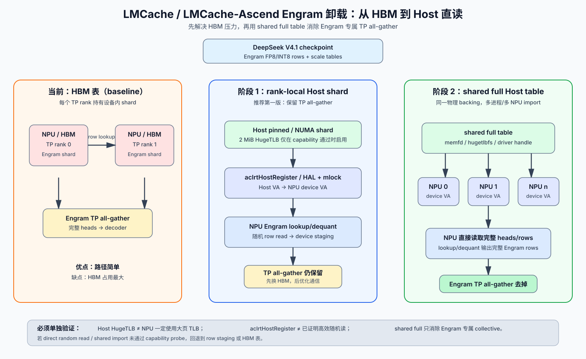
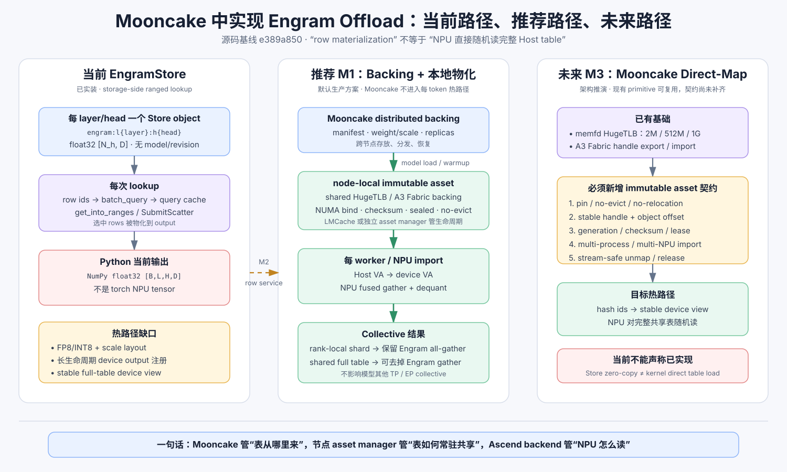

# 在 LMCache / LMCache-Ascend / Mooncake 中增加 DeepSeek V4.1 Engram 卸载

## 结论先行

建议按“两阶段”实现：

1. **阶段 1：每个 TP rank 一份 Host shard。** LMCache 管模型级只读表的分配、加载和生命周期；LMCache-Ascend 管 Host 注册、device VA 映射和 NPU lookup/dequant kernel。模型层继续做 Engram 专属 TP all-gather。先解决 HBM 压力，风险最低。
2. **阶段 2：每节点/NUMA 域一份 shared full Host table。** 多个 worker 映射同一份物理页，每个 NPU 都能读完整 heads/rows，再去掉 Engram 专属 TP all-gather。这个阶段需要 shared HugeTLB/映射/import 能力，不能只打开现有 hugepage 配置。

如果引入 Mooncake，推荐把它放在 **distributed/durable backing store** 的位置：Mooncake 负责跨节点存放、分发和恢复 Engram 表；模型加载或 warmup 阶段把表物化成节点内的 immutable Host asset；LMCache-Ascend 负责 Host VA → NPU VA 和 lookup/dequant。当前 Mooncake 已有 `EngramStore` 和 Ascend Direct/Fabric Memory 基础能力，但现有 `EngramStore.lookup()` 仍是 float32 ranged read → CPU NumPy，不能直接等同于“推理期 NPU 随机直读完整 Host 表”。

不要把 Engram 表直接塞进普通 `StorageManager.put/get` 热路径：普通 LMCache 的 key 是 token chunk hash，对象默认可淘汰并带 request/refcount 语义；Engram 是模型加载期创建、推理期只读、模型卸载时释放的模型资源。

本报告基于：LMCache `68b7e5f58f7f4caca4d3bc0f11e78cd551e55e24`、LMCache-Ascend `e05a7570962a5c76cd32ec0bab86aeda1a3a4057`、Mooncake `e389a85093cb37a96ccf68dcfbe2dcff0698a99e`。Mooncake 本地 `main` 在分析时落后 `origin/main` 96 commits，因此下文只代表这个 pinned commit。文中“源码确认”表示当前工作树可定位；“设计建议/架构推演”表示需要新增或由驱动验证的能力。

## 一页看懂



- 当前：表在 HBM，每个 rank 读自己的 shard。
- 阶段 1：每个 rank 读自己的 Host shard，NPU kernel 直接 gather/dequant，TP all-gather 保留。
- 阶段 2：节点共享一份完整 Host 表，每个 NPU 都能读完整 heads/rows，Engram 专属 TP all-gather 才可以去掉。

Mooncake 的当前能力、推荐接法和未来 direct-map 路径见：



## 当前源码事实

### vLLM 有参考实现，但它是 CUDA 专用

`vllm/vllm/config/engram.py:65-83` 明确要求 CUDA：

```python
if (
    model_config is None
    or field is None
    or not current_platform.is_cuda()
    or not getattr(model_config.hf_text_config, field, None)
):
    raise ValueError(
        "EngramConfig requires a model with supported Engram "
        "embeddings, non-empty n-gram layer ids, and CUDA."
    )
```

模型算法可以参考：

- `vllm/models/deepseek_v41/common/engram.py`：hash id、bucket layout、row lookup、scale 解码。
- `vllm/models/deepseek_v41/nvidia/engram.py`：CPU offload、UVA view、DP shared memory、prefetch、TP/DP gather。
- `vllm/models/deepseek_v41/nvidia/model.py:602-617`：forward 中先算 hash，再 `prepare_embeddings`。

shared-memory 参考代码由 leader 创建 `/dev/shm` 文件，其他进程 `mmap(MAP_SHARED)`，再注册 Host memory：

```python
# vllm/vllm/models/deepseek_v41/nvidia/engram.py:115-147（节选）
backing_file.truncate(num_bytes)
mapping = mmap.mmap(file.fileno(), num_bytes, flags=mmap.MAP_SHARED)
...
result = torch.cuda.cudart().cudaHostRegister(pointer, num_bytes, 0)
```

这是 CUDA/UVA 参考，不是 Ascend 已有实现。

### vllm-ascend 目前只有设备内 INT8 gather/dequant

`vllm-ascend/vllm_ascend/ops/triton/engram_int8.py:41-61`：

```python
def gather_dequantize_engram_int8(weight, scales, ids):
    ...
    output = torch.empty(
        (ids.shape[0], 256), dtype=torch.bfloat16, device=weight.device
    )
    _engram_int8_gather_dequant_kernel[(ids.shape[0],)](
        weight, scales, ids, output, ids.shape[0], WIDTH=256, num_warps=4
    )
    return output
```

该函数检查 `weight/scales` 是 NPU tensor（`engram_int8.py:41-51`）。当前没有看到 Engram 模型构造、Host table 注册、shared backing 或模型级生命周期的 Ascend 接入。因此它只能作为设备内表的算子参考；Host direct-read 需要新的 kernel 或 row-staging fallback。

### LMCache 主路径是 token-KV

```python
# lmcache/lmcache/utils.py:388-395
@dataclass(slots=True)
class CacheEngineKey:
    model_name: str
    world_size: int
    worker_id: int
    chunk_hash: int
    dtype: torch.dtype
```

`LMCacheEngine.store()` 的入参是 `tokens/hashes/offsets/mask`（`lmcache/v1/cache_engine.py:388-410`），`StorageManager.allocate()` 按 shape/dtype/`MemoryFormat` 分配普通 `MemoryObj`，默认参与 eviction（`storage_manager.py:329-347`）。这套语义不适合模型级 immutable Engram。

### Hugepage 开关在 NPU 上并不等于 HugeTLB 实装

配置存在：

```python
# lmcache/lmcache/v1/config.py:97-101
"local_cpu_use_hugepages": {
    "type": bool,
    "default": False,
    "env_converter": _to_bool,
},
```

但当前只读 2 MiB 池（`memory_management.py:525-542`）：

```python
NOTE: We only use 2 MiB hugepages
base = "/sys/kernel/mm/hugepages/hugepages-2048kB"
```

非 CUDA 平台明确降级为普通 pinned allocation（`platform/torch_ops.py:506-518`）：

```python
# Hugepage variants: non-CUDA platforms do not support hugepages, so these
# fall back to the same regular pinned allocation.
def alloc_hugepage_pinned_ptr(size: int, device_id: int = 0) -> int:
    warnings.warn("Hugepages requested but not available on non-CUDA platforms; ...")
    return alloc_pinned_ptr(size, device_id)
```

此外，`memory_management.py:474-476` 禁止 shared memory 与 explicit hugepages 同时使用：`Hugepages are not supported with shared memory (shm)`。阶段 2 必须新增 shared HugeTLB/driver-backed allocator。

### LMCache-Ascend 已有 Host → device VA 基础能力

```cpp
// lmcache-ascend/csrc/common/managed_mem.h:8-13
struct RegisteredMemoryRecord {
  uintptr_t ptr;
  uintptr_t devptr;
  size_t buffSize;
  int32_t device;
};
```

新驱动调用 `aclrtHostRegister`，旧驱动走 HAL + `mlock`：

```cpp
// lmcache-ascend/csrc/common/managed_mem.cpp:347-365
if (lmc::is_version_at_least_25(verString)) {
  record = hmm.registerHostPtr(ptr, size);
} else {
  record = hmm.halRegisterHostPtr(ptr, size);
}
return reinterpret_cast<void *>(record->devptr);
```

旧驱动路径 `mlock` 失败会报错（`managed_mem.cpp:125-149`），所以部署要准备 `RLIMIT_MEMLOCK`/`SYS_RESOURCE`。NPU kernel 侧已有 CPU tensor 取 device pointer 的通用代码：

```cpp
// lmcache-ascend/csrc/utils.h:32-45
} else if (device.is_cpu()) {
  void *devPtr = get_device_ptr(tensor.data_ptr());
  TORCH_CHECK(devPtr != nullptr,
              "Unable to retrieve device ptr, is this a host registered pointer ?");
  return reinterpret_cast<T *>(devPtr);
}
```

这说明“CPU tensor 作为已注册 Host buffer，被 NPU kernel 访问”的基础存在；但当前 kernel 是 KV scatter/gather，不是 Engram 随机 row lookup。

`csrc/pybind.cpp:54-75` 只暴露 `get_device_ptr/register_mapping/unregister_ptr` 和 KV transfer op，没有面向 Python 的完整 Engram asset/register API。

## 推荐架构边界

### 1. LMCache core：模型级只读 asset

建议新增（名称是设计建议）：

```python
@dataclass(frozen=True)
class ModelAssetDescriptor:
    model_id: str
    revision: str
    kind: str                 # "engram"
    layer_id: int
    table_id: str
    rows: int
    dim: int
    dtype: str
    scale_dtype: str | None
    layout: str                # "rank_shard" | "shared_full"
    numa_node: int | None
    page_size: int | None
    readonly: bool = True

class ImmutableHostTensor:
    """Model-lifetime object; never enters token-KV LRU."""
    def device_view(self, device_id: int): ...
    def seal_readonly(self): ...
    def close(self): ...
```

生命周期应为 `ALLOCATED → LOADED → REGISTERED → SEALED → CLOSED`；不参与 token LRU、request refcount 或 chunk-hash 查找。descriptor 必须带 model revision/checksum、layer/table、量化 layout、shard/full policy、NUMA/page size。

### 2. LMCache-Ascend：平台 allocator + lookup kernel

建议新增独立 Engram backend：

- `allocate_host_table(size, page_size, numa_node, shared_handle=None)`：普通 pinned、2 MiB HugeTLB，未来再探测 1 GiB。
- `load_table_once(...)`：模型加载期完成，推理期只读。
- `register_host_table(host_ptr, size, device_set)`：为每个 NPU 保存 device VA。
- `get_device_view(asset_id, device_id)`：返回稳定 device VA、shape、scale layout、capability。
- `engram_lookup` / `engram_lookup_dequant`：hash ids + Host device VA → NPU staging；支持 direct-read 和 staging 两种模式。
- `unregister_host_table` / `release_shared_handle`：同步 stream 后再释放。

不要把这些能力塞进现有 KV connector；`slot_mapping`、KV layout 和 request chunk 语义都不适用于模型权重。

### 3. vLLM / vLLM-Ascend 模型侧

保留 vLLM 的 Engram hash、dead mask、lookback、bucket/head layout 和量化语义，替换权重存储和 lookup：

```text
DeepSeek Engram module
  ├─ hash ids / dead mask / lookback      （模型侧）
  ├─ ModelAssetManager.open("engram")     （LMCache）
  ├─ LMCache-Ascend.device_view(asset)    （Host VA → NPU VA）
  └─ lmc_ops.engram_lookup_dequant(...)   （Ascend 新算子）
```

接入点可对齐现有模型：`DeepseekV4DecoderLayer` 创建 Engram（`nvidia/model.py:181-192`），forward 先生成 hash 后 `prepare_embeddings`（`model.py:602-617`）。

## 两阶段数据流

### 阶段 1：rank-local Host shard

```text
checkpoint full table
  → 只加载本 rank 的 head/row range
  → Host pinned/NUMA allocation
  → aclrtHostRegister 或 HAL + mlock
  → NPU device VA
  → lookup/dequant 到 device staging
  → 现有 TP all-gather
  → decoder
```

优点是单进程/单 rank 即可验证，改动小，不需要跨进程共享物理页；缺点是仍有 Engram TP all-gather，Host 表按 rank 分片。

### 阶段 2：shared full Host table

```text
node leader: allocate shared backing + load full table + seal
  → export handle（fd/uuid + size + checksum + layout）
  → 每个 worker mmap/import/register 到自己的 NPU
  → 每个 NPU 读完整 heads/rows
  → Engram 输出直接进入 decoder（不做 Engram TP all-gather）
```

“shared”必须是同一份物理 backing，而不是多个进程各自申请后广播内容。可选 backing：`memfd`/`/dev/shm`（简单但不保证 HugeTLB）、`hugetlbfs` 文件（显式 2 MiB/1 GiB，但需要 quota/权限）、驱动 shared allocation/import handle（最可靠但依赖 Ascend API）。

## Mooncake 当前到底已经实现了什么

### 源码确认：已有专用 `EngramStore`，但边界只到 storage backend

Mooncake 不是从零开始。`mooncake-store/include/engram/engram_store.h:16-25` 已明确声明它拥有 per-head 命名、批量 populate/remove 和按 row id 查询，但不负责 tokenizer compression、N-gram hash、routing、gate 或 convolution：

```cpp
/**
 * Mooncake backend for Engram embedding tables.
 *
 * This class intentionally owns only storage-side concerns:
 * - per-head table naming/layout in Mooncake Store
 * - batch populate / remove
 * - row-id based embedding lookup
 *
 * It does not implement tokenizer compression, N-gram hashing, routing,
 * gating, convolution, or any other model-side Engram logic.
 */
```

物理配置也很窄，调用方必须给出每个 head 的最终 row 数和 embedding width（`mooncake-store/include/engram/engram_store_config.h:9-19`）：

```cpp
struct EngramStoreConfig {
    std::vector<int64_t> table_vocab_sizes = {1024};
    int embedding_dim = 64;
};
```

当前 key 只有 layer/head（`mooncake-store/src/engram/engram_store.cpp:35-40`）：

```cpp
for (size_t h = 0; h < table_vocab_sizes_.size(); ++h) {
    std::ostringstream oss;
    oss << "engram:l" << layer_id << ":h" << h;
    embed_keys_.push_back(oss.str());
}
```

因此当前 key 没有 model id、revision、checkpoint checksum、dtype 和 layout version；同一个 Store 中加载多模型，或用同一 layer id 替换 checkpoint，存在命名冲突和误读旧对象的风险。

### 源码确认：当前表和 Python API 固定为 float32

lookup 的 row stride 是 `embedding_dim * sizeof(float)`（`mooncake-store/src/engram/engram_store.cpp:51-53`），populate 也要求整张表大小严格等于 `rows * dim * sizeof(float)`（同文件 `244-248`）：

```cpp
const size_t row_bytes =
    static_cast<size_t>(embedding_dim_) * sizeof(float);

const size_t expected = static_cast<size_t>(table_vocab_sizes_[i]) *
                        embedding_dim_ * sizeof(float);
```

Python binding 只接收 NumPy float32（`mooncake-integration/store/engram_store_py.cpp:90-113`），lookup 总是新建 CPU NumPy float32 输出（同文件 `116-135`）：

```cpp
py::array_t<float> output({B, L, H, D});
auto out_buf = output.request();

int ret =
    self.lookup_rows(row_ids, out_buf.ptr, out_buf.size * sizeof(float));
```

这与 DeepSeek Engram 的 FP8/INT8 weight + scale 高效布局不匹配：若先膨胀成 float32 再存，会同时增加 Store 容量、网络字节和 Host staging 带宽，也失去 NPU 端 fused gather + dequant 的机会。

### 源码确认：populate 是 create-only 的批量上传

`EngramStore::populate()` 先用 `batchIsExist` 检查所有 head key 不存在，再注册输入 buffer，调用 `batch_put_from`，最后 unregister；部分上传或清理失败时 best-effort 删除已发布对象（`mooncake-store/src/engram/engram_store.cpp:252-330`）：

```cpp
std::vector<int> put_results =
    store_->batch_put_from(embed_keys_, embedding_buffers, buffer_sizes);
```

这适合 checkpoint import/job 或模型发布阶段，不适合在 forward 热路径反复调用。若复用同一 layer id，当前语义要求先 `remove_from_store()`。

### 源码确认：lookup 已经是 batched ranged/scatter read

输入 row ids 是 `[B,L,H]`。当前实现为每个 head、每个 token 生成三个数组：

```text
dst_offset = ((b * L + l) * H + h) * row_bytes
src_offset = row_id[b,l,h] * row_bytes
size       = row_bytes
```

对应代码位于 `mooncake-store/src/engram/engram_store.cpp:95-110`。随后它注册输出 buffer，批量查询对象 placement，把 query 结果放进 request-scoped cache，再一次调用 `get_into_ranges()`（同文件 `115-135`）：

```cpp
const int register_ret =
    store_->register_buffer(output_buffer, expected_size);
...
auto query_results = store_->batch_query(embed_keys_);
...
auto results = store_->get_into_ranges(buffers, all_keys, all_dst_offsets,
                                       all_src_offsets, all_sizes,
                                       &query_result_cache);
const int unregister_ret = store_->unregister_buffer(output_buffer);
```

`QueryResultCache` 的接口注释明确限定为同一次 request 内复用，不能跨独立推理请求长期缓存 placement/lease（`mooncake-store/include/pyclient.h:214-218`）。

对 memory replica，`RealClient::get_into_ranges_internal()` 有两条主要路径：

- 本地 replica 且目标是 device pointer 时，逐 range 调 `execute_ranged_read()`（`mooncake-store/src/real_client.cpp:3877-3924`）。
- 其他 memory replica 会把同一对象的多个 offsets/lengths 组成 `ScatterTransferRange`，最终一次 `SubmitScatter`（同文件 `3926-3959`、`4006-4026`）。

所以这里的 “scatter” 是把被选中的 rows 物化到一个输出 tensor，并不是把完整 Engram 对象的稳定地址交给 NPU kernel。即使 Store transfer 是 zero-copy，也不能推导出 NPU 已能对完整表做任意随机 load。

### 文档与 pinned commit 源码存在冲突

`docs/source/design/store/engram.md:17-29` 声称当前实现不依赖 transfer scatter read、`get_into_range`、`batch_query` 或 query cache；但同一文档 `108-118` 又描述 `get_into_ranges()`，而源码 `engram_store.cpp:115-134` 确实调用了 `batch_query`、`QueryResultCache` 和 `get_into_ranges`。本报告以 pinned commit 的可执行源码为准，并把前半段文档描述视为未同步。

### 源码确认：Mooncake 已有可复用的 Ascend、共享内存和大页基础设施

Mooncake 的 Ascend Direct Transport 支持 Host-to-Device、Device-to-Host 和 Device-to-Device 传输；文档要求构建时启用 `USE_ASCEND_DIRECT`（`docs/source/design/transfer-engine/ascend_direct_transport.md:3-9`）。这使“按 row 拉取到 NPU staging”比从零开发传输层更现实。

在 Ascend dummy/agent 模式下，`register_buffer()` 会识别 NPU device pointer，并通过 IPC export/import 映射给 RealClient（`mooncake-store/src/dummy_client.cpp:959-998`、`884-913`；`real_client.cpp:2585-2660`）。因此新增 `lookup_into(torch_npu_tensor)` 后，Mooncake 有机会把 ranged read 直接落到预分配 NPU staging，而不必先返回 NumPy 再做 Python 层 H2D copy。这里仍然是 **row materialization**，不是 NPU 直接读完整 Store object。

普通 shared Host buffer 已支持 memfd HugeTLB。`MC_STORE_USE_HUGEPAGE` 打开后，`ShmHelper` 用 `MFD_HUGETLB` 创建共享内存（`mooncake-store/src/shm_helper.cpp:101-124`）；页大小由 `MC_STORE_HUGEPAGE_SIZE` 选择 2 MiB、512 MiB 或 1 GiB，默认 2 MiB（`mooncake-store/include/common/client_buffer_allocation.h:46-81`）。这比当前 LMCache-Ascend 非 CUDA hugepage fallback 更接近 shared Host table 的需求。

A3 Fabric Memory 路径更进一步：allocator 首选 `ACL_MEM_P2P_HUGE1G`、Host NUMA placement，失败后回落到普通 Host location，再回落到 `ACL_MEM_P2P_HUGE`（`mooncake-transfer-engine/src/transport/ascend_transport/ascend_allocator.cpp:81-135`）：

```cpp
prop.allocationType = ACL_MEM_ALLOCATION_TYPE_PINNED;
prop.memAttr = ACL_MEM_P2P_HUGE1G;
prop.location.type = ACL_MEM_LOCATION_TYPE_HOST_NUMA;
...
prop.memAttr = ACL_MEM_P2P_HUGE;
```

Fabric backing 可导出 `aclrtMemFabricHandle`，RealClient 再 import、reserve VA 和 `aclrtMapMem`（`mooncake-store/src/dummy_client.cpp:377-405`；`real_client.cpp:2533-2580`）。它要求 A3、CANN 9.0+、HDK 26.0+，由 `ASCEND_ENABLE_USE_FABRIC_MEM=1` 开启（`docs/source/design/transfer-engine/ascend_direct_transport.md:52-69`）。

但现有这些机制服务的是 Store buffer/transport 生命周期。当前没有 Engram API 能返回“对象的稳定 NPU 可解引用 VA + immutable lease + layout manifest”，也没有源码证明 Engram lookup kernel 能直接消费该 VA。因此 Fabric Memory 是实现 shared direct-map 的重要积木，不是现成答案。

## 在 Mooncake 里实现 Engram offload 的三种方式

### M1：Mooncake 做 distributed backing，节点内物化完整或分片 Host asset（推荐）

```text
checkpoint / import job
  → Mooncake Engram objects + manifest
  → model load / warmup 时 bulk/ranged fetch
  → 节点内 immutable HugeTLB/Fabric Host asset
  → 每个 worker/NPU import 或 register 同一 backing
  → NPU direct lookup/dequant
```

职责划分：

- Mooncake：版本化对象、跨节点传输、副本、恢复和冷启动。
- LMCache 或独立 node-local asset manager：模型生命周期、pin/no-evict、NUMA、HugeTLB、共享 handle。
- LMCache-Ascend / runtime plugin：Host VA → NPU VA、capability probe、lookup/dequant kernel。

这是对现有代码侵入最小、热路径最稳的方案。Mooncake 请求只发生在模型加载、恢复或后台补齐阶段，而不是每 token 查 metadata/lease/网络。若物化的是 rank-local shard，仍需 Engram TP all-gather；若每个 NPU 都能访问 shared full table，Engram 专属 all-gather 才能去掉。

### M2：Mooncake 直接作为 per-step row service（可先落地，但不是默认 decode 热路径）

当前 `get_into_ranges()` 已经能表达 Engram 随机行访问。最小扩展是增加零分配的 device-output API：

```cpp
int lookup_rows_into(const int64_t* row_ids, int B, int L,
                     void* output, size_t output_size,
                     EngramOutputDevice device);
```

Python 侧接收预分配的 contiguous `torch.Tensor`，检查 shape/dtype/device，取 `data_ptr()`，复用 `register_buffer()` 和 `get_into_ranges()`；模型 forward 则在 lookup stream 上发起，并用 event 与主计算流同步。普通 Store binding 已有提取 PyTorch `data_ptr()` 的模式（`mooncake-integration/store/store_py.cpp:159-188`），无需让 Engram 继续绕 NumPy。

需要注意：

- 当前每次 lookup 都 register/unregister output（`engram_store.cpp:115-135`），热路径应改成 worker 初始化时注册、模型卸载时注销，或加 registration cache/refcount。
- 当前每步仍要构造 `H × B × L` ranges，并处理 metadata lease；小 row 的网络随机读延迟可能主导 decode。
- 若每个 TP rank 只请求自己的 heads，row service 后仍需 TP all-gather。
- 若每个 rank 都请求完整 heads，可以不做 Engram all-gather，但会复制 Store/网络读取；这不是“免费消除通信”，只是把 collective 换成每 rank 的完整读取。
- 当前测试默认是 TCP、本地 synthetic float32 表；`scripts/test_engram_store.py:161-169` 使用 `protocol="tcp"`，benchmark 的表只有 8 heads × 50,000 rows × 16 dim、单 token 请求（`scripts/bench_engram_store_27b.py:45-49`、`174-200`）。它不能证明真实 27B/V4.1、Ascend Direct 或 decode p99。

M2 更适合冷数据、低 QPS、表大到单机 Host 放不下，或先验证 ranged lookup 正确性的场景。

### M3：Mooncake 直接拥有 node-local shared full table，并导出 NPU direct view（未来高性能形态）

这个方向可以复用 Mooncake 现有 memfd HugeTLB 和 A3 Fabric handle import，但需要新增一个与普通可淘汰 Store object 不同的 immutable local asset 层：

```text
Mooncake object replicas
  → pin/materialize_local(model revision, layer)
  → shared HugeTLB 或 Fabric backing
  → sealed manifest + stable handle/offset
  → 每个 worker import，同一物理 backing 映射到各 NPU
  → NPU kernel 直接随机 gather/dequant
```

最关键的新增契约不是“再加一个 get”，而是：

1. backing 在模型存活期间不可 eviction、relocation 或 compaction。
2. 返回 handle + object offset + size + row stride，而不是跨进程传裸 Host pointer。
3. 每个进程/设备独立 import，记录各自 device VA；VA 不要求相同，但生命周期必须稳定。
4. manifest 与 backing 绑定 checksum/version，所有 rank 就绪后才能切换 forward。
5. 释放顺序为停止新 lookup → 同步 stream/event → unmap device → release handle → unpin object。

只有当 shared full table 被每个 TP rank/NPU 完整可见时，才能去掉 Engram 专属 all-gather。Mooncake 的 Fabric Memory 可以减少复制、支持 handle 共享，但它不会自动消除模型其他 TP/EP collective。

## Mooncake 需要改哪些源码接口

### 1. 先修数据模型：manifest、版本化 key 和量化布局

建议把当前 key：

```text
engram:l{layer}:h{head}
```

升级为：

```text
engram/{model_id}/{revision}/layer/{layer_id}/manifest
engram/{model_id}/{revision}/layer/{layer_id}/head/{h}/weight
engram/{model_id}/{revision}/layer/{layer_id}/head/{h}/scale
```

manifest 至少包含：model/revision/checksum、layer、head 数、每 head row 数、dim、weight/scale dtype、quant block size、layout version、row stride/alignment、shard/full policy 和 immutable/sealed 状态。修改点首先是 `engram_store_config.h`、`engram_store.h/.cpp`；可以保留 legacy key 只读兼容，但新写入必须版本化。

### 2. 增加 packed/quantized populate

不要强制转换为 float32。新增 raw/typed buffer descriptor，例如：

```cpp
struct EngramTableBuffer {
    void* weight;
    size_t weight_bytes;
    void* scale;
    size_t scale_bytes;
    EngramDType weight_dtype;
    EngramDType scale_dtype;
    size_t row_stride;
};
```

populate 应先发布 weight/scale 对象，最后原子发布 sealed manifest；读方只接受 manifest checksum 完整的一代，避免看到部分 heads 或 weight/scale 跨版本。

### 3. 增加 `lookup_into`，复用现有 Ascend device-buffer mapping

在 `engram_store_py.cpp` 增加 torch tensor 输入/输出 fast path，不要内部创建 NumPy。建议 API：

```python
engram.lookup_into(row_ids_cpu, output_npu, stream=None)
```

第一版让 row ids 留在 CPU，C++ 构造 ranges，输出直接写 NPU staging；第二版再设计 device-side range planning，减少 Python/GIL 和 CPU vector 构造。输出 buffer 应长生命周期注册，避免每 token register/unregister。

### 4. 为 M1 增加 bulk materialization API

建议提供：

```cpp
MaterializedAsset materialize_local(const EngramAssetId&, const MaterializeOptions&);
```

它一次性解析 manifest、选择 replica、把 weight/scale 加载到指定 NUMA 的 shared HugeTLB/Fabric backing，校验 checksum 后 seal。返回 fd/fabric handle、offsets、sizes 和 layout；不要让上层逐 head 自己拼生命周期。

### 5. 为 M3 增加 pin/export/import，而不是暴露普通 Store 内部地址

建议接口：

```cpp
PinnedAsset pin_local_asset(const EngramAssetId&, LeaseDuration);
ExportedAssetHandle export_asset(const PinnedAsset&);
DeviceAssetView import_asset(const ExportedAssetHandle&, int device_id);
```

内部可以复用 `ShmHelper` 的 memfd HugeTLB、`aclrtMemExportToShareableHandleV2` 和 `aclrtMemImportFromShareableHandleV2`。但必须新增 pin/no-evict、generation、lease renewal 和 unmap 顺序；不能直接把当前 query result 中的 replica address 当稳定模型权重地址。

### 6. 测试矩阵必须补到真实推理边界

- float32 legacy、INT8/FP8 + scale、packed multi-head 的逐 row 正确性。
- TCP/RDMA/Ascend Direct 的 `lookup_into(NPU)`，包括预注册和重复 request。
- 2 MiB、512 MiB、1 GiB HugeTLB；A3 Fabric HUGE1G/HUGE fallback；NUMA 本地和远端。
- 多 worker、多 NPU import 同一 backing，worker crash/restart，lease 过期，模型 reload/checksum 冲突。
- rank-local + all-gather 与 shared-full + no Engram gather 的端到端结果、TTFT、TPOT、p99、HBM/Host RAM、加载时间和网络字节。
- NPU 随机 load microbenchmark 必须单独验证 SMMU/TLB；Host 使用 HugeTLB 或 Fabric HUGE1G 不足以证明 device 页表仍保留同样的大页粒度。

## Host / driver 契约

### Host 侧

- 至少支持 2 MiB 对齐/整页分配；1 GiB 只有 capability 通过才启用。
- 按 NPU 所在 NUMA node 绑定并 first-touch。
- 旧驱动 HAL 路径准备 `RLIMIT_MEMLOCK`、`SYS_RESOURCE` 或等价容器 capability。
- 加载完成后进入只读/sealed 状态，不能被普通 cache eviction 回收。
- shared 模式传 handle，不传 Python pointer；每个进程重新建立 Host VA → device VA。

### NPU 驱动/运行时

必须确认：

- 注册后的 device VA 是否允许 kernel **随机 load**，而非只有 DMA copy。
- device mapping 最小粒度，以及是否保留 2 MiB/1 GiB page table entry。
- CPU HugeTLB 页映射到 SMMU/IOMMU 后是否仍保留大页粒度。
- 同一 backing 是否能被多个 NPU/context import/register。
- graph capture/replay 时 device VA 是否稳定。

这里的“大页”首先指 **CPU Host 侧 HugeTLB backing**。它可能减少 Host/SMMU 地址转换压力，但“Host 申请 2 MiB HugeTLB”不等于“NPU 已使用 2 MiB TLB entry”；必须由驱动和硬件实测确认。

## 配置建议

建议新增独立配置，不复用 `local_cpu_use_hugepages` 的全部语义：

```yaml
engram_offload:
  enabled: true
  source: mooncake              # checkpoint | mooncake
  mode: rank_shard              # rank_shard | shared_full
  host_backend: auto           # pinned | hugetlb | driver_shared | auto
  page_size: 2097152           # 2 MiB; 1 GiB 需 capability probe
  numa_policy: local_to_npu
  direct_host_read: auto       # require | prefer | disable
  fallback: device_staging     # device_staging | hbm_table | fail
  readonly: true
```

启动时打印 capability：allocation backend、registration API、direct random read、shared import、mapping page size、最终 fallback。`unknown` 默认走 staging 或保留 HBM，不要静默宣称 direct Host read。

## 失败降级、测试和落地顺序

失败降级：HugeTLB 失败 → 普通 pinned；registration 失败 → row staging 或 HBM；shared import 失败 → rank-local Host；direct random read 未验证 → 禁用 direct path；模型卸载先同步 lookup stream，再 unregister/unmap/free。

测试至少包括：

- HBM、rank-local Host、shared full 的逐 token/逐 bit 结果对比。
- 2 MiB HugeTLB、普通 pinned、NUMA 本地/远端、旧驱动 HAL 与新驱动 ACL。
- `RLIMIT_MEMLOCK` 不足、registration 失败、worker 重启、多个 NPU/进程映射同一 backing。
- 随机 row lookup 的 p50/p99、Host 带宽、TLB miss、首 token、模型加载时间、HBM 释放量。
- 阶段 2 必须证明省掉 collective 后，端到端收益大于 Host 随机访问代价。

最小顺序：

1. Mooncake 先补 model/revision manifest、INT8/FP8 weight + scale 和版本化 key。
2. Mooncake 增加 `lookup_into(NPU tensor)`，作为 correctness/冷路径和 row-staging fallback。
3. LMCache core 增加 model-lifetime immutable asset API；Mooncake 增加 bulk `materialize_local`。
4. LMCache-Ascend 增加 Host table allocator、register/device-view 和 capability probe。
5. 接入 vLLM Engram hash/layout，先实现 rank-local + row staging/direct-read 二选一。
6. 完成 correctness、驱动和性能矩阵，确认 HBM 收益。
7. 再实现 shared backing、HugeTLB/Fabric handle、multi-process/multi-device import。
8. 只有 shared-full direct-read 和性能验证通过后，才关闭 Engram 专属 TP all-gather。

## 当前不能声称的事项

- `local_cpu_use_hugepages=True` 在 Ascend 上已经真正使用 2 MiB HugeTLB（当前非 CUDA 路径会 fallback）。
- CPU HugeTLB 一定让 NPU SMMU/TLB 使用 2 MiB 或 1 GiB entry。
- `aclrtHostRegister` 已证明支持高效 Engram 随机读。
- 当前 `vllm-ascend` INT8 Triton kernel 能直接消费 Host device VA。
- shared full table 已可被多个 NPU、多个 worker 安全 import。
- 当前 Mooncake `EngramStore.lookup()` 已直接写入 torch NPU tensor（它目前返回 CPU NumPy float32）。
- Mooncake Store 的 zero-copy/ranged read 等同于 NPU kernel 对完整 Engram object 的稳定随机寻址。
- A3 Fabric Memory 已提供 Engram 所需的 pin/no-evict、模型版本 manifest 和 stable device view。
- 去掉 Engram all-gather 会消除模型其他 TP/EP collective。
