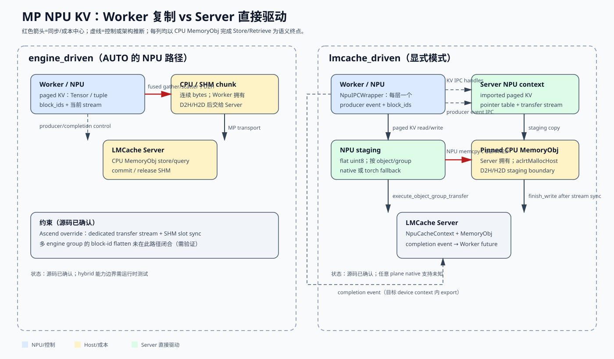
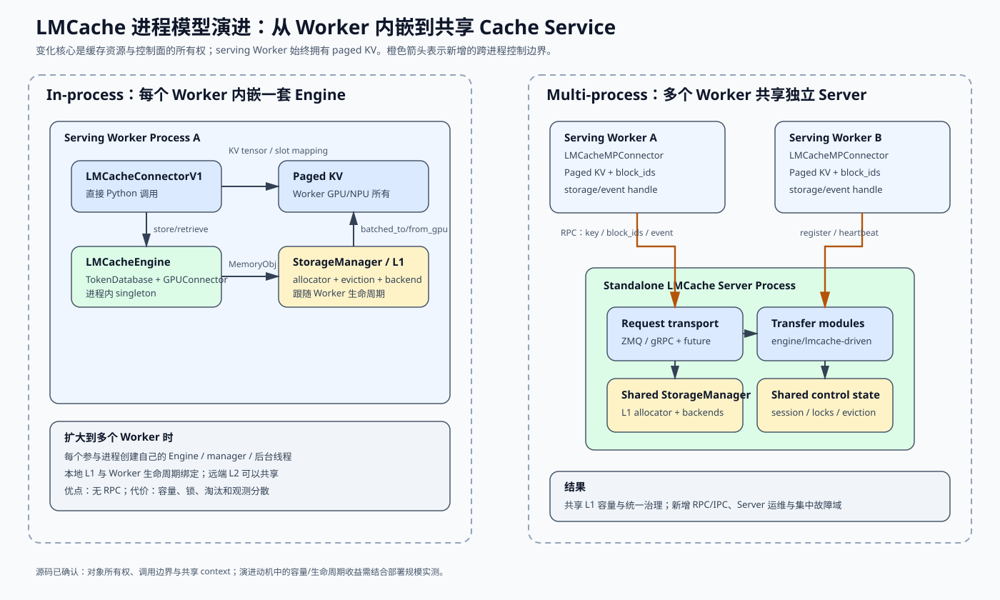

# LMCache / LMCache-Ascend MP 适配报告

## 0. 报告信息

| 项目 | 固定内容 |
|---|---|
| 分析日期 | 2026-09-19 |
| LMCache fork | `8853d757e2e00a75c52edb8de37d952178c28ec3` |
| LMCache compare base | `40d8bb6932e5ea63f019039db6235d436397a28b` |
| LMCache-Ascend fork | `365e3340f0865720771f7ae092030ba1880de123` |
| LMCache-Ascend compare base | `3f2c2227dd6967b36d977423edc0b5c378802cf8` |
| In-process/MP 演进快照 | LMCache `05a013b29da78cf2321b9b46ec5039dde2fb0bb0` |
| 原始 compare | [LMCache](https://github.com/LMCache/LMCache/compare/dev...marcobarlo:LMCache:MP_dsv4_3_split)、[LMCache-Ascend](https://github.com/LMCache/LMCache-Ascend/compare/main...marcobarlo:LMCache-Ascend:MP_dsv4_3_split) |

> **行号基线（本站核对）。** 下文所有 `路径:行号` 的原始基线是上表那两个 fork 分支，不是本站深度分析页
> 钉住的 LMCache `b5d109ea`。上线时按 `b5d109ea` 复核了一遍：**能在该基线里找到文件、且行号落在文件
> 范围内的锚点共 27 处**；另有 16 处指向只在 fork 分支上存在的文件——`lmcache/v1/platform/npu/ipc_wrapper.py`、
> `lmcache/v1/platform/npu/cache_context.py`、`lmcache/v1/platform/npu/event_ipc.py`、
> `lmcache_ascend/v1/multiprocess/npu_gather.py`、`csrc/mp_mem_kernels.cpp`、`csrc/mp_mem_kernels.h`
> 等——基线里没有这些文件，**无法核对，请对着 fork 分支读**。
>
> 另有两处属于基线差异，不是笔误：`EngineKVFormat` 在 `b5d109ea` 里只到 16
> （`csrc/engine_kv_format.h:156` 的 `NL_X_TWO_X_NB_BS_NH_HS = 16`），报告里的 **17** 与
> `specs/nl_x_two_x_nb_bs_hs.py` 都是 fork 分支的形态（基线里对应文件叫
> `specs/nl_x_two_x_nb_bs_nh_hs.py`）。

两个 compare 都是 diverged：LMCache `ahead 30 / behind 35`，LMCache-Ascend `ahead 17 / behind 5`。因此下文按功能拆分，不建议对当前 `dev/main` 做整体 merge 或机械 cherry-pick。

**范围。** 本报告只分析 MP（Worker/Server 多进程）下 NPU KV 的格式、IPC、事件、分组和搬运路径，以及 DSv4 split/hybrid 所需的 connector/native kernel 适配。

**未覆盖。** 未审计 CANN 驱动源码、NUMA/PCIe 拓扑、vLLM 端到端吞吐，也未证明任意 DSA/DSA-C8 plane 已被 Ascend native kernel 支持；这些结论列为 `Unknown` 或风险项。

**证据标记。** `Observed`=固定源码直接可见；`Documented`=设计文档声明；`Inferred`=由代码结构推断；`Unknown`=当前快照无法确认。

## 1. 一屏结论

1. **MP 有两条路径。** `engine_driven` 在 Worker 完成 NPU gather/scatter，再把 CPU/SHM 数据交给 Server；`lmcache_driven` 由 Server 导入 Worker 的 NPU KV IPC handle，直接执行 paged KV ↔ staging ↔ CPU MemoryObj。
2. **DSv4 split/hybrid 应优先走 `lmcache_driven`。** `AUTO` 按设备类型路由，NPU 属于非 CUDA，仍会走 `engine_driven`（`LMCache/lmcache/v1/multiprocess/transfer_context/worker_transfer.py:111`）；显式设置 `LMCACHE_MP_TRANSFER_MODE=lmcache_driven` 才会启用新链路。
3. **上游真正的核心改造是数据契约。** format 17、per-layer multi-plane tuple、in-band IPC wrapper、per-layer/per-group format discovery 和 NPU context 共同解决“每层不是单 Tensor”的问题。
4. **Ascend 插件的边界应收窄。** 上游负责协议、生命周期、分组和平台抽象；LMCache-Ascend 负责 CANN/NPU native kernel、pinned host pool、stream/OpCommand 兼容和性能优化。
5. **当前不能宣称任意 plane 已完成。** Ascend format 17 native kernel 把一行拆成 `lmc_row_bytes - 2` 与 2-byte scale 两个 plane（`LMCache-Ascend/csrc/mp_mem_kernels.cpp:50`），因此三 plane DSA、四 plane DSA-C8 需要 fallback 或扩展 ABI。



图中两列的决定性差异是“谁读写 NPU paged KV”：左列由 Worker 先复制成 CPU/SHM 对象，右列由 Server 通过 IPC 句柄直接驱动 NPU，再以 staging 与 pinned host 内存交换；因此右列减少了 Worker 侧 gather/scatter，但把设备 IPC、事件顺序和 native ABI 变成硬约束。

## 2. In-process 到 Multi-process 的演进



图中真正被移出 Worker 的不是一个简单的 API wrapper，而是完整的缓存控制面和资源所有权：`StorageManager`、L1 allocator、token hashing、session、锁/淘汰和观测都集中到独立 Server。Worker 仍拥有 serving engine 的 paged KV；MP 只改变谁管理缓存和谁发起搬运，不会自动消除 NPU/GPU↔Host 数据传输。

### 2.1 第一阶段：`LMCacheEngine` 嵌入 serving Worker

**Observed。** In-process 模式下，vLLM/SGLang connector 在 Worker 进程中创建 `LMCacheEngine`，调用是普通 Python 函数调用。`LMCacheEngine` 同时持有 `TokenDatabase`、`GPUConnectorInterface` 和 `StorageManager`（`lmcache/v1/cache_engine.py:83`）。`LMCacheEngineBuilder` 只是在当前 Python 进程内维护 `_instances` 字典（`lmcache/v1/cache_engine.py:1999`），不是跨进程共享服务。

注册 KV cache 后，in-process adapter 直接触发本进程 manager 的 `post_init()`（`lmcache/integration/vllm/vllm_v1_adapter.py:747`）；满足条件的每个 rank 会在本进程创建自己的 `StorageManager`（`lmcache/v1/cache_engine.py:301`）。`save_only_first_rank` 等配置可以减少部分重复，因此不能笼统理解为“每个 rank 必然保存完整 L1”。

Store 调用链为：

```text
LMCacheConnectorV1
  → LMCacheEngine.store()
  → TokenDatabase.process_tokens()
  → StorageManager.allocate() CPU MemoryObj
  → GPUConnector.batched_from_gpu()
  → StorageManager.batched_put()
```

对应源码边界是 `LMCacheEngine.store()` 分配 MemoryObj（`lmcache/v1/cache_engine.py:483`）、执行 GPU→MemoryObj（`:557`），再提交 storage backend（`:560`）。Retrieve 则由本进程取回 MemoryObj 后直接调用 `GPUConnector.batched_to_gpu()`（`lmcache/v1/cache_engine.py:780`、`:877`）。

这种设计的优势是：

- 没有 Worker↔LMCache Server 的 RPC、序列化和心跳；
- connector、KV tensor、GPU connector 和 cache engine 位于同一地址空间，集成和调试较直接；
- 单 Worker、小规模实验的启动成本低，只有 serving 命令。

它的扩展问题是：

- L1 allocator、storage client、后台线程和统计对象跟随 Worker 进程创建，资源治理天然按进程分散；
- Worker 重启会销毁本进程 LMCacheEngine/L1 状态；远端 L2 可以继续存在，但本地 L1 生命周期与 Worker 耦合；
- 多个 serving 实例不能直接共享一个进程外的本地 L1 manager，只能各自建 L1，或经公共远端 backend 间接共享；
- 全局锁、淘汰、session cleanup、管理 API 和统一观测需要跨多个 Worker 协调。

其中“资源分散”和“生命周期耦合”是由对象所有权直接推得的 `Inferred` 结论；具体内存放大倍数取决于 rank 策略、L1 配置和是否只由首 rank 保存。

### 2.2 第二阶段：建立独立 MP cache server

从 Git 历史看，MP 是按服务化基础设施逐步建立的，而不是一次性重写：

| 时间 | 提交 | 解决的问题 |
|---|---|---|
| 2025-10-28 | `d6c4083c` | 引入 MP message queue、协议和 IPC 类型 |
| 2025-11-17 | `7aad1f8e` | 引入独立 cache server 与 future |
| 2025-11-20 | `3cff160a` / `a4885b7e` | MLA 与 thread-safe MQ |
| 2025-11-26～28 | `4aa7ffba` / `ae195b80` | MP storage manager、锁、淘汰 |
| 2026-01-29 | `cf8206b2` | 分离 IPC key 与底层 storage key，补 TP E2E |
| 2026-01～02 | `e8e58ea0` / `69db9c49` | 独立 L1 memory manager、eviction policy/controller、新 storage manager |
| 2026-09 | `5a94f23b` 及后续 | request transport 从 ZMQ 抽象到 transport-neutral，并加入 gRPC |

**Observed。** 当前 `MPCacheServerContext` 集中持有一个 `StorageManager`、`TokenHasher`、`SessionManager`、`EventBus` 和 `LayoutDescRegistry`（`lmcache/v1/multiprocess/engine_context.py:186`、`:202`）。`LayoutDescRegistry` 对相同 `(model_name, world_size)` 的多个 Worker registration 计数，最后一个 unregister 后才删除（`engine_context.py:52`）。这说明 MP 的服务端状态是按多个 engine instance 共享设计的。

Worker 侧不再创建完整 `LMCacheEngine`，而是使用 `LMCacheMPConnector` 和 `RequestClient`。注册时把 KV layout、engine group 信息和设备 handle 送到 Server（`lmcache/integration/vllm/lmcache_mp_connector.py:705`）；Server 根据配置安装 `LMCacheDrivenTransferModule`、`EngineDrivenTransferModule` 或两者（`lmcache/v1/multiprocess/server.py:172`）。

### 2.3 为什么要演进成 MP

#### 共享容量，而不只是共享后端

**Documented + Observed。** 官方 quickstart 将 MP 标为 recommended，明确写出“scales better、提供 management/observability endpoints、一个 cache 可被多个 engine instance 共享”（`docs/source/getting_started/quickstart.rst:21`）。源码中的共享 `MPCacheServerContext` 和 registration ref count 与这一目标一致。

In-process 也可以让多个 Worker 指向同一个远端 L2，但它们的进程内 L1、allocator 和控制状态仍然分离。MP 的关键变化是同一节点上的多个 engine process 可以共同使用 Server 拥有的 L1 与淘汰策略。

#### 把缓存生命周期从模型 Worker 生命周期中解耦

**Inferred。** 独立 Server 可以在 Worker 重启或滚动升级时保留自身 L1/L2 控制状态；Worker 通过 register、heartbeat、unregister/reaper 恢复映射。它不是绝对的高可用：Server 自身故障仍会影响所有连接 Worker，除非另行部署多 Server 和持久化 L2。

#### 集中解决并发正确性

MP Server 同时面对多个 Worker 的 lookup/store/retrieve，因此历史上依次增加 thread-safe MQ、MemoryObj lock、read-prefetch lock、eviction 和 session cleanup。集中式锁和淘汰能够在一个 ownership domain 内决定“对象是否正被读取、能否淘汰、何时 `finish_write`”，比多个独立 Worker 各自维护本地状态更容易给出一致语义。

#### 为跨实例能力提供统一控制面

MP Server 后续承载 hybrid KV groups、CacheBlend、P2P、multi-server、HTTP 管理接口、事件总线和连续指标。这些能力需要知道多个 Worker、模型 layout、session 和 cache occupancy；独立服务比把相同控制逻辑复制进每个 Worker 更合适。

### 2.4 两套架构的核心区别

| 维度 | In-process | Multi-process |
|---|---|---|
| Cache engine 位置 | serving Worker 内的 `LMCacheEngine` | 独立 LMCache Server |
| 调用方式 | connector 直接函数调用 | connector → `RequestClient` → ZMQ/gRPC → Server module |
| L1/allocator 所有者 | 每个参与 Worker/rank 的进程内 manager | Server 的共享 `StorageManager` |
| KV page 所有者 | serving Worker | 仍是 serving Worker；MP 不改变这一点 |
| 数据搬运 | 本进程 `GPUConnector` 发起 | `engine_driven` 由 Worker 发起；`lmcache_driven` 由 Server 通过 IPC mapping 发起 |
| 本地 L1 共享 | 进程隔离；可共享远端 L2 | 多 engine instance 可共享 Server L1 |
| 生命周期 | LMCacheEngine 跟随 Worker | Server 与 Worker 生命周期解耦，靠 registration/heartbeat 管理 |
| 控制开销 | 无跨进程 RPC | 每次操作有 RPC、future、event/SHM 协议开销 |
| 资源治理 | 各 Worker 分别配置和淘汰 | 统一锁、淘汰、容量和管理 API |
| 故障影响 | 单 Worker 内局部，但缓存随 Worker 消失 | Worker 可独立重连；Server 故障影响其所有客户端 |
| 当前定位 | vLLM 文档已标 deprecated | 官方推荐路径 |

### 2.5 性能不能只看“多了一个进程”

MP 会增加控制路径成本：RPC 编解码、线程调度、future、event IPC 和可能的 context switch。小 KV、低并发、单 Worker 时，这些固定成本可能使 in-process 延迟更低。

但 bulk KV 不一定通过 MQ 复制：

- `lmcache_driven` 注册 device storage handle，请求期主要发送 key、block IDs 和 event handle；
- `engine_driven` 可以通过 SHM 交接 Worker 已 gather 的 CPU KV；
- Server 可以统一 batch、预取、锁和淘汰，并让多个 Worker 共享同一 L1 容量。

因此 MP 的性能收益主要来自资源共享、减少重复 L1、集中 batching/prefetch 和避免 Worker 承担完整 cache management，而不是“跨进程天然更快”。实际总时延可写成：

```text
In-process = token/key 处理 + GPU↔MemoryObj + backend

MP = RPC/control + token/key 处理 + GPU↔MemoryObj + backend
     - 跨 Worker 重复资源/重复预取
     - 可被 batching、共享 L1、异步重叠隐藏的部分
```

官方文档声称 MP 具备更好的 feature support 和 performance（`docs/source/getting_started/quickstart/offload_kv_cache.rst:6`），但这不是所有 workload 的无条件结论。单请求微延迟、共享命中率、Worker 数、KV 大小、PCIe/NPU 带宽和 Server 并发度都会改变结果。

### 2.6 什么时候选择哪一个

选择 In-process：

- 单 Worker 或本地功能验证，希望一个命令启动；
- 更关心极低控制延迟，而非跨实例共享和统一管理；
- 依赖尚未迁移到 MP 的旧 connector/feature；
- 能接受 vLLM 路径已 deprecated，且愿意承担未来兼容风险。

选择 Multi-process：

- 新的生产部署；
- 多 Worker、多模型实例或滚动重启，希望共享 L1/cache service；
- 需要 management/observability、统一锁与淘汰、session cleanup；
- 需要 hybrid KV groups、DSv4 split、CacheBlend 或 multi-server 等 MP 主线能力；
- 希望 cache capacity 和 serving Worker 的进程/显存生命周期独立扩缩。

对于本报告的 Ascend/DSv4 场景，推荐关系是：

```text
先选择进程架构：Multi-process
  └─ 再选择 MP 搬运模式：
       单 group / IPC 能力不稳定 → engine_driven
       hybrid 多 group / DSv4 split → lmcache_driven
```

`in-process vs MP` 与 `engine_driven vs lmcache_driven` 是两层不同决策：前者决定 cache engine 部署在哪里，后者只决定 MP 模式下谁发起 KV 搬运。

## 3. MP 运行模型与边界

### 3.1 `engine_driven`

**Observed。** `EngineDrivenTransferContext` 是 Worker-side gather/scatter copy path；`MPTransferMode` 的枚举和路由语义见 `LMCache/lmcache/v1/multiprocess/transfer_context/worker_transfer.py:111`。

```text
Worker current stream
  → NPU gather paged KV → CPU/SHM chunk
  → MP transport / MemoryObj
Server
  → CPU MemoryObj 存储、查询、提交和释放
```

LMCache-Ascend 在 `LMCache-Ascend/lmcache_ascend/v1/multiprocess/npu_gather.py:420` 提供 fused gather/scatter、专用 transfer stream、sub-batch 和 SHM 生命周期同步。**Observed：** 该实现仍按单 group 的 block-id 描述组织数据；多 engine group 的完整协议未在该路径中闭合。

### 3.2 `lmcache_driven`

```text
Worker register
  → 每层 NPU Tensor/tuple 的 IPC wrapper
  → ZMQ register + event capability
Server register
  → NpuCacheContext 导入 Tensor、建 group、pointer table、staging、stream
Store/Retrieve
  → producer event → Server transfer stream wait
  → paged KV ↔ NPU staging ↔ pinned CPU MemoryObj
  → completion event → Worker future
```

**Observed：** Worker 的 `LMCACHE_DRIVEN` 需要设备 wrapper factory（`LMCache/lmcache/v1/multiprocess/transfer_context/worker_transfer.py:111`、`:145`）；Server 侧 completion handle 在目标 device context 内导出（`LMCache/lmcache/v1/multiprocess/modules/lmcache_driven_transfer.py:1271`）。

### 3.3 NPU IPC 到底传什么

这里需要区分两类 IPC。它们都只是跨进程凭证，不是 KV payload：

| IPC 类型 | 发送时机 | 发送内容 | 用途 |
|---|---|---|---|
| NPU storage IPC | Worker 注册 KV cache 时 | opaque storage handle，以及 wrapper 保存的 `dtype/shape/stride/storage_offset/device_uuid` | 让 Server 在自己的进程中重建指向 Worker NPU allocation 的 Tensor view |
| NPU event IPC | 每次 Store/Retrieve | producer event handle；操作结束返回 completion event handle | 保证 Worker compute stream 与 Server transfer stream 的先后顺序 |

#### 注册：发送显存访问凭证，不发送 KV 字节

**Observed。** `LMCacheDrivenTransferContext.register()` 先检查目标设备的 event IPC 能力，然后把 `wrap_kv_caches(kv_caches)` 交给注册 RPC（`LMCache/lmcache/v1/multiprocess/transfer_context/worker_transfer.py:422`）：

```python
device = _get_kv_device(kv_caches)
event_backend = get_event_ipc_backend(device)
event_backend.check_event_support(device)

future = req_client.register_kv_cache(
    instance_id,
    wrap_kv_caches(kv_caches),
    model_name,
    world_size,
    engine_type,
    layout_hints,
    list(engine_group_infos),
)
```

`wrap_kv_caches()` 是“一层一个 wrapper”，并非把 Tensor 内容序列化进消息（`LMCache/lmcache/v1/platform/kv_wrap.py:83`）。对 NPU 而言，`NpuIPCWrapper` 对每个 plane 调用 storage IPC API，并额外记录重建 Tensor view 所需的元数据（`LMCache/lmcache/v1/platform/npu/ipc_wrapper.py:93`）：

```python
storage = plane.untyped_storage()
handle = storage._share_npu_()
records.append(
    (
        handle,
        plane.dtype,
        tuple(plane.shape),
        tuple(plane.stride()),
        int(plane.storage_offset()),
    )
)
```

这里的 `handle` 是 torch_npu/CANN 返回的 opaque runtime handle。**Unknown：** 当前分析没有审计 CANN 驱动源码，因此不对 handle 的内部字段、IOMMU/SMMU 映射方式或跨设备能力作进一步断言。

#### Server 导入：新 Tensor 对象，映射原来的 allocation

**Observed。** Server 收到 wrapper 后调用 `create_cache_context()`（`LMCache/lmcache/v1/multiprocess/modules/lmcache_driven_transfer.py:926`）。`NpuCacheContext` 对每个 wrapper 执行 `to_tensor()`，再做 format discovery 和 group 构建（`LMCache/lmcache/v1/platform/npu/cache_context.py:275`）。`NpuIPCWrapper.to_tensor()` 的核心是（`LMCache/lmcache/v1/platform/npu/ipc_wrapper.py:132`）：

```python
storage = torch.UntypedStorage._new_shared_npu(device_index, *handle[1:])
t = torch.empty((), device=device_index, dtype=dtype)
t.set_(storage, storage_offset, shape, stride)
```

**Observed + API contract。** 源码通过 `_new_shared_npu()` 重建 storage，而不是分配同尺寸 Tensor 后复制内容；按 torch_npu storage IPC 的接口语义，Worker 和 Server 持有不同的 Python Tensor 对象，但两个 view 映射同一个 NPU storage allocation。注册阶段没有形成一份 Server 私有的完整 KV 副本：

```text
Worker Tensor ──┐
                ├── 同一个 NPU storage allocation
Server Tensor ──┘
```

Server 随后从这些 view 提取每层/每 plane 的 data pointer，创建每个 kernel group 的 NPU `int64` pointer table，并保留 wrapper 维持 IPC mapping 生命周期（`LMCache/lmcache/v1/platform/npu/cache_context.py:260`、`:329`）。

#### 每次操作：只发送定位和同步信息

注册完成后，Store/Retrieve 不会重复发送 storage handle，更不会通过 MQ 发送整块 KV。Worker 在当前 stream record event，然后发送 `key + instance_id + block_ids + event_ipc_handle`（`LMCache/lmcache/v1/multiprocess/transfer_context/worker_transfer.py:471`、`:513`、`:582`）：

```python
event_ipc_handle = self._event_backend.export_event(event, self._device)
return self._req_client.store(
    key, instance_id, block_ids, event_ipc_handle
).to_device_future(device=self._device)
```

其中：

- storage handle 回答“整块 paged KV allocation 在哪里”，通常只在注册阶段传递；
- pointer table 回答“每层、每个 plane 的基地址在哪里”，由 Server 注册阶段生成；
- `block_ids` 回答“本次访问哪些物理 page”，并且按 KV group 分组；
- event handle 回答“什么时候可以安全读写这些 page”。

Server 导入 producer event，并让自己的 transfer stream 等待它（`LMCache/lmcache/v1/multiprocess/modules/lmcache_driven_transfer.py:1153`）：

```python
producer_event = event_backend.import_event(
    event_ipc_handle, cache_context.device
)
event_backend.wait_event(producer_event, cache_context.stream)
```

完成 paged KV ↔ staging ↔ CPU MemoryObj 后，Server 在 transfer stream record completion event，再把 completion handle 返回 Worker（Store：`LMCache/lmcache/v1/multiprocess/modules/lmcache_driven_transfer.py:1227`、`:1242`、`:1271`；Retrieve：`:1414`、`:1489`、`:1518`）。

#### IPC 消除了什么，没有消除什么

**Observed。** storage IPC 消除了“Worker 把整块 NPU KV payload 复制或序列化给 Server”这一步。它没有消除 KV 持久化所需的数据移动：paged KV 是离散 block，CPU MemoryObj 是连续区域，所以 Store/Retrieve 仍执行 `paged KV ↔ NPU staging ↔ pinned CPU MemoryObj`。

换句话说，`lmcache_driven` 中的“zero-copy/handle transfer”只描述 Worker/Server 之间对原始 NPU allocation 的共享访问，不表示端到端没有 device-to-device gather/scatter，也不表示没有 D2H/H2D。

## 4. 上游 LMCache：必须合入的改造

### 4.1 Multi-plane KV contract

`EngineKVFormat.NL_X_TWO_X_NB_BS_HS = 17` 表达每层 2 或 3 个 MLA/DSA plane，plane 形状为 `[NB, BS, 1, width_i]`，并允许宽度不等（`LMCache/csrc/engine_kv_format.h:158`）。format detector 对 per-layer tuple 选择该格式（`LMCache/lmcache/v1/gpu_connector/kv_format/detectors/vllm.py:98`）；spec 按各 plane 的字节总量计算 hidden dimension（`LMCache/lmcache/v1/gpu_connector/kv_format/specs/nl_x_two_x_nb_bs_hs.py:32`）。

需要同时合入：

- C++ enum、pybind 和 Python stub 的数值一致性（17）；
- `is_layer_list`、`is_mla`、`is_kv_second_tuple` 分类 predicate；
- 递归 shape/dtype structure key，避免不同 plane 或 dtype 错进同一 kernel group；
- `normalize_and_discover_per_layer_formats()` 的 per-layer、per-engine-group 检测；
- mixed dtype、非 contiguous stride、`storage_offset` 和 shared-pool padding 的元数据。

### 4.2 一层一个 wrapper，plane 结构 in-band

**Observed。** `wrap_kv_caches()` 对每个 layer value 只创建一个 wrapper，并明确保留 Tensor 或 plane tuple（`LMCache/lmcache/v1/platform/kv_wrap.py:83`）。这取代了“先 flatten，再靠 `planes_per_layer` hint regroup”的中间方案。

**为什么重要。** Server 不再猜测 plane 数量和顺序；wrapper 自带结构，`to_tensor()` 可以还原单 Tensor 或 tuple。对上游而言，这是跨进程数据模型的稳定边界，而不是 Ascend 专属 hack。

### 4.3 NPU IPC 与 event IPC

`NpuIPCWrapper` 为每个 plane 保存 `(handle, dtype, shape, stride, storage_offset)`，通过 `_share_npu_()` 导出、`_new_shared_npu()` + `set_()` 重建（`LMCache/lmcache/v1/platform/npu/ipc_wrapper.py:59`）。设备身份由 NPU 设备探测逻辑派生，不依赖 CUDA UUID。

`NpuEventIPCBackend` 使用 `torch.npu.Event(interprocess=True)` 兼容的 `ipc_handle`/`from_ipc_handle`，并用长度 1024 的 deque 临时保活 source event（`LMCache/lmcache/v1/platform/npu/event_ipc.py:44`）。**Inferred 风险：** 固定长度队列在高并发、消息延迟时可能提前淘汰 event；生产实现应改为 handle→event 映射并由 ACK/超时回收。

### 4.4 `NpuCacheContext` 与 Server 资源

注册阶段由 `NpuCacheContext` 完成：wrapper 解包、per-layer format discovery、`KVLayerGroupsManager`、NPU block-id buffer、每个 kernel group 的 device `int64` pointer table、flat staging buffer 和独立 transfer stream（`LMCache/lmcache/v1/platform/npu/cache_context.py:231`）。

pointer table 的形态是：

```text
[layer0_plane0_ptr, layer0_plane1_ptr, …, layer1_plane0_ptr, …]
```

**Observed：** 当前实现的 `get_kernel_group_kv_pointers()` 返回 NPU `int64` Tensor（`LMCache/lmcache/v1/platform/npu/cache_context.py:390`），而不是旧设计文档中描述的 tuple views。文档与代码必须在合入前统一，否则 torch fallback 会拿不到 plane 边界。

### 4.5 Geometry：compress ratio、DCP 和真实 stride

Ascend 压缩 spec 的 `block_size` 可能是物理 slot 数；上游通过 `compress_ratio` 还原逻辑 token span（`LMCache/lmcache/integration/vllm/kv_cache_groups.py:44`）。attention group 还需考虑 DCP，recurrent/Mamba group 不应误乘 DCP。shared pool 的 dim-0 padding 则通过 `PageBufferShapeDesc.block_stride_elems` 传递；tuple sibling plane 必须满足当前 descriptor 能表达的 stride 约束。

### 4.6 Torch fallback 与 stream ordering

上游 `torch_ops.py:952`、`:1107`、`:1184`、`:1716` 增加 NPU pointer view、NPU memcpy 和 MLA/DSA byte-slab gather/scatter。对象侧按 plane 字节串联，D2H/H2D 按 plane dtype/shape 切分。

**Observed：** NPU 当前用 stream synchronize 后立即发布 completion callback；这是正确性兜底，但会阻塞 Server affinity handler。真正异步的 CANN host callback 仍是后续优化项。

## 5. LMCache-Ascend：应合入的实现

### 5.1 Native block transfer

`csrc/mp_mem_kernels.h:35`、`:85`、`:123`、`:157`、`:167` 对齐上游 `TransferDirection`、`PageBufferShapeDesc`、`KernelGroupSpec`、`BatchStep`、`execute_object_group_transfer()` 和 `multi_layer_block_kv_transfer()`。`mp_mem_kernels.cpp:70` 明确校验当前支持的 format：13、16、17。

`execute_object_group_transfer()` 的语义是一次执行 Python 侧规划好的 staging copy 与 kernel launch，覆盖：

```text
H2D: pinned CPU MemoryObj → NPU staging → paged KV
D2H: paged KV → NPU staging → pinned CPU MemoryObj
```

**关键限制（Observed）。** format 17 的 `packed_planes()` 将最后 2 bytes 固定解释为 scale，native pointer 数量和 plane 布局并非任意 tuple；不符合该布局的对象必须在注册或 dispatch 阶段 fail closed。

### 5.2 Engine-driven 优化

`LMCache-Ascend/lmcache_ascend/v1/multiprocess/npu_gather.py:637` monkey-patch gather/scatter 和 `EngineDrivenTransferContext.submit_store/retrieve`：使用专用 stream，避免传输前整卡同步，并在 SHM slot 提交/释放前同步 transfer stream。它是性能优化，不改变上游 MP 协议；DSv4 hybrid 多 group 仍需单独设计。

### 5.3 Pinned host pool 与 native ops

插件把 `LazyMemoryAllocator` 的大 pool 切换为 `aclrtMallocHost`，避免大块 `torch.empty` 内存逐 chunk `aclrtHostRegister` 的不稳定路径（`LMCache-Ascend/lmcache_ascend/__init__.py:122`）。同时在 `_patch_ops()` 中合并 native symbols、保持 enum/descriptor ABI、安装 object-group transfer 快路径和 fallback（`LMCache-Ascend/lmcache_ascend/__init__.py:481`）。

### 5.4 DSv4 connector

`lmcache_ascend/v1/kv_format.py:13`、`:125` 与 NPU connector 负责 `MULTI_PLANE_KV`、`DSA_C8_KV`、scheduler group、per-plane compression、slot mapping、mixed dtype byte packing、`storage_offset` 和 padding stride。这部分应与 MP 基础设施拆成独立 PR，便于单独验证模型 layout。

## 6. 接口、配置和生命周期

| 接口/配置 | 作用 | 当前判断 |
|---|---|---|
| `LMCACHE_MP_TRANSFER_MODE=auto` | 按设备类型路由 | NPU 仍默认 engine-driven（Observed） |
| `...=engine_driven` | Worker gather/scatter | 普通模型可用；hybrid group 需验证 |
| `...=lmcache_driven` | Server 直接驱动 NPU KV | DSv4 首选；要求 NPU wrapper/event/native 能力 |
| `NpuIPCWrapper` | 每层 Tensor/tuple 的跨进程恢复 | 上游核心接口 |
| `NpuEventIPCBackend` | producer/completion event IPC | 需处理 source event 生命周期 |
| `NpuCacheContext` | Server 侧 NPU 映射、分组、staging、stream | 上游核心接口 |
| `execute_object_group_transfer` | Ascend native plan executor | 插件 fast path；需 ABI 校验 |

生命周期必须满足：

1. Worker register 前完成 NPU storage IPC 和 event capability 检查；
2. Server import 后再创建 pointer table、staging 和 stream；失败时释放已导入 wrapper；
3. Store/Retrieve 的 producer event 必须先被 transfer stream wait；
4. completion event 只能在目标 NPU context 内 export（`LMCache/lmcache/v1/multiprocess/modules/lmcache_driven_transfer.py:1271`）；
5. `finish_write` 不得早于 D2H 完成；Server 重启要重新 register。

## 7. 风险、失败模式与未知项

| 级别 | 条件 | 后果 | 建议 |
|---|---|---|---|
| P0 | native format 17 只实现 latent+scale 两 plane | DSA 三/四 plane 可能指针错位或被拒绝 | dispatch 限制为已验证布局，或扩展 `num_planes/offset/stride/dtype` ABI |
| P0 | pointer table 丢失 plane 边界 | tuple torch fallback 无法正确切 slab | 同时保留 structured views，或传递 per-plane metadata |
| P0 | upstream/plugin enum 与 descriptor 漂移 | native kernel 静默读错字段 | import-time ABI version + enum/字段一致性测试 |
| P1 | AUTO 将 NPU 路由到 engine-driven | DSv4 hybrid 在运行期触发单 group 限制 | 显式配置 lmcache-driven，或按 capability 安全切换 |
| P1 | 1024 deque 保活不足 | 对端 import 失败 | ACK/超时回收的 event registry |
| P1 | synchronize-stream completion | affinity handler 阻塞、吞吐下降 | CANN native async callback recorder |
| Unknown | CANN 驱动是否保证跨进程 NPU VA、IOMMU/SMMU 映射和多卡导入 | 代码层面无法证明部署可行性 | 在目标 910B3/驱动版本做专项验证 |

## 8. 建议 PR 拆分与验收顺序

1. **上游 KV contract：** format 17、detector/spec、in-band wrapper、per-layer grouping、CPU 单测。
2. **上游 NPU platform：** `NpuIPCWrapper`、event backend、`NpuCacheContext`、pointer/memcpy fallback、stream ordering。
3. **上游 geometry：** `compress_ratio`、DCP、block stride、hybrid group 测试。
4. **Ascend native backend：** format 13/16/17、object-group executor、pinned allocator、fallback 和 ABI 检查。
5. **Ascend engine-driven 优化：** fused gather/scatter、dedicated stream、SHM 生命周期。
6. **DSv4 connector：** multi-plane provenance、scheduler group、slot mapping、mixed dtype。

最小验收矩阵：普通 fused KV、`(K,V)`、MLA、DSA、DSv4 packed plane；NPU 0/1 IPC；event export/import/wait；Store→清空→Retrieve 字节级恢复；`compress_ratio>1`；padding stride；1–4 object batch；注册失败回滚；Server 重启 re-register。没有 NPU/CANN 环境时只能完成 CPU/static 检查，不能把测试结果写成运行时支持结论。

## 9. 最终决策

- **要尽快跑通指定 DSv4 模型：** 先限定为已验证的两-plane native layout，显式使用 `LMCACHE_MP_TRANSFER_MODE=lmcache_driven`，不符合布局的对象在注册时清晰报错。
- **要做长期上游化：** 先稳定“一层一个 wrapper + in-band plane metadata”的公共 contract，再让 Ascend native backend 通过能力探测选择 fast path；不要让插件维护第二套 MP protocol。
- **合入前必须关闭：** format 17 任意 plane 语义与 native 实现的差距、pointer table/fallback contract、event 生命周期、AUTO 路由和 upstream/plugin ABI 校验。

相关图：[`lmcache-mp-overview.svg`](lmcache-mp-overview.svg)、[`lmcache-process-model-evolution.svg`](lmcache-process-model-evolution.svg)、[`lmcache-mp-class-diagram.puml`](lmcache-mp-class-diagram.puml)。
