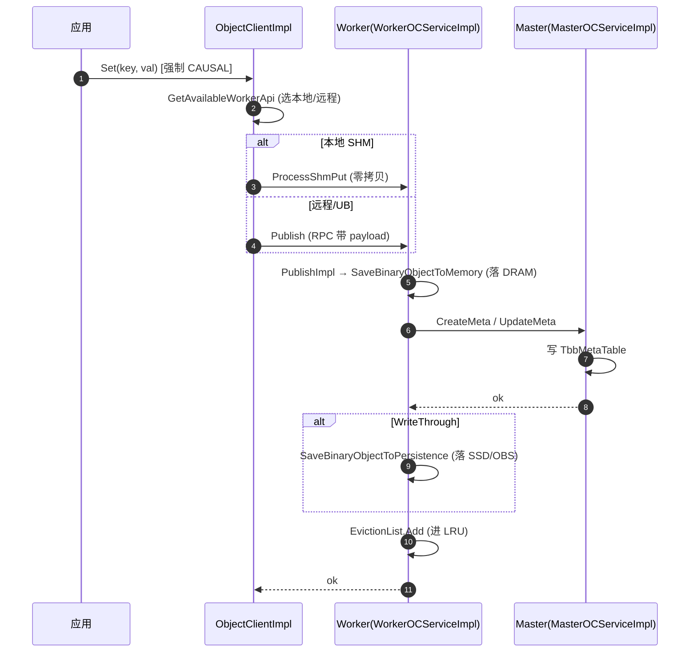
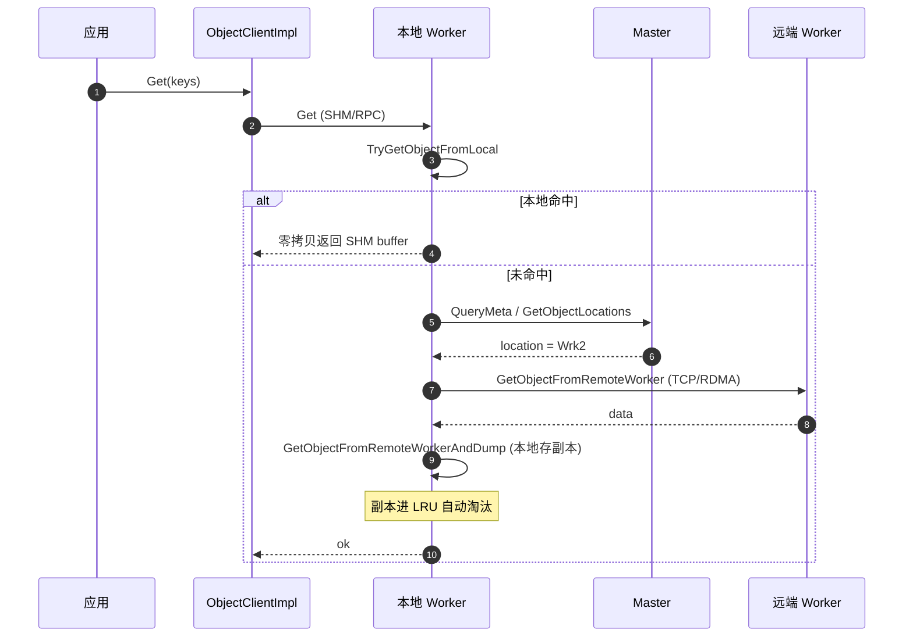
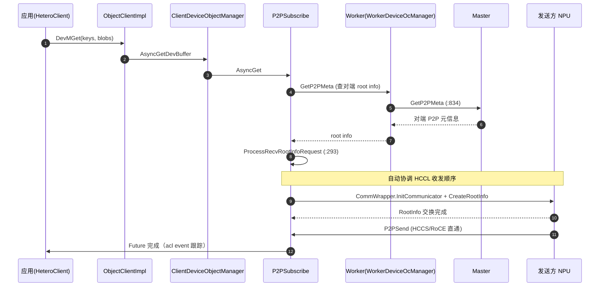

# openYuanrong datasystem 代码走读

> **代码仓库**：`yuanrong-datasystem`（openEuler openYuanrong 数据系统），版本 `0.8.1`
> **定位**：Serverless 分布式计算引擎 openYuanrong 的「数据系统」子系统 —— 一个**异构分布式多级缓存**，用集群的 HBM/DRAM/SSD 资源构建近计算缓存，加速 LLM 推理 KVCache、模型弹性、大数据等场景。
> **重要**：本项目与 mooncake 是**两个独立项目**，自研代码（namespace `datasystem`），不是 mooncake 的 fork；连仓内自带的 `transfer_engine/` 都是独立实现。

本文为代码级走读：每节给出架构图、关键类/函数签名与 `file:line`、带注释的真实代码片段、以及端到端调用示意图（ASCII 分层图 + Mermaid 时序图）。

---

## 目录

- [0. 全局视图](#0-全局视图)
- [1. 三层架构与「三 client / 单 impl」设计](#1-三层架构与三-client--单-impl设计)
- [2. client/ 层 —— 客户端 SDK 实现](#2-client-层--客户端-sdk-实现)
- [3. worker/ 层 —— 节点数据/缓存服务（内嵌 master）](#3-worker-层--节点数据缓存服务内嵌-master)
- [4. master/ 元数据层](#4-master-元数据层)
- [5. common/device 设备抽象层（HBM / HCCL）](#5-commondevice-设备抽象层hbm--hccl)
- [6. common/l2cache 多级缓存与持久化](#6-commonl2cache-多级缓存与持久化)
- [7. transfer_engine/ —— 独立 NPU 直读引擎](#7-transfer_engine--独立-npu-直读引擎)
- [8. 端到端调用示意图](#8-端到端调用示意图)
- [9. 其余：绑定 / cli / docs / 构建](#9-其余绑定--cli--docs--构建)

---

## 0. 全局视图

### 0.1 三种数据语义

datasystem 对外暴露三种"数据"，但底层是**同一套对象缓存底座**（见 §1）：

| 语义 | 客户端 | 一致性默认 | 用途 |
|------|--------|-----------|------|
| **KV** | `KVClient` | CAUSAL | 共享内存免拷贝 KV 缓存（最常用） |
| **object** | `ObjectClient` | PRAM | 引用计数对象缓存，面向 Distributed Futures |
| **heterogeneous object** | `HeteroClient` | —— | NPU HBM 抽象的异构对象，卡间 HCCL 直通 + H2D/D2H |

LLM KVCache 场景主要用 **KV**（DRAM 池）+ **heterogeneous**（HBM 池）。

### 0.2 顶层目录

```text
datasystem/
├── src/datasystem/        ← C++ 核心（最重要，§1-§6）
│   ├── client/            ← 客户端 SDK 实现（§2）
│   ├── worker/            ← worker 进程：数据/缓存服务（§3，内嵌 master §4）
│   ├── master/            ← 元数据服务实现（§4）
│   ├── common/            ← 共享基础设施：device/l2cache/kvstore/rpc/rdma（§5-§6）
│   ├── protos/            ← 28 个 gRPC/protobuf 定义
│   ├── pybind_api/        ← Python 绑定
│   ├── java_api/          ← JNI 绑定
│   └── c_api/             ← C ABI（供 Go/JNI 调用）
├── include/datasystem/    ← C++ 公共头（§9）
├── transfer_engine/       ← 独立 NPU 直读引擎（§7，非 mooncake）
├── python/  go/  java/    ← 语言 SDK
├── cli/                   ← dscli 命令行
├── docs/                  ← 设计文档（中文 source_zh_cn/）
├── example/  dsbench/     ← 示例 / 基准
├── k8s/  k8s_deployment/  ← Helm chart + Docker
├── build.sh  CMakeLists.txt  BUILD.bazel  ← 双构建系统
└── .repo_context/         ← 仓库自述/术语表/决策树（值得先读）
```

### 0.3 部署形态

```text
┌─────────────────────────────────────────────────────────────────┐
│  集群                                                            │
│                                                                  │
│  ┌──────────────┐      ┌──────────────┐      ┌──────────────┐   │
│  │  节点 A       │      │  节点 B       │      │  节点 C       │   │
│  │              │      │              │      │              │   │
│  │ ┌──────────┐ │      │ ┌──────────┐ │      │              │   │
│  │ │ SDK(进程)│ │      │ │ SDK(进程)│ │      │   ...        │   │
│  │ └────┬─────┘ │      │ └────┬─────┘ │      │              │   │
│  │   SHM│       │      │   SHM│       │      │              │   │
│  │ ┌────▼─────┐ │      │ ┌────▼─────┐ │      │              │   │
│  │ │ Worker   │◄┼──────┼─┤ Worker   │◄┼──────┤              │   │
│  │ │(DRAM/SSD)│ │ TCP/RDMA │(DRAM/SSD)│ │      │  Worker ...  │   │
│  │ │ +Master  │ │ worker↔worker │+Master  │ │      │              │   │
│  │ └────┬─────┘ │      │ └────┬─────┘ │      │              │   │
│  │      │H2D/D2H│      │      │       │      │              │   │
│  │ ┌────▼─────┐ │      │ ┌────▼─────┐ │      │              │   │
│  │ │  NPU HBM │◄┼─HCCS/RoCE直通─►│ NPU HBM │ │      │   NPU ...   │   │
│  │ └──────────┘ │      │ └──────────┘ │      │              │   │
│  └──────┬───────┘      └──────┬───────┘      │              │   │
│         └──────── ETCD（元数据/选主）────────┘              │   │
│                                                              │   │
└──────────────────────────────────────────────────────────────┘
```

- **SDK**：集成进用户进程（Python/Go/Java/C++），进程内直接操作。
- **worker**：每节点一个常驻进程，管本节点 DRAM/SSD/HBM，**进程内嵌 master 元数据服务**（无独立 master 进程）。
- **ETCD**：集群级元数据/选主/哈希环；也可用内置 Metastore。
- **协议分层**：SDK↔worker = **共享内存（零拷贝）**；worker↔worker = TCP/RDMA；HBM↔HBM = **HCCS/RoCE 直通**。

---

## 1. 三层架构与「三 client / 单 impl」设计

### 1.1 分层

```text
┌──────────────────────────────────────────────────────────────┐
│  用户进程（SDK 进程内）                                        │
│  ┌────────────┐  ┌────────────┐  ┌────────────┐  ┌────────┐ │
│  │  KVClient  │  │HeteroClient│  │ObjectClient│  │Stream..│ │
│  └─────┬──────┘  └─────┬──────┘  └─────┬──────┘  └────┬───┘ │
│        │   三个 facade 都持同一 impl_      │              │     │
│        └──────────┬──────────────────────┘              │     │
│                   ▼                                     ▼     │
│        ┌──────────────────────┐          ┌──────────────────┐│
│        │ object_cache::       │          │ stream_cache::   ││
│        │  ObjectClientImpl    │          │  StreamClientImpl││
│        └─────────┬────────────┘          └────────┬─────────┘│
│   ┌──────────────┼───────────────┐                │          │
│   ▼              ▼               ▼                │          │
│  ClientDevice    client_worker_api               │          │
│  ObjectManager   (本地 SHM / 远程 RPC)            │          │
│   (异构对象)                                     │          │
└──────────────────┬────────────────────────────────┴─────────┘
                   │
        ═══════════╧═══════════  进程边界（SHM 或 RPC）
                   ▼
┌──────────────────────────────────────────────────────────────┐
│  Worker 进程（内嵌 Master）  ← §3 / §4                        │
└──────────────────────────────────────────────────────────────┘
```

### 1.2 关键设计：三个公开头共享同一个 impl

这是理解整个 client 层的钥匙。`KVClient` / `HeteroClient` / `ObjectClient` 都是薄壳，内部持有同一个 `object_cache::ObjectClientImpl`：

```cpp
// include/datasystem/kv_client.h:415
class KVClient {
    std::shared_ptr<object_cache::ObjectClientImpl> impl_;   // ← 同一个 impl
};

// include/datasystem/hetero_client.h:213
class HeteroClient {
    std::shared_ptr<object_cache::ObjectClientImpl> impl_;   // ← 同一个 impl
};

// include/datasystem/object_client.h:219
class ObjectClient {
    std::shared_ptr<object_cache::ObjectClientImpl> impl_;   // ← 同一个 impl
};
```

而 `DsClient` 把三者聚合，方便一个连接同时用三种语义：

```cpp
// include/datasystem/datasystem.h:33
class DsClient {
    KVClient      &KV();       // 三者共享底层 ObjectClientImpl
    HeteroClient  &Hetero();
    ObjectClient  &Object();
};
```

**含义**：对象层是底座，KV 和异构都是它之上的不同 facade。所以 `ObjectClientImpl` 是 client 侧最核心的类（4132 行，§2.1）。

---

## 2. client/ 层 —— 客户端 SDK 实现

路径：`src/datasystem/client/`

### 2.1 `ObjectClientImpl` —— client 侧总实现

文件：`src/datasystem/client/object_cache/object_client_impl.cpp`（4132 行）。所有 client 操作的真正实现，含设备对象管理、worker api、mmap。关键方法（已核对行号）：

| 方法 | 行号 | 作用 |
|------|------|------|
| `Set(...)` | 3125 | KV 写（强制 CAUSAL 一致性） |
| `Put(...)` | 2120 | object 写，内部选 SHM 或 RPC 路径 |
| `ProcessShmPut(...)` | 2018 | 本地共享内存零拷贝写 |
| `MultiPublish(...)` | 3657 | 批量写（MSet/MCreate 后端） |
| `Get(...)` | 2293 | 读，含跨节点 |
| `Publish(...)` | 1968 / 2102 | 发布（host 内存 / 设备内存） |
| `MGetH2D(...)` | 1223 | host→device 读（DRAM 池取回 HBM） |
| `MSetD2H(...)` | 1545 | device→host 写（HBM 落 DRAM 池） |
| `DevMSet / DevMGet` | 3809 / 3832 | 设备↔设备卡间直通（D2D 核心） |
| `PublishDeviceObject(...)` | 3537 | 发布设备对象（P2P 直通或回退 host） |
| `GIncreaseRef / GDecreaseRef` | 2795 / 2900 | 全局引用计数（object 生命周期） |

**写入路径的分叉**（SHM vs RPC）是性能关键：

```cpp
// object_client_impl.cpp:2120
Status ObjectClientImpl::Put(const std::string &objectKey, const uint8_t *data,
                             uint64_t size, const FullParam &param, ...) {
    auto workerApi = GetAvailableWorkerApi(objectKey, ...);        // 选本地/远程 worker
    if (isShm || IsUrmaEnabled()) {
        ProcessShmPut(objectKey, data, size, ...);                 // :2018 本地 SHM 零拷贝
    } else {
        workerApi->Publish(objInfo, ...);                          // 远程/UB：RPC 带 payload
    }
}
```

### 2.2 `ClientDeviceObjectManager` + `P2PSubscribe` —— 异构对象客户端

异构对象（HBM）是 datasystem 的差异化能力，落点在 `client/object_cache/device/`：

- **`ClientDeviceObjectManager`**（`client_device_object_manager.h`）：管设备内存、H2D/D2H、协调卡间 P2P。`PublishDeviceObject` 内部二选一：
  ```cpp
  // 简化：回退经 host vs P2P 直通
  PublishDeviceObjectWithHost(...)    // 回退：先落 DRAM 池
  PublishDeviceObjectWithP2P(...)     // 直通：GetOrCreateP2PSubscribe → 卡间
  ```
- **`P2PSubscribe`**（`p2p_subscribe.cpp`，813 行，D2D 核心）：协调卡间 HCCL 收发顺序。`PublishDeviceObject`(:546) / `AsyncGet`(:665) / `ProcessP2PGet`(:328)。
- **`hccl_comm_magr` / `comm_factory`**：HCCL 通信管理，对接 §5 的 `CommWrapperBase`。
- **`page_attn_utils`**：PageAttention 相关（KVCache 分页场景）。

### 2.3 `client_worker_api` —— 本地 SHM vs 远程 RPC 双路径

client→worker 通信的抽象，是"零拷贝"卖点的代码落点：

```text
iclient_worker_api.h                      ← 抽象接口
  ├── client_worker_local_api.{h,cpp}     ← 本地：共享内存，零拷贝
  └── client_worker_remote_api.{h,cpp}    ← 远程：RPC（带 payload）
```

本地路径下，SDK 和 worker 映射同一块共享内存，读写无需拷贝；远程路径才走 RPC 序列化。这就是 §0.3 图里 SDK↔worker 标 "SHM 零拷贝" 的来源。

### 2.4 其余 client 子目录

| 子目录 | 作用 |
|--------|------|
| `stream_cache/` | pub/sub 流客户端（producer/consumer/client_base） |
| `mmap/` | 共享内存映射表（3 种后端：shm/embedded/...） |
| `context/` | 租户/鉴权上下文 |
| `kv_cache/` | KVClient 薄壳 + ReadOnlyBuffer |

---

## 3. worker/ 层 —— 节点数据/缓存服务（内嵌 master）

路径：`src/datasystem/worker/`。worker 是每节点常驻进程，**进程内同时装配 master 元数据服务**（无独立 master 进程）。

### 3.1 进程入口与装配中心

```cpp
// src/datasystem/worker/worker_main.cpp:52
int main(int argc, char **argv) {
    Worker::GetInstance()->Init(...);   // worker.h:39 class Worker（单例）
}
```

`WorkerOCServer`（`worker_oc_server.h`）是装配中心，`CreateAllServices/CreateMasterServices/CreateWorkerServices` 把 master 和 worker 服务都挂进同一进程：

```text
WorkerOCServer（一个 worker 进程）
  ├── MasterOCServiceImpl*   ← 元数据 CRUD（§4）
  ├── WorkerOCServiceImpl*   ← 数据/缓存服务（§3.2）
  └── WorkerServiceImpl      ← 心跳/基础服务
```

### 3.2 `WorkerOCServiceImpl` —— 主数据服务

文件：`worker/object_cache/worker_oc_service_impl.cpp`。关键方法（已核对）：

| 方法 | 行号 | 作用 |
|------|------|------|
| `Publish` | 410 | 单对象写 |
| `MultiPublish` | 425 | 批量写 |
| `Create` | 977 | 创建对象元数据 |
| `Get` | 1128 | 读（本地/跨节点） |
| `PublishDeviceObject` | 2002 | 设备对象发布 |
| `GetDeviceObject` | 2024 | 设备对象读 |
| `PutP2PMeta` | 2066 | 存 P2P 元信息 |
| `GetP2PMeta` | 2127 | 查 P2P 元信息（D2D 协调用） |
| `DeleteObject` | 1663 | 删除 |
| `DecreaseReference` | 1455 | 引用计数减 |

实现按**操作类型**拆分到 `service/` 子目录，每个独立文件：

```text
worker/object_cache/service/
  ├── worker_oc_service_publish_impl.cpp       ← PublishObject:262 / PublishImpl:374
  ├── worker_oc_service_get_impl.cpp  (3127行) ← Get:124 / TryGetObjectFromLocal:397
  │                                              / GetObjectFromRemoteWorkerAndDump:983
  ├── worker_oc_service_create_impl.cpp
  ├── worker_oc_service_delete_impl.cpp
  ├── worker_oc_service_migrate_impl.cpp (1316) ← 数据迁移（扩缩容）
  ├── worker_oc_service_multi_publish_impl.cpp (1196)
  ├── worker_oc_service_global_reference_impl.cpp
  └── worker_oc_service_expire_impl.cpp
```

### 3.3 设备对象（HBM）

`worker/object_cache/device/`：

- **`DeviceObjCache`**（`device_obj_cache.h`）：HBM 对象缓存，`DataFormat::HETERO`。
- **`WorkerDeviceOcManager`**（`worker_device_oc_manager.cpp`）：worker 侧设备对象/HCCL 协调。`PublishDeviceObject`(:40) / `ProcessGetDeviceObjectRequest`(:121) / `ProcessSubscribeReceiveEventRequest`(:282) / `ProcessRecvRootInfoRequest`(:293)。

> §8 的 D2D 时序图会用到这里的 `PutP2PMeta`/`GetP2PMeta` 和 `ProcessRecvRootInfoRequest` —— 这就是"自动协调 NPU 间 HCCL 收发顺序"卖点在代码上的落点。

### 3.4 KV hashmap / 淘汰 / 恢复

| 组件 | 文件 | 作用 |
|------|------|------|
| `ObjCacheHashMap` | `obj_cache_hashmap.{h,cpp}` | KV 哈希表（`DataFormat::HASH_MAP`） |
| `EvictionList` | `eviction_list.{h,cpp}` | LRU 淘汰链表 |
| `WorkerOcEvictionManager` | `worker_oc_eviction_manager.{h,cpp}` | 淘汰管理（触发 spill 到 SSD） |
| `WorkerOcSpill` | `worker_oc_spill.{h,cpp}` | DRAM→SSD spill |
| `slot_recovery/` | `slot_recovery_orchestrator/store/manager` | SSD slot 恢复（持久化重放） |
| `hash_ring/` (11 文件) | `hash_ring.{h,cpp}` + `hash_ring_allocator/task_executor` | 哈希环：分布式路由/扩缩容核心 |

### 3.5 stream_cache（pub/sub）

`worker/stream_cache/`（~25 文件）：`StreamManager`（producer/consumer/subscription）、`RemoteWorkerManager`（跨 worker 流转发）、buffer_pool/page_queue/metrics。

---

## 4. master/ 元数据层

路径：`src/datasystem/master/object_cache/`。worker 进程内嵌的元数据服务。

### 4.1 `MasterOCServiceImpl`

文件：`master_oc_service_impl.{h,cpp}`。元数据 CRUD：

| 方法 | 行号 | 作用 |
|------|------|------|
| `CreateMeta` | 115 | 建元数据 |
| `QueryMeta` | 266 | 查元数据 |
| `UpdateMeta` | 348 | 更新元数据 |
| `GetObjectLocations` | 378 | 查对象在哪些 worker（Get 跨节点时用） |
| `GIncreaseRef / GDecreaseRef` | 555 / 601 | 全局引用计数 |
| `MigrateMetadata` | 740 | 元数据迁移（扩缩容） |
| `ReplacePrimary` | 786 | 主副本切换 |
| `PutP2PMeta / GetP2PMeta` | 776 / 834 | P2P 元信息（D2D） |
| `SubscribeReceiveEvent` | 819 | 订阅通知 |

### 4.2 `OCMetadataManager` —— 元数据表 + 一致性判断

```cpp
// master/object_cache/oc_metadata_manager.h
class OCMetadataManager : public MetadataRedirectHelper {
    // 元数据表：TbbMetaTable = tbb::concurrent_hash_map<ImmutableString, ObjectMeta>
    // 订阅表、一致性判断：IsCausalConsistency / IsPRAMConsistency
    // 写模式判断：IsWriteThroughMode 等（:107-199）
};
```

### 4.3 其余

- `ExpiredObjectManager`（`expired_object_manager.h`）：TTL 过期清理（delayMap 定时）。
- `ReplicaManager` + `replication_service_impl`：跨 worker 副本。
- `MetadataRedirectHelper`：扩缩容时的元数据重定向。
- `metadata_recovery_*`：故障后元数据恢复。

---

## 5. common/device 设备抽象层（HBM / HCCL）

路径：`src/datasystem/common/device/`。这是异构对象能力的根基 —— 把 NPU/GPU 统一抽象，SDK 不强依赖 CANN/CUDA。

### 5.1 `DeviceManagerBase` —— 统一抽象

```cpp
// common/device/device_manager_base.h:143
class DeviceManagerBase {
    // 设备管理：Init / Finalize / SetDevice / QueryDeviceStatus
    // 内存：    Malloc / Free / MallocHost / FreeHost
    // 拷贝：    MemCopyD2H(:282) / MemCopyH2D(:292)
    // P2P 通信类型：P2pKindBase{RECEIVER,SENDER} / P2pLinkBase / P2pScatterEntryBase(:124)
};
```

两个实现：
- **Ascend**：`ascend/acl_device_manager.{h,cpp}`（`AclDeviceManager`）
- **NVIDIA**：`nvidia/cuda_device_manager.{h,cpp}`（`CudaDeviceManager`）

### 5.2 `CommWrapperBase` —— P2P 通信抽象（D2D 关键）

```cpp
// common/device/comm_wrapper_base.h:42
class CommWrapperBase : public DevicePointerWrapper {
    P2PSend(...);            // :154  卡间发送
    P2PRecv(...);            // :164  卡间接收
    InitCommunicator(...);   // :179  建立 communicator
    CreateRootInfo(...);     // :199  交换 RootInfo（HCCL 协调核心）
    WarmUpComm(...);         // :192
};
```

- Ascend 实现：`ascend/hccl_comm_wrapper.h:33` → `HcclCommWrapper`。
- 模板封装：`comm_wrapper.h:33` → `CommWrapper`，`InitComm`(:49)。

### 5.3 插件化

各子目录下都有 `plugin/`，动态加载设备运行时，**避免 SDK 强依赖 CANN/CUDA** —— 用户没装对应厂商库时不会链接失败。这是 datasystem 能同时支持 Ascend/NVIDIA 的机制。

---

## 6. common/l2cache 多级缓存与持久化

路径：`src/datasystem/common/l2cache/`。DRAM 池之外的 SSD/OBS 持久化层。

### 6.1 写模式路由

```cpp
// common/object_cache/object_base.h
enum WriteMode {
    NONE_L2_CACHE,            // 仅 DRAM，不落盘
    WRITE_THROUGH_L2_CACHE,   // 同步写 L2
    WRITE_BACK_L2_CACHE,      // 异步写 L2
    // ...*_EVICT 变体：淘汰时落盘
};
```

### 6.2 `PersistenceApi` —— 持久化统一接口

```cpp
// common/l2cache/persistence_api.h:55
class PersistenceApi {
    Save(...);        // :55
    Get(...);         // :69
    Del(...);         // :107
    PreloadSlot(...);
    MergeSlot(...);
};
```

后端由 `L2StorageType` 决定（`l2_storage.h:31`）：

```text
L2StorageType { NONE, OBS, SFS, DISTRIBUTED_DISK }
                            │       │       │
                            │       │       └─ slot_client/：分布式磁盘
                            │       │          slot_writer / slot_compactor
                            │       │          slot_manifest / slot_snapshot
                            │       │          slot_takeover_planner（重放/compaction/接管恢复）
                            │       └─ sfs_client/：共享文件系统
                            └─ obs_client/：对象存储
```

故障恢复链：worker 侧 `slot_recovery/`（orchestrator + store + manager）+ master 侧 `metadata_recovery_*`。这是"数据可靠性（write_through/write_back/none）"卖点在代码上的落点。

---

## 7. transfer_engine/ —— 独立 NPU 直读引擎

路径：`datasystem/transfer_engine/`。

### 7.1 它不是 mooncake 的 fork

**结论：完全独立实现。** 证据：
1. 全部代码在 `namespace datasystem`（`include/datasystem/transfer_engine/transfer_engine.h:16`），全仓 `grep -ril mooncake` 无结果。
2. 版权头是项目统一的 Huawei/Apache，非 mooncake 的。
3. 自带 owner/requester 控制面 + 通信后端抽象，与 mooncake 架构相似（都是 control plane + data plane）但完全自研。

### 7.2 定位与 API

它是**独立可用的 NPU 间内存直读引擎**，面向 HBM 跨进程/跨节点拉取：

```cpp
// transfer_engine/include/datasystem/transfer_engine/transfer_engine.h:25
class TransferEngine final {
    Initialize(...);
    RegisterMemory(...) / BatchRegisterMemory(...);   // owner 注册 HBM 地址
    TransferSyncRead(...) / BatchTransferSyncRead(...); // requester 凭地址拉
    Finalize();
};
```

### 7.3 内部结构

```text
transfer_engine/src/
  ├── transfer_engine.cpp                 ← 引擎主体 + BuildConnectionIfNeeded
  ├── internal/control_plane/             ← 控制面（owner↔requester 建连 RPC）
  │     control_plane / transfer_control_service / transfer_control_dispatcher
  │     socket_rpc_transport / control_plane_codec
  ├── internal/connection/                ← 连接管理
  ├── internal/memory/ registered_memory_table  ← 注册内存表
  ├── internal/backend/                   ← 数据面后端抽象
  │     data_plane_backend.h : class IDataPlaneBackend
  │         CreateRootInfo / InitRecv / InitSend / PostRecv / PostSend / WaitRecv
  │     ascend/p2p_transfer_backend.{h,cpp}   ← 真实后端
  │     mock_data_plane_backend               ← 测试
  │     ascend/p2p_transfer/                  ← 第三方 P2P 传输库（独立子项目）
  │         HccsSender/Receiver, RoceSender/Receiver, P2PCommunicator,
  │         RdmaAgent/Qp/Socket/Dev, P2PMem/Notify/Stream
  └── python/py_transfer_engine.cpp       ← pybind
```

### 7.4 与主 D2D 路径的关系

主仓异构对象 D2D（§3.3 + §5.2，走 `common/device/` HCCL wrapper + master P2P 元信息）是**一套**卡间传输；`transfer_engine` 提供**另一套更底层**的 owner/requester 直接内存读取语义，走自己的控制面（SocketControlServer）。两者通过共同的 ACL/HCCL 设备运行时与 HBM 内存模型关联，但接口路径解耦。

---

## 8. 端到端调用示意图

### 8.1 整体数据流（ASCII）

```text
                   ┌─────────────────┐
                   │   应用 (SDK)    │
                   └────────┬────────┘
                            │ Set / Put / Get / DevMGet ...
            ┌───────────────┼─────────────────┐
            ▼               ▼                 ▼
       KVClient        HeteroClient       ObjectClient
            └───────────────┴─────────────────┘
                            │  (三者共享 impl_)
                   ObjectClientImpl (§2.1)
                            │
              ┌─────────────┼──────────────┐
              ▼             ▼              ▼
        client_worker_api   ClientDevice   (mmap/SHM)
        本地 SHM / 远程 RPC  ObjectManager
              │             │ (P2PSubscribe)
   ═══════════╪═════════════╪═══════════ 进程边界
              ▼             ▼
        ┌─────────────────────────────┐
        │   Worker 进程（内嵌 Master） │
        │  WorkerOCServiceImpl (§3.2)  │
        │   ├ Publish/Create/Get       │
        │   ├ ObjCacheHashMap (KV)     │
        │   ├ EvictionList (LRU) ──► spill ──► SSD (slot_recovery)
        │   ├ DeviceObjCache (HBM) ◄── H2D/D2H ──► NPU HBM
        │   └ [MasterOCServiceImpl]    │
        │       TbbMetaTable / TTL     │
        │       ReplicaManager         │
        └──────┬───────────────┬───────┘
               │ ETCD          │ worker↔worker
               ▼               ▼
          HashRing        TCP/RDMA 拉副本
                          (热点数据多副本)
```

### 8.2 KV Set / Object Put 时序（写入 DRAM 池）



### 8.3 KV Get 时序（含跨节点 + 热点多副本）



### 8.4 HBM↔HBM 卡间直通（D2D / HCCL）—— 异构对象核心

两条语义路径：
- **DevPublish / DevSubscribe**：MOVE 语义（一次性，用完自动删）
- **DevMSet / DevMGet**：REFERENCE 语义（显式 DevDelete）

下图为 `DevMGet`，体现"自动协调 HCCL 收发顺序"：



### 8.5 写入完整调用链（带行号的 ASCII 纵向图）

```text
KVClient::Set                                   include/datasystem/kv_client.h:114
 └─ ObjectClientImpl::Set                        object_client_impl.cpp:3125  (强制 CAUSAL :3132)
ObjectClientImpl::Put                            object_client_impl.cpp:2120
 ├─ GetAvailableWorkerApi                        object_client_impl.cpp:1188
 ├─ [本地SHM] ProcessShmPut                      object_client_impl.cpp:2018
 │    └─ workerApi->Publish  (local SHM path)    client_worker_local_api
 └─ [远程/UB] workerApi->Publish(objInfo)        object_client_impl.cpp:2148

  ── worker 侧 ──
  WorkerOCServiceImpl::Publish                   worker_oc_service_impl.cpp:410
   └─ publishProc_->Publish                      service/worker_oc_service_publish_impl.cpp:425
        └─ PublishImpl                           :374
             └─ PublishObjectWithLock            :308
                  └─ PublishObject               :262
                       ├─ RequestingToMaster     :271  → master CreateMeta/UpdateMeta
                       ├─ SaveBinaryObjectToMemory :275 (落 DRAM)
                       ├─ [WriteThrough] SaveBinaryObjectToPersistence :284 → L2
                       ├─ NotifyPendingGetRequest :294 (唤醒等待的 Get)
                       └─ evictionManager_->Add  :304 (进 LRU)

  ── master 侧 ──
  MasterOCServiceImpl::CreateMeta/UpdateMeta     master_oc_service_impl.cpp:115/348
   └─ OCMetadataManager 写 TbbMetaTable          oc_metadata_manager.h:222
```

---

## 9. 其余：绑定 / cli / docs / 构建

### 9.1 语言绑定

| 语言 | SDK 路径 | 绑定层 | 说明 |
|------|----------|--------|------|
| Python | `python/yr/datasystem/` | `src/datasystem/pybind_api/`（按模块拆分） | 包名 `yr.datasystem`，PyPI `openyuanrong-datasystem` |
| Go | `go/{kv,object,stream}/` | cgo 调 `src/datasystem/c_api/` | `kv_client.go` / `object_client.go` |
| Java | `java/.../org/yuanrong/datasystem/` | JNI 调 `src/datasystem/java_api/` | KV/Object/Stream Client |
| C ABI | `src/datasystem/c_api/` | —— | `*_c_wrapper`，Go/JNI 的底层 |

### 9.2 cli（`dscli`）

`cli/`：`start.py`/`stop.py`（拉起/停 worker）、`generate_config.py`、`generate_helm_chart.py`、`generate_cpp_template.py`、`collect_log.py`、`benchmark/kv/`。

### 9.3 docs

`docs/source_zh_cn/`：`design_document/cluster_management.md`（ETCD vs Metastore 对比、扩缩容/故障恢复）是唯一一篇完整架构设计文档；异构对象/传输引擎/KVCache 架构设计文档尚是 `.repo_context/roadmap.md` Phase2 候选（未写）。建议先读 `.repo_context/{index,glossary,decision-tree}.md` 作导航。

### 9.4 构建

- **双构建系统**：CMake（默认，`build.sh -b cmake`）+ Bazel（`build.sh -b bazel`）。
- `VERSION` / `version.bzl` = `0.8.1`。
- `scripts/build_cmake.sh` / `scripts/build_thirdparty.sh`。
- K8s：`k8s/` 与 `k8s_deployment/` 两套 Helm chart + Docker，DaemonSet 部署 worker。
- `dsbench/`：独立 C++ 基准工具。

### 9.5 先读什么

1. `.repo_context/index.md`（按"意图"和"区域"两张路由表）+ `glossary.md`（术语）
2. `README.md` 的三个示例（hetero/KV/object）
3. 本文 §1（三 client 单 impl）→ §2（ObjectClientImpl）→ §3.2（WorkerOCServiceImpl）→ §8（调用图）

---

## 附录：核心类速查

| 层 | 类 | 位置 |
|----|----|------|
| client | `DsClient` | `include/datasystem/datasystem.h:33` |
| client | `KVClient` / `HeteroClient` / `ObjectClient` | `include/datasystem/{kv,hetero,object}_client.h` |
| client | `ObjectClientImpl` | `client/object_cache/object_client_impl.{h,cpp}` |
| client | `ClientDeviceObjectManager` | `client/object_cache/device/client_device_object_manager.h` |
| client | `P2PSubscribe` | `client/object_cache/device/p2p_subscribe.cpp` |
| worker | `WorkerOCServer` | `worker/worker_oc_server.{h,cpp}` |
| worker | `WorkerOCServiceImpl` | `worker/object_cache/worker_oc_service_impl.{h,cpp}` |
| worker | `WorkerDeviceOcManager` | `worker/object_cache/device/worker_device_oc_manager.cpp` |
| master | `MasterOCServiceImpl` | `master/object_cache/master_oc_service_impl.{h,cpp}` |
| master | `OCMetadataManager` | `master/object_cache/oc_metadata_manager.{h,cpp}` |
| device | `DeviceManagerBase` | `common/device/device_manager_base.h:143` |
| device | `CommWrapperBase` | `common/device/comm_wrapper_base.h:42` |
| l2cache | `PersistenceApi` | `common/l2cache/persistence_api.h:55` |
| te | `TransferEngine` | `transfer_engine/include/.../transfer_engine.h:25` |
