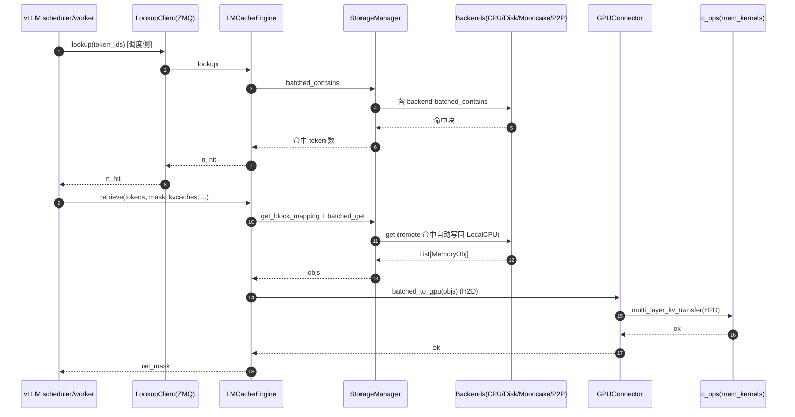
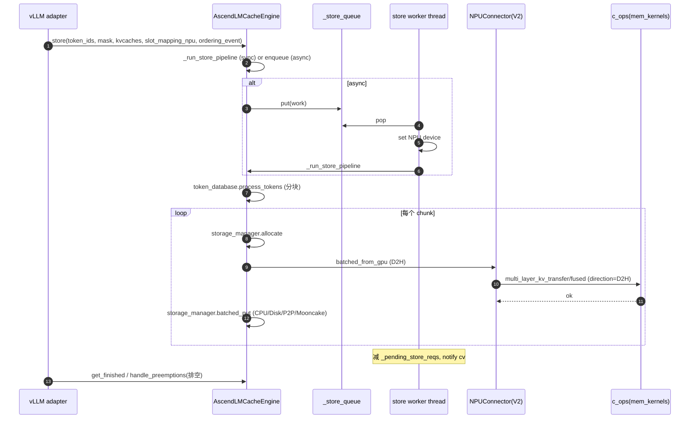
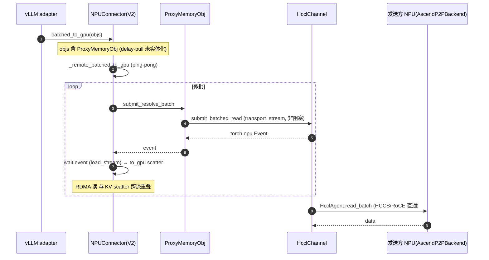

# LMCache + LMCache-Ascend 代码走读

> **代码仓库**：
> - `LMCache`（`LMCache/lmcache`，分支 `dev`）—— LLM serving 引擎扩展，跨 GPU/CPU/Disk/远端多级 KV 缓存，集成 vLLM/SGLang/TRT-LLM。
> - `lmcache-ascend`（`lmcache-ascend`）—— LMCache 的 **Ascend NPU 适配**（非 fork，是 monkey-patch 插件，pin 上游 `v0.4.3`）。
> **本文结构**：先讲上游 lmcache 架构与热路径（Part A），再讲 lmcache-ascend 如何在其上做 NPU 适配（Part B），最后给出对比与合并热路径图。

本文为代码级走读。每节给出架构图、关键类/函数签名与 `file:line`、带注释代码片段、端到端调用示意图（ASCII 分层图 + Mermaid 时序图）。

---

## 目录

- [Part A：上游 LMCache](#part-a上游-lmcache)
  - [A0. 全局视图与数据流](#a0-全局视图与数据流)
  - [A1. lmcache/v1/ 核心](#a1-lmcachev1-核心)
  - [A2. storage_backend / serde / integration](#a2-storage_backend--serde--integration)
  - [A3. csrc CUDA/C++ 内核](#a3-csrc-cudac-内核)
  - [A4. 上游热路径](#a4-上游热路径)
- [Part B：lmcache-ascend 适配](#part-blmcache-ascend-适配)
  - [B0. 定位：monkey-patch 插件](#b0-定位monkey-patch-插件)
  - [B1. \_patch_\* 机制](#b1-_patch_-机制)
  - [B2. v1/ NPU 适配核心](#b2-v1-npu-适配核心)
  - [B3. integration/patch（源文件改写）](#b3-integrationpatch源文件改写)
  - [B4. mindspore 框架分支](#b4-mindspore-框架分支)
  - [B5. csrc Ascend 内核](#b5-csrc-ascend-内核)
  - [B6. 与上游的 12 项关键差异](#b6-与上游的-12-项关键差异)
  - [B7. Ascend 热路径](#b7-ascend-热路径)

---

# Part A：上游 LMCache

## A0. 全局视图与数据流

```text
vLLM / SGLang / TRT-LLM worker
     │  (KVConnectorBase_V1 adapter)
     ▼
integration/<engine>/..._adapter.py   LMCacheConnectorV1Impl
     │
     ▼
v1/cache_engine.py  LMCacheEngine            ◄── 中心 API: store/retrieve/lookup
     │  用 gpu_connector (H2D/D2H 内核) + token_database (前缀哈希)
     ▼
v1/storage_backend/storage_manager.py StorageManager   ◄── 编排
     │  owns asyncio loop + OrderedDict[str, StorageBackendInterface]
     ▼
storage backends:
   LocalCPUBackend(热) → LocalDiskBackend → GdsBackend
   P2PBackend / NixlStorageBackend / PDBackend / RemoteBackend
                                                  │
remote connector: mooncakestore / redis / s3 / hfbucket / valkey ...
transfer channel: nixl_channel / py_socket_channel  (P2P 跨节点)
```

C++/CUDA 扩展 `c_ops`（`csrc/`，导出为 `lmcache.c_ops`）提供 H2D/D2H 分页内存传输内核、CacheGen 算术编码、反向 RoPE、钉内存分配器。

**包结构**：`lmcache/v1/` **就是**当前架构（不是"遗留 v1"），`v1/` 只是命名空间。共享工具 `lmcache/utils.py`/`logging.py`/`observability.py`/`connections.py` 直接在 `lmcache/` 下。无并行的 legacy 包。

---

## A1. lmcache/v1/ 核心

### A1.1 `cache_engine.py` —— 中心 `LMCacheEngine`

文件：`lmcache/v1/cache_engine.py`（2058 行）。`class LMCacheEngine`（:78）。关键方法（已核对）：

| 方法 | 行号 | 作用 |
|------|------|------|
| `store()` | 363 | 存 KV（token 分块 → allocate → from_gpu → batched_put） |
| `store_layer()` | 568 | 生成器，layer-wise 存 |
| `retrieve()` | 754 | 取 KV（返回布尔 ret_mask，to_gpu 装回） |
| `retrieve_layer()` | 902 | 生成器，layer-wise 取 |
| `lookup()` | 1058 | 前缀命中查询（返回命中 token 数，支持 pin） |
| `move()` | 1180 | 跨节点 KV move（P2PBackend） |
| `async_lookup_and_prefetch()` | 1248 | 异步查+预取 |
| `_process_tokens_internal()` | 1608 | retrieve 核心 token 循环 |
| `_is_passive()` | 1791 | save_only_first_rank 模式判断 |

`store()` 热路径骨架（cache_engine.py:363，`@torch.inference_mode`）：
```python
def store(self, token_ids, mask=..., kvcaches=..., slot_mapping=..., **kw):
    for start, end, key in self.token_database.process_tokens(...):   # :460 分块
        self.storage_manager.allocate(kv_shapes, kv_dtypes, ...)      # :474
    self.gpu_connector.batched_from_gpu(memory_objs, starts, ends, ...)  # :533 D2H
    self.storage_manager.batched_put(keys, memory_objs, location=self.store_location)  # :539
```

`class LMCacheEngineBuilder`（:1865）单例工厂，`get_or_create()`(:1958) 建 token DB + engine，`_Create_token_database()`(:1949) 按是否 blending 选 `SegmentTokenDatabase`/`ChunkedTokenDatabase`。

### A1.2 `manager.py` —— `LMCacheManager` 生命周期编排

`lmcache/v1/manager.py`（539 行）。`class LMCacheManager`（:40）解耦 vLLM adapter 与内部组件。构造(:56)通过 `service_factory` 建 `_lmcache_engine`/`_lookup_client`/`_lookup_server`/`_offload_server`/`_runtime_plugin_launcher`/`_api_server`(:93-103)，包 try/except(:104) → 失败设 `_init_failed=True` → 降级重算模式。`is_healthy()`(:508)。

### A1.3 `gpu_connector/` —— serving 引擎 GPU 桥（热路径）

`lmcache/v1/gpu_connector/`。每个引擎一个 adapter，做 paged GPU KV buffer 与 CPU `MemoryObj` 间的 H2D/D2H。入口 `__init__.CreateGPUConnector(config, metadata, engine, layout_hints)`（:14）按 `EngineType`/设备/layerwise/`use_gpu_connector_v3` 派发。

`gpu_connectors.py`（2186 行）类清单：
- `GPUConnectorInterface`（:39 ABC）：`to_gpu`/`from_gpu`/`batched_from_gpu`(:74)/`batched_to_gpu`(:95)。
- **`VLLMPagedMemGPUConnectorV3`**（:417，**当前默认**）：`to_gpu`(:503)/`from_gpu`(:541) 都调 `lmc_ops.multi_layer_kv_transfer(...)`；`batched_to_gpu`(:601) 包 `load_stream`。
- `VLLMPagedMemGPUConnectorV2`(:142)、`VLLMBufferLayerwiseGPUConnector`(:615)、`VLLMPagedMemLayerwiseGPUConnector`(:1028)、`SGLangGPUConnector`(:1400)、`SGLangLayerwiseGPUConnector`(:1607)、`TRTLLMGPUConnector`(:1904)。

`gpu_ops.py`（:8）`import lmcache.c_ops as lmc_ops` —— CUDA 内核的薄封装。

### A1.4 `token_database.py` —— token→key 索引

`lmcache/v1/token_database.py`（551 行）。`TokenDatabase`(:38 ABC) 的 `process_tokens`(:170 抽象) 产出 `(start, end, CacheEngineKey|hash)`。`_hash_tokens`(:242) 调 vLLM 的 `sha256_cbor` 做前缀哈希。
- `ChunkedTokenDatabase`(:269)：固定 `chunk_size` 分块（blending OFF 时用）。
- `SegmentTokenDatabase`(:423)：按 `blend_special_str` 分隔符切（blending ON 时用）。

### A1.5 `memory_management.py` —— 内存分配器

`lmcache/v1/memory_management.py`（2652 行）。核心类型：
- `MemoryFormat(Enum)`(:49)：`KV_2LTD`/`KV_2TD`/`KV_T2D`/`KV_MLA_FMT`...
- `MemoryObj`(:184 ABC)：`raw_tensor`/`tensor`/`ref_count_up|down`/`pin|unpin`。
- `MemoryAllocatorInterface`(:836 ABC)：`allocate`(:838)。
- 分配器：`PinMemoryAllocator`(:1972，钉内存，c_ops 的 `alloc_pinned_ptr`，**暴露给 mooncake 零拷贝**)、**`MixedMemoryAllocator`(:2058，默认)**、`HostMemoryAllocator`(:1895)、`GPUMemoryAllocator`(:2239)、`TensorMemoryAllocator`(:1274)+`PagedTensorMemoryAllocator`(:1563)。

### A1.6 其余 v1 模块（速览）

| 模块 | 作用 |
|------|------|
| `storage_backend/`（v1 子目录） | StorageManager + 各 backend（见 A2） |
| `transfer_channel/` | 跨节点 KV 传输抽象（NIXL/PySocket），P2PBackend 用 |
| `lookup_client/` | 前缀查询独立进程/客户端（ZMQ RPC） |
| `cache_controller/` | 多实例集中控制面（admit/evict/migrate，ZMQ） |
| `compute/` | CacheBlend 内核编排（`blend/blender.py:18 LMCBlender`） |
| `distributed/` | 分布式 L1/L2 协调（l2_adapters/storage_controllers） |
| `multiprocess/` | 多进程/多 GPU 运行时 |
| `metadata.py` | `LMCacheMetadata`(:17) |
| `protocol.py` | `RemoteMetadata`(:160)、`ClientCommand`/`ServerReturnCode` |
| `rpc/` `rpc_utils.py` | ZMQ transport + 工具 |
| `server/`/`api_server/`/`internal_api_server/`/`standalone/`/`offload_server/` | 服务变体 |
| `config.py` | `LMCacheEngineConfig`（1000+ 行，CONFIG_DEFINITIONS 驱动） |

---

## A2. storage_backend / serde / integration

### A2.1 StorageManager + 各 backend

`v1/storage_backend/`。`StorageManager` 编排 `OrderedDict[str, StorageBackendInterface]`：

| backend | 说明 |
|---------|------|
| `LocalCPUBackend` | 热缓存（`local_cpu_backend.py`，pin 内存） |
| `LocalDiskBackend` | asyncio serde 写盘 |
| `GdsBackend` | GPUDirect Storage（GPU↔disk 直读，`CuFileMemoryAllocator`） |
| `P2PBackend` | 跨实例 P2P（`p2p_backend.py:788`，走 `NixlChannel`） |
| `RemoteBackend` | 远端（mooncake/redis/s3...，见下） |

### A2.2 Mooncake 作为远端后端（关键集成点）

`MooncakestoreConnector(RemoteConnector)`（`connector/mooncakestore_connector.py:323`），由 `MooncakestoreConnectorAdapter`（scheme `mooncakestore://`）构造。

```python
# mooncakestore_connector.py:323（简化）
class MooncakestoreConnector(RemoteConnector):
    def __init__(self, ...):
        self.store = MooncakeDistributedStore()                     # :348
        # setup_mooncake_store(...)                                  # :413
        self._register_cpu_buffer(...)                              # :436 零拷贝注册
    def batched_put(self, keys, objs):
        return self._batched_put_zero_copy(...)                     # :716
            # self.store.batch_put_from(key_strs, buffer_ptrs, ...)  # :732
    def batched_get(self, ...): ...                                  # :488 → _batch_get_into:522
```

零拷贝关键：`_register_cpu_buffer`(:436) 把 LocalCPUBackend 的 pin 内存 buffer 注册给 mooncake（`self.store.register_buffer(buffer.data_ptr(), buffer.numel())`，:449），put/get 直接传指针。

> 注意区分两条跨节点路径：mooncake 是 KV **store**（key→blob，多租户共享池）；`NixlChannel` 是 LMCache 实例间的 **P2P 直连** RDMA（`P2PBackend` 用）。两者可并存。

### A2.3 serde（序列化）

- `lmcache/storage_backend/serde/`（非 v1）：`cachegen_basics.py`(`CacheGenConfig`:32)/`cachegen_encoder.py`/`cachegen_decoder.py`。
- v1 serde 在 `v1/storage_backend/naive_serde/`：`CacheGenSerializer`/`CacheGenDeserializer`、`NaiveSerializer`、`KIVISerializer`（2-bit KIVI 量化）。`CreateSerde()`(:21) 工厂。

### A2.4 integration（serving 引擎集成）

`lmcache/integration/`：
- `base_service_factory.py:40 BaseServiceFactory(ABC)`：抽象工厂。
- `vllm/`（主路径）：`vllm_v1_adapter.py`(1805)、`vllm_service_factory.py`(`VllmServiceFactory`)、`lmcache_connector_v1.py`(`LMCacheConnectorV1Dynamic`:30，vLLM `KVConnectorBase_V1` 子类)。
- `sglang/`、`tensorrt_llm/`。

vLLM GPU-connector 集成：`VllmServiceFactory.get_or_create_lmcache_engine()` 调 `CreateGPUConnector(config, metadata, EngineType.VLLM, layout_hints=vllm_layout_hints())`(:203) → `LMCacheEngineBuilder.get_or_create(...)`(:207)。

### A2.5 public API + cli

- `lmcache/__init__.py:24 _get_backend()`：动态后端选择，优先 `lmcache.c_ops`（`torch.cuda.is_available()`），失败回退 `lmcache.non_cuda_equivalents`，注册为 `sys.modules["lmcache.c_ops"]`，使 `import lmcache.c_ops as lmc_ops` 恒成立。
- `lmcache/utils.py:340 CacheEngineKey`（`to_string`:395 作 mooncake key）。
- `lmcache/cli/`：`main.py:14` argparse 派发（ping/describe/kvcache/server/bench/trace...）。

---

## A3. csrc CUDA/C++ 内核

`csrc/` 编译为 `c_ops`，绑定在 `pybind.cpp`。关键 `m.def`（已核对）：

| 导出 | pybind行 | 内核 |
|------|---------|------|
| `multi_layer_kv_transfer` | 34 | **H2D/D2H 主内核**（mem_kernels.cu:620） |
| `multi_layer_kv_transfer_unilateral` | 41 | SGLang MLA |
| `encode_fast_new` | 55 | CacheGen 算术编码（ac_enc.cu:375） |
| `decode_fast_new` | 56 | CacheGen 解码（ac_dec.cu:362） |
| `rotary_embedding_k_fused` | 59 | 反向 RoPE（blending，pos_kernels.cu:111） |
| `alloc_pinned_ptr/_numa_ptr/_shm_pinned_ptr` | 60-70 | 钉内存分配（mem_alloc.cpp） |
| `multi_layer_block_kv_transfer` | 77 | 多进程块传输（mp_mem_kernels.cu:343） |

- `mem_kernels.cu`（1089 行）：`multi_layer_kv_transfer`(:620) 按元素大小模板分派，grid `(num_tokens, num_layers, 2)`，k/v 在 block.z。`load_and_reshape_multi_layer_kernel`(:368)。
- `ac_enc.cu`/`ac_dec.cu`：算术编解码（warp-scan）。
- `csrc/storage_backends/`：C++ 原生 connector（`mooncake/`/`redis/`/`fs/`，进程内）。
- `csrc/storage_manager/`：bitmap、ttl_lock 等 C++ 原语。

---

## A4. 上游热路径

### A4.1 store() 从 vLLM worker 全链路

```text
vLLM adapter wait_for_save                                 vllm_v1_adapter.py:1174
 └─► lmcache_engine.store(token_ids, mask, kvcaches, ...)   
      └─► LMCacheEngine.store                              cache_engine.py:363
           ├─ token_database.process_tokens                cache_engine.py:460 (分块)
           ├─ storage_manager.allocate                     cache_engine.py:474
           │      └─► allocator_backend.allocate           storage_manager.py:343 (LocalCPUBackend)
           ├─ gpu_connector.batched_from_gpu               cache_engine.py:533 (D2H)
           │      └─► VLLMPagedMemGPUConnectorV3.from_gpu  gpu_connectors.py:541
           │           └─► lmc_ops.multi_layer_kv_transfer(D2H)  gpu_connectors.py:579
           │                └─► ★ csrc/mem_kernels.cu:620
           └─ storage_manager.batched_put                  cache_engine.py:539
                  ├─ LocalCPUBackend.batched_submit_put_task  (hot_cache 插入)
                  ├─ MooncakestoreConnector.batched_put → batch_put_from  (mooncakestore_connector.py:732)
                  ├─ LocalDiskBackend (asyncio serde 写)
                  └─ P2PBackend → NixlChannel (RDMA)
```

### A4.2 retrieve() + lookup()



---

# Part B：lmcache-ascend 适配

## B0. 定位：monkey-patch 插件

**lmcache-ascend 不是 fork/重写，而是叠在上游 lmcache 之上的"monkey-patch 插件"。** 这是最重要的架构事实，写在 `lmcache_ascend/__init__.py` 顶部：

```python
# lmcache_ascend/__init__.py:16
LMCACHE_UPSTREAM_TAG = "v0.4.3"        # pin 上游版本
LMCACHE_ASCEND_PATCHED = False
# ... 随后 if not LMCACHE_ASCEND_PATCHED: 块(:579-628) 跑 ~15 个 _patch_*() 替换
```

工作方式：import `lmcache`，在 import 时外科手术式替换特定属性。两条运行路径：`pytorch`（vllm/sglang via `torch_npu`）和 `mindspore`（独立 `mindspore/` 包），按 `__init__.py:589`（`_build_info.__framework_name__`）分支。

---

## B1. \_patch_\* 机制

`__init__.py` 里 ~15 处替换点（已核对行号）：

| patch 函数 | 行 | 替换内容 |
|-----------|----|---------|
| `_patch_config()` | 28 | 扩展 `_CONFIG_DEFINITIONS` 加 ~15 个 Ascend key（`p2p_use_npu`/`pd_pull_mode`/`store_async`/`fetch_recompute_gate_enable`...），重建 config 类(:245) |
| `_patch_ops()` | 264 | `sys.modules["lmcache.c_ops"] = ascend_c_ops`（重定向 C++ ops） |
| `_patch_storage_backend_init()` | 289 | 替换 `CreateStorageBackends` 为 Ascend 版 |
| `_patch_gpu_connector()` | 357 | 替换 `CreateGPUConnector` → `CreateNPUConnector` |
| `_patch_cache_engine()` | 448 | 替换 `LMCacheEngine` → `AscendLMCacheEngine` |
| `_patch_torch_capability()` | 301 | `torch.npu.get_device_capability = lambda *a: (0,0)` |
| —— | —— | 另有 `_patch_transfer_channel`/`_patch_cacheblend`/`_patch_multi_process`/`_patch_hash_token`/`_patch_lookup_client`/`_patch_rpc_utils`/`_patch_sys_detection`/`_patch_kv_layer_group`/`_patch_sgl`/`_patch_get_vllm_torch_dev`/`_patch_vllm_v1_adapter` |

---

## B2. v1/ NPU 适配核心

路径：`lmcache_ascend/v1/`。

### B2.1 `cache_engine.py` —— `AscendLMCacheEngine`

`lmcache_ascend/v1/cache_engine.py`（588 行）。`class AscendLMCacheEngine(LMCacheEngine)`（:67）继承上游。**核心差异：异步 store 路径**（上游 store 同步）。`__init__`(:70) 当 `config.store_async` 建：`_store_queue`、`_store_worker_thread`(:117)、`_pending_store_reqs`(:97)、`_engine_state_lock`(:106 RLock，串行化 store vs lookup)、`ThreadSafeEventList`(:31，因异步 worker 从另一线程追加 kv_events)。

`store()`(:449) 是薄分派器：
```python
# cache_engine.py:510-553（简化）
def store(self, ...):
    if not self.is_store_async:
        self._run_store_pipeline(...)           # :177 同步
    else:
        self._ensure_store_worker()
        with self._store_lock:
            self._pending_store_reqs[req_id] = \
                self._pending_store_reqs.get(req_id, 0) + 1
        self._store_queue.put(...)               # 入队给后台 worker
```

`_run_store_pipeline`(:177，`@torch.inference_mode()`) 是 sync/async 共用实现（改自上游 store）：`token_database.process_tokens`(:227) → `storage_manager.allocate`(:241) → **`gpu_connector.batched_from_gpu`(:302，跳进 NPU connector)** → `storage_manager.batched_put`(:309)。

worker 循环 `_store_worker_loop`(:136)：设 NPU device、pop 工作、跑 pipeline、减 `_pending_store_reqs`。**抢占安全** `wait_for_pending_stores`(:371)：在抢占 req 的 KV 块被覆盖前排空其异步 store（仅因 store 异步才需要），被 vLLM adapter `handle_preemptions` 调用。

`lookup`/`lookup_unpin`(:422/:444) 在 `_engine_state_lock` 下包 `super()`，与 store worker 串行。

### B2.2 `npu_connector/` —— NPU 连接器（热路径、核心差异化）

`lmcache_ascend/v1/npu_connector/npu_connectors.py`（2228 行）。最大的 Ascend 模块。类（均继承同名上游 GPU connector）：

| 类 | 行 | 用途 |
|----|----|------|
| `DsaC8LayerwiseRawByteMixin` | 39 | raw-byte（DeepSeek V4）layerwise 传输 mixin |
| `VLLMBufferLayerwiseNPUConnector` | 179 | blending 路径 |
| **`VLLMPagedMemNPUConnectorV2`** | 599 | **主 paged connector（非 layerwise）** |
| `VLLMPagedMemLayerwiseNPUConnector` | 1552 | layerwise |
| `SGLangNPUConnector` / `SGLangLayerwiseNPUConnector` | 1945 / 1949 | SGLang 透传 |

`is_310p()`(:169) 门控 310P 专用路径（KV layout 不同：`[num_blocks, num_kv_heads*head_size//16, block_size, 16]`）。

**热路径 `VLLMPagedMemNPUConnectorV2.to_gpu`**（:1132）—— 把 MemoryObj 散进 paged NPU KV cache：
```python
# npu_connectors.py:1187-1199（简化）
lmc_ops.multi_layer_kv_transfer(
    memory_obj.tensor, kv_cache_pointers, slot_mapping[start:end],
    self.kvcaches_device, self.page_buffer_size, False,   # direction=to_gpu
    self.use_mla, self.kv_format.value,
    self.kv_lora_rank, self.qk_rope_head_dim, self.dsa_head_dim,
)
```

`from_gpu`(:1201) 反向（`direction=True`），包在 `torch.npu.stream(self.store_stream)`(:1262)。`batched_to_gpu`(:1305) 两分支：
1. **Proxy/P2P 路径**（`has_proxy`）：`_remote_batched_to_gpu`(:1366) —— ping-pong 流水线，重叠 RDMA read（`transport_stream`）与 KV scatter（`load_stream`），用 event 跨流同步。消费 `ProxyMemoryObj`。
2. **本地路径**(:1322-1345)：计时 fetch 喂 `cost_model.observe_fetch`（若有）。

`CreateNPUConnector` 工厂（`npu_connector/__init__.py:35`）按 `engine`/`use_mla`/`use_layerwise`/`enable_blending` 选 connector。

### B2.3 `storage_backend/` —— Ascend 存储后端

`lmcache_ascend/v1/storage_backend/`。`CreateStorageBackends`(`__init__.py:49`) 替换上游。注意 `dst_device = f"npu:{torch.npu.current_device()}"`(:58)。装配顺序：
1. `AscendPDBackend`（若 `config.enable_pd`，:74）—— PD 分离。
2. `LocalCPUBackend`（上游）。
3. `AscendP2PBackend`（若 `config.enable_p2p`，:105）。
4. `LocalDiskBackend`/`RemoteBackend`（上游）。

- **`AscendP2PBackend(P2PBackend)`**（`p2p_backend.py:106`）：跨节点主后端。加 NPU 内存支持（`use_npu`，:172）、pull 模式(:179)、delay-pull(:183)。同时注册 CPU 和 NPU buffer 给 transfer channel(:253)。pull 路径(`_handle_pull_mode_transfer`:794) 做 `async_batched_read` 再发 Done；delay-pull 返回 `ProxyMemoryObj`(:917)。
- **`AscendPDBackend`**（`pd/backend.py:42`）：PD 分离，`allocate`(:227) 角色感知（sender 分配 CPU，receiver 分配 NPU）。pull/delay-pull + 背压 + 熔断。

### B2.4 `transfer_channel/` —— Ascend 传输后端（核心差异化）

`lmcache_ascend/v1/transfer_channel/`（全 Ascend 独有，上游用 NIXL）。三后端由 `config.transfer_channel` 选，`CreateTransferChannel`(`__init__.py:94`) 断言 channel ∈ {`hccl`,`hixl`,`hcomm_onesided`}(:122)：

| 通道 | 文件:类 | 后端 |
|------|---------|------|
| **HCCL** | `hccl_channel.py:72 HcclChannel` | C++ `hccl_npu_comms.HcclAgent`，`transport_stream=torch.npu.Stream`(:132)，`write_batch`(:624)/`read_batch`(:646)/`submit_batched_read`(:756 非阻塞返回 event) |
| **HIXL** | `hixl_channel.py:42 HixlChannel` | C++ `hixl_npu_comms.Hixl`（CANN 8.5+ 传输引擎） |
| **hcomm_onesided** | `hcomm_onesided_channel.py:54 HcommOneSidedChannel` | HCCL one-sided service（每对 peer 一个 `HcclComm`，nRanks=2） |

### B2.5 `proxy_memory_obj.py` + `transfer_context.py`

- **`ProxyMemoryObj`**（`proxy_memory_obj.py:36`）：延迟取数内存对象，带 P2P 传输元数据穿过 cache engine 不实体化。`resolve`(:165)/`resolve_batch`(:226)/`submit_resolve_batch`(:261 非阻塞，返回 `torch.npu.Event` 做 pipelining)。`ref_count_up/down`(:432/:440) **故意 no-op**（生命周期由 transfer context 的 Done-signal 管，非 ref count）。
- **`transfer_context.py`**（:310 `AscendBaseTransferContext`）：管 ping-pong buffer 分配/释放 + ref-counted Done-signal 生命周期。`max_pipeline_depth`(:90) 从注册 NPU buffer 容量推微批大小。

### B2.6 `cost_model.py` —— Fetch-vs-Recompute 门控（Ascend 独有）

`lmcache_ascend/v1/cost_model.py`（262 行，**无上游对应**）。`class FetchRecomputeCostModel`(:75) EMA 决策器。核心 `should_fetch(num_hit_tokens)`(:203)：
```python
T_fetch = num_hit_tokens * bpt / bw        # 带宽受限
T_recompute = num_hit_tokens / rate        # 计算受限
do_fetch = T_fetch <= T_recompute
```
冷启动（样本不足）保守总是 fetch。`observe_fetch`(:162)/`observe_recompute`(:185) 喂 EMA。进程级注册表(`_registry`:52)按 NPU device id 桥接 adapter 与 connector。经 `vllm_v1_adapter.py:194`（返回 0 = 强制重算）和 `npu_connectors.py:1328`（采样 fetch 带宽）接入。

### B2.7 其余 v1 适配模块

| 模块 | 作用 |
|------|------|
| `kv_format.py` | `KVCacheFormat`(:37)：`MERGED_KV`/`SEPARATE_KV`/`MLA_KV`/`DSA_KV`/**`DSA_C8_KV`**(:88 DeepSeek V4 raw-byte，`requires_raw_byte_transfer`:120)；`detect`(:144) 自动嗅探 |
| `blend/` | Ascend CacheBlend（`blender.py:17 LMCBlender`，自有模型注册表 `models/llama.py`/`qwen3.py`） |
| `token_database.py`+`tokens_hash.py` | `tokens_hash.py:9 _hash_tokens` 重实现规避 CPython ASLR 问题；chunk 切分加空 token/全 mask 边界保护 |
| `kv_layer_groups.py` | patch `build_kv_layer_groups`(:96) 处理 Ascend 4-dim 分离/MLA 3-dim |
| `multiprocess/custom_types.py` | `AscendIPCWrapper`(:11)，`npu-smi` 取设备 UUID（无 CUDA 风格 UUID） |
| `memory_management.py` | patch `GPUMemoryAllocator.__init__`(:19)：`cuda`→`npu` |
| `system_detection.py` | `/sys/bus/pci/.../numa_node` 读 NUMA（用 C++ `get_npu_pci_bus_id`），消毒 `-1` |
| `rpc_utils.py` | `use_short_engine_id`(:16) MD5 hash engine_id 规避 107 字节 Unix socket 路径限制 |
| `lookup_client/` | `normalize_token_ids` 装饰器，把 vLLM `ConstantList`/Tensor 转 list 以 ZMQ 序列化 |

---

## B3. integration/patch（源文件改写）

`lmcache_ascend/integration/`。注意：`patch/` 与 §B1 的内存 patch 不同——它**物理改写 vLLM-Ascend/SGLang 的源文件**（安装时）。

`patch/apply_patch.py:18 run_integration_patches()`：
- `base_patcher.py:36 BasePatcher`（`VersionRange`/`_find_module_path`/`_backup_file`/.bak/AST-by-indentation `_find_function_block`）。
- `vllm/cacheblend_patch.py:31 CacheBlendPatcher`（vllm-ascend `[0.9.2rc1,0.11.0]`）：注入 `VLLMModelTracker.register_model` + `ensure_kv_transfer_initialized` 到 `NPUWorker.load_model`；注释掉 `_init_worker_distributed_environment` 里的同名调用；RoPE 回退 patch(`_patch_rope_file`:174 设 `self.cos=None` 强制 `_npu_rotary_embedding`)。
- `vllm/vllm_ascend_310p_adapt_patch.py:21`（310P）：强制 NZ 默认路径。
- `sglang/sglang_patch.py:18 SglangPatcher`（sglang `[0.5.2,0.5.8]`）：`attention_backend=="ascend"` 且 `enable_lmcache` 时注入 `import lmcache_ascend`。

经 `setup.py:32 run_patches()` 安装后自动跑。

`integration/vllm/vllm_v1_adapter.py:37 LMCacheAscendConnectorV1Impl(LMCacheConnectorV1Impl)`：建 `FetchRecomputeCostModel`，`get_num_new_matched_tokens`(:172) 应用门控，`wait_for_save`(:230) 记 NPU ordering event + pin slot_mapping + 调 `store`，`handle_preemptions`(:412) 排空异步 store，`get_finished`(:380) 异步 store 记账。

`integration/sglang/sglang_adapter.py`：`LMCacheLayerwiseConnector_global_min_tokens`(:62) 在 HCCL all_reduce 前强制 `torch.cuda.synchronize()`（避免 NPU task-manager 死锁）。

---

## B4. mindspore 框架分支

`lmcache_ascend/mindspore/__init__.py:91` 跑 5 个 patch（framework=mindspore 时）：
- `_patch_storage_manager`(:5)：`allocate_and_copy_objects` → 310P 版。
- `_patch_memory_management`(:19)：MindSpore Tensor 支持不全，CPU 内存用 **NumPy 数组**管（`TensorMemoryObj`→`NumpyAndTensorMemoryObj`）。
- `_patch_storage_backend_interface`(:39)：310P 禁多流（MindSpore event 资源耗尽）。
- `_patch_mooncake_store_connector`(:57)：MooncakeStore 适配 numpy buffer。
- `_patch_sys_detection`(:81)：把 `NUMADetector._read_from_sys` 换成 mindspore 版实现。
- `mindspore/v1/npu_connector.py:38`：独立 `VLLMPagedMemNPUConnectorV2`，用 `lmc_ops.multi_layer_kv_transfer_ms`(:216) + `np.copyto`。

---

## B5. csrc Ascend 内核

`csrc/` 编译为 `c_ops`（`pybind.cpp:52 PYBIND11_MODULE(c_ops,m)`）。导出（已核对，均成 `lmcache_ascend.c_ops.*`）：

| 导出 | pybind行 | 内核 |
|------|---------|------|
| `multi_layer_kv_transfer` | 66 | 主 gather/scatter（mem_kernels.cpp:35） |
| `fused_multi_layer_kv_transfer` | 67 | 含 `aclrtMemcpyAsync` H2D/D2H（mem_kernels.cpp:73） |
| `multi_layer_raw_bytes_transfer` | 68 | DeepSeek V4 DSA_C8 raw-byte（mem_kernels.cpp:170） |
| `multi_layer_kv_transfer_310p` | 69 | 310P 布局 |
| `encode_fast_new` | 77 | CacheGen 编码（cachegen_kernels.cpp:17 `encode_ascend_new`） |
| `decode_fast_new` | 78 | **NotImplementedError 桩**（cachegen_kernels.cpp:60） |
| `decode_fast_prefsum` | 79 | 解码（cachegen_kernels.cpp:67） |
| `rotary_embedding_k_fused` | 81 | 融合 RoPE（pos_kernels.cpp:158） |
| `alloc_pinned_ptr/_numa_ptr` | 82-85 | 钉内存 |
| `get_gpu_pci_bus_id` | 86 | → `get_npu_pci_bus_id` |

真实 AscendC 内核在 git 子模块 `third_party/kvcache-ops`，`.cpp` 这里是 `at_npu::native::OpCommand` + `SetCustomHandler` + `platform_ascendc::PlatformAscendCManager` 的 torch/OpCommand 包装。

### B5.1 comms 模块（KEY 差异化）

| 模块 | 绑定类 | 作用 |
|------|--------|------|
| `hccl/bindings.cpp:195 HcclAgent` | `hccl_npu_comms.HcclAgent` | HCCL one-sided RMA：`register_mem`→`RmaMemDesc`(:210)、`import_mem`(:237)、`connect/accept`(GIL-released,:261/273)、`write_batch`(:283)、`read_batch`(:293)；`ServerMeta`/`ClientMeta`(32 字节 tag)、`HcclWriteOp`/`HcclReadOp` |
| `hixl/bindings.cpp:116 Hixl` | `hixl_npu_comms.Hixl` | CANN 8.5+ 传输引擎：`register_mem`(:135)、`connect`(:155)、`transfer_sync`(:176)、`transfer_async`(:190)、`get_transfer_status`(:203) |
| `hcomm_onesided/` | —— | HCCL one-sided service（`USE_HCOMM_ONESIDED`，每对 peer `HcclComm` nRanks=2） |

CMake 选项：`USE_HIXL`（CANN≥8.5）选 hixl，否则 hccl；`USE_HCOMM_ONESIDED` 加 hcomm_onesided（`csrc/CMakeLists.txt:9-21`）。`setup.py:72` 检测 CANN 版本。

---

## B6. 与上游的 12 项关键差异

1. **无 CUDA，全 torch_npu/HCCL/AscendC**：`torch.cuda.*`→`torch.npu.*`；stream/event/IPC 全 NPU；`get_device_capability` mock 成 `(0,0)`(`__init__.py:307`)。
2. **NPU connector 取代 GPU connector**（2228 行）：paged/layerwise/blend 适配 vLLM+SGLang，含 310P 布局、MLA/DSA/DSA_C8（DeepSeek V2/V3/V4）raw-byte、嵌入式 ping-pong P2P scatter。
3. **Ascend C++ 内核**：`multi_layer_kv_transfer*`/raw-bytes/310p/cachegen/fused RoPE。CacheGen `decode_fast_new` 是桩。
4. **HCCL/HIXL/hcomm_onesided 取代 NIXL**：按 CANN 版本三选一，新 pybind 模块 `hccl_npu_comms`/`hixl_npu_comms`/`hcomm_onesided`。
5. **`AscendP2PBackend`+`AscendPDBackend`**：pull/delay-pull、NPU-resident buffer、背压、熔断、UUID 远端 mem 引用、`ProxyMemoryObj` 延迟取数——上游无。
6. **异步 store 路径**（后台 worker、ThreadSafeEventList、抢占排空）——上游同步。
7. **Fetch-vs-Recompute 门控**（`cost_model.py`，EMA）——上游无。
8. **MindSpore 框架分支**（numpy-backed CPU buffer）——上游无。
9. **源文件 monkey-patch**（`integration/patch/` 物理改写 vllm_ascend/sglang 源码）——上游从不改 serving 引擎源文件。
10. **~15 个 Ascend config key**（重建 config 类）。
11. **平台 workaround**：ASLR-robust 哈希、短 ZMQ socket id、`npu-smi` UUID、NUMA `-1` 消毒、sglang all_reduce 前 synchronize。
12. **DeepSeek V4 DSA_C8_KV** raw-byte 支持——上游无。

---

## B7. Ascend 热路径

### B7.1 整体数据流（ASCII）

```text
vLLM-Ascend / SGLang worker
     │ KVConnectorBase_V1 (经 patch/ 改写源文件接入)
     ▼
integration/vllm/vllm_v1_adapter.py LMCacheAscendConnectorV1Impl
     │ wait_for_save / start_load_kv / get_num_new_matched_tokens(门控)
     ▼
v1/cache_engine.py AscendLMCacheEngine (异步 store + 排空)      ◄── patch 替换
     │  token_database(tokens_hash: ASLR-robust) + kv_format(DSA_C8 raw-byte)
     ▼
v1/npu_connector VLLMPagedMemNPUConnectorV2                      ◄── 取代 GPU connector
     │  to_gpu/from_gpu ── lmc_ops.multi_layer_kv_transfer ──► AscendC kernel
     ▼
v1/storage_backend CreateStorageBackends
     ├─ AscendPDBackend   (PD 分离, sender=CPU/receiver=NPU)
     ├─ LocalCPUBackend   (上游)
     ├─ AscendP2PBackend  (pull / delay-pull → ProxyMemoryObj)
     └─ RemoteBackend/Mooncake (上游)
                  │
v1/transfer_channel hccl / hixl / hcomm_onesided                 ◄── 取代 NIXL
     │  ProxyMemoryObj.submit_resolve_batch (ping-pong, event 跨流同步)
     ▼
csrc/hccl HcclAgent.read_batch (transport_stream)  ──► HCCS/RoCE 直通
```

### B7.2 store() 时序（异步）



### B7.3 retrieve() Proxy ping-pong（delay-pull 跨节点）



### B7.4 调用链速查（带行号，纵向）

```text
store 链 (vLLM-Ascend):
 LMCacheAscendConnectorV1Impl.wait_for_save              integration/vllm/vllm_v1_adapter.py:230
  └─► AscendLMCacheEngine.store                          v1/cache_engine.py:449
       └─► _run_store_pipeline (sync 或 worker)          v1/cache_engine.py:177
            ├─ token_database.process_tokens             v1/cache_engine.py:227
            ├─ storage_manager.allocate                  v1/cache_engine.py:241
            ├─ gpu_connector.batched_from_gpu            v1/cache_engine.py:302
            │    └─► VLLMPagedMemNPUConnectorV2.from_gpu npu_connector/npu_connectors.py:1201
            │         └─► lmc_ops.multi_layer_kv_transfer(D2H)  npu_connectors.py:1265
            │              └─► ★ csrc/mem_kernels.cpp:35
            └─ storage_manager.batched_put               v1/cache_engine.py:309

retrieve 链 (本地):
 NC.batched_to_gpu                                       npu_connectors.py:1305
  ├─ [本地] to_gpu                                       npu_connectors.py:1132
  │    └─► lmc_ops.multi_layer_kv_transfer(H2D)         npu_connectors.py:1187
  │         └─► ★ csrc/mem_kernels.cpp:35
  └─ [Proxy] _remote_batched_to_gpu                      npu_connectors.py:1366
       └─► ProxyMemoryObj.submit_resolve_batch           proxy_memory_obj.py:261
            └─► HcclChannel.submit_batched_read          transfer_channel/hccl_channel.py:756
                 └─► HcclAgent.read_batch                csrc/hccl/bindings.cpp:293
```

---

## 附录：核心类速查

### 上游 LMCache
| 类 | 位置 |
|----|------|
| `LMCacheEngine` / `LMCacheEngineBuilder` | `lmcache/v1/cache_engine.py:78 / 1865` |
| `LMCacheManager` | `lmcache/v1/manager.py:40` |
| `LMCacheEngineConfig` | `lmcache/v1/config.py` |
| `VLLMPagedMemGPUConnectorV3` | `lmcache/v1/gpu_connector/gpu_connectors.py:417` |
| `ChunkedTokenDatabase`/`SegmentTokenDatabase` | `lmcache/v1/token_database.py:269/423` |
| `MixedMemoryAllocator`/`PinMemoryAllocator` | `lmcache/v1/memory_allocators/mixed_memory_allocator.py:29`、`pin_memory_allocator.py:25` |
| `MooncakestoreConnector` | `lmcache/v1/storage_backend/connector/mooncakestore_connector.py:323` |
| `BaseTransferChannel`/`NixlChannel` | `lmcache/v1/transfer_channel/abstract.py:21` / `nixl_channel.py` |
| `CacheEngineKey` | `lmcache/utils.py:340` |
| multi_layer_kv_transfer(CUDA) | `lmcache/csrc/mem_kernels.cu:620` |

### lmcache-ascend
| 类 | 位置 |
|----|------|
| `AscendLMCacheEngine` | `lmcache_ascend/v1/cache_engine.py:67` |
| `VLLMPagedMemNPUConnectorV2` | `lmcache_ascend/v1/npu_connector/npu_connectors.py:599` |
| `AscendP2PBackend`/`AscendPDBackend` | `lmcache_ascend/v1/storage_backend/p2p_backend.py:106` / `pd/backend.py:42` |
| `HcclChannel`/`HixlChannel`/`HcommOneSidedChannel` | `.../transfer_channel/hccl_channel.py:72` / `hixl_channel.py:42` / `hcomm_onesided_channel.py:54` |
| `ProxyMemoryObj` | `lmcache_ascend/v1/proxy_memory_obj.py:36` |
| `FetchRecomputeCostModel` | `lmcache_ascend/v1/cost_model.py:75` |
| `KVCacheFormat`(DSA_C8_KV) | `lmcache_ascend/v1/kv_format.py:37` |
| `_patch_*` 机制 | `lmcache_ascend/__init__.py:28/264/289/357/448` |
| `LMCacheAscendConnectorV1Impl` | `lmcache_ascend/integration/vllm/vllm_v1_adapter.py:37` |
| `HcclAgent`/`Hixl` | `lmcache_ascend/csrc/hccl/bindings.cpp:195` / `hixl/bindings.cpp:116` |
| multi_layer_kv_transfer(AscendC) | `lmcache_ascend/csrc/mem_kernels.cpp:35` |
