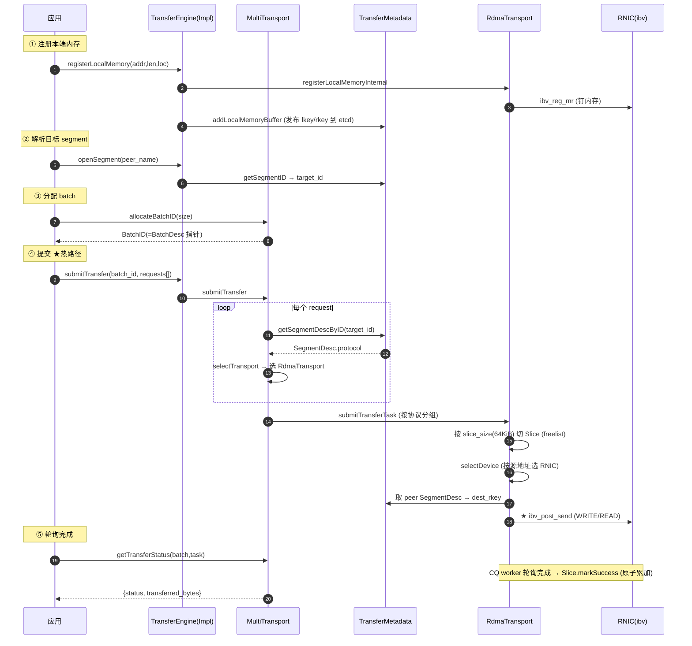

# Mooncake 代码走读

> **代码仓库**：`kvcache-ai/Mooncake`（Kimi/Moonshot AI 的 KVCache-centric LLM 服务架构，FAST 2025 最佳论文）
> **定位**：面向 LLM 服务的 KVCache 中心化分离架构。核心是**高性能数据搬运层**：Transfer Engine（多协议传输）+ Mooncake Store（分布式 KVCache 池）+ P2P Store（checkpoint/权重）。本仓是 C++ 为主的多模块项目，外加 Go/Rust/Python 绑定。
> **重要**：本仓与 openYuanrong datasystem 是**两个独立项目**，各自独立实现。

本文为代码级走读，覆盖**全部子模块**，重点深读 transfer-engine。每节给出架构图、关键类/函数签名与 `file:line`、带注释代码片段、端到端调用示意图（ASCII 分层图 + Mermaid 时序图）。

---

## 目录

- [0. 全局视图与构建](#0-全局视图与构建)
- [1. mooncake-transfer-engine（核心，深读）](#1-mooncake-transfer-engine核心深读)
- [2. mooncake-store（分布式 KVCache 池）](#2-mooncake-store分布式-kvcache-池)
- [3. mooncake-p2p-store](#3-mooncake-p2p-store)
- [4. mooncake-common / mooncake-ep / mooncake-pg / mooncake-rl](#4-mooncake-common--mooncake-ep--mooncake-pg--mooncake-rl)
- [5. mooncake-integration（Python 绑定）](#5-mooncake-integrationpython-绑定)
- [6. 端到端调用示意图](#6-端到端调用示意图)

---

## 0. 全局视图与构建

### 0.1 子模块全景

```text
mooncake/
├── mooncake-transfer-engine/ ← ★核心：多协议数据传输引擎（§1）
│   ├── include/  src/         ← 四层架构 + 15 种 transport
│   ├── tent/                  ← 下一代引擎（TENT，与 legacy 并行）
│   └── src/transport/
│       ├── rdma_transport/  tcp_transport/  nvlink_transport/  ...
│       └── ascend_transport/ ← Ascend NPU 传输（hccl/ascend_direct/hetero_rdma/ubshmem）
├── mooncake-store/           ← 分布式 KVCache 池：master + client（§2）
├── mooncake-p2p-store/       ← Go P2P checkpoint/权重 store（§3）
├── mooncake-common/          ← 共享：etcd/k8s-lease/cmake 工具（§4）
├── mooncake-ep/              ← Expert Parallel（IBGDA，MoE）（§4）
├── mooncake-pg/              ← Placement Group（PyTorch ProcessGroup 后端）（§4）
├── mooncake-rl/              ← RL 训练集成示例（§4）
├── mooncake-integration/     ← Python 绑定 + allocator（§5）
├── mooncake-wheel/           ← 打包
├── benchmarks/  docs/  docker/  scripts/
└── CMakeLists.txt            ← 顶层 CMake（模块开关）
```

### 0.2 构建：模块开关

顶层 `CMakeLists.txt` 通过 option 选择子模块（`:15-21` 附近）：始终构建 `mooncake-common` + `mooncake-integration`；`WITH_TE`/`WITH_STORE`/`WITH_P2P_STORE`/`WITH_EP` 等条件构建其余。Transport 通过编译宏 `USE_RDMA`/`USE_TCP`/`USE_ASCEND_DIRECT` 等选择。

### 0.3 四加速器 + 多网络

支持 CUDA / AMD ROCm / Intel / **Ascend** 四种加速器运行时；网络支持 RDMA / NVLink（MNNVL）/ EFA / TCP / CXL / UB（Kunpeng）等。README 的 Updates 区记录了与 vLLM/SGLang/TensorRT-LLM/LMDeploy/NIXL 等的集成。

---

## 1. mooncake-transfer-engine（核心，深读）

本仓的心脏。**两套并行实现**：legacy `TransferEngineImpl` 和下一代 **TENT**（`tent/`），`TransferEngine` 门面在运行时按 `MC_USE_TENT`/`MC_USE_TEV1` 环境变量切换（`src/transfer_engine.cpp:223`）。下文热路径以 legacy 为准，TENT 镜像同一 API。

### 1.1 四层架构

```text
┌─────────────────────────────────────────────────────────────┐
│ TransferEngine   (公共门面, pimpl, TENT 切换)                │  include/transfer_engine.h:42
│   impl_ ──► TransferEngineImpl                              │
├─────────────────────────────────────────────────────────────┤
│ TransferEngineImpl   (持有 metadata + MultiTransport + ...)  │  include/transfer_engine_impl.h:54
├─────────────────────────────────────────────────────────────┤
│ MultiTransport   (分发器: proto → Transport 路由)            │  include/multi_transport.h:23
│   transport_map_: {proto: Transport}                        │
├─────────────────────────────────────────────────────────────┤
│ Transport   (抽象基类, 每种硬件协议一个子类)                  │  include/transport/transport.h:42
│   RdmaTransport / TcpTransport / AscendDirectTransport / ... │
└─────────────────────────────────────────────────────────────┘
```

### 1.2 核心数据结构（全在 `include/transport/transport.h`）

这是热路径的三个承重结构，理解它们就读懂了引擎的一半：

**`TransferRequest`**（transport.h:58）—— 一个用户请求：
```cpp
struct TransferRequest {
    enum OpCode { READ, WRITE };
    OpCode opcode;
    void *source;                 // 源地址（本端）
    SegmentID target_id;          // 目标 segment（对端）
    uint64_t target_offset;       // 对端偏移
    size_t length;
    int advise_retry_cnt = 0;
};
```

**`Slice`**（transport.h:104）—— 请求被切成硬件大小的块。关键设计：**带标签 union** 承载各协议的私有元数据（`rdma`/`ascend_direct`/`local`/`tcp`/`cxl`/`hccl`...），完成时自删除：
```cpp
struct Slice {
    void *source_addr; size_t length; TransferRequest::OpCode opcode;
    SegmentID target_id; std::string peer_nic_path;
    SliceStatus status; TransferTask *task;
    union {
        struct { uint64_t dest_addr; uint32_t source_lkey; uint32_t dest_rkey;
                 int lkey_index; int rkey_index; volatile int *qp_depth; ... } rdma;
        struct { uint64_t dest_addr; void *handle; int64_t start_time;
                 int32_t engine_id; } ascend_direct;
        // ... local / tcp / cxl / hccl / ubshmem ...
    };
    void markSuccess();   // :166 原子更新 task 计数
    void markFailed();
};
```

**`TransferTask`**（transport.h:281）—— 聚合一个请求的所有 slice；原子计数器 `slice_count`/`success_slice_count`/`failed_slice_count`/`transferred_bytes` 驱动完成判定。

**`BatchDesc`**（transport.h:314）—— 一批 task。**性能技巧**：`BatchID` 就是 `BatchDesc*` 的指针值重解释（transport.h:87-100），跳过任何 map 查找：
```cpp
static inline BatchDesc &toBatchDesc(BatchID id) {
    return *reinterpret_cast<BatchDesc *>(id);   // BatchID 即指针，零查找
}
```

另有**线程局部 Slice freelist**（`ThreadLocalSliceCache`，transport.h:240）回收 Slice 对象，避免热路径 `new`/`delete`。

### 1.3 C ABI 入口（Python/Go/Rust 都调这一层）

`src/transfer_engine_c.cpp` + `include/transfer_engine_c.h`。已核对行号：

| C API | 实现行号 | 作用 |
|-------|---------|------|
| `createTransferEngine(...)` | `transfer_engine_c.cpp:28` | 构造 + init |
| `installTransport(engine, proto, args)` | `:60` | 装载某协议 transport |
| `registerLocalMemory(addr,len,loc,...)` | `:108` | 注册本端内存（下发到各 transport） |
| `registerLocalMemoryBatch(...)` | `:120` | 批量注册 |
| `allocateBatchID(batch_size)` | `:143` | 分配 batch，返回 BatchDesc 指针 |
| `submitTransfer(engine,batch,entries,n)` | `:148` | **★热路径入口** |
| `submitTransferWithNotify(...)` | `:166` | 带 Notify（store 级完成消息） |
| `getTransferStatus(engine,batch,task,status)` | `:188` | 轮询完成状态 |
| `openSegment(engine, name)` | `:70` | 解析目标 SegmentID |

Python 绑定在 `mooncake-integration/transfer_engine/transfer_engine_py.h:43`（`TransferEnginePy`），进一步封装 `transferSyncWrite/Read`、`batchTransferAsync`、CUDA-stream 感知变体。

### 1.4 MultiTransport 分发（`src/multi_transport.cpp`）

中央分发器，把一批请求按协议分组下发：

```cpp
// multi_transport.cpp:104
Status MultiTransport::submitTransfer(BatchID batch_id,
                                      std::vector<TransferRequest> &entries) {
    for (auto& request : entries) {
        Transport* transport = nullptr;
        selectTransport(request, transport);           // :394 按目标协议选路
        auto& task = batch_desc.task_list[task_id];
        submit_tasks[transport].push_back(&task);      // 按协议分组
    }
    for (auto& entry : submit_tasks)
        entry.first->submitTransferTask(entry.second); // 各 transport 分别下发
}
```

**`selectTransport`**（multi_transport.cpp:394）只看**目标 segment 的元数据**决定协议（不看源）：
```cpp
auto target_segment_desc = metadata_->getSegmentDescByID(entry.target_id);
auto proto = target_segment_desc->protocol;
#ifdef USE_ASCEND_HETEROGENEOUS
    if (target_segment_desc->protocol == "rdma") proto = "ascend";  // initiator 重路由
#endif
transport = transport_map_[proto].get();
```

`installTransport`（multi_transport.cpp:272）是工厂：`if (proto=="rdma") transport = new RdmaTransport();` 等。注意 Ascend 的三种宏（`USE_ASCEND`/`USE_ASCEND_DIRECT`/`USE_ASCEND_HETEROGENEOUS`）都映射到 proto `"ascend"` 但实例化不同类（`HcclTransport`/`AscendDirectTransport`/`HeterogeneousRdmaTransport`，`:298-312`）。

### 1.5 元数据层（`src/transfer_metadata.cpp`）

`TransferMetadata` 是本地缓存，前置一个可插拔后端。关键 desc 类型（`transfer_metadata.h`）：

```cpp
struct BufferDesc {       // :52  每个注册内存区域
    void* addr; size_t length;
    uint32_t lkey[]; uint32_t rkey[];   // RDMA
    std::string shm_name;               // NVLink/HIP
    uint64_t offset;                    // CXL
    ...                                 // tseg[] UB/urma
};
struct SegmentDesc {       // :88
    std::string name; std::string protocol;
    std::vector<int> devices[]; TopologyMatrix topology;
    std::vector<BufferDesc> buffers[];
    RankInfoDesc rank_info;             // Ascend 端点
};
struct RankInfoDesc {      // :73  Ascend
    int rankId; std::string hostIp; int deviceLogicId; std::vector<std::string> endpoints;
};
```

后端插件（`transfer_metadata_plugin.cpp:542` 工厂）：
- `etcd://` → `EtcdStoragePlugin`
- `redis://` → `RedisStoragePlugin`
- `http(s)://` → `HTTPStoragePlugin`
- `P2PHANDSHAKE` → 纯 P2P 模式（无中心存储）

**热路径缓存查询** `getSegmentDescByID`（transfer_metadata.cpp:974）：默认开 metacache 时，读锁下返回缓存的 `shared_ptr<SegmentDesc>`；未命中则在锁外走插件网络 IO（避免阻塞），再写锁更新缓存。每次 slice 提交都会命中这里。

### 1.6 Transport 全景（15 种）

| Transport 类 | 头文件 | proto | 硬件/网络 |
|--------------|--------|-------|----------|
| `RdmaTransport` | rdma_transport/rdma_transport.h:41 | `rdma` | IB / RoCE / iWARP RNIC |
| `TcpTransport` | tcp_transport/tcp_transport.h:61 | `tcp` | TCP/IP（asio 协程） |
| `CxlTransport` | cxl_transport/cxl_transport.h:34 | `cxl` | CXL 共享内存 |
| `NVMeoFTransport` | nvmeof_transport/nvmeof_transport.h:39 | `nvmeof` | GPUDirect Storage (cuFile) |
| `EfaTransport` | efa_transport/efa_transport.h:41 | `efa` | AWS EFA (libfabric) |
| `HipTransport` | hip_transport/hip_transport.h:26 | `hip` | AMD GPU 节点内 P2P (XGMI/IPC) |
| `NvlinkTransport` | nvlink_transport/nvlink_transport.h:26 | `nvlink` | NVIDIA MNNVL 跨节点 NVLink |
| `IntraNodeNvlinkTransport` | intranode_nvlink_transport.h:27 | `nvlink_intra` | NVIDIA 节点内 NVLink (IPC shm) |
| `BarexTransport` | barex_transport/barex_transport.h:68 | `barex` | 阿里 Solar/SoE EIC RDMA |
| `UbTransport` | kunpeng_transport/ub_transport.h:36 | `ub` | 华为 Kunpeng UBBus (urma) |
| `RpcCommunicator` | rpc_communicator/rpc_communicator.h:33 | (helper) | coro_rpc 张量/数据传输 |
| `HcclTransport` | ascend_transport/hccl_transport/hccl_transport.h:40 | `ascend` | Ascend NPU via HCCL |
| `AscendDirectTransport` | ascend_transport/ascend_direct_transport/...:34 | `ascend` | Ascend via **ADXL**（华为直连库） |
| `HeterogeneousRdmaTransport` | ascend_transport/heterogeneous_rdma_transport.h:33 | `ascend` | Ascend→host bounce buffer→RDMA |
| `UBShmemTransport` | ascend_transport/ubshmem_transport/ubshmem_transport.h:38 | `ubshmem` | Ascend UBSHMEM 共享内存 |

### 1.7 RDMA 热路径深读（canonical）

`RdmaTransport::submitTransferTask`（rdma_transport.cpp:456）：按 `slice_size`（默认 64KiB）切 Slice，选源设备，按 RdmaContext 分组下发：

```cpp
// rdma_transport.cpp:456（简化）
const size_t kBlockSize = globalConfig().slice_size;          // 64KiB
for (uint64_t offset = 0; offset < request.length; offset += kBlockSize) {
    Slice *slice = getSliceCache().allocate();                // 线程局部 freelist
    slice->source_addr = (char *)request.source + offset;
    slice->length = merge_final_slice ? request.length - offset : kBlockSize;
    slice->rdma.dest_addr = request.target_offset + offset;
    slice->task = &task; task.slice_list.push_back(slice);
    selectDevice(local_segment_desc.get(), (uint64_t)slice->source_addr,  // :684 选源 RNIC
                 slice->length, buffer_id, device_id, retry_cnt);
    slice->rdma.source_lkey = local_segment_desc->buffers[buffer_id].lkey[device_id];
    slices_to_post[context].push_back(slice);
    __sync_fetch_and_add(&task.slice_count, 1);
}
for (auto &entry : slices_to_post)
    entry.first->submitPostSend(entry.second);
```

接着 `WorkerPool::submitPostSend`（worker_pool.cpp:60）**解析目的 rkey**（从对端 SegmentDesc）并选目标 NIC（worker_pool.cpp:143）：
```cpp
slice->rdma.dest_rkey = peer_segment_desc->buffers[buffer_id].rkey[device_id];
slice->peer_nic_path = MakeNicPath(...);
```

最后 `RdmaEndPoint::submitPostSend`（rdma_endpoint.cpp:578）组装 `ibv_send_wr` 链并调用 **`ibv_post_send`**（rdma_endpoint.cpp:640）：
```cpp
wr.opcode = slice->opcode == READ ? IBV_WR_RDMA_READ : IBV_WR_RDMA_WRITE;
wr.wr.rdma.remote_addr = slice->rdma.dest_addr;
wr.wr.rdma.rkey = slice->rdma.dest_rkey;
int rc = ibv_post_send(qp_list_[qp_index], wr_list.data(), &bad_wr);   // :640 ★最终下发
```

完成靠 CQ worker 线程轮询，回调 `slice->markSuccess()`/`markFailed()`（transport.h:166）原子累加 task 计数。

### 1.8 Ascend transports 详读（与 lmcache-ascend 相关）

**(a) `AscendDirectTransport`** —— 主 Ascend 路径，用华为 **ADXL** 库：
- `install`（ascend_direct_transport.cpp:80）建 `TransferExecutorBase`（sync/async）+ `SliceDispatcher`。
- `submitTransferTask`（:253）每请求一个 Slice（ADXL 自处理分片），打 `engine_id`（当前 NPU），入队 dispatcher。
- dispatcher 按 `target_id` 分组 → `TransferExecutorBase::processSliceList`（transfer_executor_base.cpp:516）从 `SegmentDesc::rank_info.endpoints[]` 解析目标 ADXL 引擎名 → `execute()`：
  - 异步（`AsyncTransferExecutor::execute`，async_transfer_executor.cpp:69）：构 `adxl::TransferOpDesc` → `adxl_engines_[idx]->TransferAsync(...)`。
  - 同步：`TransferSync`。
- 内存注册 `registerMem`（transfer_executor_base.cpp:381）调 `adxl::AdxlEngine::RegisterMem`，按 `aclrtPointerGetAttributes` 分 `MEM_HOST`/`MEM_DEVICE`。本端==目标且无 fabric mem 时走 `LocalCopyEngine` 节点内 memcpy。

**(b) `HeterogeneousRdmaTransport`** —— Ascend 无 ADXL/RoCE 时的**回退桥**。因 RNIC 不能直接 DMA Ascend 显存，数据先经 host 钉内存 bounce buffer：
- `install`（heterogeneous_rdma_transport.cpp:102）分配 3GiB host buffer + 4×8MiB device block，注册 host 给 RDMA，起 `transferLoop`。
- `submitTransferTask`（:414）：源是 CPU 内存 → 直接 RDMA；否则 `aclrtMemcpyAsync` D2H，改写 `request.source` 为 host 地址再走 `RdmaTransport`。两种策略：`aggTransport`（小请求 <2MiB 聚合到 device block）/ `noAggTransport`（大请求）。

**(c) `HcclTransport`**（hccl_transport.h:40）—— 旧路径，基于 HCCL rank 通信，跑 `initiatorLoop`/`acceptLoop` 线程。

**(d) `UBShmemTransport`**（ubshmem_transport.h:38）—— Ascend UBSHMEM，节点内 NPU↔host，stream pool + `relocateSharedMemoryAddress`。

### 1.9 设计模式小结

- **零拷贝 / 钉内存**：RDMA 注册 MR 带 `IBV_ACCESS_REMOTE_WRITE|READ`（rdma_transport.cpp:189），大 MR 注册前并行 touch 页（:132）。
- **元数据插件抽象**：`MetadataStoragePlugin`/`HandShakePlugin` 解耦引擎与 etcd/redis/http；segment desc JSON 序列化。
- **Transport 抽象**：`Transport` 统一基类，`MultiTransport` 组合并按目标协议路由。加 transport = 新子类 + `installTransport` 分支。
- **BatchID 即指针**：避开每次状态轮询的 map 查找。
- **事件驱动完成**（`USE_EVENT_DRIVEN_COMPLETION`）：`Slice::check_batch_completion`（transport.h:185）用 release-store + 条件变量唤醒等待者，免轮询。

---

## 2. mooncake-store（分布式 KVCache 池）

路径：`mooncake-store/`。分离式 KVCache store：master 控制面 + 每 worker 客户端。DRAM/CXL/GPU 主层 + 磁盘 offload 层。

### 2.1 架构切分

```text
┌─────────────────────────────────────────────────────────────┐
│ Master (控制面)  MasterService   include/master_service.h:57 │
│   metadata_shards_[1024]: key → ObjectMetadata(Replica[])   │
│   MountSegment / PutStart/PutEnd / GetReplicaList /          │
│   CopyStart/MoveStart / CreateDrainJob / EvictionThreadFunc  │
├─────────────────────────────────────────────────────────────┤
│ Client  RealClient (include/real_client.h:67, wraps PyClient)│
│   setup_real: 协议 + transfer engine + master 地址           │
│   注册本地 segment → 分配 buffer → RDMA/TCP 传数据           │
└─────────────────────────────────────────────────────────────┘
        RPC via coro_rpc (rpc_types.h)
```

### 2.2 Segment 与分配（`include/segment.h`）

`SegmentManager`（segment.h:274）管 `mounted_segments_`（UUID→`MountedSegment`）+ `client_segments_`。每个 `MountedSegment` 持有 `BufferAllocatorBase`（CACHELIB slab 或简单池）。`ScopedSegmentAccess`/`ScopedAllocatorAccess` 是 RAII 锁卫。`SegmentStatus`（segment.h:19）支持生命周期：OK→DRAINING→DRAINED→UNMOUNTING（graceful drain）。

### 2.3 存储后端（`include/storage_backend.h`）

三个 `StorageBackendInterface` 实现：

| 后端 | 行 | 特点 |
|------|----|------|
| `StorageBackendAdaptor` | :638 | file-per-key |
| `BucketStorageBackend` | :705 | 批量 bucket（FIFO/LRU），多 key 打包进 `.bucket`+`.meta`；`BucketReadGuard`(:105) 跟踪在途读 |
| `OffsetAllocatorStorageBackend` | :1006 | 单个预分配 `kv_cache.data` + offset allocator，1024 shard，O_DIRECT，refcount extent（最新） |

### 2.4 淘汰与租约

- `EvictionStrategy`（`eviction_strategy.h`）；master 侧 `EvictionThreadFunc`（master_service.h:933）跑近 LRU `BatchEvict`(:567)，基于租约超时 + soft/hard pin。
- 租约模型：`GrantLease(ttl, soft_ttl)`(:767)；`Ping`(:410) 心跳经 lockfree queue 刷新。
- KVCache 生命周期：`PutStart` 跨 segment 分配副本 → client 写 → `PutEnd` 标 COMPLETE。`GetReplicaList` 返回描述符供 client 读。`Copy/Move` 跨 segment 复制。segment 超 `eviction_high_watermark_ratio_` 触发淘汰，可选 `offload_on_evict_`(:1177) 溢出到磁盘。

### 2.5 HA（`include/ha/`）

leader 选举（`LeaderCoordinator`，etcd/redis 后端）、oplog 复制（`OpLogManager`/`OpLogReplicator`）、快照/恢复（`SnapshotProvider`，S3/local）、热备（`HotStandbyService`/`StandbyController`）。让 master 容错。

### 2.6 Go/Rust 绑定

`go/mooncakestore/`（Go client 包 RPC）、`rust/`（Rust 绑定）—— 同 RPC 接口，另语言客户端。

---

## 3. mooncake-p2p-store

路径：`mooncake-p2p-store/`（Go）。基于 transfer-engine C API（cgo）的 P2P **checkpoint/权重** store。

```go
// src/p2pstore/core.go:33
type P2PStore struct {
    Catalog *Catalog
    RegisteredMemory *RegisteredMemory
    Metadata *Metadata
    TransferEngine *TransferEngine
}
```

`NewP2PStore`（core.go:57）建 `TransferEngine` + 装 tcp/rdma transport。数据 > `MAX_CHUNK_SIZE`（16GiB，core.go:25）跨独立注册 buffer 拆分。比 mooncake-store 简单 —— 无 master，纯 P2P handshake 模式（`P2PHANDSHAKE`）。`build.sh` 编 Go lib。

> 生产级 P2P store 已独立开源为 `checkpoint-engine`（见 README Updates 2025-09-10），用于 Kimi-K1.5/K2 训练，千卡 ~20s 更新 1T 参数。

---

## 4. mooncake-common / mooncake-ep / mooncake-pg / mooncake-rl

### 4.1 mooncake-common

共享基础设施：`common.cmake`（构建辅助）、`Find{GLOG,JsonCpp,Urma,Mpi}.cmake`、`etcd/etcd_wrapper.go`（Go etcd 客户端，store HA 用）、`k8s-lease/`（K8s Lease 选主 wrapper）、C++ 工具 `environ.h`/`default_config.h`/`asio_impl.cpp`。

### 4.2 mooncake-ep（Expert Parallel）

GPU MoE 专家并行 dispatch/combine。`MooncakeEpBuffer`（`include/mooncake_ep_buffer.h:62`）用 **IBGDA**（In-Band GPU Direct RDMA，NVIDIA ConnectX `mlx5gda`）让 GPU 自己 post RDMA send，不经 CPU —— `init_ibgda()`、`qps`(mlx5gda_qp)、`ctrl_buf`(1GiB `mlx5dv_devx_umem`)。回退到 NVLink P2P+IPC 节点内（ep_buffer.h:157）。`dispatch`/`combine`（:122）是 MoE all-to-all 原语。Python 入口 `src/ep_py.cpp` + `setup.py` + `BuildEpExt.cmake`。

### 4.3 mooncake-pg（Placement Group）

PyTorch `c10d::ProcessGroup` 后端：`MooncakeBackend`（`include/mooncake_backend.h:57`）提供 collective + P2P 通信（基于 transfer engine）。`MooncakeP2PShim`（:31）注册 PyTorch P2P dispatch。`P2PProxy` 代发收；`ConnectionPoller` 管连接。CUDA worker 在 `mooncake_worker_thread.cpp`。`benchmark/pgbench.py`。

### 4.4 mooncake-rl

仅 `examples/rl_samples.py`（RL 训练集成示例），无库代码。

---

## 5. mooncake-integration（Python 绑定）

路径：`mooncake-integration/`。

| 文件 | 作用 |
|------|------|
| `transfer_engine/transfer_engine_py.h:43` | `TransferEnginePy` —— 主 pybind 绑定，暴露 `transferSyncWrite/Read`、`batchTransferAsync`、CUDA-stream 感知 `transferWriteOnCuda` |
| `allocator.py` | `NVLinkAllocator` 包 `nvlink_allocator.so` 作 `CUDAPluggableAllocator`，探 fabric mem（cuMemCreate，MNNVL） |
| `allocator_ascend_npu.py` | `UBShmemAllocator` 包 `ubshmem_fabric_allocator.so` 作 `NPUPluggableAllocator`（torch_npu），探 `aclMallocPhysical` |
| `store/async_store.py` | 异步 store 客户端 |
| `allocator.py`/`fabric_allocator_utils.h` | fabric 内存分配工具 |

---

## 6. 端到端调用示意图

### 6.1 Transfer Engine 分层与协议路由（ASCII）

```text
应用 (Python / C / Go)
  │  TransferEnginePy / transfer_engine_c.h
  ▼
┌─────────────────────────────────────────────────────────────┐
│ TransferEngine (门面) ──► TransferEngineImpl                │
│   持有: TransferMetadata + MultiTransport + Topology         │
└──────────────────────────┬──────────────────────────────────┘
                           │ submitTransfer
                           ▼
┌─────────────────────────────────────────────────────────────┐
│ MultiTransport (分发)                                       │
│   对每个 request: selectTransport → 读 SegmentDesc.protocol │
│   按 transport 分组 → 各 transport.submitTransferTask       │
└─┬──────────┬──────────┬──────────┬──────────┬──────────────┘
  │rdma      │tcp       │nvlink    │efa       │ascend
  ▼          ▼          ▼          ▼          ▼
RdmaTransport TcpTrans   NvlinkTrans EfaTrans  AscendDirect(Hccl/HeteroRdma)
  │ ibv_post_send  asio r/w   IPC shm    libfabric  ADXL/HCCL
  └──────────┴──────────┴──────────┴──────────┘
                ▲
                │ 元数据: getSegmentDescByID (本地缓存 ← etcd/redis/http/p2p)
```

### 6.2 批量传输完整时序（以 RDMA WRITE 为例）



### 6.3 三种 transport 的下发分叉（ASCII）

```text
MultiTransport.submitTransfer  multi_transport.cpp:104
  │
  ├─[RDMA]  RdmaTransport::submitTransferTask      rdma_transport.cpp:456
  │           │ 按 slice_size 切 Slice (freelist 复用)
  │           ├─ selectDevice (按源地址选 RNIC)      rdma_transport.cpp:684
  │           └─ WorkerPool::submitPostSend          worker_pool.cpp:60
  │                │ 填 dest_rkey (peer SegmentDesc) worker_pool.cpp:143
  │                └─ RdmaEndPoint::submitPostSend   rdma_endpoint.cpp:578
  │                     └─ ★ ibv_post_send           rdma_endpoint.cpp:640
  │
  ├─[TCP]   TcpTransport::submitTransferTask        tcp_transport.cpp:658
  │           └─ startTransfer (asio async r/w)      tcp_transport.cpp:863
  │
  ├─[NVLink/NVLink_intra/HIP/CXL/UB] 节点内共享内存路径
  │
  └─[Ascend] AscendDirectTransport::submit          ascend_direct_transport.cpp:253
             └─ dispatcher → processSliceList        transfer_executor_base.cpp:516
                  ├─ 解析 rank_info.endpoints
                  └─ ★ adxl::TransferAsync           async_transfer_executor.cpp:69
             (回退) HeterogeneousRdmaTransport        heterogeneous_rdma_transport.cpp:414
                  └─ D2H bounce buffer → RdmaTransport
```

### 6.4 调用链速查（带行号，纵向）

```text
① register:  registerLocalMemory        transfer_engine_c.cpp:108
              └► TransferEngineImpl::registerLocalMemory  transfer_engine_impl.cpp:502
                   └► transport->registerLocalMemory → ibv_reg_mr
                   └► metadata_->addLocalMemoryBuffer (发 lkey/rkey)

② segment:   openSegment                 transfer_engine_c.cpp:70
              └► getSegmentID             transfer_metadata.cpp:1002

③ batch:     allocateBatchID             transfer_engine_c.cpp:143
              └► MultiTransport::allocateBatchID  multi_transport.cpp:72 (new BatchDesc)

④ submit:    submitTransfer              transfer_engine_c.cpp:148
              └► MultiTransport::submitTransfer    multi_transport.cpp:104
                   ├► selectTransport              multi_transport.cpp:394
                   │   └► getSegmentDescByID       transfer_metadata.cpp:974
                   └► [RDMA] submitTransferTask     rdma_transport.cpp:456
                         ├► selectDevice            rdma_transport.cpp:684
                         ├► WorkerPool.submitPostSend worker_pool.cpp:60 (填 dest_rkey :143)
                         └► ★ ibv_post_send         rdma_endpoint.cpp:640

⑤ status:    getTransferStatus           transfer_engine_c.cpp:188
              └► MultiTransport::getTransferStatus  multi_transport.cpp:187
                   读 task.transferred_bytes (CQ 线程已 markSuccess)
```

---

## 附录：核心类速查

| 层 | 类/结构 | 位置 |
|----|---------|------|
| 门面 | `TransferEngine` | `mooncake-transfer-engine/include/transfer_engine.h:42` |
| impl | `TransferEngineImpl` | `.../include/transfer_engine_impl.h:54` |
| 分发 | `MultiTransport` | `.../include/multi_transport.h:23` |
| 抽象 | `Transport` / `TransferRequest`/`Slice`/`TransferTask`/`BatchDesc` | `.../include/transport/transport.h:42/58/104/281/314` |
| RDMA | `RdmaTransport` / `RdmaEndPoint` | `.../src/transport/rdma_transport/rdma_transport.{h,cpp}` |
| 元数据 | `TransferMetadata` / `SegmentDesc` / `BufferDesc` / `RankInfoDesc` | `.../include/transfer_metadata.h` |
| 插件 | `MetadataStoragePlugin` / `HandShakePlugin` | `.../include/transfer_metadata_plugin.h` |
| Ascend | `AscendDirectTransport` / `HeterogeneousRdmaTransport` / `HcclTransport` | `.../src/transport/ascend_transport/` |
| Store | `MasterService` / `RealClient` / `SegmentManager` | `mooncake-store/include/{master_service,real_client,segment}.h` |
| Store | `StorageBackendInterface` 及三实现 | `mooncake-store/include/storage_backend.h:638/705/1006` |
| EP/PG | `MooncakeEpBuffer` / `MooncakeBackend` | `mooncake-ep/include/mooncake_ep_buffer.h:62` / `mooncake-pg/include/mooncake_backend.h:57` |
| Py | `TransferEnginePy` | `mooncake-integration/transfer_engine/transfer_engine_py.h:43` |
