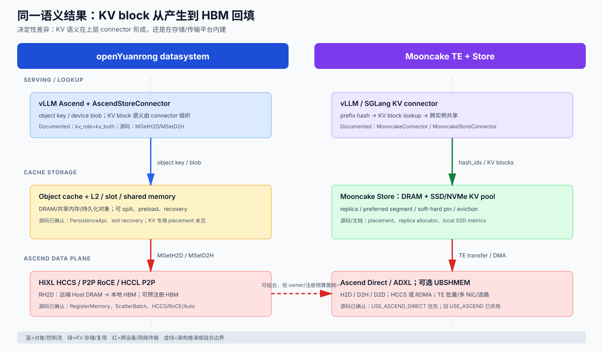

# openYuanrong datasystem vs Mooncake 竞品报告

**研究日期：** 2026-09-14

**比较对象：** openYuanrong datasystem（下文简称“Yuanrong DS”）与 Mooncake（Transfer Engine + Mooncake Store）

**核心问题：** 昇腾特性支持程度、KV 存储、KV 传输，以及国内互联网厂商使用情况。

## 范围、版本与证据等级

- **Yuanrong DS 基线：** `yuanrong-datasystem`，commit `ae841bfe773c6eef22d187b1077e0a73140b10d7`（`ae841bf`）。
- **Mooncake 基线：** `mooncake-review`，commit `e389a85093cb37a96ccf68dcfbe2dcff0698a99e`（`v0.3.14-rc1-31-ge389a850`）。
- **Observed / 源码已确认：** 直接来自上述 checkout 的源码；报告给出仓库相对路径和行号。
- **Documented / 文档声称：** 项目 README、官方文档、vLLM-Ascend 文档；不能单独当作所有生产环境的 runtime 证明。
- **Inferred / 架构推断：** 根据 API、编译开关和数据路径推导，并明确写出推理依据。
- **Unknown / 未知：** 未获得两家在同一硬件、同一模型、同一请求 trace 下的可复现实测；厂商采用规模、SLA、成本和故障率不应从公开仓库直接外推。

**未覆盖：** 许可证与商业支持合同、具体云厂商报价、私有部署规模、未公开客户、真实生产 tail latency、CANN/驱动在每个版本组合上的兼容矩阵。

## 一页结论

| 维度 | Yuanrong DS | Mooncake | 结论 | 代码证据 |
|---|---:|---:|---|---|
| 昇腾原生能力 | **4.5/5** | **4.5/5** | Yuanrong 更像昇腾数据系统；Mooncake 更像跨加速器传输平台，昇腾路径已经形成 Direct/ADXL、HCCS/RDMA、UBSHMEM 组合。 | **Observed：** Yuanrong `hccs_transport.*`；Mooncake `multi_transport.cpp`、`transfer_engine_impl.cpp` |
| KV 存储产品化 | **3.5/5** | **5.0/5** | Mooncake Store 原生围绕 KVCache 做分布式存储、复制、淘汰、分层和放置；Yuanrong DS 强在通用对象/异构缓存与 L2 持久化，KV 语义主要由 vLLM connector 适配。 | **Observed + Documented：** Yuanrong `ObjectPersistenceApi`/`PersistenceApi`；Mooncake placement/replica 源码与 Store 文档 |
| KV 传输效率 | **4.0/5** | **4.5/5** | Yuanrong 的 RH2D/HCCS/RoCE 可直达 NPU HBM；Mooncake TE 在批量、零拷贝、多 NIC、拓扑选路、故障切换和跨框架接入上更完整。 | **Observed：** Yuanrong `MGetH2D`→`HostDataCopy2Device`；Mooncake Ascend transport registration |
| 统一对象数据系统 | **4.5/5** | **2.5/5** | Yuanrong 源码同时具备 object/device-object、L2 persistence、slot/recovery 和路由/worker 边界；本次 Mooncake 源码范围未见 Stream 语义，因此不能等量齐观。 | **Observed：** Yuanrong `object_client_impl.h`、`persistence_api.*`；Mooncake 本次 checkout 未见对应 Stream API |
| 华为/昇腾基础设施集成 | **4.5/5** | **4.0/5** | 两者均有代码级 Ascend runtime 集成；Yuanrong 在 HIXL/HCCS/RH2D/ACL 资源控制更深入。**华为内部产品协同与客户采用不由源码证明。** | **Observed：** Yuanrong HIXL/ACL/HCCL；Mooncake ADXL/Ascend transport；采用证据另列 |
| 国内互联网公开采用证据 | **2.5/5** | **4.5/5** | Mooncake 有 Kimi 生产平台、腾讯 FlexKV、阿里 ROLL、京东 xLLM 等公开生态证据；Yuanrong 的公开采用主要是华为/昇腾体系，互联网公司独立生产案例仍少。 | **Documented only：** 官方 README、公开文章；非源码事实 |
| **综合（按前五项技术维度等权）** | **4.2/5** | **4.1/5** | 技术能力若以昇腾和统一数据系统为主，Yuanrong 更强；若以 KV 专用存储、跨框架和公开生态为主，Mooncake 更强。 | 评分是基于源码边界与文档证据的分析，不是同硬件 benchmark |

**最重要的判断（代码证据版）：** 两者不是完全同层竞争。Yuanrong DS 是“通用分布式数据系统 + 昇腾异构数据面”，Mooncake 是“以 KVCache 为中心的推理传输/存储平台”。源码可以确认 Yuanrong 的 HIXL/HCCS/RH2D/ACL 数据通道和 object/L2/slot 语义，也可以确认 Mooncake 的 Ascend transport 与 Store placement；源码不能确认“华为内部产品协同”或任一方的真实客户规模。昇腾单一集群优先看 Yuanrong，KV serving 平台化和生态优先看 Mooncake。

## 重新分析：三类结论的证据边界

### A. RH2D/HIXL/HCCS：Yuanrong 是代码级强项，Mooncake 是代码级可用

- **Yuanrong（Observed）：** `HCCSTransport` 直接包含 HIXL 头文件，声明 `RegisterMemory`、`PreRegisterDeviceMemory`、`ImportRemoteAddressInfo`、`ScatterBatch`，并保存 per-device HIXL engine 和注册内存表（`src/datasystem/common/rdma/npu/hccs_transport.h:31-53,60-99`）。初始化调用 ACL 设置 device，再调用 `engine->Initialize(...)`；`HCCL_INTRA_ROCE_ENABLE` 选择 `ROCE_DIRECT` 或 `BUFFER_POOL`（`hccs_transport.cpp:54-72,136-214`）。
- **Yuanrong 调用链（Observed）：** `ObjectClientImpl::MGetH2D` 更新 RemoteH2D 配置并进入 `MGetH2DImpl`（`src/datasystem/client/object_cache/object_client_impl.cpp:1816-1840`）；实现显式把 RH2D 标记传入 `Get`，再执行 `HostDataCopy2Device`（`src/datasystem/client/object_cache/object_client_impl.cpp:1930-1965`）。这证明 RH2D 不是只存在于部署文档，而是挂在对象获取的实际调用链上。
- **Mooncake（Observed）：** `multi_transport.cpp` 在 `USE_ASCEND_DIRECT` 下实例化 `AscendDirectTransport`，旧 `USE_ASCEND` 下实例化 `HcclTransport`，另有异构 RDMA 分支（`mooncake-transfer-engine/src/multi_transport.cpp:38-46,467-480`）；`TransferEngine` 负责安装 `ascend` transport（`src/transfer_engine_impl.cpp:227-233`）。
- **边界：** 两边源码都证明“实现存在并能进入数据面”，不证明当前环境中的驱动、CANN、ADXL/HIXL、HCCS 链路一定可运行；运行可用性仍需按版本矩阵和实测验证。

### B. 统一对象数据系统：Yuanrong 可以由源码证明，Mooncake 不应被描述成同类系统

- **Yuanrong（Observed）：** 设备对象 API 同时提供 `MGetH2D`/`MSetD2H`、`DevPublish`/`DevSubscribe`、`DevMGet`/`DevMSet` 等对象生命周期接口（`src/datasystem/client/object_cache/object_client_impl.h:581-670`）；持久化工厂在 `l2_cache_type=distributed_disk` 时选择 `AggregatedPersistenceApi`，否则选择 `ObjectPersistenceApi`（`src/datasystem/common/l2cache/persistence_api.cpp:32-50`）；`PersistenceApi` 还暴露 slot preload/merge/cleanup（`src/datasystem/common/l2cache/persistence_api.h:111-122`）。对象 API、设备对象 API、L2 persistence、slot recovery 因此有代码级连接。
- **Mooncake（Observed）：** Store 源码可以确认 placement target、replica allocator、local SSD metrics 和 NVMe KV executor（`mooncake-store/include/placement/target.h:11-33`；`mooncake-store/src/placement/replica_allocator.cpp:1-5,85-123`；`mooncake-store/src/nvme_kv_executor_ioctl.cpp:1-5`）。这证明它是分布式 KV/对象存储，但在本次 checkout 中没有发现与 Yuanrong Object/Stream/slot recovery 对等的统一语义面。
- **结论：** “Yuanrong 是统一对象数据系统”是 **Observed**；“Mooncake 也是统一对象数据系统”只能说是 **Inferred/不等价**。Mooncake 的优势应表述为 KV 专用存储平台，而不是泛化成 Object/Stream 一体化系统。

### C. 华为基础设施协同：代码只证明技术集成，不证明组织/客户协同

- **可由代码证明的部分（Observed）：** Yuanrong 依赖 `hixl`、ACL、HCCL 类型和 HCCS/RoCE 链路；Mooncake 依赖 Ascend Direct/ADXL、CANN 构建开关和 Ascend transport。两边均有 endpoint、device、内存注册或链路选择的实现。
- **只能由文档证明的部分（Documented）：** vLLM-Ascend connector、容器设备挂载、`/etc/hccn.conf`、CANN/驱动版本要求、A3 fabric memory 等部署契约。
- **本次无法源码证明的部分（Unknown）：** “华为 MetaERP、小艺、华为云、终端云等内部产品广泛使用”、互联网大厂线上规模、SLA、采购量、客户数量。此类信息只能作为公开采用线索，不能升级为源码结论。

## 一页数据路径图

图中最关键的边界是“KV 的产品语义在哪里形成”。Mooncake 在 Store/Connector 层直接把 hash block、复制、放置和跨实例复用作为一等对象；Yuanrong DS 在底层提供 object/heterogeneous object、L2 和 NPU 数据通道，KV block、prefix hash 和 vLLM 生命周期由上层 connector 组织。因此 Yuanrong 的 NPU 搬运能力不弱，但需要更多 serving 集成工作才能达到 Mooncake 的 KVCache 产品体验。

## 1. 产品定位与架构差异

### Yuanrong DS

openEuler 官方项目页把 openYuanrong 定义为 Serverless 分布式计算引擎，数据系统提供“异构分布式多级缓存”以及 Object/Stream 语义，重点是函数实例之间的数据共享和传递（Documented）。这使它天然覆盖 AI、大数据和微服务，但 KVCache 不是唯一中心对象。

源码侧，设备对象 API 暴露 `MGetH2D`、`MSetD2H`、异步版本、`DevPublish/DevSubscribe` 等接口，并提供 `PreRegisterDeviceMemory`（`src/datasystem/client/object_cache/object_client_impl.h:581-619`）。这是一个“对象 key + device blob”模型：服务端保存对象，客户端指定目标 HBM 地址和 blob 切片。

### Mooncake

Mooncake README 明确将系统拆成 Transfer Engine、Mooncake Store、EP/PG；定位是以 KVCache 为中心的 LLM serving/training 基础设施（Documented，`mooncake-review/README.md:86-88`）。Store 负责分布式 KV cache 和模型权重；TE 负责跨存储、网络和加速器的数据搬运（`README.md:92-118`）。

这带来结构性差异：Mooncake 的调度和存储单元可直接对应 KV block、复制数、preferred segment、soft/hard pin；Yuanrong 的调度单元首先是 object/blob，KV 语义通过 vLLM connector 叠加。

## 2. 昇腾特性支持对比

### 2.1 Mooncake：昇腾路径多，但要选对构建模式

**源码已确认：** `multi_transport.cpp` 在 `USE_ASCEND_DIRECT` 下加载 `AscendDirectTransport`，在旧 `USE_ASCEND` 下加载 `HcclTransport`，还可在 `USE_ASCEND_HETEROGENEOUS` 下加载异构 RDMA transport（`mooncake-transfer-engine/src/multi_transport.cpp:38-46,467-480`）。Transfer Engine 初始化时安装 `ascend` transport（`src/transfer_engine_impl.cpp:227-233`），并把 NPU 物理卡号编码进 endpoint（`src/transfer_engine_impl.cpp:101-113,194-202`）。

**Documented：** 当前官方文档把 Ascend Direct Transport 标为推荐路径，基于 CANN ADXL，支持 Host-to-Device、Device-to-Host、Device-to-Device，并可在 HCCS 与 RDMA 间选择（`docs/source/design/transfer-engine/ascend_direct_transport.md:5-9`）。旧 Ascend Transport 文档明确写着“scheduled for deprecation”，并且旧路径主要是 NPU-to-NPU、Device-to-Device（`docs/source/design/transfer-engine/ascend_transport.md:5-13`）。

**额外能力：** `USE_UBSHMEM` 通过 CANN VMM APIs 提供 NPU shared-memory transport；构建文档要求 CANN、驱动和 Lingqu 版本组合。A3 的 fabric memory 模式允许 Mooncake Store 直接访问远端 host memory，但这依赖 CANN/HDK/驱动条件（Documented）。

**限制与运营成本：** Ascend Direct 文档要求先设置 device、容器挂载 `/etc/hccn.conf`、HCCS device memory 2 MiB 对齐；IPv6 仍有限制；CANN、ADXL、驱动、HCCN 配置是部署前置条件（`ascend_direct_transport.md:72-101`）。因此 Mooncake 的“昇腾支持”是高能力但强依赖版本/构建开关的支持，不等于 CUDA wheel 式开箱即用。

### 2.2 Yuanrong DS：昇腾数据面更深入到 RH2D/HIXL

**源码已确认：** HCCS transport 直接包含 HIXL，定义 `BUFFER_POOL`、`ROCE_DIRECT`、`FABRIC_MEM` 三种模式，支持 `RegisterMemory`、`PreRegisterDeviceMemory`、远端地址导入和 `ScatterBatch`（`src/datasystem/common/rdma/npu/hccs_transport.h:31-53,60-99`）。初始化会设置 ACL device、创建每设备 HIXL engine，并按环境变量 `HCCL_INTRA_ROCE_ENABLE` 选择 buffer-pool 或 RoCE-direct（`hccs_transport.cpp:54-72,136-214`）。

源码还存在 Ascend HCCL/P2P 通信封装，链路类型明确区分 HCCS、RoCE 和自动选择（`src/datasystem/common/device/ascend/p2phccl_types.h:41-52`），说明它不是只在文档层“宣称支持昇腾”。

**Documented：** RH2D 定义为“远端主机共享内存到设备 HBM”的跨节点通道；P2P-Transfer RoCE 与 HIXL HCCS 是两条部署路线。官方最佳实践提供 vLLM-Ascend + `AscendStoreConnector` 示例，并明确 `enable_remote_h2d`（`docs/source_zh_cn/best_practices/best_practices_for_rh2d.md:1-34,478-509`）。

**工程含义：** Yuanrong 更贴近昇腾的内存注册、HCCS、RoCE、ACL 生命周期和 NUMA/大页运维；对 A2/A3 集群，尤其是“远端 DRAM → 本地 HBM”的缓存回填，其路径表达比通用 RDMA 更细。

### 2.3 昇腾维度结论

- **纯 Ascend 原生深度：** Yuanrong DS 略占优，因其核心 API 和 transport 就围绕 ACL/HIXL/HCCS/RH2D 设计。
- **跨加速器和跨框架：** Mooncake 明显占优，TE 同时覆盖 TCP、RDMA、NVMe-oF、NVLink、HIP、CXL、Ascend 等协议，并有 vLLM/SGLang/TensorRT-LLM 接入（Documented，`README.md:94-112`）。
- **昇腾生产可复制性：** 两者都不是“只装 pip 包就完事”。Mooncake 要选 `USE_ASCEND_DIRECT`/`USE_UBSHMEM` 和 CANN/ADXL；Yuanrong 要配置 HIXL、RH2D、HCCN、ACL、共享内存和容器设备映射。

## 3. KV 存储能力

### 3.1 Mooncake Store

Mooncake Store 文档定位为 LLM inference 的分布式 KV cache storage engine，支持：

1. **DRAM + SSD/NVMe 多级容量**；
2. **大对象 striping、并行 I/O、端到端 zero-copy**；
3. **副本数、preferred segment、soft pin、hard pin 等 per-object 策略**；
4. **存储节点与推理 engine 解耦，节点可弹性增删**；
5. **跨实例 hash-prefix KV block 复用**。

这些是 README 的产品声明（`mooncake-review/README.md:116-131,181-190`），源码也能看到 placement/replica allocator、local SSD metrics 和 `PlacementTargetKind::CXL` 等结构（`mooncake-store/src/placement/replica_allocator.cpp:1-5,85-123`；`include/placement/target.h:11-33`）。因此它不只是“把 bytes 存远端”，而是具备 KV 池化所需的容量、放置和生命周期控制。

### 3.2 Yuanrong DS

Yuanrong DS 的核心存储是通用 object cache/heterogeneous object，叠加 L2 persistence、slot、spill/recovery 和共享内存。源码中的 `PersistenceApi` 提供 slot preload、merge、cleanup 等生命周期接口（`src/datasystem/common/l2cache/persistence_api.h:109-122`），worker 侧有 L2 cache、spill、primary copy 和 recovery 管理。

其 vLLM-Ascend 文档示例把后端配置成 `AscendStoreConnector`，KV role 为 `kv_both`，说明已经有面向 KV connector 的适配（`best_practices_for_rh2d.md:489-508`）。不过在本基线中，通用 DS API 并没有 Mooncake Store 那样明显的 prefix-hash block、replica/pin、KV-specific placement 表达；这些语义主要依赖 connector 和上层引擎（Inferred）。

### 3.3 存储维度结论

若需求是“做一个跨实例共享的 KVCache 池”，Mooncake Store 的抽象更短：block lookup → remote store → replica/evict → connector 回填。若需求是“把 KV、对象、流、训练中间态统一放进同一数据系统”，Yuanrong 的广度更好，但要自行定义 KV block 元数据、冷热策略和跨实例一致性。

## 4. KV 传输路径对比

### 4.1 Mooncake：以 Transfer Engine 为中心

TE 的公开能力包括批量传输、拓扑感知、多 NIC 带宽聚合、临时网络错误自动切换，以及 TCP/RDMA/NVMe-oF/Ascend 等多协议。README 报告在 4×200 Gbps RoCE 上最高 87 GB/s、8×400 Gbps 上最高 190 GB/s，并声称相对 TCP 为 2.4×/4.6×；这些是项目基准，不是本次独立复测（`README.md:94-110`）。

在 vLLM 中，`MooncakeConnector` 用于 PD 解耦，把 prefill worker 的 KV block 传给 decode worker；`MooncakeStoreConnector` 用于跨实例共享和 hash-prefix 复用（`README.md:181-192`）。这使“KV 传输”和“KV 存储”在同一套 object/segment/transport 模型中闭环。

### 4.2 Yuanrong：两类通道

1. **远端 Host → 本地 Device（RH2D）：** 适合 KV 在远端 DRAM/L2、目标是本地 HBM 的回填。HIXL HCCS 直接路径可预注册目标 HBM，避免热路径重复 `RegisterMem(MEM_DEVICE)`；RoCE 路径适合跨节点。
2. **Device ↔ Device / P2P：** HCCL P2P 和设备对象 API 支持 publish/subscribe、MGet/MSet；`P2pLink` 区分 HCCS/RoCE/Auto（源码已确认）。

官方最佳实践明确：预注册只适用于 `enable_remote_h2d=True` 且 HCCS RH2D，不适用于 P2P-Transfer RoCE；预注册和临时注册共享 HIXL 注册预算，建议使用连续 HBM 池（`best_practices_for_rh2d.md:372-382`）。源码进一步把有效设备注册上限控制在 253，并说明长期/临时注册共享 256 `MEM_DEVICE` 预算（`hccs_transport.cpp:49-52`）。

**传输差异：** Yuanrong 允许应用把目标 device buffer 直接交给数据系统，昇腾内存注册和 HCCS/RoCE 细节更显式；Mooncake 把传输切片、注册、路径和批量调度封装在 TE，再由 KV connector 传 block。前者便于昇腾专项优化，后者便于多引擎和多硬件复用。

## 5. 国内互联网厂商使用与生态

### 已有较强公开证据的 Mooncake 使用者

| 厂商/项目 | 公开证据 | 证据等级
|---|---|---|
| 月之暗面 / Kimi | Mooncake 官方 README 称其为 Kimi 的 serving platform，并报告真实负载下请求承载提升 75%；另有 Kimi-K2 128 H200 PD/EP 部署记录（项目/团队声明）。 | Documented，且有产品归属；具体 75% 未独立审计。
| 腾讯 + NVIDIA / FlexKV | Mooncake README 记录 FlexKV 已支持通过 Mooncake TE 做 distributed KVCache reuse；FlexKV 是腾讯与 NVIDIA 的分布式 KV 系统。 | Documented，项目集成证据；不等于腾讯所有在线业务已切换。
| 阿里 / ROLL | Mooncake README 记录与 Alibaba ROLL 合作；阿里云开发者文章进一步声称阿里云、蚂蚁内部部署。 | 官方项目更新 + 二手文章；内部部署规模未知。
| 京东 / xLLM | Mooncake README 记录 xLLM 基于 Mooncake 构建 hybrid/global KV cache，支持 offload/prefetch。 | Documented，项目集成证据。
| SGLang、vLLM、LMCache、TensorRT-LLM | 官方 upstream 集成 Mooncake TE/Store，覆盖 PD disaggregation、HiCache、KV connector 和 remote connector。 | 源码/官方文档可验证集成；各公司生产规模未知。

### Yuanrong 的公开采用画像

- openEuler 官方项目页确认其产品定位是统一 Serverless 分布式计算引擎，数据系统覆盖异构多级缓存；这是社区/项目层证据，不是互联网客户名单。
- Yuanrong DS 官方最佳实践已经给出 vLLM-Ascend `AscendStoreConnector`、RH2D、HIXL HCCS、P2P RoCE 的端到端样例，说明“昇腾 + vLLM connector”具备公开可调测路径（Documented）。
- 公开新闻/社区材料更多把 openYuanrong 与华为 MetaERP、小艺、华为云、终端云、ICT、海思等华为体系产品联系起来。该信息可作为华为内部采用线索，但不是本报告基线源码或独立客户审计，不能等同于腾讯、阿里、字节、美团等互联网公司的公开生产采用。

**因此不要把“华为体系采用”与“国内互联网厂商广泛采用”混为一谈：** Mooncake 的优势是公开生态网络和 LLM serving 项目密度；Yuanrong 的优势是昇腾基础设施代码集成深度，但外部互联网客户证据需要进一步通过招标、技术分享、镜像/依赖、PR 或客户案例核验。

## 6. 竞争格局与选型建议

### 适合优先 Yuanrong DS 的场景

- 集群以昇腾 NPU 为主，关键路径是远端 DRAM/HBM 回填、HCCS/RoCE 和 ACL/HIXL 资源控制。
- 已有 openYuanrong/数据系统运维团队，希望 KV、对象、训练中间态共用一套服务发现、worker、L2 和恢复体系。
- 需要把“device blob + object key”直接嵌入自有推理引擎，而不是接受 Mooncake Store 的 KV block/connector 模型。

### 适合优先 Mooncake 的场景

- 需要 vLLM/SGLang/TensorRT-LLM 多框架共存，或 NVIDIA/AMD/昇腾混合集群。
- 重点是 PD 解耦、跨实例 prefix KV 复用、远端 DRAM/SSD/NVMe 池、复制/淘汰/放置策略。
- 希望沿用已有 Mooncake TE 生态，减少自研 KV transfer、connector 和多 NIC/RDMA 故障处理。

### 推荐的组合策略

在昇腾集群不必把两者视为只能二选一：可以用 Mooncake Store/connector 表达 KV block 和跨实例复用，用 Ascend Direct 或其下层昇腾通道完成高性能数据搬运；也可以在 Yuanrong DS 中保留统一对象/L2/恢复体系，仅借鉴 Mooncake 的 KV 元数据、prefix hash、placement 和可观测性模型。组合前必须做接口和所有权设计，避免同一 KV 同时被两个 eviction/recovery owner 管理。

## 7. 需要补齐的验证项

1. 在同一 A2/A3 硬件、同一 CANN/驱动版本上，对 Mooncake Ascend Direct、Mooncake UBSHMEM、Yuanrong HIXL HCCS、Yuanrong P2P RoCE 做 1 MB–1 GB 的单流/多流带宽与 P50/P99。
2. 用同一 vLLM/SGLang 版本、同一 DeepSeek/Qwen 长上下文 trace，测 prefix hit、TTFT、decode ITL、KV write/read amplification 和 HBM/DRAM/SSD 命中率。
3. 注入 NPU link down、worker 重启、HIXL registration exhaustion、store node 扩缩容，比较数据丢失、请求失败、恢复时间和回退路径。
4. 核验容器内 `/etc/hccn.conf`、device 映射、NUMA、HugeTLB、memlock、HIXL 256 registration budget 对每个版本的实际约束。
5. 对厂商采用逐条收集一手证据：线上技术分享、官方 PR/镜像、依赖锁定、客户案例；将“关注/集成/试点/生产”四种状态分开。

## 最终判断

**技术产品层面：** Mooncake 在 KVCache 专用存储、跨实例复用、传输抽象和 LLM serving 生态领先；Yuanrong DS 在昇腾原生 RH2D/HIXL/HCCS、统一对象数据系统和昇腾基础设施代码集成上更深。

**市场层面：** Mooncake 当前拥有更强的公开互联网/开源生态证明；Yuanrong 的公开证明更偏 openEuler/华为/昇腾体系，不能在没有额外证据时表述为“已被国内互联网大厂广泛采用”。

**决策建议：** 若目标是“昇腾专用、高可控、数据系统统一”，优先评估 Yuanrong DS；若目标是“LLM serving KVCache 平台化、跨框架/跨硬件和快速接入生态”，优先评估 Mooncake。最终采购或架构决策应以同硬件实测和故障演练，而不是 README 的峰值数字或 Logo 列表为准。

## 参考来源

1. [openEuler openYuanrong 项目页](https://www.openeuler.org/zh/projects/yuanrong/)
2. [Mooncake 官方仓库 README](https://github.com/kvcache-ai/Mooncake)
3. [Mooncake Ascend Direct Transport 文档](https://kvcache-ai.github.io/Mooncake/design/transfer-engine/ascend_direct_transport.html)
4. [Mooncake Supported Protocols](https://kvcache-ai.github.io/Mooncake/getting_started/supported-protocols.html)
5. [vLLM-Ascend Mooncake KV pool 文档](https://docs.vllm.ai/projects/ascend/zh-cn/main/user_guide/feature_guide/kv_pool.html)
6. [vLLM-Ascend Mooncake disaggregated prefill 文档](https://docs.vllm.ai/projects/ascend/en/latest/developer_guide/feature_guide/disaggregated_prefill.html)
7. [Mooncake FAST 2025 论文](https://www.usenix.org/conference/fast25/presentation/qin)
8. [Mooncake arXiv 论文](https://arxiv.org/abs/2407.00079)
9. Yuanrong DS vLLM-Ascend/KVCache 最佳实践 —— 上游仓库里的 `docs/source_zh_cn/best_practices/best_practices_for_kvcache.md`（不在本站，按基线 commit `ae841bf` 查阅）
10. Yuanrong DS RH2D 最佳实践 —— 上游仓库里的 `docs/source_zh_cn/best_practices/best_practices_for_rh2d.md`（同上）
11. [阿里云开发者 Mooncake/SGLang 集成文章](https://developer.aliyun.com/article/1663266)（二手采用线索，需一手材料复核）
