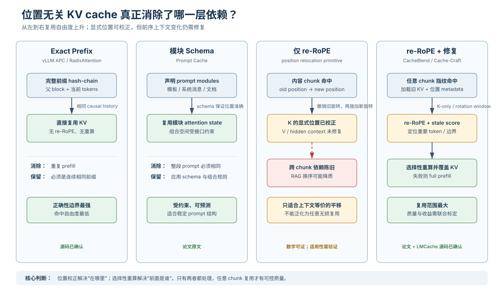

# Position-Independent KV Cache 技术与论文综述

> 主题：LLM 推理中的位置无关/位置可迁移 KV cache，而不是编译链接领域的 position-independent code（PIC）。
>
> 日期：2026-09-14
>
> 工程基线：LMCache `v0.5.5rc7`（commit `05a013b29da78cf2321b9b46ec5039dde2fb0bb0`）；vLLM `v0.26.0`（commit `568afb3a13806beb53bb2e6bd518269357b237c0`）。

## 1. 结论先行

1. **“位置无关 KV cache”不是一个单一机制。** 它至少包含内容寻址、位置编码校正、上下文依赖修复、缓存调度四层问题。
2. **re-RoPE 只消除显式位置变化，不消除上下文变化。** 把缓存的 K 从旧位置旋转到新位置在数学上很便宜；但一个 token 在后续层的 K/V 已经吸收了它前面 token 的信息。只要前序文档、chunk 顺序或 attention mask 变化，单纯 re-RoPE 仍会留下陈旧状态。
3. **严格正确的低风险路线仍是 exact prefix cache。** vLLM APC 将父 block hash 纳入当前 block 的 hash，天然绑定完整前缀；它位置不自由，但命中后无需质量补偿。
4. **Prompt Cache 是“受约束的位置复用”。** 它通过 schema 显式声明可复用 prompt module 并保证位置准确，适合模板、系统提示词和固定文档模块；约束越强，越容易保持等价。
5. **CacheBlend 与 Cache-Craft 是“通用非前缀复用 + 少量修复”。** 二者都承认任意位置、任意上下文下的旧 KV 不能直接视作正确答案，因此选择一部分 token 重算，换取接近 full prefill 的质量。
6. **当前最实用的工程组合是：** exact-prefix 快路径 + chunk 内容指纹 + re-RoPE + 重要 token 选择性重算 + 质量/兼容性失败时 full-prefill 回退。

一句话概括：**position-independent cache 更准确的名字应是 position-relocatable cache；它能把缓存“搬到新位置”，但是否能正确复用仍取决于上下文修复。**

## 2. 范围、证据与不覆盖项

### 2.1 本文覆盖

- RoPE 下 K cache 的位置迁移数学；
- exact prefix、模块化缓存、任意 chunk 缓存三类复用语义；
- Prompt Cache、CacheBlend、Cache-Craft 三篇核心论文；
- RoFormer、RAGCache、PagedAttention/APC、MLA 等相邻工作；
- LMCache/vLLM 当前 checkout 中可审计的实现边界；
- 面向 RAG、多轮对话和共享模板的落地建议。

### 2.2 本文不展开

- KV 压缩、SSD/远端 offload、RDMA、调度等与“位置语义”正交的优化；
- 不同模型权重之间的 KV 共享；
- 训练阶段的位置编码方法全景比较；
- CUDA/NPU re-RoPE kernel 的逐指令性能分析。

### 2.3 证据标签

- **论文原文**：来自论文摘要、正式发表信息或论文方法描述；论文性能数字只代表其测试配置。
- **源码观察**：当前本地 checkout 中能直接定位的行为。
- **架构推断**：由 RoPE 公式和系统数据流推出，需通过目标模型质量实验确认。
- **未知**：公开材料或当前源码不足以证明。

## 3. 一页理解：到底哪一部分“位置无关”



图按复用自由度从左到右排列。真正的分界不在“有没有 re-RoPE”，而在**旧 hidden state 所对应的前序上下文是否仍然成立**：exact prefix 保留完整历史，因此可直接复用；模块 schema 用规则限制组合空间；任意 chunk 只做 re-RoPE 会留下跨 chunk 依赖误差；加入选择性重算后，系统才有机会在收益与质量之间建立可控折中。

## 4. 为什么 KV cache 会依赖位置

### 4.1 显式依赖：RoPE 写进了 Q/K

对第 `m` 个 query 与第 `n` 个 key，RoPE 可写成：

```text
q_m = R_m · q̄_m
k_n = R_n · k̄_n

q_mᵀ k_n = q̄_mᵀ · R_(n-m) · k̄_n
```

`R_p` 是位置 `p` 对应的分块旋转矩阵，`q̄/k̄` 是旋转前向量。若一个 key 原来位于 `n_old`，现在移动到 `n_new`，可直接做：

```text
k_new = R_(n_new) · R_(n_old)^(-1) · k_old
      = R_(n_new - n_old) · k_old
```

这就是 re-RoPE：先撤销旧位置旋转，再施加新位置旋转。通常 V 不经过 RoPE，因此无需做同样的旋转；partial RoPE、MLA、混合 attention 则必须只处理真正的 RoPE 子空间。

### 4.2 隐式依赖：K/V 已经吸收了前序上下文

第 `l` 层的 K/V 并不是 token embedding 的静态函数：

```text
h_i^l = TransformerLayer(h_0..h_i^(l-1))
k_i^l = RoPE(W_K^l · h_i^l, position=i)
v_i^l = W_V^l · h_i^l
```

把同一个文档 chunk 从 A 后面移动到 B 后面时，`h_i^l` 往往已经改变。re-RoPE 能修正 `position=i`，却不能把基于 A 计算出的 `h_i^l` 变成基于 B 的状态。这解释了为什么：

- 同一完整前缀命中通常可以精确复用；
- 只做整体平移、且相对位置与可见上下文完全相同的片段，可能精确迁移；
- RAG 文档重排、插入、删除后，任意 chunk 通常需要部分或全部重算；
- NoPE 模型只去掉显式位置依赖，并未去掉 causal context 依赖。

### 4.3 “位置无关”应拆成四层能力

| 层次 | 问题 | 典型机制 | 单独是否足够 |
|---|---|---|---|
| 内容身份 | 新 prompt 中的 chunk 与哪个旧缓存相同 | token hash、chunk fingerprint | 否 |
| 位置迁移 | 旧位置编码如何变为新位置编码 | reverse RoPE、re-RoPE、预留 position ID | 否 |
| 上下文修复 | 前序内容改变后哪些状态已失真 | selective recompute、边界重算、重要 token 重算 | 通常必需 |
| 系统执行 | 如何取回、scatter、调度和回退 | paged KV、异步传输、兼容性检查、full-prefill fallback | 决定能否上线 |

## 5. 三条技术路线

### 5.1 路线 A：exact prefix cache

**做法。** 缓存键包含当前 token block 及其完整父前缀；只有从序列开头连续一致的 block 才命中。

**优点。** 等价性最清楚，无 re-RoPE、无额外质量回归，调度和淘汰成熟。

**缺点。** 文档换序、相同 suffix、RAG chunk 出现在不同位置时不能命中。

**源码观察。** vLLM 的 `hash_block_tokens()` 将 `parent_block_hash`、当前 block token 和 extra keys 一起哈希；请求逐 block 更新 `prev_block_hash_value`，因此当前 block 的身份绑定全部前序 block：

- `vllm-review/vllm/v1/core/kv_cache_utils.py:596`
- `vllm-review/vllm/v1/core/kv_cache_utils.py:721`
- `vllm-review/docs/design/prefix_caching.md:3`

### 5.2 路线 B：schema/模块约束下的可复用缓存

**做法。** 预先声明模板、系统消息、文档等 prompt module；由 schema 约束模块组合和位置，使预计算 attention state 能在允许的 prompt 中重用。

**代表。** Prompt Cache。

**优点。** 可越过“整段 prompt 必须相同”的限制，同时保留较强的正确性边界；无需修改模型参数。

**缺点。** 需要应用显式提供 schema；对开放式 RAG 文档排列、动态插入和任意用户文本不够自然。

### 5.3 路线 C：任意 chunk 匹配 + re-RoPE + 选择性重算

**做法。** 用内容指纹在 prompt 任意位置找到旧 chunk，加载旧 KV，将 K 校正到新位置，再根据层间差异、attention 影响或启发式比例选择 token 重算。

**代表。** CacheBlend、Cache-Craft。

**优点。** 对 RAG、多文档换序、共享 suffix 的覆盖最大；能把重算和缓存 I/O 流水化。

**缺点。** 不是天然数学等价；重算比例、检查层和 chunk 粒度均影响质量与收益，必须保留 full-prefill 回退。

## 6. 核心论文

### 6.1 RoFormer：re-RoPE 的数学基础

**论文。** [RoFormer: Enhanced Transformer with Rotary Position Embedding](https://arxiv.org/abs/2104.09864)，2021。

**与缓存的关系。** RoFormer 不是缓存系统论文，但旋转矩阵的可逆性和相对位置性质使“旧位置撤销 + 新位置重放”成为可能。工程实现还必须处理 NeoX/GPT-J 排列、partial rotary、rope scaling、双 RoPE、dtype 与量化布局。

**边界。** 公式证明的是位置变换可校正，不证明上下文改变后的隐藏状态仍然相同。

### 6.2 Prompt Cache：模块化 attention state 复用

**论文。** [Prompt Cache: Modular Attention Reuse for Low-Latency Inference](https://arxiv.org/abs/2311.04934)，MLSys 2024。

**问题。** 大量 prompt 反复包含系统消息、模板和长文档，但传统 prefix cache 只有当这些内容正好处于相同前缀时才容易复用。

**方法。** 用 schema 声明可复用的 prompt modules，服务器预计算并保存其 attention states；schema 同时负责位置准确性，并给应用提供引用缓存模块的接口。

**论文报告。** 摘要给出 GPU 推理 TTFT 最高约 `8×`、CPU 推理最高约 `60×` 的改进，并声称无需修改模型参数、保持输出准确性。数字来自论文原型和指定 workload，不能直接外推到 continuous batching 服务。

**判断。** 它更接近“让位置成为模块接口的一部分”，而不是在完全未知的新上下文中自由搬运 KV。适合高复用、结构稳定的 prompt；不直接解决任意 RAG chunk 之间新产生的 cross-attention。

### 6.3 CacheBlend：非前缀缓存融合

**论文。** [CacheBlend: Fast Large Language Model Serving for RAG with Cached Knowledge Fusion](https://arxiv.org/abs/2405.16444)，EuroSys 2025。

**问题。** RAG 输入包含多个反复出现的文本 chunk，但它们未必处于 prefix；旧 KV 忽略了当前 prompt 中此前文本带来的 cross-attention，直接拼接会损害质量。

**方法。** 不论 chunk 是否为 prefix 都加载其预计算 KV，并只重算一小部分 token 来更新缓存；重算可与慢速设备上的 KV 取回流水化。

**论文报告。** 相比 full KV recompute，摘要报告 TTFT 降低 `2.2–3.3×`，吞吐提升 `2.8–5×`，并在论文的三种开源模型、四个数据集上保持生成质量。

**关键意义。** CacheBlend 明确把“任意位置命中”与“质量修复”绑定在一起。它不是仅靠 re-RoPE 获得 correctness，而是把 re-RoPE 视为位置校正，把选择性重算视为上下文校正。

### 6.4 Cache-Craft：chunk cache 的复用判定、修复与管理

**论文。** [Cache-Craft: Managing Chunk-Caches for Efficient Retrieval-Augmented Generation](https://arxiv.org/abs/2502.15734)，SIGMOD 2025。

**问题。** RAG chunk 会出现在任意位置和任意上下文，现有方法不能直接复用；朴素复用会降低输出质量。

**方法。** 系统判断哪些 chunk-cache 可复用，对缓存做少量修复计算，并结合存储、淘汰与执行策略最大化复用、隐藏开销。

**论文报告。** 摘要报告：相对 prefix caching 减少 `51%` 冗余计算，相对 full recomputation 减少 `75%`；在生产 workload 的 continuous batching 下，相对 prefix caching 获得 `1.6×` 吞吐和 `2×` 端到端延迟改善，并在 Llama-3-8B/70B 上维持质量。

**与 CacheBlend 的差异。** 二者核心方向一致，但 Cache-Craft 更强调“是否值得复用”的判定和 chunk-cache 生命周期管理；CacheBlend 更集中在 cached knowledge fusion 与选择性 token 重算。两者都不应被简化成纯 re-RoPE。

## 7. 相邻工作：相关但不要混为一谈

| 工作 | 主要贡献 | 与位置无关缓存的关系 |
|---|---|---|
| PagedAttention / vLLM APC | paged KV 管理、hash-chain prefix reuse | 基线；位置与完整前缀绑定 |
| SGLang RadixAttention | radix tree 共享公共前缀 | 基线；扩大前缀共享效率，不等于任意位置复用 |
| [RAGCache](https://arxiv.org/abs/2404.12457) | RAG knowledge tree 与 cache-aware 调度 | 通过组织/重排提高 prefix 命中，通常不修复任意上下文 KV |
| [CacheGen](https://arxiv.org/abs/2310.07240) | KV 压缩与流式传输 | 降低缓存取回成本，不改变位置/上下文等价性 |
| DeepSeek MLA | 将低秩内容 latent 与 RoPE 相关部分解耦 | 可缩小需要 re-RoPE 的区域，但不消除 hidden-state 上下文依赖 |
| NoPE / 相对偏置模型 | 不把绝对位置旋转写入 K | 可能不需要 re-RoPE，仍需要处理 causal context 变化 |

## 8. 当前 LMCache/vLLM 工程现状

### 8.1 已确认能力

**源码观察：vLLM APC 是 prefix-bound。** block hash 显式包含父 block hash，因此相同 chunk 只要前序 token 不同，就会产生不同的普通 APC key。这是 correctness 设计，不是索引缺陷。

**源码观察：LMCache legacy blending 能 re-RoPE。** `FusedRope` 接受 `old_positions`、`new_positions` 和 K，调用融合算子原地把旧位置旋转为新位置：

- `lmcache-latest-review/lmcache/v1/compute/positional_encoding.py:52`
- `lmcache-latest-review/lmcache/v1/platform/torch_ops.py:2655`

CPU/Python fallback 的实现明确取出 old/new cos-sin，先逆旋转再正旋转，仅更新 K 的 rotary 维度。

**源码观察：legacy blending 会选择性重算 token。** 在检查层上计算新 K 与缓存 K 的平方差，按 `blend_recompute_ratios[0]` 选 top-k token，之后用新 K/V 覆盖这些索引：

- `lmcache-latest-review/lmcache/v1/compute/blend/blender.py:89`
- `lmcache-latest-review/lmcache/v1/compute/blend/blender.py:116`

**源码观察：multiprocess blend 路径对复杂布局更谨慎。** 每个 engine group 可登记独立 cos/sin cache；NoPE 可登记零个 cache 并跳过 re-RoPE；MLA 必须声明尾部 `[content | rope]` 的 rotation window，防止把内容 latent 一起旋转：

- `lmcache-latest-review/lmcache/v1/multiprocess/modules/blend/rope.py:22`
- `lmcache-latest-review/lmcache/v1/multiprocess/modules/blend/rope.py:91`
- `lmcache-latest-review/lmcache/v1/multiprocess/modules/blend/retrieve.py:241`

**文档描述：MP blend server 已提供非前缀 fingerprint lookup、sparse prefetch、re-RoPE/scatter 协议，并在失败时让请求降级重算。** 详见：

- `lmcache-latest-review/docs/design/v1/multiprocess/modules/blend.md:1`
- `lmcache-latest-review/docs/source/mp/operator.rst:1076`

### 8.2 明确限制与版本分叉

1. legacy `validate_rope_params()` 当前拒绝 `rotary_dim != head_size`、`rope_scaling != None` 和 `partial_rotary_factor != 1.0`：`lmcache-latest-review/lmcache/v1/compute/positional_encoding.py:82`。
2. legacy vLLM 集成仍显式拒绝 `MLA + layerwise + blending`：`lmcache-latest-review/lmcache/integration/vllm/utils.py:523`。
3. MP blend 路径已经出现 MLA rotation window、per-group RoPE 与 NoPE 分支，说明新旧两条实现的兼容面不同；不能用某一条路径的支持情况替另一条路径背书。
4. 当前可见的 in-process token 选择仍有 hardcode/TODO，例如只取第一个重算比例；实际产品化应验证私有/外部 vLLM connector 是否实现更完整策略。
5. 量化、compressed layout、混合 recurrent/attention 模型、双 RoPE 和 rope scaling 都需要逐模型注册 geometry；“模型能运行”不等于“它的缓存能安全迁移”。

## 9. 正确性条件与失败模式

### 9.1 可以直接复用的强条件

以下条件同时成立时，位置迁移最接近数学等价：

- 模型权重、adapter、tokenizer、rope 参数、精度与 KV layout 完全一致；
- token 序列相同；
- token 可见的 causal history 与 attention mask 相同；
- 变化只是统一位置平移，且模型没有额外绝对位置特征；
- re-RoPE 覆盖正确的 K 子空间，V 与 NoPE/content 维度不被误改；
- 量化 scale、TP/PP shard、layer group 和 cache format 一致。

这在“完整前缀整体迁移”或严格 schema 模块中可能成立，在文档换序的 RAG 中通常不成立。

### 9.2 常见失败模式

| 失败模式 | 表现 | 根因 | 安全策略 |
|---|---|---|---|
| 只 re-RoPE 不修上下文 | 答案质量下降、引用错文档 | hidden state 仍来自旧前序 chunk | 选择性重算或 full prefill |
| 旋转到 V/content latent | silent corruption | 错判 KV layout/rotation window | 显式 geometry + dtype/layout guard |
| rope scaling 参数不一致 | 长上下文误差或越界 | old/new cos-sin 不是同一位置体系 | rope config 纳入 cache namespace |
| adapter/模型版本串用 | 语义错误，未必崩溃 | K/V 由不同权重生成 | model/LoRA revision 纳入 key |
| chunk 粒度过小 | 命中多但元数据、scatter、重算开销高 | 管理成本压过 prefill 节省 | 以端到端 TTFT 调 chunk size |
| 重算比例过低 | benchmark 快、真实 QA 退化 | 重要 token 未覆盖 | 质量 SLO 驱动比例与检查层 |
| 重算比例过高 | 质量稳定但收益消失 | 修复计算接近 full prefill | 命中成本模型 + 直接回退阈值 |
| 只看 cache hit rate | 指标很好但吞吐不升 | I/O、scatter、kernel launch 成新瓶颈 | 同时测 saved FLOPs 和有效 TTFT |

## 10. 论文横向比较

| 方案 | 复用自由度 | correctness 来源 | 是否改模型 | 主要代价 | 最适合场景 |
|---|---|---|---|---|---|
| vLLM/SGLang prefix | 连续相同前缀 | 完整历史一致 | 否 | 命中范围窄 | 系统 prompt、多轮对话 |
| Prompt Cache | schema 声明的模块 | 位置/模块契约 | 否 | 应用改造、组合约束 | 稳定模板、固定文档模块 |
| re-RoPE only | 相同内容的任意位置 | 仅显式位置等价 | 否 | 上下文误差未修 | 纯平移且上下文等价的受控场景 |
| CacheBlend | 非前缀任意 chunk | re-RoPE + 少量 token 重算 | 否 | 质量校准、执行复杂度 | 多文档 RAG、chunk 换序 |
| Cache-Craft | 任意位置/上下文 chunk | 可复用判定 + cache fix | 否 | 管理与成本模型 | 生产 RAG、重复知识库 |
| MLA/NoPE 友好布局 | 减少位置相关子空间 | 模型结构 | 可能需要 | 模型/算子兼容性 | 新模型设计、专用 serving 栈 |

## 11. 推荐落地架构

```text
request tokens
   │
   ├─ 1. exact-prefix lookup ─────────────── hit ──> 直接复用
   │
   └─ miss/partial
       │
       ├─ 2. chunk fingerprint lookup
       ├─ 3. compatibility gate
       │      model/tokenizer/LoRA/RoPE/layout/TP/dtype
       ├─ 4. load cached KV
       ├─ 5. re-RoPE K-only / declared rotation window
       ├─ 6. score stale-context impact
       ├─ 7. selectively recompute tokens/layers
       ├─ 8. scatter repaired KV into paged slots
       └─ any failure ──────────────────────> full prefill
```

### 11.1 分阶段实施

**阶段 A：先做 exact prefix 基线。** 固定 workload、模型 revision 与 cache namespace，测清 prefill 时间、APC hit、TTFT、TPOT 和质量。

**阶段 B：只开放可证明的整体平移。** 实现 old/new position metadata、K-only re-RoPE、layout guard 与数值对比测试；暂不支持文档换序。

**阶段 C：加入任意 chunk 与选择性重算。** 先从 RAG 中边界清晰的文档 chunk 开始，以 full prefill 输出为 oracle，标定检查层与重算比例。

**阶段 D：再做跨节点/分层存储。** 当 saved prefill FLOPs 已稳定大于 re-RoPE、重算和取回成本后，再优化 CPU/SSD/RDMA 数据面。

### 11.2 缓存键建议

```text
CacheNamespace = hash(
  model_revision,
  tokenizer_revision,
  adapter_or_lora_id,
  attention_arch,
  rope_type + theta + scaling + original_max_position,
  kv_dtype + quant_scheme + layout,
  tp_size + tp_rank + layer_group,
  chunk_token_ids
)
```

旧位置不必成为内容身份的一部分，但必须随缓存对象保存，以便计算 `old_pos -> new_pos`；对于 prefix 快路径，父前缀 hash 仍应保留。

## 12. 评测方案

### 12.1 必测基线

1. full prefill；
2. exact prefix cache；
3. re-RoPE only；
4. re-RoPE + 固定比例重算；
5. re-RoPE + 动态重要性重算。

### 12.2 工作负载矩阵

- 同一 chunk 只做统一位置平移；
- 两个 RAG 文档交换顺序；
- 前面插入短/长文档；
- chunk 内 token 完全相同但 query 不同；
- rope scaling、partial RoPE、MLA、GQA/MQA；
- LoRA/模型 revision 切换；
- warm L1、CPU tier、远端 tier；
- 并发从单请求到饱和 continuous batching。

### 12.3 指标

- **质量：** exact match、F1、ROUGE、pass@1、KL divergence、首 token/logit 偏差；
- **服务：** TTFT、TPOT/ITL、吞吐、SLO violation；
- **复用：** prefix hit、chunk hit、实际跳过 token-layer 数，而不只看名义 hit；
- **成本：** KV load bytes、re-RoPE 时间、重算 FLOPs、scatter 时间、HBM/DRAM 占用；
- **安全：** namespace collision、跨租户隔离、失败回退率、silent mismatch 检测。

上线门槛应是“质量不低于目标 SLO 且端到端成本低于 full prefill”，而不是单独追求 chunk hit rate。

## 13. 最终判断

- **若业务 prompt 结构稳定：** 优先 exact prefix 或 Prompt Cache 式 schema，正确性最容易管理。
- **若核心是 RAG 文档重复但顺序变化：** 选择 CacheBlend/Cache-Craft 路线；re-RoPE 是必要部件，但选择性重算才是质量机制。
- **若模型是 MLA/partial RoPE：** 显式登记 rotation window，只旋转 RoPE 子空间；不要把“latent 较大部分不旋转”误解成整个 cache 与上下文无关。
- **若主要瓶颈是缓存取回而非 prefill：** 应另行评估 CacheGen、LMCache 分层存储、Strata/DirectKV 类 I/O 优化，它们与本文方案互补。
- **对当前 LMCache：** MP blend 路径已经具备较完整的非前缀查找和 re-RoPE 几何框架，但不同集成路径的兼容面有分叉；落地前必须按目标模型、connector 和 commit 做端到端质量验证。

## 14. 参考资料

### 核心论文

1. [RoFormer: Enhanced Transformer with Rotary Position Embedding](https://arxiv.org/abs/2104.09864)
2. [Prompt Cache: Modular Attention Reuse for Low-Latency Inference](https://arxiv.org/abs/2311.04934)
3. [CacheBlend: Fast Large Language Model Serving for RAG with Cached Knowledge Fusion](https://arxiv.org/abs/2405.16444)
4. [Cache-Craft: Managing Chunk-Caches for Efficient Retrieval-Augmented Generation](https://arxiv.org/abs/2502.15734)

### 相邻论文与项目

5. [RAGCache: Efficient Knowledge Caching for Retrieval-Augmented Generation](https://arxiv.org/abs/2404.12457)
6. [CacheGen: KV Cache Compression and Streaming for Fast Large Language Model Serving](https://arxiv.org/abs/2310.07240)
7. [Efficient Memory Management for Large Language Model Serving with PagedAttention](https://arxiv.org/abs/2309.06180)
8. [LMCache documentation and source](https://github.com/LMCache/LMCache)
9. [vLLM Automatic Prefix Caching](https://docs.vllm.ai/en/latest/design/prefix_caching/)

> 注：本文对 Prompt Cache、CacheBlend、Cache-Craft 的性能数字采用其公开摘要；它们是各论文实验设置下的报告值，不构成对其他模型、硬件或数据集的性能承诺。
