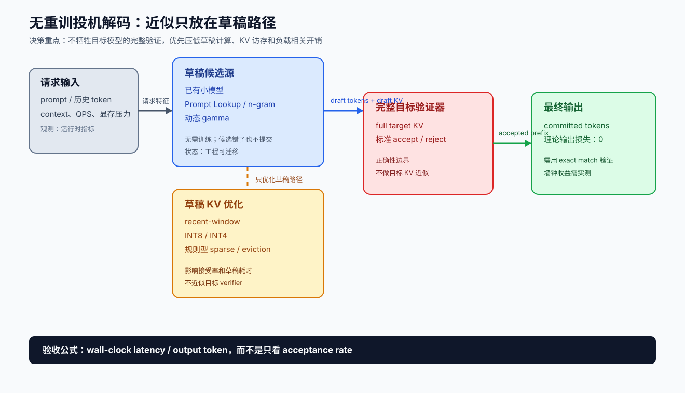

# 无重训投机解码与草稿 KV 方案评估

**日期：** 2026-09-20
**范围：** 目标模型和草稿模型权重均不重新训练；不使用 RL、蒸馏、adapter/head 训练或专门的多预算训练。允许使用已有的草稿模型，以及只发生在推理时的 KV 截断、量化、稀疏和调度。
**核心问题：** 在不改变目标模型最终输出的前提下，哪些投机解码和草稿 KV 优化可以迁移到 Qwen、Llama、DeepSeek 等新模型？

**不包含：** 本文不是某个固定版本 vLLM/SGLang 的源码审计，也没有把特定国产卡上的实测结果补写成论文结论；运行时接口、kernel 支持和硬件收益仍需在目标栈上验证。

> **关于文中的引用。** 文中 `路径:行号` 指向工作区里对应仓库的本地检出，`xxx.md:行号` 指向工作区的本地报告；站上没有这些文件、点不开，已按纯文本保留，已上线的姊妹报告则保留为可点击链接。

## 1. 执行结论

最适合第一阶段落地的组合是：

```text
已有小模型标准投机
  + Prompt Lookup / n-gram fallback
  + 动态 draft length（gamma）
  + 草稿 KV 最近窗口
  + 草稿 KV INT8（必要时远端 INT4）
  + QPS、显存和实测延迟感知的运行时控制器
```

这组方案不要求重新训练目标模型或草稿模型，也不要求 RL。只要目标模型验证使用完整 KV 和标准 accept/reject 规则，最终输出可以保持理论无损；草稿侧压缩主要影响接受长度、草稿耗时和墙钟延迟。

真正需要优化的指标不是接受率，而是：

```text
committed_tokens / (draft_ms + verify_ms + scheduling_ms)
```

建议把方案按以下顺序推进：

1. 先接入已有草稿模型、Prompt Lookup 和动态 `gamma`，建立墙钟基线。
2. 再做草稿 KV 最近窗口和 INT8，观察接受长度是否换来真实端到端收益。
3. 最后做规则型稀疏/eviction 和在线预算控制；暂不投入需要训练 adapter、head 或 RL 的方法。

## 2. 证据与状态标记

本文中的结论分为四类：

- **已证实：** 由原论文或标准算法直接支持。
- **工程可迁移：** 不依赖模型重训，理论上可接入新模型，但仍需要目标硬件上的实测。
- **论文结果不可直接迁移：** 论文有新模型数据，但实验包含训练组件，不满足本文边界。
- **待测：** 没有可比较的公开跨模型数据，必须由部署方建立 benchmark。

“精度损失”也分成两层：

- **最终输出损失：** 目标模型完整验证时，标准 speculative decoding 理论上为 0。
- **草稿质量损失：** KV 截断、量化、稀疏会降低接受率或平均接受 token 数，但不必然改变最终答案。

## 3. 方案总览

| 方案 | 不重训 | 新模型公开测试 | 迁移性 | 最终输出损失 | 主要代价 |
|---|---:|---|---|---|---|
| 已有小模型 + 标准投机 | 是 | 有早期 T5 结果；现代模型需自测 | 高 | 理论 0 | 草稿模型额外计算 |
| Prompt Lookup / n-gram | 是 | 有工程实现，缺少统一新模型横评 | 很高 | 理论 0 | 只适合重复性强的文本 |
| 动态 `gamma` / 自适应投机 | 是 | 公开数据不统一 | 很高 | 理论 0 | 需要在线控制器和遥测 |
| 草稿 KV 最近窗口 | 是 | 有长上下文论文，但常含训练组件 | 高 | 理论 0 | 接受率可能下降 |
| 草稿 KV 量化 | 是 | 工程实践较多，跨模型数据不统一 | 高 | 理论 0 | kernel、scale 和带宽适配 |
| 草稿 KV 稀疏 / token eviction | 是（规则版） | BudgetDraft 有结果，但其 drafter 经过训练 | 中高 | 理论 0 | 稀疏策略与 workload 相关 |
| 目标 KV → 草稿记忆投影 | 通常否 | 有论文结果，但通常训练 adapter | 低到中 | 取决于是否近似目标 KV | 训练和模型耦合 |
| 被拒后缀复用 | 通常否 | ReTrace 有结果，但需要训练模块 | 低到中 | 正确实现可无损 | 分支状态和额外逻辑 |
| Early exit / self-speculative | 部分 | 新模型结果多依赖 LayerSkip 类训练 | 中低 | 严格验证可无损 | 普通模型中间层草稿质量不稳定 |
| VAT / EAGLE / Medusa / BudgetDraft | 否 | 有 Qwen3、Llama3.1 等结果 | 不适用 | 不属于本文范围 | 需要训练权重或 head |

方案和数据流概览见下图。图中最重要的边界是：



所有可保留“最终输出无损”结论的方案，都把近似限制在草稿路径；目标 verifier 仍读取完整 KV。

## 4. 可直接落地的方案

### 4.1 已有草稿模型 + 标准投机解码

目标模型完整计算，草稿模型提出一段候选 token，目标模型并行验证。原始 Speculative Decoding 论文明确提出：可以在不修改、不重训目标模型的情况下加速，并在 T5-XXL 上报告约 2–3 倍加速且输出保持一致。

**状态：** 已证实；工程可迁移。
**新模型：** Qwen、Llama、DeepSeek 上的收益必须按 tokenizer、硬件和并发重新测；不能把 T5 数字直接外推。
**迁移条件：** 草稿和目标最好共享 tokenizer、特殊 token 约定以及停止条件。
**精度：** 标准 verifier 下理论输出损失为 0。
**主要风险：** 草稿 step 太慢、接受率低，或 QPS 较高时调度和 KV 访存抵消收益。

建议第一轮扫描：

```text
gamma = 3, 5, 7, 9
draft = 目标模型同系列的 0.6B / 1.7B / 4B 级已有模型
负载 = 代码、对话、长文档、结构化输出
```

### 4.2 Prompt Lookup / n-gram fallback

该方法不需要草稿模型，从 prompt 或已生成历史中查找重复片段，直接提出后续 token。它适合代码补全、JSON/XML/SQL、模板化文档、多轮 Agent 和重复文档抽取。

**状态：** 已证实算法性质；工程可迁移。
**新模型：** vLLM 等推理框架已有实现，但缺少覆盖 Qwen3、DeepSeek-V3/R1、Llama3.1 的统一公开横评。
**迁移性：** 很高，基本不依赖目标模型架构。
**精度：** 目标模型标准验证下理论输出损失为 0。
**限制：** 开放式自然语言或创造性写作的命中率可能很低，但可以作为草稿模型投机失败时的 fallback。

推荐把它做成组合式候选源：

```text
优先级 1：Prompt Lookup / n-gram
优先级 2：已有小模型 draft
优先级 3：普通 autoregressive decode
```

### 4.3 动态 `gamma` 与运行时投机控制器

固定每轮提出 5 或 8 个 token 并不适合所有请求。控制器可以根据最近接受长度、草稿耗时、目标验证耗时、QPS、batch size 和显存压力动态调整。

一个无需训练的初版策略：

```text
若最近 8 轮平均接受长度 > 4：gamma += 2
若最近 8 轮平均接受长度 < 1.5：gamma -= 2
若 speculative_step_time > autoregressive_step_time：关闭投机
若输入长度 / 预计输出长度 > 10：优先关闭或降级投机
```

**状态：** 工程可迁移。
**新模型：** 控制逻辑通用，但阈值必须在新模型和目标硬件上重标定。
**精度：** 不改变验证规则，理论输出损失为 0。
**价值：** 直接处理低 QPS 加速、高 QPS 变慢的负载拐点。

### 4.4 草稿 KV 最近窗口

只保留草稿模型最近的 KV，远端上下文丢弃或进入后续压缩层级；目标模型仍保留完整 KV。

建议扫描：

```text
recent_window = 256, 512, 1024, 2048
```

**状态：** 工程可迁移。
**新模型：** `Strong Drafts Need Compact Memories` 在 Llama-3.1-8B/70B 上有长上下文结果，但其记忆增强适配器包含训练组件，不能把论文加速数字直接当作无训练结果。
**迁移性：** 高。
**精度：** 完整 verifier 下最终输出理论无损；接受长度下降幅度待测。
**推荐：** 最近窗口保持 FP16/BF16，远端部分再做 INT8/INT4 或稀疏化。

### 4.5 草稿 KV 量化

只压缩草稿 KV，目标模型 KV 保持原精度。可按风险从低到高推进：

1. K/V 都使用 INT8。
2. 最近窗口保持 FP16，远端 KV 使用 INT8。
3. 最近窗口 FP16、远端 KV INT4。
4. 仅对中间层量化，前后层保持高精度。

**状态：** 工程可迁移。
**新模型：** 公开工程实践较多，但不同模型、kernel 和硬件之间没有统一数字。
**精度：** 目标 verifier 完整时最终输出理论无损；接受率可能下降。
**关键指标：** 不要只测 perplexity，应同时测 `accepted_tokens`、`committed_tokens/s`、端到端墙钟和显存峰值。

## 5. 可做但需要更谨慎的方案

### 5.1 规则型草稿 KV 稀疏 / token eviction

可以使用最近 token、标点、实体、代码结构 token 或 attention score 做规则型保留，不重新训练重要性预测器。

BudgetDraft 在 4K、8K、16K 上报告过 6.55×、4.46×、2.10× 端到端加速，但其核心是多预算训练。因此，这组结果只能证明“预算鲁棒训练有效”，不能证明未经训练的稀疏 KV 能获得同样收益。

**状态：** 规则版符合本文范围；论文数字不可直接迁移。
**新模型：** 有长上下文论文实验，但不是严格的 inference-only 证据。
**精度：** 完整 verifier 下理论输出无损；稀疏策略造成的接受率变化待测。
**建议：** 先做固定预算、最近窗口优先，再做按层/按头差异化预算。

### 5.2 Early exit / self-speculative

让同一模型的浅层先草拟、完整模型再验证，可以省掉独立草稿模型，但普通模型的中间层通常没有被训练成可靠的语言模型。LayerSkip 等新模型结果通常依赖专门训练的 early-exit 能力。

**状态：** 部分符合，但不建议作为第一阶段主线。
**新模型：** 公开新模型数据多依赖训练，不可直接迁移。
**精度：** 严格验证可保持最终无损，但浅层候选质量可能导致几乎没有有效加速。
**迁移性：** 中低。

## 6. 不属于“无重训”范围的论文方法

| 方法 | 排除原因 | 可借鉴部分 |
|---|---|---|
| VAT | 训练验证头和验证自适应权重 | 把墙钟而非接受率作为训练/评估目标 |
| EAGLE | 需要训练草稿头或草稿模块 | 草稿与验证器的目标错配分析 |
| Medusa | 需要训练多个 decoding heads | 多头候选的并行验证组织方式 |
| BudgetDraft | 需要多预算训练 | 稀疏/full KV 错配的诊断方法 |
| Compressed Draft KV | 记忆适配器通常需要训练 | 最近上下文精确保留、远端记忆压缩 |
| ReTrace | 需要训练被拒后缀复用模块 | 跨轮复用被拒分支状态的思路 |
| 目标 KV 压缩 | 通常需要校准或训练 | 目标 KV 和草稿 KV 的边界要严格分开 |

这些方法可以作为后续训练路线，但不能把其新模型实验结果当成“零训练迁移证明”。

## 7. 精度和无损性验证口径

### 7.1 Greedy 输出一致性

固定 tokenizer、采样参数和停止条件，逐 token 比较：

```text
baseline = 目标模型普通 autoregressive decode
test     = 投机方案 + 完整目标 verifier
metric   = exact token match / first divergence position
```

标准实现目标应为 100% token-level match。若出现差异，优先检查 verifier、随机数消耗、EOS 处理和 KV 位置编码，而不是先归因于草稿 KV 压缩。

### 7.2 Sampling 分布一致性

随机采样不一定在相同 seed 下逐 token 相同，但标准 speculative sampling 的目标是保持目标分布。建议比较：

- token 分布 KL 或 TV distance；
- 任务级准确率、pass@k、格式合法率；
- 安全拒答率和工具调用成功率。

### 7.3 效率指标

至少记录：

```text
average accepted tokens
committed tokens per round
draft latency / verify latency / prefill latency
wall-clock latency per output token
TTFT、ITL、吞吐、显存峰值
QPS 拐点和关闭投机后的回退成本
```

## 8. 推荐 benchmark 矩阵

### 模型

- Qwen3：目标模型与同系列小草稿模型。
- Llama-3.1：8B/70B 组合，用于和已有论文结果对照。
- DeepSeek-V3/R1：重点观察 MoE、长上下文和国产卡上的调度拐点。

### 负载

- 代码补全：适合 Prompt Lookup 和重复 token。
- 结构化输出：JSON、SQL、工具调用。
- 长文档问答/摘要：检验草稿 KV 远端依赖。
- 多轮 Agent：检验前缀重复、分支和低 QPS。
- 开放式对话：作为低重复率对照组。

### 变量

```text
context = 4K, 8K, 16K, 32K
QPS     = 1, 2, 4, 8, 16
gamma   = 3, 5, 7, 9
KV      = full, recent-window, INT8, INT4, sparse
```

## 9. 最终决策

如果目标是近期在新模型和国产硬件上交付，建议选择：

```text
P0：标准投机 + Prompt Lookup + 动态 gamma + QPS 自动开关
P1：草稿 KV 最近窗口 + INT8 + 规则型稀疏
P2：只有在 P0/P1 的墙钟收益成立后，才评估训练型 adapter/head 方法
```

验收标准不应写成“接受率提升多少”，而应写成：

1. Greedy token-level exact match 为 100%。
2. 目标任务指标与 baseline 无统计显著下降。
3. 在目标 QPS 区间，端到端墙钟延迟有稳定收益。
4. 记录草稿 KV 每 MB 带来的 committed token 增益。
5. 高并发或长输入短输出时，控制器能自动关闭或降级投机。

## 10. 参考资料

- [Fast Inference from Transformers via Speculative Decoding](https://arxiv.org/abs/2211.17192)
- [Strong Drafts Need Compact Memories: Long-Context Speculative Decoding with Compressed KV Cache](https://arxiv.org/abs/2608.30252)
- [BudgetDraft: Acceptance-Aware Multi-View Training for Sparse-KV Speculative Decoding](https://arxiv.org/abs/2606.00144)
- [用户提供的 HyperAI 文章](https://mp.weixin.qq.com/s/fQy3XbcuVMtwLfKonykgbw)

本文没有把论文摘要中的加速数字当作目标硬件上的保证；凡是包含训练组件的论文结果，都在正文中标注为“不可直接迁移”。

## 11. MTP/DSpark 草稿 KV 容量与动态回滚

本节补充当前 `vllm-ascend-review` 源码的实现分析，源码版本固定为 `4c5ee33208b6808625c5994f9d45bfd4705e8dfc`。这里讨论的是 attention draft KV；KDA/GDN/Mamba 的 recurrent state 需要单独的 snapshot/restore 或重放，不能只靠长度回退。

### 11.1 不要把 `K` 直接理解成 `K` 倍 KV

需要分开计算三件事：

1. 草稿模型已经积累的历史 KV。
2. 当前 speculative round 新增的临时 KV。
3. 物理 block allocator 为临时 token 增加的容量。

GQA 每层每 token 的逻辑 KV 大小约为：

```text
B_token/layer = 2 × num_kv_heads × head_dim × dtype_bytes
```

MLA/DSA 草稿层通常按压缩 latent KV 计算：

```text
B_token/layer = (kv_lora_rank + qk_rope_head_dim) × dtype_bytes
```

例如，假设一个三层 BF16 GQA DSpark：

```text
num_kv_heads = 8, head_dim = 128
B_token      = 3 × 2 × 8 × 128 × 2 = 12 KiB
K = 7        = 84 KiB 的本轮逻辑增量 / request
32K context  ≈ 384 MiB 的历史 draft KV / request
```

假设一个三层 BF16 MLA/DSA DSpark：

```text
kv_lora_rank = 512, qk_rope_head_dim = 64
B_token      = 3 × (512 + 64) × 2 = 3.375 KiB
K = 7        ≈ 23.6 KiB 的本轮逻辑增量 / request
32K context  ≈ 108 MiB 的历史 draft KV / request
```

以上是跨 TP/CP 前的逻辑量；实际单卡容量还要按本地 `page_size_bytes`、KV head 分片/复制、padding 和混合 cache group 修正。DSpark 只为 draft attention 层建立 draft KV group，而不是复制目标模型所有层：`vllm_ascend/spec_decode/dspark_proposer.py:132`、`vllm_ascend/models/deepseek_v4/dspark.py:169`。

### 11.2 物理 block 增量

令：

```text
L = 当前已提交 token 数
K = 本轮最大 draft token 数
b = KV block size
```

本轮新增物理 block 数约为：

```text
delta_blocks = ceil((L + K) / b) - ceil(L / b)
```

草稿侧物理容量近似为：

```text
delta_bytes = delta_blocks ×
              sum(page_size_bytes of draft layers)
```

因此 `K=7` 并不必然产生 7 个新 block。当前 block 尚有空间时可能没有新增物理 block；跨越边界时通常只增加一个 block。MTP 额外申请的 `slot_mapping` 元数据与真正的 KV 数据也应区分，前者在 `BlockTable` 中按 `num_speculative_tokens - 1` 扩展：`vllm_ascend/worker/block_table.py:94`。

### 11.3 MTP 与 DSpark 的容量差异

MTP 通常不是一个完整的小模型，而是少量额外 MTP attention layer。其 draft KV 量近似为：

```text
MTP KV ≈ 额外 MTP 层数 × 每层 KV/token × 实际写入 token 数
```

所以常见的 `num_speculative_tokens=1` MTP 配置，增量可能只有一层一个 token 的大小；不能按“目标模型完整 KV 的一份副本”估算。具体要以实际 `draft_attn_layer_names` 和每层 KV spec 为准。

### 11.4 快速回滚：只回退逻辑长度

推荐的状态模型是：

```text
committed_len   已被 target 接受的长度
tentative_len   draft 已写入的长度
base_len        本轮开始前的 committed_len
```

一轮执行：

```text
base_len = committed_len
draft    写入 `vllm_ascend/spec_decode/dspark_proposer.py:287`、`vllm_ascend/spec_decode/dspark_proposer.py:308`。异步调度则通过 `rejected = prev_drafts + 1 - valid_count` 修正乐观长度：`vllm_ascend/spec_decode/utils.py:55`、`vllm_ascend/spec_decode/utils.py:76`。

物理 block 只回收完全落在新 `committed_len` 之后的尾部 block。最后一个部分使用的 block 保留并在下一轮覆盖；含 rejected token 的 block 不得发布为 prefix-cache 命中。

### 11.5 动态 `K` 与动态回滚不是一回事

当前 DSpark 动态机制主要是“先最多生成 `K` 个 draft，再按 confidence 只验证其中一个 prefix”，因此主要节省 target verify 计算，不一定节省 draft forward 或 draft KV 写入：`docs/source/user_guide/feature_guide/speculative_decoding.md:578`、`docs/source/user_guide/feature_guide/speculative_decoding.md:593`。

如果要连草稿 KV 也动态节省，需要在 draft forward 之前得到每个 request 的 `k_i`，再按 `k_i` 压缩 `query_start_loc`、`slot_mapping` 和 tentative block 申请。工程上建议先使用固定 bucket：

```text
k_i ∈ {1, 3, 5, 7}
```

这样可以控制 graph/kernel shape 数量。第一版建议固定最大 `K`、使用逻辑长度回滚；第二版再做 bucket 化动态申请。当前 DSpark proposer 的 query block 仍按 `num_speculative_tokens` 构造：`vllm_ascend/spec_decode/dspark_proposer.py:39`。

### 11.6 草稿 KV 更值得做的优化

对于长上下文，减少历史 draft KV 通常比减少一轮 5–7 个临时 token 更有价值。DSpark 可以启用 draft-only sliding window：目标模型继续读取完整上下文，draft attention 只读取最近窗口，因此最终输出边界不变。当前实现通过裁剪 draft block table 和 `seq_lens`，但保留绝对位置 slot mapping：`docs/source/developer_guide/Design_Documents/speculative_kv_sliding_window.md:1`、`vllm_ascend/spec_decode/utils.py:83`。

建议顺序：

1. 固定最大 `K`，逻辑长度回滚，不做 KV 拷贝恢复。
2. 先把 draft KV 压到 512/1024/2048 token window，比较墙钟和接受长度。
3. 再做 `{1,3,5,7}` bucket 化动态 `K`，避免任意变长破坏 graph 和 batch packing。
4. 若模型包含 KDA/GDN/Mamba state，再单独设计 state snapshot/replay，不能把 attention KV 的方案直接复用。
