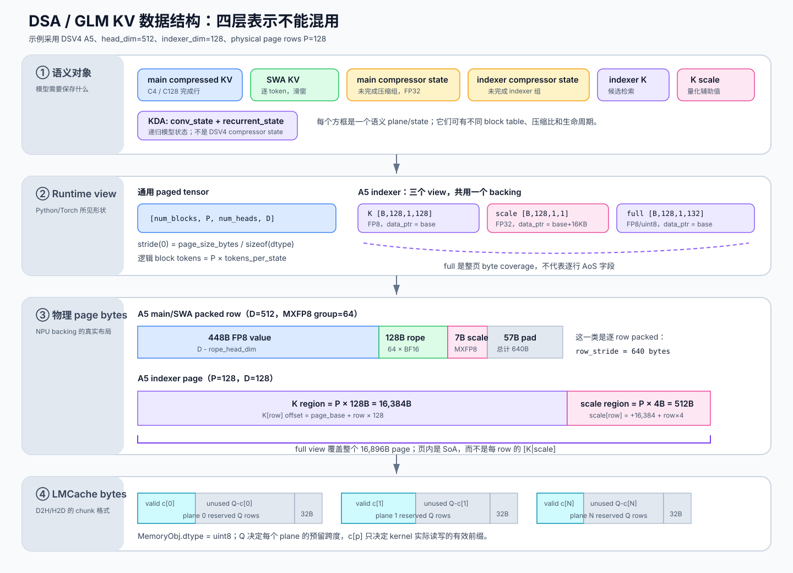
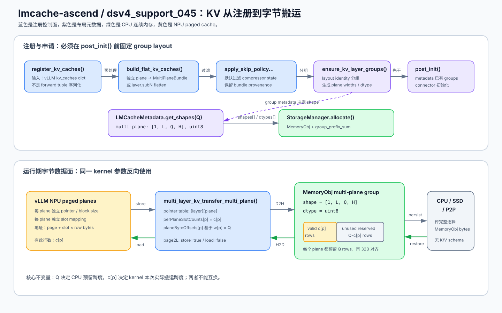
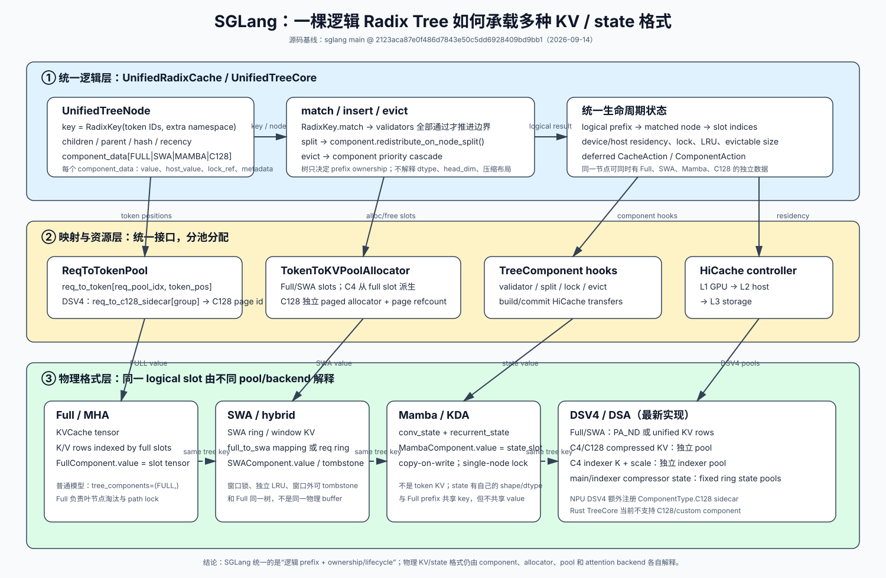

# DSV4 / GLM DSA KV 格式与 LMCache-Ascend `dsv4_support_045` 传输链路分析

> 分析日期：2026-09-15（Asia/Shanghai）
> 范围：DeepSeek V4 DSA、GLM 的 SFA/DSA 路径、GLM-5.3-Flash/GLM5Next 扩展，以及 vLLM-Ascend 到 LMCache/LMCache-Ascend 的申请、布局、拷贝和持久化。LMCache 部分以 `lmcache-ascend/origin/dsv4_support_045`（`1452551d`）为主，`main` 仅作能力差异对照。

## 1. 结论先行

1. **DSA 不再是简单的 `(K, V)`。**
   - GLM/DeepSeek-V3.2 风格 SFA 通常是主 MLA `(latent/nope, rope)`，再加独立 indexer K；启用 C8 后再加 indexer scale。
   - DeepSeek V4 每个稀疏层在 forward 时聚合成 6 项，A5 为 7 项：主压缩 KV、SWA KV、主 compressor state、indexer compressor state、indexer K、indexer scale，以及 A5 的 full packed view。

2. **“逻辑 token 数”与“物理存储行数”分离。**
   - scheduler 的 `block_size` 仍表示原始 token 空间。
   - NPU cache tensor 的第二维是 `storage_block_size = block_size / compress_ratio`。
   - C4 每 4 个原始 token 形成一行，C128 每 128 个原始 token 形成一行；因此不同 plane 不能共用一条按 token 展开的 slot mapping。

3. **A5 量化布局进一步改变了 cache 的字节语义。**
   - 默认主 attention KV 的 runtime tensor dtype 是 FP8，但一个 640-byte row 内实际混合保存 FP8 value、BF16 RoPE bytes、MXFP8 scale 和 padding。
   - indexer K 使用 FP8，scale 使用 FP32。
   - A5 BF16 模式则主 attention KV 回到 BF16，但 indexer 仍可保持独立的 FP8 + FP32 scale。

4. **vLLM-Ascend 先申请一维 `int8` backing，再构造 typed/as-strided view。**
   - block 间 stride 使用 padded page bytes，block 内仍是紧凑的逻辑 tensor。
   - DSV4 多 descriptor 可别名到同一大 backing。
   - C8 indexer K 与 scale 放进同一 allocation 的不同 offset，减少 HCCL/Mooncake 注册次数。
   - A5 的 indexer full view 与 K/scale view 重叠，不能当成三份独立数据重复外存。

5. **DSV4 forward tuple 不是 LMCache wire/storage format。**
   - forward tuple 是算子调用接口。
   - LMCache-Ascend 的 DSV4 分支按 scheduler group/plane 展平或 bundle，再 gather 成 token/chunk 连续的 CPU `MemoryObj`。
   - 对 `MULTI_PLANE_KV`，设 LMCache chunk 有 `Q` 个逻辑 token，则**每个 plane 都预留 `Q` 行**：`[plane0 的 Q-row reserved block | plane1 的 Q-row reserved block | ...]`。压缩比只决定实际写入的有效行数 `c[p]`，不缩小 plane 的预留区。

6. **版本上存在明确断层。**
   - 当前 `LMCache-Ascend/main` 固定依赖 LMCache `v0.4.4`，只具备传统 MLA/DSA 三元组路径。
   - 完整 DSV4 multi-group/multi-plane 支持位于只读远端分支 `origin/dsv4_support_045`，尚未进入当前 main。
   - 最新 `LMCache/dev`、`LMCache-Ascend/main` 与该 DSV4 分支不能直接视为一个已经验证过的组合。

### 1.1 KV 数据结构总图：先分清四层表示

讨论“KV 格式”时，必须先说明是在说哪一层。DSV4/GLM 路径至少同时存在四种表示：



图中从上到下不是四份数据，而是同一批模型状态在四个边界上的不同表达。最容易出错的是把 forward tuple 当成物理页布局，或者把一个覆盖整页的 alias view 当成额外 payload。本文后续统一使用下面四层含义：

| 层次 | 代码中的载体 | 它回答的问题 | 不能据此推断什么 |
|---|---|---|---|
| 语义对象 | main KV、SWA KV、indexer K、compressor state、KDA state | 模型需要保留哪些历史信息 | tensor 是否连续、是否共用 backing |
| runtime view | `torch.Tensor` / tuple / `kv_caches` dict | 算子看到的 shape、dtype、stride、参数顺序 | tuple 成员是否都是独立 allocation |
| NPU 物理页 | raw `int8` backing + typed `as_strided` views | HBM 中真正的 byte offset、page stride、padding、alias | LMCache CPU chunk 的排列方式 |
| LMCache payload | CPU `MemoryObj` / SSD raw bytes | D2H/H2D 和持久化时怎样连续打包 | NPU 上原来的 tensor shape/stride |

一句话概括：

```text
forward tuple ≠ allocator cache entry ≠ NPU page bytes ≠ LMCache wire bytes
```

本文所说的 **plane（数据面）**，是“一类可以独立寻址的 cache 字段集合”：它拥有自己的 tensor/view、shape、dtype、压缩比、物理 row 和 slot mapping。plane 不是数学上的二维平面，也不等价于 allocation；两个 plane 可以分别申请内存，也可以只是同一 backing 上不同 offset/dtype 的 view。

例如 DSV4 中可以同时存在：

| plane | 保存内容 | 一个物理 row 代表的原始 token 数 |
|---|---|---:|
| SWA plane | 滑窗 KV | 1 |
| C4 main plane | 主 compressed KV | 4 |
| C128 main plane | 主 compressed KV | 128 |
| indexer K plane | 候选检索 K | 通常为 4 |
| indexer scale plane | indexer K 的量化 scale | 与 indexer K 的 row 一一对应 |

假设 scheduler 的逻辑 token 范围是 `0~127`：

```text
原始 token/SWA plane:
  slot 0, slot 1, slot 2, ... slot 127       # 128 个物理 row

C4 plane:
  row 0  <- token 0~3
  row 1  <- token 4~7
  ...
  row 31 <- token 124~127                    # 32 个物理 row

C128 plane:
  row 0 <- token 0~127                       # 1 个物理 row
```

所以“不同 plane 不能共用一条按 token 展开的 slot mapping”的准确含义是：普通 token/SWA plane 需要 128 个目标 slot，C4 plane 只需要 32 个 compressed slot，C128 plane 只需要 1 个 compressed slot。这里的 slot 是“一次 cache row 写入的目标地址编号/坐标”，不是 allocation、page 或额外数据副本；完整定义和数值例子见 8.1。每个 compressor 必须在压缩组完成时，为自己的输出 plane 生成独立的 `compress_slot_mapping`。

还要区分 plane 与 alias view：indexer K 和 indexer scale 是两个 plane，因为它们有不同 dtype、字段语义和读写地址；A5 `full view` 只是覆盖 K+scale backing 的整体解释视图，没有新增数据和独立生命周期，因此不应算作第三份 payload plane。

#### 1.1.1 通用 NPU paged tensor 结构

Ascend DSA/MLA cache 最常见的 runtime shape 是：

```text
[B, P, H, D]
```

其中：

| 符号 | 含义 |
|---|---|
| `B` | 该 scheduler/cache group 的物理 block 数 |
| `P` | 每个物理 page 中真正存储的 row 数，即 `storage_block_size` |
| `H` | KV head 数；本文涉及的 MLA、DSV4 indexer 通常为 1 |
| `D` | 一个 row 的逻辑元素数；不一定等于原始模型 head dimension |
| `r` | `tokens_per_state`/旧名 `compress_ratio`，一个物理 row 代表的原始 token 数 |

`B` 和 `P` 的关系可以直接看成二维数组的两个轴：

```text
cache.shape = [B, P, H, D]
                  │  │
                  │  └─ 一个 page/block 内的物理 row 数
                  └──── page/block 的总数
```

注意这里的 `B` 不是推理 batch size，而是该 cache group 实际申请的 physical block/page 数；多个请求通过 block table 共享这批 page。DCP replication 时，indexer 可能表现为 `B×g` 个 page，而主 MLA 仍按自己的 `B` 计算。

因此：

```text
总物理 row 数       = B × P
每个 page 的 payload = P × H × D × sizeof(dtype)
整个 cache 的 payload = B × P × H × D × sizeof(dtype)
```

在压缩 plane 中，如果一个物理 row 代表 `r` 个原始 token，则这块 cache 的逻辑覆盖量是：

```text
逻辑 token 覆盖量 = B × P × r
```

例如 `B=100`、`P=128`：

```text
物理 row 总数 = 100 × 128 = 12,800

未压缩/SWA（r=1）  -> 覆盖 12,800 个 token
C4（r=4）         -> 覆盖 51,200 个 token
C128（r=128）     -> 覆盖 1,638,400 个 token
```

这里的 `P` 是 runtime tensor 第二维实际采用的 page row 数；源码中有时把 scheduler 看到的逻辑 token block 也叫 `block_size`。对压缩 cache，二者不一定相同：scheduler 的逻辑 block 通常覆盖 `P×r` 个 token，而 tensor 的第二维仍只有 `P` 行。不要把 `B×P` 误读成“只能缓存 B×P 个原始 token”；是否还要乘 `r` 取决于该 plane 是否压缩。

### Block table：请求的逻辑块如何找到物理 page

`block_table` 是一个二维整数表，通常形状为：

```text
[num_requests, max_num_blocks_per_request]
```

它的每一行对应一个请求，每一列对应该请求的一个**逻辑 block**；表中元素是实际分配到的**物理 block/page ID**：

```text
block_table[request_id, logical_block_id] = physical_block_id
```

例如，假设 cache `block_size=4`，某请求长度为 10，内存管理器把它的三个逻辑 block 分配到了物理 page `7、2、11`：

```text
逻辑 token:       0  1  2  3 | 4  5  6  7 | 8  9
逻辑 block:       0          | 1          | 2
block_table 行:   7          | 2          | 11
```

#### 不同请求长度不同时，block table 如何保持二维矩形

会有空余列。`block_table` 不是 ragged list，而是按运行上限预分配的固定宽度 buffer：

```text
shape = [max_num_reqs, max_num_blocks_per_req]
```

每行只有前 `num_blocks_per_row[request_id]` 项有效。假设 `block_size=4`，当前三个请求分别有 10、3、17 个 token，则分别需要 `ceil(10/4)=3`、`ceil(3/4)=1`、`ceil(17/4)=5` 个逻辑 block。若当前表宽为 5，可以表示成：

```text
                 logical block column
request 0:      [ 7,  2, 11,  _,  _ ]    valid_blocks = 3
request 1:      [ 4,  _,  _,  _,  _ ]    valid_blocks = 1
request 2:      [ 9,  6,  1, 13,  8 ]    valid_blocks = 5
```

这里 `_` 表示 **无效/未使用的表格单元**。底层 tensor 中它当然仍占一个 `int32` 位置，但没有对应新分配的物理 page。vLLM 的 `BlockTable` 同时保存固定二维 buffer 和 host 侧 `num_blocks_per_row`；`append_row()` 只向有效前缀写入 block ID 并更新该计数，见 `vllm/v1/worker/block_table.py:79-85`、`:114-140`。

必须注意，`_` **不等价于某个可靠 sentinel 值**：

- buffer 创建及整表清理时初始化为 0，见 `vllm/v1/utils.py:121-137` 和 `vllm/v1/worker/block_table.py:187-190`；
- 行被复用或从较长请求换成较短请求时，未覆盖的后缀在某些更新路径中可能保留旧 block ID；
- 因此不能扫描一行直到遇到 0 来推断有效长度，因为 physical block 0 本身也可能是合法 page。

正确性依赖的是“只访问有效列”：

```text
有效 block 数 = ceil(request_effective_seq_len / block_size)
本次 token 的 logical_block = position // block_size
只要 position < request_effective_seq_len，logical_block 就位于有效前缀
```

生成写入 slot 时，kernel 按每个请求的 `query_start_loc` 只遍历其本次 token，并用 token `position` 算出要读的 block-table 列；batch/ACLGraph 补齐出来的 token slot 使用 `PAD_SLOT_ID`，见 `vllm/v1/worker/block_table.py:153-182`、`:346-409`。attention 读取历史 KV 时则同时接收 `seq_lens`/`seqused_kv`，不会把表尾当作真实历史；DSA 调用把 `common_metadata.seq_lens` 作为 `seqused_kv` 传入，见 `vllm_ascend/attention/dsa_v1.py:2136-2142`、`:2209-2216`。对整个 padding request 行，Ascend 还会显式将其 block table 清零，见 `vllm_ascend/attention/dsa_v1.py:1062-1068`。

还要区分两种不同的“浪费”：

| 空余位置 | 是否占用真实 KV page | 含义 |
|---|---:|---|
| block-table 行尾未使用列 | 否 | 只占固定 metadata tensor 中几个 `int32` 单元 |
| 请求最后一个未填满 block 的页内空位 | 是 | 已分配完整物理 page，但最后若干 token row 暂未使用 |

例如长度 10、`block_size=4` 的请求需要 3 个物理 page；第三页只使用 token offset 0、1，offset 2、3 暂时空闲。后续 decode token 11、12 可以继续填满同一页，所以这是 page 粒度分配带来的内部碎片，最大不足一个 block，而不是 block-table padding 额外申请出来的 page。

token `t` 的普通 paged slot 计算为：

```text
logical_block = t // block_size
offset        = t %  block_size
physical_block = block_table[request_id, logical_block]
slot           = physical_block × block_size + offset
```

这就是“逻辑连续、物理可分页”：请求看到的 token 仍是 `0,1,2,...`，但它们实际可以散落在 HBM 的 page `7、2、11` 中。vLLM 的 `BlockTable` 将表存成 `int32` buffer，见 `vllm/v1/worker/block_table.py:114-121`；Ascend 的 SWA/普通 paged 路径也按 `block_id × block_size + offset` 生成 slot，见 `vllm_ascend/attention/dsa_v1.py:454-466`。

对于 DSV4，`block_table` 仍然表达“请求逻辑 block -> 该 cache group 的物理 block”关系，但它不是所有 plane 共用的最终 row 地址。SWA 可直接使用 token slot；C4/C128 compressor 则在压缩组完成后，根据自己的 `compress_ratio` 和 metadata，把逻辑 block/位置转换成 compressed plane 的 `compress_slot_mapping`。因此同一请求可能有：

```text
SWA KV block_table   -> original-token KV row slot（r=1）
C4 block_table/映射  -> C4 compressed row slot
C128 block_table/映射 -> C128 compressed row slot
indexer block_table  -> indexer K row slot
```

这些表在逻辑上可以共享 block ID，但每个 plane 的 row 数、压缩比和有效长度不同；`block_table` 负责找到 page，plane-specific slot mapping 负责找到 page 内真正写入的 row。

#### SWA 是滑窗，为什么仍然有 block table；它是不是 state

`SWA` 确实是 **Sliding Window Attention**。这里的 `SWA KV block_table` 指向的是**滑动窗口 attention 使用的逐 token KV cache**，不是 compressor state：

```text
新 token
  -> 生成该 token 的 latent/nope + RoPE KV
  -> 用普通 token slot 写入 SWA KV row
  -> attention 通过 SWA block table 找到最近窗口内的 KV rows
```

窗口是“哪些历史 token 仍可见/需要保留”的策略，并不把多行 KV 压缩成一个递归 state。SWA KV 仍然保持一 token 一 row 的可随机寻址历史，所以需要 block table 把请求的逻辑 token page 映射到物理 page。DSV4 为它创建独立的 `AscendDeepseekV4SWACache`，其 cache spec 是 `AscendSlidingWindowMLASpec(sliding_window=window_size)`，见 `vllm_ascend/models/deepseek_v4/model.py:119-140`、`:618-625`。

运行时也能直接看到它是 KV：当前 token 的 `kv` 通过 `dsa_kv_compress_scatter(swa_kv_cache, kv, slot_mapping)` 逐行写入，见 `vllm_ascend/attention/dsa_v1.py:1976-1989`；attention 将它作为 `ori_kv`，并把 `swa_req_metadata.block_table` 作为 `ori_block_table`，再用 `ori_win_left/right` 限制滑窗可见范围，见同文件 `:2201-2223`。

它与 compressor state 的差别是：

| 对象 | 保存内容 | 更新/读取方式 | 是否逐 token 可寻址 |
|---|---|---|---:|
| SWA KV | 最近窗口内每个 token 的 KV | token slot scatter；attention 按窗口读取多行 | 是 |
| compressor state | 当前尚未凑满 C4/C128 组的 KV/score accumulator | compressor 原地读写；组完成后产出一行 compressed KV | 否 |
| KDA recurrent state | 线性注意力递推矩阵/卷积尾部 | 每步递推更新 | 否 |

为什么容易混淆：`AscendCompressorStateCache.get_kv_cache_spec()` 为了复用 vLLM 的 bounded/paged cache 调度接口，也返回 `AscendSlidingWindowMLASpec`，见 `vllm_ascend/models/deepseek_v4/compressor.py:45-72`。但这只是 **cache spec/allocator 机制复用**，不能据此把 compressor state 当成 SWA attention KV。真正的语义要看持有者和消费者：SWA cache 被 attention 当作 `ori_kv`；state cache 被 `torch.ops._C_ascend.compressor` 作为 `state_cache` 和 `state_block_table` 读写，见 `compressor.py:193-224`。

因此严格术语是：**SWA KV 也是模型运行状态的一部分，但它不是本文所说的 state plane。** 本文把“state plane”专门留给 compressor/KDA 这类递推或未完成分组状态。

#### `indexer block_table -> indexer K row slot` 中的 indexer 是什么

这里的 indexer 是稀疏 attention 前面的**候选检索器**。它不保存完整 attention value，也不直接产生最终 attention 输出；它用一个较小的 query/key 表示从长历史中选出 top-k 候选位置，主 sparse attention 再根据这些位置读取 main KV：

```text
当前 hidden state
  ├─> indexer query Q_i [T, N_i, D_i]
  │       × 历史 indexer K cache [compressed_rows, 1, D_i]
  │       -> top-k historical indices
  │
  └─> 主 attention query
          + 按 top-k indices 读取 main compressed KV
          + 按 sliding window 读取 SWA KV
          -> sparse attention output
```

把容易混在一起的三个对象拆开看：

```text
DeepseekV4Indexer（计算模块）
  ├─ wq_b:         当前 token -> indexer Q [T,64,128]
  ├─ weights_proj: 当前 token -> head weights [T,64]
  └─ compressor:   每 4 个原始 token -> 1 个 indexer K row

indexer cache（真正保存的历史数据）
  ├─ compressor state: 未凑满 C4 的中间状态
  ├─ K:               [B_i,P_i,1,128] FP8
  ├─ scale:           [B_i,P_i,1,1] FP32
  └─ full:            [B_i,P_i,1,132] FP8 byte-coverage alias

indexer block_table（地址翻译表，不含 K payload）
  shape = [active_requests, max_logical_indexer_blocks]
  cell  = physical indexer page ID
  作用  = request 的逻辑 C4 历史块 -> K/scale cache 的物理 page
```

所以“`indexer block_table -> indexer K row slot`”不是说 block table 里面装着 indexer K。block table 只给出物理 page ID；再结合 page 内 row offset 才得到 `indexer_slot`，最后用该 slot 分别寻址 K view 和 scale view。`DeepseekV4Indexer` 中 `wq_b`、`weights_proj` 和 `k_cache` 的构造见 `vllm_ascend/models/deepseek_v4/indexer.py:285-329`，query reshape 和 weights 生成见同文件 `:666`、`:722`。

DSV4 的典型维度是：

```text
T   = 本次 forward 中展平后的 query token 总数
N_i = 64       # indexer query heads
D_i = 128      # 每个 query/key 的检索维度
历史 K heads = 1
```

`T` 不是历史序列长度，也不是 cache 中已有的 row 数；它是这一次模型调用实际送入 indexer 的新 query token 数。prefill/chunked-prefill 时，`T` 是本批各请求本次处理 token 数之和；常规 decode 每个请求通常贡献 1 个 token，所以 `T` 通常等于本轮活跃请求数；speculative decode 等一次请求可贡献多个 query token 的路径中，`T` 也会相应增大。例如两个请求本轮分别处理 3 和 2 个 token，则展平后 `T=5`，indexer Q shape 为 `[5,64,128]`。

因此每个 query token 会形成 `[64,128]` 的多头 query，但 cache 中不是为 64 个 query head 各存一份 K；历史 indexer K 是 MQA 风格的 `[1,128]`，供全部 query heads 共享。`DeepseekV4Indexer` 将展平 token 维 reshape 为 `[T, n_heads, head_dim]`，见 `vllm_ascend/models/deepseek_v4/indexer.py:650-676`；indexer cache spec 则明确使用 `num_kv_heads=1`、`head_size=head_dim`，见同文件 `:99-139`。

##### DSV4 C4 indexer 的 cache 数据结构

DSV4 只在 C4 attention layer 上创建 indexer，见 `vllm_ascend/models/deepseek_v4/model.py:548-616`。其持久 cache 和运行中 state 是两类对象：

```text
indexer compressor state
  暂存尚未凑满 4 个原始 token 的 accumulator

每完成 4 个原始 token
  -> 产生一个 128-d indexer K row
  -> A5 量化为 128 B FP8 K + 4 B FP32 scale
  -> 按 indexer_slot_mapping 写入 indexer K/scale plane
```

A5 上逻辑 view 为：

```text
indexer K:      [B_i, P_i, 1, 128]  FP8
indexer scale:  [B_i, P_i, 1,   1]  FP32
indexer full:   [B_i, P_i, 1, 132]  FP8 byte-coverage alias

compress_ratio = 4
P_i            = 128 时，一个物理 page 覆盖 128×4 = 512 个原始 token
```

为什么 indexer compressor state 是 C4：DSV4 只在 `compress_ratio == 4` 的 attention layer 创建 `DeepseekV4Indexer`，并把同一个 ratio 传给 indexer，见 `vllm_ascend/models/deepseek_v4/model.py:594-616`。Indexer 随后创建自己独立的 `Compressor(compress_ratio=4, head_dim=128)`，见 `vllm_ascend/models/deepseek_v4/indexer.py:323-343`。所以这里不是“所有 indexer 天生都是 C4”，而是“当前 DSV4 的 indexer 只挂在 C4 layer 上，它自己的 K 也按 4 token 一组生成”。

如果一次 forward 或一个请求边界停在组内，例如只到达这一组的第 1、2 或 3 个 token，最终的 indexer K row 还不能产生。indexer compressor state 保存这部分未完成组的 `kv_state + score_state` accumulator；第 4 个 token 到达后，compressor 才输出一行 128-d K，并返回该行的 `slot_mapping`。它不是把 1～3 个原始 K 简单拼起来。对 indexer 的 `head_dim=128`，C4 令 `overlap=True`、`coff=2`，因此 state 宽度为 `2×2×128=512` 个 FP32 元素，见 `vllm_ascend/models/deepseek_v4/compressor.py:113-125`、`:154-163`。

`K` 与 `full` 的关系可以直接按一个 `P_i=128` 的 A5 indexer 物理 page 看：

```text
同一个 16,896-byte page allocation

page_base + 0
  ├─ K 区:     128 rows × 128 B FP8 = 16,384 B
  │             K view = [128,1,128]
  └─ scale 区: 128 rows ×   4 B FP32 =    512 B
                scale view = [128,1,1]
page_base + 16,896

full view:
  从 page_base 开始覆盖全部 16,896 B
  shape 写成 [128,1,132] FP8，只为表达 128×(128+4) B 的整页覆盖范围
```

- `K` 是真正供 lightning indexer 查询的**逻辑 key 视图**。其中每个 `[1,128]` row 是 4 个原始 token 压缩后得到的检索 key；它不是主 MLA 的 latent/nope/rope KV。
- `scale` 是与每个 K row 配套的一个 FP32 反量化 scale。读取 top-k 时，算子分别接收 `key_cache` 和 `scale_cache`，见 `vllm_ascend/models/deepseek_v4/indexer.py:209-238`。
- `full` 不是另一份“完整 K”，也不是第三份 payload。它与 K/scale 重叠同一个 backing，从 page base 覆盖 K 区和 scale 区的全部字节。A5 融合算子把它转成 `uint8` 后只取整页基址，按 `layout=2` 一次写入 K 与 scale，见 `vllm_ascend/device/device_op.py:1149-1180`。

特别注意：页内物理布局是 SoA，即“全部 K rows 在前、全部 scale rows 在后”。因此不要把 `full[row]` 理解成语义上的 `concat(K[row], scale[row])`；`[P_i,1,132]` 主要是 byte-coverage shape。创建 view 时，K、scale 使用各自 offset，而 full 的 offset 被重置到 page base，三者通过 `as_strided` 指向同一 backing，见 `vllm_ascend/worker/v2/attn_utils.py:439-466`、`:482-520`。

cache spec 将逻辑 block size 设置为 `storage_block_size × compress_ratio`，并声明 `scale_dim=1`，见 `vllm_ascend/models/deepseek_v4/indexer.py:110-139`。

##### indexer block table 如何找到 K row

对 DSV4 C4 indexer，可以先把原始 token 位置转成 compressed-row 位置：

```text
compressed_position = floor(raw_token_position / 4)
logical_indexer_block = compressed_position // P_i
row_in_indexer_page    = compressed_position %  P_i

physical_page = indexer_block_table[request_id, logical_indexer_block]
indexer_slot  = physical_page × P_i + row_in_indexer_page
```

严格运行时只有当一个 C4 组完成时才产生最终 K row；组内尚未完成的 token 留在 indexer compressor state 中。上面的公式用于解释完成组对应的地址几何，真实 `indexer_slot_mapping` 由 compressor metadata 生成。

例如 `P_i=128`，请求的第一个 indexer logical block 被分到物理 page 7：

```text
raw token 0~3       -> compressed row 0   -> page 7, row 0   -> slot 896
raw token 4~7       -> compressed row 1   -> page 7, row 1   -> slot 897
...
raw token 508~511   -> compressed row 127 -> page 7, row 127 -> slot 1023
```

若第二个 logical block 被分到物理 page 2，则 `raw token 512~515` 产生的 compressed row 128 写到 `page 2, row 0`，flat slot 为 `2×128=256`。这也说明 slot 不要求随请求 token 单调增加：逻辑历史连续，物理 page 可以是 `7、2、11...`。

写入路径中，indexer 自己的 compressor 返回 `(kv, slot_mapping_indexer)`，K/scale 随后使用同一 slot mapping scatter，见 `vllm_ascend/models/deepseek_v4/indexer.py:500-535`、`:570-580`。读取路径中，`npu_quant_lightning_indexer_v2` 接收 indexer K、scale、`block_table` 和 `cmp_ratio=4`，输出 top-k indices，见同文件 `:209-238`。

##### 与普通 GLM/DeepSeek-V3.2 LightningIndexer 的区别

普通 SFA indexer 通常不做 DSV4 的 C4 压缩：

| 路径 | indexer K shape | 一个 K row 代表 | block table 寻址 |
|---|---|---:|---|
| GLM/DeepSeek-V3.2 SFA | `[B,P,1,128]` | 1 个原始 token | 普通 token slot，`r=1` |
| DSV4 C4 indexer | `[B_i,P_i,1,128]` + scale | 4 个原始 token | compressor 生成的 compressed slot，`r=4` |

所以前面的 `indexer block_table -> indexer K row slot` 是抽象说法；落实到普通 SFA 时是逐 token row，落实到 DSV4 时是逐 C4 compressed row，二者不能共用同一条 token-level slot mapping。DCP replicated indexer 还会在此基础上为每个 DCP rank 建立完整全局 indexer 视图，详见 4.2.1。

这里的 **物理 row**，指 runtime cache view `[B, P, H, D]` 中固定 block/page 内的一个存储行：固定 `block`、`row` 和 `head` 后，最后一维 `D` 的整段元素就是这一行的 payload。它是 slot mapping 最终寻址的基本单位，但它不一定对应一个原始 token。

四个概念要分开：

```text
逻辑 token       = 模型序列中的一个 token
压缩组           = compressor 聚合的 r 个逻辑 token
物理 row         = 压缩组完成后写入 cache 的一行 [D] payload
物理 page/block  = P 个物理 row 的集合，另加 page padding
```

因此：

```text
未压缩/SWA（r=1）:
  token 0 -> row 0
  token 1 -> row 1

C4（r=4）:
  token 0~3   -> row 0
  token 4~7   -> row 1

C128（r=128）:
  token 0~127 -> row 0
```

`row` 只描述**存储位置**，不描述其中数学上保存的是哪种对象：一行可以是 latent/nope、RoPE、indexer K、量化 scale，也可以是 compressor state。对于完成的 C4/C128 压缩组，`row` 通常是一个聚合结果；对于 compressor state，row 保存的是“尚未完成压缩组”的中间 accumulator，不能当成已经可供 attention 读取的最终 KV row。

`AscendDSABackend.get_kv_cache_shape()` 直接返回 `(num_blocks, block_size, num_kv_heads, head_size)`，见 `vllm_ascend/attention/dsa_v1.py:235-243`。压缩 cache 的逻辑 block 与物理 page 关系为：

```text
logical_block_tokens = P × r
physical_rows_per_page = P
```

最新 main 通过 `get_storage_block_size()` 统一处理版本差异；对 `AscendMLAAttentionSpec`，物理行数仍是 `block_size // tokens_per_state`，见 `vllm_ascend/core/kv_cache_interface.py:32-46`。旧版 `v0.28.0` 的兼容 property 位于同文件 `:70-79`。

物理地址不能只由 shape 推导，因为第 0 维 stride 可能包含 page padding。`_adjust_kv_layout()` 把：

```text
stride(0) = page_size_bytes / sizeof(dtype)
```

而 page 内 `P/H/D` 维仍保持紧凑排列，见 `vllm_ascend/worker/model_runner_v1.py:4958-4979`。于是一个普通单字段 plane 的地址公式是：

```text
addr(block, row, head, dim)
  = base
  + block × page_size_bytes
  + (((row × H) + head) × D + dim) × sizeof(dtype)
```

这句话可以用一个小例子理解。假设 tensor 逻辑 shape 是 `[B=2, P=4, H=1, D=3]`、dtype 为 FP16：

```text
一个 page 的逻辑 payload = 4 × 1 × 3 × 2B = 24B
为了硬件/传输对齐，实际 page_size_bytes = 32B
```

如果按普通 contiguous tensor 排列，`block 0` 到 `block 1` 的第 0 维 stride 只有 `24B / 2B = 12` 个 FP16 元素；Ascend 的 paged view 则把它设为 `32B / 2B = 16` 个元素：

```text
block 0: [24B 的逻辑数据][8B page padding]
block 1: [24B 的逻辑数据][8B page padding]
          ^
          block 1 的起点 = block 0 起点 + 32B，而不是 +24B
```

“block 内仍是紧凑的逻辑 tensor”指的是：在同一个 block/page 内，`row -> head -> dim` 仍按普通连续 tensor 计算；本例中 `dim` stride=1、`head` stride=3、`row` stride=3。只有最外层 `block` 之间跳过了 page padding，`stride(0)` 被改成了 16，而不是逻辑连续布局的 12。

代码中的 `target_stride = (num_element_per_page, *stride[1:])` 正是在做这个事情：只替换第 0 维 stride，保留其余维度的 contiguous stride，见 `vllm_ascend/worker/model_runner_v1.py:4962-4975`。因此不能简单把整个 view `reshape(-1)` 后假设 block payload 首尾相接；跨 block 拷贝必须使用 `page_size_bytes`/`stride(0)`。

对共享 backing 的 indexer K view，还要再加一层注意：page 尾部不一定真的是“无意义 padding”，也可能是同一 backing 中 scale plane 的存储区。比如 A5 indexer 的 K view 逻辑数据后面紧接着 scale 区；K view 本身看不到它，但 `full view` 会覆盖整页。因此“padding”在这里是对当前 typed view 不可见的尾部空间的统称，不能把它误判成可以丢弃的字节。

真实 page 是：

```text
page 0 = [P rows logical payload][page padding]
page 1 = [P rows logical payload][page padding]
...
```

所以 `tensor.numel() * element_size()` 只描述逻辑 view 覆盖的元素数，不能替代 `B × stride(0) × element_size()` 来判断整个 backing 跨度。

#### 1.1.2 DSV4：一个稀疏层到底有哪些 tensor

`_build_kv_cache()` 在 forward 前把多个独立 cache layer 的 handle 聚合成 6/7 元 tuple，见 `vllm_ascend/ops/dsa.py:232-269`。下面是当前 A5 路径的结构；`B_x/P_x` 表示各自 scheduler group 的 block 数和物理 page rows，它们不要求相同。

| tuple | runtime 对象 | 典型 shape | dtype | 每 row 代表 | 物理关系 |
|---:|---|---|---|---|---|
| 0 | main compressed KV | `[B_c, P_c, 1, D_store]` | A5 默认 FP8；可选 BF16 | 4 或 128 个原始 token | 独立 plane |
| 1 | SWA KV | `[B_s, P_s, 1, D_store]` | A5 默认 FP8；可选 BF16 | 1 个原始 token | 独立 sliding-window plane |
| 2 | main compressor state | `[B_ms, P_ms, 1, S_main]` | FP32 | 未完成的 C4/C128 bucket | 独立 state plane |
| 3 | indexer compressor state | `[B_is, P_is, 1, S_idx]` | FP32 | 未完成的 C4 indexer bucket | 独立 state plane；仅 C4 |
| 4 | indexer K view | `[B_i, P_i, 1, D_i]` | A5 FP8 | 4 个原始 token | indexer backing 的 K slice |
| 5 | indexer scale view | `[B_i, P_i, 1, scale_dim]` | A5 FP32 | 与 indexer K 同一压缩 row | 同 backing、不同 byte offset |
| 6 | indexer full view | `[B_i, P_i, 1, D_i + 4×scale_dim]` | FP8 view，调用时转 `uint8` | 不新增 row | 覆盖整个 indexer page 的 alias view |

这里有三个关键点：

1. tuple 是算子 ABI，不是“一层只有一个 allocation”。字段 0–3 通常来自不同 cache spec/group，字段 4–6 则是一个 indexer backing 的多个 view。
2. `r=4/128` 后，`P` 个物理 row 覆盖 `P×r` 个 scheduler token。main、SWA、state、indexer 各自需要对应 group 的 block table/slot mapping。
3. `D_store` 是存储宽度，不总是模型数学维度。A5 FP8 main/SWA 在 `head_dim=512` 时用 `cached_head_size=512+128=640`，见 `vllm_ascend/models/layer/attention/layer.py:194-218` 和 `vllm_ascend/models/deepseek_v4/model.py:126-140`。

state 宽度也必须按所属 compressor 区分。`Compressor` 在 C4 使用 `coff=2`，在 C128 使用 `coff=1`；state 保存 `kv_state + score_state`，见 `vllm_ascend/models/deepseek_v4/compressor.py:119-125`、`:154-170`：

```text
main C4, D=512:       S_main = 2 × 2 × 512 = 2048 FP32
main C128, D=512:     S_main = 2 × 512     = 1024 FP32
indexer C4, D_i=128:  S_idx  = 2 × 2 × 128 = 512 FP32
```

这些 state tensor 不是完成后的 compressed KV row，而是下一批 token 继续完成压缩 bucket 所需的 accumulator。

#### 1.1.3 A5 main/SWA：640 bytes 是一个逐 row packed record

A5 默认 `kv_compress_epilog` 使用 MXFP8、`quant_group_size=64`、`layout=1`，见 `vllm_ascend/attention/dsa_attn_kv_plan.py:127-135`。对典型 `head_dim=512`、`rope_head_dim=64`，C++ tiling 计算为：

```text
quant value = 512 - 64 = 448 bytes FP8
RoPE value  = 64 × 2   = 128 bytes BF16
scale       = ceil(448 / 64) = 7 bytes MXFP8 scale
unpadded    = 448 + 128 + 7 = 583 bytes
row stride  = AlignUp(583, 128) = 640 bytes
padding     = 57 bytes
```

对应代码位于 `csrc/attention/kv_compress_epilog/op_host/kv_compress_epilog_tiling_arch35.cpp:200-214`。`640` 的直接原因不是模型定义了 640 个 channel，而是 kernel ABI 执行 `RoundUp(concatCol, DEFAULT_QUANT_GROUP_SIZE)`，且 `DEFAULT_QUANT_GROUP_SIZE=128`，见 `csrc/attention/kv_compress_epilog/op_host/kv_compress_epilog_tiling_arch35.h:48-57`。因此 640 是“能容纳 583B payload 的最小 128B 整数倍”。源码没有进一步说明为什么该 ABI 选择 128B；把它归因于 A5 vector/DMA 访问粒度属于合理的性能推断，不是当前代码能直接证明的架构事实。

因此这里的 `head_size=640` 只是用 FP8-sized element 表达 640 bytes 的 packed row：

```text
row[n]
  [448B quantized value]
  [128B BF16 RoPE bytes]
  [7B MXFP8 scales]
  [57B zero padding]
```

这部分是 **AoS/逐 row packed**：flat slot 可以直接定位 `row[n]`，每行内部包含 value、RoPE 和 scale/padding。它不能解释成模型 head dimension 从 512 变成了 640。

##### 1.1.3.1 `640 B/row`、DSV4 的 `3514 B/token` 与 DSV4.1 的 `890 B/token` 不是同一口径

先给结论：

| 数字 | 对象 | 是否包含跨层/压缩率加权 | 是否是当前 A5 物理 stride |
|---:|---|---|---|
| `640 B/row` | DSV4 A5 main/SWA 的一个 `kv_compress_epilog` 物理 row | 否 | 是 |
| `3514 B/token` | DeepSeek-V4-Flash 全模型的 **global KV**：所有 C4/C128 main KV 与 C4 indexer K，按一个原始 token 摊销 | 是 | 否，属于模型/标准格式口径 |
| `890 B/token` | DeepSeek-V4.1-Flash 全模型的 **global KV**：四份跨层共享 main KV 与对应 indexer K，按压缩率摊销 | 是 | 否，属于官方 FP4 格式口径 |

官方 V4.1 文档把 `890 B/token` 明确称为 “global KV cache footprint”，并说明其来源是 CSA2 的跨层 KV 复用与 FP4 main KV，而不是某个 tensor row 的宽度，见 `docs/source/tutorials/models/DeepSeek-V4.1-Flash.md:12-16`。这里的 global KV 只指随长上下文线性增长的 **main KV + indexer K**；每层都有但只保留固定 128-token 窗口的 SWA KV 不计入这个渐近的 per-token 数字，request-local/bounded compressor ring state、page padding、allocator 对齐也不计入。

**DSV4.1 为什么恰好是 890。** [官方 `config.json`](https://huggingface.co/deepseek-ai/DeepSeek-V4.1-Flash/blob/main/config.json) 有四个 Full/KV-source layer：`2, 8, 14, 20`。前三份 encoder global KV 为 C2，最后一份 decoder global KV 为 C1；其余层复用这些 cache。[技术报告 §2.4.4](https://huggingface.co/deepseek-ai/DeepSeek-V4.1-Flash/blob/main/DeepSeek_V41_Tech_Report.pdf) 定义 main KV 为 512-channel E2M1 FP4，每 16 channel 一个 E4M3 byte scale：

```text
DSV4.1 main row
  FP4 values = 512 / 2               = 256 B
  scales      = 512 / 16 × 1         =  32 B
  row payload                            288 B

main global bytes/original-token
  = 3 × 288 / 2 + 1 × 288 / 1
  = 720 B/token
```

indexer K 为 128-channel MXFP4，每 32 channel 一个 UE8M0 scale；vLLM 的 `_indexer_k_cache_head_dim()` 也把它编码成 `128/2 + 128/32 = 68` bytes，见 `vllm/models/deepseek_v41/attention.py:82-90`：

```text
DSV4.1 indexer row
  FP4 values = 128 / 2               = 64 B
  scales      = 128 / 32 × 1         =  4 B
  row payload                           68 B

indexer global bytes/original-token
  = 3 × 68 / 2 + 1 × 68 / 1
  = 170 B/token

total = 720 + 170 = 890 B/token
```

这也解释了为什么不能用 `640` 去质疑 `890`：`640` 是“一份 cache 的一条已存 row”，而 `890` 是“四份共享 cache 经 C2/C1 摊销后的全模型合计”。V4.1 的代码确实只让 KV-source layer 拥有 compressed cache，consumer layer 通过 source prefix 复用，见 `vllm/models/deepseek_v41/attention.py:244-289`、`:369-420`、`:462-492`。

**DSV4 为什么约为 3514。** DeepSeek-V4-Flash 的 43 个 backbone layer 中，前两层只有 SWA；其余 41 层交替为 21 个 C4 与 20 个 C128。每个压缩层各自拥有 main KV，只有 C4 层创建 indexer，后一点也直接体现在 `vllm_ascend/models/deepseek_v4/model.py:548-616`。标准 DSV4 main row 按 `448B FP8 NoPE + 128B BF16 RoPE + 7B scale + 1B scale pad = 584B` 计算；indexer row 为 `64B MXFP4 value + 4B scale = 68B`：

```text
main
  = 21 × 584 / 4 + 20 × 584 / 128
  = 3157.25 B/token

C4 indexer
  = 21 × 68 / 4
  = 357 B/token

total
  = 3514.25 B/token
  ≈ 3514 B/token
```

这与 [DeepSeek-V4.1 官方模型卡的 global-KV 图](https://huggingface.co/deepseek-ai/DeepSeek-V4.1-Flash/blob/main/README.md) 给出的 `3514 -> 890` 一致。SGLang 对标准 DSV4 packed payload 的代码公式也是 `448 + 64×2 + 8 = 584 B/token`，见 `python/sglang/srt/mem_cache/deepseek_v4_memory_pool.py:118-136`。

**当前 A5 实际分配为什么会大于 3514。** A5 DSV4 算子没有直接按 584B 紧凑 row 存储，而是使用本节的 640B stride；同时 Ascend 的 C4 indexer 是 `128B FP8 + 4B FP32 scale = 132B`，不是官方容量统计使用的 68B MXFP4。忽略 SWA、短生命周期 compressor state 和 block 尾部取整，仅计算随上下文线性增长的物理 global cache，渐近值为：

```text
A5 main physical
  = 21 × 640 / 4 + 20 × 640 / 128
  = 3460 B/token

A5 C4 indexer physical
  = 21 × 132 / 4
  = 693 B/token

A5 DSV4 physical global cache
  ≈ 4153 B/token
```

所以应当写成：**DSV4 模型标准口径约 3514 B/token；当前 A5 DSV4 实现按它自己的 row ABI 约 4153 B/token；DSV4.1 官方 FP4+跨层共享口径为 890 B/token。** DSV4.1 在某个具体 Ascend 版本上的实际分配量，还必须代入该版本真正启用的 main/indexer dtype、row stride、page padding 与 cache sharing，不能从模型卡的 `890` 反推。

#### 1.1.4 A5 indexer：full view 覆盖整页，但页内是 SoA

Indexer 与 main packed KV 不同。以 `P=128`、`D_i=128`、`scale_dim=1` 为例，runtime 有：

```text
K view:      [B, 128, 1, 128] FP8
scale view:  [B, 128, 1,   1] FP32
full view:   [B, 128, 1, 132] FP8 -> uint8
```

真实 page bytes 是：

```text
page_base
  + 0
      [K row 0: 128B]
      [K row 1: 128B]
      ...
      [K row 127: 128B]           128 × 128 = 16,384B
  + 16,384
      [scale row 0: 4B]
      [scale row 1: 4B]
      ...
      [scale row 127: 4B]         128 × 4 = 512B

page bytes = 16,384 + 512 = 16,896B
```

这不是每行 `[128B K | 4B scale]` 的 AoS，而是页内 `[整页 K 区 | 整页 scale 区]` 的 SoA。最直接的证据是 A5 kernel 的地址计算：

这里的 **SoA** 是 *Structure of Arrays*（数组的结构）：先把所有 row 的同一种字段放在一起，再放下一种字段。对应的 **AoS** 是 *Array of Structures*（结构体数组）：每个 row 的所有字段挨在一起，再开始下一个 row。

对一个包含 3 个 row 的简化例子：

```text
AoS（逐 row 交错）:
  [K0 128B | S0 4B][K1 128B | S1 4B][K2 128B | S2 4B]

SoA（当前 A5 indexer page）:
  [K0 128B][K1 128B][K2 128B][S0 4B][S1 4B][S2 4B]
```

因此 A5 indexer 的地址不是：

```text
row i: page_base + i × (128 + 4)
```

而是两条独立的地址公式：

```text
K[i]     = page_base + i × 128B
scale[i] = page_base + (P × 128B) + i × 4B
```

这也是为什么 `K` 和 `scale` 可以分别建立成两个 typed view；融合写入 kernel 再通过 `full view` 同时更新两段区域。

特别注意：`full view` 的 shape `[B,P,1,132]` 只是为了提供覆盖整页的 byte view，`132=128+4` 不能据此推导出页内是 AoS。kernel 把它转成 `uint8` 后，按上面的 K 区起点和 scale 区起点显式寻址；它不是一个可以逐 row 解包成 `[K|scale]` 的普通连续 tensor。

```text
valueOffset = block × blockStride + row × d
scaleOffset = block × blockStride + cacheBs × d + row × scaleCol × 4
```

见 `csrc/attention/indexer_compress_epilog_v2/op_kernel/indexer_compress_epilog_v2_single_row.h:83-93`；multi-row kernel 在同文件族的 `indexer_compress_epilog_v2_multi_row.h:95-109` 使用相同公式。

`full view` 的作用只是让 fused kernel 获得从 page 起点开始、覆盖 K 区和 scale 区的连续 byte range。`_adjust_kv_layout()` 对第三个 view 将 offset 重置为 base，见 `model_runner_v1.py:4961-4963`。因此三者的指针关系是：

```text
K.data_ptr()     == full.data_ptr() == page base
scale.data_ptr() == page base + P × D_i bytes
三者 untyped_storage().data_ptr() 相同
```

这一点对 LMCache 去重非常重要：判断 alias 不能只看 Python tuple 长度，也不能只看 `data_ptr()` 是否全部相同；需要比较 storage identity、每个 view 的 byte offset 和 byte coverage。

#### 1.1.5 GLM 两条路径的数据结构

GLM 需要分成传统 SFA/DSA 与 GLM5Next 两条路径。

##### 1.1.5.1 传统 GLM/DeepSeek-V3.2 SFA：先定义每个维度

传统 GLM SFA/DSA 复用上游 `Indexer` 结构。下面使用：

| 符号 | 含义 | 典型值；不是所有模型的硬编码常量 |
|---|---|---:|
| `B` | 主 MLA cache 的物理 block 数 | 由显存预算决定 |
| `P` | 一个 page 的 token row 数，即 cache `block_size` | 128 |
| `H_kv` | MLA/indexer 的 KV head 数 | 1 |
| `R` | `kv_lora_rank`，压缩 latent/nope 宽度 | 512 |
| `R_rope` | `qk_rope_head_dim` | 64 |
| `D_i` | `index_head_dim`，indexer K 宽度 | 128 |
| `N_i` | indexer query head 数 `index_n_heads` | 64 |
| `g` | DCP indexer replication size | 无 DCP 时为 1 |

这里最容易误读的是 `N_i=64` 与 cache 中 `H_kv=1` 的关系。上游 `Indexer` 把 query 投影成 `[T, N_i, D_i]`，但 key 是 MQA 风格的 `[T, D_i]`；`DeepseekV32IndexerCache` 的 spec 明确把 `num_kv_heads` 设为 1。因此 **64 个 indexer query head 共用同一个 128 维历史 K，cache 并不是 `[B,P,64,128]`**。证据分别见 `vllm/model_executor/models/deepseek_v2.py:690-714`、`:724-744` 和 `:637-664`。

对一个原始 token `t`，模型语义记录是：

```text
main_mla[t] = {
  latent/nope : R 个元素，既是压缩后的 KV latent，也是 value 重建的来源；
  rope        : R_rope 个元素，只承载带位置编码的 K 分量。
}

indexer[t] = {
  k_li        : D_i 个元素，用于 lightning-indexer 候选检索；
  scale       : 1 个标量，仅在 LI C8 时存在。
}
```

所以 `(latent/nope, rope)` 不能按普通 attention 理解成“完整 K tensor + 完整 V tensor”。在 MLA attention 调用中，latent cache 会同时作为压缩 key/value 来源，RoPE cache 是额外的 positional key；非量化 SFA 算子也直接以 latent 同时作为 `key` 和 `value`，并单独传 `key_rope`，见 `vllm_ascend/device/device_op.py:430-447`。

##### 1.1.5.2 allocator 中不是一个四元组，而是两个 cache owner

最新 vLLM-Ascend 在 allocator/bind 边界上把它拆成两个独立 cache layer：

```text
<layer>.attn
  main_cache = (latent/nope, rope)              # 普通 MLA
             或 (packed_main,)                  # SFA C8 main

<layer>.indexer.k_cache
  indexer_cache = (indexer_k,)                  # 普通 indexer
                或 (indexer_k, indexer_scale)   # LI C8 indexer
```

只有进入 SFA forward 前，`_compose_sfa_kv_cache()` 才把两个 owner 的 tuple 临时拼成 kernel ABI：

```text
普通 MLA + 普通 indexer:
  (latent/nope, rope, indexer_k)

SFA C8 main + 普通 indexer:
  (packed_main, indexer_k)

普通 MLA + LI C8:
  (latent/nope, rope, indexer_k, indexer_scale)

packed SFA C8 main + LI C8:
  (packed_main, indexer_k, indexer_scale)
```

四种组合及其 owner/ABI 关系在 `vllm_ascend/attention/sfa_v1.py:1483-1511` 明确列出；组合实现最终只是 `return (*main_cache, *indexer_cache)`，见同文件 `:1535-1552`。因此：

```text
kernel 看到的三/四元 tuple
    != allocator 原生的一条 cache entry
    != LMCache 必须照抄的存储格式
```

##### 1.1.5.3 普通 MLA + 普通 indexer 的精确 shape

未开启 SFA C8/LI C8 时，runtime tensor 是：

```text
latent/nope : [B,     P, H_kv=1, R]       dtype=T_main，通常 BF16
rope        : [B,     P, H_kv=1, R_rope]  dtype=T_main，通常 BF16
indexer_k   : [B × g, P, H_kv=1, D_i]     dtype=T_index，通常 BF16
```

主 cache 的两个尾维不是从通用 `head_size` 猜出来的；runner 对 `AscendMLAAttentionSpec` 明确返回 `kv_lora_rank` 与 `qk_rope_head_dim`，再分别构造 K/rope shape，见 `vllm_ascend/worker/model_runner_v1.py:4388-4407` 和 `:5317-5360`。indexer backend 的 canonical shape 固定为 `(num_blocks, block_size, num_kv_heads, head_size)`，见 `vllm_ascend/attention/indexer.py:138-145`。

每个 scheduler token 的有效 payload bytes 为：

```text
main_bytes/token    = H_kv × (R + R_rope) × sizeof(T_main)
indexer_bytes/token = H_kv × D_i × sizeof(T_index)
```

代入 `R=512`、`R_rope=64`、`D_i=128`、BF16、`P=128`、`g=1`：

| 对象 | 每 token | 每个 128-row page |
|---|---:|---:|
| latent/nope | `512×2 = 1,024 B` | `131,072 B` |
| rope | `64×2 = 128 B` | `16,384 B` |
| indexer K | `128×2 = 256 B` | `32,768 B` |
| 合计 | `1,408 B/token` | `180,224 B` |

这里的 page 合计是三个逻辑 tensor 的有效 payload 之和；具体版本/混合模型还可能让两个主 tensor 使用独立 aligned allocation，或成为共享大 backing 的 slice，不能仅凭 shape 推断 storage identity。普通 sparse MLA 的 runner 确实先按 `k_dim/v_dim` 分别计算 raw bytes，再 reshape 成两个 tensor，见 `vllm_ascend/worker/model_runner_v1.py:4827-4866`、`:5291-5309`。

##### 1.1.5.4 只开启 LI C8：main 不变，indexer 增加 scale

`enable_sparse_li_c8` 只量化 lightning indexer cache，不改变主 MLA：

```text
main_cache:
  latent/nope : [B, P, 1, R]       BF16/主 cache dtype
  rope        : [B, P, 1, R_rope]  BF16/主 cache dtype

indexer_cache:
  indexer_k     : [B×g, P, 1, D_i]  INT8（非 A5）或 FP8 E4M3（A5）
  indexer_scale : [B×g, P, 1, 1]    FP16（非 A5）或 FP32（A5）
```

scale 是 **每 token、每个共享 indexer K 向量一个标量**，不是 128 个逐元素 scale。`forward_k()` 先把 `k_li` reshape 成 `[-1,128]` 做 dynamic quant，量化返回的 `[T]` scale 再 `unsqueeze(-1)` 成 `[T,1]`，见 `vllm_ascend/attention/indexer.py:285-313`。runner 也把 `scale_dim` 固定为 1，并依据硬件选择 `INT8+FP16` 或 `FP8+FP32`，见 `vllm_ascend/worker/model_runner_v1.py:5733-5749` 和 `vllm_ascend/attention/indexer.py:173-180`。

indexer spec 对一个 scheduler page 的有效字节公式是：

```text
indexer_page_bytes
  = g × P × H_kv
    × (D_i × sizeof(indexer_k.dtype)
       + 1 × sizeof(indexer_scale.dtype))
```

公式直接来自 `AscendSFAIndexerCacheSpec.real_page_size_bytes`，见 `vllm_ascend/core/kv_cache_interface.py:165-191`。代入 `P=128`、`D_i=128`：

| 平台 | indexer K | scale | indexer bytes/token | indexer page bytes |
|---|---|---|---:|---:|
| 非 A5 | INT8 `[128]` | FP16 `[1]` | `128+2 = 130 B` | `16,640 B` |
| A5 | FP8 `[128]` | FP32 `[1]` | `128+4 = 132 B` | `16,896 B` |

这两个 tensor **共享一次 raw allocation，但不是逐 token `[K|scale]` 交错**。`_allocate_sparse_c8_indexer_tensors()` 的真实 backing 是：

```text
split-SFA indexer raw backing

[ all (B×g×P) indexer-K rows ]
[ scale dtype alignment gap；通用代码允许 0~3B，当前 D_i=128 时为 0B ]
[ all (B×g×P) scale rows ]
```

即全局 SoA：K slice 在前，scale slice 在后；reshape 后才分别得到 `[B×g,P,1,128]` 和 `[B×g,P,1,1]`。代码在 `vllm_ascend/worker/model_runner_v1.py:4436-4489`、`:4778-4822` 与 `:5100-5121`。这条传统 split-SFA indexer 路径没有 DSV4 A5 的第三个 `full view`；前文 1.1.4 的 page-local `(K,scale,full)` alias 是 DSV4 compressor/indexer ABI，不能套到这里。

##### 1.1.5.5 开启 SFA C8：主 MLA 从两个 tensor 变成一个 packed byte row

`enable_sparse_sfa_c8` 量化的是主 SFA cache。此时：

```text
原 main_cache = (latent/nope, rope)
新 main_cache = (packed_main,)

packed_main.shape = [B, P, 1, D_pack]
packed_main.dtype = INT8（非 A5）或 FP8 E4M3（A5）
```

当前 QSFA packed row 的尾维按“字节数”计算：

```text
D_pack(bytes)
  = R                                      # quantized latent/nope，1B/元素
  + R_rope × sizeof(BF16)                  # rope 保持 BF16 bytes
  + (R / tile_size) × sizeof(FP32)         # 每 128 latent 元素一个 scale

tile_size = 128
```

`get_sfa_qsfa_packed_head_dim()` 直接实现该公式，见 `vllm_ascend/attention/utils.py:69-80`。每个 row 的实际顺序是：

```text
packed_main[row]
  = [R bytes quantized latent/nope]
    [2×R_rope bytes BF16 rope]
    [4×(R/128) bytes FP32 scale metadata]
```

`custom_kv_rmsnorm_rope()` 将 RoPE 与 scale 转成 1-byte typed view，`_store_native_kv()` 再按 `k_nope, k_pe, knope_scale` 的顺序 `cat` 后 scatter 到唯一的 cache tensor，见 `vllm_ascend/attention/sfa_v1.py:1805-1840` 和 `:1424-1444`。

代入 `R=512`、`R_rope=64`：

```text
D_pack = 512 + 64×2 + (512/128)×4
       = 512 + 128 + 16
       = 656 bytes/token
```

请不要把这个 `656B` 与 DSV4 A5 main/SWA 的 `640B` row 混在一起：前者是传统 QSFA 的 `[latent | rope | FP32 block scales]`；后者是前文 1.1.3 的 DSV4 `kv_compress_epilog` 布局，包含 MXFP8 scale 和 128B 对齐 padding，属于另一套 kernel ABI。

##### 1.1.5.6 常见组合的总量对照

继续使用 `R=512`、`R_rope=64`、`D_i=128`、`P=128`、`g=1`，主非量化 dtype 为 BF16：

| 运行模式 | kernel tuple | 主 bytes/token | indexer bytes/token | 合计 bytes/token | 128-row 合计 |
|---|---|---:|---:|---:|---:|
| 全部非 C8 | `(latent, rope, iK)` | 1,152 | 256 | 1,408 | 180,224 B |
| 仅 LI C8，非 A5 | `(latent, rope, iK, iScale)` | 1,152 | 130 | 1,282 | 164,096 B |
| 仅 LI C8，A5 | `(latent, rope, iK, iScale)` | 1,152 | 132 | 1,284 | 164,352 B |
| SFA C8 + LI C8，非 A5 | `(packed_main, iK, iScale)` | 656 | 130 | 786 | 100,608 B |
| SFA C8 + LI C8，A5 | `(packed_main, iK, iScale)` | 656 | 132 | 788 | 100,864 B |

表中是有效 payload，不含 allocator alignment、跨 layer padding、DCP replication `g>1` 或统一 page-size padding。若 `g>1`，只把 indexer 部分乘以 `g`；主 MLA 不因为 indexer replication 自动复制。

##### 1.1.5.7 上游 vLLM 的 `[132] uint8` 与 Ascend 的 `K+scale` 为什么看起来不同

最新上游 vLLM/CUDA 的 `Indexer` 直接注册一个：

```text
DeepseekV32IndexerCache
  head_dim = 128 + (128/128)×4 = 132
  dtype    = uint8
```

它把一个 FP8 K 向量和一个 FP32 scale 的 bytes 视为单个 `uint8[132]` cache row，见 `vllm/model_executor/models/deepseek_v2.py:716-729`。Ascend 不沿用这个 opaque `[132]` 视图，而是在 runner 中识别 `DeepseekV32IndexerCache`，重建 `AscendSFAIndexerCacheSpec(head_size=128, scale_dim=1)`，因此算子侧拿到两个有明确 dtype 的 view：

```text
upstream/CUDA view : uint8[...,132]
Ascend logical view: (fp8/int8[...,128], fp32/fp16[...,1])
```

二者表达的数学信息等价，但物理排列和 connector 能看到的 tensor 数不必相同。跨框架传输时不能只比较最后一维 `132`，必须连同 `layout_kind + dtype + scale offset` 一起解释。

##### 1.1.5.8 到 LMCache-Ascend DSV4 分支后怎样保存

`dsv4_support_045` 分支把旧式同 block-size 四元组显式命名为：

```text
DSA_C8_KV = (latent/nope, rope, indexer_k, indexer_scale)

latent/nope  [B,P,1,R]       BF16
rope         [B,P,1,R_rope]  BF16
indexer_k    [B,P,1,D_i]     INT8
scale        [B,P,1,1]       FP16
```

定义见该分支 `lmcache_ascend/v1/kv_format.py:166-186`。因为四个 plane dtype 不同，它不会把原 tensor 直接当成一种 typed hidden row；`_plane_slot_bytes()` 对每个 plane 计算：

```text
slot_bytes[p] = tensor[p].numel × element_size / (num_blocks × block_size)
```

见 `lmcache_ascend/v1/kv_layer_groups.py:38-62`。对上面的典型 A3 tuple，四个 slot width 是：

```text
[1024B latent, 128B rope, 128B indexer K, 2B scale]
```

LMCache `MemoryObj` 使用 `uint8`，一个 Q-token chunk 内是按 plane 预留的连续区，而不是保留四个 PyTorch tensor：

```text
[Align32(Q×1024B) latent plane]
[Align32(Q× 128B) rope plane]
[Align32(Q× 128B) indexer-K plane]
[Align32(Q×   2B) scale plane]
```

`_lmc_chunk_hidden_bytes()` 用上述四段总字节数除以 `Q` 得到 `MemoryObj.shape[-1]`，见该分支 `lmcache_ascend/v1/kv_layer_groups.py:65-85`；connector 对 `DSA_C8_KV` 返回 `[1,num_layers,Q,row_bytes]` 的 `uint8` storage shape，见 `lmcache_ascend/v1/npu_connector/npu_connectors.py:2144-2157`。

不过在 **最新** vLLM-Ascend split-spec 接口中，allocator 注册时原生看到的是两个 owner：`.attn` 的 2/1 元 tuple 与 `.indexer.k_cache` 的 1/2 元 tuple；上述四元 `DSA_C8_KV` 是旧接口或 adapter 重新组合后的表示，不是最新 allocator dict 中天然存在的一项。LMCache 适配层若要兼容两者，应先按 cache owner/spec 建 descriptor，再决定是否合并 payload，不能假设 `len(tuple)==4` 永远成立。

GLM5Next 则是混合结构：

| 对象 | shape/格式 | 生命周期 |
|---|---|---|
| main MLA | 普通 paged MLA tensor | full history |
| completed indexer pool | `[B, P/r, 1, D_i]` BF16 | 每凑满一个 k-pool 产生一行 |
| incomplete indexer pool | `[B_state, r, 1, 2×D_i]` FP32 `[K, gate]` | 当前未完成 pool |
| KDA `conv_state` | `(3×heads×head_dim/tp, conv_kernel-1+num_spec)`，方向可转置 | 短卷积窗口 |
| KDA `recurrent_state` | `(heads/tp, head_dim, head_dim)`，默认 FP32 | 整个请求持续递推 |

`Glm5NextIndexerCache` 的压缩 spec 见 `vllm_ascend/models/glm5next/kv_cache.py:47-100`；incomplete `[K, gate]` state 见同文件 `:112-160`；KDA shape 见 `vllm/model_executor/layers/mamba/mamba_utils.py:298-321`。其中 indexer pool state 与 DSV4 indexer compressor state 同属“未完成分组状态”，但 KDA recurrent state 是模型本体记忆，不能按 token KV plane 处理。

#### 1.1.6 LMCache 中最终保存的格式

传统 MLA/DSA 路径会把同一 slot 的多个 tensor 沿 hidden bytes 拼成 token-major row，例如：

```text
[latent bytes | rope bytes | optional indexer bytes]
```

DSV4 multi-plane 分支不能这样做，因为各 plane 的压缩比、物理 row 数、block size 和 slot mapping 不同。它为每个 plane 单独 gather，再在一个 layer chunk 内按 plane 连续排放。这里必须区分“预留行数”和“有效行数”：

```text
Q    = 当前 LMCache chunk 的逻辑 token 数
w[p] = plane p 每个物理 slot 的字节数
c[p] = plane p 当前实际搬运的物理 slot 数
o[p] = plane p 在本次 chunk 内的 LMCache row 起点，完整 chunk 通常为 0
```

CPU `MemoryObj` 为每个 plane 预留完整 `Q` 行：

```text
plane_offset[p]   = Σ(i<p) AlignUp32(w[i] × Q)
plane_reserved[p] = AlignUp32(w[p] × Q)
layer_block_bytes = Σp AlignUp32(w[p] × Q)

layer bytes
  = [plane 0 reserved Q rows][32B alignment tail]
  + [plane 1 reserved Q rows][32B alignment tail]
  + ...
```

kernel 实际只读写每个 plane 的有效窗口：

```text
[plane_offset[p] + o[p]×w[p],
 plane_offset[p] + (o[p]+c[p])×w[p])
```

`c[p]` 通常约为 `ceil(Q / compress_ratio[p])`，但精确值来自该 scheduler group 过滤后的 slot mapping；SWA、null block 和窗口切片都会改变它。**未写入的 `Q-c[p]` 行仍属于 `MemoryObj`、SSD 文件和 P2P payload 的预留字节。** `_lmc_chunk_hidden_bytes()` 明确用 `slot_bytes[p] × num_tokens` 计算每个 plane 的预留跨度，见 DSV4 分支 `lmcache_ascend/v1/kv_layer_groups.py:65-85`；实际行数来自 `perPlaneSlotCounts[p]`，见 `third_party/kvcache-ops/kernels/multi_layer/multi_layer_mem_kernels_v2_multi_plane.cpp:143-157`。

LMCache 用 `uint8` 的 4D tensor shape 承载总字节数，但物理内容仍是 plane-major：

```text
MemoryObj dtype = uint8
MemoryObj bytes = [group0 bytes][group1 bytes]...
group bytes     = [layer0 plane-reserved bytes][layer1 plane-reserved bytes]...[shape ceil slack]
```

SSD backend 最终直接写 `MemoryObj.byte_array`，因此磁盘也不会保留原始 NPU 的 `[B,P,H,D]` stride；恢复正确性依赖 metadata 中的 group shape/dtype、plane 参数以及 H2D scatter 使用的同一组 slot mappings。

#### 1.1.7 当前 DSV4 分支对 A5 alias 的兼容风险

这是跨版本静态兼容分析，不是该分支目标环境中的已证实故障。`dsv4_support_045` 的部署文档目标是 `vllm-ascend:v0.22.1rc1-a3`；而这里的 `full view` 来自最新 A5 路径。分支 `_is_shared_storage_blob()` 要求 tuple 中所有 tensor 同 storage 且 `data_ptr()` 也相同，见 `lmcache_ascend/v1/kv_format.py:89-123`。当前 A5 indexer 的 K/full 从 page base 开始，但 scale view 从 `base + P×D_i` 开始，所以 `(K, scale, full)` 不满足该 shared-blob 条件。

如果适配层没有在注册前显式删除重复的 full view，fallback `MultiPlaneBundle` 路径可能把 K、scale、full 当作多个 plane，造成重复传输或错误分类。现有 DSV4 分支与最新 vLLM-Ascend A5 layout 尚不能仅凭静态代码视为已经完全兼容；部署前应增加一个真实 `(K view, scale slice, full alias)` 的 round-trip 测试，并验证：

```text
保存字节数 == 一份 16,896B/page backing coverage
恢复后 K view 与 scale view 均逐字节一致
full view 不作为第三份 payload 传输
```

## 2. 本地代码基线

五个主工作树已经执行 fetch/pull；干净的 `vllm`、`vllm-ascend`、`lmcache` 与 `sglang` 已 fast-forward 到各自跟踪分支最新提交，`lmcache-ascend/main` 原本已最新。为独立分析 DSV4 适配而不切换主工作树，另建了一个 detached worktree 指向 `origin/dsv4_support_045`。

| 仓库 | 分支 | 当前提交 | 日期 | 摘要 |
|---|---|---|---|---|
| `vllm` | `main` | `435c96f9dbdd29258cb8e0f433c5b54a00cf6b16` | 2026-09-14 | SWA/hybrid MFU/MBU estimation |
| `vllm-ascend` | `main` | `26f1363f7180dfcbeac1230679976cede6010fc8` | 2026-09-15 | P/D D-node first-token eager fallback fix |
| `lmcache` | `dev` | `68b7e5f58f7f4caca4d3bc0f11e78cd551e55e24` | 2026-09-14 | FS native eviction-capacity warning |
| `lmcache-ascend` | `main` | `e05a7570962a5c76cd32ec0bab86aeda1a3a4057` | 2026-09-08 | CANN 9.1.0 build fix |
| `lmcache-ascend` | `origin/dsv4_support_045` | `1452551d807657d5366d6709c690feae32f04168` | 2026-08-27 | 本文 LMCache 主分析基线 |
| `sglang` | `main` | `7465e42b7a1238761742f81a500046c1df6decc1` | 2026-09-14 | CANN 9.1.0 / Ascend A5 nightly suites |

补充只读参考：

- `vllm-ascend/v0.22.1rc1`: `5f6faa0`（DSV4 分支部署指南对应的 A3 基线）
- `larksudo/dsv4_support`: `4d09120c`
- `lmcache` compatibility tag: `v0.4.4`
- `lmcache-ascend` 子模块：
  - `third_party/hcomm`: `4ca1db9`
  - `third_party/kvcache-ops`: `de43ed5`

`lmcache_ascend/__init__.py:16` 明确写着：

```python
LMCACHE_UPSTREAM_TAG = "v0.4.4"
```

所以本文对 LMCache 数据结构的“可运行组合”分析以 DSV4 分支声明的 LMCache `v0.4.4` 和 A3 版本组合为基线；最新 `LMCache/dev`、最新 A5 `vllm-ascend/main` 只用于观察演进和识别兼容边界，不能替代该分支的验证组合。

## 3. 三类模型必须分开看

### 3.1 DeepSeek V4 DSA

DSV4 是“多 cache plane + 多压缩比 + 运行中 state”的结构。一个稀疏 attention 层不只保存最终 K/V，还保存：

| plane/状态 | 作用 | 典型压缩比 | 是否逐 token 稳定数据 |
|---|---|---:|---|
| SWA KV | 局部窗口 attention | 1 | 是，但仅窗口内有效 |
| main compressed KV | 主稀疏 attention 的压缩表示 | 4 或 128 | 是，按压缩行存储 |
| main compressor state | 尚未凑满压缩组的中间状态 | 4 或 128 | 否 |
| indexer compressed K | 稀疏候选检索 | 4 | 是，按压缩行存储 |
| indexer scale | indexer K 的量化 scale | 4 | 是，与 indexer K 同 slot |
| indexer compressor state | indexer 未完成池状态 | 4 | 否 |
| A5 full packed view | indexer K+scale backing 的整体解释视图 | 4 | 与 K/scale 重叠，不是新数据 |

### 3.2 GLM-5.1/5.2 风格 SFA/DSA

这类模型走上游 `DeepseekV32IndexerCache` 机制，而不是 DSV4 的 C4/C128 compressor 拓扑。

- 主 MLA cache 被拆成两个不同尾维的 tensor：`(latent/nope K, rope K)`。
- indexer K 是独立 cache layer/spec。
- LI C8 打开时，indexer 变成 `(indexer_k, indexer_scale)`。
- kernel 调用前，`sfa_v1.py` 再把主 cache 和 indexer cache 组合成 3 或 4 元组。

### 3.3 GLM-5.3-Flash / GLM5Next

这条路径是混合模型：MLA + 压缩 kpool indexer + FP32 incomplete-pool state + KDA/Mamba。它不是传统 DSA tuple 的简单扩展。

- main MLA 与 compressed indexer 共用 scheduler block ID。
- compressor state 使用独立 sliding-window group。
- 每个 KDA/Mamba group 使用独立 block ID。
- 物理内存被统一成两类 padded page：大 page（MLA/KDA）和小 page（indexer/state）。

关键代码：

- `vllm_ascend/models/glm5next/kv_cache.py:47`
- `vllm_ascend/models/glm5next/kv_cache.py:112`
- `vllm_ascend/models/glm5next/cache_config.py:122`
- `vllm_ascend/models/glm5next/cache_config.py:380`

## 4. vLLM-Ascend 如何描述 KV 格式

### 4.1 `AscendMLAAttentionSpec`：逻辑 block 与物理 block 分离

代码：`vllm_ascend/core/kv_cache_interface.py:32-86`

核心属性：

```python
storage_block_size = get_storage_block_size(spec)
# 对 Ascend MLA main：block_size // tokens_per_state

real_page_size_bytes = (
    storage_block_size
    * num_kv_heads
    * (head_size * sizeof(dtype) + scale_dim * sizeof(scale_dtype))
)
```

其中：

- `block_size`：scheduler 所见的原始 token 范围。
- `tokens_per_state`/旧版 `compress_ratio`：一行物理 state 代表多少原始 token。
- `storage_block_size`：NPU tensor 每 page 实际有多少行。
- `real_page_size_bytes`：真实 payload，不含统一 page padding。
- `page_size_bytes`：可能经过 page-size 对齐，通常大于等于真实 payload。

这解释了为什么 DSV4 的 slot 不能直接沿用普通 attention：scheduler 给的是原始 token block table，NPU 主 KV plane 却按压缩行寻址。

### 4.2 `AscendSFAIndexerCacheSpec`：indexer 是独立物理 plane

代码：`vllm_ascend/core/kv_cache_interface.py:184-245`

```text
indexer page bytes =
    DCP replication
    × block_size
    × num_heads
    × (head_size × sizeof(K dtype) + scale_dim × sizeof(scale dtype))
```

它注册成 full-attention compatible spec，因此可以和主 MLA 共享 scheduler block 语义；但是 model runner 仍为它申请独立物理 cache。DCP 场景还会把 indexer page 按 replication size 扩大。

#### 4.2.1 DCP replication 到底复制什么

`DCP` 是 **Decode Context Parallel**。它把长序列的 decode attention 上下文分给 `g` 个 DCP rank，使主 SFA/MLA KV 不必在每张卡上保存完整历史。`replicated indexer` 采用的是一个非对称布局：

```text
                         DCP rank 0       DCP rank 1       ... DCP rank g-1
主 SFA/MLA KV          全局历史的 shard 0  全局历史的 shard 1      shard g-1
LightningIndexer K     完整全局 indexer    完整全局 indexer        完整全局 indexer
可选 C8 indexer scale  完整全局 scale      完整全局 scale          完整全局 scale
```

也就是说：

- **主 attention KV 是 sharded**：每个 rank 通常只持有约 `1/g` 的历史 KV，从而获得主要显存节省。
- **indexer K/scale 是 replicated**：每个 rank 都持有覆盖完整序列的一份 indexer cache，能够在本地按全局历史做 top-k 选择。
- replication 不复制 query head；复制的是历史 indexer K，以及启用 LI C8 时与它逐 row 对应的 scale。

源码直接给出了这个设计约束：LightningIndexer 在每个 DCP rank 上复制以保持非 DCP SFA 的全局 top-k 语义，而 SFA KV 继续保持 DCP-local；选出的全局 top-k index 随后映射为本 rank 的局部 KV index，见 `vllm_ascend/attention/context_parallel/sfa_cp.py:598-611`、`:1172-1215`。

##### `B×g` 不是单卡上的 g 份重复副本

假设：

```text
g = DCP world size
B = 一个 rank 的本地主 KV block 容量
P = 每个 block 的 row 数
```

无 DCP 时，indexer K shape 是：

```text
[B, P, 1, D_i]
```

DCP replicated indexer 在**每个 rank**上的实际 shape 是：

```text
[B×g, P, 1, D_i]          # indexer K
[B×g, P, 1, scale_dim]    # 可选 C8 scale
```

这里 `B×g` 的含义是：`B` 原本只覆盖一个 rank 的上下文分片，乘 `g` 后恢复到完整全局序列容量。它不是在同一张卡里保存 g 份完全相同的全局 indexer；单卡里只有一份完整全局 indexer，**跨 g 个 rank 才存在 g 份副本**。物理 tensor 把 DCP-rank 维与 block 维压平到第 0 维，实际 block 顺序由 replicated block table 定义，不能擅自假设为简单的 rank-major `[g,B,...]`。

代码中，这个关系分三步落地：

1. `sfa_dcp_replicated_indexer_size` 在开关开启时取 `dcp_size`，否则为 1，见 `vllm_ascend/worker/model_runner_v1.py:465-486`。
2. `AscendSFAIndexerCacheSpec.real_page_size_bytes` 把 indexer page bytes 乘以该 replication size，见 `vllm_ascend/core/kv_cache_interface.py:193-210`。
3. model runner 对 K 和 scale 的 raw bytes 都乘 `g`，reshape 后第 0 维为 `num_blocks×g`，见 `vllm_ascend/worker/model_runner_v1.py:4773-4795`、`:5097-5122`。

例如全局序列容量需要 8 个 block，`g=4`，则每个 rank 的主 KV 本地容量可视为约 2 个 block，而 indexer tensor 在每个 rank 上仍需覆盖 `2×4=8` 个 block：

```text
rank 0: main KV 2 blocks + indexer 8 blocks
rank 1: main KV 2 blocks + indexer 8 blocks
rank 2: main KV 2 blocks + indexer 8 blocks
rank 3: main KV 2 blocks + indexer 8 blocks

全组主 KV 总量      ≈ 8 blocks
全组 indexer 总量   = 4 × 8 blocks
```

因此它的取舍是：用较小的 indexer K/scale 的 `g` 倍集群内存，换取每个 rank 都能看到全局 indexer 历史；大得多的主 MLA KV 仍享受 DCP 分片节省。metadata builder 为 indexer 临时构造 replicated block table 和 slot mapping，而原始 DCP-local block table 继续供主 KV 写入与 attention 使用，见 `vllm_ascend/attention/context_parallel/sfa_cp.py:741-819`、`:836-873`。

这不表示 DCP 路径完全没有通信。prefill、PCP 或 DSA-CP 组合模式仍可能 gather 新产生的 K/scale 或主 KV；例如 indexer 的并行写入准备在 PCP/DSA-CP 分支执行 gather，见 `vllm_ascend/attention/indexer.py:315-358`。replication 的准确含义是**稳态存储布局为每 rank 一份完整 indexer**，不是“所有阶段都零通信”。

最后需要限定范围：当前 `enable_sfa_dcp_replicated_indexer()` 只在模型满足普通 SFA sparse 判定且 `decode_context_parallel_size > 1` 时开启；`model_uses_sfa_sparse()` 明确排除了带 `compress_ratios` 的模型，见 `vllm_ascend/utils.py:131-152`。因此这里描述的是 DeepSeek-V3.2/GLM 一类 LightningIndexer SFA 路径，不能直接套成 DSV4 C4 compressed indexer 的既定布局。

### 4.3 DSV4 page 表

代码：`vllm_ascend/models/layer/attention/layer.py:33`

当用户配置 `cache_config.block_size=128` 时，表中物理行数与两类 padded page 为：

| 平台/模式 | `[main/SWA, SWA, C4 state, C128 state]` | 两类 padded page bytes |
|---|---|---|
| 非 A5 | `[128, 128, 8, 32]` | `[16640, 131072]` |
| A5 默认 FP8 | `[128, 128, 8, 16]` | `[16896, 81920]` |
| A5 显式 BF16 KV | `[128, 128, 8, 16]` | `[16896, 131072]` |

对主 compressed attention，`DSAAttention.get_kv_cache_spec()` 进一步把 scheduler logical block 设置为：

```text
logical block_size = storage_block_size × compress_ratio
```

因此若 physical `storage_block_size=128`：

- C4 plane 的 logical block 覆盖 512 个原始 token。
- C128 plane 的 logical block 覆盖 16384 个原始 token。
- 实际 tensor 的 page 内仍只有 128 行。

表中的 C4/C128 state block 不是普通逐 token KV block，而是 incomplete compression state 的 page 几何。

## 5. DSV4 实际 forward cache tuple

代码：`vllm_ascend/ops/dsa.py:232`

非 A5 返回 6 项：

```text
0  compressed main attention KV
1  SWA KV
2  main compressor state
3  indexer compressor state
4  indexer K
5  indexer scale
```

A5 返回 7 项：

```text
6  indexer full packed view
```

注意两点：

1. tuple 中允许有 `None`。例如 C128 层没有 C4 indexer K/scale。
2. 第 6 项是为 A5 kernel 提供的整体 packed 解释视图，和第 4/5 项共享 backing；它不是第三份 indexer 数据。

设备侧解包位置：

- 非 A5：`vllm_ascend/device/device_op.py:612`
- A5：`vllm_ascend/device/device_op.py:1211`

forward 算子会把分属于不同 `AttentionLayerBase` 模块的 cache handle 重新聚合。相反，connector 注册拿到的是 model runner 构造的 cache 字典。因此 **forward tuple 的序号不能直接作为 LMCache 层格式或磁盘格式**。

## 6. A3/A5 上 KV dtype、布局和写入差异

决策集中在 `vllm_ascend/attention/dsa_attn_kv_plan.py:51` 和 `:138`。

| 场景 | main KV | indexer K / scale | slot 格式 | attention layout | cache write |
|---|---|---|---|---|---|
| 非 A5/A3 | BF16 | INT8 / FP16 | `[block, offset]` | `PA_ND` | `npu_scatter_nd_update_` 或 SK scatter |
| A5 默认 | FP8 E4M3 packed | FP8 / FP32 | flat slot | `PA_ND` | `kv_compress_epilog`、`indexer_compress_epilog_v2` |
| A5 显式 BF16 | BF16 | FP8 / FP32 | `[block, offset]` | `PA_BBND` | BF16 scatter + `sparse_flash_mla` |

`format_dsa_slot_mapping()` 在需要 block/offset 的路径把 flat slot 转成：

```python
block_idx = slot // storage_block_size
offset = slot % storage_block_size
formatted = stack([block_idx, offset], dim=-1)
```

无效 slot 保留为 `[-1, -1]`，以维持 ACLGraph 静态 shape。

A5 默认 FP8 的 `cached_head_size = head_size + 128` 是 packed page 的字节/元素承载约定，不应解释为模型真实 attention head 维度增加了 128。

## 7. vLLM-Ascend 的 KV 申请过程

入口：

```text
initialize_kv_cache_tensors()
  -> _allocate_kv_cache_tensors()
  -> _reshape_kv_cache_tensors()
  -> bind/register_kv_caches()
```

代码：`vllm_ascend/worker/model_runner_v1.py:4309-4323`

### 7.1 原始 backing 一律先按字节申请

`_allocate_int8_cache_tensor()` 位于 `model_runner_v1.py:4412-4433`：

```python
raw = torch.zeros(numel + alignment, dtype=torch.int8, device=device)
aligned = raw[alignment_offset:][:numel]
```

- `KVCacheTensor.size` 是字节数，因此使用 `int8` 作为 raw byte backing。
- 未启用 KV transfer 时直接申请精确大小。
- 启用 transfer 时多申请 alignment 空间，并把起始 `data_ptr` 切到对齐地址；当前路径保留了 Mooncake/ADXL 对齐要求，典型 alignment 为 2 MiB。

### 7.2 DSV4 descriptor 共享一块 backing

DSV4 planner 位于 `vllm_ascend/patch/platform/patch_kv_cache_utils.py:379-453`。

当前 vLLM main 的 `KVCacheTensor`（`vllm/v1/kv_cache_interface.py:1360-1382`）可描述：

```text
size          整个 backing 大小
layers        使用这个 descriptor 的 layer 名称
offset        page-size bucket 在 backing 中的起点
layer_stride  相邻逻辑 layer tuple 的距离
block_stride  每个物理 block/page 的字节 stride
```

DSV4 的布局是：

```text
one big backing
  tuple slot 0
    page-size bucket A × num_blocks
    page-size bucket B × num_blocks
  tuple slot 1
    page-size bucket A × num_blocks
    page-size bucket B × num_blocks
  ...
```

不同 scheduler group 的 descriptor 可以用相同几何别名到对应 tuple slot，从而复用物理区域。model runner 在 `model_runner_v1.py:4581-4630` 验证 descriptor size，并按：

```text
layer region = backing[offset + layer_index × layer_stride : + layer_size]
```

建立每层 raw view。

### 7.3 allocation、Storage、backing 与 view 的关系

先给结论：**`backing view` 不是 PyTorch 中一种独立的正式对象类型。** 在本文语境中，它通常指“为了暴露底层 cache 字节区而建立的 tensor view”。这个 tensor 一方面被后续 typed view 当作 backing，另一方面它自己也可能只是更大 Storage 上的一个切片。因此必须把以下四层分开：

| 层次 | 本文含义 | 是否持有新 payload | 本路径中的识别方式 |
|---|---|---:|---|
| allocator allocation | NPU allocator 为 `torch.zeros()` 提供的设备内存块，具有基址、容量和释放/复用生命周期 | 是 | Python 层通常只间接看到它 |
| PyTorch Storage | Tensor 持有的底层无类型字节存储；多个 tensor 可以引用同一个 Storage | 否；它包装/引用 allocation | `tensor.untyped_storage()`、`untyped_storage().data_ptr()` |
| backing | 工程术语：真正承载某组 KV payload 的连续字节区间；它可以覆盖整个 Storage，也可以只是其中对齐后的子区间 | 否；是 allocation/Storage 中被选中的范围 | raw `int8` tensor 的 `data_ptr()`、长度和 offset |
| Tensor view | 对 Storage 某段字节的解释 metadata：`dtype + shape + stride + storage_offset` | 否 | slice、`.view(dtype)`、`.view(shape)`、`torch.as_strided()` |

在当前代码路径中，可以把所有权和解释关系画成：

```text
NPU caching allocator 管理的 allocation
└── PyTorch UntypedStorage                         基址 = S，容量 = N + alignment
    └── aligned raw backing tensor/view (int8)    区间 = [S + δ, S + δ + N)
        ├── K raw slice/view                      offset = 0
        │   └── K typed/reshaped view             [B, P, 1, 128] FP8/int8
        ├── scale raw slice/view                  offset = AlignUp(K_bytes, sizeof(scale))
        │   └── scale typed/reshaped view         [B, P, 1, 1] FP32/FP16
        └── 可选 full overlapping view            从 backing 起点覆盖 K 区和 scale 区
```

这里 `S` 是 `untyped_storage().data_ptr()`，`δ` 是为了满足 2 MiB 对齐而跳过的前缀字节数。启用 KV transfer 时，`_allocate_int8_cache_tensor()` 先执行 `torch.zeros(numel + alignment, dtype=torch.int8)`，再用 `_align_memory()` 算出 `δ` 并返回长度为 `numel` 的 slice，见 `vllm_ascend/worker/model_runner_v1.py:4305-4309`、`:4414-4435`。所以：

```text
完整 Storage/allocation: [未使用前缀 δ][有效 cache backing N][未使用尾部]
                          ^ Storage base
                                         ^ backing.data_ptr()
```

此时 raw backing tensor **是一个 view**：它不从 Storage 基址开始，却被业务代码当作有效 cache 的根区间。原始局部变量 `raw_tensor` 离开 `_allocate_int8_cache_tensor()` 后，内存也不会立即失效；返回的 aligned slice 仍持有同一 Storage 的引用。只有最后一个引用该 Storage 的 tensor/view 被释放，allocation 才能回到 allocator。对 caching allocator 来说，“回收”通常表示该块可被后续申请复用，不必等价于立刻把 HBM 交还给驱动。

#### 7.3.1 view 到底保存什么

可以把 view 直观理解成**实际数据的解释别名**：它不是另一份 KV payload，而是一个新的 Tensor 对象，用自己的 dtype、shape、stride 和 offset 去访问底层 Storage 中的某段字节。更严格地说，view 是对象，alias 是它与其他 tensor 之间共享底层字节的关系。

这与另外两种常见情况不同：

```text
b = a                 # Python 对象别名：a、b 指向同一个 Tensor 对象
b = a.view(...)       # Tensor view：对象不同，底层 Storage/数据共享
b = a.clone()         # 独立副本：对象和底层 payload 都不同
```

以 A5 indexer 为例：

```text
同一 backing: [ K 区 ][ scale 区 ]

K view       只覆盖 K 区
scale view   只覆盖 scale 区
full view    覆盖 K 区和 scale 区
```

K view 与 scale view 虽然共享 allocation/Storage，但 byte coverage 不重叠，所以写 K 区不会改变 scale 区；full view 与两者的 byte coverage 都重叠，通过 full view 写相应字节，会立即反映到 K view 或 scale view 读到的结果。是否互相影响取决于**覆盖字节是否重叠**，而不只是是否共享同一个 Storage。

可以把一个 tensor view 简化为：

```text
Tensor = (Storage 引用, dtype, shape, stride, storage_offset)

首元素地址 = Storage 基址 + storage_offset × 当前 dtype 的 element_size
逻辑元素地址 = 首元素地址 + Σ(index[d] × stride[d]) × element_size
```

对 `_allocate_int8_cache_tensor()` 返回的 raw tensor，dtype 是 `int8`，因此其 `storage_offset()` 数值恰好也等于相对 Storage 基址的字节 offset；换成 BF16/FP32 view 后，不能再把 `storage_offset()` 的数值直接当字节数，必须乘该 view 的 `element_size()`。

常见指针的区别是：

| API | 指向什么 | 在共享 backing 场景中的用途 |
|---|---|---|
| `tensor.data_ptr()` | 当前 view 第一个逻辑元素的地址 | kernel/transport 对这个逻辑 tensor 的实际寻址起点 |
| `tensor.untyped_storage().data_ptr()` | 共享 Storage 的基址 `S` | 判断多个 tensor 是否源自同一个底层 Storage |
| `tensor.storage_offset()` | view 首元素相对 Storage 的元素 offset | 与 dtype 一起还原 byte offset |
| `tensor.numel() * tensor.element_size()` | view 的逻辑 payload 字节数 | 不能单独代表非连续 view 的实际地址跨度 |

因此“共享 Storage”和“起始地址相同”是两件事：

```text
K.data_ptr() != scale.data_ptr()                 # 两个不重叠或部分相邻的 slice
K.untyped_storage().data_ptr()
    == scale.untyped_storage().data_ptr()         # 仍来自同一 allocation/Storage

K.data_ptr() == full.data_ptr()                  # K 与 full 从同一起点开始
K.numel() != full.numel()                        # 但覆盖范围和解释方式不同
```

LMCache-Ascend DSV4 分支的 `_is_shared_storage_blob()` 同时要求相同 `untyped_storage().data_ptr()` 和相同 `data_ptr()`，因此它识别的是“从同一起点开始的完整 reinterpretation view”，不会把 K/scale 这种同 Storage、不同 offset 的 slice 当成同一个 blob，见 `lmcache_ascend/v1/kv_format.py:86-123`。这也是 A5 `(K, scale, full)` 不能只用“是否同 Storage”或“是否同 `data_ptr`”一个布尔值描述的原因；完整描述至少需要 Storage identity、byte offset、byte coverage、dtype、shape 和 stride。

#### 7.3.2 哪些操作只建 view，哪些会真正申请/拷贝

| 操作 | 新 allocation | payload copy | 本文用途 |
|---|---:|---:|---|
| `raw[a:b]` / `narrow` | 否 | 否 | 从 backing 切出 K、scale 或某层区域 |
| `.view(new_shape)` | 否 | 否 | 改 shape，不改 bytes |
| `.view(new_dtype)` | 否 | 否 | 把同一批 bytes 重新解释为 FP8/BF16/FP32 |
| `torch.as_strided()` | 否 | 否 | 指定 page stride、padding 和重叠 view |
| `.clone()` | 是 | 是 | 生成独立副本 |
| 非连续 tensor 的 `.contiguous()` | 是 | 是 | 将逻辑元素压成新的连续布局 |
| 跨设备或改变存储的 `.to(...)` | 通常是 | 通常是 | 真正执行 NPU/CPU 或 dtype materialization |

这里的“view 不拷贝”不是说它没有 Python/Tensor 对象；它会创建少量 metadata，但不会复制 KV payload，也不会让 HBM payload 增加一份。反过来，两个 view 即使 Python 对象不同，只要 byte coverage 重叠，写一个就会改变另一个读到的内容，这种关系称为 alias。

#### 7.3.3 backing、raw backing tensor 与 full view 不是同一个词

- **backing**：一段承载数据的字节区间，是内存布局概念。
- **raw backing tensor**：用一维 `int8/uint8` tensor 暴露 backing 的句柄；方便按 byte 切片和跨 dtype 建 view。
- **typed view**：kernel 需要的逻辑解释，例如 FP8 K 或 FP32 scale。
- **full view**：从 page/backing 起点覆盖完整有效区间的重叠解释，用于 fused kernel 或整页传输；它不是新 backing，也不是新 payload。

所以“raw `int8` backing + typed `as_strided` views”的准确意思是：**先申请一份设备字节存储，再在同一份字节上叠加多个带 dtype、shape、stride 和 offset 的逻辑解释。** 真正决定显存容量的是 allocation/backing 的 byte coverage；tuple 中有多少 tensor view，并不能直接推出有多少份物理数据。

### 7.4 C8 indexer K 和 scale 共用 allocation

`_allocate_sparse_c8_indexer_tensors()`：`model_runner_v1.py:4435-4488`

```text
sparse_c8_raw (int8 bytes, aligned)
  [ K bytes ][ alignment gap if needed ][ scale bytes ]
```

- K view 从 offset 0 开始。
- scale view 起点按 `scale_dtype.itemsize` 对齐。
- reshape 阶段才把 scale byte slice `.view(scale_dtype).view(scale_shape)`。
- 这样 transport 注册可以把两个 view 合并为一个连续内存范围。

这不会让 C8 indexer K 在每个请求、batch 或 token 上反复申请/释放。生命周期是：

```text
模型 worker 初始化 KV cache
  initialize_kv_cache_tensors()
    -> _allocate_kv_cache_tensors()
      -> _allocate_sparse_c8_indexer_tensors()
           只创建一次 sparse_c8_raw allocation
           返回 K byte slice 与 scale byte slice
    -> _reshape_kv_cache_tensors()
           建立长期 typed views

每次 forward
  只按 slot_mapping scatter/write 已有 K/scale view
  不调用 allocator，不改变 backing

worker/cache teardown 或显式重新初始化
  最后一个 tensor/storage 引用释放后，backing 才可回收
```

源码上，唯一真正申请 backing 的地方是 `_allocate_int8_cache_tensor(total_raw_size, alignment)`，随后 `K` 与 `scale` 都只是 `sparse_c8_raw_tensor[...]` slice，见 `model_runner_v1.py:4436-4489`；调用发生在 KV cache 初始化分支，见 `model_runner_v1.py:4491-4514`、`:4769-4826`。传输初始化仍保留每个逻辑 tensor 的 `data_ptr()` 作为寻址 metadata，但 `collect_storage_merged_register_regions()` 按 `untyped_storage().data_ptr()` 分组并合并相邻区间，最终只把合并后的 range 交给 `register_buffer()`，见 `vllm_ascend/distributed/kv_transfer/utils/utils.py:379-457` 和 `vllm_ascend/distributed/kv_transfer/kv_p2p/mooncake_connector.py:2630-2636`。

因此“减少注册次数”的准确含义是：**一个长期 raw allocation、两个长期逻辑 view、一次合并后的注册 region**。它减少的是 transport 的 registration handle 数，不是通过缩短 allocation 生命周期换来的。只有重新建 engine、改变 cache 容量触发 cache 重建、worker 退出，或特定 sleep/offload 生命周期回收 backing 时，才可能重新申请；这不是 C8 正常 forward 的热路径。

### 7.5 `as_strided` 构造 padded-page view

`_adjust_kv_layout()`：`model_runner_v1.py:4950-4980`

每个 typed view 的第 0 维 stride 为：

```text
block_stride_elements = page_size_bytes / sizeof(dtype)
```

而其余维度使用紧凑 stride。效果是：

```text
block 0: [logical payload][padding]
block 1: [logical payload][padding]
...
```

因此不能通过简单 `tensor.contiguous()` 或 `view(-1)` 假设相邻 block payload 紧邻；connector/kernel 必须尊重 `stride(0)` 或显式 `block_stride_elems`。

### 7.6 A5 overlapping full view

当 indexer 有 scale 且硬件支持 DSV4 compressed cache 时，reshape 创建：

```text
indexer_k_view
indexer_scale_view
indexer_full_view  # storage offset 重置回 backing 起点
```

代码：`model_runner_v1.py:5048-5083`。

`overlap_full_kv_cache=True` 时第三个 view 的 storage offset 被重置到 base。外存系统如果逐 tensor 盲拷贝，会把相同 backing 重复保存，还可能因不同 dtype/shape 解释产生长度错误。

这里的页内布局是 `[P 个 K row][P 个 scale row]`，不是逐 row 的 `[K|scale]`。full view 仅覆盖从 page base 开始的全部 bytes；精确 offset 公式见 1.1.4。

## 8. cache 写入与 slot mapping

### 8.1 普通/SWA slot

**slot 是某个 cache plane 中一个可寻址物理 row 的目标坐标。** 它回答的是“这条 K/V 或 compressed KV 输出应该写到 cache 的哪一行”，而不是“这行数据是什么”。

对 runtime tensor `[B, P, H, D]`：

```text
B = 物理 block/page 数
P = 每个物理 block 中可寻址的 row/slot 数
H,D = 一个 slot 对应的完整 payload shape
```

固定 `(physical_block, offset_in_block)` 后得到的 `[H,D]` 就是一个 slot 对应的目标 row。令 `P` 表示该 plane 每个物理 block 的 row 数；普通 plane 中它等于 token `block_size`，compressed plane 中它等于 `storage_block_size = block_size / compress_ratio`。flat slot 将二元坐标展平成一个整数：

```text
flat_slot = physical_block_id × P + offset_in_block

physical_block_id = flat_slot // P
offset_in_block    = flat_slot %  P
```

因此 slot 有两种等价的 ABI 表达：

```text
flat 格式:          slot = 896
block/offset 格式:  slot = [7, 0]
```

`format_dsa_slot_mapping()` 正是用除法和取模在这两种表达之间转换；当前 A5 FP8 epilog 使用 flat slot，BF16/SparseFlashMLA 路径使用 `[block, offset]`，见 `vllm_ascend/attention/dsa_attn_kv_plan.py:102-130`、`:138-179`。slot 本身不是 byte pointer；kernel 还要结合当前 plane 的 dtype、row 宽度、shape 和 page stride 才能得到最终地址。

#### slot 是不是相对基地址的偏移

可以把它理解成**相对当前 cache plane 基址的逻辑 row 偏移/序号**，但不能直接理解成 byte offset：

```text
slot 的单位      = row
byte offset 的单位 = byte
```

对于完全紧凑的二维 row 数组，二者可以简单换算。令：

```text
row_bytes = H × D × sizeof(dtype)
P         = 每个 page 的 row 数
slot      = physical_block × P + offset
```

若 page 内和 page 间都没有 padding：

```text
byte_address = plane_base + slot × row_bytes
```

例如 `P=4`、`physical_block=7`、`offset=2`，则 `slot=7×4+2=30`。若每 row 为 8 B，紧凑布局下目标地址就是 `plane_base + 30×8 = plane_base + 240 B`。

但 Ascend DSA 可以采用 page-strided view，此时真实公式是：

```text
byte_address = plane_base
             + physical_block × page_stride_bytes
             + offset_in_block × row_stride_bytes
```

如果同一例子中逻辑 page payload 是 `4×8=32 B`，但物理 `page_stride_bytes=40 B`，则：

```text
正确地址 = plane_base + 7×40 + 2×8 = plane_base + 296 B
错误算法 = plane_base + slot×8     = plane_base + 240 B
```

所以 flat slot 只是把 `[block, offset]` 压成一个整数，方便 metadata 和部分 kernel ABI 传递；它是否能直接乘 `row_bytes`，取决于该 kernel 所见的 plane 是否 block-compact。`_adjust_kv_layout()` 把 tensor 第 0 维 stride 设置为 `page_size_bytes / sizeof(dtype)`，而页内维度保留紧凑 stride，正是为了表达上述地址公式，见 `vllm_ascend/worker/model_runner_v1.py:4949-4978`。BF16 scatter 显式使用 `[block, offset]` 索引 `as_strided` tensor，见 `vllm_ascend/attention/dsa_attn_kv_plan.py:111-123`；接收 flat slot 的专用 epilog 则必须在其布局契约内解释该整数。

还有一层容易混淆：slot 只在**某个 plane 内**有意义。同一个 slot 数字可以同时用于 indexer K plane 和 scale plane，但二者的 `plane_base`、dtype 和 row bytes 不同：

```text
K address     = K_base     + address_rule(K, slot)
scale address = scale_base + address_rule(scale, slot)
```

在 A5 SoA indexer 中，`K_base` 与 `scale_base` 是同一 backing 的不同 offset。因此 slot 不携带“这是 K 还是 scale”的信息，也不携带 allocation 基址；调用方选择 tensor/view 后，kernel 才能把 slot 解析为最终地址。

`slot_mapping` 则是一组 slot 坐标，通常为每条待写入的源 row 给出一个目标：

```text
source row 0 -> slot_mapping[0] -> cache target row
source row 1 -> slot_mapping[1] -> cache target row
...
```

所以“需要 128 个目标 slot”表示有 128 条 token row 需要 128 个写入目标，**不表示申请 128 个 allocation，也不一定表示占用 128 个 page**。假设 scheduler 的一个逻辑 block 含 128 个原始 token，并且为了便于比较，假设各 plane 自己的 block table 都把该逻辑 block 映射到各自的 `physical_block_id=7`：

| plane | 每个 block 的物理 row 数 `P` | 一个 slot 代表 | 128 个原始 token 产生的目标 slot |
|---|---:|---|---|
| SWA/普通 token | 128 | 1 个原始 token | `7×128+[0..127] = 896..1023`，共 128 个 |
| C4 | 32 | 4 个原始 token 的压缩结果 | `7×32+[0..31] = 224..255`，共 32 个 |
| C128 | 1 | 128 个原始 token 的压缩结果 | `7×1+0 = 7`，共 1 个 |

表中的 `physical_block_id=7` 只用于展示地址计算；实际不同 cache group/plane 可以由各自 block table 映射到不同物理 block。普通/SWA slot 由 token 的逻辑位置先拆成 `logical_block` 和 `offset`，再用 block table 查出 `physical_block_id`；DSpark SWA 代码最终执行 `slot_ids = block_ids * block_size + block_offsets`，无效或 padding 位置写成 `-1`，见 `vllm_ascend/attention/dsa_v1.py:449-466`。

slot、row、page、allocation 的关系可以概括为：

```text
allocation/backing
└── 多个 physical page/block
    └── 每页 P 个 slot
        └── 每个 slot 对应一行 [H,D] payload

slot_mapping = 本次 scatter 的“目标行地址清单”
```

它可直接用于未压缩 attention 或 SWA plane，因为这些 plane 是“一个原始 token 对应一 row”。

### 8.2 compressed plane slot

对 C4/C128，不能把原始 token slot 原样拿来索引物理行。compressor 根据 request 的 block table、position 和压缩比生成完成压缩组的 `compress_slot_mapping`，然后才 scatter 到 compressed cache。

主路径见：

- compressor metadata：`vllm_ascend/attention/dsa_v1.py:97`
- SWA scatter：`vllm_ascend/attention/dsa_v1.py:1860-1864`
- main compressed KV scatter：`vllm_ascend/attention/dsa_v1.py:2042-2051`、`:2075-2085`

逻辑关系是：

```text
raw token position
  -> compressor 判断这一组是否完成
  -> compressed row = floor(raw position / ratio)
  -> group-specific block table 找 physical block
  -> 生成 compressed slot
  -> scatter/quant-scatter 到对应 plane
```

### 8.3 写入算子

`DsaAttnKvPlan.dsa_kv_compress_scatter()` 位于 `dsa_attn_kv_plan.py:111`：

- BF16 block/offset：`torch_npu.npu_scatter_nd_update_`
- 非 A5 SK path：`npu_scatter_nd_update_sk`
- A5 FP8：`kv_compress_epilog`，在写入时完成量化并把数据写到 packed cache。

indexer 的量化写入由 `vllm_ascend/device/device_op.py:514`、`:533` 及 A5 override 完成；A5 使用专用 indexer compression epilog，并同时维护 K、scale 和 full packed view 的一致性。

## 9. connector 与 attention 的时序

DSA forward 在 `vllm_ascend/attention/dsa_v1.py:1716` 中遵守以下顺序：

```text
wait_for_kv_layer_from_connector(layer_name)
  -> 确保 LMCache load/scatter 已完成

attention forward
  -> 生成并写 SWA/compressed/indexer cache

notify_kv_cache_written(layer_name)
maybe_save_kv_layer_to_connector(layer_name, kv_cache)
  -> 通知 connector 当前层已可导出
```

对应调用在 `:1744`、`:1753`、`:1754`、`:1778`，另一个完成通知位于 `:2178`。

这意味着 LMCache 的 D2H gather 不能和本层尚未完成的 cache scatter 无序并发；load 方向也必须在 attention 读取同一 page 前完成 H2D scatter。

## 10. GLM SFA/DSA 的 cache 组合

### 10.1 上游 indexer cache

`vllm/model_executor/models/deepseek_v2.py:633` 定义 `DeepseekV32IndexerCache`：

```python
MLAAttentionSpec(
    block_size=cache_config.block_size,
    num_kv_heads=1,
    head_size=index_head_dim,
    dtype=dtype,
)
```

GLM 模型只要配置含 `index_topk`，就会进入 sparse/SFA 路径，例如 `vllm/model_executor/models/glm4_moe_lite.py:226`。

### 10.2 Ascend spec 替换

`vllm_ascend/worker/model_runner_v1.py:5721-5737` 将该 cache 替换为 `AscendSFAIndexerCacheSpec`：

- 非 C8：indexer dtype 与 KV dtype 相同，`scale_dim=0`。
- LI C8：K 使用 `c8_k_cache_dtype`，`scale_dim=1`，scale dtype 依硬件配置。
- DCP：`sfa_dcp_replicated_indexer_size` 计入 page bytes。

主 MLA cache 在 `model_runner_v1.py:5658-5718` 创建独立 `AscendMLAAttentionSpec`。

### 10.3 kernel 前重新组合

`vllm_ascend/attention/sfa_v1.py:1447-1516` 明确列出四种组合：

```text
普通主 KV + 普通 indexer:
  (k_cache, v_cache) + (indexer_k,) -> 3 tensors

普通主 KV + LI C8:
  (k_cache, v_cache) + (indexer_k, scale) -> 4 tensors

SFA C8 主 cache + 普通 indexer:
  (packed_main,) + (indexer_k,) -> 2 tensors

SFA C8 主 cache + LI C8:
  (packed_main,) + (indexer_k, scale) -> 3 tensors
```

这里再次说明：allocator 以独立 spec/plane 管理，kernel 接口才临时组 tuple；LMCache 注册必须看 allocator 的真实 cache entry 和 scheduler group，而不能只看 attention kernel 的 tuple 长度。

## 11. 为什么 `main` 不足以承接 DSV4

本节只作对照；本文 LMCache 主线从下一节的 `dsv4_support_045` 开始。当前 main 的 `lmcache_ascend/v1/kv_format.py` 主要识别：

| 格式 | 每层输入 | LMCache 连续 chunk |
|---|---|---|
| `MERGED_KV` | 单 tensor，含 K/V 维 | `[2, layers, tokens, hidden]` |
| `SEPARATE_KV` | `(K, V)` 同 shape | `[2, layers, tokens, hidden]` |
| `MLA_KV` | `(latent K, rope K)` 异 shape | `[1, layers, tokens, latent+rope]` |
| `DSA_KV` | `(latent K, rope K, indexer K)` | `[1, layers, tokens, latent+rope+indexer]` |

当前 main 的 NPU connector 在 `lmcache_ascend/v1/npu_connector/npu_connectors.py:499` 起按格式建立 data pointer table；传统 DSA 每层三个 pointer。D2H 时从 paged page gather 到 LMCache token-major chunk，H2D 时反向 scatter。

但 main 没有完整的：

- `DSA_C8_KV`
- `MULTI_PLANE_KV`
- 每 plane scheduler slot mapping
- DSV4 state-group filter
- shared-storage blob 去重

因此它不能正确表达当前 DSV4 的 6/7 项拓扑。

## 12. `dsv4_support_045`：真正的 DSV4 接入主线

以下代码位于 `lmcache-ascend` 的 `origin/dsv4_support_045`（`1452551d`），并在独立 worktree 中核对。该分支部署指南指定 `vllm-ascend:v0.22.1rc1-a3`，见 `docs/deepseek_v4/dsv4-deployment-guide.md:25-83`；因此本节描述的是该分支的 A3 DSV4 适配，不把最新 A5 alias 布局混成其既有能力。



这张图把控制面放在上半部分、字节数据面放在下半部分。关键接缝不是 DSA forward 的 6/7 元 tuple，而是 `register_kv_caches()` 收到的 `kv_caches` dict：适配层先证明哪些 tensor 是独立 plane、默认过滤 compressor state，再生成 group metadata。只有这些步骤在 `post_init()` 前完成，`StorageManager.allocate()` 才会按多个 NPU group 申请正确的连续 CPU backing；运行期 kernel 则完全依赖这份 metadata 和逐 group slot mapping 做双向拷贝。

### 12.0 分支的端到端结构

```text
vLLM kv_caches dict
  -> build_flat_kv_caches()
       MultiPlaneBundle = “独立 paging plane”的来源标记
  -> apply_skip_policy_from_env_to_flattened()
       默认移除 compressor state groups
  -> ensure_kv_layer_groups()
       按 layout identity 分 NPU transfer groups
  -> LMCacheMetadata.get_shapes(Q) / get_dtypes()
       multi-plane: [1, L, Q, H], uint8
  -> StorageManager.allocate(shapes[], dtypes[])
       一个 MemoryObj，group_prefix_sum 划分各 group
  -> multi_layer_kv_transfer_multi_plane()
       store: paged NPU -> packed CPU
       load:  packed CPU -> paged NPU
  -> CPU / SSD / P2P
       携带完整 MemoryObj 逻辑字节
```

注册顺序见 `lmcache_ascend/integration/vllm/vllm_v1_adapter.py:63-148`。特别是 `ensure_kv_layer_groups()` 位于 `_manager.post_init()` 之前；源码注释直接说明这是为了让 `metadata.get_shapes()` 为每个 NPU group 分配一个 `MemoryObj` slot（同文件 `:116-120`）。

### 12.1 新格式

`origin/dsv4_support_045:lmcache_ascend/v1/kv_format.py:19`

新增：

- `MultiPlaneBundle`：标记“这些 tensor 是独立 paging plane”，解决 shape 相同造成的误判。它只是 `tuple` 子类形式的 runtime provenance tag，不申请 backing，也不改变 tensor bytes，见 `lmcache_ascend/v1/kv_format.py:13-24`。
- `DSA_C8_KV=5`：`(k, v, indexer_k, indexer_scale)`，同 block/slot、dtype 可不同。
- `MULTI_PLANE_KV=6`：同一逻辑层拥有 N 个 block size/dtype/slot mapping 可不同的 plane。
- shared-storage blob 识别：所有 tensor 同 storage 且同 `data_ptr`。

shared blob 选择 byte coverage 最大的 view 作为 primary：

```python
primary = max(tensors, key=lambda t: t.numel() * t.element_size())
```

这条规则只能处理“多个 view 从同一起点重新解释同一 blob”的情形，不能完整识别最新 A5 indexer 的 `(K, scale, full)`：K/full 从 base 开始，而 scale 是同一 storage 内的非零 offset slice。换言之，分支已经有 shared-view 去重机制，但其判定条件尚不足以证明当前 A5 overlapping layout 已被正确去重；详见 1.1.7。

### 12.2 bundle 与 flatten

`origin/dsv4_support_045:lmcache_ascend/integration/vllm/multi_spec_flatten.py:243`

注册时：

```text
原始 kv_caches dict
  -> 根据 kv_cache_config 找每层所属 scheduler groups
  -> kernel-native MLA/DSA tuple 保持 tuple
  -> 真正的多 spec plane 标记为 MultiPlaneBundle
  -> 若禁用 bundle，则展开成 layer.sub0、layer.sub1 ...
```

关键判定不是“tuple 长度”，而是 plane block-size multiset 是否与该层所在 scheduler groups 一一匹配。否则 `(K,V)`、DSA C8 或共享 backing view 很容易被误判成 independent planes。

### 12.3 state group filter

`origin/dsv4_support_045:lmcache_ascend/integration/vllm/skip_state_groups.py:24`

默认可跳过：

```text
C4AttnKVStateSpec
C4AttnScoreStateSpec
C4IndexerKVStateSpec
C4IndexerScoreStateSpec
C128AttnKVStateSpec
C128AttnScoreStateSpec
```

同时支持按 `.state_cache` 后缀过滤新版 `CompressorStateCache`。

这是一个配置控制的策略，不是不可关闭的硬编码；但 `ascend_skip_state_groups` 的默认值确实是 `True`，见 DSV4 分支 `lmcache_ascend/__init__.py:272-279`。因此默认 LMCache payload 中通常**没有**上述 main/indexer compressor state planes。语义上 state 是当前未完成 compression pool 的运行中 accumulator，不是稳定的一行/一 token KV；若按普通 chunk 直接外存，会缺少边界与恢复协议。完整 chunk 边界可以避开大部分 state 恢复问题，因此该分支默认过滤它们。

## 13. LMCache multi-group slot mapping

代码：`origin/dsv4_support_045:lmcache_ascend/integration/vllm/multi_group_vllm_adapter.py:158`

request 不再只有 `list[int] block_ids`，而是：

```text
tuple[list[int], ...]  # 每个 scheduler group 一份 block table
```

每 group 的 mapping：

```python
compressed_row = raw_token // compress_ratio
block_index = compressed_row // physical_block_size
offset = compressed_row % physical_block_size
slot = block_ids[block_index] * physical_block_size + offset
```

代码实现通过：

```python
tokens_compressed = (arange(num_tokens) // ratio)[::ratio]
slots = block_ids[tokens_compressed // block_size] * block_size \
        + tokens_compressed % block_size
```

其中：

- null block ID `0` 转成 `-1`，后续生成 dense filtered slots 与 valid-prefix。
- SWA 在 store 时只保留每个 LMCache chunk 末尾 `sliding_window` 范围。
- multi-group 要求 `discard_partial_chunks=True`，避免 state/SWA/压缩 group 在不完整 chunk 上产生不同恢复语义。
- `primary_kv_group_idx` 只供上游 token/chunk policy 选择最长覆盖 group；真正 NPU copy 使用所有 `slot_mappings_by_group`。

## 14. LMCache 中的内存形状与打包格式

### 14.1 按 kernel layout 分组

`origin/dsv4_support_045:lmcache_ascend/v1/kv_layer_groups.py:138`

layer grouping key：

```text
(kv_size, hidden, block_size, dtype_key, num_tensors)
```

同一 NPU kernel launch 内所有 layer 必须有相同：

- plane/tensor 数
- hidden bytes
- block size
- dtype 或 dtype tuple
- scheduler slot group

所以 DSV4 attention、SWA、indexer、不同 compressor ratio 通常会被拆到不同 NPU transfer group。

### 14.2 单 plane/传统 tuple

传统 MLA/DSA 会把每个 token 的多个 tensor hidden 维拼成连续行：

```text
[latent bytes | rope bytes | optional indexer bytes]
```

### 14.3 multi-plane：plane-major 预留块，不是 packed row

对 `MULTI_PLANE_KV` 和 DSA C8，MemoryObj 的 group dtype 是 `uint8`。设当前 chunk 的逻辑 token 数为 `Q`，每个逻辑层的 chunk 字节布局为：

```text
plane0: reserved rows [0, Q), AlignUp32 tail
plane1: reserved rows [0, Q), AlignUp32 tail
...
```

每 plane 的单 slot 字节数：

```text
slot_bytes[p] = plane.numel × element_size / (num_blocks × plane_block_size)
```

每层 chunk 总字节数：

```text
layer_block_bytes = Σ AlignUp32(slot_bytes[p] × Q)
```

LMCache 的 4D shape 仍需一个 last dimension，因此使用摊销值：

```text
hidden_bytes = ceil(layer_block_bytes / Q)
shape = [1, num_layers_in_group, Q, hidden_bytes]
dtype = uint8
```

`shape` 分配的总容量是 `num_layers × Q × hidden_bytes`。kernel 不按 PyTorch 的 layer stride 寻址，而是用精确的 `layer_block_bytes` 排下一层，因此 `ceil` 带来的少量 slack 位于该 group backing 的末尾。

压缩比出现在“有效拷贝量”而不是“申请量”中：

```text
c[p] ≈ ceil(Q / compress_ratio[p])
valid bytes[p] = c[p] × slot_bytes[p]
reserved bytes[p] = AlignUp32(Q × slot_bytes[p])
```

`c[p]` 的精确值来自 `multi_plane_slot_slice_bounds()` 和过滤后的 slot mapping。`LMCacheMetadata.get_shapes()` 对普通单 plane group 才使用 `physical_chunk_size`；只要 `multi_plane_hidden_bytes` 存在，就强制 `token_dim = num_tokens`，见 DSV4 分支 `lmcache_ascend/__init__.py:682-738`。

这不是说各 plane 真正交错成每 token 一个大 struct；C++ kernel 实际按 plane 连续区存放，只是借用四维 tensor shape 承载总字节数。由于未使用的 reserved rows 仍在 `MemoryObj.byte_array` 范围内，落盘或 P2P 时它们也会随整个对象传输。multi-plane kernel 只循环 `perPlaneSlotCounts[p]`，没有清零剩余 `Q-c[p]` 行，因此这些字节没有 KV 语义，恢复端必须同样只按 `c[p]` 读取，不能把整个 reserved block 当作有效 token 数据。

#### 14.3.1 分支测试 fixture 的精确字节例子

下面仅是 `tests/v1/conftest_ds4.py:162-188` 的 C4 八 plane fixture，不代表生产模型的绝对尺寸。取 `Q=256`，每 slot 宽度为：

```text
w = [1024, 1024, 128, 2, 4096, 4096, 1024, 1024] bytes
c = [32,   32,   256, 256, 8,    8,    32,   32] rows
```

`c` 的断言见 `tests/v1/test_ds4_kvcache_roundtrip.py:34-51`。但各 plane 的 offset 仍按 `w[p]×256` 计算：

| plane | offset | reserved bytes | valid bytes |
|---:|---:|---:|---:|
| 0 | 0 | 262,144 | 32,768 |
| 1 | 262,144 | 262,144 | 32,768 |
| 2 | 524,288 | 32,768 | 32,768 |
| 3 | 557,056 | 512 | 512 |
| 4 | 557,568 | 1,048,576 | 32,768 |
| 5 | 1,606,144 | 1,048,576 | 32,768 |
| 6 | 2,654,720 | 262,144 | 32,768 |
| 7 | 2,916,864 | 262,144 | 32,768 |

所以 `layer_block_bytes=3,179,008`，`hidden_bytes=ceil(3,179,008/256)=12,418`。这个数字直观显示了该实现的取舍：压缩 plane 的 kernel 有效拷贝量会下降，但 multi-plane CPU chunk 的预留容量并没有按压缩比同步下降。默认 state skip 生效后，plane 4–7 会从 bundle 中移除，实际 group 容量会显著减少。

## 15. NPU D2H/H2D 多 plane 拷贝

### 15.1 pointer table

`origin/dsv4_support_045:lmcache_ascend/v1/npu_connector/npu_connectors.py:1057`

每个 transfer group 构建：

```text
group_ptrs[layer_idx * num_planes + plane_idx]
```

并准备每 plane 参数：

- `per_plane_block_sizes`
- `per_plane_page_buffer_sizes`
- `per_plane_hidden_dim_bytes`
- `scheduler_groups_per_plane`
- slot pointer、slot start、slot count
- LMCache row offset

### 15.2 调用路径

```text
LMCacheEngine.store
  -> gpu_connector.batched_from_gpu
  -> from_gpu
  -> _try_multi_plane_dispatch
  -> _multi_group_kv_transfer
  -> _invoke_multi_plane_kv_transfer
  -> lmc_ops.multi_layer_kv_transfer_multi_plane(..., is_store=True)

LMCacheEngine.retrieve
  -> gpu_connector.batched_to_gpu
  -> to_gpu
  -> 同一套 dispatch
  -> multi-plane kernel(..., is_store=False)
```

Python 调用点：`origin/dsv4_support_045:.../npu_connectors.py:968`、`:1041`、`:1629`、`:1706`。

### 15.3 C++/AscendC kernel

子模块代码：`third_party/kvcache-ops/kernels/multi_layer/multi_layer_mem_kernels_v2_multi_plane.cpp`

kernel 将所有输入当字节处理：

```cpp
pagedKVCaches[layer * numPlanes + plane] -> 独立 paged plane
cacheTensor -> LMCache packed uint8 chunk
```

LMCache plane offset：

```cpp
plane_offset[p] = Σ_{i<p} AlignUp32(hd_bytes[i] × Q)
```

这里的 `Q` 是 `key_value.size(2)`，C++ host 在 `csrc/mem_kernels.cpp:499-512` 读取后传给 AscendC；不是该 plane 的 `slot_mapping_counts[p]`。

paged cache 地址：

```text
paged_byte = (slot / block_size) × block_bytes
           + (slot % block_size) × hidden_bytes
```

LMCache 地址：

```text
lmc_byte = layer × layer_block_bytes
         + plane_base_offset
         + (plane_lmc_row_offset + local_row) × plane_hidden_bytes
```

初始化阶段用 `Q` 计算 `planeByteOffsets_` 和 `layerBlockBytes_`（`multi_layer_mem_kernels_v2_multi_plane.cpp:129-137`）；`setPlane()` 再从 `perPlaneSlotCounts[p]` 读取本 plane 的 `c[p]`（同文件 `:143-157`）。所以申请和搬运是两个独立尺度：前者按 `Q`，后者按 `c[p]`。

方向：

- `page2L=true`：NPU paged KV → LMCache memory（store/D2H 逻辑方向）。
- `page2L=false`：LMCache memory → NPU paged KV（retrieve/H2D 逻辑方向）。

实现使用 depth-2 UB queue：store 为 GM paged → UB → LMCache GM，load 反向；block 连续且 payload 可放入 UB 时走 bulk copy，否则按 window/block part，最后才是逐 token 安全兜底。

### 15.4 stream 同步

- store stream 先等待当前 compute stream 或 `ordering_event`，批量完成后同步。
- load stream 完成 scatter 后，compute stream 必须 `wait_stream(load_stream)`。
- P2P proxy load 使用 transport stream 与 load stream 的 ping-pong buffer/event pipeline，防止 RDMA 覆盖尚未 scatter 完的 buffer。

这部分在 DSV4 分支 `npu_connectors.py:1899`、`:1964`、`:2120`。

## 16. CPU MemoryObj 如何申请和保存

### 16.1 LMCacheEngine 分 chunk

LMCache `v0.4.4` 的 `lmcache/v1/cache_engine.py:388`：

```text
TokenDatabase.process_tokens()
  -> 每个 [start,end) 生成 CacheEngineKey
  -> metadata.get_shapes(num_tokens)
  -> metadata.get_dtypes()
  -> StorageManager.allocate(...)
  -> connector.batched_from_gpu(...)
  -> StorageManager.batched_put(...)
```

multi-group 时 `get_shapes()` 返回一个 shape list，每个 NPU transfer group 对应一项：

```text
普通 group:      [kv_size, num_group_layers, physical_chunk_rows, hidden]
multi-plane group:[1,       num_group_layers, Q,                   hidden_bytes]
```

### 16.2 一个 MemoryObj，多段逻辑 tensor

`MemoryObjMetadata` 保存：

- 兼容旧接口的 `shape` / `dtype`
- 新接口的 `shapes[]` / `dtypes[]`
- `fmt`
- physical address/size
- cached positions

实际 allocator 申请一段连续 CPU backing；`group_prefix_sum` 记录每个 group 的字节边界。`memory_obj.get_tensor(i)` 通过：

```python
raw_data[prefix[i]:prefix[i+1]].view(dtype[i]).view(shape[i])
```

取出第 i 个 group。

DSV4 分支还修复了 freelist 复用后 `shapes/dtypes` 已更新、但 `group_prefix_sum` 未刷新的问题：`origin/dsv4_support_045:lmcache_ascend/v1/memory_management.py:13`。

## 17. SSD 上如何存储

LMCache local disk 不是逐 plane 序列化，也不是 `torch.save`。它直接写 `MemoryObj.byte_array`：

```python
buffer = memory_obj.byte_array
open(path, "wb").write(buffer)
```

或满足对齐时使用 `O_DIRECT` + `os.write`。

所以磁盘 payload 是 CPU backing 的原始连续 bytes：

```text
[MemoryObj group0 logical bytes][group1 logical bytes]...
```

DSV4 multi-plane group 内部仍保持：

```text
[plane0 reserved Q rows][plane1 reserved Q rows]...
```

这里不包含 allocator 为物理地址对齐额外准备的尾部空间。`TensorMemoryObj.byte_array` 只暴露到 `get_size()`，而 `get_size()` 来自 `group_prefix_sum` 的最后一个逻辑边界；allocator 的 physical alignment padding 不在文件 payload 中，见 LMCache `v0.4.4` 的 `lmcache/v1/memory_management.py:484-494`、`:637-660`。

磁盘索引 `DiskCacheMetadata` 保存 shape、dtype、format、size、cached positions。DSV4 分支额外把 `shapes[]/dtypes[]` 写回 metadata，并在读取时按复数 shape/dtype 重新申请 multi-group MemoryObj：

- `origin/dsv4_support_045:lmcache_ascend/v1/storage_backend/local_disk_backend.py:18`
- `:42`
- `:64`

读取流程是：

```text
disk metadata.shapes/dtypes
  -> LocalCPUBackend.allocate(shapes, dtypes)
  -> read raw file bytes into MemoryObj.byte_array
  -> connector 从各 group tensor scatter 回 NPU paged planes
```

因此 SSD 本身并不知道 K/V/indexer 的数学含义；正确性完全依赖 metadata 与 connector 的 group/plane layout 一致。

## 18. 一次完整 store/retrieve 链路

### Store

```text
模型 forward
  -> SWA scatter
  -> compressor 产出 C4/C128 row + compressed slot
  -> main/indexer quant scatter
  -> notify cache written

LMCache connector
  -> 每 request 保留 block_ids_by_group
  -> 生成 slot_mappings_by_group
  -> 过滤 -1，生成 dense slots + prefix
  -> 按 layer layout 建 transfer groups

LMCacheEngine.store
  -> 按 token hash 切 logical chunk
  -> CPU allocator 申请 multi-group MemoryObj

NPU connector D2H
  -> 对每个 transfer group、每个 plane
  -> 用 c[p] 个 dense slot 从 paged cache gather
  -> 写入该 plane 的 reserved-Q-row 区域前缀

StorageManager.batched_put
  -> LocalCPU hot cache
  -> 可异步复制到 SSD/P2P/远端 backend
```

### Retrieve

```text
TokenDatabase 查找完整 chunk
  -> CPU 命中，或 SSD raw bytes 读回 multi-group MemoryObj
  -> P2P 时可能先获得 ProxyMemoryObj

NPU connector H2D
  -> 每 plane 选择自己的 slot mapping
  -> 从 reserved-Q-row 区域读取 c[p] 个有效 row
  -> scatter 回各自 paged cache
  -> load stream 完成事件

attention
  -> wait_for_kv_layer_from_connector
  -> 从恢复后的 SWA/main/indexer page 读取
```

## 19. 当前实现的边界与风险

### 19.1 主线/分支兼容断层

当前可见事实：

- `LMCache-Ascend/main=e05a757` 固定 `LMCache v0.4.4`。
- DSV4 完整功能在 `origin/dsv4_support_045=1452551d`。
- 最新远端 `LMCache/dev=68b7e5f5` 已继续演进 KV group/metadata 框架。

部署时应使用 DSV4 分支文档规定的成套版本，而不是任意拼接最新四个仓库。

### 19.2 state cache 不能按普通 token KV 处理

state 只表示未完整压缩组的 accumulator。若必须跨任意非整 chunk 边界恢复 state，需要额外定义：

- state 对应的原始 token 边界
- accumulator 中有效元素数
- compressor 的恢复顺序
- 与已持久化 compressed row 的一致性

当前 DSV4 分支选择 `discard_partial_chunks=True` 并提供 state-group skip，是在避免这套尚未完整标准化的恢复协议。

### 19.3 shared backing 与 overlapping view

不能以 Python tuple/list 元素数计算外存大小。必须基于 storage/data pointer 判定：

- 同 storage、同起始 `data_ptr`：reinterpretation blob，只复制最大 coverage view 一次。
- 同 storage、不同 `data_ptr`：同 allocation 的不同 slice，例如 K 和 scale，需要按 offset 覆盖完整 backing 或分别按 plane 复制。
- 不同 storage：独立 plane。

### 19.4 page padding

NPU cache 可能是 `as_strided` view。逐 block 拷贝必须使用真实 `block_stride`；直接把逻辑 `numel()` 当作整个 backing 的连续跨度会跳过 padding 信息并在下一 block 读错地址。

### 19.5 Python/C++ enum 注释不一致

DSV4 分支 Python 定义 `DSA_C8_KV=5`、`MULTI_PLANE_KV=6`，注释说必须和 `kernels/types.h` 一致；但锁定的 `kvcache-ops/de43ed5` 中 `types.h` 枚举仍只到 `DSA_KV=4`。

当前新路径直接调用 `multi_layer_kv_transfer_multi_plane`，不把 5/6 传给 legacy `switch`，所以 fused multi-plane 路径不依赖 C++ enum 值；这是代码/注释一致性问题，而不是已经证实的运行时故障。但后续若让 5/6 回落到 legacy `multi_layer_kv_transfer`，会有兼容风险。

### 19.6 未做 NPU runtime 验证

本次完成了代码更新、静态调用链与布局核对，但当前机器没有对应 Ascend NPU/CANN 运行环境，且当前 Python 环境没有 `pytest` 命令，因此没有执行仓库的 DSV4 round-trip、精度或带宽测试。文中的 `Q=256` fixture 已按源码公式独立复算；DSV4 分支已有 `tests/v1/test_ds4_kvcache_roundtrip.py` 等测试，可在具备依赖的目标机器验证。

### 19.7 multi-plane 预留区的无效字节

条件：plane 的 `c[p] < Q`，这对压缩 plane 是常态。后果：kernel 只覆盖前 `c[p]` 行，而 `MemoryObj.byte_array`、SSD 和 P2P 仍覆盖完整 `Q` 行预留区；剩余字节不应被假定为零或可复现。注意点：校验 round-trip 时只比较有效窗口，容量/带宽核算则必须计算完整 reserved bytes；若后续需要确定性文件内容或避免传输无效字节，需要另加清零或紧凑化协议，当前分支没有提供这种协议。

## 20. 最重要的代码索引

### vLLM / vLLM-Ascend

- `vllm_ascend/core/kv_cache_interface.py:32`：Ascend storage block 兼容计算
- `vllm_ascend/core/kv_cache_interface.py:50`：Ascend MLA spec、page bytes
- `vllm_ascend/core/kv_cache_interface.py:140`：SFA indexer spec
- `vllm_ascend/models/layer/attention/layer.py:33`：DSV4 block/page 表
- `vllm_ascend/models/layer/attention/layer.py:191`：DSV4 attention spec
- `vllm_ascend/models/deepseek_v4/compressor.py:45`：compressor state spec
- `vllm_ascend/models/deepseek_v4/indexer.py:110`：DSV4 indexer spec
- `vllm_ascend/ops/dsa.py:232`：6/7 元 forward tuple
- `vllm_ascend/attention/dsa_attn_kv_plan.py:102`：slot format
- `vllm_ascend/attention/dsa_attn_kv_plan.py:111`：scatter/quant scatter
- `vllm_ascend/attention/dsa_v1.py:1716`：connector/attention 时序
- `vllm_ascend/worker/model_runner_v1.py:4309`：总申请/reshape 入口
- `vllm_ascend/worker/model_runner_v1.py:4412`：raw aligned allocation
- `vllm_ascend/worker/model_runner_v1.py:4435`：C8 K+scale single backing
- `vllm_ascend/worker/model_runner_v1.py:4950`：page-strided reshape
- `vllm_ascend/worker/model_runner_v1.py:5086`：SFA indexer reshape
- `vllm_ascend/worker/model_runner_v1.py:5640`：spec 扫描/构造
- `vllm_ascend/patch/platform/patch_kv_cache_utils.py:379`：DSV4 shared backing planner
- `vllm/model_executor/models/deepseek_v2.py:633`：上游 indexer cache
- `vllm_ascend/attention/sfa_v1.py:1447`：GLM/SFA tuple 重组
- `vllm_ascend/models/glm5next/cache_config.py:344`：GLM5Next grouping

### LMCache / LMCache-Ascend main

- `lmcache_ascend/__init__.py:16`：固定 LMCache v0.4.4
- `lmcache_ascend/v1/kv_format.py`：main 的传统 KV 格式
- `lmcache_ascend/v1/npu_connector/npu_connectors.py:424`：NPU connector
- `lmcache/v1/cache_engine.py:388`：store
- `lmcache/v1/cache_engine.py:780`：retrieve
- `lmcache/v1/metadata.py:79`：multi-group dtype/shape
- `lmcache/v1/memory_management.py:146`：MemoryObjMetadata
- `lmcache/v1/storage_backend/local_cpu_backend.py:625`：CPU allocate
- `lmcache/v1/storage_backend/local_disk_backend.py:676`：raw bytes save

### LMCache-Ascend DSV4 分支

用以下形式查看精确代码：

```bash
git -C <lmcache 检出> show origin/dsv4_support_045:<path>
```

重点文件：

- `lmcache_ascend/integration/vllm/multi_spec_flatten.py`
- `lmcache_ascend/integration/vllm/skip_state_groups.py`
- `lmcache_ascend/integration/vllm/multi_group_vllm_adapter.py`
- `lmcache_ascend/v1/kv_format.py`
- `lmcache_ascend/v1/kv_layer_groups.py`
- `lmcache_ascend/v1/npu_connector/npu_connectors.py`
- `lmcache_ascend/v1/memory_management.py`
- `lmcache_ascend/v1/storage_backend/local_disk_backend.py`
- `third_party/kvcache-ops/kernels/multi_layer/multi_layer_mem_kernels_v2_multi_plane.cpp`

## 21. 最终判断

从代码设计上看，DSV4/GLM DSA KV 的本质变化不是“多一个 indexer tensor”这么简单，而是从单一同构 KV page 变成：

```text
多个独立 paging plane
+ 不同 dtype
+ 不同 block size
+ 不同压缩比
+ 不同 slot stream
+ 运行中 compressor state
+ 可能重叠的 backing view
```

vLLM-Ascend 已经在 spec、planner、raw allocation、page-strided view 和写入 kernel 上表达了这些差异。LMCache-Ascend 要正确承接，必须保留每 group 的 block table/slot mapping，并把异构 plane 转成带 metadata 的连续 byte chunk；传统 `(K,V)` 或 DSA 三 pointer connector 不足以处理 DSV4。当前完整实现存在于 DSV4 支持分支，尚未并入 `lmcache-ascend/main`，这是部署前最需要确认的版本事实。

## 22. 术语澄清：A5 full packed view、DSV4 compressor state 与 KDA state

本节专门解释几个容易被叫作“state”或“cache”的对象。用户所说的“kdn state”按当前代码理解为 **KDA state**；另外，GLM5Next 中还存在一个名称相似、但语义不同的 `Glm5NextStateCache`。

### 22.1 A5 `full packed view` 的含义

A5 indexer cache 逻辑上有三个 view：

```text
indexer_k_cache
indexer_scale_cache
indexer_full_cache
```

它们不是三份独立数据。更准确地说，`full` 是整个 page 的 byte-coverage view，而不是把每个 slot 解释成 `[K|scale]` 的结构体数组。

假设 indexer K 为 FP8、`head_size=128`、scale 为一个 FP32 值、一个 page 有 128 个 row，则 backing page 是：

```text
+--------------------------------------+--------------------------+
| 128 rows × 128B FP8 K = 16,384B      | 128 rows × 4B = 512B     |
+--------------------------------------+--------------------------+
0                                      16,384                     16,896
```

即页内采用 SoA：

```text
page = [all K rows | all scale rows]
```

在 `vllm_ascend/worker/model_runner_v1.py:5048-5070`，full view 的最后一维按以下规则计算：

```python
head_size + scale_dim * sizeof(scale_dtype)
```

因此 full view 的 shape 是 `[B, 128, 1, 132]`。这里的 132 使 view 对每页覆盖 `128×132=16,896` bytes；它不是 row 内字段偏移的定义。full view 虽然按 K 的 dtype 创建，传入 A5 kernel 前会显式转换为 `uint8`：

```python
torch.ops._C_ascend.indexer_compress_epilog_v2(
    indexer_compress_cache=indexer_full_cache.view(torch.uint8),
    x=kv,
    slot_mapping=slot_mapping,
    layout=2,
)
```

见 `vllm_ascend/device/device_op.py:1114-1129`。这个 fused epilog 一次完成 KV 量化、K payload 写入和 scale 写入。

kernel 内的真实写地址为：

```text
K[row]     = page_base + row × 128
scale[row] = page_base + 128 × 128 + row × 4
```

对应 `csrc/attention/indexer_compress_epilog_v2/op_kernel/indexer_compress_epilog_v2_single_row.h:83-93`。这个地址公式直接证明 scale 区位于整页 K 区之后，而不是位于每个 K row 之后。

`_adjust_kv_layout()` 使用 `torch.as_strided()` 在同一个 raw byte backing 上建立 view。处理第三个 view 时，`vllm_ascend/worker/model_runner_v1.py:4961-4963` 将 `storage_offset_bytes` 重置为 backing 起点：

```python
if overlap_full_kv_cache and idx == 2:
    storage_offset_bytes = base_storage_offset_bytes
```

所以内存关系是：

```text
raw page:     [ all K rows | all scale rows | optional page padding ]
                ^             ^
                |             |
             K view       scale view
                <--------- full view --------->
```

应当这样理解：

```text
full view  = fused 写入 kernel 使用的整页字节覆盖
K view     = lightning indexer 读取的 K 区
scale view = lightning indexer 读取的 scale 区
```

因此 LMCache 或外部传输层不能同时把 K、scale、full 三个 view 当成三份 payload 保存；正确做法是保存一次完整 page backing，或者分别保存 K 区和 scale 区并在恢复后重新建立 full view。

还要注意：K/full 的 `data_ptr()` 相同，scale 的 `data_ptr()` 不同，但三者属于同一个 untyped storage。alias 去重需要比较 storage、offset 和 coverage，不能要求所有 `data_ptr()` 完全相同。完整数据结构见前文 1.1.4。

### 22.2 DSV4 的 main compressor state

DSV4 compressor 按 C4 或 C128 聚合 token。尚未凑满压缩组时，不能直接产生最终 compressed KV，需要把中间累积量保存在 state cache 中。

`vllm_ascend/models/deepseek_v4/compressor.py:154-171` 中 state 使用 FP32，并按压缩比决定维度：

```python
# C4
state_dim = 2 * coff * head_dim       # coff = 2

# C128
state_dim = 2 * head_dim
```

代码注释将两部分称为：

```text
kv_state + score_state
```

例如 `head_dim=512` 时：

```text
C4   -> state_dim = 2048 FP32 elements
C128 -> state_dim = 1024 FP32 elements
```

`Compressor.forward()` 将 state、state block table、压缩元数据传给 `torch.ops._C_ascend.compressor`（`compressor.py:193-224`）。该算子读取并更新未完成组；当组完成时，输出 `compressed_kv` 和对应 `slot_mapping`，最终写入主 attention 的 compressed KV plane。

因此 main compressor state 是：

```text
主 DSA compressed KV 的构造状态
```

它不是最终历史 KV，也不是 KDA 的递归状态。

### 22.3 DSV4 的 indexer compressor state

DSV4 indexer 单独实例化另一套 `Compressor`。见 `vllm_ascend/models/deepseek_v4/indexer.py:332-343`：

```python
self.compressor = Compressor(
    ...,
    head_dim=self.head_dim,
    rotate=True,
    prefix=f"{prefix}.compressor",
)
```

这套 compressor 拥有自己独立的权重和 `state_cache`，不是复用 main compressor state。其调用链在 `indexer.py:356-380`：

```text
indexer_state_cache
    -> Compressor
    -> (indexer key, slot_mapping)
    -> Hadamard rotation
    -> A5 FP8 quantization
    -> indexer K + scale cache
```

两种 DSV4 compressor state 的关系如下：

| 项目 | main compressor state | indexer compressor state |
|---|---|---|
| 所属模块 | 主 DSA attention | DSA indexer |
| 生成结果 | 主 compressed KV | indexer compressed K |
| 下游用途 | 稀疏 attention 读取 | lightning indexer top-k |
| state 内容 | KV/score accumulator | indexer key/score accumulator |
| state tensor | `compressor.state_cache` | `indexer.compressor.state_cache` |
| 是否共享数据 | 否 | 否 |

DSV4 forward tuple 中对应位置为：

```text
2 -> main compressor state
3 -> indexer compressor state
```

两者都属于“未完成压缩组的中间状态”，但服务对象、参数、slot mapping 和最终写入的 cache plane 都不同。

### 22.4 KDA state：GLM5Next 线性注意力的本体状态

GLM5Next 的 KDA 路径在 `vllm_ascend/models/glm5next/kda.py:369` 解包：

```python
(conv_state, recurrent_state) = constant_caches
```

这不是 compressor 的中间状态，而是 KDA 本身用于递推历史信息的状态。

#### `conv_state`

`conv_state` 保存 merged q|k|v 的短卷积历史窗口。KDA 代码明确指出该 state 已经是合并后的 q、k、v state（`kda.py:376-381`）。其 shape 由 `MambaStateShapeCalculator.kda_state_shape()` 计算：

```python
conv_dim = num_heads * head_dim + 2 * num_k_heads * head_k_dim
conv_state_shape = (
    conv_dim // tp_size,
    conv_kernel_size - 1 + num_spec,
)
```

实际存储方向可能是 `(dim, width)` 或 `(width, dim)`，由 conv-state layout 决定。

#### `recurrent_state`

`recurrent_state` 是 KDA 的长期状态，shape 为：

```python
(num_heads // tp_size, head_dim, head_dim)
```

见 `vllm/model_executor/layers/mamba/mamba_utils.py:298-321`。其 dtype 默认由 `kda_state_dtype()` 设为 FP32（`mamba_utils.py:133-143`），而 conv state 通常跟随 mamba cache dtype。

Prefill 时，Ascend 实现先 gather 初始状态，再运行 chunk KDA，最后把最终状态 scatter 回 cache：

```python
initial_state = gather_initial_states(...)
chunk_kda_with_fused_gate(..., output_final_state=True)
scatter_states(recurrent_state, last_recurrent_state, ...)
```

见 `vllm_ascend/models/glm5next/kda.py:519-549`。Decode/speculative decode 则由 `fused_recurrent_kda()` 按 state index 直接读取和更新。

KDA state 的本质是：

```text
整个请求持续维护的线性 attention 递归记忆
```

它不是按 C4/C128 完成后写出一行的 page，也不能从普通 token KV 中无损反推。

### 22.5 GLM5Next 中另一个 `Glm5NextStateCache`

GLM5Next `attention.py:118-125` 还创建了：

```python
self.state_cache = Glm5NextStateCache(
    state_dim=2 * self.head_dim,
    dtype=torch.float32,
    ...,
)
```

该类在 `vllm_ascend/models/glm5next/kv_cache.py:112-155` 中定义为：

```text
Paged FP32 [K, gate] state for incomplete GLM-Next pools
```

它保存的是 indexer k-pool 尚未完成时的 `[K, gate]`，语义接近 DSV4 indexer compressor state；它不是 `kda.py` 中的 `(conv_state, recurrent_state)`。

最简区分方式：

```text
GLM5Next attention.py::state_cache
    = indexer k-pool incomplete state

GLM5Next kda.py::self.kv_cache
    = KDA conv/recurrent state
```

### 22.6 对 LMCache 传输/持久化的影响

1. **A5 full view**：只传一次 `[整页 K 区 | 整页 scale 区]` backing，或者分别传 K/scale 后恢复 full view，不能三份重复传输。
2. **DSV4 compressor state**：如果 LMCache chunk 边界始终位于完整 C4/C128 组边界，可以只保存完成的 compressed KV/indexer K；如果边界可能位于压缩组中间，就必须额外保存对应的 main/indexer compressor state。
3. **KDA state**：普通 token KV 无法替代 KDA state。要恢复 GLM5Next 的 prefix，必须独立保存并恢复 `conv_state` 与 `recurrent_state`，并使用 Mamba/KDA state manager 的 shape、dtype 和 copy 规则。

最终可以按下面的层次理解：

```text
A5 full packed view
    = 同一 backing 的内存解释方式

DSV4 main/indexer compressor state
    = 压缩组尚未完成时的工作状态

KDA state
    = 线性 attention 持续递推的模型记忆
```

## 23. SGLang 最新版“一棵树管理所有 KV 格式”到底是什么意思

### 23.1 分析版本与先给结论

本节基于本地 SGLang `main` 在 2026-09-15 再次 fetch/pull 后的提交：

```text
7465e42b7a1238761742f81a500046c1df6decc1
[NPU][CI] Add CANN 9.1.0 and Ascend a5 nightly suites (#38833)
```

一页关系图见：[`sglang-unified-radix-kv-format.svg`](sglang-unified-radix-kv-format.svg)。

**源码事实**：SGLang 的“单树”统一的是 token prefix 的匹配、节点生命周期、锁引用、LRU/eviction 和 device/host residency；树本身只操作 `RadixKey` 和每个 component 的 `value` 引用，不把 MHA、SWA、Mamba/KDA、DSV4 C4/C128 等物理 tensor 强行变成同一种 layout。Unified Cache 的设计目标明确写成 “tree operates purely on keys (logical)，physical resource management … handled by components through hooks” (`python/sglang/srt/mem_cache/unified_cache/components/README.md:3-11`)。

**源码事实**：当前组件集合由 registry 按模型/设备组装：普通模型使用 `FULL`，hybrid SWA 增加 `SWA`，hybrid SSM 增加 `MAMBA`；检测到 DSV4 NPU 的 `req_to_c128_sidecar` 后，再注册 `ComponentType.C128` 和 `C128SidecarComponent` (`python/sglang/srt/mem_cache/registry.py:161-181`)。因此“一棵树”是**一棵逻辑树 + 多个可插拔组件/池**，不是一块万能 KV buffer。

**推断**：这和 vLLM-Ascend/LMCache DSV4 的 `MultiPlaneBundle` 思路可以类比，但抽象边界不同：SGLang 先统一 prefix ownership，再由 pool/backend 解释格式；LMCache 当前主要在传输层显式列出 plane、slot、bytes 和 state payload。

### 23.2 一页图：逻辑树、映射层、物理池



图中的三层分别对应：

1. **逻辑层**：`UnifiedTreeNode` 保存 `RadixKey`、父子关系、hash/recency，以及按 `ComponentType` 索引的 `component_data`。节点定义中 `component_data` 是固定数组，`ComponentData` 包含 `value`、`host_value`、`lock_ref`、`metadata` (`python/sglang/srt/mem_cache/unified_cache/unified_tree_core.py:110-151`; `python/sglang/srt/mem_cache/unified_cache/components/base.py:21-35`)。
2. **映射/资源层**：`ReqToTokenPool` 把 `(req_pool_idx, token_pos)` 映射到 logical/full slot；allocator 决定 slot/page 是否可用；DSV4 NPU 另有 `req_to_c128_sidecar[group]` 保存 C128 page id (`python/sglang/srt/mem_cache/memory_pool.py:258-289`; `python/sglang/srt/hardware_backend/npu/dsv4/dsv4_req_to_token_pool.py:1-15,51-74`)。
3. **物理层**：Full/SWA/Mamba/DSV4 各自拥有 pool、dtype、shape、page/ring 规则；attention backend 通过这些 pool 的 accessor/kernel 读写。树只拿到“这个 prefix 对应哪些 component slots”。

### 23.3 “一棵树”实际保存什么

#### 23.3.1 节点 key 不是 KV bytes

`UnifiedTreeNode.key` 是 `RadixKey`，内容是 token IDs（可带 namespace 的 `extra_key`）；节点还维护 `children`、`parent`、hash、访问时间和 `rotation_base`，但没有把 KV tensor bytes 内嵌在树中 (`python/sglang/srt/mem_cache/unified_cache/unified_tree_core.py:110-151`)。树的 root 甚至只初始化了空 key 和 Full 的空 value (`python/sglang/srt/mem_cache/unified_cache/unified_tree_core.py:460-478`)。

每个 component 在同一个 node 上有独立槽位：

```text
node.component_data[FULL]  -> Full KV slot tensor
node.component_data[SWA]   -> SWA/window slot tensor 或 tombstone
node.component_data[MAMBA] -> Mamba/KDA state slot
node.component_data[C128]  -> DSV4 C128 page ids（NPU sidecar component）
```

`value` 是 device pool 的索引，不是统一格式的 KV 内容；`host_value` 是 HiCache host pool 的索引。README 对这点直接定义为 “device indices into component's memory pool” (`python/sglang/srt/mem_cache/unified_cache/components/README.md:48-65`)。

#### 23.3.2 match 如何要求“所有格式一致”

`UnifiedTreeCore.match_prefix()` 为每个 component 建立 validator；遍历每个 radix edge 时，只有所有 validator 都返回 `True` 才把节点设为最佳匹配 (`python/sglang/srt/mem_cache/unified_cache/unified_tree_core.py:758-873`)。这意味着：

```text
token prefix 相同
    AND Full 资源可用（device 或 host）
    AND SWA 资源满足窗口语义（若启用）
    AND Mamba state 可用（若启用）
    AND C128 page endpoint 可用（DSV4 NPU）
=> 这个树节点才是可复用的共同边界
```

树不会比较 dtype 或 head_dim；validator 只回答“该 component 在这个节点是否有可用资源”。命中后，`UnifiedRadixCache.match_prefix()` 先应用 tree actions，再调用每个 component 的 cache finalizer (`python/sglang/srt/mem_cache/unified_radix_cache.py:544-564`)。

#### 23.3.3 insert/split/evict 如何保持多格式一致

- **insert**：`UnifiedRadixCache.insert()` 驱动可暂停的 tree walk，并在每个 barrier 应用 `CacheAction/ComponentAction` (`python/sglang/srt/mem_cache/unified_radix_cache.py:572-593`)。新节点先由 Full 写入基础 slot (`python/sglang/srt/mem_cache/unified_cache/unified_tree_core.py:1357-1382`)，随后各 component 的 `commit_insert_component_data()` 写入自己的 value。
- **split**：树只切 token key；然后调用每个 component 的 `redistribute_on_node_split()`。Full 按 split 长度切 device/host indices，Mamba 把 state 留在 child，C128 只在完整压缩组 endpoint 挂 page (`python/sglang/srt/mem_cache/unified_cache/components/full.py:142-158`; `python/sglang/srt/mem_cache/unified_cache/components/mamba.py:304-314`; `python/sglang/srt/hardware_backend/npu/dsv4/c128_sidecar_component.py:226-272`)。
- **evict**：每个 component 有自己的 LRU/leaf driver 和优先级；树在一次 eviction 中做 cascade，避免 Full 被删后 SWA/Mamba/C128 仍指向失效 prefix (`python/sglang/srt/mem_cache/unified_cache/components/README.md:334-343`; `python/sglang/srt/mem_cache/unified_cache/unified_tree_core.py:1830-1905`)。

这里的关键设计是**统一生命周期，不统一 bytes**：同一 node 上可以同时存在 Full value、SWA value、Mamba state、C128 page ids，但每一项的 allocation/free/copy 都由 component hook 实现。

### 23.4 各 KV/state 格式如何挂在同一棵树上

#### 23.4.1 普通 Full/MHA

普通 full-attention 模型的 registry 只设置 `(ComponentType.FULL,)` (`python/sglang/srt/mem_cache/registry.py:164-165,181`)。FullComponent 使用 Full KV pool 的 slot tensor：

```text
token prefix -> Full node.value (logical slot ids)
             -> TokenToKVPool / KVCache[layer][slot]
```

Full 的特点是 path-lock：从匹配节点向 root 增加 `lock_ref`，Full eviction 主要从 device/host leaf sets 驱动 (`python/sglang/srt/mem_cache/unified_cache/components/full.py:263-307`; `python/sglang/srt/mem_cache/unified_cache/components/full.py:194-228`)。

#### 23.4.2 SWA/window KV

hybrid SWA 模型在同一 node 上增加 `SWAComponent`。SWA value 可以是实际 window slots，也可以是 tombstone（Full prefix 仍在，窗口外 SWA data 已释放）；SWA 用自己的 window validator、LRU 和窗口锁，而不是把 SWA buffer 当作 Full buffer 的另一种 dtype (`python/sglang/srt/mem_cache/unified_cache/components/swa.py:105-235`)。

所以一个 prefix 节点可能出现：

```text
FULL.value = [f0, f1, ..., fn]
SWA.value  = [s(window tail)]     # 或 None/tombstone
```

这解释了 SGLang 为什么能在同一棵树上兼容 full + sliding-window：统一的是 token key 和节点边界，SWA 的物理 ring/index translation 仍在 allocator/pool 内完成。

#### 23.4.3 Mamba/KDA state

Mamba component 不是 token KV 的别名。它在 node 上保存 state slot，并采用 single-node lock 和 copy-on-write；匹配一个已有 state 时，cache finalizer 可为 request 分配新 state slot，再复制状态 (`python/sglang/srt/mem_cache/unified_cache/components/mamba.py:118-153,187-216`)。

因此 GLM/KDA 类模型在 SGLang 的统一树中是：

```text
同一 token prefix key
  ├─ Full/SWA token KV（如果该层有 attention KV）
  └─ Mamba/KDA recurrent state（conv/recurrent 等 state pool）
```

这与“把 KDA state 塞进普通 KV row”不同；state 的 shape、dtype、checkpoint 粒度和 copy 规则属于 Mamba/KDA component/backend。

#### 23.4.4 DSV4/DSA 的 Full、C4、C128、indexer 和 compressor state

DSV4 是最能说明“一棵树不等于一种格式”的例子。当前 SGLang 把它拆成以下几类物理对象：

| 逻辑/物理对象 | SGLang 当前存储 | 是否直接成为树 component | 关键格式 |
|---|---|---:|---|
| Full/SWA DSV4 KV | `DeepSeekV4SingleKVPool` 或 `DeepSeekV4UnifiedKVPool` | 是（Full/SWA） | 非 unified：每 token 584 bytes（448 NoPE FP8 + 64 RoPE BF16×2 + scale/pad）；unified：SWA ring rows 位于 compressed rows 之前 (`deepseek_v4_memory_pool.py:118-144,539-554`) |
| C4/C128 compressed KV | `kv_pools[4]` / `kv_pools[128]`；NPU 是 PA_ND page pool | C128 NPU 额外是 | C4 每 4 token 一个 compressed token；C128 每 128 token 一个；NPU C128 有独立 page allocator (`dsv4_allocator.py:104-140,221-260`) |
| C4 indexer K + scale | `DeepSeekV4IndexerPool`；NPU 另有 dedicated index K/scale buffers | 否（由 DSV4 pool/backend 维护） | FP8/FP4 或 int8+scale，按 indexer page row 组织 (`deepseek_v4_memory_pool.py:330-432`; `hardware_backend/npu/dsv4/dsv4_memory_pool.py:176-220`) |
| main compressor state | `compress_state_pools[layer]` | 否 | `CompressStatePool.kv_score_buffer`，`KVAndScore=[kv|score]`；C4/C128 使用 ring/state_loc (`deepseek_v4_memory_pool.py:1160-1183`; `deepseek_v4_compress_state.py:21-80`) |
| indexer compressor state | `indexer_compress_state_pools[layer]` | 否 | 与 main state 分池、head_dim/consumer 不同，供 indexer compressor 使用 (`deepseek_v4_memory_pool.py:1172-1183,1303-1309`) |
| C128 page ownership | `req_to_c128_sidecar` + `C128SidecarComponent` | 是（NPU） | tree 只挂完整 C128 group endpoint 的 page ids；page 通过 refcount retain/release (`c128_sidecar_component.py:96-115,263-312`; `dsv4_req_to_token_pool.py:51-74`) |

DSV4 的真实关系可写成：

```text
RadixKey(prefix)
  ├─ FullComponent.value  -> full slot chain -> Full/SWA KV pool
  ├─ SWAComponent.value   -> SWA ring / window view
  ├─ C128SidecarComponent.value -> C128 page ids -> independent C128 pool (NPU)
  └─ DSV4 pool-owned side state
       ├─ C4/C128 main compressed KV
       ├─ C4 indexer K + scale
       └─ main/indexer compressor state rings
```

注意：C4 compressed KV 的位置常由 Full slot 派生（例如 NPU allocator 用 `out_full_loc % 4 == 3` 映射 C4 slot），而 C128 是独立 paged allocator；这两者并不要求树存一份“统一压缩后 KV bytes” (`python/sglang/srt/hardware_backend/npu/dsv4/dsv4_allocator.py:167-170,221-260`)。

#### 物理 row/page 的精确区别

为了避免“DSV4 KV”这个名称掩盖真实格式，按实现再拆一层：

```text
CUDA DeepSeekV4SingleKVPool（非 unified）
  token row = 448 NoPE FP8 bytes
            + 64 RoPE BF16 values × 2 bytes
            + NoPE quant scale bytes
            + 1-byte scale pad
  => 584 bytes/token；page 外层再按 576B 对齐

NPU A3 / pre-Arch35
  PA_ND tensor = [num_pages, kernel_page_size, 1, dim]
  dim 内按 BF16 保存 K_nope + K_rope；loc 在 flatten(page,slot) 后 scatter

NPU A5 / Arch35
  PA_ND tensor = [num_pages, kernel_page_size, 1, aligned_dim]
  row 由 kv_compress_epilog 写入 FP8 NoPE + BF16 RoPE + quant scales
  aligned_dim = AlignUp128(nope_dim + 2*rope_dim + ceil(nope_dim/64))

Unified-KV FP8（CUDA/部分 backend）
  unified_kv      = [SWA ring rows + compressed rows, 512] FP8 NoPE
  unified_kv_rope = [同样 row 数, rope_dim] BF16
  两个 pool 共享 row index，但不是一个连续 byte row
```

第一种 584B row 的断言和 page padding 在 `DeepSeekV4SingleKVPool.get_bytes_per_token/create_buffer()` (`python/sglang/srt/mem_cache/deepseek_v4_memory_pool.py:118-144`)；NPU A3/A5 PA_ND 创建和 A5 `a5_packed_kv_dim` 在 `NPUDeepSeekV4SingleKVPool` (`python/sglang/srt/hardware_backend/npu/dsv4/dsv4_memory_pool.py:39-94`)；unified-KV 的单池 BF16 与双池 FP8 row 定义在 `DeepSeekV4UnifiedKVPool` (`python/sglang/srt/mem_cache/deepseek_v4_memory_pool.py:539-625`)。

因此 LMCache/PD 传输时必须携带至少 `pool kind + row/page bytes + page size + address rule`；只传一个 `data_ptr/data_len/item_len` 而遗漏并行 `rope` pool 或 A5 scale 区，会产生“传输成功但恢复结果错误”的静默风险。SGLang 自己也在 unified FP8 的 `get_contiguous_buf_infos()`、`get_unified_swa_ring_buf_infos()` 和 `unified_region_buffers()` 中直接拒绝这种不完整传输 (`python/sglang/srt/mem_cache/deepseek_v4_memory_pool.py:867-877,924-957`)。

NPU DSV4 还专门在 per-request 表里保存 C128 page id：`write_c128()` 将新页写入 `req_to_c128_sidecar`，匹配结果再由 `C128SidecarComponent.finalize_match_result_in_cache()` 回填 request 的 C128 prefix pages (`python/sglang/srt/hardware_backend/npu/dsv4/dsv4_req_to_token_pool.py:62-74,86-113`; `python/sglang/srt/hardware_backend/npu/dsv4/c128_sidecar_component.py:135-144`)。

这正是用户所说“所有 KV 格式”的源码答案：**它把不同格式变成同一棵树上的不同 component values/side pools，而不是让树理解所有 tensor layout。**

### 23.5 申请、写入、拷贝、淘汰和 HiCache 传输

#### 23.5.1 申请阶段

普通 Full/SWA 的申请链路是：

```text
request token lengths
  → ReqToTokenPool.alloc row
  → TokenToKVPoolAllocator.alloc/alloc_extend
  → out_cache_loc（Full logical slots）
  → allocator/pool 的 layout-specific mapping
```

DSV4 NPU 扩展为：

```text
alloc full/SWA slots
  → derive C4 slots from full slots
  → allocate C128 compressed slots from independent allocator
  → return DSV4OutCacheLoc(out_full_loc, out_swa_loc, out_c4_loc, out_c128_loc)
  → maybe_write_dsv4_extend/decode 写入 req_to_c128_sidecar
```

这条顺序在 DSV4 allocator 文档字符串和实现中明确写出 (`python/sglang/srt/hardware_backend/npu/dsv4/dsv4_allocator.py:1-19,70-101`)。压缩 state 不走 token allocator；它是 KV pool 创建时按 ratio/ring_size 固定分配 (`python/sglang/srt/hardware_backend/npu/dsv4/dsv4_common_hooks.py:1-15`; `python/sglang/srt/mem_cache/deepseek_v4_memory_pool.py:1160-1183`)。

#### 23.5.2 写入阶段

写入时，attention backend 先按模型语义产生 norm/rope/compressed/indexer 数据，再交给相应 pool accessor：

- NPU DSV4 Full/SWA 非 A5 路径按 PA_ND `(num_pages, page_size, 1, dim)` flatten 后 scatter；A5 路径使用 `kv_compress_epilog` 将 NoPE/rope/scale 写成 packed row (`python/sglang/srt/hardware_backend/npu/dsv4/dsv4_memory_pool.py:491-589`)。
- C4/C128 compressed KV 由 `set_compress_buffer()` 按 ratio 路由到 C4/C128 pool；indexer 则路由到 dedicated index K/scale pool (`python/sglang/srt/hardware_backend/npu/dsv4/dsv4_memory_pool.py:629-667`)。
- main/indexer compressor state 写进各自 `CompressStatePool.kv_score_buffer`。`KVAndScore` 在最后一维拼接 `[kv, score]`，并提供 ring/state_loc 转换 (`python/sglang/srt/mem_cache/deepseek_v4_compress_state.py:21-80,178-217`)。

换句话说，树上的 `value` 只告诉 backend “哪些 slot/page 属于这个 prefix”；真正的 bytes 由 `set_*_buffer` 和 fused kernel 解释。

#### 23.5.3 命中后的 copy-on-write

Full 的命中可以直接复用 prefix slot indices；Mamba 命中则通常要为活跃 request copy-on-write 一个 state slot，避免后续递推覆盖共享 checkpoint (`python/sglang/srt/mem_cache/unified_cache/components/mamba.py:187-216`)。C128 命中则是收集同一路径上的 page ids，写进 request sidecar；没有把 page 内容复制到树节点 (`python/sglang/srt/hardware_backend/npu/dsv4/c128_sidecar_component.py:119-144`)。

#### 23.5.4 HiCache D2H/H2D

HiCache 仍按 component 分别构造 `PoolTransfer`：Full 走 `PoolName.KV`，C128 component 走 `PoolName.DEEPSEEK_V4_C128`，SWA/Mamba 走各自 state/pool transfer。C128 backup 时，component 将 page id 展开为连续 physical slots；load-back 后再 `unique(device_indices // page_size)` 恢复 page ids 并 retain refcount (`python/sglang/srt/hardware_backend/npu/dsv4/c128_sidecar_component.py:396-449,454-499`)。

对统一 DSV4 KV pool，SGLang 还明确把 SWA ring 放在前缀 rows、compressed rows 放在后缀：compressed page transfer 从 `swa_pages` 偏移开始，SWA ring 单独作为 `StateType.SWA_RING` 传 (`python/sglang/srt/mem_cache/deepseek_v4_memory_pool.py:862-940`)。因此即便是 “unified KV” 名称，也只是**同一 pool 内统一 row address space**，不是所有 state/plane 都变成一个可盲拷的 byte stream。

### 23.6 哪些东西并没有真的由一棵树统一

以下结论是源码事实，而不是推测：

1. **main/indexer compressor state 不在 `UnifiedTreeNode.component_data` 中**。它们在 `compress_state_pools` 与 `indexer_compress_state_pools` 中按 layer/ring 固定拥有；树只通过 prefix/component boundary 间接决定何时可复用 (`python/sglang/srt/mem_cache/deepseek_v4_memory_pool.py:1160-1183`)。
2. **C4 indexer pool 不是普通 Full/SWA component**。它有独立 K/scale buffer、indexer layer mapping 和专用 kernel accessor (`python/sglang/srt/mem_cache/deepseek_v4_memory_pool.py:330-482`)。
3. **Rust TreeCore 不是当前所有 component 的实现**。它明确拒绝 `ComponentType.C128` 和 `component_registry_override`，并注明 C128/custom component 尚未移植 (`python/sglang/srt/mem_cache/rust_tree_core/adapter.py:304-325`)；默认 tree core 是 Python (`python/sglang/srt/environ.py:672`; `python/sglang/srt/mem_cache/unified_cache/tree_core_registry.py:48-67`)。所以 DSV4 NPU 的 C128 unified-tree 适配依赖 Python TreeCore，而不是“任意 tree backend 都自动兼容”。
4. **DSV4 unified FP8 的 HiCache/PD 路径存在显式限制**：并行 rope pool 若只按单指针传输会被丢弃，当前实现直接 `NotImplementedError`，而不是假装单 pool 已覆盖所有 bytes (`python/sglang/srt/mem_cache/deepseek_v4_memory_pool.py:867-877,924-940,947-957`)。
5. **“一棵树”不是所有运行模式的唯一 cache 实现**：内置 selection chain 在 chunk cache、pure-SWA cache、LMCache radix cache、FlexKV 等条件下会选择其他实现；只有回落到 `_create_unified_radix_cache()` 时才构造这里分析的 UnifiedRadixCache (`python/sglang/srt/mem_cache/registry.py:80-146`)。因此宣传语应理解为 Unified Cache 架构目标，而不是所有启动参数下的运行时不变量。

### 23.7 与 vLLM-Ascend + LMCache DSV4 的对比

| 维度 | SGLang Unified Radix Cache | vLLM-Ascend + LMCache DSV4 |
|---|---|---|
| 统一对象 | `RadixKey` prefix tree、node ownership、lock/LRU/eviction | scheduler groups、`MultiPlaneBundle`、connector metadata |
| 树/索引是否理解 dtype/shape | 不理解；component validator 只判断 value/host_value 是否存在 | connector/plane builder 显式记录 plane width、dtype、bytes、slot mapping |
| Full/SWA | 同一 node 的 Full/SWA component，可 tombstone/cascade | 通常由 scheduler KV groups + explicit plane layout 表达 |
| DSV4 C4/C128 | C4 多由 full-derived；C128 NPU 是独立 page allocator + C128 component | multi-plane group；C4/C128/state 作为不同 group/plane 传输 |
| compressor state | pool-owned fixed ring；不直接成为 tree value | connector 需要显式处理 state group / skip / metadata |
| Mamba/KDA | Mamba component + state slot + COW | state group 与 KV group 分离，需独立 state semantics |
| HiCache/外部存储 | component 自己构造 `PoolTransfer`，tree 维护 host/device ownership | `MemoryObj`/connector 按 plane packed bytes 持久化 |
| backend 限制 | Python tree 支持 custom C128；Rust 当前拒绝 C128 | DSV4 适配分支显式支持 A3/A5 multi-plane 语义 |

### 23.8 可借鉴之处：把“逻辑 key”与“物理格式描述”分离

**可借鉴（架构建议，非 SGLang 现有 LMCache 实现事实）**：

1. 在 LMCache DSV4 中增加一个显式 `KVLayoutDescriptor`/registry：

   ```text
   descriptor_id
   ├─ logical unit: token / compressed token / page / state checkpoint
   ├─ planes: full, swa, c4_kv, c4_indexer, c128_kv, compressor_state, kda_state
   ├─ per-plane dtype/shape/slot_bytes/item_bytes
   ├─ address rule: full-derived / page-id / req_pool_idx+ring / explicit state_loc
   ├─ compression ratio and valid-prefix boundary
   └─ state semantics: reusable KV / intermediate compressor / recurrent state
   ```

2. radix/tree（或 LMCache 的 chunk index）只保存：`chunk key + descriptor_id + logical range + residency/refcount`；不要让通用 tree/storage 层猜 A5 SoA、DSV4 state 或 KDA 的 shape。
3. 把 SGLang 的 component hooks 映射为 LMCache 的 per-plane lifecycle hooks：`validate`、`allocate`、`copy_to_host`、`copy_from_host`、`evict`、`commit`。这样 Full/SWA/C128/state 可以共享 prefix lifetime，但每个 plane 仍能定义自己的申请/传输/恢复。
4. 对跨设备传输，把“一个逻辑 prefix”与“多个 payload”显式关联：类似 SGLang C128 component 的 page ownership，LMCache 也应记录 page refcount、完整压缩组边界和 state ring 的 local address translation。

**不可照搬**：SGLang 的 radix tree 不能替代 LMCache DSV4 的 wire-format descriptor。尤其是 A5 full packed view、main/indexer compressor state、KDA recurrent state 仍要求 plane-specific bytes、dtype、shape、alignment 和恢复顺序；把它们压成一棵只含 token key 的树，无法保证跨 A3/A5、跨 NPU/CPU/SSD 的可解释传输。

### 23.9 最终判断

```text
SGLang “一棵树管所有格式”
  = 一棵逻辑 prefix/ownership tree
  + 多个 TreeComponent
  + 多个 allocator/pool/backend
  + component-specific HiCache transfer

不是：
  = 一种 KV tensor layout 兼容所有模型
  = 一种 bytes wire format 兼容所有设备
```

对当前 vLLM-Ascend/LMCache DSV4 最有价值的借鉴，是**沿用 SGLang 的生命周期解耦**：统一 chunk/prefix key、引用和淘汰；把 Full/SWA/C4/C128/indexer/compressor/KDA 的格式、地址规则和拷贝策略放进显式 descriptor + per-plane hooks。这样既能获得“一棵树”的管理简洁性，也不会丢失用户最关心的 KV 数据结构和格式信息。
