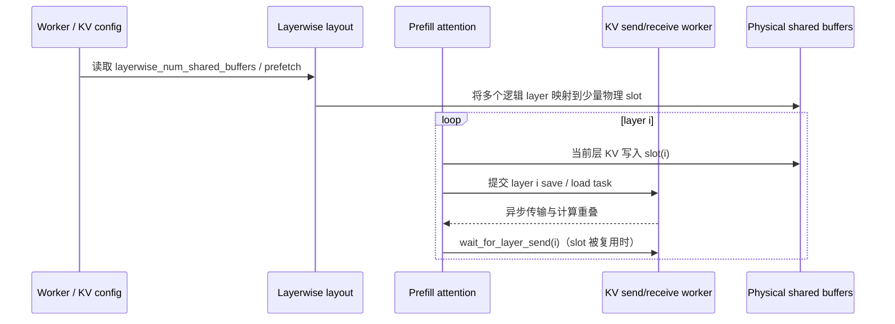
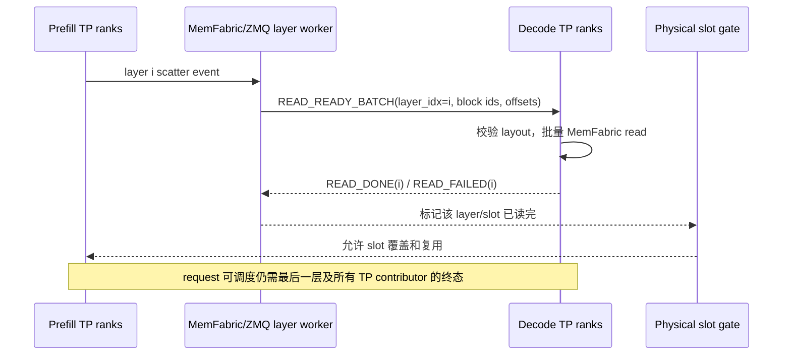
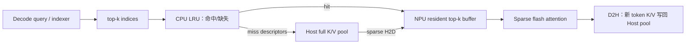
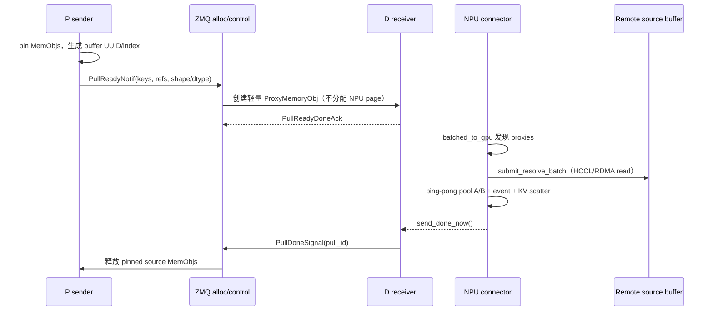

# vLLM-Ascend Layerwise + Sparse KV Offload 与 LMCache-Ascend Delay-Pull 分析

> 分析日期：2026-09-16
>
> 目标：把 vLLM-Ascend 的 layerwise KV offload、Sparse KV offload、P/D 按层传输串成一条可核验的数据路径，并评估 `lmcache-ascend` delay-pull 的结合方式。

> **关于文中的引用。** 文中 `路径:行号` 指向工作区里对应仓库的本地检出，`xxx.md:行号` 指向工作区的本地报告；站上没有这些文件、点不开，已按纯文本保留，已上线的姊妹报告则保留为可点击链接。

## 1. 版本、范围与证据等级

| 组件 | 固定版本 | 本文范围 |
|---|---|---|
| vLLM-Ascend | `vllm-ascend-review@f2f74a16`（`v0.26.0rc1`） | layerwise cache layout、AscendStore worker、SFA sparse offload、SFA P/D RD2H |
| LMCache-Ascend | `lmcache-ascend-combined@452bcf4e`（`v0.4.4-57-g452bcf4`） | PD pull/delay-pull、`ProxyMemoryObj`、`PDTransferContext`、NPU connector |
| 外部设计参考 | RFC #33398、#33980、#48203 | 只作为 documented/实验性参考，不当作当前仓库的运行时保证 |

证据标记：

- **源码已确认（Observed）**：可在上述 checkout 的代码中直接定位。
- **文档描述（Documented）**：项目文档或 RFC 的声明，未等同于每个工作负载的实测保证。
- **架构推演（Inferred）**：由源码接口和生命周期推导出的改造方案；需要实现和压测验证。
- **未知（Unknown）**：当前 checkout 没有足够 driver/API/benchmark 证据的部分。

本文不覆盖：NPU 驱动内部页表/IOMMU/ATS 细节、不同 RoCE/HCCS 拓扑的实测带宽、模型 kernel 数值精度验证，以及生产部署脚本。它们会影响绝对性能，但不改变下面的控制流结论。

## 2. 一页结论图


原始矢量版本仍保留在 `vllm-ascend-layerwise-sparse-delay-pull-overview.svg`。

图中最重要的边界不是“KV 在哪里”，而是“谁拥有何时可以覆盖物理 buffer 的权利”：vLLM-Ascend 的 layerwise worker 按物理 slot 等待远端读取完成；LMCache 当前 delay-pull 只在 request/chunk 级管理 proxy 和 Done。两者直接拼接会产生粒度错配，因此 delay-pull 应先抽象成带 `layer_id/slot_id` 的传输原语，生命周期仍由 vLLM-Ascend connector/worker 管理。

## 3. Layerwise Prefill：容量换流水

### 3.1 运行流程



**源码已确认：**

- 配置解析、独立层、共享 slot、prefetch map 位于 `vllm_ascend/distributed/kv_transfer/kv_pool/ascend_store/layerwise_cache_layout.py:114-178`。
- `apply_layerwise_kv_cache_plan` 用 `KVCacheTensor(shared_by=...)` 把逻辑 tensor 合并成物理描述，见 `.../layerwise_cache_layout.py:279-357`。
- Worker 在 layer 0 预提交多个 load，后续每层提交一个；当前层未完成才等待，见 `.../ascend_store/pool_worker.py:1679-1725`。
- 当前层 save 立即入队，最后一层才等待最终 save，见 `.../ascend_store/pool_worker.py:1733-1760`。
- 内存预算按“逻辑层数 / 物理 buffer assignments”放大，见 `vllm_ascend/worker/worker.py:577-595`。

**文档描述：** `docs/source/user_guide/feature_guide/layerwise_kv_pool.md:25-36` 将收益概括为把集中式 save/load 延迟摊到 forward 的逐层流水中；同一文档 `:123-127` 描述 PD disaggregation 的 Prefiller/Decoder 按层 save/load。

### 3.2 性能收益来自什么

1. **容量收益（确定性机制）**：若 `L` 个逻辑层映射到 `S` 个物理 assignment，常驻 NPU KV 容量近似按 `S/L` 缩小，调度器因此能接受更长上下文或更大 batch。代价是每个物理 slot 必须等待远端读完后才能覆盖。
2. **流水收益（有条件）**：layer `i+1` 的传输可以和 layer `i` 的 attention 重叠。近似条件是
   `T_load(layer) ≤ T_compute(layer) × overlap_window`；否则剩余部分仍形成 stall。
3. **不是算子加速**：单层 attention FLOPs 没减少；收益来自减少峰值 NPU KV、隐藏搬运，以及避免一次性 bulk transfer 的尾延迟。
4. **调参边界**：共享 buffer 越少，容量越大但可用的 prefetch/重叠窗口越窄；工程上应从 2～4 个 shared buffers 起测（该范围来自 RFC/文档经验，不是硬性保证）。

## 4. P/D 按层传输：能做到，但不能误读为“收到第一层就开始 decode”



**源码已确认：**

- 每层 scatter 后即 dispatch send：`vllm_ascend/distributed/kv_transfer/kv_p2p/sfa_pd_rd2h/worker.py:703-727`；无 hook 时 fallback 仍按层发送，`:729-777`。
- `READ_READY_BATCH` 携带 `layer_idx`，D 端按层批量读并回复 `READ_DONE/READ_FAILED`，见 `docs/source/developer_guide/Design_Documents/sfa_remote_d2h_connector.md:65-119`。
- 物理 storage slot 的复用门在 `.../worker.py:833-851`；文档明确物理存储完成与 request 完成分离，见 `sfa_remote_d2h_connector.md:124-151`。

因此，P/D layerwise 的主要收益是：P 端传输与后续 layer 计算重叠、P 端 slot 尽早释放、D 端避免整包等待。D 端的 decode 调度仍受“最后一层 + 所有 TP contributor”约束；不能把 layer-level `READ_DONE` 写成 request-level ready。

这里要区分“**attention 内部是否按层触发 KV 操作**”和“**当前实现何时把 request 放入 Decode 调度队列**”：

- 理论上可以做 streaming decode：收到 layer 0 的 prompt KV 后，D 先算 decode token 的 layer 0；收到 layer 1 后再算 layer 1，依次推进。因为 D 计算的是新 token 的 hidden state，P 并不是替 D 计算这些 layer；P 只提供 prompt token 的 K/V。
- 当前 vLLM **已经支持 attention 内部的 layer-level KV hook**：attention 进入某层时可 `wait_for_layer_load`，离开该层时可 `save_kv_layer`；vLLM-Ascend 也在 `attention/utils.py` 和 MLA/SFA attention 中实现了对应调用。它可以做到逐层加载、预取和保存，但这不等于 request 被拆成多个可独立调度的 layer task。
- 一个 decode token 的 hidden state 仍依赖前一层输出，而每一层 attention 又依赖该层的 prompt KV；因此 layer-level `READ_DONE` 只能说明“这一层的缓存已经读到/这一物理 slot 可以继续使用”，不能说明整个 token 的输入状态已经满足。
- 当前 scheduler/model runner 还按 request/batch 组织一次 decode forward，并且要确认所有 P→D contributor 的 shard 都到齐。若 P TP 大于 D TP，一个 D rank 可能要汇总多个 P contributor 的 indexer 或 main KV 分片；只到一部分会导致不完整 cache、重复写或不同 TP rank 看到的内容不一致。
- 所以不是“D 必须等 P 再算一个 hidden state”，而是“D 要自己顺序执行完整 decoder；P 的 layerwise 结果只是它访问的外部 KV”。若要真正边收边算，需要改 model runner、scheduler、KV block readiness 和失败重算协议，而不仅是把传输消息改成 layer-level。

## 5. Sparse Decode：只让 top-k 回到 NPU



**源码已确认：**

- `SparseKVOffloadManager` 初始化 host pool、block table 和 MemFabric offload，见 `vllm_ascend/distributed/kv_transfer/sparse_kv_offload/sparse_kv_offload_manager.py:302-371`。
- Decode 新 token 直接构造 D2H descriptor 写 host K/V，见 `.../sparse_kv_offload_manager.py:764-856`；纯 decode 路径不写 NPU paged main cache，见 `vllm_ascend/attention/sfa_kv_offload.py:271-343`。
- 每层根据 top-k 做 LRU compact、生成 miss descriptor，并 sparse copy 到 resident buffer，见 `.../sparse_kv_offload_manager.py:858-979` 和 `sparse_kv_offload.cpp:77-174,237-327`。
- 之后只在 resident top-k 上执行 sparse attention，见 `vllm_ascend/attention/sfa_kv_offload.py:345-448`。
- 配置限制包括仅 sparse-attention、无 CP/PP、仅 D 节点（生产模式）、不支持 model runner v2，见 `vllm_ascend/ascend_config.py:1028-1075`。

收益来自“访问选择性”而非压缩：full K/V 保留在 Host，NPU 只保留固定大小 hot buffer；每步搬运量约为 `miss_count × token_bytes`，而不是 `sequence_length × token_bytes`。实际收益取决于 top-k 命中率、Host/NPU 链路带宽、LRU/descriptor CPU 开销和 sparse kernel 效率。RFC #48203 报告过 `topk_buffer_size≈2×topk` 时 80%～90% 命中以及约 1/16 的理想 NPU KV 占用，但这是 RFC 的实验/估计数字，不是本 checkout 的保证。

## 6. LMCache-Ascend delay-pull 当前流程



**源码已确认：**

- 配置含 `pd_pull_mode`、`pd_delay_pull`、`pd_pull_done_port`、`pd_pull_pending_ttl`，见 `lmcache_ascend/__init__.py:121-180`；delay-pull 要求 pull mode 且 receiver `buffer_device` 为 NPU，见 `v1/storage_backend/pd/backend.py:99-110`。
- Receiver delay path 创建无 backing 的 proxy，真实读取推迟到 connector，见 `v1/storage_backend/pd/receiver_mixin.py:302-326,360-430`。
- `ProxyMemoryObj` 支持批量提交非阻塞 read、等待 NPU event、再 scatter，见 `v1/proxy_memory_obj.py:150-240,260-330`。
- `_remote_batched_to_gpu` 用两套 ping-pong pool、micro-batch 和 per-pool scatter event，见 `v1/npu_connector/npu_connectors.py:1903-2105`；完成后释放 staging 并触发 `PDTransferContext.send_done_now()`。
- `PDTransferContext` 当前按 request lease / proxy batch 发送一次 Done，见 `v1/transfer_context.py:302-426`；sender 按 `pull_id` 保存 pinned objects，收到 Done 或 TTL 到期才释放，见 `v1/storage_backend/pd/sender_mixin.py:139-249,500-650`。

**源码已确认的硬限制：** `lmcache_ascend/v1/storage_backend/__init__.py:69-114` 明确拒绝 `enable_pd=true + use_layerwise=true`，并同样拒绝 Ascend P2P backend 的 layerwise。也就是说，当前版本不能靠同时打开两个配置得到“layerwise + delay-pull”。

## 7. 如何结合：推荐把 delay-pull 下沉为 layer/chunk transport primitive

### 7.1 推荐架构（架构推演）

保留两侧职责边界：

| 职责 | vLLM-Ascend layerwise worker/connector | LMCache-Ascend delay-pull |
|---|---|---|
| layer 顺序、prefetch、attention 前等待 | **拥有** | 不介入 scheduler |
| 物理 slot 何时可覆盖 | **拥有**，按 `slot_id` 等待所有 D ack | 提供 ack/event，不自行推断安全 |
| source buffer 注册、远端 read | 调用 transport primitive | **拥有** |
| NPU staging / scatter | connector 根据当前 layer 目标 slot 执行 | 提供异步 read event/批量接口 |
| sender pinned 生命周期 | 不直接管理 | `PullLease(layer, slot, chunk)` 管理 |
| sparse top-k 选择 | `SparseKVOffloadManager` **拥有** | 不预取 full layer；只执行 miss descriptors 的 read |

建议新增一个显式接口（名称仅为方案示例）：

```text
publish_layer(layer_id, slot_id, chunks, source_refs) -> LayerPullHandle
start_pull(handle, destination_staging, miss_descriptors?) -> ReadEvent
mark_consumed(handle, chunk_ids)
ack_slot_read(handle, slot_id, d_rank)
```

关键是把当前 `pull_id` 的语义拆成三层：

1. `chunk/proxy consumed`：该 staging 已 scatter，不再访问 source ref。
2. `layer read complete`：该 D rank 对该 layer 的所有 chunk 已落到目标 KV。
3. `physical slot safe-to-overwrite`：所有 D contributor 对该 slot 都返回 `READ_DONE`。

`PullDoneSignal` 至少应能携带 `(pull_id, layer_id, slot_id)`，或由 sender 侧用同样的三元组去重。单一 request-level Done 会过早复用 source，也可能因等太久而钉住整个 request 的 buffer。

### 7.2 端到端建议流程

```mermaid
flowchart TD
    P0[P layer i scatter 完成] --> P1[记录 event + 发布 layer metadata]
    P1 --> P2[创建 layer/slot PullLease]
    P2 --> D0[D 端 wait_for_layer_load(i)]
    D0 --> D1[只为当前 layer 分配有限 staging]
    D1 --> D2[submit batched read；与上一层 scatter 重叠]
    D2 --> D3[scatter 到 layerwise physical slot 或 sparse resident buffer]
    D3 --> D4[layer read complete]
    D4 --> D5[所有 TP contributor 完成？]
    D5 -->|否| D6[等待其他 contributor]
    D5 -->|是| A[READ_DONE(layer, slot)]
    A --> P3[P 端允许 slot 覆盖]
    D3 --> X[release staging + mark chunk consumed]
    X --> Y[发送 layer-scoped Done/lease release]
```

### 7.3 三种落地方案对比

| 方案 | 做法 | 优点 | 主要问题 | 判断 |
|---|---|---|---|---|
| A. 外挂 `MultiConnector` | vLLM layerwise 继续管理层；connector 旁路调用 LMCache delay-pull | 改动边界小，可先验证接口 | connector 需要把 proxy 映射到 layer/slot；现有 `batched_to_gpu` 是整批语义 | 适合 PoC |
| B. PD backend 原生 layer-aware delay-pull | 扩展 `PullReadyNotif`、`PDTransferContext`、Done 协议和 sender pending 表 | 生命周期最完整，协议可表达 slot gate | 改动最大，需要兼容旧 pull/eager、TP contributor、失败/TTL | **推荐生产方向** |
| C. delay-pull 只做 P→D transport | vLLM `SfaRemoteD2HConnector` 保留 layer scheduler/READ_DONE；LMCache 只实现异步 read primitive | 复用现有 RD2H layer 协议和物理 slot gate | 需要 LMCache 暴露 descriptor/event，而非 proxy 黑盒 | **推荐最小风险路径** |

推荐顺序：先做 C 验证传输和重叠，再把稳定的 lease/Done 语义下沉到 B；A 只用于快速集成验证，不建议把 request-level proxy 直接当作 layerwise KV tensor。

## 8. 与 Sparse Decode 的结合边界

不要让 delay-pull 预取每层 full KV：Sparse Decode 的 top-k 是每步、每层动态生成的。正确组合是：

1. `SparseKVOffloadManager.onload_topk_kv` 继续负责 LRU 命中、miss token 和目标 resident slot。
2. LMCache delay-pull 只接收 miss descriptors（源地址/长度/目标 staging），批量发起 H2D/远端 read。
3. sparse attention 在目标 hot buffer 上执行；新 decode token 仍由 vLLM 直接 D2H 写 Host pool。
4. layerwise gate 只保护真正共享的物理 storage；top-k resident buffer 另设固定容量和 eviction 事件。

这是**架构推演**：当前 LMCache `ProxyMemoryObj` 的 metadata 是 chunk shape/dtype，尚未表达 sparse miss descriptor、layer id、resident slot 或 token offset；需要新增接口和测试。

## 9. 性能模型与观测指标

### 9.1 Layerwise Prefill / P-D

令每层计算、读取、发送、等待时间分别为 `C_i`、`R_i`、`S_i`、`G_i`，双 buffer/多 buffer 下可见的单层代价近似：

```text
T_layerwise ≈ Σ_i max(C_i, R_i + S_i) + Σ_i G_i
T_bulk      ≈ Σ_i C_i + T_all_layers_transfer
```

`G_i` 是 slot 被复用前未被隐藏的 READ_DONE 等待；它不能简单计入 request-level Done。需要记录：

- 每层 `scatter → READ_READY`、`READ_READY → READ_DONE`、`READ_DONE → slot reuse`；
- prefetch 命中率、load queue 深度、ping-pong pool occupancy；
- P/D TP contributor 的最长尾延迟和 zero-block ack；
- sender pinned pages、TTL sweep、失败重算次数。

### 9.2 Sparse Decode

重点指标是 `topk hit rate`、每步 miss token 数、Host→NPU bytes/token、LRU CPU 时间、sparse kernel 时间和 D2H bytes/token。只看总 tokens/s 无法判断收益来自容量还是带宽隐藏。

## 10. 失败路径与安全约束

- **slot 覆盖竞态**：P 端必须按物理 slot 等待每个 D contributor 的 `READ_DONE/READ_FAILED`；request 完成不能替代它。
- **proxy 过早释放**：connector scatter 完成后才能 `mark_consumed`；source pinned 生命周期由 layer/slot lease 释放。
- **receiver 崩溃**：保留 TTL 作为兜底，但 TTL 不是正确性同步机制；超时后应使对应 block/request 失效并重算。
- **TP 不等配**：复用 RD2H 的 contributor 映射；main KV 避免重复写，indexer/scale 仍需完整合并。参见 `sfa_remote_d2h_connector.md:160-187`。
- **buffer 设备限制**：当前 delay-pull 要求 receiver NPU buffer；CPU staging 的带宽和注册语义需要单独验证，不能从配置名推断支持。
- **Sparse 与 full layer 混用**：不要把 top-k resident buffer 的 eviction 当成 layerwise source slot 的完成；两套状态机必须分开。
- **Unknown / 需驱动证据**：Host memory 的页锁定、IOMMU 映射粒度、跨 NUMA 访问、graph capture 下指针稳定性，当前源码不足以确认；上线前需要驱动/API 和拓扑实测。

## 11. 实现改造点与测试矩阵

### 11.1 代码改造点（架构推演）

1. 扩展 PD wire message：`layer_id`、`slot_id`、`chunk_ids`、目标偏移/长度、TP contributor 信息；保留旧 tuple 长度兼容。
2. 将 `PDTransferContext` 的 lease key 从 `request_id` 扩展为 `(request_id, layer_id, slot_id)`，并区分 `chunk_consumed` 与 `slot_safe`。
3. 给 connector 增加 layer-aware `batched_to_gpu`/`submit_read` 入口；每层只绑定当前物理 slot 的 destination。
4. 让 `SfaRemoteD2HConnector` 继续拥有 `READ_READY/READ_DONE` 和 physical-storage gate，LMCache 只返回 read event/status。
5. 对 Sparse miss descriptor 增加批量读取适配，禁止隐式预取 full KV。
6. 仅在上述能力具备后移除 `storage_backend/__init__.py` 的 `use_layerwise` 拒绝逻辑；删除 guard 之前必须有兼容测试。

### 11.2 测试矩阵

| 维度 | 最小用例 | 需要验证 |
|---|---|---|
| layer reuse | 2/4 shared buffers、独立首层、prefetch=1/2/4 | 无覆盖竞态，slot gate 次序正确 |
| PD topology | P=D、P>D 且整除、zero-block contributor | 每层 ack、最终 request completion、无重复 main 写 |
| delay-pull | eager/delay、proxy 消费/丢弃、receiver crash/TTL | pinned 释放、重算、无 staging 泄漏 |
| Sparse | hit 0%、高命中、topk buffer=topk/2×topk | miss descriptor 正确、resident slot 不越界 |
| 组合 | layerwise + PD + sparse decode | layer/slot/lease 三层状态互不串扰 |
| 设备 | NPU 910B/310P、不同 NUMA/链路 | layout、对齐、带宽和 fallback |

## 12. 最终判断

- **vLLM-Ascend 的 layerwise + sparse 特性可以流程化为一条互补路径**：layerwise 负责“按层流水和常驻容量”，Sparse 负责“按 top-k 选择性回迁”；二者性能收益分别来自 overlap/capacity 和 locality/traffic reduction。
- **PD 传输本身已经可以按 layer 发送**，并且有物理 slot 复用门；但它不意味着 D 收到第一层就开始 request decode。
- **当前 LMCache-Ascend delay-pull 不能直接与 `use_layerwise` 组合**，因为 PD backend 在配置层明确拒绝，且现有 proxy/Done 粒度是 request/chunk 而非 layer/slot。
- **最稳妥的结合方式**是让 LMCache 提供 layer/chunk 级异步 read primitive，让 vLLM-Ascend 保留 layer scheduler、Sparse top-k 选择和 physical-slot gate；完成压测后再演进为 PD backend 原生 layer-aware lease。

## 13. 参考入口

- vLLM-Ascend layerwise 用户文档：`vllm-ascend-review/docs/source/user_guide/feature_guide/layerwise_kv_pool.md`。
- vLLM-Ascend SFA P/D 设计文档：`vllm-ascend-review/docs/source/developer_guide/Design_Documents/sfa_remote_d2h_connector.md`。
- Layerwise async pipeline RFC：<https://github.com/vllm-project/vllm/issues/33398>。
- Sparse decode / top-k offload RFC：<https://github.com/vllm-project/vllm/issues/33980>。
- Layerwise + sparse KV offload RFC：<https://github.com/vllm-project/vllm/issues/48203>。
