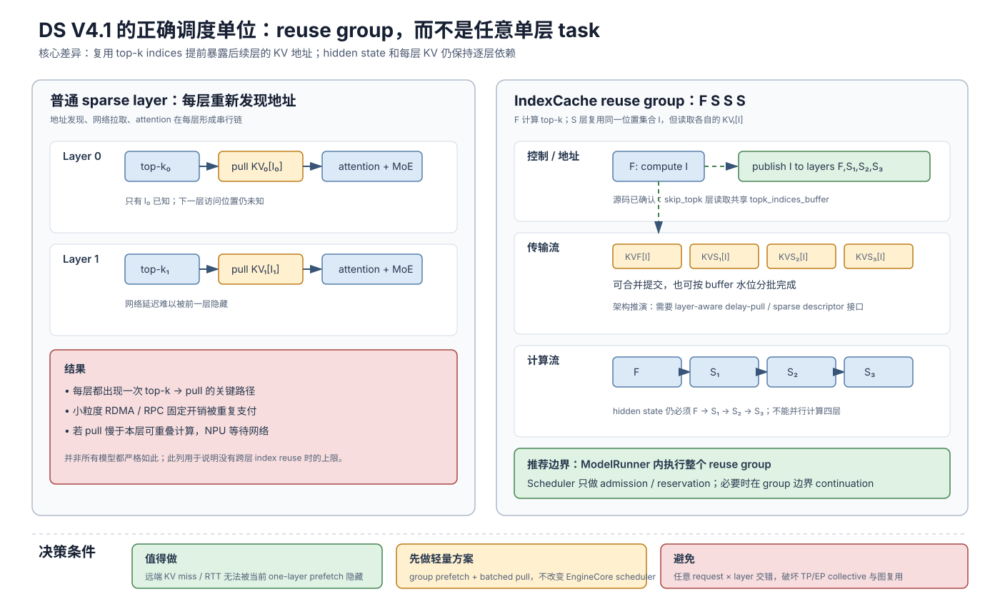

# DeepSeek V4.1 的 Reuse-Group Layer Chunk 调度分析

> 分析日期：2026-09-16
>
> 核心问题：对于 DeepSeek V4.1 这类跨层复用 sparse top-k 结果的模型，是否值得进一步引入 layer chunk 调度，以及调度应该放在 vLLM Scheduler 还是 ModelRunner 内部？

## 1. 版本、范围与证据等级

| 组件 | 固定版本 | 本文关注范围 |
|---|---|---|
| vLLM | `568afb3a13806beb53bb2e6bd518269357b237c0`（`v0.26.0`） | ModelRunner V2 执行边界、attention layer KV hook、DeepSeek V4 模型实现 |
| vLLM-Ascend | `4c5ee33208b6808625c5994f9d45bfd4705e8dfc` | DeepSeek V4.1、IndexCache、KVPP、Sparse KV offload 限制 |

证据标记：

- **源码已确认（Observed）**：当前 checkout 中存在直接运行时代码证据。
- **文档描述（Documented）**：项目文档中的声明，不等同于 P/D 或 offload 场景已完成实测。
- **架构推演（Inferred）**：由当前数据依赖和接口推导出的设计，需要实现与 benchmark 验证。
- **未知（Unknown）**：公开 checkout 没有足够配置、实现或实测数据。

本文主要讨论 decode 侧的 sparse KV delay-pull 和 layer streaming，不覆盖训练、模型精度验证、Engram host offload 实现、驱动内部 RDMA/HCCS 细节，也不声称当前版本已经支持本文提出的 group continuation。

## 2. 执行结论

结论可以压缩成一句话：

> **DeepSeek V4.1 值得利用 layer chunk，但正确的调度单位应是模型语义上的 reuse group，而不是任意单层 task；优先在 ModelRunner 内实现 group-aware prefetch，只有传输仍无法隐藏时，才增加 group-boundary continuation。**

理由分成四层：

1. IndexCache 复用的是跨层 top-k token indices，不是整层 hidden state、权重计算或该层 KV，因此不能跳过 follower layer。
2. 同一组 follower layer 使用相同位置集合，使它们未来的远端 KV 地址在 anchor layer 产生 top-k 后立即可知。
3. 这创造了比普通 one-layer-ahead 更长的 delay-pull 窗口，也允许把多个 layer 的小传输合并提交。
4. hidden state、TP/EP collective 和每层 KV 仍是顺序依赖；把每个 `(request, layer)` 暴露给全局 scheduler，通常会以 batch fragmentation、collective 协调和 graph 失效为代价。

还有一个重要的反向因素：DeepSeek V4.1 文档称 global KV 已降至约 `890 bytes/token`，persistent KV 约为 DeepSeek-V4-Flash 的 `1/8`，而 decode 每 token 激活约 `16B` 参数。KV 更小、计算更重，意味着简单预取更容易把传输完全隐藏，也意味着复杂 scheduler 的增量收益可能反而下降。

## 3. 一页总览图



矢量原稿见 [deepseek-v4.1-reuse-group-layer-chunk-scheduling.svg](deepseek-v4.1-reuse-group-layer-chunk-scheduling.svg)。

如果当前 Markdown 阅读器不能显示 SVG，下面是等价的纯文本版本：

```text
普通逐层 sparse                           IndexCache reuse group: F S S S
────────────────────────                  ───────────────────────────────────
L0: top-k0 → pull KV0[I0] → compute       F: compute top-k = I
L1: top-k1 → pull KV1[I1] → compute                    │
L2: top-k2 → pull KV2[I2] → compute                    ├─ pull KVF[I]
L3: top-k3 → pull KV3[I3] → compute                    ├─ pull KVS1[I]
                                                         ├─ pull KVS2[I]
每层都重新经历：                                          └─ pull KVS3[I]
地址发现 → 网络 RTT → attention
                                               compute: F → S1 → S2 → S3
                                               transfer:    S1/S2/S3 提前进行

注意：I 被复用，但 KVF[I]、KVS1[I]、KVS2[I]、KVS3[I] 是不同数据。
```

图中决定性的变化不是“四层可以并行算”，而是“一个 layer 产生的地址选择可以驱动多层传输”。因此 compute stream 仍然严格逐层前进，而 transfer stream 可以在 reuse group 内向前看，并用 anchor 和前序 follower 的计算覆盖后续 KV 拉取。

## 4. 先澄清“复用大部分层”究竟复用了什么

### 4.1 已确认：IndexCache 复用 top-k indices

vLLM-Ascend 在 DeepSeek V4 attention 构造时，根据 `use_index_cache`、`index_topk_pattern` 或 `index_topk_freq` 为 C4 indexer layer 计算 `skip_topk`：

```python
# vllm_ascend/models/deepseek_v4/model.py:575-592
# IndexCache: decide whether this layer reuses topk from a previous
# indexer-bearing layer.
...
if self.compress_ratio == 4 and use_index_cache and ".mtp." not in prefix:
    ...
    if pattern is None:
        skip_topk = max(indexer_seq_idx - 1, 0) % freq != 0
    else:
        ...
        skip_topk = pattern[indexer_seq_idx] == "S"
```

在 indexer forward 中，`skip_topk` layer 直接读取共享的 `topk_indices_buffer`；负责计算的 layer 则选择 top-k，并在开启 IndexCache 时更新该 buffer：

```python
# vllm_ascend/models/deepseek_v4/indexer.py:430-472
if self.skip_topk:
    topk_indices = self._get_cached_topk_indices(num_tokens)
else:
    ...
    topk_indices = self._select_topk_serial(...)

if self.use_index_cache:
    self._update_cached_topk_indices(topk_indices)
```

测试配置中存在 `index_topk_freq=4` 的实例，见 `tests/e2e/pull_request/four_card/test_deepseek_v4.py:116-119`。这说明 `F S S S` 是一个合理的说明例，但它不是所有 checkpoint 的固定结构。

### 4.2 没有复用的东西

以下内容没有因为 `skip_topk=True` 自动消失：

- follower layer 自己的 Attention 和 MoE 计算；
- 前一层 hidden state 到后一层 hidden state 的数据依赖；
- follower layer 自己的 main KV 数据；
- TP/EP rank 之间该层的 collective；
- 最后一层之后的 norm、head 和 sampling。

当前 Ascend 模型仍通过循环顺序执行本 PP stage 的所有 layer，见 `vllm_ascend/models/deepseek_v4/model.py:954-968`。所以“复用 top-k”不能改写成“复用或跳过大部分 Transformer layer”。

### 4.3 CED、SWA Bounded Replay 与 DSpark 不应混成一种复用

**文档描述：** DeepSeek V4.1-Flash 是 40-layer Causal Encoder-Decoder，包含 20 个 causal-encoder layer 和 20 个 decoder layer，并引入 CSA2、SWA Bounded Replay、mHC、Engram 和 DSpark，见 `docs/source/tutorials/models/DeepSeek-V4.1-Flash.md:5-16`。

**源码已确认：** 当前 vLLM-Ascend 模型执行路径仍将 `num_hidden_layers` 构造成顺序 layer 列表并逐层执行。现有证据不足以把 CED 或 SWA Bounded Replay 解释为“decode 时可直接跳过 20 层”。DSpark 是 speculative decoding 路径，也不是 target backbone layer 的通用跳过机制。

因此，本文把可以直接用于调度设计的“跨层复用”限定为已经在 runtime 中明确出现的 top-k index reuse。

## 5. 为什么 IndexCache 特别适合 Delay Pull

对一个 reuse group `G={F,S1,S2,S3}`，anchor layer `F` 生成位置集合 `I` 后，D 端可以推导出：

```text
remote addresses = {
    address(KV_F,  I),
    address(KV_S1, I),
    address(KV_S2, I),
    address(KV_S3, I),
}
```

这些地址指向不同 layer 的 KV，但 token/block 位置相同。于是可以进行：

```text
compute stream : index(F) → attn(F) → moe(F) → attn(S1) → moe(S1) → ...
transfer stream: pull(F) ─┬─ pull(S1) ─ pull(S2) ─ pull(S3)
                          └─ 地址在 index(F) 完成后一次性可知
```

它带来三类增量收益：

1. **地址前视窗口**：普通 sparse layer 只有进入本层后才知道本层 top-k；IndexCache 允许提前知道多个 follower layer 的选择位置。
2. **固定开销摊薄**：多个 layer 的 descriptor、RDMA read 或 RPC 可以批量提交，不必每层支付完整控制面开销。
3. **短驻留窗口**：只需要为即将执行的 group 保留 sparse KV buffer，执行完成即可回收或覆盖。

但 anchor layer 本身仍存在 `index(F) → pull KV_F[I] → attention(F)` 的关键路径。IndexCache 主要帮助的是 follower layers，不会神奇地消除第一个 pull。

若 indexer 所需的压缩 cache 也不在本地，必须先保证 anchor 的 index cache ready，才能计算 `I`。因此一个完整的远端流程至少包含两种数据：

```text
静态/提前可拉：anchor indexer cache、block table、layout metadata
运行时按需拉：anchor 产生 I 后对应的 per-layer main KV[I]
```

## 6. 建议的端到端流程

### 6.1 P 端：照常生成并发布 layer KV

Prefill 仍顺序计算各层，并发布每层 KV 的远端引用、block layout 和完成事件。P 不需要为 D 计算 decode hidden state；P 只提供 prompt KV。

### 6.2 D 端：以 reuse group 组织传输和执行

```text
1. Admission
   └─ 确认 group 0 的 indexer cache / metadata 可用

2. Anchor index
   └─ F 层根据当前 decode query 计算 top-k positions I

3. Group pull submission
   ├─ 生成 KV_F[I]、KV_S1[I]、KV_S2[I]、KV_S3[I] descriptors
   ├─ 按 layer buffer 水位批量提交异步 read
   └─ 返回每层 ReadEvent，不做 request-level ready

4. Sequential compute
   ├─ wait ReadEvent(F)  → execute F
   ├─ wait ReadEvent(S1) → execute S1
   ├─ wait ReadEvent(S2) → execute S2
   └─ wait ReadEvent(S3) → execute S3

5. Group completion
   ├─ 释放本 group staging / sparse resident leases
   ├─ TP/EP ranks 对齐 group boundary
   └─ 进入下一 reuse group

6. Request completion
   └─ 仅最后一层、所有必要 rank 和 head/sample 完成后，token 才 ready
```

这里的 layer-level `ReadEvent` 只是“该层可以开始 attention”的条件，不是“整个 request 可以 sample”的条件。D 确实可以边拉边算，但仍然只能沿 hidden-state 链逐层向前。

## 7. 调度应放在哪一层

### 7.1 推荐：ModelRunner 内的 group pipeline

当前 vLLM 已在 attention wrapper 中提供 layer 进入前 `wait_for_layer_load`、退出后 `save_kv_layer` 的 hook，见 `vllm/model_executor/layers/attention/kv_transfer_utils.py:15-59`。vLLM-Ascend KVPP 也已经实现 one-layer-ahead prefetch，见 `vllm_ascend/worker/v2/kvpp.py:74-112`。

最小风险演进是把 one-layer-ahead 扩展为 model-aware group-ahead：

```text
ReuseGroupPlanner
    输入：compress_ratios、index_topk_pattern/freq、PP range
    输出：group_id、anchor_layer、follower_layers

GroupPullCoordinator
    输入：anchor top-k I、remote layer refs、buffer budget
    输出：per-layer ReadEvent / lease

ModelRunner local executor
    行为：顺序执行 layer；只在需要时等待对应 ReadEvent
```

EngineCore Scheduler 仍以 request/token/batch 为单位做 admission 和 KV reservation，不需要理解每个 attention kernel。

### 7.2 条件性方案：group-boundary continuation

如果 follower KV 仍经常未到，NPU 在 layer hook 内发生显著阻塞，可以允许 ModelRunner 在 group 边界保存 continuation：

```text
Continuation = {
    microbatch identity,
    next_group_id,
    hidden_states / residual,
    attention metadata snapshot,
    KV leases and ReadEvents,
    graph / PP / TP execution context,
}
```

Scheduler 可以在另一个已经 ready 的 microbatch 上运行一个完整 group，然后再恢复原 continuation。切换点必须是所有 TP/EP rank 一致的 graph-safe boundary。

这比单层 task 粗，但保留了最重要的等待隐藏能力，同时降低 activation parking、状态保存和 collective 顺序错误。

### 7.3 不推荐：全局 `(request, layer)` task scheduler

把每个 request 的每层都放进 EngineCore ready queue，会引入：

- 同一 batch 中请求停在不同层，破坏 continuous batching；
- TP8/EP32 rank 若选择不同 task，collective 顺序不一致甚至死锁；
- Full/Piecewise Graph 的输入、地址和执行序列更难稳定；
- 每层都要保存 hidden/residual、metadata、event 和 lease；
- 调度次数从每 token 一次放大到每 token × layer 一次；
- MoE expert routing 和通信负载更难合批。

ModelRunner V2 当前仍然通过一次 full graph、piecewise graph 或 `self.model(**model_inputs)` 执行模型，然后保存最终 `model_output`，见 `vllm/v1/worker/gpu/model_runner.py:1323-1386`。它并没有提供通用 layer continuation。

## 8. Chunk 边界不能简单设为“每 N 个物理层”

推荐边界是以下约束的并集：

```text
chunk boundary =
    IndexCache recompute boundary
  ∪ PP stage boundary
  ∪ graph-safe boundary
  ∪ 必要的 CED / attention family boundary
  ∪ 无法跨越的 TP/EP collective boundary
```

尤其要注意：`index_topk_freq` 是按 indexer-bearing layer 的序号计算，不必然等于物理层号。`compress_ratios` 中的 C4、C128 或 SWA-only layer 可能使天然 group 非连续。

PP 也不能任意切开 reuse group。vLLM-Ascend 已显式检查 PP stage 的首层是否是 `skip_topk`；如果该层依赖前一 stage 的 top-k，会拒绝启动，因为当前不支持跨 PP 传播 top-k，见 `vllm_ascend/platform.py:395-420`。这正说明 reuse group 是实际的数据依赖边界，而不仅是性能提示。

## 9. 性能模型：什么时候值得做

设一个 reuse group 有 `k` 个 layer：

- `Tindex`：anchor top-k 计算时间；
- `X_i`：第 `i` 层 sparse KV pull 时间，含控制面固定开销；
- `C_i`：第 `i` 层 attention + MoE 计算时间；
- `H_i`：第 `i` 层真正暴露在关键路径上的等待时间。

普通逐层路径近似为：

```text
Tnormal ≈ Σ(Tindex_i + X_i + C_i)
```

reuse-group pipeline 的关键路径近似为：

```text
Tgroup ≈ Tindex_anchor + X_anchor + C_anchor
         + Σ(C_follower + H_follower)

H_follower ≈ max(0,
                 follower KV remaining transfer
                 - earlier layer compute overlap)
```

调度优化真正能减少的是 `H_follower` 和传输固定开销，不是 `C_i`。如果当前已经满足：

```text
group follower transfer time ≤ anchor + earlier follower compute window
```

那么传输已被完全隐藏，继续增加 scheduler 粒度几乎不会缩短 decode step，反而可能损害 graph 和 batching。

### 9.1 值得投入的信号

- `wait_for_layer_load` 在 follower layers 上仍有明显 p95/p99 stall；
- 远端 miss 多，且单次 pull RTT 占比高；
- 多层 descriptor 合批能显著提升链路利用率；
- TTFT 或首个 decode token 被完整 request-level KV barrier 主导；
- NPU timeline 中存在可被其他 group 填充的稳定空洞。

### 9.2 不值得升级到 scheduler continuation 的信号

- follower transfer 已被 one-layer/group prefetch 完全覆盖；
- KV 全部本地，主要瓶颈是 MoE/collective/compute；
- ACL/CUDA graph replay 收益高于可能隐藏的网络等待；
- activation parking 限制并发，切换后反而降低可运行 batch；
- sparse KV 已足够小，网络不是性能瓶颈。

## 10. 与 Layerwise / Sparse KV Offload 的结合

### 10.1 Layerwise P/D

P 可以按层发布 KV，D 可以在进入对应 attention layer 前等待该层。reuse group 在此基础上增加“同一个 top-k 选择驱动多个 layer pull”的能力。

但若 P 端尚未生成 follower layer KV，即使地址位置已经知道，D 也只能登记 future pull，不能读取不存在的数据。因此：

- 对已经完成 Prefill 的 request，group pull 可以立即批量发起；
- 对 P/D 真正同步流式执行的 request，pull readiness 还受 P 端 layer publish event 限制。

### 10.2 Sparse KV Offload

Sparse offload 与 IndexCache 的组合最自然，因为 `I` 本身就是 sparse miss descriptor 的主要输入。可将每层的 `I` 与 local hot-buffer 目录比较，只拉 miss：

```text
for layer in reuse_group:
    misses[layer] = I - resident[layer]
    async_pull(remote_KV[layer, misses[layer]])
```

因此 group pipeline 的收益取决于 miss ratio，而不是 top-k 大小本身。若 follower layer 的 resident cache 命中率很高，提前 pull 的价值主要变成提前确认“无需传输”。

当前 vLLM-Ascend 明确禁止 Sparse KV offload 与 Model Runner V2 同时启用，见 `vllm_ascend/ascend_config.py:1500-1501`。所以本文的 MRV2 group pipeline 是演进设计，不是当前可直接打开的配置组合。

## 11. 正确性不变量

实现时至少要维持以下不变量：

1. **Top-k generation**：每个 follower 使用的 `I` 必须来自其所属 group 的 anchor，不能被下一 microbatch 覆盖。
2. **Per-layer ownership**：相同 `I` 不代表 KV storage 相同；每层 event、buffer 和 lease 独立。
3. **Hidden-state order**：layer `i+1` 只能消费 layer `i` 的最终输出。
4. **Collective lockstep**：同一个 TP/EP group 的 rank 必须选择相同 continuation 和 group 顺序。
5. **Request readiness**：layer/group `READ_DONE` 不能升级成 request/token ready。
6. **Buffer lifetime**：远端 source、staging 和 device resident buffer 必须存活到对应 compute stream 完成消费。
7. **PP boundary**：不能让 follower group 从一个没有 anchor top-k 的 PP stage 开始，除非实现显式 index propagation。
8. **Graph safety**：graph replay 使用的地址、metadata 与 event 生命周期必须稳定。

## 12. 失败模式与缓解

| 失败模式 | 表现 | 缓解方式 |
|---|---|---|
| group 过大 | staging 占用升高，其他请求被挤出 | 按 byte budget 而不是固定层数限制 in-flight pull |
| group 过小 | 网络 RTT 和调度开销重复出现 | 尽量与 IndexCache anchor/recompute 边界对齐 |
| TP/EP rank 进度不同 | collective hang 或读到不同 KV | group decision 广播；所有 rank 使用同一 epoch |
| top-k buffer 被覆盖 | follower 使用另一个 microbatch 的 indices | 为 buffer 增加 batch/group generation id |
| follower KV 尚未由 P 发布 | read 失败或错误等待 | 将 address-known 与 source-ready 拆成两个 event |
| graph 命中率下降 | decode 吞吐回退 | 固定少量 chunk shape；优先只做异步 prefetch |
| continuation 状态过大 | activation parking 吃掉 KV 容量收益 | 只允许 group boundary；限制 parked microbatch 数 |
| remote miss 波动大 | 预取过多或链路拥塞 | 自适应窗口，根据 EWMA transfer/compute ratio 调整 |

## 13. 建议的落地顺序

### Phase 0：先补可观测性

记录每个 `(group, layer)` 的：

- top-k ready timestamp；
- remote source-ready timestamp；
- pull submit / complete timestamp；
- attention start timestamp；
- `wait_for_layer_load` stall；
- bytes requested、bytes missed、resident hit ratio；
- graph replay hit、TP/EP collective idle。

没有这些数据时，很容易把模型本身的 IndexCache 计算收益误算成 scheduler 收益。

### Phase 1：Group-aware prefetch，不改 Scheduler

- 从模型 config 构造 `ReuseGroupPlan`；
- anchor top-k ready 后批量生成 follower descriptors；
- transfer stream 提前拉取，attention hook 按层等待；
- 限制 group 内最大 in-flight bytes。

这是推荐首先实现的版本，因为不需要保存 continuation，也不改变 continuous batching 和 collective 顺序。

### Phase 2：Group-boundary continuation

只有 Phase 1 后 follower stall 仍然显著时才加入：

- 保存完整 microbatch continuation；
- 所有 TP/EP rank 同步 yield/resume；
- scheduler 只在 ready group 之间选择；
- 限制同时 parked 的 microbatch 数量。

### Phase 3：Scheduler 只感知 admission 与 backpressure

让全局 scheduler 使用 group readiness 做：

- 提前接纳已具备首 group 条件的 request；
- 根据 transfer backlog 控制 batch；
- 为下一 group 预留 sparse resident bytes；
- 避免把网络未 ready 的 request 放入无法让出的 full graph batch。

不要让 EngineCore 管理每层 kernel 或每层 collective。

## 14. 验证矩阵

| 维度 | 建议取值 |
|---|---|
| IndexCache | off、`freq=2`、`freq=4`、真实 checkpoint pattern |
| 执行策略 | baseline、one-layer prefetch、group prefetch、group continuation |
| 上下文长度 | 短、中、长、接近容量上限 |
| KV hit ratio | 低、中、高；分别测 cold/warm cache |
| 并发 | 单请求、低并发、饱和 continuous batching |
| 图模式 | eager、piecewise、full decode graph（若组合支持） |
| 拓扑 | 单机、跨机；分别记录实际链路带宽和 RTT |

主要指标：

- TTFT、TPOT、decode step p50/p95/p99；
- follower `wait_for_layer_load` 总时长；
- group transfer/computation overlap ratio；
- NPU utilization 与网络利用率；
- indexer/top-k 实际执行次数；
- activation parking 峰值；
- graph replay hit rate；
- TP/EP collective idle time；
- batch fragmentation 和有效 tokens/step。

成功标准不应只是“layer wait 下降”，而应是端到端 TPOT 或吞吐改善，并且 graph、batch 和 activation memory 的回退没有吃掉收益。

## 15. ADR：选择 Reuse-Group Pipeline

**决策：** 首选 ModelRunner 内 `reuse-group prefetch`；预留 group-boundary continuation 接口；不建设通用单层全局 scheduler。

**状态：** Proposed / 需要 profiling 与 PoC。

**收益：**

- 利用 IndexCache 提供的跨层地址前视；
- 与现有 layer KV hook 和 KVPP 演进方向一致；
- 保持 TP/EP collective 顺序和 batch 形状；
- 在不改 EngineCore 的情况下验证大部分潜在收益。

**代价：**

- 需要 model-aware group plan；
- delay-pull 必须支持 per-layer event、descriptor 和 lease；
- full graph 模式下可能需要固定 group shape 或 graph break；
- continuation 仍需处理 activation、failure 和 rank lockstep。

**拒绝的替代方案：**

- Request-ready 后再一次性执行：实现简单，但保留完整 KV barrier，无法利用 group streaming。
- 固定每 N 个物理层切 chunk：不了解 IndexCache/PP/attention family 依赖，可能切断 reuse group。
- 全局单层 task scheduler：理论最灵活，但运行时复杂度与性能风险远高于当前可证明收益。

## 16. 当前未知与需要进一步确认的内容

1. 官方 DeepSeek V4.1 checkpoint 的完整 `compress_ratios`、`index_topk_pattern/freq`，以及这些 group 是否大多物理连续。
2. V4.1 的 CED 与 SWA Bounded Replay 在公开 runtime 中可安全暴露的语义 continuation 边界。
3. P/D + IndexCache + sparse delay-pull 的实际链路、cache hit 和端到端 benchmark。
4. ACL Graph 对 group 内异步 event、动态 miss 数量和稳定地址的具体约束。
5. Engram host offload 与 KV transfer 是否竞争同一 Host/NPU 或跨机带宽。

DeepSeek V4.1 指南明确说明当前页面没有覆盖 P/D disaggregation 和 Engram host offloading，见 `docs/source/tutorials/models/DeepSeek-V4.1-Flash.md:19-21`。因此在这些数据补齐前，本文应被视为源码约束下的架构设计，而不是现有产品能力声明。

## 17. 最终判断

DeepSeek V4.1 的 top-k 跨层复用确实让 layer chunk 比普通模型更有价值，因为它把“后续多层的 KV 地址什么时候可知”从逐层推迟到了 group anchor。这个变化非常适合 sparse delay-pull。

但它没有改变 hidden state 的逐层依赖，也没有让 follower layers 共用同一份 KV。因此最佳设计不是把所有 layer 交给全局 scheduler，而是：

```text
模型语义决定 group
        ↓
anchor top-k 驱动 group-level sparse pull
        ↓
ModelRunner 顺序执行，transfer stream 提前准备
        ↓
只有确有网络 stall 时，才在 group boundary yield/resume
```

这既能真正 stream，又不会为了理论上的最大灵活度，过早牺牲 vLLM 最重要的 batching、collective lockstep 和 graph replay 能力。
