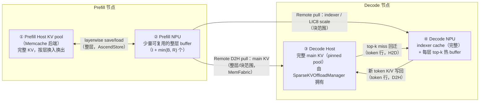
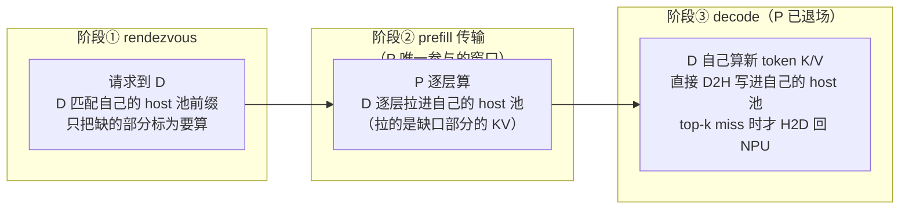

# vLLM-Ascend Layerwise + Sparse KV Offload 完整流程图解

> 依据：vllm-ascend main `4c5ee332`（2026-09-16）源码 + 合并后设计文档
> `docs/source/developer_guide/Design_Documents/layerwise_and_sparse_kv_cache_offloading.md`
> + RFC [#33398](https://github.com/vllm-project/vllm/issues/33398)（layerwise）、[#33980](https://github.com/vllm-project/vllm/issues/33980)（sparse decode）、[#48203](https://github.com/vllm-project/vllm/issues/48203)（合并设计）。
>
> 证据标记：**[源码]** = main 代码可直接定位；**[RFC]** = RFC 提出的设计/数字；**[差异]** = RFC 与 main 实现的演进差异；**[估算]** = 示意性推算，非代码保证。

---

## 0. 一句话理解

**这套特性解决一个问题：长序列推理时 KV cache 太大，NPU 装不下。**

做法是把"什么时候需要哪些 KV"分开处理：

- **Prefill（计算重）**：KV 按整层搬运，用少量可复用的物理 buffer + 传输与计算重叠来隐藏搬运延迟 → `AscendStoreConnector`（Layerwise Prefill Offload）。
- **Decode（计算轻、搬不动整层）**：完整 KV 常驻 Host 内存，NPU 只保留 indexer + 每层 top-k 热 buffer，每步只回迁 miss 的 token 行 → `SparseKVOffloadManager` + `SfaRemoteD2HConnector`（Sparse Decode Offload）。

一句话记忆：**Prefill 省容量靠"按层流水"，Decode 省容量靠"按 top-k 选择性回迁"**。[源码+RFC]

为什么 Decode 不能也用 layerwise？RFC #33980 的量化：整层加载与计算的时间比 ≈ `HBM 计算带宽 / DRAM→HBM 搬运带宽 ≈ 10×`，Decode 每步计算太轻，整层搬运根本藏不住；而稀疏注意力模型（如 DeepSeek-V3.2 topk=2048、GLM-5.2）attention 只用 top-k 个 token，所以只需要搬 top-k。[RFC]

**省的到底是什么：NPU 的 HBM。** KV 数据一个字节都没少——它被搬到了 host DRAM。本质是"用便宜的 host DRAM 和搬运带宽，买稀缺的 NPU HBM"（详见第 9 节资源账单）。

---

## 1. 全景：四个存储区域 + 三个组件

**[源码]** 设计文档 §2 的全景图（main 实现与此一致；"device memory"在 RFC 图中对应 NPU HBM）：



三个组件的分工 **[源码]**：

| 组件 | 节点 | 职责 |
|---|---|---|
| `AscendStoreConnector` | P | Layerwise Prefill Offload：经 Memcache 在 ①↔② 之间按层 save/load |
| `SfaRemoteD2HConnector` | P+D | P/D 之间传输：P 暴露 ② 的 buffer 并按层发就绪通知；D 通过 MemFabric 把 main KV 拉进 ③、indexer 拉进 ④ |
| `SparseKVOffloadManager` | D | 拥有 ③ 的 host pool 和 ④ 的 top-k 热 buffer；负责 LRU 驻留、miss 判定、回迁 |

注意数据所有权的非对称 **[源码]**：main K/V 在 P 侧是"常规分页 NPU cache"，拉到 D 侧进"TP 共享的 pinned CPU pool"；indexer K/V 则是每个 D TP rank 拉一份完整的 rank-local NPU 副本。

---

## 2. 端到端请求生命周期（最核心的一张图）

**[源码]** 一次请求从进来到开始 decode 的完整路径。P/D 之间没有直接推送 KV——**P 只"暴露"，D 主动"拉"**（pull 模型，RD2H = Remote Device To local Host）：


关键点 **[源码]**：

1. **D 的 block id 不出 D 节点**。P 只拿到 endpoint 和 token 计数去发布源地址——这是安全边界。
2. **按层流水**：P 算完 layer i 就立刻发 layer i，不用等整个请求算完；layer i+1 的传输与 layer i+1 的计算重叠。
3. **两种完成是分开的**：物理 buffer 完成（保护 P 复用）vs 请求完成（D 可开始推理）。D 即使收到前面所有层的 READ_DONE，也要等最后一层和所有 TP contributor 到终态才能 decode。

### 2.1 Rendezvous（会合阶段）是什么

**[源码]** `scheduler.py:302-345`（D 侧 `update_state_after_alloc`）。Rendezvous = P 和 D 在真正传数据之前"互相找到对方、交换联系方式、确认我准备好接收了"的握手过程。术语借自 RDMA/MPI 的 rendezvous protocol（先交换地址再传大块数据，区别于 eager 直接推）。

为什么必须有：① 请求先到 D 但算 prefill 的是 P，两边要就"这个请求"对上号；② pull 模型下 D 必须先告诉 P"我在哪个 IP、哪个端口、什么拓扑，随时可以来发就绪通知"。


最关键的设计：**D 的 block id 永远不出 D 节点**。`scheduler.py` 注释原文（翻译）：通过元服务器的 rendezvous 只带联系信息和 `do_remote_decode`；D 不把自己的 block id 发给 P——D 自己留着，等 P 的 READ_READY 到达时按 request_id 查回。（把 block id 发给 P 是 push 模型的遗留；pull 模式下 P 只需要 P 自己的源 block。）数据流向上，P 只发"源块地址"，D 收到后自己查"该落到我哪些块"，D 的内存布局对 P 完全透明。

### 2.2 为什么请求先到 D



按重要性排四个理由 **[源码]**：

1. **谁持有 KV 缓存，谁做前缀匹配。** 完整 main KV 的池子在 D 的 host 内存里，只有 D 能回答"这段 prompt 我已有多少 KV"。先到 D，才算出缺口、把 `cached_tokens` 告诉 P（代码就一句 `count = prompt_len - num_computed_tokens`）。
2. **Pull 模型要求"先有目的地，再发布源"。** D 先分好 main 块和 indexer 块才有地方拉；这也是"D 的 block id 不出 D"的前提。先到 P 就退化回 push 模型。
3. **D 是请求的"户主"。** 吐 token、流式返回、abort/重试都归 D；P 只是被雇来算一次 prefill 的临时工。
4. **Proxy 的准入控制以 D 容量为中心。** decode 是长活，系统容量瓶颈在 D 侧并发数；先选 D 再找 P，调度才以瓶颈为中心。

**"增量拉取"的准确含义**：① 前缀缓存粒度——D 命中的部分不找 P，只把缺的后缀交给 P 算（rendezvous 广播的 `remote_cached_tokens`）；② prefill 期间按层流水拉。**decode 期间没有任何 P→D 拉取**——每步新 K/V 是 D 自己算的，直接 D2H 追加进自己的 host 池；唯一的搬运动作是 top-k miss 行 H2D 回 NPU，全程在 D 节点内部。

---

## 3. P 端细节：Layerwise Prefill Offload 怎么省内存

### 3.1 Buffer 规划

**[源码]** 把 `N` 个有 KV 的逻辑层映射到少量物理 buffer（`build_layerwise_cache_layout:128`）：

```text
N = 有 KV 的逻辑层数
I = 独享 buffer 的层数（layerwise_independent_layers，默认 [0]）
R = N - I（可共享的层数）
B = 配置的 shared buffer 数（layerwise_num_shared_buffers）

物理 buffer 数 = I + min(B, R)
main-KV NPU(HBM) 占比 ≈ 物理buffer数 / N
```

Round-robin 分配：第 `i` 个复用层落到 `slot = i % B`，即**第 i 层和第 i+B 层共用同一物理 buffer**。规格不兼容的层绝不共享（初始化时校验，直接 fail）。MTP 层也参与同一套规划。

### 3.2 每层的执行流水

**[源码]**（pool_worker `process_layer_data:2254` / `_submit_ready_layer_loads:2296` / `wait_for_layer_load:2325` / `save_kv_layer:2366`）：


### 3.3 复用不变式（正确性的核心）

**[源码]** 一个物理 buffer 在其**上一个住户的所有消费者**完成之前不可覆盖。联合部署里这扇门有两道闩，由 `AscendMultiConnector` 组合：


**[源码]** main 上的实现：`AscendMultiConnector._configure_layerwise_reuse_completion`（`ascend_multi_connector.py:42`）识别出 `supports_layerwise_buffer_reuse=True` 且提供 `wait_for_layer_reuse` 的 connector（即 RD2H producer），把组合等待器经 `set_external_slot_release_waiter` 注入 AscendStore。完成按**物理 storage slot** 而非逻辑层名跟踪（main-KV slot 和 indexer slot 是分开的两个 gate，`_infer_layer_storage_slots`）。

### 3.4 调参：`layerwise_num_shared_buffers` 设多少

**[源码]** 默认值陷阱：**不配置时默认等于总层数**（`build_layerwise_cache_layout:134-137`：`None → num_shared_buffers = num_layers`），即完全不共享、不省 HBM。想要容量收益必须显式设小。

用户文档建议：**从 2～4 起步**（"Start with two to four and tune for memory and transfer bandwidth"）。

以 61 层模型为例 **[估算]**：

| B | 物理 buffer | HBM main-KV 占比 | 流水窗口（lookahead） | 风险 |
|---|---|---|---|---|
| 1 | 2 | ~3% | 0（纯串行 load→算→save） | 延迟完全暴露，RFC #33398 明说不划算 |
| 2 | 3 | ~5% | 1 层 | `T_load ≤ T_compute` 才藏得住 |
| 4 | 5 | ~8% | 3 层 | 能容忍 ~3× 计算时间的传输 |
| 不设 | 61 | 100% | — | 等于没开共享 |

- B 每加 1，HBM 线性多一份整层 KV，收益边际递减；预取默认上限 `min(B, 8)`（`_DEFAULT_MAX_PREFETCH_LAYERS=8`），超过 8 的深度基本浪费。
- **实战倾向**：单独部署（只做 prefill 卸载）取 2；**联合 P/D 部署取 3–4**——slot 复用门多了"等 D 端 READ_DONE"一道闩，D 的拉取延迟会挤占流水窗口，多一两个 buffer 等于给远端读留余量。
- 配套参数：`layerwise_independent_layers` 默认 `[0]`（首层在请求起步关键路径上，且第 0 层会一次性预提交多个 load 暖管，`_submit_ready_layer_loads:2317`）；`layerwise_prefetch_layers` 默认 `min(B,8)`，一般不动。

---

## 4. D 端细节：Sparse Decode 每步做什么

**[源码]**（`SparseKVOffloadManager.offload_new_kv:1077` / `onload_topk_kv:1215`，attention 侧 `sfa_kv_offload.py`）。请求就绪后，每个 decode step 走这 7 步：


为什么划算 **[RFC]**：热 buffer 开 `2×topk` 时命中率 **80%–90%**（RFC #48203，DeepSeek-V3.2 实测）；GLM-5.2 场景 NPU main KV 可压到约 **1/16**，等价 16× 更长 max_model_len 或 16× batch（RFC 估计值）。RFC #33980 提出的 top-k 预取（相邻步相似度 >80%，FreeKV）在 main 上落地为 `prepare_fused_overlap_external_plan` + `csrc/attention/fused_sparse_attention_overlap` 算子；LRU compact 移入 `csrc/torch_binding.cpp:2191+` 的 `sparse_kv_lru_resident_compact*` ops。**[差异]** RFC #33980 原设计"新 KV 先写 GPU 常规块再整块 offload"；main 更激进：**decode 路径根本没有 NPU main cache**，新 K/V 直接 D2H。

### 4.1 D 的 host 池里是全量 KV 吗——是，权威副本

**[源码]** 对每个在途请求，D host 池存的是**从头到当前、全部 token、全部层的完整 main K/V**，且是权威副本（authoritative copy），不是缓存。

| 数据 | 位置 | 是否全量 |
|---|---|---|
| **main K/V** | D host 池 | ✅ 完整历史、所有层，权威副本 |
| indexer K/V | D NPU HBM | ✅ 完整，但 rank-local |
| LIC8 scale（可选） | D NPU HBM | 跟随 indexer |
| top-k 热 buffer | D NPU HBM | ❌ 每层一小块缓存，可被 LRU 淘汰 |

三个精确限定：

1. **物理上是"TP 拼起来的全量"**：每 DP rank 一个独立池，池内 TP 共享；从 P 拉时每个 D TP rank 只拉**不相交份额**，decode 期间新 token 行由 TP rank 0 统一写（新 K/V 本是 TP 复制）。
2. **全量 ≠ 无限，持续增长且有预算**：每 step 追加一行，直到 max_model_len；池容量由 `dram_size_per_dp_GB` 配置（见 4.2）。
3. **请求结束后 KV 不丢，变成 CPU 前缀缓存**：多轮对话第二轮 `num_computed_tokens > 0`，P 只算缺的后缀；直到被 CPU 池淘汰才释放。

为什么必须全量：**indexer 每步对全历史逻辑位置做 top-k 选择，下一步选中谁不可预知**（80–90% 命中率意味着每步仍有 10–20% miss，可能落在任意久远位置）——任意历史 token 必须随时够得着，删任何一段都会算错。

### 4.2 host 池开多大：三上界取最小

**[源码]** 池大小不是固定值，由 `plan_sparse_kv_offload_memory`（`sparse_kv_offload_manager.py:235`，入口 `worker.py:524`）规划，以"块"为单位（host 侧 main KV 和 NPU 侧 indexer 共享同一块号空间）：

```text
dram_limit_blocks    = (dram_size_per_dp_GB×GiB − 对齐预留) ÷ host每块字节数
npu_limit_blocks     = NPU 剩余可用内存 ÷ device每块字节数（indexer等）
workload_limit_blocks = ceil(max_model_len/block_size) × max_num_seqs + 1   # +1 空块；DCP 时每rank除以 dcp_world_size
final_num_blocks     = min(三个上界)          # limiting_factor 记录谁卡住
host 池实际大小      ≈ final_num_blocks × host每块字节数
```

| 上界 | 类型 | 说明 |
|---|---|---|
| DRAM | 供给侧 | `dram_size_per_dp_GB`，**默认 128 GB**（用户指南示例也 128）。扣每 host 层 12 MiB 对齐预留（`3×2MB`，`:167`） |
| NPU | 供给侧 | 块数不能超过 NPU 侧 indexer 能容纳的规模——池子不是想开多大就多大的隐藏约束 |
| Workload | **需求侧** | 调度器最坏情况在途块数 = max_num_seqs 个请求全部撑到 max_model_len；防止 malloc 永远用不到的内存 |

分配细节 **[源码]**：只有 **TP rank 0 真正 malloc**（`allocate_kv_cache_tensors_for_sparse_kv_offload:316`，2MB 对齐），其余 rank 拿 `None` 经 MemFabric 广播的 GVA 访问同一块内存——128 GB 是整个 DP rank 池一份，不是每 TP rank 一份。DRAM 是短板而 NPU 有富余时启动打 warning 提示调大 `dram_size_per_dp_GB`。看实际大小搜启动日志 `Sparse KV offload memory plan: npu_limit=… dram_limit=… workload_limit=… final=… (xxx limited), host=… GiB`。

**workload 上界折算多少内存 [估算]**（DeepSeek-V3.2 类 MLA：main KV ≈ 68.6 KiB/token、block_size=16 → 每块约 1.07 MB）：

| max_model_len | max_num_seqs | workload 块数 | 对应 host 内存 | 谁是短板 |
|---|---|---|---|---|
| 8K | 64 | ~32.8K | **~35 GB** | workload（远小于 128G） |
| 8K | 256 | ~131K | ~140 GB | DRAM（128G） |
| 32K | 256 | ~524K | ~560 GB | DRAM |
| 128K | 32 | ~262K | ~280 GB | DRAM |

解读：小配置时 workload 先卡住，池子只开 35 GB 不浪费；大配置时 DRAM 128G 先卡住，意味着**跑不满"max_num_seqs 个满长请求"**（128 GB ÷ 68.6 KiB/token ≈ 190 万 token ≈ 32K 请求约 58 个在途），超出部分由调度准入挡（`get_num_cpu_blocks` 报池子实时余量）。`keep_device_kv_cache`（默认 `false`）打开会让 NPU 同时保留完整 main KV（失去省内存意义，对照/debug 用），NPU 上界按 host+device 页大小之和计算。

---

## 5. 把三张图拼起来：一次完整请求的全流程


---

## 6. 四条传输路径的粒度（为什么粒度不同）

**[源码]** 设计文档 §2 的粒度表——粒度由"地址何时可知"决定：

| 路径 | 粒度 | 目的 |
|---|---|---|
| P NPU → D host（main KV） | 层/块范围 | 填充 D 的完整 main KV 历史 |
| P NPU → D NPU（indexer/scale） | indexer 张量内的块范围 | 填充 rank-local indexer（+可选 LIC8） |
| D 当前 KV → D host | **token 行** | 追加新生成的 KV（D 没有 NPU main cache） |
| D host → D NPU（top-k miss） | **token 行** | 只补热 buffer 缺的行 |

P→D 的地址在每层算完就知道，可以大块发；decode 的 miss 地址要等 top-k 选择和驻留查表之后才知道，只能稀疏 token 行拷贝。

## 7. 不等 TP 的贡献者分组

**[源码]** 联合部署要求 `p_tp ≥ d_tp` 且整除，`ratio = p_tp / d_tp`，P rank `p_rank` 映射到 `d_rank = p_rank // ratio`：

- main KV 在 P 侧是复制的 → 每组只有 **member 0** 搬该 D rank 拥有的 main 份额；
- indexer → 组内各 P rank 搬**不相交的区间**，拼起来才是完整的 D rank-local indexer；
- **没活的 contributor 也必须回 ack**，否则完成门会死锁。

## 8. SfaRemoteD2HConnector 接口速览

**[源码]** `kv_p2p/sfa_pd_rd2h/connector.py:44`，继承 `KVConnectorBase_V1 + SupportsHMA`，类属性 `supports_layerwise_buffer_reuse = True`。它是**薄委托层**，按 `role × kv_role` 组装四个组件之一：P/D × Scheduler/Worker（`SFAPDRD2HProducerScheduler` / `SFAPDRD2HScheduler` / `SFAPDRD2HProducerWorker` / `SFAPDRD2HConsumerWorker`）。构造时硬校验：P 端必须关 `sparse_kv_offload`，D 端必须开。

三组接口：

1. **vLLM V1 标准钩子**：`get_num_new_matched_tokens:118`（D 报异步匹配）、`update_state_after_alloc:122`（rendezvous）、`build_connector_meta:131`、`request_finished:135`、`register_kv_caches:150`、`get_finished:154`、`start_load_kv:164`、`save_kv_layer:187`、`wait_for_save:213`、`shutdown/close:225/:231`。
2. **vllm-ascend 按层扩展**（核心）：`wait_for_layer_load:168`（P 端每层 attention 前等 D 读完该层触碰的所有物理 slot；D 端 no-op）、`on_kv_cache_written:202`（P 端 scatter 完立即提前派发 pull 通知）、`wait_for_layer_send:236`、`wait_for_layer_reuse:242`（暴露给 MultiConnector 双闰门的第二道闩）。
3. **辅助**：`get_num_cpu_blocks:220`（调度准入阈值）。

干活的不在类里：scheduler 逻辑在 `scheduler.py`，P 端发送/完成门在 `worker.py + send_thread.py`，D 端拉取在 `read_thread.py`，协议常量 `MF_META/READ_READY_BATCH/READ_DONE/READ_FAILED` 在 `protocol.py:13-22`。

## 9. 资源账单：省的是什么、花的是什么

**省的是 NPU 的 HBM**（设计文档明说"RFC 图里的 device memory 对应 NPU HBM"）。KV 数据一个字节没少——被搬到 host DRAM。layerwise 是"搬家"不是"压缩"；省出的 HBM 也不会闲着：KV 总块数按可用 HBM 规划，每 token 的 KV-HBM 成本缩小近 `N/(I+B)` 倍 → 同样 HBM 容纳的 KV token 数扩大对应倍数 → 更长上下文 / 更大 batch（RFC"16×"的来源）。

| 资源 | P 端 layerwise | D 端 sparse |
|---|---|---|
| **NPU HBM** | ✅ 省（main-KV 按 `(I+B)/N` 缩） | ✅ 省（main KV 归零，只留 indexer+topk，约 1/16） |
| Host DRAM | ❌ 花（P 侧全量 KV 池，Memcache） | ❌ 花（D 侧全量 KV 池，默认 128 GB/DP rank） |
| 互联/总线带宽 | ❌ 花（每层 save/load + P→D MemFabric 拉取） | ❌ 花（每步 miss 行 H2D + 新 token D2H） |
| 计算 FLOPs | 不变 | 不变 |

## 10. 当前边界（main 实测限制）

**[源码]** 设计文档 §8 + `ascend_config.py` 校验：

- Layerwise 共享 buffer offload：需 Memcache 后端 + eager 模式；
- Sparse Decode：需 Model Runner V1 + SFA/MLA 稀疏注意力模型；main KV 必须 BF16；LIC8 量化仅限 device 侧 indexer；
- 支持 DP/TP；**不支持 CP/PP**、不支持 hybrid KV layout、不支持 model_runner_v2；
- 联合部署要求 P TP ≥ D TP 且整除；
- Remote D2H 后端仅 MemFabric（`sdma`/`device_rdma` 走 A3，`device_urma` 走 A5，P/D 必须一致）；
- layerwise buffer 复用暂不能与 `MooncakeLayerwiseConnector` 组合（缺 per-buffer 完成门，规划中）；
- 读失败无 connector 级重试：READ_FAILED → 失效目标 + 释放 P 侧等待 + 出错；丢 ack 或 D 进程消失**不是终态**，P 会一直等。

## 11. 组件 → 代码速查（main `4c5ee332`）

| 组件/机制 | 位置 |
|---|---|
| 布局规划（buffer 数默认值、round-robin、shared_by 合并） | `kv_pool/ascend_store/layerwise_cache_layout.py`（`build_layerwise_cache_layout:128`、`apply_layerwise_kv_cache_plan:297`） |
| P 层流水（load/save/prefetch/等待） | `kv_pool/ascend_store/pool_worker.py`（`process_layer_data:2254`、`_submit_ready_layer_loads:2296`、`wait_for_layer_load:2325`、`save_kv_layer:2366`） |
| RD2H 连接器（四角色）+ 接口 | `kv_p2p/sfa_pd_rd2h/connector.py:44` |
| Rendezvous（D 广播联系方式、block id 不出 D） | `kv_p2p/sfa_pd_rd2h/scheduler.py:302-345` |
| 协议常量 MF_META / READ_READY_BATCH / READ_DONE / READ_FAILED | `kv_p2p/sfa_pd_rd2h/protocol.py:13-22` |
| P 逐层就绪 + per-slot 完成门 | `kv_p2p/sfa_pd_rd2h/send_thread.py`（`record_p_save_event:168`、`_signal_layer_done:364`）；worker `:481-485,599` |
| D 批量拉取 | `kv_p2p/sfa_pd_rd2h/read_thread.py`；worker `SFAPDRD2HConsumerWorker` |
| 双闰门组合 | `kv_transfer/ascend_multi_connector.py`（`_configure_layerwise_reuse_completion:42`、`_wait_for_external_slot_release:66`） |
| Sparse 管理（host pool、LRU、miss 回迁） | `kv_transfer/sparse_kv_offload/sparse_kv_offload_manager.py`（`offload_new_kv:1077`、`onload_topk_kv:1215`） |
| D 侧内存三上界规划（池子开多大） | 同上 `plan_sparse_kv_offload_memory:235`；入口 `worker/worker.py:524`；每请求块数 `core/kv_cache_interface.py:174` |
| LRU compact 原生实现 | `csrc/torch_binding.cpp:2191+`（`sparse_kv_lru_resident_compact*`） |
| sparse attention 集成 | `attention/sfa_kv_offload.py`（`AscendSFAKVOffloadImpl:162`） |
| 配置校验（dram_size_per_dp_GB 默认 128 等） | `ascend_config.py:430,1450-1530` |
| 用户文档 / 设计文档 | `docs/.../feature_guide/layerwise_and_sparse_kv_cache_offloading.md`、`docs/.../Design_Documents/layerwise_and_sparse_kv_cache_offloading.md` |

（路径前缀均为 `vllm_ascend/`；行号基于 main `4c5ee332`。）

## 12. RFC → main 的演进差异清单

| RFC 设计 | main 实现 |
|---|---|
| #33398：通用 layerwise，接 LMCache/CPUBackend | 定制为 AscendStore + **Memcache 后端**，且与 RD2H 组成双闰门 |
| #33980：新 KV 先写 GPU 常规块再整块 offload | decode 路径**无 NPU main cache**，新 KV 直接 D2H |
| #33980：top-k 预取（跨步/跨层相似性） | `prepare_fused_overlap_external_plan` + `fused_sparse_attention_overlap` 算子（规划/写回/attention 重叠） |
| #48203：P/D 混合布局（colocation hybrid KV） | 不支持；colocation 仅 debug 路径，生产形态是 disagg |
| #33398：Ascend 后端走 MemFabric/UB >100GB/s | 已落地：MemFabric 唯一后端，sdma/device_rdma(A3)、device_urma(A5) |
