# vLLM-Ascend 与 Mooncake Store 在昇腾栈下的调用路径

> 本文基于本地源码静态分析，版本如下：
>
> - vLLM-Ascend：`af337df`
> - Mooncake：`408b831b`
> - vLLM：`e3fe212e`
>
> 当前分析环境没有昇腾 NPU，因此不代表已经完成硬件运行验证。

## 阅读路线：先看四张主流程图

四张图分别对应控制/数据边界、Save、Load 和地址初始化/分配/传输；后续章节再按调用链
逐层展开。阅读时建议按下面顺序：

```text
总图 A：控制面与数据面边界
  -> 总图 B：Save（NPU -> Store replica）
  -> 总图 C：Load（Store replica -> NPU）
  -> 总图 D：地址初始化/分配/传输
  -> 第 2~17 节：按调用链展开
  -> 附录 A~G：对应主题的源码级深挖
```

### 总图 A：控制面和数据面

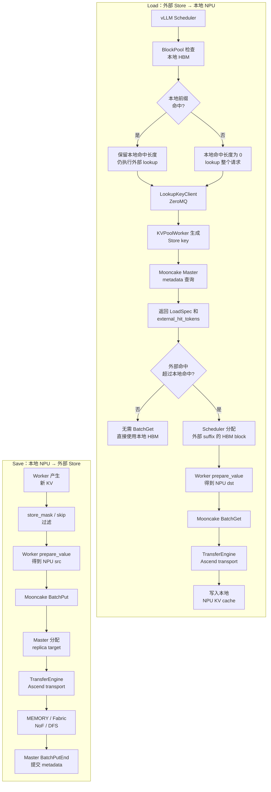

图中有两条独立链路：

| 链路 | 含义 | 数据方向 |
| --- | --- | --- |
| **Load**（上半部分） | 先检查本地 HBM；未命中的前缀再到外部 Store 查找，并把命中的 KV 读回 NPU | 外部 Store → 本地 NPU HBM |
| **Save**（下半部分） | 将本轮生成的新 KV 过滤后写入 Mooncake，由 Master 为对象分配副本位置 | 本地 NPU HBM → 外部 Store |

决策节点的两个分支含义如下：

| 分支 | 含义 |
| --- | --- |
| `是` | 本地 HBM 已命中一段前缀；当前实现仍会发起外部 lookup，但只在外部命中超过本地命中时加载差额 suffix |
| `否` | 本地 HBM 没有可复用前缀；外部 lookup 决定可加载的前缀长度 |

因此，图中“是/否”都向下汇合到外部 lookup 是正确的，但不代表两条路径都会执行
`BatchGet`：当 `external_hit_tokens <= local_hit_tokens` 时，Scheduler 不再分配新 HBM
block，也不会发起外部 KV 传输。

图中的两条控制/数据边界如下：

| 边界 | 负责方 | 关键数据 |
| --- | --- | --- |
| 命中和调度控制面 | vLLM Scheduler、`KVCacheManager`、`BlockPool`、Lookup IPC | block hash、命中 token 数、`LoadSpec` |
| 对象存储和数据面 | Mooncake Client、Master、TransferEngine、Ascend transport | key、`Slice`、`Replica::Descriptor`、传输任务 |

Master 的 RPC 只返回“副本在哪里”；真正的 KV 字节通过 TransferEngine/ADXL/HCCL 等
数据面传输，不会塞进 metadata RPC。

### 总图 B：Save 主链路

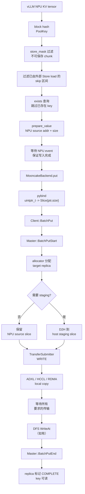

Save 中最重要的地址关系是：

```text
source address = vLLM 当前 worker 的 NPU KV tensor 地址
target address = Master 在某个 Store segment/Fabric segment 中分配的地址
```

`MooncakeBackend.put()` 不负责计算 target，也不直接申请 target；它把 source 地址和
长度交给 Client。target 在 `BatchPutStart` 之后才由 Master 返回。

### 总图 C：Load 主链路

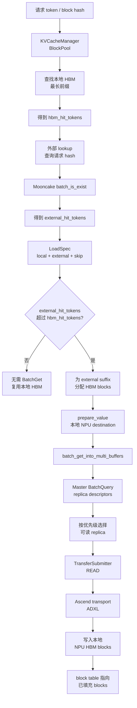

Load 的两个命中数不要混淆：

```text
vllm_cached_tokens   = 本地 HBM BlockPool 已经拥有的前缀
kvpool_cached_tokens = 本地 HBM + Mooncake 外部 Store 合并后的前缀
```

外部命中不会覆盖本地 HBM block；Scheduler 只为外部命中的 suffix 新分配 block，再让
Worker 将 Store 数据读回这些新 block。

具体来说，`external_hit_tokens` 是外部 lookup 返回的前缀长度，Scheduler 用
`external_hit_tokens - hbm_hit_tokens`（小于 0 时按 0 处理）决定是否需要分配 block
和执行 `BatchGet`。

### 总图 D：地址初始化、分配和传输

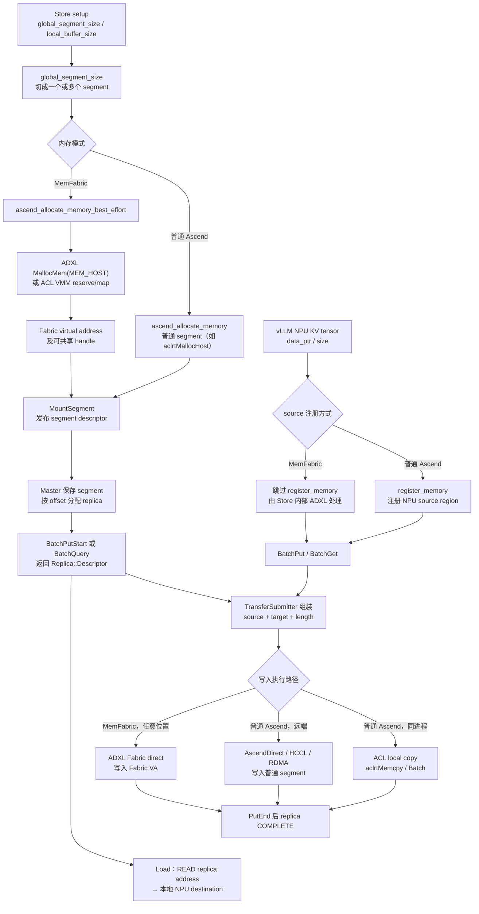

地址分配有三种完全不同的对象：

| 地址 | 谁分配 | 生命周期 | 方向 |
| --- | --- | --- | --- |
| vLLM KV tensor | PyTorch/NPU allocator | worker 生命周期 | Save 的 source、Load 的 destination |
| Mooncake local buffer | `ClientBufferAllocator` | Store client 生命周期 | staging、文件读回等临时空间 |
| global/Fabric segment 中的 object buffer | Master allocator | object/replica 生命周期 | Save 的 target、Load 的 source |

`Replica::Descriptor` 只是 target 的“地址说明书”：它包含 replica 类型、endpoint、
segment/buffer 地址和状态；它不包含 KV 字节本身。

总图 D 中两种模式的关键差异如下：

| 阶段 | 普通 Ascend | MemFabric |
| --- | --- | --- |
| segment 分配 | `ascend_allocate_memory()` 分配普通 host/device segment | `ascend_allocate_memory_best_effort()` 得到 Fabric VA（ADXL `MEM_HOST` 或 ACL VMM） |
| vLLM source 注册 | 调用 `register_memory`，让普通 TransferEngine 识别 NPU 地址 | 跳过 `register_memory`，由 Store 内部 ADXL executor 直接处理地址 |
| Save 写入 | 同进程可走 ACL local copy；远端走 AscendDirect/HCCL/RDMA | 不走普通 local copy，统一由 ADXL 将 NPU bytes 写入 Fabric VA |
| Load 读回 | 从普通 replica 地址经对应 transport 写入 NPU destination | 从 Fabric VA 经 ADXL READ 写入 NPU destination |

两种模式最终都是真实的字节拷贝：`put` 把 NPU source 的内容写入 target，`get` 把
replica 内容写入 NPU destination；Store 不会永久保存或引用 vLLM 的 source 指针。

### 读图前的术语速查

| 术语 | 在本文中的准确含义 |
| --- | --- |
| `object` | 一个 Store key 对应的完整逻辑 KV 对象，通常是一个 token chunk 在某个 TP shard 上的数据 |
| `slice` | 一个 object 的一段连续内存；一个 object 可以有多个 slice（例如 K、V 或多层数据） |
| `replica` | 同一个 object 的一份完整副本，可能位于 MEMORY/Fabric、NoF SSD、LOCAL_DISK 或 DFS |
| `segment` | Store client 挂载给 Master 的一段可分配容量；Master 从中切出 object replica |
| `source` | Save 时 vLLM 当前 NPU 地址；Load 时则是 Store replica 中的远端地址 |
| `target` | Save 时 Master 分配的 Store 地址；Load 时 vLLM 新分配的本地 NPU 目标地址 |
| `endpoint` | 能执行传输的一端（通常是 `host:port` 或设备传输端点），不是单纯的 key 或 hostname |
| `staging` | 传输前的临时中转 buffer，改变 source 地址，不创建额外 replica |
| `HBM hit` | vLLM `BlockPool` 已经持有本地 NPU block |
| `Store hit` | Mooncake metadata 找到至少一个可读 replica descriptor |

### 章节对应关系

前面章节已经把后续源码深挖放回实际调用点：

| 主线章节 | 需要重点理解的补充主题 | 源码级展开 |
| --- | --- | --- |
| 第 3 章 | `global_segment_size` 如何切 segment、普通内存与 Fabric 分配差异 | 附录 A |
| 第 5 章 | DP/TP 如何影响 key、slice 和地址归属 | 附录 B |
| 第 6 章 | HBM 命中先于外部 Store 命中、suffix/skip 边界 | 附录 D |
| 第 7 章 | `store_mask`、skip 区间、Save 去重 | 附录 C、D |
| 第 8~10 章 | `Slice`、staging、Replica target、Ascend/MemFabric 传输 | 附录 E、F |
| 第 9 章 | `ReplicateConfig`、NoF/DFS/offload、Master 放置和多副本 | 附录 G |

正文先解释“这一步为什么存在、输入输出是什么”，对应的末尾章节再给出源码位置、
公式和边界条件；这样可以避免直接从实现细节跳回主流程。

## 1. 先区分三条路径

| 路径 | 主要类 | 地址模型 | 是否使用 Mooncake Store |
|---|---|---|---|
| 普通 KV Store | `AscendStoreConnector + MooncakeBackend` | key 查询 replica，再把数据传输到本地地址 | 是 |
| direct P2P | `MooncakeConnectorV1` | P/D worker 交换地址后直接传输 | 否 |
| layerwise Store | `AscendStoreConnector` + `use_layerwise` | 每层独立 key，调用 Store `put/get` | 是 |
| layerwise GVA | `MemcacheBackend` | GVA + `batch_copy` | 不是 Mooncake 普通路径 |

本文重点是第一、第三条路径。

总体链路：

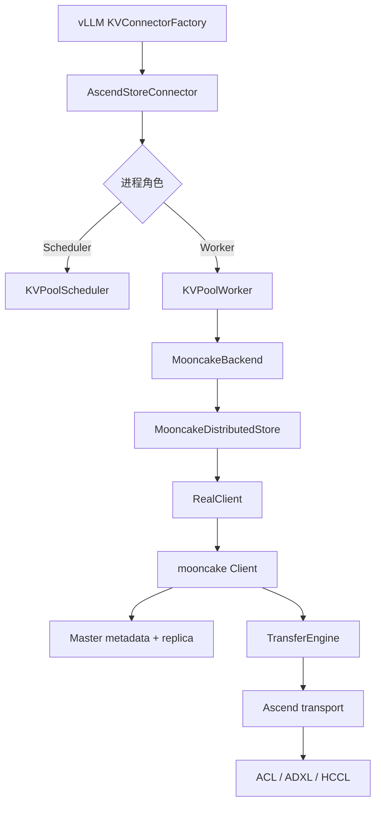

注册入口在：

`vllm-ascend/vllm_ascend/distributed/kv_transfer/__init__.py:21-49`

```python
KVConnectorFactory.register_connector(
    "AscendStoreConnector",
    "vllm_ascend.distributed.kv_transfer.kv_pool.ascend_store.ascend_store_connector",
    "AscendStoreConnector",
)
```

`AscendStoreConnector` 根据 role 创建 Scheduler 或 Worker，见：

`vllm_ascend/vllm_ascend/distributed/kv_transfer/kv_pool/ascend_store/ascend_store_connector.py:76-123`

---

## 2. Mooncake Store 初始化

### 2.1 配置加载

环境变量：

```bash
MOONCAKE_CONFIG_PATH=/path/to/mooncake.json
```

配置结构定义在：

`vllm-ascend/vllm_ascend/distributed/kv_transfer/kv_pool/ascend_store/backend/mooncake_backend.py:269-322`

关键字段：

```python
MooncakeStoreConfig(
    metadata_server="etcd://...",
    global_segment_size=...,
    local_buffer_size=...,
    protocol="ascend",
    device_name="",
    master_server_address="...",
    preferred_segment=True,
    prefer_alloc_in_same_node=True,
)
```

### 2.2 普通 Ascend 模式

当 `ASCEND_ENABLE_USE_FABRIC_MEM != 1` 时，vLLM 先创建全局 TransferEngine，再把底层 C++ engine 传给 Store：

`vllm-ascend/vllm_ascend/distributed/kv_transfer/utils/mooncake_transfer_engine.py:11-29`

```python
transfer_engine.initialize(
    hostname,
    "P2PHANDSHAKE",
    "ascend",
    device_name,
)
```

`MooncakeBackend._setup_store()`：

`vllm-ascend/vllm_ascend/distributed/kv_transfer/kv_pool/ascend_store/backend/mooncake_backend.py:118-134`

```python
transfer_engine = global_te.get_transfer_engine(local_hostname, device_name=None)
local_seg = local_hostname + ":" + str(transfer_engine.get_rpc_port())

store.setup(
    local_hostname=local_seg,
    metadata_server=config.metadata_server,
    global_segment_size=config.global_segment_size,
    local_buffer_size=config.local_buffer_size,
    protocol="ascend",
    rdma_devices=config.device_name,
    master_server_addr=config.master_server_address,
    engine=transfer_engine.get_engine(),
)
```

流程：

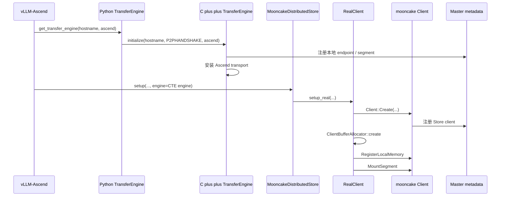

TransferEngine 的 C++ 初始化入口：

`mooncake/mooncake-integration/transfer_engine/transfer_engine_py.cpp:188-255`

```cpp
TransferEnginePy::initialize(...)
    -> initializeExt(...)
    -> engine_->init(...)
```

### 2.3 Fabric Memory 模式

当：

```bash
ASCEND_ENABLE_USE_FABRIC_MEM=1
```

走：

`vllm-ascend/vllm_ascend/distributed/kv_transfer/kv_pool/ascend_store/backend/mooncake_backend.py:135-146`

```python
local_seg = local_hostname
local_buffer_size = 0
store.setup(..., protocol="ascend")
```

与普通模式的差异：

| 项目 | 普通模式 | Fabric Memory |
|---|---|---|
| `local_hostname` | `host:rpc_port` | `host` |
| `local_buffer_size` | 配置值 | 0 |
| Python TransferEngine | 显式传入 Store | 不显式传入 |
| global segment | 普通 allocator | `ascend_allocate_memory_best_effort` |
| vLLM KV buffer 注册 | 调用 `register_memory` | 跳过 |

---

## 3. Store 自己的内存分配

### 3.1 Local buffer

`RealClient::setup_internal()` 在 `local_buffer_size > 0` 时创建 Store 本地 buffer：

`mooncake/mooncake-store/src/real_client.cpp:871-901`

```cpp
client_buffer_allocator_ = ClientBufferAllocator::create(
    local_buffer_size,
    protocol,
    should_use_hugepage,
    use_spdk_dma_for_client_buffer);

client_->RegisterLocalMemory(
    client_buffer_allocator_->getBase(),
    local_buffer_size,
    kWildcardLocation,
    false,
    true);
```

这是 Mooncake 管理的对象存储/临时空间，不是 vLLM 的 KV cache tensor。

### 3.2 Global segment

`global_segment_size` 会被切分成若干 segment：

`mooncake/mooncake-store/src/real_client.cpp:974-1073`

普通模式：

```cpp
ptr = allocate_buffer_allocator_memory(segment_size, protocol);
```

Fabric Memory：

```cpp
ptr = ascend_allocate_memory_best_effort(
    segment_size, protocol, &actual_size);
```

分配后调用：

```cpp
client_->MountSegment(ptr, mount_size, protocol, seg_location);
```

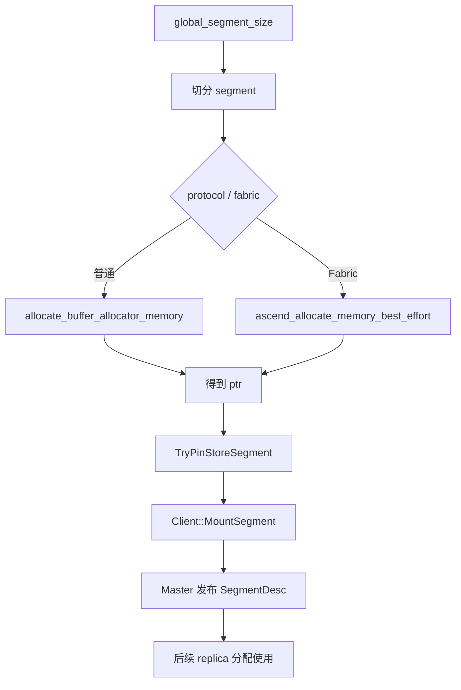

这里的两个“发布/挂载”动作都属于控制面，先不要把它们理解成 KV 数据传输：

| 动作 | 主要含义 | 不负责什么 |
| --- | --- | --- |
| `Client::MountSegment(ptr, mount_size, protocol, seg_location)` | Store client 把自己拥有的一段可分配内存（`ptr`、大小、协议和位置）登记到 Mooncake，并请求 Master 接受这段 segment。成功后，该 segment 才能作为对象副本的候选存储空间。 | 不为某个 key 分配 object，不拷贝 KV 字节，也不创建 replica 内容。 |
| Master 发布 `SegmentDesc` | Master 保存这段 segment 的全局描述（segment ID、endpoint/location、容量/地址信息、协议等），并建立对应的 allocator/free-space bookkeeping，供后续 `BatchPutStart` 选择 segment 和分配 offset。 | 不承载 KV payload；不会因为发布 descriptor 就代表某个 object 已经写入或可读。 |

可以这样区分两个 descriptor：

```text
SegmentDesc
  = “整段可分配空间在哪里、容量多大、由哪个 endpoint 提供”

Replica::Descriptor
  = “某个 key 的副本已经从这段空间切出了哪一段 offset、大小和状态”
```

因此完整时序是：`MountSegment` 先把整段容量挂到 Master，之后 `BatchPutStart` 才从
`SegmentDesc` 对应的 allocator 中切出 object 的目标区间，生成 `Replica::Descriptor`；
真正的 KV 字节要等后续 `WRITE` 传输和 `BatchPutEnd` 才写入并标记为可读。

这里要先建立一个重要区分：`global_segment_size` 是“这个 Store client 对外贡献的可分配
容量”，不是某个 KV object 的大小，也不是 vLLM HBM 的大小。初始化时它先被切成一个或
多个 `Segment`，挂载到 Master；之后每次 `BatchPutStart` 才从这些 segment 中切出某个
object 的 target buffer。

切分算法的直观规则是“在传输后端允许的最大段大小内，取最少段数，再尽量均衡每段”：

```text
R = 当前还没切的容量
L = split_limit（如果协议没有限制，则不存在）
A = allocator 对齐粒度

aligned_limit  = floor(L / A) * A
segment_count = ceil(R / aligned_limit)
balanced_size = ceil(R / segment_count)
next_segment  = 向上对齐 balanced_size，再限制不超过 R
```

因此不是简单地重复切出固定的 `L`；最后一段也可能比前面的段小。`ascend` 普通模式
通常没有 `split_limit`，于是整个 `global_segment_size` 可能就是一个 segment；Ascend
Agent Mode/Fabric 模式还会受设备数或 Fabric allocator 能力约束。完整公式、协议表和
数值例子见附录 A。

---

## 4. vLLM KV Cache 地址注册

必须区分：

```text
Mooncake global segment
    !=
vLLM 模型实际使用的 KV cache tensor
```

vLLM 的 KV cache 由 PyTorch/NPU allocator 创建，然后显式注册给 TransferEngine。

### 4.1 Block 元数据

`vllm-ascend/vllm_ascend/distributed/kv_transfer/kv_pool/ascend_store/pool_worker.py:685-694`

```python
tensor_num_blocks = cache.shape[0]
block_size_scale = tensor_num_blocks // self.num_blocks

block_len = cache[0].numel() * cache.element_size() * block_size_scale
block_stride = cache.stride(0) * cache.element_size() * block_size_scale
region_len = (self.num_blocks - 1) * block_stride + block_len
```

对于 block `b`：

```text
block_addr(b) = base_addr + b * block_stride
```

### 4.1.1 Block、object、slice 和 segment 的关系

这里需要区分“KV cache 数据”和“Block 元数据”：Torch/NPU allocator 分配的是 KV cache
tensor 的实际字节；vLLM 的 `KVCacheBlock`、`block_id`、引用计数和 block table 只是管理
这些字节的元数据。Paged Attention 通过 block table 把请求中的逻辑 token block 映射到
物理 `block_id`，再由上面的公式得到 NPU 地址：

```text
prompt tokens
  -> 逻辑 token block / chunk
  -> vLLM block table
  -> physical block_id
  -> NPU KV cache address
```

Mooncake 不读取 block table，也不理解 token 位置；它只接收 Worker 根据 token chunk 和
物理 block 计算出的 key、地址和大小。关系可以概括为：

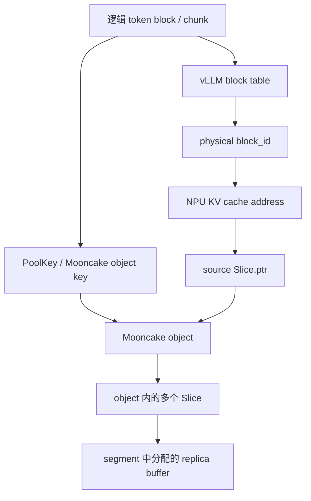

例如一个 token chunk 在某个 KV cache group 中包含 K 和 V 两个 tensor，
`prepare_value()` 可能生成：

```text
Slice 0: K 的 NPU 地址 + K 的字节数
Slice 1: V 的 NPU 地址 + V 的字节数
```

因此它们不是一一对应关系：

| vLLM / Mooncake 概念 | 含义 |
| --- | --- |
| 逻辑 token block | Prompt token 按 block size 划分后的逻辑块 |
| physical `block_id` | BlockPool 分配的物理块编号，决定 NPU 地址 |
| Mooncake object | 一个 key 对应的逻辑 KV 对象，通常对应一个 token chunk 在某个 TP/KV shard 上的数据 |
| Mooncake `Slice` | object 内的一段连续字节，可能对应 K、V 或某层的一个 tensor 区域 |
| Mooncake segment | Store client 挂载给 Master 的大块可分配容量 |
| replica buffer | Master 从 segment 中为某个 object 切出的目标区域 |

Save 时的地址关系是：

```text
vLLM physical block
  -> prepare_value() 计算 NPU source 地址
  -> 组成 object 的多个 Slice
  -> BatchPutStart 从 segment 分配 replica buffer
  -> WRITE 将各 Slice 写入 replica buffer
```

Load 时方向相反：Mooncake replica 中的各个 Slice 被写入新分配的 vLLM NPU block，随后
vLLM 更新 block table。也就是说，Paged Attention 只管理本地 block 的映射和生命周期；
Mooncake 只管理 object、Slice、replica 和 segment，二者通过 `Slice.ptr`、size 以及 key
衔接起来。

### 4.2 Storage region 合并和对齐

注册逻辑：

`vllm-ascend/vllm_ascend/distributed/kv_transfer/kv_pool/ascend_store/pool_worker.py:739-820`

多个 view 共享底层 storage 时，使用：

```python
storage_key = cache.untyped_storage().data_ptr()
```

这里的 `view` 是 PyTorch 的张量视图：它有自己的 shape、stride 和可能不同的起始地址，
但仍然引用同一个底层 Storage。例如：

```python
x = torch.empty((1024, 128), device="npu")
a = x[:512]          # slicing，通常共享 x 的 storage
b = x.transpose(0, 1)  # transpose，通常共享 x 的 storage
c = x.reshape(-1)    # 能直接重解释时共享，否则可能创建新 storage
```

`a.data_ptr()` 或 `b.data_ptr()` 可能和 `x.data_ptr()` 不同，因为 view 可能有不同的
起始偏移；但它们的：

```python
a.untyped_storage().data_ptr()
b.untyped_storage().data_ptr()
x.untyped_storage().data_ptr()
```

通常相同。这正是代码使用 `untyped_storage().data_ptr()` 作为 `storage_key` 的原因：
按底层分配归组，而不是按每个 view 的首地址归组。

相反，下面这些操作通常会得到不同的底层 storage：

```python
y = torch.empty_like(x)  # 全新分配
z = x.clone()            # 复制出新 storage
w = x.contiguous()       # x 非 contiguous 时可能复制
```

即使 `x`、`y`、`z` 的 shape 完全相同，它们也应作为不同 region 分别注册。这里的
“不同 storage 的 view”更准确地说是“来自不同底层 Storage 的 tensor/view”，并不是说
一个 view 同时属于多个 storage。

把地址区间合并为：

```text
(min_start, max_end)
```

Hybrid 模式下将 start 向下对齐到 2 MiB。

最终生成：

```python
ptrs = [start for start, _ in registered_regions.values()]
lengths = [end - start for start, end in registered_regions.values()]
```

这一步的目的，是把 vLLM 的 KV tensor 地址整理成 TransferEngine 可以一次注册的
“内存区间”，而不是整理或复制 KV 内容。可以把每个 cache view 看成一个地址区间：

```text
view A: [0x1000, 0x5000)
view B: [0x3000, 0x7000)
```

如果 A、B 的 `untyped_storage().data_ptr()` 相同，说明它们来自同一块底层 storage，
注册时合并成一个覆盖区间：

```text
[min(0x1000, 0x3000), max(0x5000, 0x7000))
= [0x1000, 0x7000)
```

这样可以避免对同一块底层内存重复注册，也能确保其中所有 block 的地址都落在已注册范围内。
区间中即使存在 view 之间的空洞，也只是注册范围变大；不会在内存中填充空洞，也不会移动
任何 KV 数据。对于不同 storage 的 view，则保留为多个独立 region。

Hybrid 模式下，若区间起始地址不是 2 MiB 边界，会把起点向下取整。例如：

```text
原区间： [0x12345000, 0x90000000)
对齐后：[0x12200000, 0x90000000)
```

对齐后覆盖范围可能变大，但仍然只是为了满足底层内存注册/映射的粒度要求。最终
`register_buffer(ptrs, lengths)` 注册的是这些地址区间；后续 `put/get` 传入的每个
`Slice.ptr` 必须落在对应 region 内。这个过程不等于分配 Mooncake global segment，
也不等于为 KV object 分配 replica。

### 4.3 调用 TransferEngine 注册

`pool_worker.py:864-869`：

```python
self.m_store.register_buffer(ptrs, lengths)
```

`MooncakeBackend.register_buffer()`：

`mooncake_backend.py:173-177`

```python
global_te.register_buffer(ptrs, lengths)
```

GlobalTE：

`mooncake_transfer_engine.py:31-40`

```python
for ptr, size in zip(ptrs, sizes):
    transfer_engine.register_memory(ptr, size)
```

C++ binding：

`mooncake-integration/transfer_engine/transfer_engine_py.cpp:900-904`

```cpp
engine_->registerLocalMemory(buffer, capacity, location);
```

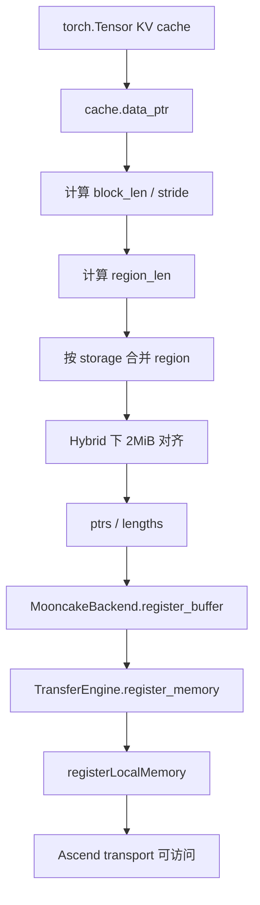

### 4.3.1 注册的目的，以及 MemFabric 是否需要

`register_memory` 的确是为后续传输做准备，但它本身不发起 `READ/WRITE`，也不复制数据。
它把“这段本地地址属于哪个 TransferEngine、长度是多少、传输后端如何访问”登记下来，
底层 transport 可以据此完成地址检查、注册/pin/map 等准备。后续 `put/get` 传入的
`Slice.ptr` 才能被 Ascend Direct、HCCL 或其他传输路径作为本地 source/destination 使用。

普通 Ascend 模式的顺序是：

```text
vLLM NPU KV tensor
  -> register_buffer(ptrs, lengths)
  -> TransferEngine.register_memory()
  -> registerLocalMemory()
  -> 后续 put/get 使用这些地址传输
```

所以它和传输的关系是：

```text
注册 = 建立“地址可被传输层使用”的前置条件
传输 = 后续真正执行 KV 字节的 READ/WRITE
```

在当前 vLLM-Ascend 的 MemFabric 路径（`ASCEND_ENABLE_USE_FABRIC_MEM=1`）中，要区分两
种注册：

| 对象 | MemFabric 下是否需要 | 原因 |
| --- | --- | --- |
| vLLM KV tensor 调用 `register_buffer/register_memory` | 当前路径通常不需要 | vLLM 不显式创建普通 TransferEngine；KV 地址由 Store 内部 ADXL/Fabric executor 直接处理。 |
| Mooncake Fabric segment 的分配、映射和 `MountSegment` | 仍然需要 | 这是 Store 对外提供 replica 容量的来源，必须让 Master 知道 segment 的 descriptor 和可分配范围。 |

因此，“MemFabric 不需要注册”只针对 **vLLM KV buffer 的普通 TransferEngine 注册**，
不是说 Fabric 内存完全不需要初始化或登记。典型路径是：

```text
vLLM NPU KV tensor
  -> 不走普通 register_memory
  -> put/get 交给 ADXL Fabric executor

Fabric segment
  -> ADXL/ACL 分配并映射
  -> MountSegment 发布 SegmentDesc
  -> Master 分配 replica offset
```

如果同一部署中仍有普通 Ascend segment、非 Fabric buffer，或某条传输路径明确要求传统
TransferEngine 注册，那么那些地址仍需按普通模式注册；是否跳过取决于具体 buffer 和
transport，而不是仅看 `protocol="ascend"`。

### 4.3.2 MemFabric 实际涉及哪些地址

在 Store 路径中至少有四类地址，不能都叫“Fabric 地址”：

| 地址 | 所在位置 | MemFabric 下的角色 |
| --- | --- | --- |
| vLLM KV tensor `data_ptr()` | 当前 worker 的 NPU HBM | Save 的本地 source，或 Load 的本地 destination。它不是 Fabric VA；当前 `MooncakeBackend.register_buffer()` 在 Fabric 模式下直接跳过普通 TE 注册。 |
| Fabric segment base/VA | Store client 的 Fabric memory | Store replica 的物理承载空间；由 `ascend_allocate_memory_best_effort()` 分配/映射，并在 `MountSegment` 时注册给 Store 内部 TE。 |
| `Replica::Descriptor.buffer_address_` | Master 为某个 object 从 segment 切出的 offset/地址 | Save 的远端 target，或 Load 的远端 source。它不是 token/block id，也不是 Python 侧传入的 `Slice.ptr`。 |
| ADXL endpoint/engine name | SegmentDesc 的 `rank_info.endpoints` | 决定请求发给哪张 NPU/哪个 ADXL engine；地址本身和 endpoint 必须配套使用。 |

`MountSegmentAndGetId()` 说明了 Fabric segment 的关键顺序：同一个 Store client 内部仍会
先调用 `transfer_engine_->registerLocalMemory(buffer, size, ..., true, true)`，再构造
`Segment` 并调用 `master_client_.MountSegment(segment)`（`client_service.cpp:3493-3547`）。
所以“跳过注册”仅指 vLLM KV tensor 不调用外层 `MooncakeBackend.register_buffer()`，不指
Fabric segment 不注册。

### 4.3.3 普通 Ascend 与 Fabric 混合时怎么传

如果“一半普通、一半 Fabric”指 **不同进程/节点**（例如普通 Ascend 节点和开启
`ASCEND_ENABLE_USE_FABRIC_MEM=1` 的节点），每个进程只有一个 Store/TE 模式：普通进程
在 `MooncakeBackend._setup_store()` 中显式创建并传入 `GlobalTE`，Fabric 进程则不传该
engine、令 Store 内部创建 Fabric-enabled TE（`mooncake_backend.py:121-146`）。Master
可以同时看到两边挂载的 segment，但代码没有为每个 `SegmentDesc` 增加一个 Python 侧的
`fabric=true/false` 字段；实际能力由两端 ADXL engine 和硬件决定。

以普通源写入 Fabric 目标为例，代码关系是：

```text
普通进程 vLLM NPU ptr
  -> 普通 TE 已注册的 local source
  -> BatchPutStart 返回 Fabric segment 的 target descriptor
  -> TransferRequest{source=ptr, target_id=segment_id,
                     target_offset=replica.buffer_address_}
  -> 普通端 ADXL 连接 Fabric 端 endpoint
  -> WRITE 到 Fabric target VA
```

`TransferSubmitter::submit_batch()` 确实只把调用方的 `Slice.ptr` 放到
`request.source`，把 replica 的 `buffer_address_ + offset` 放到 `request.target_offset`
（`mooncake-store/src/transfer_task.cpp:1058-1106`）。Ascend executor 再从 target
`SegmentDesc` 解析 endpoint（`transfer_executor_base.cpp:651-660`），把这两个地址放进
`TransferOpDesc.local_addr/remote_addr`（`sync_transfer_executor.cpp:63-75`）。这里没有
“把普通地址先复制成 Fabric 地址”的中间步骤。

Fabric 源读回普通目标时，方向相反但控制结构相同：

```text
Fabric replica VA + endpoint
  -> READ
  -> 普通进程本地 vLLM NPU destination ptr
```

需要特别注意两点：

1. **同一进程内把 global segment 一半分普通、一半分 Fabric，当前代码没有这种模式。**
   `ascend_use_fabric_mem` 是进程级配置；`real_client.cpp` 根据同一个全局开关选择所有
   Ascend segment 的 allocator，`TransferExecutorBase` 也据此一次性设置
   `params_.use_fabric_mem`。不能仅靠 `global_segment_size` 把两种 segment 混在一个 Store
   client 里。
2. **跨进程/跨节点混合没有自动 staging 或协议转换。** 普通路径的
   `batch_put_from_multi_buffers()` 默认 `stage_nonlocal=false`；如果普通/Fabric 两端的
   ADXL、CANN/HDK 或地址可达性不兼容，代码会在 `execute()` 返回失败，而不是自动执行
   D2H → host → H2D。是否能真正跨 A2/A3、跨普通/Fabric 完成直传，需要现场硬件和 ADXL
   版本支持，不能只凭 `protocol="ascend"` 推断成功。

因此混合部署的判断顺序应是：先确认两端 segment 都成功挂载并发布 descriptor，再确认
源进程能注册/使用自己的 vLLM NPU ptr，最后用 ADXL 的跨端能力验证 `WRITE` 和 `READ`；
Mooncake 本身只负责把 source、target、length 和 endpoint 串起来。

> 名称提醒：这里讨论的是 Mooncake Store 的
> `ASCEND_ENABLE_USE_FABRIC_MEM`（Fabric segment + ADXL）路径，不是
> `memfabric_hybrid.TransferEngine` 的 SFA/P2P connector。后者在
> `vllm_ascend/distributed/kv_transfer/utils/memfabric_transfer_engine.py` 中有自己独立的
> `register_memory()` 和 `batch_transfer_sync_read()` API，不能把两套地址/注册语义混为一谈。

---

## 5. Key 和地址映射

### 5.1 KeyMetadata

`vllm-ascend/vllm_ascend/distributed/kv_transfer/kv_pool/ascend_store/config_data.py:72-92`

```python
@dataclass
class KeyMetadata:
    model_name: str
    head_or_tp_rank: int
    pcp_rank: int
    dcp_rank: int
    pp_rank: int
    kv_cache_group_id: int = 0
    cache_role: str = "kv"
    cache_family: str = "default"
```

字段作用：

- `model_name`：隔离模型。
- `head_or_tp_rank`：隔离 TP/head 分片。
- `pcp_rank`、`dcp_rank`：隔离上下文并行分片。
- `pp_rank`：隔离 pipeline stage。
- `kv_cache_group_id`：隔离多 KV cache group。
- `cache_role`：区分 KV/state。
- `cache_family`：区分压缩比例或混合布局。

### 5.1.1 四个并行字段为什么必须进 key

这四个 rank 不是随意附加的进程编号，而是在描述“同一个 token chunk 对应哪一份 KV
张量”。同一个 prompt hash 在不同并行轴上通常对应不同的字节；如果省略其中任一字段，
不同 rank 可能把不同数据写到同一个 Store key，Load 时就可能读到错误的 KV shard。

| 字段 | 原理上的分片对象 | 为什么要区分 |
| --- | --- | --- |
| `head_or_tp_rank` | TP 维度上的 KV head/shard。普通 MHA/GQA 通常每个 KV-head 组对应一个值；当 `num_kv_head < tp_size` 时，多个 TP rank 共享同一个 KV head，代码用 `put_step = tp_size // num_kv_head` 把它们归并。 | 不同 TP shard 的 K/V 通常是不同 head 的数据，不能用同一个 object 覆盖；归并后的同组 rank 则通过 block 分片避免重复写。 |
| `pcp_rank` | Prefill Context Parallel rank，负责 prompt/prefill 阶段的上下文分片。 | 不同 PCP rank 负责的上下文区间或 KV 状态不同；相同 token hash 也不能直接互换。 |
| `dcp_rank` | Decode Context Parallel rank，负责 decode 阶段的上下文/序列分片。 | DCP rank 的本地 KV 布局和可见上下文不同，Load 必须取对应 rank 的对象。 |
| `pp_rank` | Pipeline Parallel stage，按层切分模型；每个 stage 只拥有自己那部分层的 KV。 | 相同 token chunk 在不同 pipeline stage 对应不同层的 K/V，必须隔离；非 layerwise PoolKey 会把它写入 key。 |

Worker 侧实际取值来自并行组，而不是从 token hash 推断：

```python
self.tp_rank = get_tensor_model_parallel_rank()
self.pp_rank = (parallel_config.rank // self.tp_size) % self.pp_size
self.pcp_rank = get_pcp_group().rank_in_group if self.pcp_size > 1 else 0
self.dcp_rank = (
    get_decode_context_model_parallel_rank() if self.dcp_size > 1 else 0
)
```

对应源码为 `pool_worker.py:134-142`。随后 `head_or_tp_rank` 根据 KV head 数计算：

```python
if self.num_kv_head < self.tp_size:
    self.put_step = self.tp_size // self.num_kv_head
    self.head_or_tp_rank = self.tp_rank // self.put_step
else:
    self.head_or_tp_rank = self.tp_rank
    self.put_step = 1
```

`my_key_index` 把 PCP、DCP 和 head/TP 三个轴线性化，便于在一个 chunk 上定位“我负责的
那份 key”：

```python
self.my_key_index = (
    self.pcp_rank * self.dcp_size * (self.tp_size // self.put_step)
    + self.dcp_rank * (self.tp_size // self.put_step)
    + self.head_or_tp_rank
)
```

例如 `tp_size=8`、`num_kv_head=2` 时，`put_step=4`：

```text
TP0~TP3 -> head_or_tp_rank 0
TP4~TP7 -> head_or_tp_rank 1
```

因此逻辑上只有两个 KV shard key；同一组中的多个 TP rank 不会把每个 block 重复写多次，
发送线程还会按 `tp_rank % put_step` 对 block 序列分片。Scheduler 查询时则显式遍历
`pcp_rank × dcp_rank × head_or_tp_rank × pp_rank` 的组合（见 `pool_scheduler.py:250-276`），
再根据这些 rank-specific key 的连续命中情况判断完整前缀是否可用。

补充一点：`LayerPoolKey` 还增加 `layer_id`，因为 layerwise 路径把每层拆成独立 object；
此时“层”本身进一步标识了具体的 KV 所属位置，不能把不同 layer 的 slice 混在同一个 key
中。

### 5.2 PoolKey / LayerPoolKey

`config_data.py:94-171`

普通 key：

```text
ModelName
@pcp0@dcp0
@head_or_tp_rank:0
@pp_rank:0
@group:0
@cache_role:kv
@cache_family:default
@<chunk_hash>
```

Layerwise key 额外包含：

```text
@layer_id:<layer_id>
```

### 5.3 token 到物理地址

`config_data.py:405-433`：

```python
addr = base_addr + block_id * block_stride
size = int(block_len / group_block_size * (end - start))
```

一个 object 可以由多个 slice 组成。下面的 K/V 两个 slice 是最简单的示意，不代表所有模型的实际数量：

```text
keys[i]
addrs[i] = [K_slice_addr, V_slice_addr]
sizes[i] = [K_slice_size, V_slice_size]
```

在普通非 layerwise 路径中，`prepare_value()` 会遍历整个 `group_addrs`。如果 group 中登记了多层、每层又有 K/V 两个 tensor，实际形态可能是：

```text
addrs[i] = [
    layer0_K_addr, layer0_V_addr,
    layer1_K_addr, layer1_V_addr,
    ...,
]
```

`_infer_cache_group_metadata()` 会按物理 layer 收集这些地址，见 `pool_worker.py:711-737`；layerwise 路径则通过 `prepare_value_layer()` 只取当前 layer 的地址，见 `config_data.py:445-466`。

这里的 `addr` 是当前 worker 的 NPU 地址：

```text
Save：addr 是本地源地址
Load：addr 是本地目标地址
```

远端 Store 地址不是 vLLM 预先计算的，而是 Mooncake 根据 `Replica::Descriptor` 找到目标 segment、endpoint 和 offset 后，再交给 TransferEngine 组合成远端地址。

### 5.4 为什么会和 TP / DP 切分有关

#### TP 决定 key 的 shard 数量

Worker 初始化 TP 信息：

`vllm-ascend/vllm_ascend/distributed/kv_transfer/kv_pool/ascend_store/pool_worker.py:134-143`

```python
self.tp_rank = get_tensor_model_parallel_rank()
self.tp_size = get_tensor_model_parallel_world_size()
```

不同 TP rank 通常只保存部分 KV heads，因此同一个 token block 不能只用一个全局 key 表示。Worker 会计算：

`pool_worker.py:191-211`

```python
if self.num_kv_head < self.tp_size:
    self.put_step = self.tp_size // self.num_kv_head
    self.head_or_tp_rank = self.tp_rank // self.put_step
else:
    self.head_or_tp_rank = self.tp_rank
    self.put_step = 1
```

因此逻辑 shard 数量是：

```text
head_or_tp_ranks = tp_size / put_step
                 = min(tp_size, num_kv_head)   # 普通 KV group
```

`head_or_tp_rank` 会写入 `PoolKey`：

```text
...@head_or_tp_rank:0@...
...@head_or_tp_rank:1@...
```

所以 TP=4、KV heads=4 时，一个 hash 通常对应 4 个 rank-specific object：

```text
hash H + tp_rank 0 -> object H@head_or_tp_rank:0
hash H + tp_rank 1 -> object H@head_or_tp_rank:1
hash H + tp_rank 2 -> object H@head_or_tp_rank:2
hash H + tp_rank 3 -> object H@head_or_tp_rank:3
```

如果 TP=8、KV heads=2：

```text
put_step = 8 / 2 = 4
```

此时：

```text
tp_rank 0~3 -> head_or_tp_rank 0
tp_rank 4~7 -> head_or_tp_rank 1
```

这些 rank 之间对应同一个 KV head 的副本。为了避免重复写入，普通发送线程会按 `tp_rank % put_step` 对 block 做分片，见 `kv_transfer.py:788-797`；layerwise key 线程也会按相同规则筛选 block，见 `kv_transfer.py:1160-1163`。

#### TP 还决定一个 object 内部有哪些 slice

每个 TP worker 的 `base_addr` 都是本地 tensor 的地址，而 tensor 的 shape/stride 又由本地 KV head 数决定：

```text
TP rank 0 的 object：本地 K/V head 分片 0
TP rank 1 的 object：本地 K/V head 分片 1
...
```

因此：

```text
一个 object = 一个 token chunk
             在某个 TP shard 上的所有本地 KV slice
```

它不是完整模型所有 TP rank 的 KV 数据。完整前缀命中要求相应的 rank-specific keys 都存在，Scheduler 会扩展并查询这些 rank 变体，见 `pool_worker.py:2231-2238` 和 `pool_scheduler.py:250-329`。

#### DP 通常不写入 key，但影响进程和地址归属

Data Parallel rank 不在 `KeyMetadata` 中。`KeyMetadata` 包含 `head_or_tp_rank`、`pcp_rank`、`dcp_rank`、`pp_rank`，但没有 `dp_rank`。

这意味着不同 DP replica 通常共享同一套逻辑 Store key：

```text
DP0 + TP0 + hash H -> 同一个逻辑 key
DP1 + TP0 + hash H -> 同一个逻辑 key
```

这样可以避免每个 DP 副本重复保存完全相同的 prefix KV。DP 影响的是：

- 每个 DP 进程自己的 NPU 地址和 Store client。
- lookup IPC 路径，`lookup_rpc_port_<port>_dp_rank<dp_rank>`，见 `pool_scheduler.py:1194-1209`。
- Store segment/endpoint 的归属和副本放置。
- SSD offload 时的全局 rank 目录。

因此 DP 的关系是：

```text
DP：决定“哪个进程、哪块 NPU、哪个 endpoint”
TP：决定“对象 key 的 shard，以及本地 object 包含哪些 KV slice”
```

可以把关系画成：

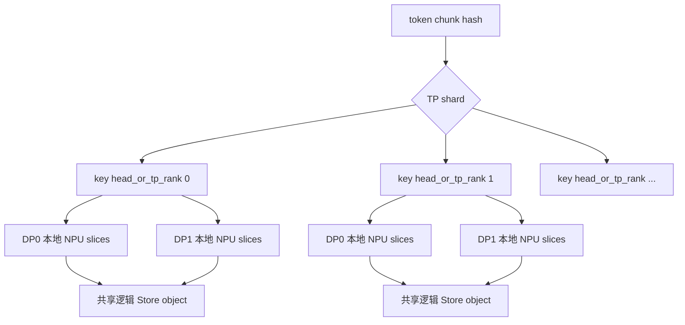

上图中 DP0/DP1 使用相同逻辑 key 时，第一次成功写入的副本可以被另一个 DP 进程读取；读取目标地址仍然是读取方自己的 NPU KV cache 地址。

本章可以用一句话概括：TP 决定“一个 hash 要拆成哪些逻辑 Store object”，DP 通常不
改变 key，只决定“谁先写、谁从哪个 endpoint 读”。因此 Store 的 `replica` 和 vLLM
的 DP replica 不是同一层概念：多个 DP 进程共用一个 key，不代表 Mooncake 已经创建多
个物理副本；物理副本数量要看 `ReplicateConfig` 和 Master 放置结果（见第 9 章和附录
G）。

### 5.5 PD 分离且 P/D 的 TP 不同时：到底存一份还是两份

这里的“转换”不是把完整 KV tensor 读到 CPU，再重新排列后写一份 P 格式和一份 D
格式。当前 `AscendStoreConnector + Mooncake` 的实现把 KV 拆成一套**规范的
effective-TP shard**，保存时和加载时都通过 NPU KV cache 的 strided 地址直接访问
对应 head slice。

#### 5.5.1 mismatch 如何判断

代码在 `config_data.py:36-68` 中推导 P/D 两边的 TP：

```python
peer_key = "prefill_tp_size" if kv_role == "kv_consumer" else "decode_tp_size"
peer_tp_size = _as_positive_int(extra_config.get(peer_key, local_tp_size), local_tp_size)

effective_tp_size = max(local_tp_size, peer_tp_size)
enabled = (
    peer_tp_size != local_tp_size
    and not use_mla
    and not use_hybrid
    and num_kv_heads >= effective_tp_size
    and num_kv_heads % effective_tp_size == 0
)

local_heads_per_rank = num_kv_heads // local_tp_size
effective_heads_per_rank = num_kv_heads // effective_tp_size
num_sub_keys = local_heads_per_rank // effective_heads_per_rank
```

P 节点是 `kv_producer`，所以读取 `decode_tp_size` 作为对端 TP；D 节点是
`kv_consumer`，所以读取 `prefill_tp_size`。Worker 初始化时把上述结果保存为
`self.effective_tp_size`、`self.num_sub_keys` 等字段，见
`pool_worker.py:214-259`。

#### 5.5.2 例子：P TP=4，D TP=2，KV heads=8

```text
effective_tp_size       = max(4, 2) = 4
effective_heads_per_rank = 8 / 4   = 2

P 每个 rank 的本地 head 数 = 8 / 4 = 2
P num_sub_keys             = 2 / 2 = 1

D 每个 rank 的本地 head 数 = 8 / 2 = 4
D num_sub_keys             = 4 / 2 = 2
```

因此 Store 的逻辑命名空间只有 effective rank `0..3` 四个 shard：

| 节点 | 本地 rank | 生成/读取的 Store key 中的 `head_or_tp_rank` |
| --- | ---: | --- |
| P | 0 | 0 |
| P | 1 | 1 |
| P | 2 | 2 |
| P | 3 | 3 |
| D | 0 | 0、1 |
| D | 1 | 2、3 |

D rank 0 读取 effective rank 0 和 1 的两个子对象，两个子对象在本地地址上分别落到
该 rank 的前两组和后两组 KV heads；D rank 1 同理读取 2 和 3。这里没有第二套
“D 格式”对象。

反方向 P TP=2、D TP=4 时，`effective_tp_size` 仍为 4，但 P 每个 rank 有 4 个
heads，因此每个 P rank 拆成两个 key：

```text
P rank 0 -> effective rank 0, 1
P rank 1 -> effective rank 2, 3
D rank 0 -> effective rank 0
D rank 1 -> effective rank 1
D rank 2 -> effective rank 2
D rank 3 -> effective rank 3
```

##### effective rank 映射为什么成立

这套公式依赖一个重要前提：TP rank 按全局 KV-head 顺序持有连续 head 区间。设：

```text
H = num_kv_heads
T = local_tp_size
E = effective_tp_size
n = num_sub_keys = E / T
```

本地 rank `r` 持有的全局 KV-head 范围是：

```text
[r × H/T, (r + 1) × H/T)
```

它内部第 `s` 个 sub-slice 对应：

```text
[r × H/T + s × H/E,
 r × H/T + (s + 1) × H/E)
```

因为 `n = E/T`，上式可以改写为：

```text
[(r × n + s) × H/E,
 (r × n + s + 1) × H/E)
```

所以该 slice 正好就是：

```python
effective_rank = r * num_sub_keys + s
```

对应的 canonical effective shard。换言之，代码不是凭 rank 编号猜测目标 shard，而是
利用“本地连续 head 区间可以等分成若干 effective head 区间”这个等式完成映射。

如果某个 attention backend 对 KV heads 做了非连续置换、交错 sharding 或自定义 packed
layout，这个等式就不再充分，必须额外提供 head-index map；当前实现没有这类映射表。

#### 5.5.3 Key 怎样从 local rank 改成 effective rank

`pool_worker.py:1909-1917` 不重新构造完整 key，只替换序列化 key 中的字段：

```python
def _make_sub_key_str(self, base_key: str, effective_rank: int) -> str:
    return self._replace_key_field(
        base_key, "head_or_tp_rank", effective_rank
    )
```

真正遍历 chunk 和子 key 的代码在 `pool_worker.py:1945-1975`，关键部分是：

```python
for start, end, base_key, _block_hash, block_id in \
        self.token_database.process_token_key_strings_with_block_ids(
            token_len, block_hashes, block_ids, mask_num=mask_num):
    token_count = end - start
    for sub_idx in range(self.num_sub_keys):
        effective_rank = self.tp_rank * self.num_sub_keys + sub_idx
        addrs, sizes = self._build_strided_addrs(
            block_id, token_count, sub_idx)
        all_keys.append(self._make_sub_key_str(base_key, effective_rank))
        all_addrs.append(addrs)
        all_sizes.append(sizes)
```

所以一个 `(chunk, sub_idx)` 才对应一个 Store key，而不是一个完整请求对应一个 key。
例如 D rank 0 的一个 chunk 会发出：

```text
...@head_or_tp_rank:0@...@<hash>
...@head_or_tp_rank:1@...@<hash>
```

#### 5.5.4 地址怎样完成 head slice 转换

初始化时，Worker 根据本地 cache 的 dtype 和 head dimension 计算一个 effective shard
的字节数，见 `pool_worker.py:851-862`：

```python
self.sub_size_bytes = (
    self.effective_heads_per_rank * self.head_dim * self.elem_size
)
```

本地 KV layout 假设为：

```text
[num_block, block_size, local_heads_per_rank, head_dim]
```

`pool_worker.py:1919-1943` 对每个 token 生成一个 `(addr, size)`，因为同一 token 的
head slice 在 block 内是按 token 交错的，不能把整个 sub-key 当作一个连续区间：

```python
head_offset_bytes = sub_idx * self.sub_size_bytes
entry_per_token_bytes = entry_block_len // self.block_size
block_base = base_addr + block_id * entry_block_stride

for t in range(token_count):
    addrs.append(
        block_base + t * entry_per_token_bytes + head_offset_bytes
    )
    sizes.append(self.sub_size_bytes)
```

例如 `block_size=4`、`entry_block_len=64`、`entry_block_stride=128`、
`block_id=2`、`sub_size_bytes=8`、`sub_idx=1`、`token_count=3`：

```text
entry_per_token_bytes = 64 / 4 = 16
block_base            = 1000 + 2 * 128 = 1256
head_offset_bytes     = 1 * 8 = 8

addrs = [1256 + 0*16 + 8,
         1256 + 1*16 + 8,
         1256 + 2*16 + 8]
      = [1264, 1280, 1296]
sizes = [8, 8, 8]
```

这就是“转换”的实际代码：Mooncake 收到的是多个 `(addr, size)` 小段，写入 Store
时从 P 本地 cache 取这些段，读取时把 Store 中的段直接写入 D 本地 cache 的对应
地址。没有显式的 `reformat_kv_cache()` 临时 tensor。

##### 一个 canonical object 内部是什么顺序

`_build_strided_addrs()` 的循环顺序是“cache entry 在外、token 在内”：

```python
for cache_entry in group_entries:
    for token_idx in range(token_count):
        emit(addr(cache_entry, token_idx, head_slice), sub_size_bytes)
```

因此一个 `(chunk, effective_rank)` 对象在逻辑上是下面这些 slice 的顺序拼接：

```text
entry 0 / token 0 / effective head slice
entry 0 / token 1 / effective head slice
...
entry 0 / token N-1 / effective head slice
entry 1 / token 0 / effective head slice
...
entry M-1 / token N-1 / effective head slice
```

`entry` 通常对应各层的 K/V cache tensor entry；确切顺序来自
`group_kv_caches_base_addr[0]`、`group_block_len[0]` 和
`group_block_stride[0]` 的注册顺序。Mooncake 不理解其中哪个 slice 是哪一层、K 还是 V，
它只把同一个 key 对应的多段 source 按给定顺序组成 object 字节流。

加载端再次调用同一个 `_build_tp_mismatch_keys_and_addrs()`，为本地 layout 生成目标地址列表。
只要两端具有相同的 entry 顺序、dtype、head dimension 和 token chunk 定义，Mooncake 就能将
object 的第 `i` 段写入加载端的第 `i` 个目标 slice：

```text
Store object bytes
  slice 0 -> D 本地 entry 0 / token 0 / head slice
  slice 1 -> D 本地 entry 0 / token 1 / head slice
  ...
```

这就是为什么存储中不需要再维护一份“P layout”和一份“D layout”：Store 保存的是从二者
物理布局中抽取出来的共同 canonical slice 序列。

#### 5.5.5 Save、Load 和 Scheduler 分别做什么

Save 线程在 `kv_transfer.py:679-695` 检测到 `worker.tp_mismatch` 后转到
`_store_kv_tp_mismatch()`。该函数（`pool_worker.py:2014-2044`）先查 key，只对缺失
的子 key 调用 backend：

```python
keys, addrs, sizes, _ = self._build_tp_mismatch_keys_and_addrs(...)
exists_states = send_thread.lookup(keys)
missing_indices = [i for i, exists in enumerate(exists_states) if not exists]
self.m_store.put(
    [keys[i] for i in missing_indices],
    [addrs[i] for i in missing_indices],
    [sizes[i] for i in missing_indices],
)
```

Load 线程在 `kv_transfer.py:923-943` 调用 `_load_kv_tp_mismatch()`，后者复用同一套
key/address 构造逻辑并调用：

```python
self.m_store.get(keys, addrs, sizes)
```

Mooncake backend 最终分别调用：

```python
# Save
self.store.batch_put_from_multi_buffers(keys, addrs, sizes, config)

# Load
self.store.batch_get_into_multi_buffers(keys, addrs, sizes)
```

这里三个参数是二维对应关系：

```text
keys[i]       = 第 i 个 canonical object
addrs[i][j]   = object i 的第 j 个 source/destination slice 地址
sizes[i][j]   = 第 j 个 slice 的字节数
```

Save 时 Mooncake 从 `addrs[i][j]` 依次读取并写入 object `i`；Load 时方向相反，把 object
`i` 的字节流依次 scatter 到 `addrs[i][j]`。因此所谓 strided I/O 发生在 vLLM-Ascend
构造 IOV 的这一层，Mooncake 接口看到的是一个 object 对应多个 buffer segment。

Scheduler 查询时调用 `get_group_tp_size()`；mismatch 时返回
`effective_tp_size`（`pool_worker.py:2212-2217`），再由
`_expand_lookup_keys_by_rank()`（`pool_worker.py:2231-2238`）展开查询 effective
rank `0..effective_tp_size-1` 的所有 key。只有一个 effective rank 缺失时，整个
block 才不会被判定为完整命中。

##### “直接访问 NPU KV cache”准确到什么边界

这里的“直接”准确表示：

```text
不创建完整 KV 的 CPU 临时 tensor
不先执行 P-layout -> contiguous -> D-layout 的显式 reformat
put/get 的 source/destination 直接使用 NPU KV cache 的 slice 地址
```

它不自动等价于“整条链路绝对零拷贝”。是否存在 host staging、协议 bounce buffer 或存储侧
聚合，仍取决于 Mooncake TransferEngine、Ascend transport、Fabric Memory/普通内存模式和
最终 replica 介质。当前 Python 层能证明的是：它把 NPU 地址列表原样交给
`batch_put_from_multi_buffers()` / `batch_get_into_multi_buffers()`；底层是否真正执行 HBM
直达，需要再结合 buffer 注册、transport 类型和实际 DMA 路径确认。

从数据流角度应写成：

```text
P NPU KV strided slices
    -> Mooncake multi-buffer PUT
    -> Mooncake canonical object / replica
    -> Mooncake multi-buffer GET
    -> D NPU KV strided slices
```

而不应简化成“把 P 的 NPU 虚拟地址保存后交给 D 使用”。Store 保存的是对象内容和 replica
descriptor；D 端目标地址始终是 D worker 当前分配的本地 KV blocks。

#### 5.5.6 DP 不会额外产生一套格式

`KeyMetadata` 没有 `dp_rank`，因此 DP0 和 DP1 对同一模型、同一 hash、同一 TP shard
通常使用同一个逻辑 key。DP 只改变进程、本地 NPU 地址、endpoint 和 lookup IPC 路径，
不参与上述 head slice 转换。

默认 PD 配置下 D 是 `kv_consumer`，`consumer_is_to_put` 默认为 `False`（
`ascend_store_connector.py:93-95`），Scheduler 会设置 `force_skip_save`，所以通常
只有 P 写 Store。只有显式启用 `consumer_is_to_put=true` 或使用 `kv_both`，D 才会回写；
这可能增加物理副本或引入竞态，但仍使用同一套 effective-rank key，不会自动生成 P/D
两种完整布局。

当前 mismatch 路径有明确限制：MLA、hybrid/DSV4、sparse KV、layerwise KV 不支持；
对应检查在 `pool_worker.py:224-242`。

#### 5.5.7 为什么这些模型/路径被限制

限制的不是模型名称本身，而是当前 TP-mismatch 算法只实现了下面这一种数据模型：

```text
单一 dense KV cache group
每个 cache entry 有一致、可整除的 block_len
layout = [num_block, block_size, local_kv_heads, head_dim]
TP 只沿 local_kv_heads 维切分
同一个 effective shard 可用固定 sub_size_bytes 表示
```

代码证据是 `_build_strided_addrs()`（`pool_worker.py:1919-1943`）直接硬编码 group 0：

```python
group_addrs = self.group_kv_caches_base_addr[0]
group_block_len = self.group_block_len[0]
group_block_stride = self.group_block_stride[0]

entry_per_token_bytes = entry_block_len // self.block_size
head_offset_bytes = sub_idx * self.sub_size_bytes
addr = block_base + token_idx * entry_per_token_bytes + head_offset_bytes
```

`sub_size_bytes` 也只从第一个 cache tensor 的 `head_dim`、dtype 和统一
`effective_heads_per_rank` 推导，见 `pool_worker.py:851-857`。因此不同场景破坏的假设
分别如下：

| 场景 | 为什么不能直接复用 dense GQA 的 head slicing |
| --- | --- |
| MLA | cache 是每个 token 一个共享 latent，`num_kv_head` 被强制设为 1；TP 通常切 query heads，而不是把 latent KV 沿 KV-head 维切开。正确适配更接近“保存一次，加载到各 rank / TP 内广播”，不是 effective-head sub-key。 |
| Hybrid / DSV4 | 一个请求可能有多个 cache group、不同 block size、压缩比例、cache family 和 entry 布局；当前 mismatch 只读 `block_ids_by_group[0]`、`group_*[0]`，无法同时为各 group 建立独立 canonical shard。 |
| Sparse KV | main KV、indexer/top-k 或辅助 entry 的 `block_len`、shape、token 粒度可能不同；一个统一的 `entry_block_len // block_size` 与固定 `sub_size_bytes` 不能安全描述所有 entry。代码因此要求所有 cache entry 是 uniform dense layout。 |
| Layerwise | layerwise 线程按完整 layer entry 调用 `prepare_value_layer()` 和 `put/get()`，key 是 `LayerPoolKey`；它没有生成 effective-rank sub-key，也没有按 token × head slice 生成 strided IOV。 |

MLA 在 `infer_tp_mismatch_info()` 中直接由 `not use_mla` 禁用；而且 Worker 初始化时：

```python
if self.use_mla:
    self.num_kv_head = 1
```

若 P/D TP 都大于 1，则 `num_kv_heads >= effective_tp_size` 也不成立。对应单测
`test_tp_mismatch_disabled_when_use_mla` 位于
`test_pool_worker.py:2105-2120`。

Layerwise 和 sparse 是检测到普通 mismatch 条件后显式抛错。Hybrid 的 Scheduler 侧会把
`use_hybrid` 传入 `infer_tp_mismatch_info()` 直接禁用 mismatch；Worker 侧当前调用未传
`use_hybrid`，所以还保留 `if self.use_hybrid: raise NotImplementedError` 作为防御检查。
这也说明该功能仍是针对 dense single-group 的专门路径，而不是通用 reshard 框架。

若要支持这些场景，不能只删除检查，至少需要：

```text
MLA：定义 canonical latent layout + first-rank/broadcast 或 replicated load 策略
Hybrid：逐 group 推导 block size、head axis、family、sub-key 和 block_ids
Sparse：为 main/indexer/scale 等 entry 分别定义可切分轴与传输粒度
Layerwise：把 effective-rank sub-key 和 strided IOV 下沉到每层 send/recv 线程
```

#### 5.5.8 正确性条件和性能代价

这条路径成立至少依赖以下不变量：

1. P/D 使用相同模型 revision、KV-head 全局顺序、head dimension、cache dtype 和 entry 顺序；
2. `num_kv_heads` 可以被 `effective_tp_size` 整除，本地 head 区间也能整分成
   `num_sub_keys` 个 canonical slice；
3. Save 和 Load 使用相同 token chunk/hash 语义，partial chunk 的 `token_count` 一致；
4. 地址跨 block 时使用真实 `block_stride`，不能把带 padding 的 `block_len` 当 stride；
5. Scheduler 只有在一个 chunk 的所有 effective-rank objects 都存在时才报告完整命中；
6. 模型计算完成事件先于 PUT 读取 NPU 地址，GET 完成事件先于 attention 消费目标 KV。

它用“避免整块重排”换来了更多小 IOV：一个 object 的 slice 数近似为：

```text
num_slices_per_object = num_cache_entries × token_count
```

总传输字节没有因为 strided I/O 增加，但 descriptor 构造、Python/C++ binding、传输任务拆分
和小段 DMA 的固定开销可能增加。收益是否为正取决于：

```text
省掉的 reformat tensor 分配 + HBM 读写
    是否大于
多 slice IOV 管理 + 小传输提交开销
```

因此性能验证不能只看总带宽，还应同时观察 `slices/object`、单 slice 字节数、提交批量、
TransferEngine queue depth、HBM copy 次数以及端到端 TTFT。后续若成为瓶颈，可以在保持
canonical key 不变的前提下，将相邻 token/head slice 在 transport 层聚合，或增加原生
strided/二维 DMA 描述符，而不必重新定义 Store 的 effective-rank 命名空间。

这条路径已有针对性单测，位于
`vllm-ascend/tests/ut/distributed/ascend_store/test_pool_worker.py:2165-2250`：
`test_build_strided_addrs_uses_stride` 验证 `[1264, 1280, 1296]` 这类带 block
padding 的地址；`test_build_tp_mismatch_keys_and_addrs_counts_and_ranks` 验证一个
TP rank 拆出多个 effective-rank key；`test_load_kv_tp_mismatch_calls_backend_get`
和 `test_store_kv_tp_mismatch_puts_missing_and_decrements` 分别验证 get/put 以及
只写入缺失子 key 的行为。

最终可以这样记：

```text
Store：一套 effective-TP canonical shard（多个 rank/chunk object）
P/D 本地：各自 TP 下的 KV layout
适配动作：put/get 时按 token 的 head slice 生成 strided IOV
DP：共享逻辑 key，不改变 KV layout
```

---

## 6. Scheduler 命中检查

Scheduler 创建 backend client 时使用 `contribute_memory=False`：

`pool_scheduler.py:169-180`

因此 Scheduler 主要连接 metadata，不贡献实际 KV buffer。

### 6.1 查询流程

`pool_scheduler.py:288-329`：

```python
query_keys = self._generate_store_query_keys(...)
exists_states = self.store_scheduler.batch_is_exist(query_keys)
```

查询逻辑：

```text
prompt_token_ids
  -> block_hashes
  -> 生成 Store key
  -> batch_is_exist
  -> 连续命中 block 数
  -> kvpool_cached_tokens
```

只计算连续前缀命中：

```text
block0 = hit, block1 = hit, block2 = miss, block3 = hit
结果只算到 block1
```

### 6.2 Scheduler 与 Worker 的 ZeroMQ lookup

`LookupKeyClient` 将 token_len、group_ids、已有 HBM token 数和 hash 通过 IPC 发给 Worker：

`pool_scheduler.py:1156-1188`

Worker 侧的 `LookupKeyServer` 调用：

`ascend_store_connector.py:293-333`

```python
pool_worker.lookup_scheduler(
    token_len,
    hashes_str,
    kv_group_ids,
    hbm_hit_tokens=hbm_hit_tokens,
)
```

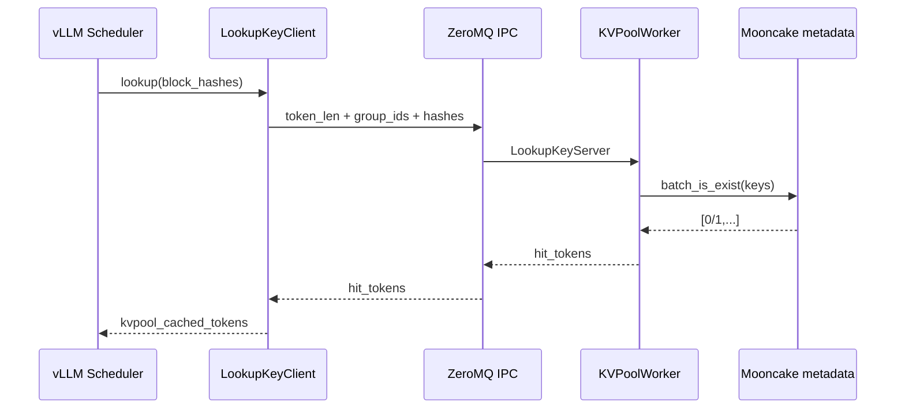

### 6.3 LoadSpec

命中后构造：

```python
LoadSpec(
    vllm_cached_tokens=num_computed_tokens,
    kvpool_cached_tokens=num_external_hit_tokens,
    can_load=True,
    kvpool_store_skip_tokens=store_skip_tokens,
)
```

需要新增本地 block 的数量：

```text
need_to_allocate = kvpool_cached_tokens - vllm_cached_tokens
```

见 `pool_scheduler.py:577-627`。

这里的先后顺序非常重要：vLLM `KVCacheManager/BlockPool` 先检查本地 HBM，只有本地
没有覆盖的 suffix 才交给 Mooncake 查询。Worker 会把 `hbm_hit_tokens` 作为“已命中前缀
长度”传给 lookup 服务，Mooncake 不会重复查询这部分，也不会把外部数据写回已经命中
的 HBM block。

```text
本地 HBM 命中 0~8K
外部 Store 查询 8K~12K
最终 LoadSpec 覆盖 0~12K
实际 BatchGet 只传输 8K~12K 对应的 block
```

如果外部命中后又继续生成 token，Save 线程还会记录本次已加载的区间为 skip 区间，避免
把 8K~12K 再次写回 Store；只保存之后新产生的 12K 以后 suffix。`store_mask`、skip
区间和 exists 去重的完整边界见附录 C、D。

---

## 7. 普通 KV Save 路径

入口链路：

```text
AscendStoreConnector.wait_for_save()
  -> KVPoolWorker.wait_for_save()
  -> KVCacheStoreSendingThread
  -> MooncakeBackend.put()
```

发送线程核心实现：

`vllm-ascend/vllm_ascend/distributed/kv_transfer/kv_pool/ascend_store/kv_transfer.py:717-890`

处理步骤：

1. 根据 `store_mask` 过滤不允许保存的 chunk。
2. 跳过已经从外部 pool 加载的区间。
3. 根据 block hash 生成 key。
4. `lookup(keys)`，跳过已经存在的对象。
5. `prepare_value()` 生成 NPU 地址和 slice 大小。
6. 等待 NPU event，保证 KV 写入完成。
7. 调用 `m_store.put(keys, addrs, sizes)`。

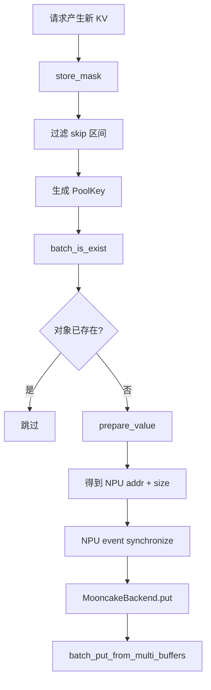

`store_mask` 是“这个 chunk 是否允许写入外部 KV Store”的布尔掩码，不是命中结果：

```text
True  -> 继续生成 key、地址和 Put 任务
False -> 不生成 Store 写任务，通常用于 sliding-window/Mamba 等不可复用区间
```

Save 线程实际会连续做三层过滤：

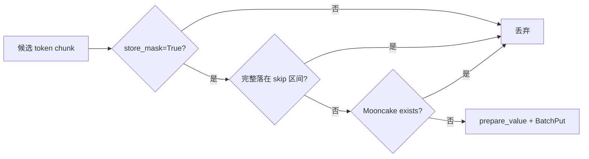

三者语义不同：`store_mask` 是模型/缓存可达性规则，skip 区间是本次请求已经从外部
Store load 过的范围，`exists` 是全局 Store 中是否已经有同名 object。只有三关都通过，
才会读取当前 NPU source 并创建写入任务；详细的 mask 来源和边界在附录 C、D。

`MooncakeBackend.put()`：

`mooncake_backend.py:189-221`

```python
config = ReplicateConfig()
if self.config.preferred_segment:
    config.preferred_segment = self.local_seg
config.prefer_alloc_in_same_node = self.config.prefer_alloc_in_same_node

self.store.batch_put_from_multi_buffers(
    keys, addrs, sizes, config)
```

---

## 8. Python Binding 与 RealClient

### 8.1 多 buffer 转换

Store pybind 接口：

`mooncake/mooncake-integration/store/store_py.cpp:2993-3028`

```cpp
vector<string> keys
vector<vector<uintptr_t>> all_buffer_ptrs
vector<vector<size_t>> all_sizes
```

RealClient 转为：

`mooncake/mooncake-store/src/real_client.cpp:151-176`

```cpp
struct Slice {
    void* ptr;
    size_t size;
};

vector<vector<Slice>> batched_slices;
```

该步骤不复制 KV 数据，只把整数地址包装成 C++ `Slice`。

### 8.2 staging

`batch_put_from_multi_buffers()` 默认调用 `stage_nonlocal=false`：

`real_client.cpp:5440-5458`

因此普通 NPU KV 写入通常直接把 NPU 地址交给传输层。

这里的 staging 不是“再创建一个 Mooncake replica”，而是“在真正传输前，先把
源 slice 临时搬到客户端可访问的 host buffer”。它只改变传输源地址，不改变 key、
object size、replica 数量或 Master 分配出的目标地址。

可选 staging 路径：

`real_client.cpp:178-216`

```text
源 NPU slice(s)
  -> ClientBufferAllocator.allocate(total_size)
  -> RuntimeAccelerator.CopyToHost()  [Device -> Host]
  -> host staging buffer 中的同布局 slice(s)
  -> Client::BatchPut(..., WriteBufferStager)
  -> TransferSubmitter 从 host slice 发往远端 replica
```

`WriteBufferStager` 的类型定义在 `client_service.h:76-78`：

```cpp
using WriteBufferStager =
    std::function<tl::expected<std::vector<Slice>, ErrorCode>(
        const std::vector<Slice>&)>;
```

它接收一个 object 的源 slice 列表，先求所有 slice 的 `total_size`，从
`ClientBufferAllocator` 分配一块连续临时空间，再逐个执行：

```cpp
RuntimeAccelerator.CopyToHost(destination + offset,
                              slice.ptr,
                              slice.size);
```

返回的新 `Slice` 指针指向 host staging buffer；原来的 NPU 指针不会被修改，也不会
释放。`staging_handles` 会在整个 `Client::BatchPut`/`BatchUpsert` 返回前保持这些临时
buffer 有效，传输结束后由 RAII 释放。

### 8.3 为什么需要 staging

远端写入至少涉及两种地址：

```text
source = 当前 worker 的 NPU KV 地址
target = Master 在远端 MEMORY/Fabric segment 分配出的地址
```

只有当传输后端和注册状态支持“直接读取这个 source NPU pointer”时，才能走零拷贝的
`NPU -> 远端 replica`。下面情况可能无法直接访问源地址：

| 情况 | 直接 NPU 源地址的风险 | staging 的作用 |
| --- | --- | --- |
| 远端 endpoint 不支持当前设备指针 | transport 无法注册/解析 pointer | 变成可注册的 host pointer |
| 设备上下文或进程不匹配 | 远端传输层不能在当前 context 取数 | 在本地完成 D2H，再发 host 数据 |
| 写入 SSD/DFS 文件 | 文件 IO 需要 host 可读地址 | 先 D2H，随后 `pwrite/WriteAt` |
| 需要隔离源 buffer 生命周期 | vLLM 可能很快复用 HBM block | 临时副本保持到传输结束 |

代价是一次额外的 `Device -> Host` 拷贝、host 内存占用和同步/带宽开销；所以它不是
默认路径，而是兼容性和生命周期保障路径。

### 8.4 什么时候真正触发 staging

`Client::StageWriteBuffersForRemoteReplicas()`（`client_service.cpp:3104-3122`）只在
同时满足以下条件时触发：

1. 调用方传入了非空的 `WriteBufferStager`；
2. 该 object 已经由 `BatchPutStart` 拿到至少一个 replica descriptor；
3. 不是已解析的失败操作；
4. 并非所有 replica 都满足 `CanUseLocalMemcpy(replica)`。

只要所有目标都可本地 memcpy，就保留原始 slice；只要存在一个需要远端 transport 的
目标，则把该 object 的全部 slices 一起 staging，然后所有后续 WRITE 都从 staging
源发出：

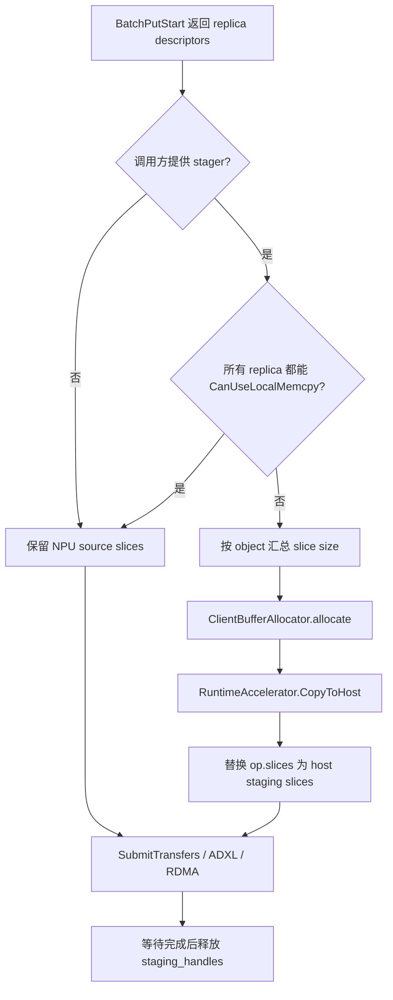

注意：staging 是按 object 的 slice 列表执行，而不是按每个 replica 各拷贝一次。这样
同一个 object 有多个远端 replica 时，只做一次 D2H，随后从同一份 host staging 数据
发起多个 WRITE。

### 8.5 vLLM-Ascend 当前是否走 staging

当前 vLLM-Ascend 调用的是：

```python
self.store.batch_put_from_multi_buffers(keys, addrs, sizes, config)
```

Python binding `store_py.cpp:3004-3011` 没有暴露 `stage_nonlocal` 参数，因此走
`RealClient::batch_put_from_multi_buffers(..., stage_nonlocal=false)` 的默认路径。
也就是说，当前这条 KV cache 写入通常直接让 Ascend transport/ADXL 读取 NPU 源地址，
不会先拷贝到 host staging buffer。

另一条 tensor-info 批量接口在 `store_py.cpp:1050-1059` 会显式传
`stage_nonlocal=true`；它创建 `WriteBufferStager`，只有目标不是本地 memcpy 时才
触发上面的 D2H staging。两者都是同一个 `Client::BatchPut`，区别只在是否提供 stager：

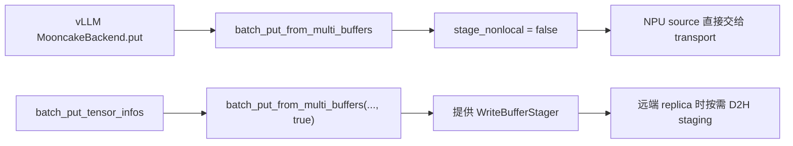

### 8.6 Ascend Direct 与 MemFabric 下的区别

在 `USE_ASCEND_DIRECT` 的普通 Ascend Direct 路径中，若 ADXL 能识别并访问已注册的
NPU pointer，数据可直接从：

```text
当前 NPU source -- ADXL WRITE --> 远端 MEMORY replica
```

开启 staging 后才变为：

```text
当前 NPU source -- ACL/Runtime D2H --> host staging
host staging -- ADXL WRITE --> 远端 MEMORY replica
```

在 MemFabric 模式下，Fabric 目标地址仍然由 Master 分配；staging 只影响 source：

```text
不 staging:  NPU source -- ADXL/Fabric WRITE --> Fabric target VA
staging:    NPU source -- D2H --> host staging
            host staging -- ADXL/Fabric WRITE --> Fabric target VA
```

所以 MemFabric 并不天然要求 staging；是否 staging 取决于 `stage_nonlocal` 是否打开、
`CanUseLocalMemcpy`/transport 是否能直接访问 NPU pointer，以及源地址注册和设备 context
是否满足要求。当前 vLLM 路径把 `stage_nonlocal` 置为 false，直接路径失败时不会在
这一层自动偷偷补一次 D2H staging。

### 8.7 staging 的收益是什么

staging 的收益不是降低单次拷贝延迟，而是把“可能无法传输的 NPU 源地址”转换为一个
传输层和文件后端都容易处理的 host 源地址。它是兼容性/可靠性兜底，不是性能优化开关。

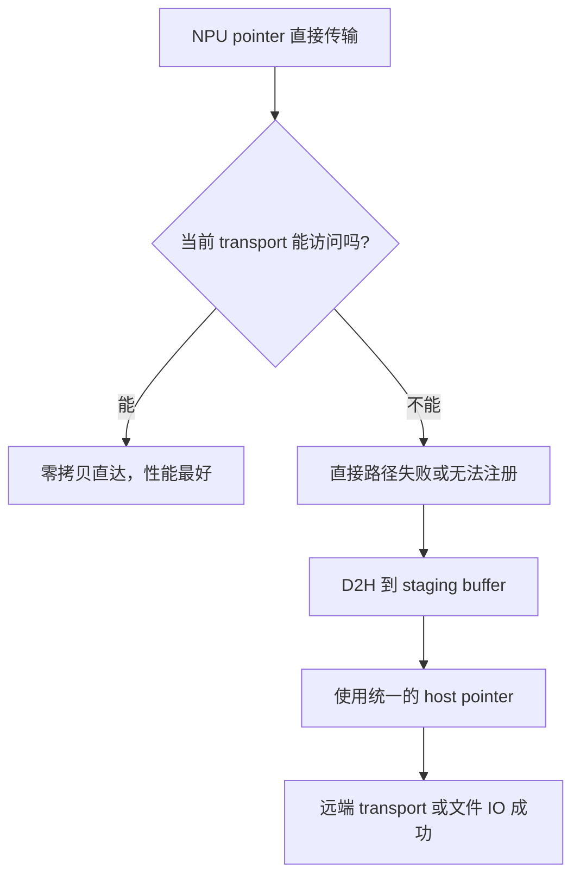

它具体解决以下问题：

| 直接传输的困难 | staging 带来的收益 |
| --- | --- |
| transport 无法注册/解析 NPU pointer | host buffer 通常可注册、可被网络 DMA 读取 |
| 设备 context、进程或 endpoint 不匹配 | D2H 在当前进程完成，后续只处理普通 host 地址 |
| SSD/DFS 的 `pwrite`/`WriteAt` 不接受设备地址 | 将数据转换为文件 API 可读的 host 地址 |
| vLLM 很快复用或释放 HBM block | staging copy 在本次操作结束前保持有效，源 block 可安全复用 |
| 一个 object 有多个不连续 slice | 先汇总到一块连续临时区域，统一管理偏移和生命周期 |

还有一个容易忽略的点：staging 是“每个 object 做一次”，不是“每个 replica 做一次”。
如果同一个 object 要写到三个远端副本，通常只执行一次：

```text
NPU slices -- 一次 D2H --> host staging slices
host staging slices -- 三次 WRITE --> replica-0 / replica-1 / replica-2
```

所以它的代价是一次额外 D2H 和临时 host 内存，而收益是一次 D2H 后可以稳定地服务
多个远端目标，并避免因源指针不可访问而整次 Put 失败。若 Ascend Direct/ADXL 已能
直接读取已注册的 NPU 地址，则应保持 `stage_nonlocal=false`；只有兼容性、文件写入或
生命周期要求存在时，才值得打开 staging。

---

## 9. Client::BatchPut：副本分配和传输

入口：

`mooncake/mooncake-store/src/client_service.cpp:3232-3274`

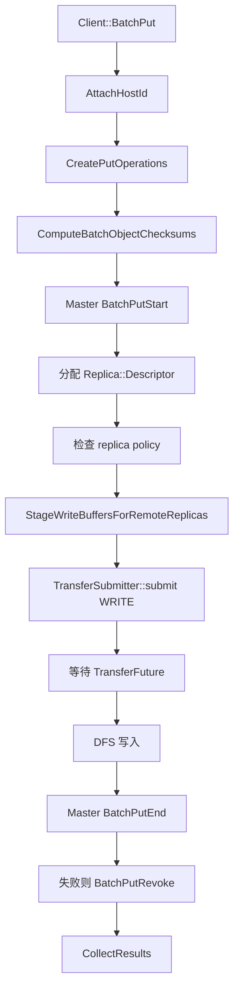

Master 分配副本：

`client_service.cpp:2328-2403`

```cpp
master_client_.BatchPutStart(
    keys,
    slice_lengths,
    config);
```

每个 `Replica::Descriptor` 描述：

- replica 类型：MEMORY、NOF、DISK、DFS 等。
- 所属 segment。
- 目标 endpoint。
- 远端地址和对象大小。
- 副本状态。

因此 Store 写入不是简单的 `memcpy`，而是先分配对象副本，再提交数据传输，最后由 Master 确认完成。

这一章回答“目标副本到底怎么产生”：`ReplicateConfig` 决定请求数量和介质，Master
的 allocation strategy 决定具体落点，`TransferSubmitter` 决定如何把 source 写到
每个 target。当前 vLLM-Ascend 默认构造的配置是 `replica_num=1`、`nof_replica_num=0`、
`dfs_replica_num=0`，因此默认只请求一个 MEMORY/Fabric replica；DP 数量不会自动乘到
这个值上。

```text
ReplicateConfig.replica_num       -> MEMORY/Fabric 副本数量
ReplicateConfig.nof_replica_num   -> NoF SSD 副本数量
ReplicateConfig.dfs_replica_num   -> DFS 副本数量
preferred_segment(s)              -> 位置偏好，不改变数量
enable_offload                    -> 后续 LOCAL_DISK offload，不等价于 nof replica
dynamic_replication_mode          -> 热点读触发的后置 MEMORY 扩副本
```

资源不足时也不是简单的“配置 N 就一定有 N”：memory-only 请求通常 best-effort（至少
一份即可），含 NoF/DFS 或可靠多副本模式则要求拓扑和传输满足配置，否则回收并失败。
完整的配置字段、放置顺序、严格性和 offload/DFS 区分见附录 G。

---

## 10. TransferEngine 和昇腾传输层

### 10.1 `protocol="ascend"` 的编译分支

`mooncake/mooncake-transfer-engine/src/multi_transport.cpp:450-473`

| 编译宏 | 实际 Transport |
|---|---|
| `USE_ASCEND_DIRECT` | `AscendDirectTransport` |
| `USE_ASCEND` | `HcclTransport` |
| `USE_ASCEND_HETEROGENEOUS` | `HeterogeneousRdmaTransport` |

TransferEngine 安装 Ascend transport：

`transfer_engine_impl.cpp:227-233`

```cpp
multi_transports_->installTransport("ascend", local_topology_);
```

### 10.2 AscendDirectTransport 初始化

`ascend_direct_transport.cpp:115-163`

```text
Transport::install
  -> allocateLocalSegmentID
  -> updateLocalSegmentDesc
  -> TransferExecutorBase::Create
  -> transfer_executor_->initialize
```

### 10.3 传输 Slice

`ascend_direct_transport.cpp:85-97`

```cpp
slice->source_addr = request.source;
slice->length = request.length;
slice->opcode = request.opcode;
slice->target_id = request.target_id;
slice->ascend_direct.dest_addr = request.target_offset;
slice->ascend_direct.engine_id = current_engine_id;
```

关键字段：

```text
source_addr：本地源地址
dest_addr：远端目标地址
length：字节数
target_id：目标 Segment ID
opcode：READ / WRITE
engine_id：本地 Ascend engine
```

同步 executor：

`sync_transfer_executor.cpp:46-95`

```cpp
op_desc.local_addr = source_addr;
op_desc.remote_addr = dest_addr;
op_desc.len = length;

engine->TransferSync(
    target_engine_name,
    operation,
    op_descs,
    timeout);
```

异步 executor：

`async_transfer_executor.cpp:68-130`

```cpp
engine->TransferAsync(
    target_engine_name,
    operation,
    op_descs,
    TransferArgs(),
    req_handle);
```

随后通过 `GetTransferStatus(req_handle, task_status)` 轮询完成。

### 10.4 PD 传输抖动：从 BlockPool 分配到 IOV/ADXL 描述符

如果现场使用的是普通 Ascend 模式，先确认：

```text
ASCEND_ENABLE_USE_FABRIC_MEM != 1
backend = mooncake
```

此时 `MooncakeBackend` 在初始化时创建普通 `TransferEngine`，并通过
`global_te.register_buffer(ptrs, lengths)` 注册 vLLM 的 NPU KV 区间。PD 的 D 侧 Load
调用 `store.batch_get_into_multi_buffers(keys, addrs, sizes)`；每个 `addrs[i]` 是 D worker
已经分配好的 HBM 目标地址，每个 `keys[i]` 对应一个外部 Store object。

这里要把“地址不连续”和“IOV 数量”拆成四个可观测量：

```text
vLLM block_id 序列
  -> prepare_value() 生成的 NPU addr/size 数量
  -> Mooncake Slice 数量
  -> ADXL TransferOpDesc 数量
```

下面是普通 Ascend Load 的实际对象关系（图中的 `N` 是一次 BatchGet 中的 object 数量，
`S_i` 是第 `i` 个 object 的 slice 数量）：

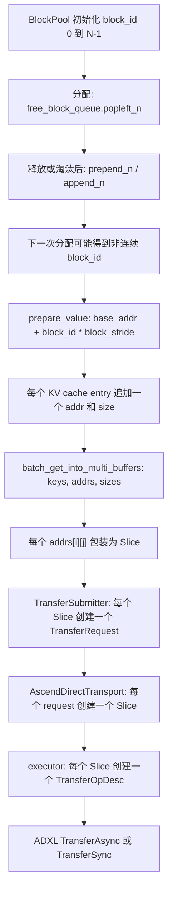

#### 10.4.1 vLLM 的 block 地址是怎样形成的

`BlockPool` 启动时创建 `KVCacheBlock(idx)`，free queue 初始按 block ID 排列；`block_id=0`
被取作 null block。后续 `allocate()` 从 free queue 头部取块，`free_blocks()` 再按缓存/淘汰
策略把块放回队列。启用 prefix caching 后，队列顺序是淘汰顺序而不是地址顺序，所以一次
请求可能拿到例如：

```text
block_ids = [17, 42, 18, 91]
```

对某一个 cache entry，`ChunkedTokenDatabase.prepare_value()` 只做地址换算，不重新分配
显存：

```python
addr = base_addr + block_id * block_stride
size = int(block_len / block_size * (end - start))
```

其中 `base_addr` 来自 `cache.data_ptr()`，`block_stride` 是该 tensor 中一个物理 block 的
步长。因而 `[17, 42, 18, 91]` 会映射为四个相距不规则的 NPU 地址；对 PD Load 来说，
这表示 **D 侧 HBM 目标位置不连续**，不表示 Mooncake 会把它们自动拼接成一段连续内存。

#### 10.4.2 当前普通 Mooncake 路径是否会因 gap 自动增加 IOV

从当前实现看，答案是：**没有一个“检查相邻地址并拆/合并 IOV”的步骤**。

`prepare_value()` 对每个 token chunk 返回一组 `addr_list/size_list`；Worker 把每个 chunk
作为一个 key 追加到 `key_list/addr_list/size_list`。随后：

```text
all_buffers[i].size() = addrs[i].size() = 该 object 的 Slice 数
```

在 `TransferSubmitter::submit_batch()` 中，`operation_count` 直接累加
`all_slices[i].size()`；每个 slice 直接构造一个：

```cpp
TransferRequest {
    source       = slice.ptr,
    target_id    = segment,
    target_offset = replica.buffer_address_ + offset,
    length       = slice.size,
};
```

普通 Ascend Direct 继续保持一一对应关系：

```text
TransferRequest 数量
  = AscendDirectTransport::entries.size()
  = dispatcher 收到的 slice_list.size()
  = executor 的 op_descs.size()
  = ADXL 的 IOV/操作描述符数量
```

所以“block 地址不连续 → IOV 变多”只有在上游因为不连续而**增加了 chunk/object 或
额外拆片**时才成立；就当前标准 `batch_get_into_multi_buffers` 代码而言，地址 gap 本身
不会触发 Mooncake 再拆一次。反过来，即使 block ID 连续，模型有多个 cache entry/layer
时，一个 object 仍然会天然包含多个 slice。

可以用下面的例子区分两种情况：

| 场景 | `block_ids` | 每 object 的 slice 数 | 本批 ADXL 描述符数 | 结论 |
| --- | --- | ---: | ---: | --- |
| 3 个 object、单层 K/V、连续 block | `[10, 11, 12]` | 2 | 6 | 地址连续，但仍有 K/V 两个 slice |
| 3 个 object、单层 K/V、非连续 block | `[10, 40, 12]` | 2 | 6 | 地址有 gap，描述符数不因 gap 增加 |
| 原本能合成 1 个 object，上游遇 gap 后拆成 3 个 object | `[10, 11, 40]` | 2 | 由 2 增到 6 | object 数增加，才会增加提交/调度开销 |
| 8 层 K/V，单 block | `[40]` | 16 | 16 | block 连续性无关，层数直接决定 slice 数 |

上表的最后一列只讨论**描述符数量**，不代表总时延一定相同；每片大小、目标 endpoint、
连接状态和队列拥塞也会改变时延。

#### 10.4.3 8 ms 到 60 ms 的完整耗时分解

普通 Ascend PD Load 可以按下面的时间点打点。不要只记录 `BatchGet` 总耗时，否则无法
判断是 IOV、连接还是设备队列造成的抖动：

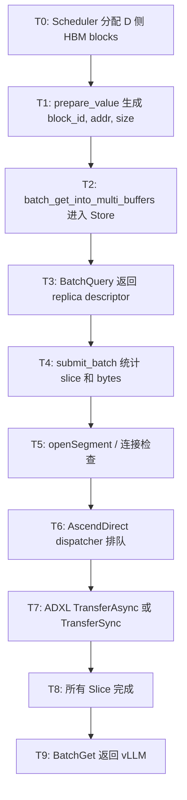

建议每个 BatchGet 同时记录：

```text
request_id
object_count              = len(keys)
slice_count               = sum(len(addrs[i]) for i in objects)
total_bytes               = sum(size for sizes in all_sizes for size in sizes)
avg/max_slice_bytes
block_ids                  = 每个 object 对应的 block_id
block_gap_count            = 相邻 block_id 不满足 +1 的次数
unique_target_endpoint_count
T2-T3 / T3-T4 / T4-T6 / T6-T8 / T8-T9
```

判断方法：

| 观测结果 | 更可能的原因 |
| --- | --- |
| `slice_count`、`op_descs.size()` 与时延同步升高 | IOV/描述符构造、提交和设备调度开销 |
| `slice_count` 不变，但 `T6-T8` 升高 | ADXL 队列拥塞、远端带宽/竞争或单片过小 |
| `T4-T6` 偶发升高 | `openSegment`、连接建立/重连、endpoint 选择变化 |
| `T2-T4` 升高而传输阶段稳定 | Master metadata 查询或 replica 选择延迟 |
| `block_gap_count` 升高但 `slice_count` 不变 | 地址碎片存在，但不是 IOV 数量的直接原因；继续看设备侧访存/页映射和实际带宽 |
| `slice_count` 不变、`total_bytes` 变大 | 主要是传输字节量变化，不应归因于 IOV 增多 |

#### 10.4.4 普通 Ascend 下要特别检查的两个“批量上限”

1. **Store/TransferEngine 批量**：`submit_batch()` 的 `operation_count` 等于所有 object
   的 slice 总数；它会决定一次 `submitTransfer(requests)` 的请求数组大小。
2. **Ascend 本地拷贝批量**：只有 WRITE 且所有 replica endpoint 被判定为同进程时，才可能
   进入 `LocalCopyEngine` 的 `aclrtMemcpyBatch`。PD 的远端 READ 默认不是这条路径，而是
   Ascend Direct 的 `TransferOpDesc` 批量。

因此现场如果把“IOV”理解为 `aclrtMemcpyBatch` 的数组，也要先确认操作方向和路径；普通
Ascend PD Load 更应优先看 `slice_list.size()`、`op_descs.size()` 和 ADXL 的提交/完成时间。

#### 10.4.5 最小验证结论

在不改分配策略的前提下，可以先做一次相关性实验：把每次 PD Load 的
`block_ids / slice_count / op_descs.size() / total_bytes / T4-T8` 输出到同一行。若 8 ms
和 60 ms 样本的 `op_descs.size()` 基本相同，则“地址不连续导致 IOV 变多”与当前普通
Mooncake 实现不一致；若只有高延迟样本的 `slice_count` 和 `op_descs.size()` 成倍增加，
再去追上游是哪一层把连续 block 拆成了更多 chunk/object。

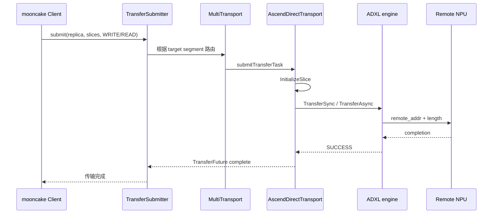

---

## 11. ACL 地址识别和本地拷贝

Ascend accelerator abstraction：

`mooncake/mooncake-store/src/device/ascend_accelerator_device.cpp:16-91`

通过：

```cpp
aclrtPointerGetAttributes(ptr, &attr);
```

判断指针是 Host 还是 Device。

拷贝使用：

```cpp
aclrtMemcpy(dst, size, src, size, kind);
```

支持：

```text
Host -> Device
Device -> Host
Device -> Device
Host -> Host
```

RuntimeAccelerator 会先识别源/目标地址，再选择 ACL 拷贝方向：

`runtime_accelerator.cpp:18-51`

这部分主要用于 staging、磁盘回读、本地副本等；普通 Mooncake NPU KV 路径默认不先 staging。

---

## 12. 普通 KV Load 路径

Worker 入口：

`pool_worker.py:871-980`

```text
LoadSpec
  -> process_token_key_strings_with_block_ids
  -> prepare_value
  -> 生成本地 NPU 目标地址
  -> MooncakeBackend.get
```

`MooncakeBackend.get()`：

`mooncake_backend.py:223-266`

```python
store.batch_get_into_multi_buffers(
    keys, addrs, sizes)
```

RealClient：

`real_client.cpp:6111-6141`

```text
batch_get_into_multi_buffers
  -> BatchQuery(keys)
  -> 选择最佳 replica
  -> 构造目标 Slice
  -> Client::BatchGet
  -> 等待传输
  -> checksum 校验
```

最佳 replica 优先级：

```text
local MEMORY
  > any MEMORY
  > local NOF
  > any NOF
  > LOCAL_DISK
  > DFS
  > DISK
```

`Client::BatchGet()` 使用：

`client_service.cpp:1606-1708`

```cpp
transfer_submitter_->submit(
    replica,
    slices,
    TransferRequest::READ);
```

方向是：

```text
远端 Store replica
    -> Ascend transport READ
    -> 当前 worker 的 NPU KV cache block
```

```mermaid
flowchart TD
    A["Scheduler 发现 KV pool 命中"] --> B["本地分配 block_id"]
    B --> C[生成 key]
    C --> D[prepare_value]
    D --> E[本地 NPU dst addr]
    E --> F[batch_get_into_multi_buffers]
    F --> G[BatchQuery 获取 replica]
    G --> H[选择 local/remote MEMORY replica]
    H --> I[TransferSubmitter submit READ]
    I --> J[Ascend transport]
    J --> K[写入本地 NPU KV cache]
    K --> L[返回完成状态]
```

成功时 C++ 可能返回实际字节数，vLLM 会将正数归一化为 `0`；负数表示 Mooncake `ErrorCode`。

---

### 12.1 从远端 SSD 读取 KV：先看控制面，再看数据面

这里的“远端 SSD KV load”特指查询结果最终选中了 `ReplicaType::NOF_SSD`。如果同一个
key 同时存在可读的 `MEMORY` replica，`SelectBestReplica()` 通常会优先使用内存副本；
而当前 vLLM-Ascend 默认 `nof_replica_num=0`，所以必须显式配置并成功写入 NoF 副本，
才会进入下面这条路径。

还要区分 `NOF_SSD` 和 `LOCAL_DISK`：前者是通过 NVMe-oF 访问另一台机器上的 namespace，
走 `SpdkNofWorkerPool`；后者是本机文件/SSD offload，走
`batch_get_into_offload_object_internal()`，不是下面的远端 NoF 数据面。

远端 offset 并不是 load 时临时分配的，而是在 save 时建立并固化：

```text
Save 控制面：Master::PutStart
  -> NoF allocator 在某个 NoF segment 分配 [buffer_address_, size_]
  -> 返回 NoF descriptor（endpoint + byte offset）
Save 数据面：TransferSubmitter WRITE
  -> spdk_nvme_ns_cmd_write(..., lba=buffer_address_/block_size, ...)
  -> PutEnd 将 replica 状态置为 COMPLETE

Load 控制面：GetReplicaList / BatchGetReplicaList
  -> 读取上述 descriptor，不重新分配远端空间
Load 数据面：TransferSubmitter READ
  -> 使用同一个 endpoint 和 offset 发起 read
```

一次 load 可以拆成两个平面：

| 平面 | 解决的问题 | 主要对象/接口 | 是否承载 KV payload |
| --- | --- | --- | --- |
| 控制面 | 读哪个 key、选择哪一份副本、远端 offset 和本地目标地址是什么、对象是否可读 | `BatchQuery`、`MasterClient::BatchGetReplicaList`、`GetReplicaListResponse`、`Replica::Descriptor`、lease | 否，只传 metadata |
| 数据面 | 按选出的 endpoint 和 offset 发起 NVMe read，并把字节写入本地目标 buffer | `TransferSubmitter`、`SpdkNofTask`、`SpdkWrapper::SubmitRequest`、`spdk_nvme_ns_cmd_read` | 是，传输 KV payload |

#### 总体关系图

```mermaid
flowchart TD
    A["vLLM worker<br/>batch_get_into_multi_buffers"] --> B["控制面：BatchQuery(keys)"]
    B --> C["Master 查 key 元数据<br/>过滤不可读 replica"]
    C --> D["选择 COMPLETE NOF_SSD replica"]
    D --> E["得到 endpoint、远端 byte offset、object size"]
    E --> F["把本地 HBM/host 地址包装成 Slice"]
    F --> G["数据面：提交 NVMe-oF READ"]
    G --> H["远端 SSD namespace 读取 payload"]
    H --> I["写入本地 ptr<br/>回到 vLLM KV cache"]
```

控制面返回的 descriptor 与数据面使用的地址必须分开理解：

```text
Replica::Descriptor::get_nof_descriptor().buffer_descriptor
  ├─ transport_endpoint_ : 远端 NVMe-oF controller/namespace 的连接描述
  ├─ buffer_address_     : NoF segment 内的远端 byte offset，不是可解引用指针
  ├─ size_               : 该 replica 为 object 预留的字节数
  └─ protocol_           : 传输协议标记（NoF 读取由 SPDK 路径处理）

Slice.ptr / `all_buffers[i][j]`
  = 当前 worker 提供的本地目标地址，通常是 NPU HBM；也可能是可 DMA 的 host/staging buffer
```

#### 控制面：从 key 到 NoF descriptor

```mermaid
flowchart TD
    A["MooncakeBackend.get()"] --> B["RealClient::batch_get_into_multi_buffers()"]
    B --> C["client_->BatchQuery(keys)"]
    C --> D["MasterClient::BatchGetReplicaList() RPC"]
    D --> E["MasterService::BatchGetReplicaList()"]
    E --> F["按 tenant + key 查 metadata"]
    F --> G["IsReplicaReadable()<br/>只保留可读状态，通常要求 COMPLETE"]
    G --> H["返回 GetReplicaListResponse<br/>replicas + lease_ttl + checksum"]
    H --> I["SelectBestReplica() 扫描副本优先级"]
    I --> J{"选中 NOF_SSD？"}
    J -->|"否"| K["转 MEMORY/LOCAL_DISK/DFS 对应路径"]
    J -->|"是"| L["Replica::Descriptor<br/>endpoint + offset + size"]
    L --> M["校验目标 buffers 总大小"]
    M --> N["NOF 要求 slices 可合并为连续范围"]
    N --> O["OpenNofSegment(endpoint)<br/>创建或复用 controller/namespace/qpair"]
    O --> P["形成 transfer 参数：ptr、offset、size"]
```

控制面的关键代码语义如下：

1. `RealClient::batch_get_into_multi_buffers_internal()`（`real_client.cpp:6148` 起）先调用
   `client_->BatchQuery(keys)`，此时还没有读取 SSD 数据，只拿到每个 key 的
   `QueryResult`。随后 `SelectBestReplica()` 在返回的 descriptor 列表中选择副本。
2. `MasterService::BatchGetReplicaList()`（`master_service.cpp:3878` 起；单 key 时对应
   `GetReplicaList()`）从 metadata
   中调用 `IsReplicaReadable()` 过滤副本，并刷新对象的读 lease。正在写入的
   `PROCESSING` replica 不会被当成可读数据源；没有可读副本则返回
   `REPLICA_IS_NOT_READY` 或 `OBJECT_NOT_FOUND`。
3. 选中 `NOF_SSD` 后，客户端把调用方传入的
   `all_buffers[i][j]`、`all_sizes[i][j]` 变成 `Slice{ptr, size}`。这组 slice 描述的是
   **本地写入位置**，不是远端 SSD 地址。NoF 当前要求这些目标 slice 能形成一个连续
   范围；无法由 `GetContiguousSliceRange()` 合并时，`BatchGet` 直接返回
   `INVALID_PARAMS`，不会发起部分读取。
4. `OpenNofSegment(endpoint)`（`spdk_wrapper.cpp:305`）解析 `transport_endpoint_`。
   `SpdkWrapper` 按 controller
   key 缓存连接；首次使用时调用 `spdk_nvme_probe()`，从 controller 获取 namespace，
   再调用 `spdk_nvme_ctrlr_alloc_io_qpair()` 创建 I/O qpair。后续同 endpoint/namespace
   可以复用已缓存句柄，避免每个 KV object 重复建连。

#### 数据面：从远端 namespace 到本地 `ptr`

```mermaid
flowchart TD
    A["SpdkNofWorkerPool"] --> B["SpdkWrapper::SubmitRequest()"]
    B --> C["spdk_nvme_ns_cmd_read()<br/>提交远端 LBA 读取命令"]
    C --> D["本地 initiator NIC"]
    D --> E["NVMe-oF fabric<br/>RDMA / TCP / FC"]
    E --> F["远端 target NIC"]
    F --> G["NVMe-oF target<br/>Linux nvmet 或 SPDK nvmf_tgt"]
    G --> H["远端 NVMe namespace"]
    H -->|"read payload 返回"| G
    G --> I["远端 target NIC"]
    I --> J["NVMe-oF fabric"]
    J --> K["本地 initiator NIC DMA"]
    K --> L{"目标 ptr 类型"}
    L -->|"支持 peer-memory 的 NPU HBM"| M["DMA 直接写 HBM<br/>完成后 vLLM 直接使用"]
    L -->|"host pinned 或 staging"| N["先写 host buffer"]
    N --> O["必要时执行 H2D/ACL copy"]
    M --> P["SPDK completion + TransferFuture 完成"]
    O --> P
```

图中从 `SubmitRequest()` 到远端 namespace 的箭头表示 **read command**；从 namespace
返回本地 NIC 的箭头表示 **KV payload**。两者共用同一个 NVMe-oF controller/qpair，
但方向和含义不同，不能把 `spdk_nvme_ns_cmd_read()` 理解为一次 CPU memcpy。

NoF 的地址换算发生在 `TransferSubmitter::submitSpdkNofOperation()`：

```cpp
uint32_t block_size = spdk_wrapper.GetBlockSize(seg_handle);
uint64_t lba = handle.buffer_address_ / block_size;
uint32_t lba_count = size / block_size;
void* ptr = contiguous_range.ptr;  // 本地目标地址
```

提交前会检查 `buffer_address_`、`size` 和 `ptr` 都按 namespace sector size 对齐；这里的
`handle.buffer_address_` 是远端 NoF segment 的 byte offset，除以 block size 后才成为
NVMe LBA。`ptr` 没有经过“远端地址换算”，它始终是本地进程看到的目标地址。

例如，假设 descriptor 给出 `buffer_address_=0x400000`、`size_=256 KiB`，远端 namespace
sector size 为 `4096` 字节，而 `GetContiguousSliceRange()` 得到本地连续目标
`ptr=0x7f...`、`size=256 KiB`，那么一次逻辑读取会形成：

```text
remote lba       = 0x400000 / 4096 = 1024
lba_count        = 256 KiB / 4096 = 64
local destination = ptr（不参与 lba 计算）
```

随后 worker 可能按默认 `MC_NOF_SUBMIT_CHUNK_BYTES=128 KiB` 拆成两个 128 KiB 子请求；
每个子请求只改变 `submit_lba` 和 `submit_ptr`，不会重新查询 Master。

真正的异步提交由 `SpdkNofWorkerPool` 完成：

```text
SpdkNofTask(ptr, lba, lba_count, READ)
  -> 按 blocks_per_chunk（当前实现通常为 128 KiB）拆成多个子 I/O
  -> 受 inflight_blocks_limit 约束，调用 SpdkWrapper::SubmitRequest()
  -> spdk_nvme_ns_cmd_read(ns, qpair, submit_ptr, submit_lba, submit_lba_count, cb, ctx)
  -> spdk_nvme_qpair_process_completions() 轮询 completion
  -> nvmf_io_complete() 更新 outstanding_sub_io / 失败状态
  -> SpdkNofOperationState 完成，TransferFuture 返回
```

因此，控制面最终决定的是“`key -> 哪个 endpoint 的哪个 offset`”以及“写入哪个本地
`ptr`”；数据面只执行已经确定的块读。远端 SSD 本身并不知道 Mooncake key、KV layer 或
vLLM block id，它只看到 NVMe-oF read command 和 LBA。

#### HBM 直写的边界

代码层面，`MEMORY/NOF` 分支确实把用户传入的 NPU buffer 直接包装为 `Slice`，NoF
`SubmitRequest()` 也直接把 `ptr` 交给 SPDK。因此接口形态支持“远端 SSD -> 本地 HBM”的
单段 DMA 目标。但当前 Mooncake 代码没有发现显式的 NDS、P2PDMA 或 Ascend Direct
Storage API；SPDK/网卡/驱动是否能注册并写入 NPU HBM，取决于部署环境的 peer-memory
支持。若不能注册，实际部署需要在上层加入 host pinned staging，再做 H2D，不能仅凭
`TransferFuture` 成功就断言是零拷贝。

另外，`TransferFuture` 的完成只表示 SPDK I/O 已完成并通过 callback 汇总；它不负责
vLLM 的 HBM block 命中判断，也不替代上层对 checksum、lease 和 block 生命周期的管理。

## 13. Layerwise 路径

### 13.1 Mooncake layerwise key 路径

当：

```python
use_layerwise=True
backend="mooncake"
```

使用：

```text
LayerPoolKey
KVCacheStoreKeyLayerSendingThread
KVCacheStoreKeyLayerRecvingThread
```

保存：

`kv_transfer.py:1042-1187`

```python
key = key.split_layers(num_layers)[layer_id]
addr, size, _ = token_database.prepare_value_layer(...)
self.m_store.put(keys, addrs, sizes)
```

加载：

`kv_transfer.py:1201-1305`

```python
prepare_value_layer(...)
self.m_store.get(key_list, addr_list, size_list)
```

因此 Mooncake layerwise 仍然是：

```text
每层一个 object key
每层一组 buffer slices
每层单独 put/get
```

#### 13.1.1 保存端：先由 Worker 建 block 范围，再由 key 线程筛选

入口是 `pool_worker.py:1659-1661`：每个 physical layer 调用
`_process_save_for_layer_batch()`，生成该层的 `LayerTransferTask`。这个阶段只确定
候选范围，不做传输：

```python
save_start_block = request.save_start_token // block_size
save_end_block = request.save_end_token // block_size

request_block_ranges.append(
    LayerBlockRange(
        request=request,
        start_block=save_start_block,
        end_block=save_end_block,
        partial_block_index=partial_block_index,
    )
)
```

同时会排除三类 block：

```text
已经被 Store 命中的区间       -> 避免重复写 READABLE object
store_mask=False 的 chunk      -> 当前 cache group 不允许保存
align-state 下的空 block       -> skip_null_blocks
```

如果同一 `put_step` 组的多个 TP rank 共享相同 KV（典型是 MLA），Worker 在
`pool_worker.py:1026-1031` 直接让非首 rank 不建保存任务：

```python
if self.tp_rank % self.put_step != 0:
    return
```

之后 `KVCacheStoreKeyLayerSendingThread._handle_request()` 才把 token chunk 转成
当前 layer 的 key 和地址：

```python
# key_all 是同一 chunk 按 layer 拆开的 key 列表
keys.append(key_all[layer_id])

# 只取当前 layer 的 KV cache entry，不取其他 layer
addr, size, _ = self.token_database.prepare_value_layer(
    starts[index], ends[index], request.block_ids, layer_id
)
```

对于 `dcp_size <= 1` 且不是 align-state 的 group，key 线程再按候选 block 的顺序做
TP 条带筛选（`kv_transfer.py:1160-1163`）：

```python
rank = self.tp_rank % self.put_step
starts = starts[rank::self.put_step]
ends = ends[rank::self.put_step]
keys = keys[rank::self.put_step]
```

这里的 `rank::put_step` 是 Python 列表切片，不是按 token 或 layer 切；它筛的是
`process_tokens()` 生成的第 0、1、2... 个 chunk。例如 `put_step=4`：

```text
TP0 -> candidate chunk 0, 4, 8, ...
TP1 -> candidate chunk 1, 5, 9, ...
TP2 -> candidate chunk 2, 6, 10, ...
TP3 -> candidate chunk 3, 7, 11, ...
```

筛选后的每个 chunk 只包含一个 layer 的地址数组，随后执行：

```python
exists_states = self.lookup(key_list)
missing_indices = [i for i, exists in enumerate(exists_states) if not exists]
self.sync_save_events[layer_id].synchronize()
self.m_store.put(keys_to_put, addrs_to_put, sizes_to_put)
```

`sync_save_events[layer_id]` 确保当前 layer 的 NPU 写入已经完成，Mooncake 的
`put()` 才能从这些本地 NPU 地址读取正确数据。

#### 13.1.2 加载端：不做 block 条带筛选，只做错峰

`KVCacheStoreKeyLayerRecvingThread._handle_request()` 会遍历
`LayerBlockRange.start_block:end_block` 的**全部命中 block**，为当前 layer 生成 key
和本地目标地址，然后调用 `m_store.get()`：

```python
for block_index in range(block_range.start_block, block_range.end_block):
    key = self.token_database._make_key_by_hash(
        chunk_hash,
    ).split_layers(self.final_layer_id + 1)[layer_id]
    start = block_index * group_block_size
    end = start + group_block_size
    addr, size, _ = self.token_database.prepare_value_layer(
        start, end, request.block_ids, layer_id
    )
    key_list.append(key.to_string())
    addr_list.append(addr)
    size_list.append(size)
```

下面这段容易被误解：

```python
shift = (self.tp_rank * len(key_list)) // self.tp_size
key_list_c = _circular_shift(key_list, shift)
addr_list_c = _circular_shift(addr_list, shift)
size_list_c = _circular_shift(size_list, shift)
self.m_store.get(key_list_c, addr_list_c, size_list_c)
```

`_circular_shift()` 只改变提交顺序，目的是让不同 TP rank 不要同时从同一个远端
segment 发起完全相同的 I/O；它没有删除 block，也没有把 block 分配给不同 rank。
所以如果多个 TP rank 都需要同一份 MLA latent，当前 AscendStore 的 layerwise key
load 仍会每个 rank 各执行一次 `get`，不会像 `lmcache-ascend` 的
`save_only_first_rank` 那样由首 rank 读取后广播。

#### 13.1.3 这句话的准确含义

因此“layerwise key 线程也按相同规则筛选 block”应严格理解为：

```text
保存端：按 tp_rank % put_step 做 block 条带筛选
加载端：读取全部需要的 block；circular shift 只用于错峰
```

对于 GLM/DSV4 MLA，还要注意当前代码的两个条件同时存在：Worker 的
`_process_save_for_layer_batch()` 只允许 `tp_rank % put_step == 0` 的 rank 建任务，
而 key 发送线程仍有 `starts[rank::put_step]` 切片。若把
`use_layerwise=True, backend="mooncake"` 用在 `put_step>1` 的 MLA 上，这两层规则会
叠加；该组合不应直接等同于 `save_only_first_rank`，应以实际版本的 layerwise 支持
和端到端命中测试为准。当前文档中的 TP block 分片结论主要针对普通 KV（`put_step=1`）
或明确支持该路径的配置。

### 13.2 Memcache GVA 路径

只有：

```python
use_layerwise=True
backend="memcache"
```

才会使用：

```text
batch_alloc
batch_get_key_info
lease
batch_copy
```

保存：

```text
GVA + NPU addr + size
  -> batch_copy(direction=0)
```

加载：

```text
GVA + NPU addr + size
  -> batch_copy(direction=1)
```

对比：

| 项目 | Mooncake Store layerwise | Memcache GVA |
|---|---|---|
| key | `LayerPoolKey` | GVA/key-info |
| 地址 | NPU tensor slice | GVA + NPU slice |
| 写入 | `store.put()` | `batch_copy()` |
| 副本 | Mooncake replica | Memcache lease/GVA |
| 元数据 | Master | Memcache metadata |

---

## 14. 与 `MooncakeConnectorV1` 的区别

`MooncakeConnectorV1` 的 metadata 直接携带：

```python
kv_caches_base_addr
block_lens
block_strides
remote_engine_id
remote_port
```

见：

`vllm-ascend/vllm_ascend/distributed/kv_transfer/kv_p2p/mooncake_connector.py:97-129`

直连 P2P：

```mermaid
flowchart LR
    A["Prefill Worker"] -->|交换 metadata| B["Decode Worker"]
    B --> C[直接获得远端 block 地址]
    C --> D[TransferEngine READ/WRITE]
    D --> E[目标 NPU KV cache]
```

Store 路径：

```mermaid
flowchart LR
    A["vLLM key/hash"] --> B["Mooncake Master"]
    B --> C[查询 Replica Descriptor]
    C --> D[TransferSubmitter]
    D --> E[Ascend Transport]
    E --> F[远端/本地对象副本]
```

核心差异：

```text
P2P connector：远端 worker 直接提供地址
Store connector：vLLM 只提供 key 和本地 buffer 地址，Store 再解析远端 replica
```

---

## 15. 地址生命周期、错误和一致性

```mermaid
stateDiagram-v2
    [*] --> TorchAllocated: vLLM 创建 NPU KV tensor
    TorchAllocated --> RegionComputed: data_ptr / stride / length
    RegionComputed --> Registered: register_memory
    Registered --> UsedAsSource: Store put
    Registered --> UsedAsDestination: Store get
    UsedAsSource --> Registered
    UsedAsDestination --> Registered
    Registered --> Unregistered: worker/store 销毁
    Unregistered --> [*]
```

三类地址：

| 地址 | 创建者 | 用途 |
|---|---|---|
| vLLM KV tensor 地址 | PyTorch NPU allocator | 当前模型 KV block |
| Mooncake local buffer | `ClientBufferAllocator` | Store 本地对象/staging 空间 |
| Mooncake global segment | Store/Fabric allocator | replica 所在共享 segment |
| 远端 target address | Master + `SegmentDesc` | Ascend transport 远端目标 |

常见失败点：

- Master 无可用 replica。
- `TransferSubmitter` 未初始化。
- Ascend transport 连接失败。
- ADXL/HCCL/ACL 拷贝失败。
- `BatchPutEnd` 或 `BatchPutRevoke` 阶段失败。
- `BatchGet` 查询不到对象或 checksum 校验失败。
- Store lease 过期。

Load 失败时，vLLM 会把对应 block ID 记录到 `_invalid_block_ids`，避免继续使用损坏或未填充的 block。

---

## 16. 一张总图

```mermaid
flowchart TD
    A["vLLM Scheduler"] --> B["block_hashes"]
    B --> C[PoolKey / LayerPoolKey]
    C --> D[batch_is_exist]
    D --> E[LoadSpec]
    E --> F[vLLM 分配本地 block_id]
    F --> G[prepare_value]
    G --> H[本地 NPU 地址 + size]

    H --> I{Save / Load}
    I -->|Save| J[batch_put_from_multi_buffers]
    I -->|Load| K[batch_get_into_multi_buffers]
    J --> L[BuildNestedSlicesFromBuffers]
    K --> L
    L --> M[Client::BatchPut / BatchGet]
    M --> N[Master 查询/分配 replica]
    N --> O[TransferSubmitter]
    O --> P[MultiTransport]
    P --> Q{Ascend backend}
    Q -->|USE_ASCEND_DIRECT| R[AscendDirectTransport + ADXL]
    Q -->|USE_ASCEND| S[HcclTransport]
    Q -->|USE_ASCEND_HETEROGENEOUS| T[Heterogeneous RDMA]
    R --> U[ACL / 设备侧传输]
    S --> U
    T --> U
    U --> V[远端 replica 或本地 NPU KV cache]
```

## 17. 最关键的结论

1. vLLM 负责 token/hash、block ID 和本地 NPU 地址计算。
2. Mooncake Store 负责 key 到 replica 的映射。
3. Master 负责副本分配和对象状态。
4. TransferEngine 负责将 `Slice` 转为传输任务。
5. Ascend transport 负责真正的设备间传输。
6. ACL 负责地址类型识别、Host/Device 拷贝和 staging。
7. `protocol="ascend"` 的具体实现取决于 Mooncake 编译宏和硬件模式。
8. Store 普通路径不是单次 `memcpy`，而是“对象元数据 + replica 分配 + 传输 + 完成确认 + checksum/lease”的完整流程。

---

## 附录 A：`global_segment_size` 的精确切分算法

以下附录保留原问题对应的子编号（18.x～24.x），便于和之前的源码笔记、日志或讨论
逐条对照；正文阅读顺序以第 2～17 章为准。

切分入口位于 `mooncake/mooncake-store/src/real_client.cpp:71-81`，外层循环位于 `real_client.cpp:974-982`。

### 18.1 `split_limit` 从哪里来

`mooncake/mooncake-store/src/client_service.cpp:54-63`：

```cpp
if (protocol == "efa" || protocol == "cxi") {
    return globalConfig().max_mr_size;
}
if (protocol == "ub") {
    return globalConfig().max_seg_size;
}
return std::nullopt;
```

因此：

| 协议 | `split_limit` |
|---|---|
| `efa` / `cxi` | `max_mr_size` |
| `ub` | `max_seg_size` |
| `ascend` | 默认无上限 |
| `tcp` / `rdma` | 默认无上限 |

在 `USE_ASCEND_DIRECT` + Ascend Agent Mode 下，还会执行：

```cpp
cap = global_segment_size / device_count;
split_limit = min(existing_limit, cap);
```

实现见 `mooncake/mooncake-store/src/real_client.cpp:88-96` 和 `936-949`。

### 18.2 单次切分公式

核心代码：

```cpp
const size_t aligned_limit =
    (*split_limit / alignment) * alignment;
const size_t segment_count =
    DivideRoundUp(remaining, aligned_limit);
const size_t balanced_size =
    DivideRoundUp(remaining, segment_count);
return std::min(
    remaining,
    DivideRoundUp(balanced_size, alignment) * alignment);
```

设：

```text
R = remaining       尚未切分的容量
L = split_limit     单段最大容量
A = alignment       facebook::cachelib::Slab::kSize
```

等价公式：

```text
aligned_limit = floor(L / A) * A
segment_count = ceil(R / aligned_limit)
balanced_size = ceil(R / segment_count)
next_segment  = min(R, ceil(balanced_size / A) * A)
```

关键点：算法不是“每段固定取 `split_limit`”，而是先计算最少段数，再尽量平均分配剩余容量。

### 18.3 外层循环

```cpp
while (global_segment_size > 0) {
    size_t segment_size = GetNextSegmentSize(
        global_segment_size, split_limit, alignment);
    if (segment_size == 0) {
        return tl::unexpected(ErrorCode::INVALID_PARAMS);
    }
    global_segment_size -= segment_size;
    // 分配 segment_size 对应的内存
    // 调用 MountSegment
}
```

```mermaid
flowchart TD
    A["remaining = global_segment_size"] --> B{"split_limit 存在?"}
    B -->|否| C[next = remaining]
    B -->|是| D[按 alignment 对齐 limit]
    D --> E["segment_count = ceil(remaining / aligned_limit)"]
    E --> F["balanced_size = ceil(remaining / segment_count)"]
    F --> G["next 按 alignment 向上对齐"]
    G --> H["next = min(next, remaining)"]
    C --> I["分配 next 大小内存"]
    H --> I
    I --> J["MountSegment"]
    J --> K["remaining -= next"]
    K --> L["remaining > 0?"]
    L -->|是| B
    L -->|否| M[结束]
```

### 18.4 三个具体例子

**普通 Ascend：**

```text
protocol = ascend
global_segment_size = 64 GiB
ascend_agent_mode = false
```

`split_limit` 为 `nullopt`，所以：

```text
next_segment = 64 GiB
结果：segment[0] = 64 GiB
```

**四卡 Ascend Agent Mode：**

```text
global_segment_size = 64 GiB
device_count = 4
split_limit = 64 / 4 = 16 GiB
```

结果：

```text
segment[0] = 16 GiB
segment[1] = 16 GiB
segment[2] = 16 GiB
segment[3] = 16 GiB
```

**EFA 注册上限：**

```text
protocol = efa
max_mr_size = 8 GiB
global_segment_size = 20 GiB
segment_count = ceil(20 / 8) = 3
balanced_size = ceil(20 / 3) ≈ 6.67 GiB
```

因此倾向于 `6.67 + 6.67 + 6.67 GiB`，而不是 `8 + 8 + 4 GiB`。

### 18.5 `segment_size`、`mapped_size`、`mount_size`

分配代码位于 `mooncake/mooncake-store/src/real_client.cpp:984-1024`。

| 变量 | 含义 |
|---|---|
| `segment_size` | 切分算法得到的逻辑大小 |
| `mapped_size` | allocator 实际映射的大小 |
| `mount_size` | 传给 `MountSegment()` 的大小 |

通常先执行：

```cpp
mapped_size = segment_size;
```

HugePage、NUMA 或 Fabric Memory 可能扩大实际映射：

```cpp
mapped_size = align_up(segment_size, page_size);
```

或：

```cpp
ptr = ascend_allocate_memory_best_effort(
    segment_size, protocol, &actual_size);
mapped_size = actual_size;
```

最终：

```cpp
mount_size = split_limit.has_value()
    ? segment_size
    : mapped_size;
```

因此：

```text
有 split_limit：MountSegment 使用 segment_size，不能突破注册限制。
无 split_limit：MountSegment 使用实际 mapped_size。
```

最后要区分两个概念：

```text
global_segment_size 的切分
    = Mooncake Store 共享对象存储容量的切分

vLLM KV cache block 的切分
    = pool_worker.py 根据 data_ptr / stride / block_len 计算地址
```

它们是两个独立过程。

---

## 附录 B：为什么 DP 共用 key，以及 GLM/DSV4 的 TP KV 为什么相同

### 19.1 DP 为什么不放进 Store key

Data Parallel 的含义是：每个 DP replica 都运行一份相同的模型逻辑和相同的 TP 拓扑。对于同一个模型、同一组 prefix token、同一组权重，计算得到的 KV 是确定的：

```text
DP0 + 相同 prefix -> KV(P)
DP1 + 相同 prefix -> KV(P)
```

如果把 `dp_rank` 放进 key：

```text
DP0 -> model@dp0@hash(P)
DP1 -> model@dp1@hash(P)
```

就会把完全相同的 prefix KV 保存两份。当前 `KeyMetadata` 包含 `head_or_tp_rank`、`pcp_rank`、`dcp_rank`、`pp_rank`，但不包含 `dp_rank`，见 `config_data.py:72-92`。

所以设计意图是：

```text
DP0 + TP0 + hash(P) -> 同一个逻辑 Store key
DP1 + TP0 + hash(P) -> 同一个逻辑 Store key
```

DP 仍然影响物理运行环境：

- 每个 DP 进程有自己的 NPU 地址。
- 每个 DP 进程有自己的 Mooncake client/endpoint。
- lookup IPC 路径包含 `dp_rank`，见 `pool_scheduler.py:1194-1209`。
- Store replica 的 preferred segment、SSD rank 目录可能不同。

因此 DP 的职责是区分“执行副本和物理地址”，而不是区分“逻辑 KV 内容”。Load 时多个 DP 可以从同一个 Store object 读取，但写入目标仍然是各自进程的本地 NPU 地址。

前提是这些 DP replica 的模型权重、量化配置、cache dtype 和 cache family 一致；如果这些条件不同，就必须通过模型名或 `cache_family` 等字段隔离 key。

### 19.2 普通 GQA 与 GLM/DSV4 的差异

普通 GQA/MHA 中，TP 往往切分 KV heads：

```text
num_kv_heads >= tp_size
```

这时 vLLM-Ascend 会使用：

```python
put_step = 1
head_or_tp_rank = tp_rank
```

于是同一个 token block 会有多个 rank-specific key：

```text
hash(P) + head_or_tp_rank:0
hash(P) + head_or_tp_rank:1
...
```

但 GLM-DSA、DeepSeek-V4 使用的是 MLA/DSA 风格的 latent KV。其 cache spec 明确设置 `num_kv_heads=1`：

- `vllm_ascend/models/deepseek_v4.py:123-135`
- `vllm_ascend/models/deepseek_v4.py:154-172`
- `vllm_ascend/models/deepseek_v4.py:194-208`
- `vllm_ascend/models/layer/attention/layer.py:168-187`

其中压缩后的 KV latent 和 rope position cache 都按一个 KV head 组织，而不是按每个 query head 保存一份 KV。

### 19.3 DSV4 中 KV 为何在 TP rank 间相同

DeepSeek-V4 attention 初始化中：

`vllm_ascend/models/deepseek_v4.py:738-784`

```python
self.n_heads = config.num_attention_heads
self.n_local_heads = config.num_attention_heads // tp_size

self.wq_b = ColumnParallelLinear(...)
self.wkv = ReplicatedLinear(
    self.dim,
    self.head_dim,
    ...,
)
```

这里的含义是：

```text
wq_b：按 TP 切分，每个 rank 负责一部分 query heads
wkv：ReplicatedLinear，每个 TP rank 都有完整相同的 KV 投影
```

在正常 TP 执行中，各 rank 的 hidden states 在需要的位置保持一致；`wkv` 的权重又是复制的，因此每个 rank 计算出的压缩 KV latent 相同。真正被 TP 切分的是 query 侧，而不是缓存的 latent KV。

可以表示为：

```text
hidden_states
       |
       +--> TP0: replicated wkv -> KV latent K
       +--> TP1: replicated wkv -> KV latent K
       +--> TP2: replicated wkv -> KV latent K
       +--> ...
```

KV cache shape 也印证了这一点。DSV4 的 cache spec 使用：

```text
num_kv_heads = 1
```

而 query head 数仍然是全局 attention head 数，TP rank 只保留：

```text
n_local_heads = num_attention_heads / tp_size
```

因此“每个 TP rank 的 KV 数据相同”不是 Store 做了复制，而是模型 attention 的并行设计决定的：每个 rank 本来就计算出同一份共享 latent KV。

### 19.4 代码如何把 TP key 合并成一个

Worker 计算 key shard：

`vllm_ascend/vllm_ascend/distributed/kv_transfer/kv_pool/ascend_store/pool_worker.py:200-211`

```python
if self.num_kv_head < self.tp_size:
    self.put_step = self.tp_size // self.num_kv_head
    self.head_or_tp_rank = self.tp_rank // self.put_step
else:
    self.head_or_tp_rank = self.tp_rank
    self.put_step = 1
```

以 TP=8、`num_kv_heads=1` 为例：

```text
put_step = 8 / 1 = 8
head_or_tp_rank = tp_rank // 8 = 0
```

所以 8 个 TP rank 得到相同的 key：

```text
TP0 -> @head_or_tp_rank:0
TP1 -> @head_or_tp_rank:0
TP2 -> @head_or_tp_rank:0
...
TP7 -> @head_or_tp_rank:0
```

`my_key_index` 也会落在同一个逻辑 head 组：

```python
self.my_key_index = (
    self.pcp_rank * self.dcp_size * (self.tp_size // self.put_step)
    + self.dcp_rank * (self.tp_size // self.put_step)
    + self.head_or_tp_rank
)
```

此时 `tp_size // put_step = 1`，且 `head_or_tp_rank = 0`，所以在相同 PCP/DCP 下所有 TP rank 的 `my_key_index` 都相同。

### 19.5 相同 key 下如何避免 8 个 rank 重复写同一个 block

相同 key 不代表 8 个 rank 会把每个 block 写 8 次。发送线程会使用 `put_step` 对 block 序列做分片：

`vllm_ascend/vllm_ascend/distributed/kv_transfer/kv_pool/ascend_store/kv_transfer.py:788-797`

```python
shard_rank = self.tp_rank % self.put_step
shard_size = self.put_step
```

例如 TP=8、`put_step=8`：

```text
TP0 保存 block 0, 8, 16, ...
TP1 保存 block 1, 9, 17, ...
TP2 保存 block 2, 10, 18, ...
...
TP7 保存 block 7, 15, 23, ...
```

由于各 rank 的 KV 内容相同，这种分片既避免重复写，又能让所有 rank 共同填充同一个逻辑 object namespace。Mooncake 的 layerwise **保存**线程也有同样的 `tp_rank % put_step` 列表切片（见 `kv_transfer.py:1160-1163`）；但 layerwise 加载线程不按该规则过滤 block，只对完整命中 block 全部执行 `get`，并用 circular shift 错峰提交，详见第 13.1.2 节。

注意：align-state、hybrid 或 TP mismatch 场景可能走专门分支，不一定使用上述普通 KV 分片规则。

### 19.6 Scheduler 为什么只查询一个 TP key

Scheduler 根据：

```python
head_or_tp_ranks = tp_size // put_step
```

生成需要查询的 key 数，见 `pool_scheduler.py:250-329`。

对于普通 GQA：

```text
tp_size = 8
num_kv_heads = 8
put_step = 1
head_or_tp_ranks = 8
```

需要查询 8 个 TP shard key。

对于 DSV4：

```text
tp_size = 8
num_kv_heads = 1
put_step = 8
head_or_tp_ranks = 1
```

只需要查询一个：

```text
model@...@head_or_tp_rank:0@...@hash(P)
```

这就是你看到 GLM/DSV4 中“TP 的 KV key 和数据都相同”的直接代码原因。

### 19.7 最终关系图

```mermaid
flowchart TD
    A["prefix hash P"] --> B["GLM or DSV4 MLA DSA"]
    B --> C[num_kv_heads = 1]
    C --> D[put_step = tp_size]
    D --> E[all TP ranks use head_or_tp_rank 0]
    E --> F[one logical Store key]
    F --> G[TP ranks shard different blocks]
    G --> H[DP0 and DP1 reuse same key namespace]
    H --> I[each DP reads into its own NPU address]
```

一句话总结：

```text
DP 共用 key：因为 DP 是相同模型的副本，prefix KV 可去重。

GLM/DSV4 TP KV 相同：因为 MLA/DSA 将 KV 压缩成共享 latent，cache spec 是
num_kv_heads=1，KV 投影使用 ReplicatedLinear；TP 只切 query heads。
```

### 19.8 MLA 的冗余到底存在哪里，应该怎样处理

要分开看两种“存储”：

```text
本地 vLLM KV cache：每个 TP rank 都有自己的 NPU buffer，内容可能相同
Mooncake Store：相同内容只保留一个逻辑 key/value，避免 TP 副本重复占用
```

本地 buffer 不能简单删掉。Attention kernel 仍然需要每个 TP rank 的本地 cache
地址；Load 时也是同一个 Store value，被分别写入各个 TP rank 自己的 NPU 地址。
去重发生在 Store 的 key/object 层，不是把多个 TP rank 的本地 tensor 合并成一个
vLLM tensor。

对于非 layerwise、`dcp_size <= 1` 的普通保存路径，代码使用：

```python
pre_shard = self.dcp_size <= 1 and not align_state_group
shard_rank = self.tp_rank % self.put_step if pre_shard else None
shard_size = self.put_step if pre_shard else None
```

DSV4/MLA 中 `num_kv_head=1`，所以 `put_step=tp_size`、所有 rank 的
`head_or_tp_rank=0`。当 TP=8 时，逻辑 key 只有一个，但 block 写入可以是：

```text
TP0 -> block 0, 8, 16, ...
TP1 -> block 1, 9, 17, ...
...
TP7 -> block 7, 15, 23, ...
```

这里的“一个 object”是一个具体 token block/hash 对应的 Store value，不是把整个
请求的所有 block 打成一个 object。不同 block 由不同 rank 首次写入，同一个 block
不会因为 TP=8 就产生 8 份逻辑 value；`exists` 检查还会过滤已经存在的 key。

有两个分支要特别注意：

1. `dcp_size > 1` 时，`dcp_rank` 已经进入 key，代表不同上下文分片；上述
   `pre_shard` 会关闭，不能把不同 DCP 的内容误认为冗余。
2. layerwise 保存的 `_process_save_for_layer_batch()` 会先执行
   `if self.tp_rank % self.put_step != 0: return`，同一 `put_step` 组只让首 rank
   建立保存任务；之后按 layer key 写入。它和非 layerwise 的 block 条带分片不是同一
   条代码路径。

如果需要容灾副本，应使用 Mooncake 的 replica 配置，让同一个逻辑 key 产生多个
`Replica`；不要把 `tp_rank` 再塞回 MLA key，否则会把本来相同的 latent KV 人为复制
成 TP 份。反过来，如果 P/D 的 MLA cache spec、压缩比例、dtype 或 layout 不同，不能
仅凭“KV head=1”复用同一个 value，应通过 `model_name`、`cache_family` 或其他元数据
隔离 key。

还要区分 P/D TP mismatch：`infer_tp_mismatch_info()` 的 `enabled` 条件明确包含
`not use_mla`，所以 MLA 不会进入 `_build_tp_mismatch_keys_and_addrs()` 的 strided
head 重排路径。MLA 的适配依赖 latent cache 本身形状相同，而不是把 P 格式转换成 D
格式；如果两边 cache spec 不同，当前代码没有通用的 MLA 重排实现。

这里需要特别澄清：**“Mooncake 只有一个逻辑 value”不等于“整个链路没有冗余”。**
LMCache 的 `save_only_first_rank` 是更激进的优化：它不仅让 MLA rank 共用逻辑 key，
还让非首 rank 变成 passive，不直接访问 StorageBackend，由首 rank 取出后广播。实现
见 `lmcache/v1/cache_engine.py:116-120`、`lmcache/v1/cache_engine.py:1917-1922`
和 `lmcache/v1/cache_engine.py:856-862`；TokenDatabase 还会把 key 中的 logical
world size 折叠为 1，见 `lmcache/v1/token_database.py:234-244`。

当前 AscendStore 的普通 MLA 路径没有这套 passive/broadcast 机制：保存端通过
`put_step` 做 block 条带分片，因此通常不会把同一 block 写成多个 Store object；但
加载端每个 TP rank 仍可能各自调用 `m_store.get()`，把同一个 Store value 传输到自己
独立的 NPU buffer。这是**传输带宽和本地 buffer 层面的重复**，不是 Mooncake key/value
数量的重复。若要达到 `save_only_first_rank` 的效果，需要显式实现“首 TP rank 读写 +
TP 内广播”，不能只依赖当前的 `put_step`。

---

## 附录 C：`store_mask` 到底是什么

前文保存路径中的“根据 `store_mask` 过滤不允许保存的 chunk”，这里的
`store_mask` 是一个由 vLLM KV cache coordinator 计算出来的 **布尔许可表**：

```text
store_masks[group_id][chunk_id] = True   允许把这个 chunk 写入 Mooncake Store
store_masks[group_id][chunk_id] = False  不允许写入，发送线程直接跳过
```

它不是 NPU 地址的 mask，不会改写 tensor，也不是 Mooncake C++ 层的内存位图。
它只决定 Python 侧是否为某个 token chunk 生成 key、地址和传输任务。

### 20.1 数据结构和调用链

Ascend Store 中的调用链是：

```mermaid
flowchart TD
    A["KVCacheStoreSendingThread"] --> B["token_database.store_mask"]
    B --> C[KVPoolCoordinator.store_mask]
    C --> D[Coordinator._reachable_masks]
    D --> E[KV manager reachable_block_mask]
    E --> F[tuple of bool lists per KV group]
    F --> G[group_store_mask]
    G --> H[chunk_filter]
    H --> I[生成 key 和本地 NPU slice]
    I --> J[Mooncake batch put]
```

对应源码：

- `config_data.py:304-325`：`ChunkedTokenDatabase.store_mask()` 只是向 coordinator 转发。
- `coordinator.py:208-216`：`KVPoolCoordinator.store_mask()` 调用 `_reachable_masks()`。
- `coordinator.py:179-206`：按每个 KV group 的 spec 计算 chunk 数，并调用 manager 的 `reachable_block_mask()`。
- `kv_transfer.py:717-790`：发送线程消费 mask，并在 `chunk_filter()` 中过滤 chunk。

返回值的类型是：

```python
tuple[list[bool], ...]
```

其中第一层下标是 `kv_cache_group_id`，第二层下标是该 group 的 chunk 编号：

```text
store_masks = (
    [True, False, True, ...],   # group 0，例如 full attention
    [False, True, False, ...],  # group 1，例如 sliding-window 或 Mamba
)
```

不同 group 的 block size 可能不同，所以每个 `store_masks[group_id]` 的长度也可能不同。
Ascend coordinator 使用：

```text
num_chunks = aligned_token_len / group_effective_block_size[group_id]
```

这里的 `aligned_token_len` 已经按所有 group 的 `lcm_block_size` 对齐；如果请求长度未对齐，
发送线程会捕获断言并暂时不使用该 mask，见 `kv_transfer.py:720-725`。

### 20.2 mask 的来源：可达性而不是“当前有没有数据”

`store_mask` 的 True/False 不是通过读取 NPU 内容得到的，而是由 KV cache manager 根据
attention 语义计算“未来某个合法命中边界是否还需要这个 block”。核心接口是：

```python
manager_cls.reachable_block_mask(
    start_block=0,
    end_block=num_chunks,
    alignment_tokens=lcm_block_size,
    kv_cache_spec=spec,
    use_eagle=...,
    retention_interval=...,
    num_prompt_tokens=...,
)
```

主要情况如下：

| KV 类型 | `reachable_block_mask()` 结果 | 含义 |
| --- | --- | --- |
| Full Attention | `None` | 所有非空 block 都可作为完整前缀的一部分，`store_mask` 转成全 True |
| Sliding Window | 部分 True 的列表 | 只保留落在某个合法窗口命中边界所需的尾部 block |
| Mamba 或稀疏状态 | 部分 True 的列表 | 只保留可以恢复未来状态的边界 state block |
| retention interval 不小于一个 block | 可能退化为 `None` | 每个 block 都是可达边界，不需要稀疏过滤 |

因此，mask 的目标是控制 **保留策略**：

```text
True  = 这个 chunk 将来可能被 prefix lookup 命中并真正消费
False = 即使保存下来，也不能单独形成合法的命中边界，保存属于浪费
```

### 20.3 Full Attention 为什么通常全是 True

基类 `SingleTypeKVCacheManager.reachable_block_mask()` 返回 `None`，注释中明确说明
`None` 表示缓存每个非空 block，见 `single_type_kv_cache_manager.py:478-496`。
Ascend coordinator 随后执行：

```python
tuple([True] * num_chunks if mask is None else mask
      for num_chunks, mask in masks)
```

所以普通 dense/full attention 的典型结果是：

```text
token chunks:  0      1      2      3
store_mask:  True   True   True   True
```

这时 `store_mask` 不会减少 Mooncake 写入数量；真正的跳过通常来自后面的
“已命中对象过滤”和“已从 Store load 的区间过滤”。

### 20.4 Sliding Window / Mamba 为什么会出现 False

Sliding Window 只会在有限窗口内读取历史 KV。窗口外的旧 block 即使被写入 Store，
也不能在符合对齐要求的未来 prefix 边界中单独构成可用命中。manager 会把这些 block 标为 False，
只保留每个窗口边界所需的连续尾部。

Mamba 保存的是状态 snapshot，而不是普通 attention 的每 token K/V。对于稀疏 retention，
中间状态不能替代边界状态；manager 会只标记 segment boundary 或 replay boundary 对应的 state block。

可以把语义抽象成：

```mermaid
flowchart LR
    A["每个 token chunk"] --> B{"未来命中边界需要它吗"}
    B -->|是| C[mask True 保留并可写入 Store]
    B -->|否| D[mask False 不生成传输任务]
```

注意：具体 True 的位置由 window size、block size、alignment、EAGLE 和
`retention_interval` 共同决定，不能简单理解为“前半段全 False、后半段全 True”。

### 20.5 保存线程中的两层过滤

`store_mask` 只是第一层策略过滤。`KVCacheStoreSendingThread._handle_stored_request()`
还会把本次请求已经从外部 Store load 的区间加入第二层 skip 条件：

```text
skip_start = load_spec.vllm_cached_tokens
skip_end   = load_spec.kvpool_store_skip_tokens 或 kvpool_cached_tokens
```

对每个 group，实际判断近似为：

```text
allowed_by_policy = group_store_mask[block_idx]
already_loaded    = skip_start <= chunk_start and chunk_end <= skip_end
should_put        = allowed_by_policy and not already_loaded
```

源码中的 `chunk_filter()` 同时执行这两个条件，见 `kv_transfer.py:746-787`：

```python
block_idx = start // group_block_size
mask_allows = group_store_mask is None or (
    block_idx < len(group_store_mask) and group_store_mask[block_idx]
)
chunk_start = block_idx * raw_group_block_size
return mask_allows and not should_skip(chunk_start, chunk_start + raw_group_block_size)
```

过滤顺序可以画成：

```mermaid
flowchart TD
    A["请求的 token chunks"] --> B{"store_mask 允许吗"}
    B -->|否| C[丢弃 不生成 key 或地址]
    B -->|是| D{本次请求是否已经从 Store load}
    D -->|是| C
    D -->|否| E[生成 PoolKey]
    E --> F[prepare_value 计算本地 NPU 地址和大小]
    F --> G[lookup 已存在 key]
    G --> H[batch_put 新对象]
```

所以被 mask 标成 False 的 chunk 根本不会进入 `prepare_value()`、
`lookup()` 和 `batch_put_from_multi_buffers()`；它不是“先传输再由 Store 丢弃”。

### 20.6 `store_mask` 与 `lookup_mask` 的区别

两者都描述 chunk 可达性，但方向不同：

```text
store_mask  写路径：本次生成的 KV 哪些值得持久化到 Store
lookup_mask 读路径：查询 prefix 时哪些 chunk 可以作为合法命中边界
```

Ascend coordinator 的 `lookup_mask()` 在没有特殊限制时返回 `None`，把它作为全 True 哨兵；
而 `store_mask()` 会把 `None` 展开成长度正确的全 True 列表，方便发送线程按 group/chunk 索引。
因此不要把 `store_mask=False` 理解为“本地 KV 不存在”：本地 tensor 可能仍然有数据，
只是该数据不满足外部 prefix cache 的持久化/复用条件。

### 20.7 一个具体例子

假设请求对齐后有 8 个 chunk，当前已经从 Mooncake load 了 chunk 0 和 1，
manager 根据 attention 语义给出：

```text
初始 store_mask: [True, True, False, True, True, False, True, True]
已 load chunks:   [0, 1]
```

发送线程会先把已 load 的 chunk 0 和 1 过滤掉，再保留 mask 允许且未 load 的 chunk：

```text
chunk 0  mask True   但已 load  -> 跳过
chunk 1  mask True   但已 load  -> 跳过
chunk 2  mask False             -> 跳过
chunk 3  mask True              -> 生成 key、地址并写入
chunk 4  mask True              -> 生成 key、地址并写入
chunk 5  mask False             -> 跳过
chunk 6  mask True              -> 生成 key、地址并写入
chunk 7  mask True              -> 生成 key、地址并写入
```

最终 Mooncake 只看到 chunk 3、4、6、7 对应的 `BatchPut` 操作；mask 不参与地址计算，
地址仍由 `prepare_value()` 根据本地 `block_id`、`block_stride` 和 `data_ptr` 计算。

---

## 附录 D：HBM block 命中和 Mooncake 外部命中的边界

先给结论：

```text
HBM block 命中       -> vLLM KVCacheManager / BlockPool 管理
Mooncake 外部命中    -> AscendStore connector + Mooncake Store 管理
调度顺序             -> vLLM 先查本地 HBM，再查询外部 Store 的剩余前缀
```

Mooncake 不接管 vLLM 的 HBM block ID、引用计数、LRU 驱逐或 slot 分配。
Mooncake 只管理自己的 Store key、对象存在性、replica descriptor、segment 和传输任务。
即使 Mooncake 的某个 replica 恰好位于本机 NPU 内存，它在生命周期上仍是 Store replica，
不等同于 vLLM `BlockPool` 中的 HBM prefix-cache block。

### 21.1 两套缓存的职责

| 层次 | 主要对象 | 负责内容 | 是否负责另一层的 block 命中 |
| --- | --- | --- | --- |
| vLLM HBM prefix cache | `KVCacheManager`、`KVCacheCoordinator`、`BlockPool`、`KVCacheBlock` | token hash 到本地 HBM block 的映射、引用计数、复用、驱逐、slot 分配 | 不查询 Mooncake replica |
| AscendStore external cache | `KVPoolScheduler`、`KVPoolWorker`、`MooncakeBackend`、Mooncake Master | Store key 存在性、对象副本、远端地址、NPU/Host 传输 | 不拥有 vLLM block ID |

这里的“先本地、后外部”不是两个完全独立的结果相加，而是外部查询会收到本地命中长度，
并只检查本地没有覆盖的 suffix。

### 21.2 实际调用顺序

普通新请求在 vLLM scheduler 中大致按如下顺序处理：

```mermaid
sequenceDiagram
    participant S as vLLM Scheduler
    participant KM as KVCacheManager
    participant BP as BlockPool
    participant C as AscendStore Scheduler
    participant IPC as LookupKeyClient and Server
    participant W as KVPoolWorker
    participant M as Mooncake Store

    S->>KM: get_computed_blocks request
    KM->>BP: find longest local prefix hit
    BP-->>KM: HBM blocks and local hit tokens
    KM-->>S: new_computed_blocks and local tokens
    S->>C: get_num_new_matched_tokens request local tokens
    C->>IPC: lookup token_len hashes hbm_hit_tokens
    IPC->>W: lookup_scheduler hbm_hit_tokens
    W->>W: seed local hashes as already existing
    W->>M: exists only for suffix after HBM hit
    M-->>W: external key existence
    W->>W: intersect group and TP rank hits
    W-->>IPC: total external prefix length
    IPC-->>C: external hit tokens
    C-->>S: LoadSpec local hit plus external hit
    S->>KM: allocate local HBM blocks for external suffix
    S->>C: schedule batch get into local HBM
```

关键源码位置：

- `vllm/vllm/v1/core/sched/scheduler.py:759-837`：scheduler 先调用 `_get_local_prefix_cache_hit()`，再调用 connector 的 `get_num_new_matched_tokens()`。
- `vllm/vllm/v1/core/kv_cache_manager.py:238-296`：`get_computed_blocks()` 通过 vLLM 本地 coordinator 查 HBM prefix hit。
- `vllm_ascend/.../pool_scheduler.py:524-574`：AscendStore 接收本地命中数，并传入 `hbm_hit_tokens`。
- `vllm_ascend/.../pool_scheduler.py:1168-1190`：`LookupKeyClient.lookup()` 把命中 token 数通过 ZeroMQ 发给 worker。
- `vllm_ascend/.../pool_worker.py:2252-2337`：worker 在 `_lookup_with_coordinator()` 中跳过 HBM 已命中的前缀，只对 suffix 调 `m_store.exists()`。

### 21.3 HBM 命中具体做了什么

`KVCacheManager.get_computed_blocks()` 的返回值不是一个简单的 True/False，而是：

```text
computed_blocks          本地 HBM 中可复用的 KVCacheBlock 列表
num_new_computed_tokens  本次请求相对 request.num_computed_tokens 新命中的 token 数
shared_prefix_boundary   混合 attention 的共享前缀边界
```

`BlockPool` 内部根据 block hash 找到 `KVCacheBlock`，并增加引用关系；后续调度会直接把这些
block 放入请求的 block table。此时 KV 数据已经在本地 HBM，不需要 Mooncake 做 `GET`。

如果本地命中不是完整 block 对齐长度，scheduler 会先计算：

```text
partial_tail         = local_hit_tokens % scheduler_block_size
block_aligned_local  = local_hit_tokens - partial_tail
```

传给 connector 的 `hbm_hit_tokens` 是 `block_aligned_local`，避免外部传输和 vLLM 的
copy-on-write 产生半 block 冲突。

### 21.4 Mooncake 外部 lookup 如何利用 HBM 命中数

`LookupKeyClient.lookup()` 的参数中有：

```python
lookup(
    token_len,
    block_hashes,
    kv_cache_group_ids,
    hbm_hit_tokens=local_hbm_hit_tokens,
)
```

worker 收到后，在 `_lookup_with_coordinator()` 中执行两步：

```python
if hbm_hit_tokens:
    exists.update(local_prefix_hashes)

lookup_start = (
    hbm_hit_tokens // effective_block_size
) * effective_block_size
```

第一步把本地 HBM 已命中的 hash 直接放进“已存在集合”；第二步让后续
`process_token_key_strings(..., mask_num=lookup_start)` 从 suffix 开始生成 Mooncake key。
因此 Mooncake 并没有重新验证前缀的 HBM 数据，而是信任 vLLM 传入的本地命中边界。

随后才执行：

```python
res = self.m_store.exists(keys)
```

这里的 `exists()` 只查询外部 Store 元数据/对象是否存在，不传输 KV 数据。
worker 再把本地已命中的 hash 和外部存在的 hash 合并，交给
`cache_coordinator.find_longest_cache_hit()` 求最长连续公共前缀。

### 21.5 三个典型场景

| 本地 HBM 命中 | Mooncake 命中 | 实际动作 |
| ---: | ---: | --- |
| 0 token | 0 token | 不加载外部 KV，正常计算 prompt |
| 4K token | 8K token | HBM 保留前 4K，Mooncake 只加载 4K 到 8K 的 suffix |
| 8K token | 8K token | 外部不需要加载；本地 block 直接复用 |
| 8K token | 12K token | HBM 复用前 8K，分配新的本地 HBM block，再从 Store load 8K 到 12K |

对于“本地已经全命中”的情况，`KVPoolScheduler.get_num_new_matched_tokens()` 会在
`num_computed_tokens >= token_len` 时直接返回 0，见 `pool_scheduler.py:566-570`。

### 21.6 外部命中后，数据如何回到 HBM

外部命中只是调度阶段的长度判断；真正的数据回填发生在后续 worker load 路径：

```mermaid
flowchart TD
    A["外部 exists 命中 suffix"] --> B["Scheduler 写入 LoadSpec"]
    B --> C[vLLM 为 suffix 分配 HBM block_id]
    C --> D[prepare_value 计算本地 NPU dst addr]
    D --> E[batch_get_into_multi_buffers]
    E --> F[Mooncake BatchGet 查询 replica]
    F --> G[TransferSubmitter READ]
    G --> H[Ascend transport]
    H --> I[写入 vLLM 本地 HBM KV tensor]
    I --> J[请求 block table 指向这些 HBM blocks]
```

所以要区分两个动作：

```text
exists / batch_is_exist  = 只判断外部对象是否存在，不搬运数据
batch_get                = 根据 replica 地址把数据写入新分配的本地 HBM block
```

### 21.7 一个容易混淆的“本地 replica”

Mooncake 可能选择 `local MEMORY replica` 或本机 NPU segment 作为传输源，这只是
`Replica::Descriptor` 的放置策略和 `TransferSubmitter` 的路由优化：

```text
Mooncake local replica  -> Store 视角的对象副本
vLLM HBM block          -> vLLM 视角的可调度 KV block
```

两者可以落在同一块 NPU 内存上，也可以由一次 Ascend READ 在二者之间搬运；但
block 的分配、引用计数、驱逐和请求 block table 仍由 vLLM 管，Store 的对象生命周期和
replica 数量仍由 Mooncake 管。

最终可以记成一句话：

```text
vLLM 先决定“本地 HBM 已经有多少”；
Mooncake 再回答“外部 Store 从这个位置往后还有多少”；
最后 vLLM 分配目标 HBM block，Mooncake 负责把 suffix 传回来。
```

### 21.8 “过滤 skip 区间”具体指什么

这里的 skip 区间是 **本次请求已经从 KV pool 命中的那段 token 范围**。它只作用于
KV 保存回写路径，不表示跳过模型计算，也不表示跳过从 Mooncake 加载：

```text
[skip_start, skip_end)
```

区间的两个端点来自 `LoadSpec`：

```python
skip_start = load_spec.vllm_cached_tokens
skip_end = (
    load_spec.kvpool_store_skip_tokens
    if load_spec.kvpool_store_skip_tokens is not None
    else load_spec.kvpool_cached_tokens
)
```

源码见 `kv_transfer.py:727-739`。字段语义见 `config_data.py:691-700`：

```text
vllm_cached_tokens       本地 HBM 已经有的 token 数
kvpool_cached_tokens     connector 最终认定可用于本地执行的外部命中长度
kvpool_store_skip_tokens 原始外部命中长度，专门用于防止把已 pooled 前缀再次保存
```

### 21.9 为什么需要这个区间

假设：

```text
本地 HBM 已命中       0K ~ 4K
Mooncake 外部命中      4K ~ 8K
本次请求新计算         8K ~ 12K
```

外部命中数据会先通过 `BatchGet` 写进本地新分配的 HBM block。请求继续执行后，
worker 的保存线程可能会看到完整的 `0K ~ 12K` 请求。如果不设置 skip 区间，保存线程
可能把刚从 Mooncake 读出的 `4K ~ 8K` 又作为新数据 `BatchPut` 回 Mooncake：

```mermaid
flowchart LR
    A["Mooncake already has 4K to 8K"] --> B["BatchGet into local HBM"]
    B --> C[Request continues to 12K]
    C --> D[Save thread sees 0K to 12K]
    D --> E{skip interval}
    E -->|4K to 8K| F[do not put again]
    E -->|8K to 12K| G[put newly computed suffix]
```

这样可以避免重复网络传输、重复对象检查和并发覆盖。在 layerwise 路径中，源码还明确指出，
对已命中的 block 再保存会尝试写入一个 READABLE blob，并可能触发
`MMC_UNMATCHED_KEY`，见 `pool_worker.py:1050-1065`。

### 21.10 保存线程如何判断一个 chunk 是否在 skip 区间

发送线程对每个 chunk 使用半开区间 `[start, end)` 判断：

```python
def should_skip(start: int, end: int) -> bool:
    return skip_end > skip_start and start >= skip_start and end <= skip_end
```

因此只有“完整落在 skip 区间内”的 chunk 才会被过滤：

```text
chunk [4K, 5K)   在 [4K, 8K) 内 -> skip
chunk [7K, 8K)   在 [4K, 8K) 内 -> skip
chunk [8K, 9K)   不在区间内     -> 可以保存
chunk [3.5K, 4.5K) 跨越边界     -> 不按 skip 过滤
```

跨越边界的 chunk 是否最终保存，还要由 block 对齐、`store_mask` 和之后的
`m_store.exists()` 共同决定。这个“完整包含”条件避免误删一个同时包含已命中和新计算数据的 block。

### 21.11 `store_mask`、skip 区间和 exists 的关系

保存一个 chunk 最终需要同时通过三层判断：

```mermaid
flowchart TD
    A["候选 token chunk"] --> B{"store_mask 允许"}
    B -->|否| X[跳过]
    B -->|是| C{完整位于 skip 区间}
    C -->|是| X
    C -->|否| D{Mooncake key 已存在}
    D -->|是| X
    D -->|否| E[prepare_value]
    E --> F[BatchPut]
```

三者分别回答不同问题：

```text
store_mask  ：按 attention/retention 语义，这类 chunk 值不值得持久化？
skip 区间   ：这个请求中，该 chunk 是否已经从外部 pool 得到过？
exists      ：其他请求或其他 DP/TP rank 是否已经把同一个 key 写入 Store？
```

所以“过滤 skip 区间”不是 Mooncake 在收到数据后丢弃，而是 Python worker 在生成 key、
计算 NPU 地址和组装 `BatchPut` 前就不把这些 chunk 放进待发送列表。

---

## 附录 E：`MooncakeBackend.put` 是否把 NPU 地址拷贝到 Mooncake 地址

是的。对当前 Ascend Store 路径来说，`put()` 的语义是：

```text
源地址：vLLM KV cache tensor 中的 NPU 地址
目标地址：Mooncake 为该 key 的 MEMORY replica 分配的地址
动作：通过本地 ACL copy 或 Ascend ADXL 把 slice 数据写入目标地址
```

Python 的 `addrs` 只是源地址列表；Mooncake 目标地址不是 Python 传入的，而是在
`BatchPutStart` 阶段根据 key、slice size 和 replica policy 分配，再由传输层从
`Replica::Descriptor` 中取出。

### 22.1 从 `put()` 到目标地址的完整链路

```mermaid
flowchart TD
    A["KVPoolWorker prepare_value"] --> B["local NPU addrs and sizes"]
    B --> C[MooncakeBackend.put]
    C --> D[batch_put_from_multi_buffers]
    D --> E[BuildNestedSlicesFromBuffers wraps source pointers]
    E --> F[Client BatchPut]
    F --> G[Master BatchPutStart]
    G --> H[allocate MEMORY replica in mounted segment]
    H --> I[Replica Descriptor target buffer address]
    I --> J[TransferSubmitter WRITE]
    J --> K[local ACL copy or Ascend ADXL]
    K --> L[Mooncake replica contains object bytes]
    L --> M[Master BatchPutEnd commits key]
```

对应源码：

- `vllm_ascend/.../mooncake_backend.py:189-221`：`MooncakeBackend.put()` 调用 `batch_put_from_multi_buffers()`。
- `mooncake-store/src/real_client.cpp:222-252`：`BuildNestedSlicesFromBuffers()` 只把 Python 指针包装成 `Slice`，此处不拷贝数据。
- `mooncake-store/src/real_client.cpp:5440-5472`：进入 `batch_put_from_multi_buffers_internal()`。
- `mooncake-store/src/client_service.cpp:3239-3272`：`Client::BatchPut()` 依次执行 `StartBatchPut`、传输和 finalize。
- `mooncake-store/src/client_service.cpp:2328-2395`：`StartBatchPut()` 调 Master `BatchPutStart`，得到每个 object 的 replica descriptor。
- `mooncake-store/src/transfer_task.cpp:1048-1111`：`submit_batch()` 组装真正的 WRITE 操作。

### 22.2 `Slice` 里分别保存什么地址

Python 侧传入的数据形状类似：

```text
keys[i]  = object key
addrs[i] = [source_slice_0, source_slice_1, ...]
sizes[i] = [size_0, size_1, ...]
```

C++ 包装后，每个 slice 只有源指针和长度：

```text
Slice.ptr   = vLLM 本地 NPU 地址
Slice.size  = 该 slice 字节数
```

目标地址在 `TransferSubmitter::submit_batch()` 中按 replica descriptor 计算：

```text
target_offset = replica.buffer_address_ + 当前 object 内的 slice offset
```

因此 `BuildNestedSlicesFromBuffers` 阶段仍然只有源地址；直到 Master 分配 replica 后，
传输请求才同时拥有：

```text
source = vLLM NPU address
target = target segment id + buffer_address + offset
length = slice size
```

### 22.3 普通非 Fabric 模式

非 Fabric 模式下，Ascend Store 的 segment 通常由 `ascend_allocate_memory()` 分配，
底层走 `aclrtMallocHost`，然后注册/挂载为 Mooncake segment。目标 replica 是这个
segment 内的一个偏移区间，并不等于 vLLM KV tensor 本身。

写入时有两个分支：

```mermaid
flowchart TD
    A["BatchPut target replica"] --> B{"same process endpoint"}
    B -->|是| C[LocalCopyEngine]
    C --> D[aclrtMemcpy or aclrtMemcpyBatch]
    B -->|否| E[TransferEngine request]
    E --> F[AscendDirectTransport]
    F --> G[ADXL TransferSync or TransferAsync]
    D --> H[Mooncake target segment]
    G --> H
```

`same process endpoint` 要求 transport endpoint 完全相同，不能只看 IP/hostname；
不同进程即使在同一台机器上，也不能直接解引用对方的虚拟地址，见
`mooncake-store/src/transfer_task.cpp:1488-1503`。

本地 copy 的方向由源/目标指针属性决定：

```text
NPU source -> Host target   = device to host ACL copy
Host source -> NPU target   = host to device ACL copy
NPU source -> NPU target    = device to device ACL copy
```

如果目标 replica 在其他进程或其他节点，`TransferSubmitter` 会创建：

```text
TransferRequest {
    opcode       = WRITE,
    source       = vLLM NPU pointer,
    target_id    = remote segment id,
    target_offset= replica.buffer_address_ + offset,
    length       = slice size,
}
```

Ascend Direct transport 再把它转换成 ADXL 的：

```text
local_addr  = source
remote_addr = target_offset
len         = length
operation   = WRITE
```

### 22.4 MemFabric 模式的关键变化

开启 `ASCEND_ENABLE_USE_FABRIC_MEM=1` 后，变化不在 `MooncakeBackend.put()` 的 Python
接口，而在 **segment 分配、地址可达性和传输执行器**：

```text
Python put(keys, addrs, sizes) 接口不变
目标 segment 改为 Fabric Memory
本地 replica 也不走普通 ACL local copy
所有 Fabric 目标统一走 ADXL Fabric 路径
```

初始化阶段：

```mermaid
flowchart TD
    A["ASCEND_ENABLE_USE_FABRIC_MEM equals 1"] --> B["MooncakeBackend setup fabric mode"]
    B --> C[local_buffer_size equals 0]
    B --> D[global segment allocation]
    D --> E[ascend_allocate_memory_best_effort]
    E --> F[ADXL MallocMem MEM_HOST]
    E --> G[or ACL VMM reserve map physical memory]
    F --> H[Fabric virtual address]
    G --> H
    H --> I[MountSegment publishes descriptor]
    I --> J[Master allocates object offsets in Fabric segment]
```

对应实现：

- `vllm_ascend/.../mooncake_backend.py:67-152`：Fabric 模式下不创建 Python TransferEngine，`local_seg` 使用 hostname，`local_buffer_size=0`。
- `mooncake-store/src/real_client.cpp:1000-1015`：Fabric segment 使用 `ascend_allocate_memory_best_effort()`。
- `mooncake-transfer-engine/.../ascend_allocator.cpp:168-212`：优先调用 `adxl::AdxlEngine::MallocMem(MEM_HOST)`，否则使用 ACL VMM `aclrtReserveMemAddress`、`aclrtMapMem`。
- `mooncake-transfer-engine/.../ascend_direct_transport/transfer_executor_base.cpp:241-244`：ADXL 初始化时设置 `EnableUseFabricMem=1`。

### 22.5 MemFabric 下 `put` 的实际写入

Fabric 模式下，目标地址通常是跨 NPU 可访问的 Fabric virtual address。即使目标 replica
和源 NPU 属于同一进程，代码也故意不走普通 `LocalCopyEngine`：

```cpp
auto need_local_copy = !params_.use_fabric_mem
                       && (target_adxl_engine_name == local_engine_name);
```

见 `mooncake-transfer-engine/.../ascend_direct_transport/transfer_executor_base.cpp:669-676`。
因为 `params_.use_fabric_mem` 为 true，`need_local_copy` 必为 false，随后进入 ADXL：

```mermaid
sequenceDiagram
    participant V as vLLM NPU KV tensor
    participant P as Mooncake Python binding
    participant M as Mooncake Master
    participant T as TransferSubmitter
    participant A as Ascend Direct ADXL
    participant F as Fabric Memory replica

    V->>P: put source addresses and sizes
    P->>M: BatchPutStart key and slice lengths
    M-->>P: Fabric target buffer address
    P->>T: WRITE source pointer and target offset
    T->>A: TransferSync or TransferAsync WRITE
    A->>F: DMA source NPU bytes to Fabric address
    F-->>M: object replica complete
    M-->>P: BatchPutEnd success
```

Ascend Direct 的同步执行器最终构造：

```cpp
op_desc.local_addr  = reinterpret_cast<uintptr_t>(slice->source_addr);
op_desc.remote_addr = reinterpret_cast<uintptr_t>(slice->ascend_direct.dest_addr);
op_desc.len         = slice->length;
```

见 `mooncake-transfer-engine/.../ascend_direct_transport/sync_transfer_executor.cpp:61-77`。
所以 Fabric 下不是把 NPU 指针“注册成 Store object”，而是把 NPU 中的字节真正写入
Fabric 目标地址；随后 Master 才把这个地址范围标记为该 key 的完整 replica。

### 22.6 `register_buffer` 为什么在 Fabric 模式下为空操作

普通模式中，`MooncakeBackend.register_buffer()` 会调用：

```text
global_te.register_buffer(ptrs, lengths)
```

把 vLLM KV tensor 注册到 TransferEngine，供普通 segment/transport 访问。
Fabric 模式中该函数被显式跳过，见 `mooncake_backend.py:167-172`：

```python
if not self._use_fabric_mem:
    global_te.register_buffer(ptrs, lengths)
```

原因是 Fabric 路径由 Store 内部的 ADXL Fabric executor 直接处理地址，目标是已挂载的
Fabric segment；它不依赖普通 P2P TransferEngine 的 buffer registration 流程。

### 22.7 读路径正好反向

`get(keys, addrs, sizes)` 的 `addrs` 变成本地 HBM **目标地址**：

```text
Fabric replica address -- ADXL READ --> vLLM NPU destination address
```

因此可以这样记：

```text
put：vLLM NPU source  -> Mooncake replica address
get：Mooncake replica  -> vLLM NPU destination
```

两种模式的核心差异只有传输实现：

| 模式 | Mooncake segment | 同进程目标 | 跨进程/跨节点目标 |
| --- | --- | --- | --- |
| 普通 Ascend | `aclrtMallocHost` 等普通 segment | ACL local copy | Ascend Direct / HCCL / RDMA transport |
| MemFabric | ADXL Fabric Memory 或 ACL VMM Fabric allocation | 仍走 ADXL，不走普通 local memcpy | ADXL Fabric direct transfer |

最终结论：`MooncakeBackend.put()` 确实会把 vLLM NPU KV slice 的内容写入 Mooncake
分配的 replica 地址；MemFabric 只是把这个目标地址和传输执行器换成 Fabric Memory + ADXL，
不是把源 NPU 地址交给 Store 后让 Store 永久引用源 tensor。

---

## 附录 F：Mooncake 里的 `Replica` 是什么

`Replica` 可以理解为：

> 同一个 Store object 的一份完整、独立、可被读取的副本。

例如一个 key 对应一个 KV object：

```text
key = model@hash(H)

object(H)
  ├── replica 0: MEMORY   NPU/Fabric segment A
  ├── replica 1: MEMORY   NPU/Fabric segment B
  └── replica 2: DFS      分布式文件系统
```

每个 replica 都包含该 object 的全部 slice，而不是只包含一个 slice。slice 是 object
内部的数据分段；replica 是 object 在某个存储位置上的完整副本。

### 23.1 三个概念不要混淆

```text
object
    一个逻辑 key 对应的完整 KV 数据

slice
    object 内部的一段数据，例如 K slice、V slice 或某层的 latent slice

replica
    object 的一份完整副本，可以位于不同 NPU、Fabric segment、SSD 或 DFS
```

关系可以画成：

```mermaid
flowchart TD
    A["Store key"] --> B["one logical object"]
    B --> C[slice 0]
    B --> D[slice 1]
    B --> E[slice 2]
    B --> F[replica 0 complete object]
    B --> G[replica 1 complete object]
    F --> H[MEMORY or Fabric segment]
    G --> I[another MEMORY segment or DFS]
```

### 23.2 `Replica::Descriptor` 中有什么

Master 不会把整个副本数据通过 RPC 返回给查询方，而是返回一个轻量的
`Replica::Descriptor`：

```cpp
struct Replica::Descriptor {
    ReplicaID id;
    std::variant<
        MemoryDescriptor,
        NoFDescriptor,
        DiskDescriptor,
        LocalDiskDescriptor,
        DistributedFSDescriptor
    > descriptor_variant;
    ReplicaStatus status;
};
```

见 `mooncake-store/include/replica.h:575-610`。内存类 descriptor 进一步包含：

```text
buffer_address_       replica 在 segment 中的起始地址或偏移
size_                 replica 总容量
transport_endpoint_   拥有这段内存的进程/设备 endpoint
```

因此在 `BatchGet` 时，客户端拿到的是：

```text
key -> Replica::Descriptor
                   ├── target endpoint
                   ├── target segment
                   └── target buffer address
```

真正的数据仍通过 `TransferSubmitter` 和传输层搬运，不通过 metadata RPC 搬运。

### 23.3 Replica 类型

Mooncake 当前用 `ReplicaType` 区分存储介质，见 `replica.h:35-41`：

| 类型 | 含义 | KV 读写方式 |
| --- | --- | --- |
| `MEMORY` | 普通内存、NPU/Fabric segment 中的副本 | Ascend Direct、HCCL、RDMA 或本地 ACL copy |
| `NOF_SSD` | NoF/SPDK 路径的 SSD 副本 | SPDK/NVMe 读写 |
| `LOCAL_DISK` | 由某个 client 管理的本地磁盘副本 | 通过对应 client endpoint 访问 |
| `DISK` | 普通磁盘副本 | 文件读写或临时 buffer |
| `DFS` | 分布式文件系统副本 | DFS backend 读写 |

当前 `MooncakeBackend.put()` 创建的 `ReplicateConfig` 默认是：

```text
replica_num      = 1      请求一个 MEMORY replica
nof_replica_num  = 0
dfs_replica_num  = 0
```

如果配置多个 `replica_num`，Master 会在不同可用 segment 上为同一个 key 分配多份
MEMORY replica，之后一次 WRITE 要对每一份副本都完成传输。

### 23.4 Replica 的生命周期

一个 memory replica 的状态通常经历：

```mermaid
stateDiagram-v2
    [*] --> INITIALIZED: Master allocates buffer
    INITIALIZED --> PROCESSING: write transfer starts
    PROCESSING --> COMPLETE: all required bytes arrived
    PROCESSING --> FAILED: transfer error
    FAILED --> REMOVED: revoke or cleanup
    COMPLETE --> REMOVED: eviction or delete
    REMOVED --> [*]
```

状态定义见 `replica.h:52-59`：

```text
INITIALIZED  已分配空间，等待写入
PROCESSING   正在写入
COMPLETE     写入完成，可以被 BatchGet 使用
FAILED       写入失败，可被清理或重新分配
REMOVED      已移除
```

`BatchPut` 的关键阶段是：

```text
BatchPutStart
    -> Master 分配 replica buffer
    -> 返回 Replica::Descriptor

TransferSubmitter WRITE
    -> 把 source slices 写入每份 replica

BatchPutEnd
    -> 只有传输成功的 replica 才标记为 COMPLETE
    -> Master 将 object key 与完整 replica 列表提交到 metadata
```

失败时会调用 `BatchPutRevoke`，释放已经分配但不完整的 replica，避免一个半写入的对象
被后续 `BatchGet` 当作有效 KV 使用。

### 23.5 `BatchGet` 为什么要选择某一份 Replica

一个 key 查询可能返回多份 descriptor。客户端会根据副本类型和位置选择最合适的一份，
典型优先级是：

```text
本地 MEMORY
    -> 其他 MEMORY
    -> 本地 NOF
    -> 其他 NOF
    -> LOCAL_DISK
    -> DFS / DISK
```

本地 MEMORY 的“本地”要求 endpoint 属于当前进程，而不只是 hostname 相同；这样才能
安全地使用本地地址或本地传输优化。否则会通过 Ascend transport 访问远端 endpoint。

### 23.6 和 vLLM HBM、DP、TP 的关系

`Replica` 不是 vLLM 的 HBM block：

```text
vLLM HBM block
    -> 由 BlockPool 分配和驱逐
    -> 有 block_id、引用计数和请求 block table

Mooncake replica
    -> 由 Master 分配和回收
    -> 有 ReplicaID、descriptor、状态和 endpoint
```

DP/TP 只决定 object key 的命名空间、写入 rank 和物理 endpoint；同一个逻辑 key 可以有：

```text
DP0 的 MEMORY replica
DP1 的 MEMORY replica
远端节点的 MEMORY replica
DFS replica
```

它们仍然是同一个 key 的多个副本，而不是多个不同 key。读取时 Master 返回 descriptor
列表，客户端选择一份完成 READ；写入时则根据 `ReplicateConfig` 把同一份 KV 数据写到
需要的所有副本。

### 23.7 结合 MemFabric 的直观例子

```text
key = glm@hash(H)

replica 0:
    type      = MEMORY
    endpoint  = hostA
    address   = Fabric VA 0xF000...
    status    = COMPLETE

replica 1:
    type      = MEMORY
    endpoint  = hostB
    address   = Fabric VA 0xE000...
    status    = COMPLETE
```

`BatchGet(key, local_npu_dst)` 时，Master 返回这两个 descriptor，客户端可能优先选择
本地 endpoint 的 replica 0；如果 replica 0 不可用，就选择 replica 1。随后：

```text
replica 0 Fabric address -- ADXL READ --> 当前 worker 的 NPU dst
```

这里的 descriptor 只描述“去哪里读”，不承载 KV 字节本身。

## 附录 G：多副本配置到底由谁决定

先给结论：Mooncake 的“副本数”不是由 DP/TP world size 自动推导出来的，而是由
写请求携带的 `ReplicateConfig` 决定；Master 只负责校验请求、按照配置调用 allocator
寻找实际 segment，并在容量不足时执行对应的成功/失败策略。SSD offload 和 Master
动态复制可以在写入完成后再增加副本，但它们不等价于把 `replica_num` 自动乘上 DP 或
TP 数。

### 24.1 三层配置关系

```mermaid
flowchart TD
    A["vLLM MooncakeBackend.put"] --> B["Python ReplicateConfig"]
    B --> C["Client::BatchPut / BatchPutStart"]
    C --> D["Master PutStart"]
    D --> E["显式 MEMORY 副本: replica_num"]
    D --> F["显式 NoF SSD 副本: nof_replica_num"]
    D --> G["显式 DFS 副本: dfs_replica_num"]
    D --> H["legacy DISK: root_fs_dir"]
    E --> I["allocation_strategy + segment 状态"]
    F --> J["NoF allocator + NVMe-oF segment 状态"]
    G --> K["DFS allocator + key 选中的 shard"]
    H --> L["PutEnd/磁盘写入路径"]
    M["enable_offload"] --> N["PutEnd 或 eviction 后异步创建 LOCAL_DISK"]
    O["dynamic_replication_mode=enforce"] --> P["读热点触发异步 MEMORY 扩副本"]
```

这几层的职责不同：

| 配置/字段 | 决定什么 | 是否在本次 `PutStart` 直接分配 |
| --- | --- | --- |
| `config.replica_num` | MEMORY/Fabric 副本请求数 | 是 |
| `config.nof_replica_num` | NoF/SPDK NVMe-oF 副本请求数 | 是 |
| `config.dfs_replica_num` | DFS 副本请求数，目前只支持 `0/1` | 是 |
| `preferred_segment(s)` | MEMORY 位置偏好 | 是，但不改变数量 |
| `preferred_nof_segments` | NoF 位置偏好 | 是，但不改变数量 |
| `prefer_alloc_in_same_node` | `replica_num=1` 时优先 writer 所在 host | 是，但不改变数量 |
| `root_fs_dir` | legacy `DISK` 文件副本开关 | PutStart 追加磁盘 descriptor |
| `enable_offload` | `LOCAL_DISK` offload 控制面 | 否，通常在 PutEnd/eviction 后异步追加 |
| `dynamic_replication_*` | 热点对象的异步 MEMORY 扩副本 | 否，由后续读触发 |

`ReplicateConfig` 的默认值来自 `mooncake-store/include/replica.h:101-120`：

```cpp
struct ReplicateConfig {
    size_t replica_num{1};
    size_t nof_replica_num{0};
    size_t dfs_replica_num{0};
};
```

所以一个没有显式改配置的普通写请求，语义是“请求 1 个 MEMORY 副本”，不是“每个
DP 一份、每个 TP 一份”。

### 24.2 当前 vLLM-Ascend 实际传了什么

当前实现见 `vllm_ascend/distributed/kv_transfer/kv_pool/ascend_store/backend/mooncake_backend.py:189-221`：

```python
config = ReplicateConfig()
config.prefer_alloc_in_same_node = self.config.prefer_alloc_in_same_node
self.store.batch_put_from_multi_buffers(keys, addrs, sizes, config)
```

因此当前 vLLM-Ascend `MooncakeBackend.put()` 默认传入：

```text
replica_num      = 1
nof_replica_num  = 0
dfs_replica_num  = 0
```

代码没有把 `replica_num`、`nof_replica_num`、`dfs_replica_num` 暴露成 vLLM 的 DP/TP
自动配置项。`preferred_segment` 只在 backend 配置声明了偏好时设置为当前
`self.local_seg`；它仍然只是一个位置提示。

调用链可以展开为：

```mermaid
sequenceDiagram
    participant V as vLLM Worker
    participant P as Mooncake Python binding
    participant C as Client::BatchPut
    participant M as Master::PutStart
    participant A as Allocator
    participant T as TransferSubmitter

    V->>P: batch_put_from_multi_buffers(keys, addrs, sizes, config)
    P->>C: BatchPut(keys, nested_slices, config)
    C->>M: BatchPutStart(key, slice_length, config)
    M->>A: Allocate(value_length, config.replica_num, MEMORY)
    A-->>M: Replica descriptors or allocation error
    M-->>C: target descriptors
    C->>T: WRITE source NPU slices to every target
    T-->>C: all requested writes complete
    C->>M: BatchPutEnd(key, replica_type)
```

这里 `addrs/sizes` 是源数据；副本数量和目标地址都由 Master/allocator 产生，不是
由 vLLM 把一份源地址数组复制成多份目标地址。

### 24.3 `replica_num` 如何变成多个 MEMORY 副本

`MasterService::AllocateAndInsertMetadata()`（`master_service.cpp:4140-4278`）在
`config.replica_num > 0` 时调用：

```cpp
allocation_strategy_->Allocate(
    allocator_access,
    value_length,
    config.replica_num,
    preferred_segments,
    std::set<std::string>(),
    ReplicaType::MEMORY);
```

allocator 的基本约束是：同一个 object 的不同 MEMORY replica 尽量来自不同的
segment；一个 segment 内部还会从它管理的 allocator 列表中找能容纳
`value_length` 的 buffer。每个成功的 buffer 会被包装成：

```text
Replica {
    type   = MEMORY
    status = PROCESSING
    data   = AllocatedBuffer(handle, segment_name, offset, length)
}
```

典型的 `replica_num=2` 过程如下：

```mermaid
flowchart TD
    A["value_length = N"] --> B["requested replica_num = 2"]
    B --> C["preferred_segments 先尝试"]
    C --> D["segment-A allocate N"]
    D --> E["记录 used_segments = A"]
    E --> F["从其余 segment 选择第二个"]
    F --> G["segment-B allocate N"]
    G --> H["返回两个 Replica::Descriptor"]
    H --> I["同一份源 slices 写入 A 和 B"]
    I --> J["两份都 COMPLETE 后 object 可读"]
```

放置策略的优先级大致是：

1. 请求里的 `preferred_segment`（兼容字段）或 `preferred_segments`；
2. 当启用 Master `allocation_strategy: local_first`，且只有一个 MEMORY 副本请求时，
   将 writer 的 `host_id` 对应 segment 放到前面；
3. 具体策略（例如 random、free-ratio-first 等）根据 segment 可用容量/利用率排序或
   抽样；
4. 选中的 segment 必须能分配完整的 `value_length`，不能把一个 replica 的 object
   拆到多个 segment。

因此 `preferred_segment` 是“先去哪儿试”，不是“再创建几份”。

### 24.4 资源不足时是不是一定得到 N 份

不一定。Master 在 `master_service.cpp:115-141` 明确区分了三种语义：

#### 只有 MEMORY（`nof=0, dfs=0`）

这是 best-effort：请求 `replica_num=N` 时，allocator 可能只拿到 `1..N-1` 份；只要
至少成功拿到 1 份，`PutStart` 可以继续，Master 记录 partial-allocation warning 和
指标。若一份都拿不到，则返回 `NO_AVAILABLE_HANDLE`。

例如：

```text
请求: replica_num=3
可用 segment: 只有 A、B 有足够空间
实际: MEMORY(A), MEMORY(B)
结果: PutStart 可能成功，但实际冗余度是 2，不是 3
```

#### MEMORY + NoF SSD

默认要求严格满足请求的拓扑。一个特殊例外是
`replica_num=1, nof_replica_num=1, dfs_replica_num=0` 的
`FLEXIBLE_DUAL_REPLICA`：MEMORY 或 NoF 任一侧单独分配成功即可继续，这是为了在一侧
暂时不可用时仍允许写入。

#### 含 DFS 或更高阶复制

`dfs_replica_num>0`、`replica_num>1` 或 `nof_replica_num>1` 会进入可靠多副本模式：
分配不满足请求时 `PutStart` 失败，并回收已经分配的临时副本；传输阶段只要要求的
副本写失败，最终也会 revoke，而不是把半成品标成可读。

### 24.5 NoF SSD、SSD offload、DFS 不是一回事

先把三个名字放到同一条链路上：**Mooncake 是对象存储编排层，NVMe-oF 是远程
NVMe 访问协议，SPDK 是执行该协议的数据面库**。因此 SPDK NoF 不是与 Mooncake
并列的另一套 KV cache 管理器；它是 Mooncake 为 `NOF_SSD` replica 选择的一种后端
实现。

```mermaid
flowchart TD
    A["vLLM KVConnector: save / load"] --> B["Mooncake Client"]
    B --> C["Mooncake Master: key、metadata、replica 和放置"]
    C --> D{"replica 类型"}
    D -->|"MEMORY"| E["Ascend TransferEngine / ADXL"]
    D -->|"NOF_SSD"| F["SPDK NoF initiator"]
    F --> G["NVMe-oF fabric: TCP / RDMA"]
    G --> H["NVMe-oF target: NVMe namespace"]
    E --> I["另一 worker 的 HBM / 共享内存"]
    H --> J["远端 SSD 数据"]
```

可以按“谁决定什么”来理解：

| 层次 | 负责内容 | 不负责内容 |
| --- | --- | --- |
| Mooncake Client/Master | object key、`Replica::Descriptor`、副本状态、分配哪一个 segment、读时选择哪个副本 | 不实现 NVMe 命令本身 |
| `NOF_SSD` allocator | 从已挂载的 `NoFSegment` 划出 `[base, size)` 的 NVMe namespace 区间 | 不把 `base` 当成可解引用的 NPU/CPU 虚拟地址 |
| SPDK NoF | 建立到 `te_endpoint` 的 controller/qpair，提交 read/write，轮询 completion | 不决定 key 是否命中，也不决定副本数量 |
| NVMe-oF target | 在远端 SSD 上执行 NVMe block I/O，并返回 completion | 不理解 Mooncake key、KV layer 或 replica 状态 |

这里的“SPDK NoF”通常指 **Mooncake 客户端侧的 SPDK initiator**。NVMe-oF target 端可以是
Linux `nvmet`、SPDK target 或厂商存储设备；只要它提供标准 NVMe-oF subsystem，
`spdk_nvme_probe()` 就可以发现 controller，后续用 `spdk_nvme_ns_cmd_read/write()`
访问 namespace。换句话说，SPDK 是 Mooncake 这边的实现选择，不是对远端 SSD 固件的
限定。

#### NVMe-oF target 通常由哪些驱动实现

不要把“target 驱动”理解成一个单独的磁盘驱动。target 端通常分成三层：

```text
网络传输层：nvmet-rdma / nvmet-tcp / nvmet-fc
        或 SPDK nvmf transport（RDMA / TCP / FC）
            ↓
target 协议层：Linux kernel nvmet 或 SPDK nvmf_tgt
            ↓
后端块设备：本机 NVMe PCIe、SATA/块设备、文件、内存盘、厂商用户态 bdev
```

常见组合如下：

| target 实现 | 典型驱动/进程 | 后端设备 | 适用情况 |
| --- | --- | --- | --- |
| Linux 内核 target | `nvmet` + `nvmet-rdma` | `/dev/nvmeXnY`、普通块设备、文件 | 通用 Linux 服务器，配置简单，内核管理队列 |
| Linux TCP target | `nvmet` + `nvmet-tcp` | 同上 | 没有 RDMA 时使用，部署范围广但 CPU/时延开销通常更高 |
| Linux FC target | `nvmet` + `nvmet-fc` | FC SAN 后端 | 光纤通道存储网络 |
| SPDK target | `nvmf_tgt` + SPDK `nvmf` transport | SPDK NVMe bdev、AIO、malloc、virtio、RAID 等 | 用户态轮询、低延迟、高 I/O 并发 |
| 厂商存储设备 | 设备固件/专用 target 控制器 | 厂商 NVMe SSD pool | 企业级共享存储，target 对计算节点通常不可见其内部驱动 |

如果追到“网卡驱动”这一层，RDMA target 还依赖 Linux `rdma-core` 用户态库和对应的
内核 RNIC 驱动（例如 Mellanox/NVIDIA 的 `mlx5`、Intel E810 的 `irdma`、Broadcom 的
`bnxt_re`）；TCP target 则使用普通 Ethernet 网卡驱动和 Linux TCP/IP 栈。也就是说：

| 路径 | fabric target 模块 | 更底层的网络依赖 |
| --- | --- | --- |
| Linux RDMA target | `nvmet-rdma` | `rdma_cm`、`ib_core`、RNIC 驱动（如 `mlx5`/`irdma`） |
| Linux TCP target | `nvmet-tcp` | Linux TCP/IP、Ethernet NIC 驱动 |
| SPDK RDMA target | SPDK `nvmf_rdma` | RDMA userspace verbs/`rdma-core`、RNIC 用户态支持 |
| SPDK TCP target | SPDK `nvmf_tcp` | userspace/kernel TCP stack、Ethernet NIC |

Linux target 中，`nvmet` 是协议和 namespace 管理模块，`nvmet-rdma`、`nvmet-tcp` 和
`nvmet-fc` 是不同的 fabric 传输模块；它们最终还要通过 Linux block layer 调用本机
`nvme` 驱动或其他块设备驱动。SPDK target 则绕过 Linux block layer，通常由用户态
SPDK NVMe bdev 直接访问 PCIe NVMe 控制器（常见配套是 `vfio-pci`/`uio`），再由
`nvmf_tgt` 对外提供 RDMA 或 TCP。

因此 Mooncake 的 `te_endpoint` 中 `trtype:RDMA` 或 `trtype:TCP` 只表示“客户端如何到达
target”，不表示 target 后面一定是哪一种 SSD 驱动。例如：

```text
Mooncake SPDK initiator --RDMA--> Linux nvmet-rdma --Linux nvme--> 本机 NVMe SSD
Mooncake SPDK initiator --TCP --> SPDK nvmf_tgt --SPDK NVMe bdev--> 本机 NVMe SSD
```

在当前 Mooncake NoF 路径里，客户端只依赖 NVMe-oF 标准 controller/namespace 接口：
`spdk_nvme_probe()` 建立 controller，`spdk_nvme_ctrlr_get_ns()` 获取 namespace，
`spdk_nvme_ns_cmd_read/write()` 提交块 I/O。它不需要知道 target 内部使用的是
`nvmet`、`nvmf_tgt` 还是厂商固件。Ascend NPU 也不直接驱动 NVMe-oF target；NPU/host
buffer 只是 SPDK 命令的 DMA buffer，网络和 SSD 访问由 SPDK/target 数据面完成。

现场排查时可以这样区分两端：

```text
target 主机：
  lsmod | grep nvmet              # Linux kernel target 是否加载
  lsmod | grep -E 'nvmet_(rdma|tcp|fc)'
  ls /sys/kernel/config/nvmet      # configfs 中是否有 subsystem/namespace
  ps -ef | grep nvmf_tgt           # 是否运行 SPDK target 进程

Mooncake/initiator 主机：
  lspci -k                         # 查看 RNIC 使用 mlx5/irdma 等哪个网卡驱动
  echo $MC_NOF_TRTYPE              # Mooncake 注册 endpoint 使用 RDMA 还是 TCP
  日志中搜索 OpenNofSegment、spdk_nvme_probe、qpair
```

`nvme discover`/`nvme connect` 看到的是 Linux **initiator** 工具，不代表 target 使用
了 `nvme` 驱动；target 端是否为 `nvmet` 要到提供 SSD 的那台主机上查看。反过来，
Mooncake 使用 SPDK initiator 时，也不会出现一个 Linux `/dev/nvme...` 设备供它读写，
而是在用户态拿到 `spdk_nvme_ns` 和 qpair 后直接提交命令。

#### SPDK、SSD 直通、P2P DMA 和 NPU Direct Storage 的关系

这几个词位于不同层次，不能互换：

| 名称 | 所在层次 | 解决的问题 | 是否自动等价于 NPU 直写 SSD |
| --- | --- | --- | --- |
| SPDK | 用户态存储协议栈/驱动框架 | 用户态发现 NVMe controller、管理 qpair、提交 NVMe 命令 | 否；SPDK 本身不保证 NPU buffer 可 DMA |
| SSD 直通 | 数据路径/部署拓扑 | NVMe 控制器直接把数据 DMA 到目标设备，绕过 CPU copy 或 host DRAM | 只有目标设备是 NPU 且驱动支持时才是 NPU 直通 |
| P2P DMA / P2PDMA | PCIe/内核 DMA 能力 | 允许一个 PCIe peer（如 NVMe）直接 DMA 到另一个 peer 的地址空间 | 是实现 SSD→NPU 直通的一种底层机制，但受拓扑和驱动限制 |
| NPU Direct Storage（NDS） | 厂商 API/运行时 | 为 NPU↔本地 NVMe 提供 buffer 注册、I/O 提交、完成通知和兼容性处理 | 目标就是 NPU 直通，但具体是否使用 P2PDMA 由厂商实现决定 |
| GDS/cuFile | NVIDIA 用户态 API/运行时 | 让应用以文件语义发起 GPU↔NVMe I/O | NVIDIA 场景的 Direct Storage，不是 Ascend NDS |

可以把一次本地 NPU 直通读抽象成：

```mermaid
flowchart TD
    A["应用 / Mooncake"] --> B["NDS 或其他 Direct Storage API"]
    B --> C["注册 NPU buffer + 文件/namespace offset"]
    C --> D["NVMe driver / SPDK 提交 DMA 命令"]
    D --> E{"平台支持 PCIe P2PDMA?"}
    E -->|"支持且拓扑可达"| F["NVMe controller DMA -> NPU HBM"]
    E -->|"不支持"| G["NVMe DMA -> host pinned buffer"]
    G --> H["驱动/ACL 再执行 host <-> NPU copy"]
```

真正的 NPU Direct Storage 通常要求 NPU 驱动导出可供外设 DMA 的内存句柄或 IOVA 映射，
NVMe 驱动/用户态 SPDK 接受 peer memory，且 PCIe root complex、switch、IOMMU 和 ACS
没有阻断 peer-to-peer transaction；同时还要满足页粒度、对齐、I/O 长度、队列并发和
completion 回收约束。

P2PDMA 不是网络协议，也不是 KV metadata。它只描述“两个 PCIe 设备能否绕过 CPU 内存
互相 DMA”。如果 SSD 是通过 NVMe-oF 远端网络访问，数据路径通常是：

```text
远端 NVMe SSD -> target NIC -> fabric -> initiator NIC -> 本机 DMA buffer -> NPU
```

这里的 `fabric` 是 **NVMe-oF fabric（存储网络）**，表示 initiator 和 target 之间承载
NVMe 命令及数据的网络/互联，不是 Mooncake 的 `FabricMem`、Ascend UB Fabric Memory，
也不是一个额外的 SSD 层。它位于两端网卡之间：

```text
Mooncake/SPDK initiator
    -> 本地 initiator NIC
    -> NVMe-oF fabric（交换机、链路、路由）
    -> 远端 target NIC
    -> NVMe-oF target
    -> NVMe SSD
```

fabric 使用哪种传输，由 `te_endpoint` 中的 `trtype` 决定：

| `trtype` | fabric 实际承载 | 常见组件 | 数据路径 |
| --- | --- | --- | --- |
| `RDMA` | RoCEv2 或 InfiniBand 网络 | `rdma-core`、RNIC 驱动、交换机 PFC/ECN（RoCE 时） | SPDK RDMA queue pair 携带 NVMe capsule/data |
| `TCP` | 普通 Ethernet + TCP/IP | Linux/用户态 TCP、Ethernet NIC、交换机 | SPDK TCP connection 携带 NVMe capsule/data |
| `FC` | Fibre Channel SAN | FC HBA、FC fabric、`nvmf_fc` 或厂商 target | NVMe command 经过 FC fabric |

例如：

```text
traddr:10.0.0.20 trsvcid:4420 subnqn:nqn.example.ssd
trtype:RDMA adrfam:IPv4 ns:1
```

`traddr`/`trsvcid` 是远端 target 的网络地址和服务端口，`trtype:RDMA` 表示通过 RDMA
fabric 到达它；`ns:1` 表示 target 上的 NVMe namespace 1。SPDK 的
`spdk_nvme_probe()` 根据这些字段建立 controller/qpair。fabric 只负责传输 NVMe-oF
连接、命令和数据，并不理解 Mooncake key、KV block 或 `Replica`。

因此必须区分：

```text
NVMe-oF fabric：网络存储传输层，连接远端 SSD target
Ascend Fabric Memory / UB fabric：昇腾设备内存或设备互联能力，负责 NPU 侧地址访问/选路
```

在“SPDK NoF + NDS + HBM”组合中，两者可能连续出现：

```text
远端 SSD -> NVMe-oF fabric -> 本地 NIC -> NDS/UB peer-DMA -> NPU HBM
```

前半段解决“如何从远端 SSD 把数据运到本机”，后半段解决“本机 NIC 收到数据后如何写入
哪一块 HBM”。远端 NVMe-oF fabric 本身不会替代 NDS，也不会自动提供 HBM 直写能力。

远端 SSD controller 不可能跨网络直接对本机 NPU 发 PCIe P2P transaction。因此
“SPDK NoF + NPU buffer”不能自动推导出“远端 SSD→NPU 零拷贝”；最多只能在本机 NIC↔NPU
这一段使用 peer-memory/RDMA 能力。

##### 本地代码中的两条 NVMe 路径

| 代码位置/接口 | 实际机制 | 与 NPU Direct Storage 的关系 |
| --- | --- | --- |
| `mooncake-store/src/spdk/spdk_wrapper.cpp`、`TransferSubmitter::submitSpdkNofOperation()` | `spdk_nvme_ns_cmd_read/write()`，面向 `NOF_SSD` replica，使用 LBA 和 qpair | Mooncake Store 的 NoF 后端；代码未显式调用 NDS/P2PDMA API，能否接受 NPU ptr 取决于平台 DMA 支持 |
| `mooncake-transfer-engine/src/transport/nvmeof_transport/` | `cuFile*`/GDS batch I/O，`NVMeoFTransport` 面向 CUDA VRAM/文件偏移 | NVIDIA GDS 路径，不是 Ascend NDS；不能直接套用到 Ascend HBM |

在昇腾场景中，Mooncake 的 `-DUSE_ASCEND_DIRECT=ON` 对应 ADXL/HCCS/RDMA 的
**NPU↔NPU 或 NPU↔网络传输**，不是 NPU↔本地 NVMe 的 Direct Storage。当前仓库没有发现
`NDS`、`P2PDMA` 或 Ascend SSD 直通 API 的实现；如果现场宣称使用 NDS，需要核对厂商
驱动、运行时库和应用绑定层，不能仅凭 `USE_NOF` 或 `spdk_nvme_ns_cmd_read` 下结论。

还要注意，当前 `TransferSubmitter::submitSpdkNofOperation()` 会把调用方的 `ptr` 直接
传给 `spdk_nvme_ns_cmd_read/write()`，没有在该函数内部自动切换成 host bounce buffer。
因此如果这个 `ptr` 是 NPU HBM，而本机 SPDK/NVMe 驱动不支持该类 peer memory，结果通常是
对齐/映射失败或 I/O 失败；是否先 D2H 到 staging buffer，必须由上层显式提供 stager，
不能把 SPDK 本身误认为 NDS 兼容层。

这里可以把你的理解修正为：

```text
本地 SSD 直通：
  本机 NVMe controller --PCIe/P2PDMA--> NPU HBM
  （需要本地 NVMe、NPU 和 PCIe/驱动支持）

SPDK NoF：
  远端 NVMe SSD --NVMe-oF--> 本地 NIC --DMA--> 目标 buffer
                                      ├─ 直接落到 NPU HBM（仅 RDMA + peer-memory 支持时）
                                      └─ 先落到 host pinned/staging，再 H2D/D2H（fallback）
```

所以“SPDK NoF 对应远端 SSD”这个概括基本成立；但“本地 NIC 对应的 DMA buffer 到
HBM 一定直访”不成立。更准确地说，SPDK NoF 把**最终数据落点**交给调用者传入的
`ptr`，而 RDMA NIC 能否把这个 `ptr` 当作 NPU peer memory 直接 DMA，需要同时满足：

这条直访路径**是可以实现的**，只是它属于“硬件拓扑 + 驱动 + 运行时 + 配置”共同开启
的优化路径，不是 `USE_NOF=ON` 或调用 `spdk_nvme_ns_cmd_read()` 后自动获得的能力。对
远端 NoF 来说，直访的 DMA 发起者是本机 NIC（不是远端 SSD controller）：NVMe-oF target
把数据封装到 fabric，initiator 侧 NIC 收包后直接写入已注册的 NPU HBM buffer。

```text
trtype=RDMA
+ NPU runtime/driver 导出可注册的 HBM peer-memory 句柄
+ RDMA userspace/内核驱动支持该句柄（不是普通 host VA）
+ NIC 与 NPU 拓扑、IOMMU/PCIe 权限允许 peer DMA
+ 上层没有主动启用 staging
```

当 `trtype=TCP` 时，通常不能把 NPU HBM 直接交给 TCP socket；常见路径是
`HBM -> host pinned buffer -> TCP/NVMe-oF -> host pinned buffer -> HBM`。即使是 RDMA，
如果 `ibv_reg_mr`、NPU 内存注册或 SPDK transport 对 Ascend HBM 不兼容，也会退回 staging
或直接失败。当前 Mooncake NoF 代码本身只检查并传递 `ptr`，不会替你证明已经发生了
NIC→HBM 零拷贝；需要结合运行时注册日志、DMA trace 或驱动计数器确认。

因此要区分两个结论：

```text
可行性：      RDMA NIC -> NPU HBM 直访，在支持 peer-memory 的平台上可以做
默认行为：    Mooncake/SPDK NoF 不自动保证直访，可能 staging，也可能因不支持而失败
验证方式：    不能只看 NoF 日志；要确认 HBM 注册、MR/IOVA 映射和实际 DMA 计数
```

#### 如何理解“CPU-initialized NDS + UB 按 HBM 地址选路”

这句话更像是一个**昇腾平台实现方案**的描述，不是 Mooncake/SPDK 的标准术语。可以拆成
四个动作：

| 说法 | 实际含义 |
| --- | --- |
| CPU-initialized | CPU 线程创建 NDS context、打开设备/namespace、注册 HBM buffer、准备 I/O queue，并提交读写描述符；不代表 CPU 负责搬运每一字节 payload |
| NDS | 厂商提供的 NPU Direct Storage 运行时/驱动接口，把 NPU HBM buffer 和 SSD/NVMe I/O 连接起来，并处理 DMA 映射、完成通知和错误回收 |
| NPU-SSD 直通 | 数据面尽量走 `SSD/NVMe -> DMA/UB -> HBM`，不经过 CPU 可寻址的普通内存 bounce buffer；是否真正零拷贝由驱动和拓扑决定 |
| 按 HBM 地址切换 UB 链路 | 根据 HBM 地址所属的 NPU、HBM 分区或地址窗口，选择对应的 UB 端口/链路/队列；这是地址到硬件路由的映射，不是修改 KV key 或 Mooncake replica |

控制面和数据面可以画成：

```mermaid
flowchart TD
    A["CPU 线程"] --> B["NDS 初始化 context / queue"]
    B --> C["注册 HBM buffer，取得 DMA 映射和地址属性"]
    C --> D["提交 SSD offset + HBM address + length"]
    D --> E["NDS/驱动解析 HBM 地址"]
    E --> F["选择目标 UB link / port / queue"]
    F --> G["NVMe/NoF DMA data path"]
    G --> H["HBM"]
    H --> I["completion / interrupt / poll"]
    I --> A
```

这里“CPU-initialized”与“CPU copy”是两件事：

```text
CPU 做：打开设备、分配/注册 queue、建立 HBM 映射、填充 descriptor、轮询 completion
硬件/驱动做：SSD/NIC/UB 发起 DMA，把 payload 写入或读出 HBM
CPU 不一定做：把 KV payload 逐字节 memcpy 到 host buffer
```

“按 HBM 地址切换 UB 链路”通常意味着地址中包含或可推导出目标设备信息。例如不同
NPU 的 HBM 地址窗口、不同 HBM slice 或不同 NUMA/UB endpoint 对应不同路径：

```text
HBM address A -> NPU 0 / UB port 0 -> queue 0
HBM address B -> NPU 1 / UB port 1 -> queue 1
HBM address C -> NPU 0 / UB port 2 -> queue 2
```

实际实现可能是硬件地址解码，也可能是驱动维护的“地址区间 -> UB 链路”表。应用通常
不直接改写物理地址；它把 HBM VA、长度和设备上下文交给 NDS，NDS/驱动据此完成映射和
选路。若 HBM 地址没有注册、跨越不允许的窗口，或目标 UB link 不可达，通常会拒绝请求，
而不是静默地把数据送到另一张 NPU 卡。

##### 它和 SPDK NoF 是怎样拼起来的

如果这套方案用于远端 NoF，合理的抽象链路是：

```mermaid
flowchart TD
    A["CPU: SPDK/NDS 初始化"] --> B["SPDK NoF submit<br/>LBA + HBM ptr"]
    B --> C["本地 NIC / NVMe-oF initiator"]
    C --> D["fabric"]
    D --> E["远端 NVMe-oF target + SSD"]
    C --> F["NDS/UB peer DMA mapping"]
    F --> G["按 HBM 地址选择 UB link"]
    G --> H["NPU HBM"]
```

但要注意这张图表达的是**平台组合方式**，不是当前仓库已经验证的完整调用链：

1. Mooncake 当前 NoF 代码确认的是 `OpenNofSegment()`、`spdk_nvme_probe()`、qpair 和
   `spdk_nvme_ns_cmd_read/write()`；它没有显式调用名为 NDS 的 API。
2. `submitSpdkNofOperation()` 把 `ptr` 传给 SPDK。若 `ptr` 是 HBM，NDS/驱动必须在更低层
   把它注册成 SPDK/NIC 可用的 DMA peer memory；否则会 staging 或失败。
3. 远端 SSD controller 不会直接使用本机 UB/PCIe 链路。远端数据先经过 NoF fabric 到
   本机 NIC，再由本机 NDS/peer-DMA/UB 能力写入 HBM。
4. 如果“UB”指的是昇腾跨节点 UB/URMA 网络，而不是本机 NPU-SSD 互联，那么它属于网络
   transport，不能简单等同于 PCIe P2PDMA；需要看 NDS 文档中 UB endpoint 的定义。

因此这句话最稳妥的翻译是：**CPU 负责初始化和提交 NDS I/O，数据面由 NDS/驱动把
NoF 返回的数据直接 DMA 到 HBM；驱动根据 HBM 地址选择合适的 UB 端口或队列。**它描述
的是“可以实现的零拷贝/少拷贝架构”，但只有在 NDS、NPU peer-memory、NIC/SSD DMA 和
UB 地址路由都支持时才成立；不能仅凭启用 `USE_NOF` 就推断现场已经走了这条路径。

#### 如果要让 Mooncake 后端真正调用 NDS，需要改哪些代码

##### 先回答“到底走 NDS 还是 SPDK”

这不是必然的二选一，要区分**调用接口层**和**底层实现层**：

| 方案 | Mooncake 直接调用谁 | 底层可能是谁 | 这时应如何描述 |
| --- | --- | --- | --- |
| 当前仓库的现状 | `SpdkWrapper::SubmitRequest()` | SPDK NVMe-oF initiator | **走 SPDK NoF；没有 NDS** |
| NDS 作为 Mooncake adapter | `NdsWrapper::Submit()` | NDS 内部可能调用 SPDK、libnvme 或厂商驱动 | **Mooncake 走 NDS，NDS 底层可能走 SPDK NoF** |
| NDS 直接管理本地 SSD | `NdsWrapper::Submit()` | 本地 NVMe + UB/P2PDMA/NPU 驱动 | **走 NDS Direct Storage，不是 NoF** |

因此，“SPDK NoF 方式通过 CPU-initialized NDS 实现”最可能表达的是第二种组合：

```text
Mooncake
  -> NDS CPU API（初始化 context、注册 HBM、按地址选 UB link）
  -> NDS 内部的 NoF/NVMe-oF backend
  -> SPDK initiator（如果 NDS 采用 SPDK 实现）
  -> 本地 NIC
  -> NVMe-oF fabric
  -> 远端 NVMe-oF target + SSD
```

但也可能是把“SPDK NoF”和“NDS”两个独立方案并列描述。判断标准只有一个：**看
Mooncake 进程的实际调用符号**。

```text
看到 spdk_nvme_probe / spdk_nvme_ns_cmd_read/write
  -> Mooncake 直接走 SPDK NoF

看到 nds_* / NDS submit / HBM register / UB route API，Mooncake 不直接调用 spdk_nvme_*
  -> Mooncake 走 NDS；SPDK 是否存在要看 NDS 内部实现

同时看到 NDS submit 和 spdk_nvme_*
  -> 分层组合：Mooncake -> NDS -> SPDK -> NoF
```

三种数据路径不要混为一谈：

```mermaid
flowchart TD
    A["Mooncake TransferSubmitter"] --> B{"Mooncake 调用接口"}
    B -->|"SpdkWrapper"| C["SPDK NVMe-oF initiator"]
    C --> D["NIC -> fabric -> 远端 SSD"]
    D --> E["ptr：HBM 或 host buffer<br/>由底层能力决定是否直访"]
    B -->|"NdsWrapper"| F["NDS CPU API"]
    F --> G["HBM 注册 + 按地址选择 UB link"]
    G --> H{"NDS 内部 backend"}
    H -->|"SPDK/NoF"| C
    H -->|"本地 NVMe/UB/P2PDMA"| I["本地 SSD -> HBM"]
```

对你提到的“远端 NoF + HBM 直通”场景，最准确的说法应是：

```text
远端存储协议：NVMe-oF
客户端命令实现：可以是 SPDK，也可以由 NDS 封装
HBM/UB 直通实现：NDS + NPU peer-memory/UB 驱动
```

如果 NDS 内部确实调用 SPDK，那么它们的关系是：**NDS 负责 NPU 内存注册、HBM 地址
选路和直通语义；SPDK 负责 NVMe-oF controller/qpair 和 NVMe 命令提交**。如果 NDS
自己实现了 NoF/块 I/O，则 SPDK 不在运行链路中。不能因为方案名称里写了“SPDK NoF”就
断定 NDS 一定存在，也不能因为出现 NDS API 就断定底层一定使用 SPDK。

推荐把 NDS 接在 **NoF 的客户端传输层**，而不是重写 Master 的 key、租约和副本分配。
只要 NDS 能消费 `SPDK NoF` 返回的数据，继续使用现有 `ReplicaType::NOF_SSD` 即可：

```mermaid
flowchart TD
    A["Master PutStart"] --> B["分配 NOF_SSD Replica<br/>remote offset + size"]
    B --> C["Client::TransferData"]
    C --> D["TransferSubmitter::submitNofOperation"]
    D --> E["NDS adapter: register HBM ptr"]
    E --> F["NDS 根据 HBM 地址选择 UB link"]
    F --> G["SPDK NoF / NVMe-oF read or write"]
    G --> H["NDS completion -> TransferFuture"]
    H --> I["PutEnd / Get 返回"]
```

这里最重要的地址区分是：

```text
handle.buffer_address_ = 远端 NoF namespace 的 byte offset（随后换算为 LBA）
ptr                    = 当前请求的本地 HBM/host buffer 地址
```

“按 HBM 地址切换 UB 链路”应基于 `ptr` 做路由，不应把 HBM 地址写入
`NoFSegment.base` 或 `AllocatedBuffer::Descriptor.buffer_address_`；后两者描述的是
远端 SSD 空间，写错会导致 LBA 错位和数据损坏。

##### 1. 新增 NDS 适配层

建议新增 `mooncake-store/src/nds/nds_wrapper.{h,cpp}`（名称可按厂商 SDK 调整），对
NDS API 做一个稳定的 Mooncake 内部接口。下面是接口形状，不是厂商 API 的固定名称：

```cpp
class NdsWrapper {
 public:
    bool Initialize();
    bool CanRegisterHbm(const void* ptr, size_t size);
    NdsBufferHandle RegisterHbm(void* ptr, size_t size, int device_id);
    void UnregisterHbm(NdsBufferHandle handle);
    NdsSegmentHandle OpenNoF(const std::string& te_endpoint);
    int Submit(NdsSegmentHandle segment, NdsBufferHandle buffer,
               uint64_t remote_offset, size_t size, IoOp op,
               CompletionCallback callback, void* callback_ctx);
    int Poll(NdsSegmentHandle segment, uint32_t budget);
    uint32_t BlockSize(NdsSegmentHandle segment);
};
```

适配层要负责 CPU-initialized NDS 的一次性初始化、NDS context/queue 生命周期、HBM
buffer 注册缓存、UB route 选择、NDS completion 到 `ErrorCode` 的映射，以及异常退出时
的注销。不要在每个 128 KiB sub-I/O 中重复创建 NDS context 或注册 HBM；应按 buffer
区间缓存注册句柄，按引用计数在 `TransferSubmitter`/Client 销毁时回收。

##### 2. 修改 `TransferSubmitter` 和 NoF worker

当前 NoF 分支在 `transfer_task.cpp` 的 `submitSpdkNofOperation()` 中直接构造
`SpdkNofTask`，再由 `SpdkNofWorkerPool` 调用 `SpdkWrapper::SubmitRequest()`。有两种
实现方式：

| 方案 | 修改方式 | 建议 |
| --- | --- | --- |
| 最小替换 | 保留 `SpdkNofTask`/worker，把 `SpdkWrapper::SubmitRequest()` 内部转调 NDS | 仅当 NDS 的 LBA、异步 callback、poll 模型与 SPDK 完全兼容时使用 |
| 后端抽象 | 新增 `NofIoBackend`（`Open`、`BlockSize`、`Submit`、`Poll`），实现 `SpdkNofBackend` 和 `NdsNofBackend` | 推荐；可同时保留 SPDK fallback，并隔离厂商 API 差异 |

推荐的调用改造是：

```text
Client::TransferData
  -> GetContiguousSliceRange(slices)
  -> TransferSubmitter::submitNofOperation
  -> backend = spdk 或 nds
  -> RegisterHbm(ptr, size)（NDS backend）
  -> Submit(remote_offset, ptr/handle, size, READ/WRITE)
  -> worker poll / callback
  -> SpdkNofOperationState 或 NdsOperationState
  -> TransferFuture
```

具体改动点：

- `transfer_task.h`：增加 `NofIoBackend`、`NdsOperationState`，或至少增加
  `TransferStrategy::NDS_NVMF`，避免指标仍把 NDS 报成 `SPDK_NVMF`。
- `transfer_task.cpp`：把 `submitSpdkNofOperation()` 拆为通用
  `submitNofOperation()`；worker 只负责分块、inflight 限流和 completion，具体提交交给
  backend。若 NDS 支持 scatter/gather，可在这里放宽当前 `GetContiguousSliceRange()`；
  否则保留连续地址检查。
- `SpdkWrapper`：只保留 SPDK controller/qpair、NoF endpoint 和 fallback 实现；不要把
  HBM→UB 路由逻辑硬编码进 SPDK wrapper。
- `SpdkNofWorkerPool`：最好重命名为 `NofWorkerPool` 或改为持有 `NofIoBackend`，避免
  NDS 路径仍依赖 `spdk_nvme_cpl` 类型。NDS 若不是 callback/poll 模型，需要在 adapter
  中转换成 worker 可消费的完成事件。

##### 3. 修改 staging 判定，否则会绕过 NDS 直通

当前 `Client::StageWriteBuffersForRemoteReplicas()` 只要发现存在非本地 replica，就可能
提前调用 `WriteBufferStager`，把原始 HBM slices 换成 host staging slices。接入 NDS 后，
应把判定从“是否 remote”改成“目标 backend 是否能消费该 buffer”：

```cpp
if (backend->CanConsumeDeviceBuffer(slices)) {
    // 保留 HBM ptr，走 NDS/NIC direct path
} else if (stager) {
    // 显式 D2H 到 pinned/staging，再走兼容路径
} else {
    // 返回不支持，而不是隐式产生不可见的额外拷贝
}
```

如果同一个 object 同时有 `MEMORY` 和 `NOF_SSD` 副本，还要避免“为了一个不支持 HBM 的
副本，把所有副本的源 slices 都 staging”。更稳妥的做法是按 replica/backend 建立独立
的 source view，或者把 staging 延迟到具体 backend 提交时；否则 NDS 虽然支持直通，仍会
被前置 staging 抹掉收益。

##### 4. 哪些代码通常不需要改

当 NDS 只是 `NOF_SSD` 的数据面实现时，下列逻辑可以保持不变：

| 代码区域 | 原因 |
| --- | --- |
| `MasterService::PutStart` / `Allocate(..., ReplicaType::NOF_SSD)` | 仍然分配远端 namespace offset 和 size |
| `NoFSegment`、`NoFSegmentManager` | endpoint、base、size 的语义不变 |
| `Replica::NoFDescriptor` | 仍然描述远端 NoF replica，不需要保存本地 HBM VA |
| key/hash、租约、`PutEnd`/`BatchQuery` | 与底层 SSD I/O 实现无关 |

只有以下情况才需要扩展这些结构：NDS 不是访问现有 NoF endpoint，而是一个独立的本地
SSD 类型；或者 NDS 需要远端持久化的 route/namespace 属性。此时才考虑新增
`ReplicaType::NDS_SSD`、`NdsSegment`、Master allocator 分支和 descriptor 序列化字段。
不要为了保存“本地 HBM 属于哪条 UB link”而扩展全局 replica metadata；该信息是每个
client 的本地地址路由，应该由 NDS runtime 查询或在 client 侧缓存。

##### 5. 构建、Python 绑定和 vLLM-Ascend

需要增加一个独立的构建开关，例如 `-DUSE_NDS=ON`，并在以下位置接入厂商头文件、库和
运行时依赖：

```text
mooncake/CMakeLists.txt                  定义 USE_NDS，检查 NDS SDK
mooncake-store/src/CMakeLists.txt       加入 nds_wrapper.cpp、include/lib、编译宏
mooncake-store/src/transfer_task.*      编译 NDS backend 和 worker adapter
打包/镜像配置                            带上 NDS .so、UB/RDMA 驱动和运行时环境
```

若需要由上层选择后端，Python 绑定在 `mooncake-integration/store/store_py.cpp` 暴露
`nof_backend` 或 `nds_enabled`；`ReplicateConfig.nof_replica_num` 仍只表示副本数量，
不要把它复用成后端选择。vLLM-Ascend 的 `mooncake_backend.py` 当前创建默认配置且
`nof_replica_num=0`，需要显式打开 NoF 数量，并传递后端选择或设置约定的环境变量；否则
即使 NDS 编译成功，实际请求仍会使用默认 `MEMORY` 路径。

##### 6. 建议的验证顺序

```text
1. NDS 单元测试：CPU 初始化、HBM register/unregister、UB route、completion/error
2. 本地 NPU buffer + mock NoF：验证 ptr、LBA、长度和 callback 对账
3. 真实 NVMe-oF target：先用 host pinned buffer 验证 SPDK/NDS NoF 读写
4. HBM 直通：确认无 staging，验证 NPU HBM 数据校验和 DMA 计数
5. 多 slice KV：验证连续/不连续、sector 对齐、stager fallback
6. 混合副本：MEMORY + NOF_SSD，确认 NDS 失败时不会把 replica 状态错误标为 COMPLETE
```

最终推荐的改造边界是：**Master 继续负责“存哪里”，`NofIoBackend` 负责“怎么读写”，
NDS adapter 负责“HBM 如何注册以及 UB 链路如何选”，vLLM-Ascend 只负责打开配置并传递
NoF 请求。**

这条边界决定了它们的使用场景：

| 场景 | 主要路径 | 为什么用它 |
| --- | --- | --- |
| 热 KV、低延迟 P/D 复用 | `MEMORY` + Ascend TransferEngine | 数据在 HBM/共享内存，避免 SSD 和网络往返 |
| HBM 容量不足、冷 KV 仍需在线读取 | `NOF_SSD` + SPDK/NVMe-oF | SSD 容量大，可由多个计算节点共享 SSD pool |
| 只需要本机异步落盘 | `LOCAL_DISK` offload | 配置简单，但不是远端 NVMe-oF 数据面 |
| 需要跨节点持久化、文件语义或灾备 | DFS replica | 由 DFS 的 shard/`WriteAt` 语义保证持久化 |

典型的“为什么没有走 SPDK”的原因是：当前 vLLM-Ascend 默认
`nof_replica_num=0`，即使机器安装了 SPDK，也不会自动把 `MEMORY` replica 改成
`NOF_SSD`。只有下面条件同时满足才会进入 NoF 数据面：

```text
USE_NOF=ON
  + Master 已挂载 NoFSegment
  + nof_replica_num > 0
  + 目标 NVMe-oF endpoint 可连接
  + 本次 slices 连续、指针/offset/size 满足 sector 对齐
```

现场可以用以下信号确认实际分支：

| 看到的日志/调用 | 说明 |
| --- | --- |
| `TransferEngine`、`TransferOpDesc`、ADXL queue | 走 `MEMORY` 的 Ascend 传输 |
| `OpenNofSegment`、`SpdkNofTask`、`spdk_nvme_ns_cmd_read/write` | 走 `NOF_SSD` 的 SPDK NoF 传输 |
| `NoF transfer requested while USE_NOF is disabled` | metadata 要求 NoF，但二进制未编译 NoF |
| `NoF transfer requires contiguous slices` | NoF 的连续地址约束未满足，不能直接提交 scatter/gather |

以一个“Prefill 产生 KV、Decode 节点稍后读取”的例子看，NoF 只有在容量或共享范围
成为主要矛盾时才值得启用：

```mermaid
flowchart TD
    A["Prefill worker 产生 KV"] --> B{"HBM / MEMORY 副本是否足够"}
    B -->|"是，且追求最低延迟"| C["写 MEMORY replica<br/>Ascend TransferEngine"]
    B -->|"否，需要远端容量"| D{"是否有 NVMe-oF target"}
    D -->|"否"| E["考虑 LOCAL_DISK offload 或 DFS"]
    D -->|"是"| F["PutStart 分配 NOF_SSD"]
    F --> G["SPDK write: HBM/host buffer -> 远端 namespace"]
    G --> H["Decode worker BatchGet"]
    H --> I["SPDK read: 远端 namespace -> 本地连续 buffer"]
```

上图中 NoF 解决的是“**数据放得下且多个节点可访问**”，并不解决“热 KV 的最快命中”。
一次 NoF load 至少包含 controller/qpair、网络 fabric、NVMe target 和 completion 等
环节；如果同一个 key 已经有可读的 `MEMORY` replica，Master/Client 通常应优先选内存
副本，避免把热路径绕到 SSD。只有内存副本不存在、被驱逐，或调用方明确选择 NoF 副本时，
才会产生远端 NVMe 读。

#### A. 显式 NoF SSD：`nof_replica_num`

这是 `PutStart` 期间直接分配的 `NOF_SSD` replica。这里的 NoF 是 **NVMe over Fabrics**，
SPDK 是 Mooncake 用来连接远端 NVMe-oF target、提交 NVMe 命令和轮询 completion 的用户态
数据面库。两者和 Mooncake 的关系是：

```text
Mooncake Store = 对象 key、metadata、replica 生命周期和放置策略
SPDK NoF       = NOF_SSD replica 的 NVMe-oF 控制器连接、块读写和 completion
```

因此 NoF 不是一个独立于 Mooncake 的缓存系统，也不是把 HBM 地址注册到远端 SSD；它是
Mooncake 在需要 SSD 副本时选用的一条存储后端/传输执行路径。

Master 会调用 NoF allocator：

```cpp
allocation_strategy_->Allocate(
    nof_allocator_manager,
    value_length,
    config.nof_replica_num,
    config.preferred_nof_segments,
    {},
    ReplicaType::NOF_SSD);
```

它需要编译时启用 `USE_NOF`，并且 Master 已挂载可用的 NoF segment。得到的 descriptor
携带 `NoFSegment` 的信息：

```cpp
struct NoFSegment {
    UUID id;
    std::string name;
    uintptr_t base;       // NVMe namespace offset；不是进程可解引用的 VA
    size_t size;
    std::string te_endpoint; // 连接 NoF target 的 endpoint
};
```

`base` 在 NoF 语义下是 NVMe namespace offset，因此可以为 `0`；`te_endpoint` 用于找到
远端 NVMe-oF subsystem。Master 挂载 NoF segment 时创建 `NOF_SSD` allocator，之后
`PutStart` 按 `value_length` 从该 allocator 申请一个连续的 SSD 区间，并把区间封装进
`Replica::Descriptor`。一个 NoF replica 仍然保存整个 object，不会按 KV layer 自动产生
多个 NoF replica。

NoF segment 本身由 SSD 注册客户端预先发布，不是 `PutStart` 临时创建的。源码中的
`NoFRegisterClient::set_register()` 接收 `nqn`、`nsid`、`traddr`、`trsvcid`、`base` 和
`size`，按 `MC_NOF_TRTYPE`（默认 `RDMA`，也可为 `TCP`）拼出：

```text
traddr:<ip> trsvcid:<port> subnqn:<nqn> trtype:<RDMA|TCP> adrfam:IPv4 ns:<nsid>
```

然后通过 `MasterClient::MountNoFSegment(NoFSegment)` 注册到 Master。Master 的
`ScopedNoFSegmentAccess::MountSegment()` 会拒绝 `size=0`、重复 endpoint 或不满足分配器
对齐要求的 segment，并调用 `CreateBufferAllocator(..., ReplicaType::NOF_SSD)` 保存该
segment 的 allocator。也就是说，Master 只管理“这段 namespace 空间可被哪个 allocator
分配”，不会在挂载时读取 SSD 数据。

SPDK 的 controller/qpair 连接通常是按需建立的：第一次针对某个 `te_endpoint` 传输时，
`SpdkWrapper::OpenNofSegment()` 解析 transport string；如果 controller 尚未缓存，就调用
`spdk_nvme_probe()` 建立连接，再为 namespace 分配 `spdk_nvme_qpair`。后续同一 controller
复用缓存的 qpair，直到 `SpdkWrapper::Cleanup()` 释放。因此“segment 已挂载”只代表地址
和放置可用，不等于每个进程已经完成 NVMe-oF 登录。

它属于“请求级显式副本”，不会因为设置了 `enable_ssd_offload` 就自动出现。当前构建默认
`USE_NOF=OFF`；未启用该编译宏时，即使 metadata 返回 `NOF_SSD`，传输层也会报
`NoF transfer requested while USE_NOF is disabled`。

##### A.1 NoF 的初始化、分配和写入

```mermaid
flowchart TD
    A["cmake -DUSE_NOF=ON"] --> B["SPDK env 初始化"]
    B --> C["Client/Master 挂载 NoFSegment"]
    C --> D["NoFSegmentManager 创建 NOF_SSD allocator"]
    D --> E["PutStart: Allocate(value_length, nof_replica_num, NOF_SSD)"]
    E --> F["Replica Descriptor: endpoint + NVMe offset + size"]
    F --> G["Client::TransferWrite"]
    G --> H["GetContiguousSliceRange 检查本地源 slices"]
    H --> I["SpdkWrapper::OpenNofSegment(endpoint)"]
    I --> J["检查 ptr、offset、size 按 sector 对齐"]
    J --> K["SpdkNofTask 放入 SpdkNofWorkerPool"]
    K --> L["SubmitRequest: spdk_nvme_ns_cmd_write"]
    L --> M["qpair poll completion"]
    M --> N["PutEnd: NOF_SSD replica COMPLETE"]
```

写路径在 `client_service.cpp` 中不是 Ascend `TransferEngine` 的 `submit_batch`：

1. `Client::TransferData()` 看到 `replica.is_nof_replica()` 后，先调用
   `GetContiguousSliceRange(slices)`；只要相邻 slice 的 `ptr` 不等于前一个 slice 的
   `ptr + size`，就返回 `INVALID_PARAMS`。
2. 连续性检查通过后，`TransferSubmitter::submitSpdkNofOperation()` 打开
   `te_endpoint`，读取 NVMe sector size，并检查三个条件：本地 `ptr`、NoF 的
   `buffer_address_`、传输 `size` 都必须按 sector 对齐。
3. 通过 `SpdkWrapper::SubmitRequest()` 把字节数换成
   `lba = buffer_address_ / block_size` 和 `lba_count = size / block_size`，提交
   `spdk_nvme_ns_cmd_write()`。
4. `SpdkNofWorkerPool` 将大请求切成最多约 `128 KiB` 的 sub-I/O，并受默认约 `32 MiB`
   inflight block 上限约束；工作线程调用 `spdk_nvme_qpair_process_completions()`
   轮询完成，全部 sub-I/O 成功后 future 才完成。

##### A.2 NoF 的读取路径

```mermaid
sequenceDiagram
    participant V as vLLM Worker
    participant C as Mooncake Client
    participant M as Master
    participant S as SPDK NoF
    participant N as NVMe-oF target SSD

    V->>C: batch_get_into_multi_buffers(keys, dst_addrs, sizes)
    C->>M: BatchQuery(keys)
    M-->>C: 选择 NOF_SSD Replica::Descriptor
    C->>C: GetContiguousSliceRange(dst_slices)
    C->>S: OpenNofSegment(te_endpoint)
    C->>S: SubmitRequest(ptr, lba, lba_count, READ)
    S->>N: spdk_nvme_ns_cmd_read
    N-->>S: completion
    S-->>C: TransferFuture complete
    C-->>V: KV bytes 写入本地连续 buffer
```

NoF 读不是把 NVMe 地址直接交给 NPU 使用，而是把 SSD 数据 DMA 到调用方提供的本地
buffer。对于普通文件/DFS，Mooncake 可以先使用临时 contiguous buffer，再按 slice 写回；
但当前 `NOF_SSD` 分支要求传入的 slices 自身已经连续，且不支持 ranged NoF read/write
（`submitRangeRead/submitRangeWrite` 对 NoF 会直接返回“不支持”）。

##### A.3 为什么 NoF 和多 slice KV 特别相关

普通 vLLM-Ascend `prepare_value()` 可能产生：

```text
object = [layer0-K, layer0-V, layer1-K, layer1-V, ...]
```

这些 slice 通常位于不同 KV tensor 的不同 `base_addr`，天然不是一个连续虚拟地址区间。
因此：

| 输入形态 | NoF 结果 |
| --- | --- |
| 单个连续 host/NPU buffer | 可以直接按 LBA 范围提交 |
| 多个 slice，但后一片正好等于前一片尾地址 | 可合并为一个 NoF 请求 |
| 多个 layer/K/V slice，地址有 gap | `GetContiguousSliceRange` 失败，NoF 传输被拒绝 |
| 先把 slices D2H 拼到连续 staging buffer | 可以走 NoF，但多一次拷贝和 staging 内存 |

`WriteBufferStager` 的接口就是为“远端 replica 不能直接消费原始 device/scatter buffer”
预留的：它接收原始 `std::vector<Slice>`，返回一组新的 staging slices。需要注意，当前
`vllm-ascend` 的 `MooncakeBackend.put()` 只传三参数版本的
`batch_put_from_multi_buffers(keys, addrs, sizes, config)`，没有在这条普通 backend
调用中显式提供 stager；因此现场若配置了 `nof_replica_num > 0`，必须确认实际绑定层是否
另外注入了 staging，否则多 slice KV 可能在 NoF 写阶段直接失败，而不是自动做合并。

##### A.4 NoF 什么时候有价值

NoF 适合把“容量优先、可持久化、远端共享 SSD”作为目标的场景：

- HBM/普通共享内存放不下全部 KV，需要把较冷的 KV 放到远端 NVMe-oF SSD；
- 多个计算节点共享一个 SSD pool，希望由网络访问而不是每个节点各自挂本地盘；
- 需要比 DFS/普通文件副本更直接的 NVMe 数据面，减少内核文件系统路径和 CPU 拷贝；
- 使用显式副本策略，例如 `replica_num=1, nof_replica_num=1`，让 MEMORY 和 NoF
  任一侧成功都可以作为可读副本（`FLEXIBLE_DUAL_REPLICA`）；
- 使用 `nof_replica_num>1` 做严格的 NoF 冗余，但前提是有足够的 NoF segment 和
  NVMe-oF target。

它不适合以下场景：

- 需要微秒级热 KV 访问、且数据本来就在本机 HBM/共享内存中；
- KV 由大量不连续 NPU slice 组成，但没有可接受的 staging buffer；
- 只有本地普通 SSD 文件路径，没有 NVMe-oF target、SPDK 环境或 NoF segment；
- 仅想做“内存满后异步落盘”。这种需求应看 `LOCAL_DISK` offload，而不是把
  `nof_replica_num` 当成 offload 开关。

##### A.5 和当前普通 Ascend PD 路径的关系

当前 vLLM-Ascend 默认构造的是：

```text
replica_num = 1
nof_replica_num = 0
dfs_replica_num = 0
```

所以默认 PD Save/Load 不会进入 SPDK NoF；它们使用 `MEMORY` replica 和 Ascend
TransferEngine/Ascend Direct。只有在调用层把 `nof_replica_num` 设为非零、Master 已挂载
NoF segment、并且 Mooncake 编译时启用 `USE_NOF` 后，才会出现下面的分叉：

```mermaid
flowchart TD
    A["BatchQuery 或 BatchPutStart"] --> B{"Replica type"}
    B -->|"MEMORY"| C["Ascend TransferEngine / ADXL<br/>普通 Ascend 或 MemFabric"]
    B -->|"NOF_SSD"| D["GetContiguousSliceRange"]
    D -->|"连续且对齐"| E["SPDK NVMe-oF READ/WRITE"]
    D -->|"不连续或未对齐"| F["INVALID_PARAMS / 传输失败"]
    C --> G["replica COMPLETE"]
    E --> G
```

这也意味着：现场看到 Ascend `TransferOpDesc`、ADXL queue 或 `slice_list` 时，通常是在
看 `MEMORY` replica；现场看到 `OpenNofSegment`、`SpdkNofTask`、`spdk_nvme_ns_cmd_read`
或 `NOF transfer requires contiguous slices` 时，才是在看 NoF 路径。两者可以在同一个
object 上同时存在，但每种 replica 由各自的数据面完成传输。

#### B. 本地 SSD offload：`enable_offload`

SSD offload 使用的是 `LOCAL_DISK`，不是 `NOF_SSD`。它通常这样发生：

```mermaid
sequenceDiagram
    participant C as Client
    participant M as Master
    participant Q as Offloading queue
    participant F as Real Client FileStorage

    C->>M: BatchPutEnd(memory replica complete)
    M->>Q: PushOffloadingQueue(object, source MEMORY replica)
    Q-->>F: heartbeat 返回 offload task
    F->>F: 从 MEMORY/NPU staging 写本地 SSD
    F->>M: NotifyOffloadSuccess(client_id, key, descriptor)
    M->>M: AddReplica(LOCAL_DISK, COMPLETE)
```

`enable_offload=true` 只打开这个控制面；`offload_on_evict=true` 时，任务会推迟到
内存驱逐时，而不是每次 `PutEnd` 立刻落盘。它不改变本次 `ReplicateConfig` 的
`replica_num`，也不保证每个 object 在写入瞬间就已经有 `LOCAL_DISK` 副本。

另外，若 Master 配置 legacy `root_fs_dir`，`use_disk_replica_` 会在
`PutStart` 中追加 `DISK` descriptor（`master_service.cpp:4282`）。这是旧的普通文件副本
路径，和 Real Client 的 `LOCAL_DISK` offload 也要区分。

#### C. DFS：`dfs_replica_num`

DFS 是显式请求的另一种副本，目前约束为：

```text
dfs_replica_num 只能是 0 或 1
dfs_replica_num=1 时 replica_num 必须至少为 1
DFS-only placement 不支持
```

Master 调用 `dfs_allocator_->Allocate(key, value_length)`，通常按 key 选择唯一 shard；
object 在一个 shard 内连续分配，不跨 shard 条带化。写入结束前，客户端对该
`DistributedFSDescriptor` 执行位置型 `WriteAt`，成功后才把 DFS replica 标记为
`COMPLETE`。

### 24.6 Master 还能在写入后动态增加副本

当前代码还存在独立于 `ReplicateConfig` 的动态 MEMORY replication：

```text
dynamic_replication_mode = off       默认关闭
dynamic_replication_mode = observe   只观察热点，不真正复制
dynamic_replication_mode = enforce   热点达到阈值后异步创建副本
dynamic_replication_max_memory_replicas = 2  默认上限
```

`MasterService::GetReplicaList()` 在读请求发现“已有 MEMORY 副本，但数量小于上限”时，
会调用 `MaybeQueueDynamicReplicaProposal()`。后台 admission thread 再选择一个与已有
副本不同的可用 segment，创建复制任务并将已有 object bytes 写过去。这个路径的副本
是“读热点触发的后置扩容”，不是初始 `PutStart` 看到的 `replica_num`。

```mermaid
flowchart TD
    A["GetReplicaList(key)"] --> B["统计可读 MEMORY 副本数"]
    B --> C{"数量小于 max_memory_replicas?"}
    C -->|否| D["不扩副本"]
    C -->|是| E["MaybeQueueDynamicReplicaProposal"]
    E --> F["热度窗口与 QPS admission"]
    F --> G{"mode = enforce 且达到阈值?"}
    G -->|否| H["只观察或等待"]
    G -->|是| I["选择不同 host/segment"]
    I --> J["异步复制已有 object"]
    J --> K["新增 MEMORY replica"]
```

因此排查“为什么多了一份 MEMORY replica”时，要同时看两处：写入请求的
`ReplicateConfig.replica_num`，以及 Master 的 `dynamic_replication_mode`；不能只看
vLLM 的 DP/TP 配置。

### 24.7 与 DP/TP 的最终对应关系

```text
DP/TP world size
    -> 决定哪些 worker 参与计算、各自的本地 NPU 地址和 key 命名规则

ReplicateConfig.replica_num
    -> 决定一次 Store PutStart 请求要申请几份 MEMORY object

Master placement
    -> 决定这些副本落在哪些 segment/host，以及资源不足时是否降级或失败

offload / dynamic replication
    -> 在后续阶段可能再增加 LOCAL_DISK 或 MEMORY 副本
```

对当前 GLM/DSV4 这类 TP KV 相同的场景，多个 DP worker 使用同一逻辑 Store key 时，
通常第一次写入创建的是一个 MEMORY replica；其他 DP 看到 key 已存在就复用它，而不是
按 DP 数量自动创建多副本。只有显式把 `replica_num` 改大、启用 DFS/NoF，或 Master
动态复制/SSD offload 真正执行后，物理副本数量才会增加。

## 附录 H：GLM-5.1 远端 SSD 直通下的小 I/O 聚合与混合缓存布局

### 25.1 先给结论

对于现场观察到的三类数据：

```text
main KV        约 88 KiB
indexer K      约 8 KiB
indexer scale  约 8 B
```

**有必要分类，但没有必要把每一类、每一层都做成独立 SSD I/O。** 推荐把“逻辑分类”
和“物理 I/O 布局”分成两层：

1. 逻辑上保留 `kv_cache_group_id`、`cache_family`、物理层号和数据类型，保证混合架构的
   命中、淘汰、校验和恢复顺序正确。
2. 物理上把同一个 token chunk、同一批连续层中会一起恢复的数据打包成一个连续 extent，
   通过一个或少量大 NoF read 读入临时 buffer，再 scatter 到真正的 HBM cache 地址。
3. `8 B scale` 绝不能单独形成 NVMe I/O；应聚合为 scale table，或放入 bundle header。
4. 不建议一次把全部层打成一个超大 object。建议从每 bundle 4 层或 8 层开始压测，并用
   双缓冲把“读取下一 bundle”和“当前 bundle scatter/计算”重叠。

一句话概括：

```text
语义上分型，存储上合包；按层分批，不按层碎片化。
```

### 25.2 为什么当前三种尺寸拉不起带宽

远端 NVMe-oF 的有效带宽不只由 payload 总量决定，还受每个 I/O 的固定成本和队列深度
影响。粗略关系是：

```text
可达到吞吐 ≈ min(链路带宽, queue_depth × io_size / 单 I/O 时延)
```

因此：

| 数据 | 作为独立 I/O 的问题 |
| --- | --- |
| 88 KiB KV | 不算极小，但仍小于 Mooncake NoF 默认 128 KiB submit chunk；如果逐层串行读，queue depth 很难拉高 |
| 8 KiB indexer | 命令、completion、doorbell 和网络协议开销相对 payload 很高，需要较大并发才能拉满 |
| 8 B scale | NVMe 不能按 8 B sector 读取；当前 Mooncake NoF 要求 offset、size、ptr 按 namespace block size 对齐，通常至少要占一个 4 KiB I/O |

当前 Mooncake 的 `SpdkNofQos` 默认参数是：

```text
MC_NOF_SUBMIT_CHUNK_BYTES   = 128 KiB
MC_NOF_INFLIGHT_BYTES_LIMIT = 32 MiB
```

大 object 会被 `SpdkNofWorkerPool` 再切成不超过 128 KiB 的子 I/O。因此聚合的收益不一定
表现为“最后只有一条 NVMe command”，而主要来自：

- 消除 8 KiB 和 8 B 独立小请求；
- 减少 Mooncake object、task、future、callback 和 metadata 处理数量；
- 把随机或不连续的远端 extent 变成连续顺序范围；
- 一次提交形成足够多的子 I/O，使 qpair 保持合理 queue depth；
- 为后续把 submit chunk 调到 256 KiB/512 KiB 提供连续大块基础。

仅调大 `MC_NOF_INFLIGHT_BYTES_LIMIT` 不能解决串行小 I/O；如果上层始终等一个 8 KiB read
完成后才提交下一个，系统根本没有足够的 outstanding bytes。反过来，如果 78 层的
88 KiB I/O 已经并行入队，带宽仍低，就应先检查 qpair 数量、实际 queue depth、RNIC/target
限速和 staging copy，而不是直接归因于 object size。

### 25.3 vLLM-Ascend 当前数据结构为什么自然产生多个 slice

在当前 vLLM-Ascend 中，主 MLA cache 和 SFA indexer 已经是不同的 cache spec：

```text
AscendMLAAttentionSpec       -> main MLA KV
AscendSFAIndexerCacheSpec    -> indexer K + 可选 scale
```

`KVPoolWorker._infer_cache_group_metadata()` 会遍历一个物理层中的 cache tensor/tuple，把
每个 tensor 的：

```text
base_addr
block_len
block_stride
```

分别加入 `group_kv_caches_base_addr`、`group_block_len` 和 `group_block_stride`。
`TokenDatabase.prepare_value()` 再按 `block_id` 计算每个目的地址，最终得到多个
`addrs[i]`/`sizes[i]`：

```text
layer-L main KV       -> ptr_KV,       约 88 KiB
layer-L indexer K     -> ptr_indexer,  约 8 KiB
layer-L indexer scale -> ptr_scale,    约 8 B
```

这些地址在 HBM 中可能属于不同 tensor/storage，不能假设物理连续。与此同时，当前
Mooncake `Client::BatchGet()` 的 `NOF_SSD` 分支调用 `GetContiguousSliceRange()`，要求后一
slice 的地址正好等于前一 slice 的尾地址；否则返回 `INVALID_PARAMS`。所以临时连续 buffer
不是单纯的性能优化，它也是让现有单 `ptr` SPDK API 消费 scatter HBM 布局的一种适配层。

这里还要区分 vLLM 所说的“混合 KV cache”与“同层有三种数据”：

- `kv_cache_groups` 表示调度和命中语义不同的 cache group；
- main KV、indexer K、scale 是物理 payload 类型；
- 同一个物理层可以同时映射到 main/indexer 两个 spec；
- 是否应该合成一个 SSD record，取决于它们是否总是以相同 token chunk 一起命中、一起
  失效和一起恢复，而不是只看 Python/C++ 类型是否不同。

### 25.4 临时 buffer 能解决什么，不能解决什么

临时 buffer 能把多个**本地不连续目标地址**变成一个连续 DMA 目标：

```mermaid
flowchart TD
    A["LoadPlan<br/>layer range + entry offsets"] --> B["分配连续 HBM 或 pinned-host staging"]
    B --> C["从远端连续 NoF extent<br/>提交大块 READ"]
    C --> D["SPDK/NDS completion"]
    D --> E["按 entry table scatter"]
    E --> F["main KV HBM"]
    E --> G["indexer K HBM"]
    E --> H["indexer scale HBM"]
```

但是，**只有 load 侧增加一个大临时 buffer，并不能自动把多个远端随机 offset 合成一个
NVMe read**。若 save 时仍然分别分配：

```text
KV key       -> NoF offset A
indexer key  -> NoF offset B
scale key    -> NoF offset C
```

且 A/B/C 不相邻，那么 load 侧即使目标 buffer 连续，也仍然需要三条远端 read。要真正做
I/O coalescing，必须满足至少一种条件：

1. save 时就把 payload 写成一个连续 packed object，由 Master/NoF allocator 分配一个
   `[base, packed_size)`；这是最稳定的方案。
2. allocator 提供 extent-group/邻接分配保证，load 时验证多个 descriptor 的远端 offset
   连续后再合并；当前普通 object allocator 没有给调用方这种保证。
3. 不合并成单 command，而是使用多 I/O batch 提交，把多个离散 offset 同时灌入 qpair；
   这提升 queue depth，但属于并发提交，不是连续 I/O 聚合。

因此“临时 buffer 聚合”应同时包含 save-layout 改造和 load-scatter 计划，不能只改读取端。

### 25.5 推荐的两级布局

#### 第一级：逻辑 cache family

保留以下字段用于 key、manifest 和恢复校验：

```text
model/version
tp/pp/pcp/dcp identity
token chunk hash
kv_cache_group_id
cache_family
physical layer range
entry type: MAIN_KV / INDEXER_K / INDEXER_SCALE
dtype、length、offset、checksum
```

当两个 cache group 的 `store_mask`、命中长度、压缩比、滑窗保留范围或淘汰策略可能不同
时，应保持不同逻辑 object/manifest，避免为了读一类数据而被迫把另一类无效数据也读入。
这才是“按混合架构分类”的主要必要性。

如果 GLM-5.1 的 main KV、indexer K、scale 对同一 token chunk 总是一起产生、一起命中、
一起淘汰，则可以让它们共享一个 bundle object，只在 bundle 内保留 entry 类型和 offset，
不必拆成三个 Mooncake key。

#### 第二级：连续层 bundle

建议一个 object 对应：

```text
一个 token chunk × 一个 cache family/共同生命周期 × 连续 G 层
```

一个示意 record：

```text
4 KiB aligned bundle
  ├─ header/manifest
  │    ├─ magic + format_version
  │    ├─ token_chunk_hash + layer_begin + layer_count
  │    ├─ entry offsets/lengths/dtypes
  │    └─ checksum/commit generation
  ├─ layer L main KV
  ├─ layer L indexer K
  ├─ layer L+1 main KV
  ├─ layer L+1 indexer K
  └─ scale table（所有 scale 集中存放，禁止每个 8 B 单独对齐）
```

如果用户给出的大小按二进制 KiB 计算，则每层主体恰好约为：

```text
88 KiB + 8 KiB = 96 KiB
```

单层再附加 8 B 后直接按 4 KiB 对齐，会变成约 100 KiB，浪费约 4 KiB；而 8 层合包时：

```text
payload = 8 × 96 KiB + 8 × 8 B
        = 768 KiB + 64 B
4 KiB 对齐后约为 772 KiB
```

对齐浪费从每层约 4 KiB 降为每 8 层约 4 KiB。更好的方式是把一个 token chunk 的全部
scale 聚合到单独 4 KiB scale slab，主体 bundle 只包含 96 KiB/层；此时 4 层主体正好是
384 KiB，即 3 个默认 128 KiB NoF 子 I/O。scale slab 只读取一次，并通过 manifest 与
主体 generation 绑定。

注意：这里的 88 KiB/8 KiB 如果只是日志四舍五入，实际实现必须使用
`group_block_len`/`group_block_stride` 生成 offset，不能把上述常数硬编码到协议中。

### 25.6 为什么建议从 4 层或 8 层开始，而不是整模型一包

| 粒度 | 优点 | 问题 | 判断 |
| --- | --- | --- | --- |
| 每字段、每层独立 | 可单独命中和淘汰 | 8 KiB/8 B 小 I/O、多 key、多 future，带宽最差 | 不推荐 |
| 每层三字段合包 | 生命周期清晰，首层快 | 约 96 KiB，仍偏小；每层一个 task | 可作为低风险第一步 |
| 4 层 bundle | 约 384 KiB 主体，首批等待较短，适合流水 | bundle/manifest 数仍较多 | 推荐起点 |
| 8 层 bundle | 约 768 KiB 主体，task 更少、对齐浪费低 | 第一批可用时间更晚，需要更深预取 | 吞吐优先时推荐 |
| 全 78 层一包 | 连续度最高、metadata 最少 | 必须等大包完成，失败重试粒度大，破坏 layerwise prefetch | 通常不推荐 |

是否选 4 层还是 8 层不能只看峰值 GB/s，还应同时看：

```text
TTFT / 首层可用时延
端到端 load p50/p99
NoF 实际 queue depth
平均 I/O size 和 4/8 KiB 小尾包比例
staging gather/scatter 耗时
NPU compute 与下一 bundle read 的 overlap 比例
读放大（实际读取字节 / 真正需要字节）
```

GLM-5.1 推理会按层向前执行，因此 layerwise pipeline 有价值。推荐用两个 staging slot：

```mermaid
flowchart TD
    A["读取 bundle 0 到 staging-A"] --> B["scatter bundle 0"]
    B --> C["计算 bundle 0 的层"]
    B --> D["同时读取 bundle 1 到 staging-B"]
    C --> E["等待 bundle 1 ready"]
    D --> E
    E --> F["scatter/计算 bundle 1"]
    F --> G["staging-A 复用于 bundle 2"]
```

如果用 NPU HBM staging，数据面可以是“SSD -> HBM staging -> NPU D2D scatter”；如果
只能使用 host pinned staging，则是“SSD -> host -> H2D scatter”。后一条路径的 PCIe/H2D
成本更高，bundle 过大时可能把瓶颈从 NVMe-oF 转移到 H2D，所以必须分别打点。

### 25.7 建议的控制面和数据面对象

控制面可新增一个 `PackedLoadPlan` 概念，至少包含：

```text
PackedLoadPlan
  ├─ object_key / descriptor / generation
  ├─ remote_offset + aligned_read_size
  ├─ staging_ptr + staging_capacity
  └─ entries[]
       ├─ layer_id
       ├─ cache_type
       ├─ packed_offset
       ├─ payload_length
       └─ destination_ptr
```

数据面按以下顺序执行：

```text
BatchQuery packed keys
  -> 选择 NOF_SSD replica
  -> 分配/复用 staging slot
  -> submitSpdkNofOperation(descriptor, staging_ptr, aligned_read_size, READ)
  -> completion
  -> 按 entries[] 执行 aclrtMemcpyBatch 或 NPU scatter kernel
  -> event 标记对应 layer range ready
  -> 计算线程消费该 bundle
```

当前源码中的改造落点大致是：

| 层 | 当前接口 | 建议改造 |
| --- | --- | --- |
| vLLM-Ascend 地址规划 | `TokenDatabase.prepare_value()` 返回扁平 `addr_list/size_list` | 生成带 layer/type/dst 的 pack entry，而不丢失语义 |
| Worker load/save | `KVPoolWorker` 按 group/key 构造 `m_store.get/put` | 以 token chunk + layer bundle 构造 packed key 和 manifest |
| Mooncake Python/C++ binding | `batch_get_into_multi_buffers` | 新增 packed/staging API，或在 backend 内管理 staging 与 scatter |
| Mooncake Client | NoF 要求一个 object 对应连续 `ptr` | packed object 直接读入连续 staging；完成后由上层 scatter |
| NoF 数据面 | `submitSpdkNofOperation()` + `spdk_nvme_ns_cmd_read()` | 第一阶段可保持不变；第二阶段可评估 `readv`/SGL 直写多个 HBM 目标 |
| Master/allocator | 每个 key 独立分配 extent | packed key 必须在 save 时一次分配完整连续 extent |

不要在 Mooncake Master 中加入 GLM-5.1 的层语义。Master 只需要看到一个普通 packed
object；layer/type/offset table 应由 vLLM-Ascend backend 解释，否则存储层会和具体模型
强耦合。

### 25.8 是否应该直接做 SPDK `readv`，跳过 staging

这是后续优化，不应作为第一阶段前提。SPDK 提供基于 SGL callback 的 vector I/O 能力，
理论上可让一个连续远端 LBA range scatter 到多个本地 buffer；但当前 Mooncake
`SpdkWrapper::SubmitRequest()` 调用的是单 `ptr` 的 `spdk_nvme_ns_cmd_read()`，并未实现
`readv`。在昇腾场景还必须确认：

- 每个 NPU HBM SGE 能否被 SPDK/RNIC/NDS 正确注册；
- SGE 数量上限以及 78 层 × 多 tensor 是否超限；
- 8 B scale 是否仍需 sector 对齐的物理布局；
- target/transport 的 SGL 支持和性能是否稳定；
- completion 后的 cache 可见性、stream/event 同步是否正确。

所以推荐路线是：先以 HBM staging 实现正确、连续、可观测的大块 I/O；若 scatter copy
后来成为主要瓶颈，再实现受限 SGE 数的 `readv`，仍保留 staging fallback。

### 25.9 架构决策

**决策：采用“逻辑 cache family + 4/8 层 packed extent + scale table + 双 staging buffer”
作为第一版。**

理由：

- 解决 8 KiB/8 B 小 I/O 和当前 NoF 连续地址约束；
- 不改变 Mooncake Master 的通用对象语义；
- 保留混合 cache group 的独立命中/淘汰能力；
- 比全模型一包更适合 layerwise prefetch 和失败重试；
- 可以先复用现有单 `ptr` SPDK read，改造风险低；
- 后续可独立演进到 `readv`/NDS 直写，不需要再次改变 key/manifest 格式。

不应直接拍板固定 4 层或 8 层。应使用 1/4/8/16 层四组实验，并同时扫描
`MC_NOF_SUBMIT_CHUNK_BYTES` 的 128/256/512 KiB；最终以端到端 p99 和 overlap 后的
计算停顿为准，而不是只看裸盘峰值带宽。

### 25.10 MLA、KDA 与 state 混合时，是否需要做 KV 分类

需要，但“分类”的对象不是简单的 Python tensor 类型，而是**可复用语义、生命周期、
访问粒度和一致性边界**。建议至少区分下面三类：

| 逻辑类别 | 典型内容 | 地址/命中粒度 | 是否可与 main KV 合包 |
| --- | --- | --- | --- |
| `token_kv` | MLA main KV、indexer K、scale table | token chunk / block hash | 可以。前提是同一 chunk 同时命中、同时失效、同时恢复 |
| `recurrent_state` | KDA、Mamba、线性注意力的 recurrent state | 序列位置的 state snapshot，而非普通 token prefix block | 默认不可以。只有 snapshot 边界、版本和恢复时机完全一致时才可放入同一大包 |
| `aux_metadata` | manifest、量化参数、scale、布局版本、校验信息 | object/bundle | 应放在 bundle header 或尾部，不能让 8 B 元素变成独立 I/O |

这里的 `token_kv` 仍可以在 manifest 内细分 `MAIN_KV`、`INDEXER_K`、`SCALE`；这属于
payload entry 分类，不一定要拆成三个 Mooncake key。相反，`recurrent_state` 通常应
拥有独立的逻辑 key/role，因为它和 token KV 的可组合性不同。

#### 为什么 MLA 与 KDA state 不能默认混成一种 KV

MLA 的 main KV 通常满足“前缀可复用”语义：给定 token chunk hash，多个请求可以读取同一
段历史。KDA/线性注意力 state 则更接近：

```text
state(position) = F(state(previous_position), token[position])
```

它是递归累积结果，不是把任意 token block 独立拼接就能得到的对象。因此两者至少有五个
不同点：

1. **命中条件不同**：MLA 可以按 prefix hash 命中；state 必须匹配生成它的序列位置、
   adapter/采样上下文和模型版本。
2. **恢复方式不同**：MLA 读取若干 block 即可继续 attention；KDA 必须恢复一个完整、
   一致的 state snapshot，不能只恢复 snapshot 的一半 tensor。
3. **更新方式不同**：MLA cache 通常 append-only；KDA state 在 decode 中持续原地更新，
   远端副本必须按 generation/COW 处理，不能让读者看到半更新 state。
4. **粒度不同**：MLA 以 token chunk 和 layer bundle 传输；KDA 更适合按 recurrent layer
   group、checkpoint interval 或整组 state 传输。
5. **预取策略不同**：MLA 可以按后续层预取；KDA state 往往是当前请求的必需前置状态，
   更强调 snapshot 的原子性和低首包延迟。

如果把两者强行塞进一个 key，可能出现“MLA 命中了但 KDA state 没命中”的半成功状态；
若塞进一个物理 bundle，又可能为了一个冷 state 读取整段热 MLA payload，造成读放大和
head-of-line blocking。

#### 推荐的二维分类，而不是无限拆 key

建议把每个 entry 的 metadata 设计成两个维度：

```text
semantic_role = TOKEN_KV | RECURRENT_STATE | AUX_METADATA
payload_kind  = MAIN_KV | INDEXER_K | SCALE | KDA_STATE | ...
```

再附带以下恢复约束：

```text
cache_group_id
cache_family / compression_ratio
token_begin / token_end 或 state_position
layer_begin / layer_end
snapshot_generation
dtype / layout_version
checksum
```

这样可以得到下面的关系：

```mermaid
flowchart TD
    A["混合模型请求"] --> B{"semantic_role"}
    B -->|"TOKEN_KV"| C["MLA main KV + indexer + scale"]
    B -->|"RECURRENT_STATE"| D["KDA/Mamba state snapshot"]
    B -->|"AUX_METADATA"| E["manifest / checksum / layout"]
    C --> F{"同一 token chunk、生命周期和命中边界？"}
    F -->|"是"| G["合成 token_kv packed extent"]
    F -->|"否"| H["按 cache_group/family 分开"]
    D --> I{"snapshot 位置和 generation 一致？"}
    I -->|"是"| J["合成 state bundle"]
    I -->|"否"| K["禁止与其他 state 或 token_kv 合包"]
    G --> L["NoF 连续大块 READ"]
    J --> L
    E --> L
```

分类的最小单元应是“共同恢复合同”，而不是“每个 tensor 一个类别”。例如：

```text
可以合包：
  MLA main KV + indexer K + scale
  条件：同一 token chunk、同一 group/family、同一 generation、一起有效

不应合包：
  MLA token KV + KDA state
  条件：命中 hash、snapshot position、更新方式或恢复顺序任一不同

可以批量提交但不合并语义：
  MLA bundle 的 READ + KDA state snapshot 的 READ
  做法：同一 qpair/批量队列并发提交两个 extent，各自独立 completion
```

### 25.11 与现有 vLLM/Mooncake 字段的对应关系

当前代码已经有一部分分类基础：

| 现有字段/接口 | 当前作用 | 对 MLA/KDA 混合的意义 |
| --- | --- | --- |
| `KVCacheGroupSpec` / `kv_cache_group_id` | vLLM 按 cache spec、block size、attention 类型组织 block table | 用来区分 MLA、KDA/Mamba 等调度和物理布局不同的 group |
| `KeyMetadata.cache_role` | key 中预留 `kv`/`state` 角色，避免相同 chunk hash 冲突 | 可以承载 `TOKEN_KV` 与 `RECURRENT_STATE` 的逻辑隔离 |
| `KeyMetadata.cache_family` | 当前主要编码压缩比例，如 `c1`、`c2` | 还应确保不同 dtype/layout 不会误复用 |
| `group_block_len/stride` | 从每个 cache tensor 推导地址和步长 | 适合描述同组 main/indexer 的物理 entry；state 需要独立的 buffer 元数据 |
| `store_mask` / `load_mask` | 过滤某个 group 的可存/可加载 chunk | 混合模型下必须按 group 分别判断，不能用一个全局 mask 覆盖 state |

尤其要注意，当前 Ascend Store 的 `state` 支持还没有形成完整数据面：

```python
ChunkedTokenDatabase.set_group_buffers(cache_role="state", ...)
    # 当前实现保留接口，但 state 分支是 pass

ChunkedTokenDatabase._get_group_buffers(..., cache_role="state")
    # 当前返回空 buffers
```

这说明 `cache_role="state"` 目前主要是 key/schema 预留和防碰撞机制，不等于已经可以
把 KDA state 自动保存、从 NoF 读取并恢复到 HBM。要真正支持 KDA state，至少还要补齐：

1. state tensor 的 `base_addr/block_len/block_stride` 注册，而不是复用 token KV 的数组；
2. state snapshot 的 key，必须包含位置/请求上下文/generation，不能只用 token prefix hash；
3. state 的原子提交协议：`PROCESSING -> COMPLETE`，并校验所有 state entry 都已写完；
4. state load 的完整性检查，禁止只恢复部分 tensor；
5. state 更新时的 COW 或 generation fencing，避免读写并发覆盖；
6. KDA group 独立的 `store_mask/load_mask`、延迟释放和失败重试策略。

### 25.12 混合模型下的推荐存储布局

推荐将一个 token chunk 的存储组织成两个相互独立、可并行读取的 extent：

```text
Extent A: TOKEN_KV bundle
  ├─ layer L..L+G-1 main MLA KV
  ├─ layer L..L+G-1 indexer K
  ├─ scale table
  └─ token/layout manifest

Extent B: RECURRENT_STATE snapshot
  ├─ KDA state tensors for the selected layer group
  ├─ snapshot_position
  ├─ generation / model version
  └─ state checksum
```

读取时不要把两者合成一个“必须同时完成的超级 object”，而是由控制面建立两个独立
的 `PackedLoadPlan`：

```mermaid
flowchart TD
    A["BatchQuery(group-aware keys)"] --> B["查询 TOKEN_KV descriptor"]
    A --> C["查询 RECURRENT_STATE descriptor"]
    B --> D["Token KV packed READ"]
    C --> E["State snapshot packed READ"]
    D --> F["KV scatter + ready event"]
    E --> G["State validate generation + ready event"]
    F --> H["attention layers consume KV"]
    G --> I["KDA layers consume state"]
    H --> J["按调度依赖汇合"]
    I --> J
```

这样做有三个好处：

- token KV 命中时不必等待不相关的 state；
- state 失败时可以只重试 state snapshot，不重读几十层 MLA KV；
- 两类 extent 可以分别选择 NoF、MEMORY、LOCAL_DISK 或不同 staging 策略。

只有在下面条件全部满足时，才考虑把 Extent A/B 物理拼成一个大包：

```text
同一 key 命中事务
同一 snapshot_position / generation
同一生命周期和淘汰决策
读取时延目标相同
失败时允许整包重试
物理布局能保持 sector 对齐且不会产生明显读放大
```

### 25.13 架构决策：分类是必须的，拆 key 需要克制

**决策：对混合 MLA/KDA 模型采用“group + semantic role + payload kind”三级分类；
只把恢复合同不同的内容拆成独立逻辑 object，同一合同内的 tensor 在物理层合包。**

具体规则：

1. MLA main KV、indexer K、scale：同 chunk、同生命周期时，使用一个 `TOKEN_KV` packed
   object；scale 放表中，不单独建 key。
2. KDA/Mamba state：使用独立 `RECURRENT_STATE` object；key/manifest 携带
   `snapshot_position` 和 `generation`，不能套用普通 prefix-only key。
3. 不同 `kv_cache_group_id`、压缩比、block size、store/load mask 或更新协议：默认不
   合包；即使可以放进同一个 SPDK qpair，也要保持 descriptor 和 completion 独立。
4. 物理聚合优先按连续层和共同读取时机进行，推荐 4/8 层 bundle；语义分类不要退化成
   每层每 tensor 一个 NoF I/O。
5. 当前 Ascend Store 的 `cache_role="state"` 只能说明 schema 已预留；在 state buffer
   注册、snapshot 原子性和 generation 校验补齐前，不应宣称 KDA state 已支持远端直通。

这套分类既能保护混合架构的正确性，也不会牺牲前面讨论的 NoF I/O 聚合收益：**控制面
按类别选择和校验，数据面在类别内部做连续 extent 和批量读取。**

### 25.14 KDA/Mamba 的 state 到底是什么

先给一个直观定义：**state 是把已经处理过的历史 token 压缩成一个“继续计算所需的
充分统计量”**。它不是某一个 token 的 K/V，而是某个请求、某个 recurrent layer 在某个
序列位置上的内部状态快照。下一批 token 只需要这个快照，不需要重新扫描全部历史。

#### 普通 attention KV：保存每个 token 的 K/V

普通 self-attention 的单层计算可以抽象为：

```text
K_cache = [K_0, K_1, ..., K_{t-1}]
V_cache = [V_0, V_1, ..., V_{t-1}]
输出_t = softmax(Q_t · K_cache^T) · V_cache
```

因此普通 KV 有这些性质：

```text
一个 token 对应一组 K/V
历史越长，cache entry 数量越多
可以按 token block 随机读取
prefix hit 通常意味着命中一串连续 block
新增 token 通常是 append，不改写旧 token 的 K/V
```

vLLM 的 `AttentionSpec`、`MLAAttentionSpec`、`AscendMLAAttentionSpec` 描述的就是这一
类 token-indexed cache（即使 MLA 对 K/V 做了低秩压缩，仍然保留了按 token 访问的语义）。

#### Mamba/KDA state：保存递归计算的内部状态

Mamba、Gated Delta Net（KDA/GDN）等线性注意力结构不是对全部历史 K/V 做矩阵乘法，
而是逐 token 更新一个状态：

```text
S_t = F(S_{t-1}, x_t, parameters_t)
y_t = G(S_t, x_t, parameters_t)
```

以 KDA/Gated Delta Net 的 recurrent 部分为例，可以把核心关系简化理解为：

```text
S_t ≈ decay_t ⊙ S_{t-1}
      + update_t(k_t, v_t, beta_t)
```

这里的 `S_t` 通常是按 head 保存的矩阵，而不是一个 token 的向量。其含义是：在处理完
位置 `t` 之前的全部历史后，模型内部对历史的压缩表示。恢复 `S_t` 后，模型可以从位置
`t+1` 继续递归计算；不需要把 `K_0...K_{t-1}` 和 `V_0...V_{t-1}` 全部重新送入。

所以 state 的关键性质是：

```text
一个 state 对应一个序列边界，而不是一个 token
state 是历史的递归摘要，不是历史 K/V 的可拼接列表
state 更新通常是原地/递归更新，而不是只 append 新 entry
只恢复 state 的一部分通常无法得到正确结果
```

#### Mamba state 为什么通常包含两个或多个 tensor

vLLM 的抽象接口在 `MambaAttention.get_kv_cache_spec()` 中返回 `MambaSpec`：

```python
MambaSpec(
    shapes=(conv_state_shape, temporal_state_shape, ...),
    dtypes=(conv_dtype, temporal_dtype, ...),
    block_size=mamba_block_size,
    page_size_padded=mamba_page_size_padded,
    mamba_type=...,
    mamba_cache_mode=...,
)
```

不同 backend 的 `shapes` 数量可能不同，但通常可以分为两种语义：

| state 部分 | 作用 | 典型形状含义 |
| --- | --- | --- |
| `conv_state` | 保存短卷积需要的最近若干输入，长度由 `conv_kernel_size - 1`（再加 speculative 余量）决定 | Mamba/GDN/KDA 的局部时间窗口，常见为 `(local_dim, state_len)` 或转置布局 |
| `temporal/recurrent_state` | 保存跨长序列递归累积的状态 | Mamba2 常见 `(local_heads, head_dim, state_size)`；KDA 常见 `(local_v_heads, head_v_dim, head_k_dim)` |

当前源码中的形状计算可以概括为：

```text
KDA/GDN:
  conv_dim = 2 * num_k_heads * head_k_dim + num_v_heads * head_v_dim
  conv_state_shape = (conv_dim / TP, conv_kernel_size - 1 + num_spec)
  recurrent_state_shape = (num_v_heads / TP, head_v_dim, head_k_dim)

Mamba2:
  conv_state_shape = (conv_dim / TP, conv_kernel_size - 1 + num_spec)
  temporal_state_shape = (num_heads / TP, head_dim, state_size)
```

这里的 `/ TP` 表示 state 的某些维度按 tensor parallel 切分；但它不等价于 DCP/PCP
对普通 attention KV 的分片。vLLM `MambaManager` 明确规定：Mamba state 在 DCP/PCP
方向不做缩放/分片，每个相关 rank 保留完整的 recurrent 语义；因此 state 的并行归属和
普通 attention KV 不一样。

`MambaSpec.page_size_bytes` 不是“一个 token 的 KV 大小”，而是一个 state block 所需的
所有 state tensor 字节数之和：

```python
page_size_bytes = sum(
    prod(shape) * get_dtype_size(dtype)
    for shape, dtype in zip(shapes, dtypes)
)
```

如果设置了 `page_size_padded`，实际物理 page 还会向上补齐。也就是说，vLLM 为了统一
调度接口把 state 接到 KV cache manager 下，但它的物理 page 语义是“一个 state snapshot
slot”，不是“一个 token 的 K/V page”。

#### state 与普通 KV 的核心区别

| 维度 | 普通 MLA/attention KV | KDA/Mamba state |
| --- | --- | --- |
| 表示内容 | 每个历史 token 的 K/V 或压缩 K/V | 历史递归计算的摘要状态 |
| 访问方式 | query 对一串 token block 做 attention | 从某个边界加载一个 state，继续递归更新 |
| 逻辑索引 | `token/block_id` | `sequence boundary / snapshot position` |
| 可组合性 | 多个相邻 block 可以拼接 | 不能把两个 state 随便拼接；必须选择正确边界的单个快照 |
| 更新模型 | 通常 append 新 token block | 当前 state 被持续更新，常需 COW 或 generation fencing |
| prefix cache | 命中连续前缀 block | 只能复用精确边界的 state snapshot |
| 失败影响 | 丢一个 KV block，通常只影响对应前缀 | state 不完整或位置错误会使后续所有输出错误 |
| 并行切分 | 常按 KV head/context 维度切分 | state 还有 recurrent/head/conv 维度约束，DCP/PCP 通常不分片 |
| 传输粒度 | token chunk、layer bundle | state snapshot、recurrent layer group、checkpoint boundary |

一个常见误解是：“state 也叫 KV cache，所以可以按普通 KV block 逐块拼接。”实际不对：
vLLM 只是复用了 `KVCacheSpec`/`KVCacheManager` 这套资源管理接口，底层 attention backend
对 state 的读写规则仍然不同。

### 25.15 `mamba_cache_mode` 如何改变 state 的含义

vLLM 当前有三种重要模式，决定 state snapshot 保留多少、如何与 token 边界对齐：

```mermaid
flowchart TD
    A["Mamba/KDA state 更新"] --> B{"mamba_cache_mode"}
    B -->|"none"| C["只保留当前运行所需 state<br/>不做完整 prefix snapshot 保留"]
    B -->|"all"| D["每个 block/边界保留 state snapshot<br/>便于细粒度 prefix 命中"]
    B -->|"align"| E["按 attention 对齐边界保留 snapshot<br/>运行时通常只保留当前+下一状态"]
    C --> F["state load 主要服务请求迁移/恢复"]
    D --> G["state 可按边界做 prefix cache"]
    E --> H["state 与 attention group 共享调度边界"]
```

代码中的 `MambaSpec.max_memory_usage_bytes()` 也体现了这种差异：

```text
none  -> page_size × (1 + speculative_blocks)
all   -> 每个 token block 都可能有 snapshot
align -> page_size × (2 + speculative_blocks)
```

`align` 模式下，block table 可以按完整序列位置索引，但早期 state block 会被置为空
block；`MambaManager.remove_skipped_blocks()` 会回收不再需要的 state。这样做的目的不是
把 state 变成普通 KV，而是让 hybrid scheduler 能在相同的 token 边界上协调 attention
KV 和 recurrent state。

### 25.16 一个具体例子：为什么 state 不能按普通 KV 读

假设请求已经处理到 token 4096：

```text
普通 attention：
  需要 K/V[0:4096]
  可以读取 0..31 号 block，然后按 attention kernel 使用

KDA：
  需要 state_snapshot(position=4096)
  不能读取 state_snapshot(position=2048) 和 state_snapshot(position=2048)
  再把它们拼成 position=4096
  必须读取一个由 0..4096 递归计算得到的完整快照
```

如果当前请求从已有前缀 4096 继续生成，正确的 load 是：

```text
读取 state(position=4096)
验证 model_version / layout / generation / checksum
把它作为 recurrent kernel 的 initial_state
从 token 4097 开始更新 state
```

错误的做法包括：

```text
只加载 conv_state，不加载 temporal_state
加载 position=3072 的 state，却把当前 token 位置当成 4096
把另一个请求或另一个 adapter 的 state 当成当前请求的 state
读取过程中 state 正被 producer 原地更新，却没有 generation fence
```

这些错误未必在 `BatchGet` 层立刻报错，但会造成后续 logits 漂移，属于语义错误而不是
普通 I/O 错误。

### 25.17 为什么 state 必须拥有独立的分类和一致性协议

对于远端 SSD，建议 state descriptor 至少包含：

```text
semantic_role       = RECURRENT_STATE
state_position      = 4096
layer/group identity
model_version
layout_version
snapshot_generation
各 state tensor 的 offset/length/dtype
整体 checksum
```

Save 时不能只完成一个 tensor 就把对象标记为可读：

```mermaid
flowchart TD
    A["分配 state snapshot extent"] --> B["写 conv_state"]
    A --> C["写 temporal/recurrent_state"]
    B --> D["写 manifest + generation"]
    C --> D
    D --> E{"所有 state entry + checksum 完成？"}
    E -->|"否"| F["保持 PROCESSING，不可被 load 选择"]
    E -->|"是"| G["原子提交 COMPLETE"]
    G --> H["Load 读取并校验 position/generation"]
```

这也是 state 和普通 token KV 在存储控制面上的根本差异：普通 KV 可以按多个 block 分段
恢复，而 state 必须把一个 snapshot 当成不可拆分的恢复合同。物理上可以把多个 state
tensor 放入一个连续 packed extent，但逻辑上仍应保留每个 tensor 的 entry table，不能
把它们展平成“没有边界的一串字节”。

### 25.18 对混合 MLA + KDA/Mamba 的最终理解

可以用下面这张图记忆：

```mermaid
flowchart TD
    A["历史 token"] --> B["MLA attention 路径"]
    A --> C["KDA/Mamba recurrent 路径"]
    B --> D["按 token 保存 K/V block"]
    C --> E["递归更新 conv_state + recurrent_state"]
    D --> F["TOKEN_KV object<br/>可按 prefix block 命中"]
    E --> G["RECURRENT_STATE snapshot<br/>按 sequence boundary 命中"]
    F --> H["attention kernel 读取一串 KV"]
    G --> I["recurrent kernel 接收 initial_state"]
    H --> J["混合层继续执行"]
    I --> J
```

最终结论是：

1. **state 是模型计算状态，不是普通 token KV 的另一种排布。** 它是历史递归信息的摘要，
   由后续 token 的 recurrent kernel 直接消费。
2. **vLLM 把它纳入 KV cache manager 是资源管理复用，不是语义等价。** `MambaSpec`、
   `MambaManager` 和 hybrid group 负责把 state 纳入调度、分配、释放和 prefix 边界管理。
3. **KDA/Mamba state 必须单独分类。** 至少要有 `RECURRENT_STATE` role，并携带 position、
   generation、layout 和完整性信息。
4. **可以在 state 内部合包，但不能跨恢复合同盲目合包。** conv state 与 recurrent state
   可以放在一个连续 extent；MLA token KV 只有在命中边界、生命周期和 generation 完全
   一致时才适合与 state 物理合包。
5. **当前 Ascend Store 的 `cache_role="state"` 仍是基础设施预留。** 在 state buffer
   注册、snapshot 原子提交、generation fencing 和 load 恢复逻辑补齐之前，不能仅因为
   key 中出现 `cache_role=state` 就认为远端 SSD state load 已实现。

### 25.19 当前常见使用 state 的模型

这里的“使用 state”特指模型在推理时维护可递归更新的隐藏状态（例如
`conv_state`、`temporal_state`、`recurrent_state`），而不是泛指所有被称为 cache 的
张量。下面按架构分三类；同一个模型的不同 checkpoint、vLLM 版本或后端实现可能有
细节差异，表格描述的是主流架构和当前 vLLM 中对应的模型类。

```mermaid
flowchart TD
    A["使用递归 state 的模型"] --> B["纯 Mamba/SSM"]
    A --> C["Transformer + Mamba 混合"]
    A --> D["KDA/GDN/线性注意力混合"]
    B --> B1["Mamba · Mamba-2 · Falcon Mamba"]
    C --> C1["Jamba · Zamba2 · Nemotron-H"]
    C --> C2["Granite-MoE-Hybrid · Falcon-H1"]
    D --> D1["Qwen3-Next · Qwen3.5"]
    D --> D2["Kimi Linear · OLMo Hybrid"]
    D --> D3["BailingMoE V2.5/V3"]
```

| 模型/系列 | state 形态 | 是否同时有普通 attention KV | 对 KV/Store 的含义 |
|---|---|---|---|
| **Mamba、Mamba-2** | SSM 的卷积状态与时间递归状态 | 通常没有完整 attention KV | 主要对象是 `RECURRENT_STATE`；必须按序列边界保存完整 snapshot |
| **Falcon Mamba** | Mamba state | 以 Mamba 路径为主 | 与 Mamba 相同，不能把 state 当作 token KV block 拼接 |
| **Jamba** | Mamba 层的 `conv_state`/`temporal_state` | 有，attention 层仍产生普通 K/V | attention 层可用 `TOKEN_KV`，Mamba 层独立使用 `RECURRENT_STATE` |
| **Zamba/Zamba2** | Mamba/SSM 混合层状态 | 有 Transformer attention KV | 两类对象要分别编号、分别校验 position 和 generation |
| **Nemotron-H** | Mamba-2/SSM recurrent state | 有 full-attention 层（具体配置依 checkpoint） | hybrid scheduler 需同时管理 token block 和 state snapshot |
| **Granite-MoE-Hybrid** | Mamba/SSM 分支状态 | 有 full-attention 分支 | state 与 attention KV 生命周期可能不同，不能共用命中判定 |
| **Falcon-H1** | Mamba/SSM 状态 | 有 attention 分支 | 建议按 layer/group 分离 `TOKEN_KV` 与 `RECURRENT_STATE` |
| **Qwen3-Next** | Gated DeltaNet（GDN）状态，含局部卷积和递归矩阵 | 混合层中同时存在 attention KV | 是 MLA/KDA 混合场景的直接参考；state 需按 boundary snapshot 保存 |
| **Qwen3.5 / Qwen3.5-MoE** | Gated DeltaNet/KDA state | 同时存在 full-attention/MLA 类 KV（随配置变化） | 传输时按 cache family 分类，不能仅用同一个 token-block key |
| **Kimi Linear** | Kimi Delta Attention（KDA）递归状态 | 混合结构通常保留 attention KV | 重点是 `recurrent_state` 的完整性和 generation fencing |
| **OLMo Hybrid** | GDN/线性注意力状态 | 有 attention KV | 与 Qwen3-Next 类似，state 是独立恢复合同 |
| **BailingMoE V2.5/V3** | MLA + Kimi Delta Attention/KDA state | 有 MLA KV、可能还有 indexer/scale 辅助张量 | 最接近“MLA + KDA 混合”存储设计；建议三分为 `TOKEN_KV`、`RECURRENT_STATE`、`AUX_METADATA` |

从存储实现角度，最值得优先参考的是 **Qwen3-Next/Qwen3.5** 和
**BailingMoE V3**：它们同时暴露 attention KV 与 GDN/KDA state，能覆盖混合架构中
“一部分按 token 分块、另一部分按序列边界恢复”的两种语义。纯 Mamba/Mamba-2 则适合
验证 state snapshot 的分配、版本和原子提交流程。

#### 不要把 indexer 或普通 KV 误称为 state

- **DeepSeek-V3/V4 的 MLA、SFA/indexer、indexer scale**：其中 indexer/scale 是按
  token 或候选索引使用的辅助缓存，不等于 KDA/Mamba 的递归 state；除非具体实现另有
  明确的 recurrent 更新和 snapshot 接口，否则应归入 `TOKEN_KV` 或 `AUX_METADATA`。
- **GLM-5.1 的 indexer 与 scale**：同样不能因为它们需要缓存或参与检索就称为
  `RECURRENT_STATE`。它们通常仍可按 token/chunk 组织，和 state 的“单一序列边界完整
  快照”语义不同。
- **普通 Transformer（Llama、Qwen2/3、GPT 等）**：只有历史 K/V，没有 Mamba/KDA
  意义上的 recurrent state。
- **RWKV、RetNet、Hyena**：广义上也属于状态式/递归式序列模型，但当前 vLLM-
  Ascend 的具体注册和远端 Store 路径要以实际版本为准，不能直接套用上表的接口名。

判断一个新模型是否真的需要 `RECURRENT_STATE`，可以检查三点：模型代码是否有递归
state 更新（而非只读历史 K/V）、`get_kv_cache_spec()` 是否返回 `MambaSpec` 或等价
state spec、load 时是否需要以某个 `position/generation` 的完整 snapshot 作为
recurrent kernel 的 `initial_state`。三点都满足，才应在 Mooncake/Ascend Store 中按
state 的独立分类和一致性协议处理。
