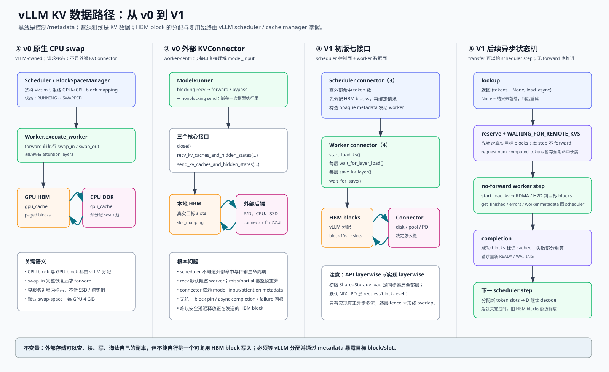
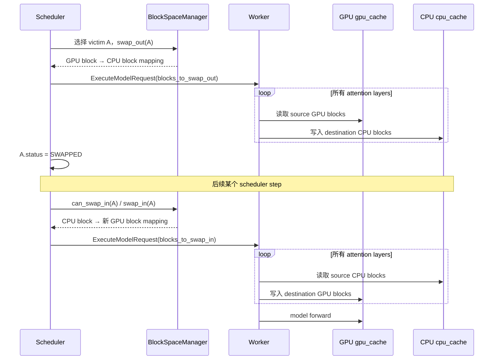
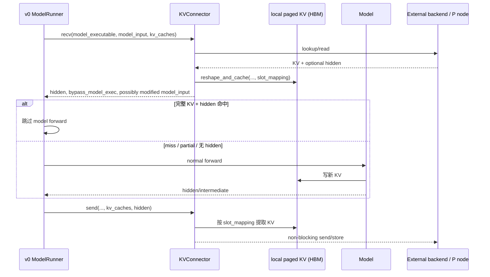
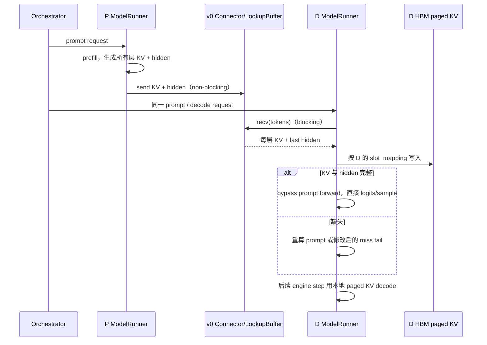
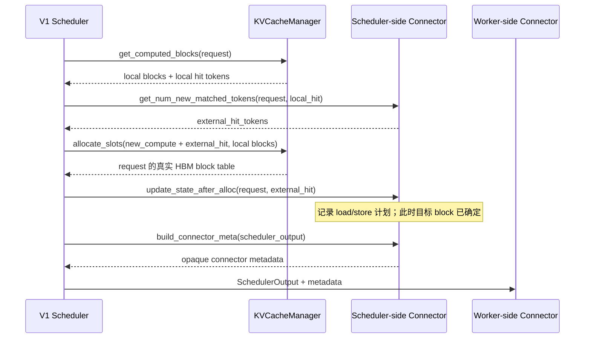
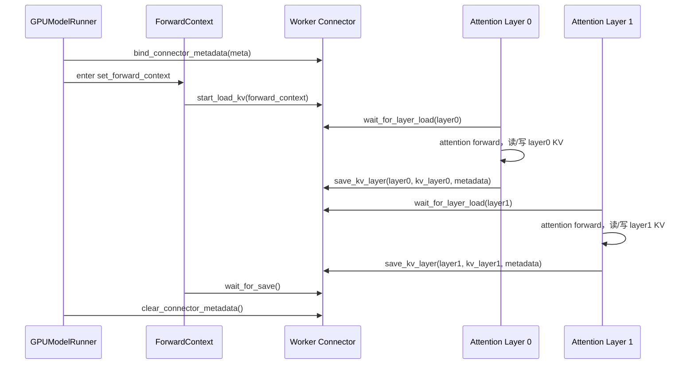
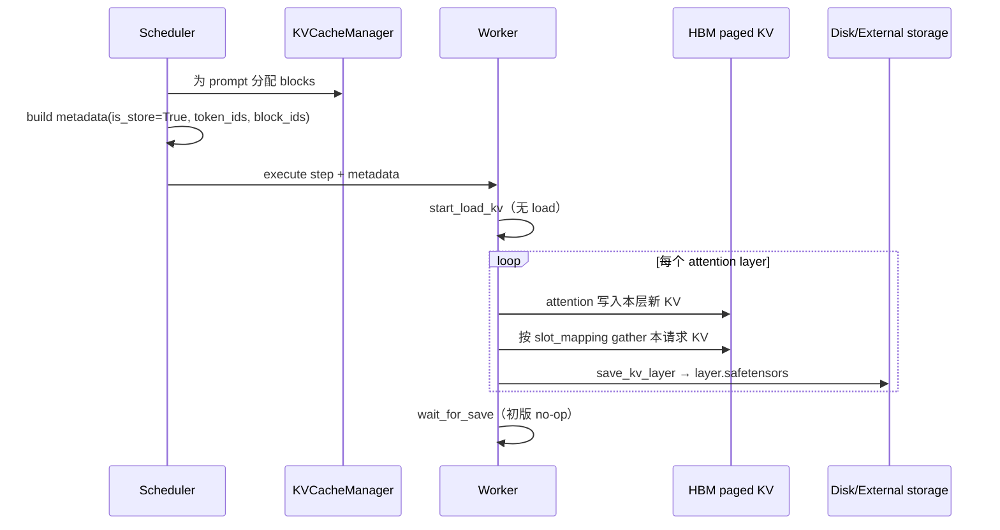
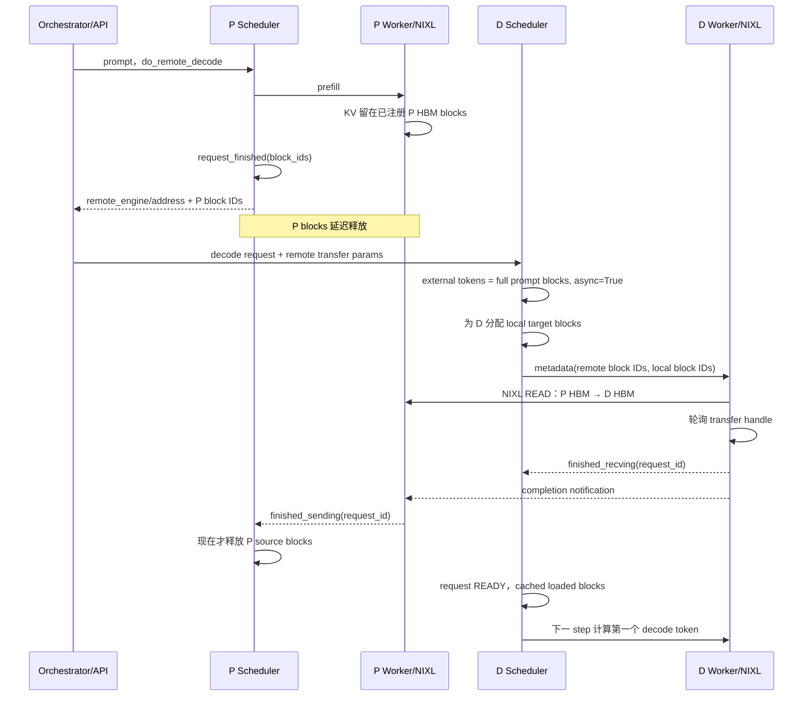
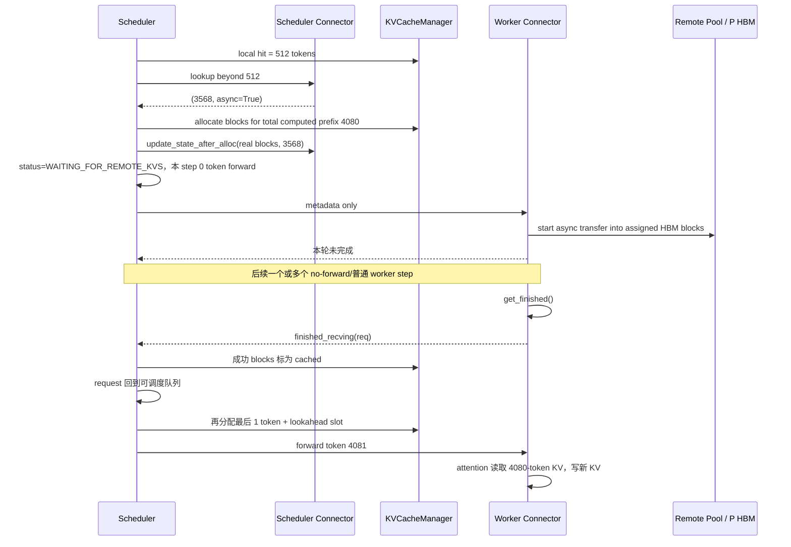

# vLLM KV 全链路：从 v0 worker-centric Connector 到 V1 跨调度步协议

> 分析日期：2026-09-24
>
> 源码基线：vLLM `v0.5.5`（原生 CPU swap）、`0590ec3f`（v0 KVConnector 初版）、`3408e471`（V1 初版七接口）、`d1911020`（首版 NIXL P/D），以及截至 2026-09 的关键演进提交。
>
> 证据标记：**Observed** = 源码直接可见；**Documented** = PR/RFC 明确描述；**Inferred** = 由调用顺序和所有权关系推导；**Version-dependent** = 具体 connector 版本不同会变化。

本文回答的不是“某个 connector 类怎么调用”，而是以下完整问题：

1. v0 原生 KV 管理、v0 外部 KVConnector 分别是什么；
2. 单机 DDR/SSD offload、KV pool、P/D 分离三种场景的数据到底怎么走；
3. 一个 prompt 的 KV 如何从计算、写入 HBM，到外部落盘；命中后又如何进入新的 HBM block；
4. V1 初版七个接口为什么这样切，scheduler/worker 的调用时序是什么；
5. V1 如何从“同一步 load/save”演进到“跨 scheduler step 的异步状态机”；
6. 每次大颗粒接口修改改变了哪一条流程，又解决了什么竞态。



## 0. 一页结论

### 0.1 最重要的四个结论

1. **v0 原生 CPU swap 和 v0 KVConnector 是两套完全不同的机制。**原生 swap 由 vLLM 的 block manager、scheduler 和 `CacheEngine` 共同拥有，用于请求抢占，数据只在预分配的 GPU/CPU KV block 池之间移动；外部 connector 则是 model runner 前后的 `recv/send` 钩子，用于 P/D 或外部缓存。
2. **V1 的核心变化不是“多了几个传输 API”，而是把 connector 变成 scheduler/worker 双侧协议。**scheduler 先问外部命中多少 token，再分配真实 HBM blocks，再把 `{request, token range, local block IDs, remote handle...}` 封成 metadata；worker 只按 metadata 搬数据。
3. **外部存储不能擅自把 KV 推进任意 HBM block。**它可以主动做查找、预取到自己的 CPU staging、复制副本、淘汰后端条目，但要写 vLLM HBM，必须先拿到本次请求当前被分配的目标 block/slot。否则可能覆盖别的请求、已释放重用的 block，或写入与当前 `slot_mapping` 不一致的位置。
4. **V1 出生时已经有 layerwise API，但不等于当时的 PD 实现是 layerwise。**初版 `SharedStorageConnector` 的 load 同步遍历全部层；首版默认 NIXL 是 request/block-level RDMA pull，`wait_for_layer_load`、`save_kv_layer` 是 no-op。layerwise API 是能力边界，是否真的多流 overlap 取决于具体 connector。

### 0.2 三类场景的本质差异

| 场景 | 外部对象 | 谁决定目标 HBM block | 数据面 | 典型完成条件 |
|---|---|---|---|---|
| v0 原生 CPU swap | 本进程预分配 `cpu_cache` | vLLM block manager | GPU↔CPU，逐层 swap | 所有层 swap 完，才 forward |
| 单机 offload / KV pool | CPU、SSD、远端 KV service | vLLM scheduler/cache manager | connector 的 D2H/H2D、文件或网络 I/O | sync load 完，或 async completion 回报 |
| P/D 分离 | P 实例 HBM/host buffer 与 D 实例 HBM | D scheduler 分配目标；P scheduler保护源 block | RDMA/NIXL/TCP/NCCL 等 | D 收完才续推；P 发完才释放源 block |

“KV pool”描述的是**共享、可复用的存储语义**；“PD connector”描述的是**P 实例与 D 实例之间的传输协议**。远端 KV pool 不一定走 PD connector，PD 也不一定经过持久化 pool。LMCache/Mooncake 一类后端可以同时提供两种能力，但这是实现组合，不是概念等价。

### 0.3 证据核验口径

本文对关键结论做了反向核验，不以类名、接口注释或 PR 标题代替实际调用链：

| 结论 | 证据等级 | 核验方式 |
|---|---|---|
| v0 原生 swap 是 vLLM-owned CPU/GPU block 池 | **Observed** | 固定 `v0.5.5`，交叉检查 scheduler mapping、worker 调用顺序、`CacheEngine` 逐层 copy |
| v0 connector 是 recv→forward/bypass→send | **Observed** | 固定 `0590ec3f`，检查 `model_runner.py` 的实际调用点及 blocking/non-blocking 注释 |
| V1 初版恰好七个抽象方法 | **Observed** | 固定 `3408e471`，逐个计数 `@abstractmethod`，不把 `bind/clear` 生命周期方法算进去 |
| V1 初版已有 layerwise API | **Observed** | 同时检查 base、`forward_context.py` 与 attention layer hook，而非只读设计文档 |
| 初版 SharedStorage 并未实现异步逐层 load | **Observed** | `start_load_kv` 同步遍历全部 layer；`wait_for_layer_load` 是 no-op |
| 首版 NIXL PD 不是 layerwise | **Observed** | 固定 `d1911020`，检查 `start_load_kv/_read_blocks` 与三个 layer/save no-op 方法 |
| NIXL 的设计动机、V1 控制面/数据面拆分 | **Documented + Observed** | PR #15960/#17751 的设计说明与对应 diff 相互印证 |
| async lookup、load failure、delayed free、post-forward submission | **Observed** | 分别对首次引入提交做 parent diff，确认接口、状态和调用位置确实在该提交出现 |
| 外部后端的后台线程、staging、压缩、淘汰策略 | **Version-dependent** | 只能由具体 LMCache/Mooncake/厂商 connector 版本证明，本文不把它当成 V1 base 的保证 |
| “外部存储不能自行写任意 HBM block” | **Inferred from enforced ownership** | 由 allocation→metadata→worker copy 顺序、block reuse 与 delayed-free 竞态共同推出；push 模式也必须先取得 D 侧已分配目标 |

时间线中的日期使用实际 merge commit 的 commit date；接口“首次出现”使用 `git diff <commit>^ <commit>` 核验，而不是使用当前主线中仍存在的方法倒推历史。

---

## 1. 先把对象和所有权讲清楚

### 1.1 vLLM 管什么，connector 管什么

在所有成熟实现里，职责边界应当是：

| 责任 | vLLM scheduler / KV manager | connector / 外部后端 |
|---|---:|---:|
| 哪个请求此刻可以运行 | ✓ | 只能提供命中/完成信息 |
| 为请求分配哪些 GPU block | ✓ | ✗ |
| block 何时可以复用 | ✓，但会接受 connector 的延迟释放请求 | 报告“传输仍在读/写” |
| token/hash 到外部条目的索引 | 提供 token/hash/请求元数据 | ✓ |
| CPU/SSD/网络/RDMA 具体搬运 | ✗ | ✓ |
| HBM 目标地址 | 分配 block 后暴露 | 使用，不拥有 allocator |
| 外部副本淘汰、压缩、复制 | ✗ | ✓ |

所谓“connector 必须知道真实目标 block”，不是要求 connector 参与 GPU 内存分配，而是：

```text
prompt token range
    ↓ scheduler 查询外部命中长度
vLLM 为这些 token reserve local block IDs
    ↓ block ID + KV tensor base/layout → slot/address
connector 把外部 KV 写入这些已分配的位置
```

同一段 token 在不同请求、不同时间、不同 TP rank 上对应的本地 block ID 都可能不同。外部 KV 的 key 可以稳定，HBM 目的地址却是短生命周期的运行时资源。

### 1.2 “请求结束延迟释放”到底延迟什么

这里的“另一个请求”确实是**下一个可能复用同一物理 block 的请求**，不只是同一请求的下一个 decode step。

例如：

```text
请求 A 最后一个 step 已算完
→ connector 正在从 A 的 HBM block 12 异步 RDMA READ / D2H save
→ scheduler 若立刻把 block 12 放回 free queue
→ 请求 B 很可能马上拿到 block 12
→ B 的 forward 写入 block 12
→ A 的异步发送读到 A/B 混合数据，外部副本损坏
```

因此，逻辑请求可以结束，但**物理 block 的复用必须等 connector 报告 send/save completion**。在 async scheduling 下还多一层风险：旧请求可能有已经下发、尚未完成的 GPU step；即使 connector 已准备接收新请求，旧 GPU write 仍可能污染同一个已重用 block。这正是后续 `#45357` 增加 step fence 和 deferred free queue 的背景。

### 1.3 “落盘”在本文中的严格含义

- v0 原生 `swap_out`：只写入预分配 CPU tensor，**不落 SSD**；
- 外部 connector 的 store：可能只写 CPU pool，也可能继续写 SSD、对象存储或远端 KV service；
- 初版 V1 `SharedStorageConnector`：确实按层写 `.safetensors` 文件；
- NIXL P/D：通常是 HBM↔HBM 或 host staging 的临时传输，**不等于持久化落盘**。

---

## 2. v0 之前/旁路：vLLM 原生 CPU swap

### 2.1 代码对象与接口

以 `v0.5.5` 为例：

- `CacheEngine` 同时预分配 `gpu_cache` 和 `cpu_cache`，每个 attention layer 一块 tensor 列表；
- `swap_in(src_to_dst)` 对所有 attention layers 执行 CPU→GPU block copy；
- `swap_out(src_to_dst)` 对所有 attention layers 执行 GPU→CPU block copy；
- scheduler 的 `BlockSpaceManager` 生成 `(src_block, dst_block)` mapping；
- worker 在 model forward 之前消费 `blocks_to_swap_in/out/copy`。

源码证据：

- [`CacheEngine` 分配与逐层 swap](https://github.com/vllm-project/vllm/blob/v0.5.5/vllm/worker/cache_engine.py#L65-L99)
- [scheduler output 中的 swap mapping](https://github.com/vllm-project/vllm/blob/v0.5.5/vllm/core/scheduler.py#L113-L138)
- [scheduler 的 `_swap_in/_swap_out`](https://github.com/vllm-project/vllm/blob/v0.5.5/vllm/core/scheduler.py#L1270-L1301)
- [worker 在 forward 前执行 cache operation](https://github.com/vllm-project/vllm/blob/v0.5.5/vllm/worker/worker.py#L324-L338)
- [`WorkerBase` 先 `execute_worker`，再调用 `model_runner.execute_model`](https://github.com/vllm-project/vllm/blob/v0.5.5/vllm/worker/worker_base.py#L290-L329)

### 2.2 完整时序



这条路径不是 layerwise overlap：`execute_worker()` 先完成 cache ops，`worker_base.execute_model()` 才进入 model runner。

### 2.3 CPU cache 开多大

`num_cpu_blocks = floor(swap_space_bytes / cache_block_size)`；命令行 `--swap-space` 在 `v0.5.5` 默认是**每 GPU 4 GiB**：

- [默认值 4 GiB](https://github.com/vllm-project/vllm/blob/v0.5.5/vllm/engine/arg_utils.py#L82-L87)
- [按 block bytes 计算 CPU block 数](https://github.com/vllm-project/vllm/blob/v0.5.5/vllm/worker/worker.py#L237-L249)
- [单 logical block 字节数公式](https://github.com/vllm-project/vllm/blob/v0.5.5/vllm/worker/cache_engine.py#L104-L123)

非 MLA 的近似公式：

```text
bytes_per_block
= 2(K+V) × num_layers_per_PP_rank × block_size(tokens)
  × num_kv_heads_per_TP_rank × head_size × dtype_bytes
```

例：Llama-3 8B，32 层、8 KV heads、head size 128、block size 16、FP16，在 TP=1/PP=1 下：

```text
2 × 32 × 16 × 8 × 128 × 2 bytes = 2 MiB / block
4 GiB / 2 MiB = 2048 blocks = 32768 token slots
```

注意 `--cpu-offload-gb` 在该版本描述的是把**模型权重**按需从 CPU 搬到 GPU，不是上述 KV swap pool。

---

## 3. v0 KVConnector：三个核心接口和 worker 内时序

### 3.1 首版提交与接口

首版在 commit [`0590ec3f`](https://github.com/vllm-project/vllm/commit/0590ec3fd9857063c43c80df281e24c16c51b2ec)、PR [#10502](https://github.com/vllm-project/vllm/pull/10502) 合入，作者为 Kuntai Du，目标是轻量实现 disaggregated prefill。

抽象基类实际有三个业务方法：

| 接口 | 调用位置 | 用途 | 初版同步语义 |
|---|---|---|---|
| `close()` | 生命周期结束 | 关闭 pipe/buffer/连接 | 同步清理 |
| `recv_kv_caches_and_hidden_states(model_executable, model_input, kv_caches)` | model forward 前 | 按输入 token 查找 KV/hidden，写入本地 paged KV；可修改 model input；可返回 `bypass_model_exec` | 注释明确 blocking |
| `send_kv_caches_and_hidden_states(model_executable, model_input, kv_caches, hidden)` | model forward 后 | 从本地 paged KV 提取新 KV，连同 hidden/intermediate state 发往 D 或外部缓存 | 注释明确 non-blocking |

源码：

- [v0 base 三个接口](https://github.com/vllm-project/vllm/blob/0590ec3fd9857063c43c80df281e24c16c51b2ec/vllm/distributed/kv_transfer/kv_connector/base.py#L21-L122)
- [model runner 的 recv→forward/bypass→send](https://github.com/vllm-project/vllm/blob/0590ec3fd9857063c43c80df281e24c16c51b2ec/vllm/worker/model_runner.py#L1669-L1726)

v0 connector 直接拿到：

```text
model_executable
model_input
kv_caches
hidden_or_intermediate_states
```

所以它必须理解 vLLM 的 `seq_lens`、`slot_mapping`、prefill metadata、pipeline layer range 和 hidden state 形态。它不是“不需要理解 vLLM”；相反，它与 model runner 的内部表示耦合得很深。

### 3.2 worker 内固定时序



`SimpleConnector` 的初版实现从 `model_input.attn_metadata.slot_mapping` 中取位置，遍历本 PP rank 的所有层提取 K/V；接收侧再用 `reshape_and_cache_flash` 写进 D 的本地 paged KV。见 [send 路径](https://github.com/vllm-project/vllm/blob/0590ec3fd9857063c43c80df281e24c16c51b2ec/vllm/distributed/kv_transfer/kv_connector/simple_connector.py#L106-L152) 与 [recv 路径](https://github.com/vllm-project/vllm/blob/0590ec3fd9857063c43c80df281e24c16c51b2ec/vllm/distributed/kv_transfer/kv_connector/simple_connector.py#L154-L255)。

### 3.3 v0：一个 prompt 计算后写入外部存储

这里分成两种实现。

#### A. v0 SimpleConnector 的 P/D 发送

```text
1. P scheduler 给请求分配 P 本地 HBM blocks。
2. P model forward 对 prompt 做 prefill；attention kernel 写入 P paged KV。
3. forward 返回 hidden/intermediate state。
4. ModelRunner 调 send_kv_caches_and_hidden_states。
5. connector 用 seq_lens + slot_mapping 从每层 paged KV gather 出连续 K/V。
6. connector 把 token、K/V、hidden 插入 producer buffer / pipe。
7. send 返回；真正网络发送可继续异步进行。
```

#### B. v0 LMCache/外部 KV pool 的落盘

PR [#12953](https://github.com/vllm-project/vllm/pull/12953) 用 v0 `recv/send` wrapper 接入 LMCache。总体路径是：

```text
prefill 写 HBM paged KV
→ v0 send hook 根据 token/slot 提取新增 KV
→ HBM→CPU staging（若后端需要）
→ LMCache local CPU / local disk / remote storage
→ 后端按 token chunk/hash 建索引
```

**Version-dependent：**实际是否同步 D2H、是否有 pinned memory、何时刷 SSD、是否跨进程，由 LMCache 版本与 storage backend 决定；v0 base interface 本身没有规定 completion、pin 或失败回报。

### 3.4 v0：KV 命中恢复

```text
1. 新请求进入 worker；v0 scheduler 本身通常不知道外部命中细节。
2. forward 前调用 recv。
3. connector 用 prompt token 查询外部索引。
4. 命中 KV 被搬到 worker 当前请求的 slot_mapping 对应位置。
5. 若 KV 与 hidden 都完整：返回 bypass_model_exec=True。
6. 若 miss/partial：初版 SimpleConnector 默认回退整段 forward。
7. connector 理论上可以改写 model_input 只算 miss tail，但这会强依赖内部 input/attention metadata。
```

“先查、后分配、再绑定”并不是 v0 初版 SimpleConnector 的完整协议；它是 V1 把外部命中纳入 scheduler 后形成的明确三阶段。v0 多数时候已经由正常调度分配了本地 blocks，connector 到 worker 才查并写入。

### 3.5 v0：P→D 传输与 D 继续推理



初版 lookup buffer 用 token 做选择，因此 P、D 请求到达顺序可以不同；但 scheduler 不掌握明确的远端传输状态，D 的 `recv` 是 worker 热路径上的阻塞点。

### 3.6 v0 机制的问题

1. **scheduler 看不见外部命中。**它不能在 admission/allocation 时区分 local hit、external hit 和待传输 token。
2. **外部 lookup 与 HBM allocation 没有显式协议。**目标 slots 只能从复杂的 `model_input` 中反推。
3. **recv 在 forward 热路径阻塞。**慢 SSD、远端 pool 或 RDMA handshake 会直接增加 TTFT。
4. **缺乏跨 step 状态。**没有 `WAITING_FOR_REMOTE_KVS`，也没有“本 step 只推进传输、不 forward”。
5. **缺乏 block 生命周期交接。**base API 没有 completion、延迟释放、失败 block、abort/preemption 回调。
6. **connector 侵入 model input。**做 partial hit 往往要重写输入、slot mapping 或 attention metadata，vLLM 内部结构一改就容易失效。
7. **数据面与调度策略粘在一起。**每增加一种“外部后端”——例如本地 CPU/SSD cache、远端 KV database、P2P/RDMA transport、共享文件系统——都可能需要在 model runner 或 connector 分支中重新解释执行语义。

这里“每增加一种后端都要修改”中的“后端”，指的是**KV 数据的存储/传输实现及其语义组合**，不是 attention backend：CPU cache、SSD、对象存储、LMCache、Mooncake、NIXL P2P、共享文件系统、厂商 RDMA transport 都属于此处的后端。

---

## 4. V1 初版：七个抽象接口

### 4.1 首版提交和设计目标

V1 connector 在 commit [`3408e471`](https://github.com/vllm-project/vllm/commit/3408e471597e7a36ca79fab5fc849f4fb5576df8)、PR [#15960](https://github.com/vllm-project/vllm/pull/15960) 合入。

PR 明确提出：

- scheduler 计算哪些 token 需要 store/load；
- worker 执行真实 store/load；
- 提供 layer-wise async API；
- prefetch 和 P/D orchestrator 尽量放在 vLLM 外部，减少 core 侵入；
- scheduler process 有 scheduler-side connector，每个 worker process 有 worker-side connector；
- `SharedStorageConnector` 只是最小可用、便于说明接口的 debug 实现。

### 4.2 七个抽象接口逐个解释

初版**恰好七个 abstract methods**。`bind_connector_metadata()`、`clear_connector_metadata()` 是已实现的生命周期辅助方法，不计入“七接口”。

| 侧 | 接口 | 作用 | 为什么必须在这一侧 |
|---|---|---|---|
| Scheduler | `get_num_new_matched_tokens(request, num_computed_tokens) -> int` | 查询 local prefix hit 之外，还有多少连续 prompt token 可从外部恢复 | 只有 scheduler 能把命中长度纳入 token budget、prefix 语义和 allocation |
| Scheduler | `update_state_after_alloc(request, num_external_tokens)` | HBM block 分配后，把“这个请求需要 load”记录进 connector 状态 | 先有真实目标 blocks，worker 才能安全写入 |
| Scheduler | `build_connector_meta(scheduler_output)` | 将本 step 的 load/store 计划封成 opaque metadata，并清空 step-local 状态 | scheduler→worker 的唯一稳定协议载体 |
| Worker | `start_load_kv(forward_context)` | forward 前发起所有 load，可同步也可异步 | worker 才持有实际 KV tensor、device stream 和 transport handle |
| Worker | `wait_for_layer_load(layer_name)` | 某层 attention 使用 KV 前做 fence | 支持真正的 layer-by-layer pipeline |
| Worker | `save_kv_layer(layer_name, kv_layer, attn_metadata)` | 某层 attention 完成后发起该层 save | 可让 D2H/network 与后续层计算重叠 |
| Worker | `wait_for_save()` | forward context 退出前等待必要 save 完成 | 防止 worker 复用/覆盖仍在读取的 buffer |

固定源码：[`KVConnectorBase_V1` 初版](https://github.com/vllm-project/vllm/blob/3408e471597e7a36ca79fab5fc849f4fb5576df8/vllm/distributed/kv_transfer/kv_connector/v1/base.py#L55-L209)。

### 4.3 初版 scheduler 调用时序：“先查、后分配、再绑定”

这句话的精确含义是：



“绑定”不是把外部存储永久绑定给 HBM，而是把：

```text
request/token range/external object
                ↕
本 scheduler step 为它分配的 local block IDs / slots
```

绑定成一份本 step 可执行的传输计划。

初版源码顺序：

- [local hit 后查询 external hit](https://github.com/vllm-project/vllm/blob/3408e471597e7a36ca79fab5fc849f4fb5576df8/vllm/v1/core/sched/scheduler.py#L315-L327)
- [allocate 后 `update_state_after_alloc`](https://github.com/vllm-project/vllm/blob/3408e471597e7a36ca79fab5fc849f4fb5576df8/vllm/v1/core/sched/scheduler.py#L353-L367)
- [最后构造 connector metadata](https://github.com/vllm-project/vllm/blob/3408e471597e7a36ca79fab5fc849f4fb5576df8/vllm/v1/core/sched/scheduler.py#L477-L483)

### 4.4 初版 worker/attention 调用时序



固定源码：

- [forward context 入口调用 `start_load_kv`、退出调用 `wait_for_save`](https://github.com/vllm-project/vllm/blob/3408e471597e7a36ca79fab5fc849f4fb5576df8/vllm/forward_context.py#L106-L157)
- [attention 前 `wait_for_layer_load`、后 `save_kv_layer`](https://github.com/vllm-project/vllm/blob/3408e471597e7a36ca79fab5fc849f4fb5576df8/vllm/attention/layer.py#L336-L381)

因此“layer 0 计算时传 layer 1”只是一种**可实现的 load pipeline**：connector 可在 `start_load_kv` 发起多层异步 copy，layer 0 只等自己的事件，此时 layer 1 仍在另一个 stream 传输。它既可用于本地 CPU/SSD load，也可用于 PD；但默认 NIXL PD 长期不是这样实现的。

### 4.5 初版 `SharedStorageConnector` 的真实行为

初版实例很重要，因为它展示了“接口能力”和“实现能力”的差别：

- `start_load_kv`：对每个 load request，同步遍历所有 layer，`load_file(...).cuda()` 后注入 paged KV；
- `wait_for_layer_load`：no-op；
- `save_kv_layer`：每层 attention 后 gather 对应 slots，`.cpu()` 并同步写该层 `.safetensors`；
- `wait_for_save`：no-op；
- 目录 key：对对齐后的 prompt token bytes 求 MD5，每层一个文件。

源码：[`SharedStorageConnector` 初版](https://github.com/vllm-project/vllm/blob/3408e471597e7a36ca79fab5fc849f4fb5576df8/vllm/distributed/kv_transfer/kv_connector/v1/shared_storage_connector.py#L70-L222)。

所以它“接口上 layerwise、实现上同步”。

---

## 5. V1 初版的四条端到端流程

### 5.1 单机：prompt → HBM → CPU/SSD 落盘

以初版 shared-storage 语义为例：



真实高性能 offload connector 通常把 `save_kv_layer` 变成：

```text
record compute event
→ transfer stream 等 event
→ HBM→pinned CPU
→ background writer / network sender
→ completion 后才能解除 block pin
```

这里的 `backup/write-back thread` 就是把 CPU staging 中已完成 D2H 的 KV，继续异步写 SSD/远端 pool 的后台线程。它不参与模型计算；它的价值是让 model runner 不必等待慢速持久化 I/O。但必须有队列上限、失败回报和 block/buffer 生命周期管理。

### 5.2 单机：外部 KV 命中 → HBM → 继续算 miss tail

```text
1. scheduler 先得到 local prefix hit。
2. scheduler connector 查询外部完整 block 前缀。
3. external_hit = min(外部连续命中, 尚未本地命中的 prompt 部分)。
4. KVCacheManager 为 external_hit + 本 step 新计算 token 分配 blocks。
5. metadata 带 token range、block IDs/slot mapping 到 worker。
6. worker 在 forward 前把外部 KV 写入这些目标 slots。
7. attention 只为 prompt 的 miss tail / 新 token 计算。
```

初版接口已把“查命中”和“实际 load”分开，但初版 scheduler 仍把 load 与 forward 放在同一 scheduler step，慢 load 仍可能阻塞该 step。

### 5.3 初版协议下的 P→D

PR #15960 的 shared-storage 只是示例；真正高性能 P2P 被列为后续工作。若 connector 实现 P/D，初版七接口可以表达：

```text
P scheduler build store metadata
→ P worker 每层 save/send
→ D scheduler get_num_new_matched_tokens
→ D 分配目标 blocks
→ D worker start_load_kv
→ D attention 等待所需层
→ D forward / decode
```

但初版还没有统一表达：

- P 发送尚未完成，源 blocks 是否延迟释放；
- D 的异步 receive 是否可以跨 scheduler step；
- worker 如何把 send/recv completion 回给 scheduler；
- RDMA memory registration 和握手何时做；
- transfer 失败后哪些 block 无效。

### 5.4 D 接着推理

D 侧并不是“收到一个独立 KV tensor 后直接 attention”。正确过程是：

```text
D scheduler 为 prompt prefix 分配 D 本地 block table
→ connector 将 P/外部 KV 写入 D block table 对应的 HBM slots
→ scheduler 将这些 token 视为 computed
→ 为第一个需要实际计算的 token 分配新 slot
→ attention 读取已恢复 prefix KV，并写新 token KV
→ sample
→ 后续 decode step 只用 D 本地 paged KV
```

因此 P 的 block ID 与 D 的 block ID 通常不同；传输 metadata 必须同时知道 remote source blocks 和 local destination blocks。

---

## 6. V1 初版解决了 v0 什么，又留下什么问题

### 6.1 已解决

| v0 问题 | V1 初版的解法 |
|---|---|
| 外部命中到 worker 才知道 | scheduler-side `get_num_new_matched_tokens` |
| connector 从 model input 猜目标位置 | allocation 后生成 metadata，显式携带 block/slot 信息 |
| store/load 计划散在 model runner | `build_connector_meta` 成为 step 级计划边界 |
| 无逐层 hook | attention 前 wait、后 save |
| 每种后端侵入 scheduler/worker | core 只调用稳定协议，后端实现数据面 |
| orchestrator 逻辑容易塞进 core | 路由/prefetch 留在外部，request params/metadata 传入 |

### 6.2 仍未解决

1. 初版返回值只有命中 token 数，不能表示 lookup 还没完成；
2. load 默认属于当前 forward step，不能把请求停在“远端 KV 正在来”的状态；
3. 没有 worker→scheduler completion channel；
4. 没有 request finish 时的 block ownership handoff；
5. 没有稳定 KV arena 注册接口，RDMA 后端可能在热路径做昂贵注册/描述符构造；
6. 没有 load failure、abort、preemption、partial-tail、HMA 多 cache group 语义；
7. layerwise Python hook 与 full CUDA graph replay 不安全；
8. `start_load_kv` 的 host 提交成本仍可能挡在当前 forward 前。

---

## 7. NIXL 把 V1 变成真正的跨 step P/D 协议

### 7.1 关键新增接口

commit [`d1911020`](https://github.com/vllm-project/vllm/commit/d19110204c03e9b77ed957fc70c1262ff370f5e2)、PR [#17751](https://github.com/vllm-project/vllm/pull/17751) 增加/扩展了几类关键语义：

| 接口/返回值 | 侧 | 作用 |
|---|---|---|
| `register_kv_caches(kv_caches)` | worker | engine 初始化后一次性注册稳定 KV arena、基地址、region/descriptor |
| `get_finished(finished_req_ids)` | worker | 轮询异步 send/save 与 recv/load completion，回传 request IDs |
| `request_finished(request, block_ids)` | scheduler | 请求逻辑结束时决定是否由 connector 暂时接管 blocks，延迟释放；可产生给对端的 transfer params |
| `get_num_new_matched_tokens() -> (tokens, load_async)` | scheduler | 除命中长度外，声明 load 是否跨 scheduler step |
| `update_state_after_alloc(..., blocks, ...)` | scheduler | 直接获得已分配 `KVCacheBlocks`，不再只靠 request 侧面查表 |

### 7.2 为什么有 `start_load_kv` 还要 `register_kv_caches`

`start_load_kv` 是**per-step/per-request 操作**；memory registration 是**engine lifetime 操作**。两者不能混在一起，原因包括：

1. RDMA/NIXL 要把稳定的 local KV tensor 地址注册成 memory region，并生成 descriptor；
2. 对端握手需要基地址、region 数、block stride、device/rank 等长期信息；
3. registration 可能很贵，不能每个请求重复；
4. `start_load_kv` 应只选择本次 source/destination block descriptor 并提交 transfer。

首版 NIXL 的 worker 从每层 KV tensor 取 `data_ptr()`，注册 VRAM region，再启动 handshake listener。见 [`register_memory` 路径](https://github.com/vllm-project/vllm/blob/d19110204c03e9b77ed957fc70c1262ff370f5e2/vllm/distributed/kv_transfer/kv_connector/v1/nixl_connector.py#L500-L535)。

这确实**为 GPUDirect/零额外 bounce copy 创造条件**，但接口本身不保证零拷贝：connector 仍可选择 host staging、重排、压缩或异构 TP 转换。

### 7.3 首版 NIXL P→D 的完整协议

首版 NIXL 是 D 侧 READ/pull，不是 layerwise push：



NIXL 初版 scheduler 返回 `(count, count > 0)`，分配后记录 D local unhashed blocks；worker `start_load_kv` 触发 non-blocking `_read_blocks`；`get_finished` 跨 TP rank 聚合完成。源码：

- [scheduler 命中、allocation bind、request finish](https://github.com/vllm-project/vllm/blob/d19110204c03e9b77ed957fc70c1262ff370f5e2/vllm/distributed/kv_transfer/kv_connector/v1/nixl_connector.py#L238-L344)
- [worker READ 与完成轮询](https://github.com/vllm-project/vllm/blob/d19110204c03e9b77ed957fc70c1262ff370f5e2/vllm/distributed/kv_transfer/kv_connector/v1/nixl_connector.py#L581-L703)
- [NIXL layer hooks 明确是 no-op](https://github.com/vllm-project/vllm/blob/d19110204c03e9b77ed957fc70c1262ff370f5e2/vllm/distributed/kv_transfer/kv_connector/v1/nixl_connector.py#L204-L221)

### 7.4 为什么 worker 即使没有 forward 也要推进 connector

异步 D load 的第一个 scheduler step只做：

```text
分配 D target blocks
→ request = WAITING_FOR_REMOTE_KVS
→ num_scheduled_tokens = 0
```

如果 worker 因为“没有 model token”直接返回，`start_load_kv()` 永远不会被调用，`get_finished()` 也永远不轮询，请求会永久卡住。因此 NIXL integration 在引入跨 step async load 的同时加入 `kv_connector_no_forward`：即使没有 attention forward，也要 bind metadata、启动/推进 transfer并收集 completion。初版七接口 commit 仍在 `total_num_scheduled_tokens == 0` 时直接返回；这一行为差异可分别见 [`3408e471` 初版](https://github.com/vllm-project/vllm/blob/3408e471597e7a36ca79fab5fc849f4fb5576df8/vllm/v1/worker/gpu_model_runner.py#L986-L1000) 与 [`d1911020` no-forward 路径](https://github.com/vllm-project/vllm/blob/d19110204c03e9b77ed957fc70c1262ff370f5e2/vllm/v1/worker/gpu_model_runner.py#L1064-L1077)。

这不是“空转做模型计算”，而是把 worker 当成 device/transport progress engine。

---

## 8. 后续异步 loading：从布尔值到完整状态机

### 8.1 lookup 也可能异步

commit [`b4a01aaf`](https://github.com/vllm-project/vllm/commit/b4a01aaf95f54bba90cb0b072e9254ddb998af8f)、PR [#23620](https://github.com/vllm-project/vllm/pull/23620) 把接口改为：

```python
get_num_new_matched_tokens(...) -> tuple[int | None, bool]
```

- `tokens is None`：后端还不能确定命中长度，例如远端 index lookup 尚未返回；scheduler 本 step 跳过该请求，稍后再问；
- `load_async is False`：KV 会在本次 forward 使用，必须在 forward/对应 layer 前完成；
- `load_async is True`：先分配目标 blocks，但本 step 不 forward，请求进入 `WAITING_FOR_REMOTE_KVS`。

同时 `update_state_after_alloc` 可能对同一请求调用两次：

1. 第一次只为 external tokens 分配目标 blocks并启动异步 load；
2. load completion 后，第二次为真正要计算的新 token/lookahead 分配额外 blocks。

### 8.2 一个异步 KV 命中的完整案例

假设 prompt 4097 tokens，block size 16：本地命中 512，远端 pool 命中到 4080，最后一个 token 需要计算。



注意 `request.num_computed_tokens=4080` 可以在 transfer 未完成时暂存，但请求处于 blocked state，不允许拿这个值继续 forward；completion 后才成为可消费事实。

### 8.3 load 失败如何恢复

commit [`9a9f48df`](https://github.com/vllm-project/vllm/commit/9a9f48dff7)、PR [#19330](https://github.com/vllm-project/vllm/pull/19330) 一类改动引入 load error recovery：worker 回报 invalid block IDs，scheduler 找出受影响请求，按策略：

- `recompute`：缩短 computed prefix，重新计算失败区间；
- `fail`：终止请求；
- 同步命中且已被本地 cache 记录时，还要驱逐错误 block 与依赖后缀。

这解决了“外部 lookup 当时说命中，但传输期间条目被淘汰/网络失败”的 TOCTOU 问题。

### 8.4 “异步”不等于所有操作都越晚越好

2026-08 的 commit [`2aac565c`](https://github.com/vllm-project/vllm/commit/2aac565cae880087d752e90f1a08dcd9b369f9a0)、PR [#53333](https://github.com/vllm-project/vllm/pull/53333) 进一步区分：

- 本 step forward 要消费的 sync load：`start_load_kv` 必须在 forward 前；
- 与当前 running batch 无关的 async load：可在当前 forward 已提交 GPU 后再调用 `start_load_kv`，让 host 侧 NIXL descriptor 构造/提交与 GPU compute 重叠；
- 混合 step 保守按 sync load 处理。

这次修改不改变目标 block、completion 或 scheduler state，只改变**host submission 相对当前 forward 的时间位置**。

---

## 9. layerwise 的准确边界

### 9.1 初版就有，但首个实现没有 overlap

V1 初版已经存在：

```text
start_load_kv
wait_for_layer_load(layer)
save_kv_layer(layer)
wait_for_save
```

它允许以下实现：

```text
transfer stream: load L0 ─ load L1 ─ load L2 ─ ...
compute stream :      wait0/compute0 ─ wait1/compute1 ─ wait2/compute2
save stream    :                    save0 ───────────── save1 ──────
```

但初版 SharedStorage 的 `start_load_kv` 一次性同步 load 所有层，首版 NIXL 的 per-layer 方法是 no-op。因此不能把 API 注释直接当成“PD 已经 layerwise 多流”的实现事实。

### 9.2 connector 现在是否还要理解 vLLM 内部结构

仍然要，但耦合层次改变了：

| v0 | V1 |
|---|---|
| connector 直接拿完整 `model_input`，可能改写它 | scheduler connector 拿 `Request`/`SchedulerOutput`，worker connector拿稳定 metadata、KV tensors、attention metadata |
| 自己解释 prefill/decode 与 bypass | scheduler 统一决定 computed tokens、allocation 和 blocked state |
| 自己从 model input 推导 slots | scheduler allocation 后明确传 block IDs；worker 仍需 layout/slot mapping 执行 copy |
| partial hit 容易侵入 model execution | partial hit 主要通过 token count + KV manager allocation 表达 |

所以差别不是“V1 connector 完全不理解 vLLM”，而是它不再需要**接管/改写整个模型执行流**；依赖被限制在 Request contract、metadata contract、KV layout 与 attention hook。

### 9.3 CUDA graph 为什么又促成一个接口

full CUDA graph replay 只重放捕获的 GPU ops，不会重新执行 attention decorator 内的 Python：如果 connector 依赖每层 `wait_for_layer_load`/`save_kv_layer`，replay 时这些 fence 可能被跳过，导致 data race。

commit [`a13d8c03`](https://github.com/vllm-project/vllm/commit/a13d8c03c996824811829d9f1cfff5d6df168271)、PR [#31057](https://github.com/vllm-project/vllm/pull/31057) 增加：

```python
requires_piecewise_for_cudagraph(extra_config) -> bool
```

真正使用 layerwise async hook 的 connector 应返回 `True`，让配置自动降到 PIECEWISE graph，保证 graph piece 之间仍执行 Python fence。

---

## 10. 每次 V1 大颗粒修改对流程的影响

下表只列改变协议语义或端到端时序的节点，不罗列纯重构和小 bugfix。

| 时间 / 提交 | 大颗粒变化 | 新增/改变的接口或状态 | 对 store/hit/PD 流程的影响 |
|---|---|---|---|
| 2025-04 [`3408e471`](https://github.com/vllm-project/vllm/commit/3408e471597e7a36ca79fab5fc849f4fb5576df8) #15960 | V1 初版 | 七个抽象接口；scheduler/worker connector；opaque metadata | 外部命中第一次进入 scheduler allocation；attention 有 layer hooks |
| 2025-05 [`d1911020`](https://github.com/vllm-project/vllm/commit/d19110204c03e9b77ed957fc70c1262ff370f5e2) #17751 | NIXL P/D | `register_kv_caches`、`get_finished`、`request_finished`、`(tokens, async)`、block 参数 | RDMA arena 预注册；D 可跨 step pull；P blocks 发送完成后再释放 |
| 2025-05 [`2142035b`](https://github.com/vllm-project/vllm/commit/2142035b51) #17564 | MultiConnector | 一个协议组合多个 connector | 可把 PD + offload/pool 组合，但要处理命中决策与 block metadata 一致性 |
| 2025-07 [`cc876d0f`](https://github.com/vllm-project/vllm/commit/cc876d0f29) #19555 | finished 聚合 | 多 worker/rank completion 聚合 | scheduler 只有在所需 ranks 都完成后才改变请求/释放状态 |
| 2025-08 [`7ad7adb6`](https://github.com/vllm-project/vllm/commit/7ad7adb67f) #22157 | 统一 `KVConnectorOutput` | finished/error/stats 从 worker 回 scheduler | completion 不再是 connector 私有旁路，成为 engine output 的一部分 |
| 2025-09 [`b4a01aaf`](https://github.com/vllm-project/vllm/commit/b4a01aaf95f54bba90cb0b072e9254ddb998af8f) #23620 | async lookup | `tokens` 可为 `None`；allocation/update 可两阶段 | 远端 index 查询未完成时 scheduler 可跳过并重试，不必阻塞 |
| 2025-10 [`9a9f48df`](https://github.com/vllm-project/vllm/commit/9a9f48dff7) #19330 | load failure recovery | invalid block IDs / recompute policy | 外部命中失效不再静默消费坏 KV，可回退重算 |
| 2025-11 [`cc079763`](https://github.com/vllm-project/vllm/commit/cc079763c5) #28253 | metadata 生命周期收紧 | metadata 未 bind 时不调 layer API | 避免无本 step 计划时误触发 connector state |
| 2025-11 [`64746471`](https://github.com/vllm-project/vllm/commit/647464719b) #27743 | cross-layer blocks | connector 可偏好 all-layers contiguous layout | request/block-level RDMA 可减少 descriptor 与小传输数；改变注册/layout，不改变 scheduler 所有权 |
| 2025-12 [`f4417f84`](https://github.com/vllm-project/vllm/commit/f4417f8449) #28309 | KV events | connector event channel | KV pool 可向路由/可观测系统报告 store/load/evict 事件 |
| 2025-12 [`52bf0665`](https://github.com/vllm-project/vllm/commit/52bf0665) #30166 | HMA + connector | 多 cache group blocks；`SupportsHMA` | Full Attention、SWA、Mamba state 必须一致命中/保存，不能只传一组 block |
| 2026-03 [`a13d8c03`](https://github.com/vllm-project/vllm/commit/a13d8c03c996824811829d9f1cfff5d6df168271) #31057 | layerwise + cudagraph 安全 | `requires_piecewise_for_cudagraph` | 真 layerwise connector 不再在 full graph replay 中丢失 fence |
| 2026-03 [`a1a3523a`](https://github.com/vllm-project/vllm/commit/a1a3523a5647a58e00096ca7430e9f1ad4a50a97) #31964 | worker→scheduler 自定义 metadata | `build_connector_worker_meta` + aggregate | 后端可回传动态队列、placement、flow control 信息，不局限 finished set |
| 2026-03 [`fcf0687b`](https://github.com/vllm-project/vllm/commit/fcf0687b27) #34805 | async save 遇到 preemption | `handle_preemptions` 等 block-level 处理 | 被抢占/淘汰 block 覆盖前先让 offload connector 保存或取消 |
| 2026-05 [`13bf2421`](https://github.com/vllm-project/vllm/commit/13bf2421009a001b79751666695623ad8b9f29b2) #39654 | scheduler block pool 显式绑定 | `bind_gpu_block_pool` | offload/pool connector 可 pin/refcount/遍历 prefix blocks，但 allocator 仍由 vLLM 拥有 |
| 2026-06 [`88ed6362`](https://github.com/vllm-project/vllm/commit/88ed636218) #35264 | NIXL push | push-mode pending work / handshake 演进 | P 可 WRITE 到 D 已公布目标，不必总由 D READ；仍需 D 先 reserve target |
| 2026-06 [`d467a2a7`](https://github.com/vllm-project/vllm/commit/d467a2a7f2f088dd360c7bef2f3cf5c59a1ffde8) #45357 | async scheduler + PD consumer 安全 | scheduler step fence、deferred free queue | 旧 in-flight GPU write 完成前，block 不回 free pool，避免污染新 RDMA receive |
| 2026-07 [`2285cfca`](https://github.com/vllm-project/vllm/commit/2285cfca46) #46865 | MultiConnector 获得真实 blocks | `update_state_after_alloc` 语义收紧 | 子 connector 即使未被选中也能看到一致的真实 block table；靠 external token 数决定是否 load |
| 2026-07 [`d7428566`](https://github.com/vllm-project/vllm/commit/d7428566) #49502 | partial-tail offload | 非完整 block 的可靠保存/恢复 | 不再只能 offload full blocks；需额外处理有效 token 长度和覆盖竞态 |
| 2026-08 [`2aac565c`](https://github.com/vllm-project/vllm/commit/2aac565cae880087d752e90f1a08dcd9b369f9a0) #53333 | async load 提交移出当前 forward 关键路径 | `has_sync_kv_loads`；start-before/after-forward 分流 | async-only load 的 host 提交与当前 GPU compute 重叠，降低 TPOT |

### 10.1 接口数量为什么会不断增长

初版七接口只覆盖“查命中—分配—本 step load/save”。真实系统随后暴露出五类独立问题：

```text
资源生命周期：register_kv_caches / bind block pool / request_finished
跨 step 进度：get_finished / WAITING_FOR_REMOTE_KVS / no-forward
错误与抢占：invalid blocks / handle_preemptions / abort
布局与执行：HMA / cross-layer layout / CUDA graph mode
反馈与编排：worker metadata / events / push pending work
```

这些不是某个 transport 的“私货”；它们是任何外部数据面接入 vLLM 动态 HBM allocator 后都会遇到的共性控制面语义。

---

## 11. 三种部署应该怎么选 connector

### 11.1 单机 CPU offload

典型组合：

```text
KVCacheManager / BlockPool（HBM ownership）
        ↕
SimpleCPUOffloadConnector / LMCache local CPU backend
        ↕
pinned DDR pool + eviction policy
```

用途是扩大可复用 KV 容量，而不是请求抢占 swap。它通常按 token/hash 做跨请求 reuse，并允许 background D2H/H2D。

### 11.2 单机 CPU + SSD 分层

典型组合：

```text
HBM L0（vLLM blocks）
  ↕ connector
DDR L1（热 KV、staging、pin/refcount）
  ↕ background writer/reader
SSD L2（容量层）
```

“分层扩展”指的不是再加一个抽象名词，而是同一个 token/hash entry 可以在多个 tier 有副本和迁移状态：

- L0 HBM：计算直接消费；
- L1 DDR：低延迟命中、传输 staging；
- L2 SSD/远端：大容量；
- eviction/promote/demote 决定副本在哪一层。

外部系统可以自主在 DDR↔SSD、DDR↔远端之间 promote/demote；但进入 HBM L0 仍要服从 vLLM allocation。

### 11.3 P/D 分离

典型组合：

```text
orchestrator：决定哪个 P 对哪个 D、传 request params
NIXL/P2P connector：P HBM↔D HBM 或 host staging
vLLM scheduler：P source block pin；D target block reserve；completion 状态
```

P/D 的核心不是持久化，而是低延迟 request-scoped handoff。若还需要跨请求 reuse，可再组合 LMCache/Mooncake pool；MultiConnector 的价值就在这里。

### 11.4 远端 KV pool

典型组合：

```text
vLLM V1 connector adapter
→ local CPU cache（可选）
→ remote KV service / distributed memory / object store
```

它可以由 LMCache、Mooncake store、厂商 KV service 等实现。若 remote pool 恰好从 P 接收并给 D 提供 KV，它在业务上服务 PD，但不等于必须使用 NIXL PD connector。选择取决于：

- 是否 request-scoped 直传还是跨请求持久化；
- 是否有 RDMA/GPU direct；
- 是否需要全局索引、复制、淘汰；
- 是否允许 CPU staging；
- TP/PP/HMA layout 是否一致。

---

## 12. 为什么 vLLM 要允许外部存储接入，而不是“自己全包”

理论上 vLLM 可以内置 DDR、SSD、RDMA、对象存储和全局 KV database；但这样会把五个变化速度完全不同的系统绑在一起：

1. **调度与 block ownership**：必须在 vLLM core，和 prefix caching/chunked prefill/preemption 强相关；
2. **设备 copy 与 stream/event**：依赖 CUDA/ROCm/NPU、attention layout；
3. **传输**：NIXL、Mooncake、NCCL、UCX、TCP、厂商 RDMA；
4. **存储**：DDR、SSD、对象存储、分布式内存、压缩/量化；
5. **集群编排**：xPyD 路由、P/D placement、租户隔离、容量与故障域。

全部内置会导致：每个后端都要进入 vLLM release/test/security/support 矩阵；外部项目无法独立迭代；core 被迫知道远端索引、淘汰和路由细节。

V1 的价值不是让外部“接管 KV manager”，而是保留一个统一不变量：

```text
vLLM 统一拥有 request state、token accounting、HBM allocation、block reuse；
connector 统一声明命中、执行数据移动、回报 completion/error；
外部后端自由实现容量层、传输和集群策略。
```

这与 SGLang 把 HiCache/外部 tier 更深地接进 radix cache 生命周期的做法不同：SGLang 更倾向于让分层缓存成为 radix cache 的扩展；vLLM V1 更强调 scheduler/worker 协议与数据面插件。两者都没有允许外部存储绕过 device allocator 随意写 HBM。

---

## 13. 回到第一性原理：一个正确 connector 必须满足的不变量

### 13.1 地址正确性

写入目标必须由：

```text
request 当前 block table
× cache group
× layer/layout
× token offset/slot mapping
× TP/PP rank
```

共同决定，不能只靠 token hash 推导 HBM 地址。

### 13.2 生命周期正确性

一个 block 只有在以下主体都不再访问时才能复用：

- 当前/已下发 GPU forward；
- 异步 D2H save；
- 对端 RDMA READ；
- 本端 RDMA WRITE/receive；
- background reformat/compression；
- prefix-cache/shared-block refcount。

### 13.3 命中正确性

命中必须是模型状态完整的连续前缀，并满足：

- model/version/adapter/rope/cache dtype/layout 一致；
- block/token alignment 正确；
- TP/PP/HMA cache groups 一致；
- 外部条目在 lookup→load 期间没有失效，或失败可回退。

### 13.4 调度正确性

“预计能 load 的 token”不能在 completion 前被当成可消费 KV；异步 load 的请求必须处于显式 blocked state。

### 13.5 性能正确性

- registration/handshake 不应在每请求热路径重复；
- sync load 必须在 consumer forward 前完成；
- independent async load 应尽量与当前 GPU compute 重叠；
- layerwise fence 不能被 CUDA graph replay 绕过；
- 小 block/多 layer descriptor 数量要受控，必要时使用 cross-layer contiguous layout。

---

## 14. 源码与 RFC 索引

### 核心提交

- v0 connector 初版：[`0590ec3f`](https://github.com/vllm-project/vllm/commit/0590ec3fd9857063c43c80df281e24c16c51b2ec)，PR [#10502](https://github.com/vllm-project/vllm/pull/10502)
- V1 七接口初版：[`3408e471`](https://github.com/vllm-project/vllm/commit/3408e471597e7a36ca79fab5fc849f4fb5576df8)，PR [#15960](https://github.com/vllm-project/vllm/pull/15960)
- NIXL P/D：[`d1911020`](https://github.com/vllm-project/vllm/commit/d19110204c03e9b77ed957fc70c1262ff370f5e2)，PR [#17751](https://github.com/vllm-project/vllm/pull/17751)
- async lookup：[`b4a01aaf`](https://github.com/vllm-project/vllm/commit/b4a01aaf95f54bba90cb0b072e9254ddb998af8f)，PR [#23620](https://github.com/vllm-project/vllm/pull/23620)
- layerwise CUDA graph safety：[`a13d8c03`](https://github.com/vllm-project/vllm/commit/a13d8c03c996824811829d9f1cfff5d6df168271)，PR [#31057](https://github.com/vllm-project/vllm/pull/31057)
- async scheduling delayed free：[`d467a2a7`](https://github.com/vllm-project/vllm/commit/d467a2a7f2f088dd360c7bef2f3cf5c59a1ffde8)，PR [#45357](https://github.com/vllm-project/vllm/pull/45357)
- post-forward async load submission：[`2aac565c`](https://github.com/vllm-project/vllm/commit/2aac565cae880087d752e90f1a08dcd9b369f9a0)，PR [#53333](https://github.com/vllm-project/vllm/pull/53333)

### 设计讨论

- [RFC #5557：P/D 与 KV database / communicator 抽象](https://github.com/vllm-project/vllm/issues/5557)
- [PR #9682：早期 CPU KV offload 尝试](https://github.com/vllm-project/vllm/pull/9682)
- [PR #12953：LMCache v0 connector integration](https://github.com/vllm-project/vllm/pull/12953)
- [RFC #14724：cross-engine KV reuse、L1 CPU + L2 remote、selective offload](https://github.com/vllm-project/vllm/issues/14724)

### 14.1 尚需按具体 connector 版本确认的部分

以下内容不能仅凭 base interface 下绝对结论：

- LMCache/Mooncake 的具体写回线程、pin policy、chunk key 和 eviction policy；
- NIXL 当前默认是 READ 还是启用 push，以及 host-buffer/GPUDirect 配置；
- 某 connector 是否真正使用 layerwise 多流；
- MultiConnector 中多个后端的命中优先级与复制策略；
- 非 NVIDIA 设备上的 registration、stream/event 与 KV layout。

因此，评审一个具体部署时应继续沿以下链条检查：

```text
get_num_new_matched_tokens
→ allocate_slots / block table
→ update_state_after_alloc
→ build_connector_meta
→ bind metadata
→ start_load / per-layer hooks / wait
→ KVConnectorOutput
→ scheduler completion/error/free
```

只看 connector 的 `start_load_kv`，无法判断整个系统是否正确。
